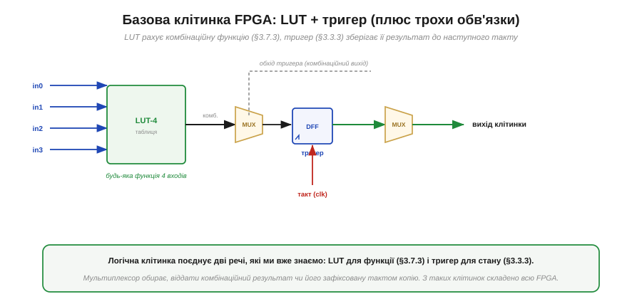
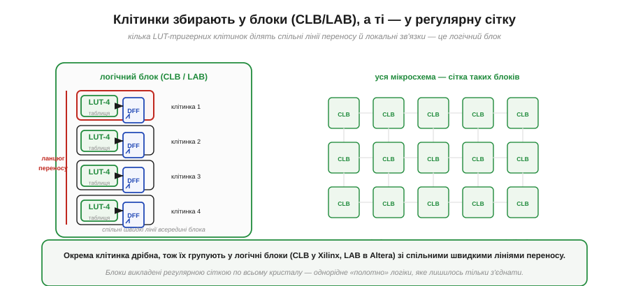
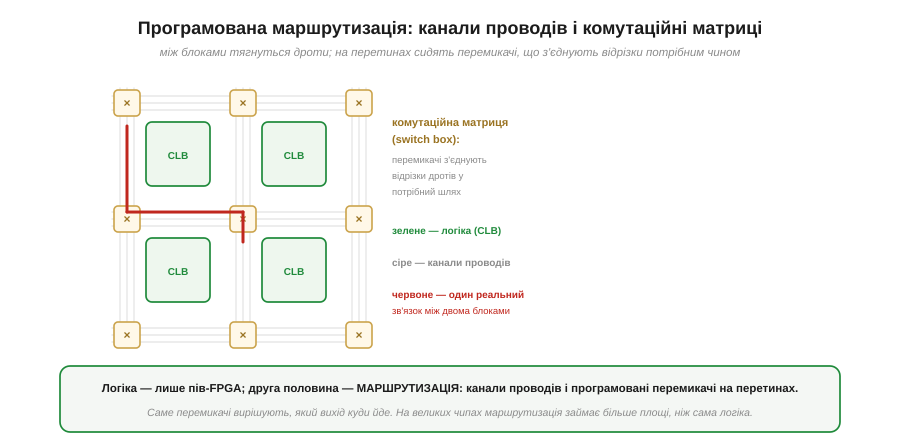
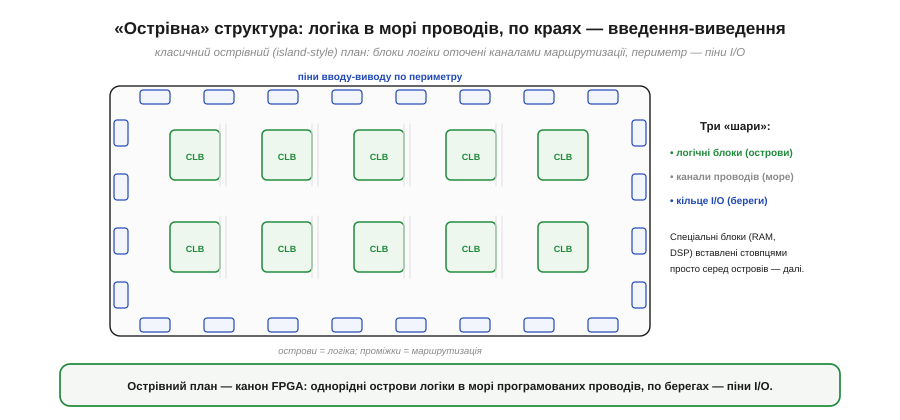
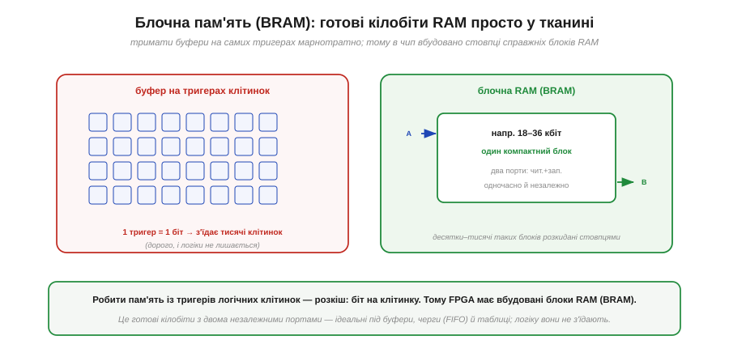
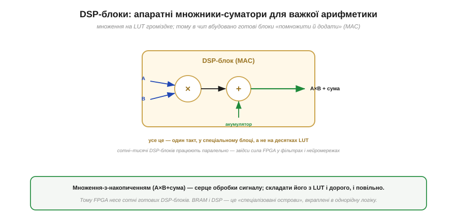

# Усередині FPGA: логічні блоки, маршрутизація, блочна RAM, DSP

[Таблиця істинності — LUT](book:electronics/lut) — потужна, але сама по собі вона лише рахує комбінаційну функцію й нічого не пам'ятає між тактами. Справжня FPGA — це не купа окремих LUT, а **ціла фабрика** з кількох видів блоків, ретельно припасованих один до одного: логічні клітинки, мережа проводів, що їх з'єднує, готові блоки пам'яті й спеціальні арифметичні блоки. Розгляньмо цю фабрику знизу вгору: від найдрібнішої клітинки до того, як із них збирається весь кристал, а тоді додамо «спеціальні острови», без яких сучасна FPGA була б безпорадною. Почнімо з тієї самої клітинки, до якої LUT додає те, чого їй бракувало, — **пам'ять**.

### Базова клітинка: LUT плюс тригер

Щоб клітинка вміла не лише рахувати, а й **пам'ятати**, до LUT приставляють пару — [тригер](book:electronics/d-flip-flop), елемент, що зберігає [стан між тактами](book:electronics/state-memory). Ця пара і є атом, з якого складено всю логіку FPGA.

*Рис. Логічна клітинка: **LUT** рахує комбінаційну функцію входів, а **тригер** фіксує її результат по фронту такту. Мультиплексор обирає, віддати назовні **комбінаційний** вихід (прямо з LUT) чи **реєстровий** (із тригера). Такт приходить на тригер. Із таких клітинок складено всю тканину FPGA.*

Уся міць цієї крихітної схеми — у тому, що вона поєднує **обидві** половини цифрової електроніки. LUT — це [комбінаційна логіка](book:electronics/combinational-circuits): миттєва функція від входів. Тригер — це [пам'ять стану](book:electronics/state-memory): значення, зафіксоване тактом і збережене до наступного фронту. Мультиплексор на виході дозволяє взяти одне з двох — і саме завдяки цьому вибору одна й та сама клітинка може бути то чистою логікою (коли потрібен миттєвий результат), то регістром (коли потрібно запам'ятати). Помножте цю гнучкість на тисячі чи мільйони клітинок — і ви маєте полотно, на якому можна «намалювати» будь-яку синхронну цифрову схему. Та тримати мільйони клітинок поодинці незручно, тож їх групують.

### Клітинки в блоках, блоки в сітці

Окрема клітинка надто дрібна, щоб бути одиницею організації. Тому кілька клітинок об'єднують у **логічний блок** зі спільними швидкими лініями, а блоки викладають **регулярною сіткою** по всьому кристалу.

*Рис. Кілька LUT-тригерних клітинок об'єднані в **логічний блок** (CLB у Xilinx, LAB в Altera) зі спільним **ланцюгом переносу** (швидкою лінією для арифметики) та локальними зв'язками. Уся мікросхема — однорідна **сітка** таких блоків; між ними проходить програмована маршрутизація.*

Це групування — не просто впорядкування, а оптимізація. Клітинки в одному блоці з'єднані **короткими швидкими** лініями, тож логіку, що тісно взаємодіє, інструмент намагається покласти поруч — і вона працює швидше. Особливо важливий **ланцюг переносу** (*carry chain*) — спеціальна пряма лінія між сусідніми клітинками: вона потрібна для додавання багатобітних чисел, де перенос біжить від молодшого розряду до старшого (як у [позиційному записі](book:math/positional-systems)), і без неї суматори були б помітно повільніші. А над усім цим — **регулярність**: однаковий блок, повторений тисячі разів, утворює рівне «полотно» логіки. Лишається ключове питання: як ці блоки **з'єднати** між собою так, щоб вихід будь-якого міг дійти до входу будь-якого іншого?

### Маршрутизація: половина чипа — це проводи

Ось відповідь, і вона часто дивує новачків: **більша частина** площі FPGA зайнята не логікою, а **проводами** та перемикачами, що ними керують. Адже мало мати мільйон клітинок — треба вміти з'єднати будь-яку з будь-якою, причому по-різному для кожного дизайну.

*Рис. Між логічними блоками тягнуться **канали проводів** (сірі), а на їхніх перетинах сидять **комутаційні матриці** (switch box, бурштинові): програмовані перемикачі, що з'єднують відрізки дротів у потрібний шлях. Червоним показано один прокладений зв'язок між двома блоками. Саме перемикачі вирішують, який вихід куди йде; на великих чипах маршрутизація займає більше площі, ніж логіка.*

Тут ховається ключова відмінність FPGA від [ранніх програмованих мікросхем на кшталт CPLD](book:electronics/pal-to-fpga). У CPLD зв'язки йшли через одну передбачувану центральну матрицю; у FPGA маршрутизація **розподілена** по всьому кристалу — сітка каналів і безліч перемикачів на перетинах. Кожен перемикач — це, по суті, ще одна комірка конфігурації: вона каже, чи з'єднати даний відрізок дроту з сусіднім. Заливаючи конфігурацію, ми задаємо не лише вміст усіх LUT, а й положення **всіх** цих перемикачів — і так із однорідної сітки народжується конкретна схема з'єднань. Плата за гнучкість — затримка: сигнал, що йде здалеку крізь багато перемикачів, повільніший за сусідський, і це прямо вплине на [швидкість дизайну](book:electronics/fpga-timing). Якщо глянути на всю цю конструкцію згори, проступає характерний візерунок, який інженери називають острівним.

### Острівна структура: логіка в морі проводів

Загальний план типової FPGA має промовисту назву — **острівний** (*island-style*): острівці логіки, омиті морем маршрутизації, а по берегах кристала — контакти із зовнішнім світом.

*Рис. Класичний план: логічні блоки — **острови** (зелені) — оточені **каналами маршрутизації** (море), а весь периметр кристала зайнятий **пінами вводу-виводу** (I/O, сині), якими FPGA спілкується із зовнішнім світом. Спеціальні блоки (RAM, DSP) вставлені стовпцями просто серед островів.*

Ця картина зводить докупи всі три шари. **Острови** — це логічні блоки з клітинок (LUT + тригер). **Море** — це канали проводів і комутаційні матриці. А **береги** — це піни вводу-виводу (*I/O pads*): контакти на краю кристала, через які сигнали заходять у FPGA і виходять із неї до решти плати. Кожен такий пін теж гнучкий — його можна налаштувати на потрібний [логічний рівень](book:electronics/logic-families) і напрямок. Виходить струнка триярусна організація: логіка рахує, маршрутизація з'єднує, піни сполучають із світом. Але на самих лише LUT-клітинках сучасну FPGA не збудуєш — дві дуже поширені задачі вони виконують украй марнотратно, і саме тому серед островів вставлено блоки іншого роду.

### Блочна пам'ять: готові кілобіти RAM

Перша така задача — **зберігати дані**. Тригер у клітинці тримає рівно один біт; зробити з них буфер на кілька кілобайтів — божевільне марнотратство. Тому FPGA несе вбудовані **блоки пам'яті**.

*Рис. Робити буфер на тригерах клітинок (ліворуч) — це біт на цілу клітинку, тисячі клітинок на дрібний буфер. Тому в чип вбудовано **блочну RAM** (BRAM, *block RAM*): компактні блоки на 18–36 кбіт кожен, зазвичай **двопортові** (можна одночасно й незалежно читати з одного порту й писати в інший). Десятки чи тисячі таких блоків розкидані стовпцями по кристалу.*

Логіка тут проста й переконлива. Пам'ять — це регулярна, щільна структура, яку [в кремнії роблять дуже компактно](book:physics/memory-cell-physics); відтворювати її з універсальних тригерів означало б платити в десятки разів більше площі за той самий обсяг. Тому розробники чипа заздалегідь вбудовують **спеціалізовані** блоки RAM — і вони ідеально лягають на типові потреби цифрових схем: буфери відео, черги (FIFO), таблиці коефіцієнтів, невелика пам'ять для [м'якого процесора](book:electronics/soft-core). Особливо цінна **двопортовість**: один бік схеми пише в буфер, а інший тієї ж миті читає — те, що постійно потрібно в конвеєрній обробці потоку. Друга марнотратна задача — арифметика, і для неї є свій спеціальний блок.

### DSP-блоки: апаратне множення

Друге, що погано дається самим лише LUT, — це **множення**. Скласти два числа дешево (ланцюг переносу допомагає), а от помножити — це купа додавань і зсувів, що з'їдає сотні LUT на один множник. Для задач обробки сигналу, де множення — основна операція, цього не пробачиш, тож у FPGA вбудовують готові **DSP-блоки**.

*Рис. **DSP-блок** містить готовий апаратний **множник** і **суматор-акумулятор** — операцію «помножити й додати» (MAC, *multiply-accumulate*: A×B + сума) за один такт у спеціальному блоці, а не на десятках LUT. Сотні чи тисячі таких блоків працюють паралельно — звідси сила FPGA у цифрових фільтрах і нейромережах.*

Чому саме «помножити й додати», а не просто «помножити»? Бо ця парна операція — **серце** майже всієї обробки сигналу. Цифровий фільтр множить кожен відлік на коефіцієнт і **накопичує** суму; множення матриць робить те саме; згортка в нейромережі — теж. Маючи сотні DSP-блоків, FPGA виконує сотні таких MAC-операцій **одночасно** за один такт — це і є та [апаратна паралельність](book:electronics/programmable-logic), доведена до досконалості. BRAM і DSP завершують картину: до однорідного «моря» універсальних клітинок додано **спеціалізовані острови** — пам'ять і арифметику, — і саме поєднання універсального з спеціалізованим робить сучасну FPGA такою продуктивною.

> 🔧 **Навіщо це.** Знати внутрішню будову означає **тверезо оцінювати, що влізе у ваш чип і як швидко працюватиме**. По-перше, FPGA характеризують **чотирма ресурсами**: кількість LUT (логіка), тригерів (стан), блоків BRAM (пам'ять) і DSP (множники) — і дизайн «не влазить», якщо вичерпано **будь-який** із них, навіть коли решта вільна; тому, обираючи чип, дивляться на всі чотири числа. По-друге, **користуйтеся спеціальними блоками**: тримати буфер у BRAM, а не «в логіці», і доручати множення DSP-блокам — це і економія LUT, і вища швидкість. По-третє, пам'ятайте про **маршрутизацію**: коли дизайн заповнює чип під зав'язку, сигналам стає тісно в каналах, і затримка зростає — інколи варто лишати запас. Ця внутрішня картина — підмурок і для [таймінгу дизайну](book:electronics/fpga-timing), і для [вибору між FPGA та мікроконтролером](book:electronics/fpga-vs-mcu).

> 🔌 **Загляньте у вставку:** [Перші FPGA-плати хобіста: плати iCE40- і Gowin-класу](comp-hobby-fpga-boards.md) — що саме розпаяно поряд із чипом (флеш для бітстріму, генератор такту, рівні I/O) і чому.
