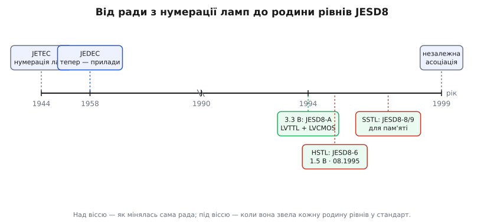

# 📜 JEDEC: хто дав напругам спільну мову

Уявіть інженера 1993 року. У нього на столі — новий чип на 3.3 вольта від однієї фірми і мікросхема пам'яті на 3.3 вольта від іншої. Обидва «низьковольтні», обидва «сумісні з TTL» — так написано в їхніх документах. Він з'єднує їх, вмикає живлення, і половина бітів губиться. Виявляється, «сумісний із TTL» одна фірма розуміла як «вхід визнає одиницю від 2.0 В», а друга — як «від 2.4 В». Одне слово, два різні числа, зіпсована плата.

Ця стаття про те, як індустрія позбулася таких пасток. Про раду, чиєї назви більшість інженерів не знають повністю, хоч читають її абревіатуру щодня в кожному документі на мікросхему: **JEDEC**. І про те, чому без спільного органу, який просто домовляється, «одиниця» — це скільки вольтів, увесь світ низьковольтної логіки розсипався б на несумісні діалекти.

## Навіщо взагалі рада, а не просто ринок

Здавалося б, ринок мав би сам усе владнати: хто робить сумісні чипи — того й купують. Але тут криється пастка, яку економісти звуть **проблемою координації**, а інженери знають на власних синцях.

Уявімо дві фірми, кожна робить логіку на 3.3 В. Перша вирішує: «нехай мій вихід у стані одиниці гарантує 2.4 В, цього досить». Друга: «а мій вхід визнаватиме одиницю лише від 2.5 В — так надійніше». Кожне рішення саме по собі розумне. Разом — катастрофа: вихід першої дає 2.4, вхід другої хоче 2.5, і біт не читається. Ніхто не зробив помилки, а система не працює.

Ринок такого сам не розв'яже, бо кожна фірма оптимізує **своє**, не бачачи чужих чисел. Потрібен хтось, хто сяде за стіл із усіма й скаже: «Домовмося раз. Одиниця на виході — не менше **ось стільки**. Вхід визнає одиницю — від **ось стільки**. І тоді будь-чий вихід влучить у будь-чий вхід». Це не наука — тут нема що відкривати. Це **домовленість**, і хтось має її зафіксувати так, щоб їй вірили всі.

> 🔧 **Навіщо це.** Коли ви відкриваєте документ на мікросхему й бачите рядок «Compliant with JESD8-B», ви читаєте обіцянку: цей чип грає за спільними правилами напруг, а не за власними. Саме тому два чипи від фірм, які ніколи одна про одну не чули, з'єднуються навпростець і працюють — за них уже домовилися. Без такого рядка кожне з'єднання довелося б перевіряти по чотирьох числах вручну; з ним — довіряєш стандарту.

Ось для цього й існує JEDEC. Не щоб винаходити — щоб **узгоджувати** те, що всім вигідно робити однаково.

## Рада, що починалася з ламп

Найцікавіше, що народилася ця рада задовго до всякої логіки на 3.3 В — і зовсім не заради напруг. Заради **номерів**.

Розкрутимо абревіатуру. Сьогодні **JEDEC** офіційно розшифровують як *Joint Electron Device Engineering Council* — «Спільна інженерна рада з електронних приладів». Але спершу літера «D» означала не *Device*, а ***Tube*** — лампу. Рада зародилася 1944 року під назвою **JETEC** (*Joint Electron Tube Engineering Council*, «Спільна інженерна рада з електронних ламп»), і заснували її дві американські асоціації виробників — RMA (згодом перейменована на EIA, *Electronic Industries Association*) та NEMA. *(Статус: підтверджено — і власна історія JEDEC, і незалежні довідники сходяться на 1944 як рік заснування JETEC.)*

Навіщо виробникам ламп спільна рада? Заради тієї самої проблеми координації, лише в дрібнішому вигляді. Радіоламп у 1940-х були сотні типів від десятків фірм, і кожна фірма звала свою лампу як хотіла. Ремонтник, що шукав заміну згорілій лампі, тонув у цьому хаосі назв. JETEC узяла на себе просту, але страшенно корисну справу: **єдину систему номерів приладів**. Одна лампа — один загальновизнаний номер, який означає те саме в будь-якому каталозі.

Коли на зміну лампам прийшов транзистор, стало ясно: та сама рада має нумерувати й напівпровідники. **1958 року** її перейменували з JETEC на JEDEC — «T» (tube, лампа) поступилося «D» (device, прилад). *(Статус: підтверджено — 1958 як рік переходу до «Device» дають і джерела самої ради, і Wikipedia.)* Саме звідси, з тієї нумераційної роботи, пішли позначення, які ви й досі бачите на корпусах: діоди з префіксом **1N** (як-от 1N4148), транзистори з **2N** (як-от 2N2222). Ці «1N» і «2N» — не марка фірми й не таємний код; це **реєстраційні номери JEDEC**, де цифра спереду каже, скільки в приладі виводів-переходів. Один прилад — один номер, зрозумілий усім. Та сама ідея, що колись для ламп.


*Спершу рада впорядковувала номери ламп і транзисторів; коли настала доба низьковольтної логіки, та сама звичка «домовитися раз для всіх» породила родину рівнів JESD8.*

Тримайте цю нитку в голові: **JEDEC із самого початку — це орган про сумісність через спільну домовленість.** Спершу домовлялися про номери. Згодом — про напруги. Механізм той самий; змінився лише предмет.

## Зоопарк напруг, який треба було приборкати

Тепер перенесімося в кінець 1980-х — початок 1990-х, коли й визріла потреба домовитися вже про рівні.

Десятиліттями цифровий світ жив на **п'яти вольтах**. Логіка серії 74, перші процесори, пам'ять — усе на 5 В, усе з порогами, успадкованими від TTL: нуль до 0.8 В, одиниця від 2.0 В. Один світ, одна напруга, ніяких непорозумінь. *(Ті пороги 0.8 і 2.0 — не випадкові числа, а прямий наслідок фізики двох переходів біполярного транзистора; звідки саме взялося живлення 5 В і як його пороги успадкувала вся наступна логіка — окрема історія.)*

І тут п'ять вольтів почали заважати. Кристали густішали, транзисторів на них ставало мільйони, і кожен, перемикаючись, гріється. Потужність перемикання росте як **квадрат** напруги:

```
P ∝ f · C · V²
```

тобто, впавши з 5 до 3.3 В, ви гасите тепловиділення майже вдвічі (3.3² / 5² ≈ 0.44) — без жодних інших змін. Додайте до цього, що тонший кремній новіших техпроцесів просто фізично не тримає 5 В на затворі, — і напрямок стає неминучим: **живлення треба опускати**.

Але щойно різні фірми кинулися опускати живлення, кожна по-своєму, — відродилася давня проблема координації, тепер уже страшніша. Хтось робив логіку на 3.3 В із CMOS-виходами «майже до рейки»; хтось — на 3.3 В, але з TTL-подібними виходами заради сумісності зі старим; хтось цілився нижче, на 2.5 і 1.8 В. І кожен ставив свої пороги входу. Виникав саме той **зоопарк**: купа «низьковольтних» чипів, які звалися сумісними, а насправді говорили різними числами. Інженер із початку цієї статті — жертва саме цього хаосу.

Хтось мусив сісти й домовитися. Цим хтось стала JEDEC — рада, у якої вже пів століття був той самий рефлекс: коли в галузі розповзається зоопарк, зведи його в один спільний документ.

## Родина JESD8: одна полиця для всіх рівнів

Документ, у якому JEDEC зафіксувала рівні низьковольтної логіки, дістав ім'я **JESD8** (*JEDEC Standard No. 8*). Це не один аркуш, а ціла **родина**: базовий стандарт і низка додатків (англ. *addendum*), кожен описує свою родину рівнів. Ім'я додатка — це номер із дефісом: JESD8-6, JESD8-9 і так далі. Пройдімося по тих, що стали хребтом усієї сучасної цифрової техніки.

### 1994: 3.3 вольта отримують закон

Першим і найважливішим кроком був **стандарт на 3.3 В**. JEDEC випустила його як **JESD8-A** у **червні 1994 року**. *(Статус: підтверджено — червень 1994 для JESD8-A дають і документні бази, і сама JEDEC; пізніше його заступив JESD8-B у вересні 1999.)*

Геніальність цього документа не в новизні, а в тому, **що саме він зафіксував**. Він визначив не одну домовленість, а **дві сумісні** — два класи для одного й того самого живлення 3.3 В:

```
клас             вихід «1»     вихід «0»    задум
LVTTL-сумісний   VOH ≥ 2.4     VOL ≤ 0.4    порозумітися зі старим 5-В TTL-світом
LVCMOS-сумісний  VOH ≥ 3.2     VOL ≤ 0.1    тягнути від рейки до рейки, ширший запас
```

Ключ у тому, що **пороги входу в обох — ті самі**, TTL-успадковані: одиницю визнають від 2.0 В, нуль — до 0.8 В. Різниця лише у виходах. І це зроблено навмисне: LVTTL-вихід (2.4 В угорі) все ще влучає у старий 5-вольтовий TTL-вхід (якому досить 2.0 В), а LVCMOS-вихід тягне майже до рейки, даючи ширший запас там, де сумісність зі старим не потрібна. Одним документом JEDEC зшила два покоління логіки й дала галузі спільну мову для 3.3 В. *(І LVCMOS, і LVTTL як окремі позначення виросли саме з цього тексту — до нього це були радше маркетингові слова кожної фірми, а не спільна норма.)*

Ось у чому справжня вага цього кроку. До JESD8-A напис «3.3 В, сумісний з TTL» був **обіцянкою фірми самій собі**. Після — це **посилання на спільний документ**, який може розгорнути й перевірити будь-хто. Слово «сумісний» перестало залежати від того, хто його вимовляє. Саме це врятувало сумісність між виробниками: не якийсь хитрий винахід, а те, що всі почали міряти одним метром.

### Серпень 1995: HSTL для швидкості

Наступним у родині став стандарт для чистої **швидкості**. Коли логіці треба обмінюватися даними на сотнях мегагерц — між вентильними матрицями (FPGA), швидкою статичною пам'яттю, буферами, — гнати сигнал на повний розмах 0…3.3 В стає марнотратно: щоразу заряджаєш ємність доріжки на всі три вольти, а це час, струм і завади. Рішення — **малий розмах довкола винесеної опори** плюс узгодження кінця лінії.

JEDEC звела це в стандарт **JESD8-6** під назвою **HSTL** (*High-Speed Transceiver Logic*, «швидкісна приймач-передавальна логіка»), ухвалений **1 серпня 1995 року**. *(Статус: підтверджено — і дата 1 серпня 1995, і номер JESD8-6 збігаються в документних базах та у власному описі JEDEC.)* Живлення обрали 1.5 В, опору VREF поклали на його половину, ~0.75 В, а сам документ прямо називає себе інтерфейсом для приладів, що працюють на частотах **понад 200 МГц**.

Важлива тонкість, яку варто вимовити чітко: попри слово «Transceiver logic» у назві, HSTL — не про біполярну логіку, а **інтерфейс на основі CMOS**. Назва каже, що́ він робить (швидко приймає-передає), а не з чого зроблений усередині. Це типова пастка: за словом у назві стандарту легко приписати чипу не ту технологію. HSTL народжений для високовольтних за мірками того часу CMOS- і BiCMOS-приладів із великою кількістю виводів — саме там малий розмах давав виграш.

### Кінець 1990-х: SSTL стає мовою пам'яті

Третій хребет родини виріс під конкретну задачу — **пам'ять**. Процесори прискорювалися швидше, ніж шина до пам'яті встигала їх годувати, і стара LVTTL-логіка на цій шині стала вузьким місцем: замало швидкості, забагато завад на повному розмаху.

JEDEC відповіла родиною **SSTL** (*Stub Series Terminated Logic*, «логіка з послідовним узгодженням відгалужень») — і цим займався окремий підрозділ ради, комітет **JC-16** з інтерфейсної технології, той самий, що вів і HSTL. *(Статус: підтверджено — JC-16 «Interface Technology» справді відповідає за рівні напруг цифрових мікросхем, зокрема SSTL і HSTL; пам'яттю як такою відає інший комітет, JC-42.)* Назва описує топологію дослівно: чипи пам'яті висять **відгалуженнями** (англ. *stub*, «пеньок») від спільної шини, кожне з **послідовним резистором** біля драйвера, що гасить відбиття від короткого пенька, плюс термінація на кінці лінії.

Хронологія тут показова — родина спускалася по напрузі разом із поколіннями пам'яті:

```
варіант   стандарт      живлення   де застосовано   коли
SSTL_3    JESD8-8       3.3 В      рання швидка RAM  ~1996
SSTL_2    JESD8-9       2.5 В      DDR               кінець 1990-х
SSTL_18   JESD8-15      1.8 В      DDR2              початок 2000-х
SSTL_15   —             1.5 В      DDR3              пізніше
```

*(Статус: підтверджено — першим був SSTL_3 на 3.3 В у JESD8-8, орієнтовно 1996 рік, задуманий під швидку основну пам'ять на частотах понад 125 МГц; далі SSTL_2 у JESD8-9 під першу DDR, SSTL_18 у JESD8-15 під DDR2. Точні місяці окремих додатків різняться по редакціях, тож наводжу роки з обережністю.)* Логіка від покоління до покоління та сама — малий розмах довкола опори VREF = VDDQ/2 плюс термінація; змінюється лише напруга, дедалі нижча заради швидкості й економії. Коли ви бачите на материнській платі окрему мікросхему-регулятор поруч зі слотами пам'яті, що робить якусь дивну «половинну» напругу, — це джерело VTT/VREF для SSTL, пряме породження цих стандартів.

## Як влаштована сама домовленість

Варто на мить зазирнути, **як** така рада ухвалює число. Бо тут криється причина, чому стандартам JEDEC узагалі можна вірити.

JEDEC — не одна людина й не одна фірма, що диктує іншим. Це **консорціум виробників**, які зустрічаються в тематичних комітетах (той-таки JC-16 з інтерфейсів, JC-42 з пам'яті) і **разом голосують** за кожен пункт. Коли на столі питання «яким має бути VOH для LVTTL», за ним сидять і ті, хто робить процесори, і ті, хто робить пам'ять, і ті, хто робить FPGA. Число, яке вийде з такої кімнати, — компроміс, вигідний **усім** водночас, а не одному. Саме тому конкурент, який голосував разом з іншими, потім чесно тримає цю норму у своєму чипі: він сам її й ухвалив.

У цьому вся сила підходу. Стандарт JEDEC сильний не тому, що хтось згори наказав, а тому, що його **разом виробили ті, хто ним користуватиметься**. Домовленість, під якою підписалися всі гравці, тримається краще за будь-який припис.

> 🔧 **Навіщо це.** Ось чому в середовищі проєктування FPGA список стандартів на вивід — LVCMOS33, LVCMOS18, SSTL15, HSTL_I — це не абстрактні позначки, а прямі посилання на конкретні документи JEDEC, за якими вже проголосувала вся галузь. Обираючи пункт зі списку, ви обираєте не «стиль», а **гарантований усіма набір напруг**, який точно порозуміється з будь-яким іншим чипом, що заявляє той самий стандарт. Ланцюжок довіри тягнеться від того рядка в конфігурації аж до кімнати, де за це число колись підняли руки.

## Що лишилося від тієї ради на вашій платі

Повернімося до інженера з початку. Сьогодні його наступник з'єднує два чипи від двох незнайомих фірм, бачить в обох документах «JESD8-B» — і просто вмикає живлення, не рахуючи чотирьох чисел уручну. Біти долітають цілими. Ця буденна впевненість — і є результат роботи JEDEC.

Простежмо всю нитку ще раз, бо вона напрочуд пряма. Рада, що 1944 року взялася нумерувати радіолампи, засвоїла один рефлекс: **коли в галузі розповзається зоопарк, зведи його в спільну домовленість, під якою підпишуться всі**. Спершу це були номери ламп, потім — префікси 1N/2N для діодів і транзисторів. А коли п'ять вольтів стали заважати й кожна фірма кинулася опускати живлення по-своєму, той самий рефлекс породив родину JESD8: 3.3 В у 1994-му, HSTL у 1995-му, SSTL наприкінці 1990-х. Різні задачі — сумісність, швидкість, пам'ять, — але один механізм: сісти за стіл і домовитися, «одиниця» — це скільки вольтів.

Тому кожен рядок «Compliant with JESD8» у документі на мікросхему — це не формальність, а обіцянка, за якою стоїть кімната з конкурентами, що колись разом підняли руки за конкретне число. Саме ця обіцянка й дозволяє двом кристалам, які ніколи не «бачили» один одного, домовитися, як виглядає біт, — і не загубити його.
