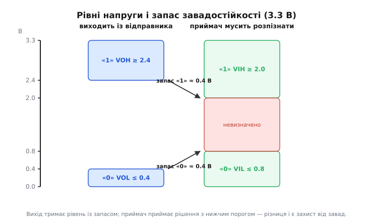
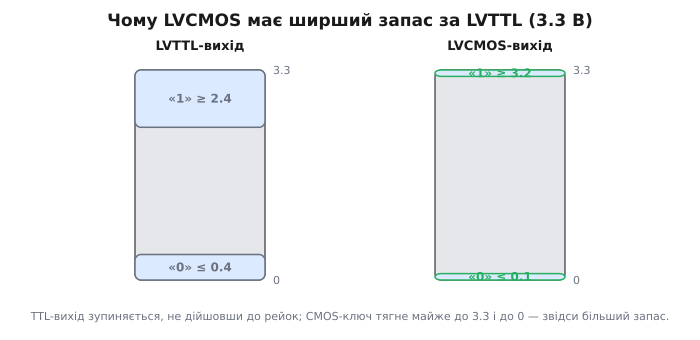
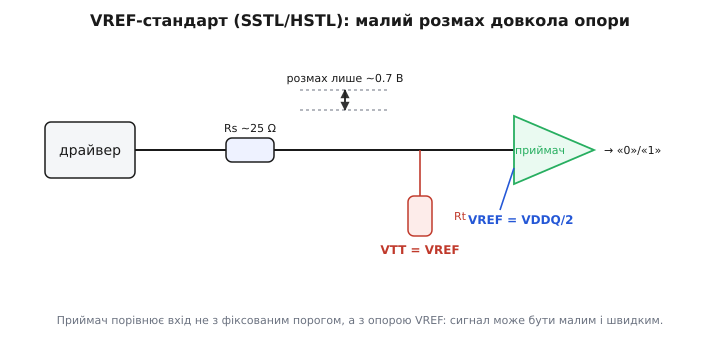

# Стандарти вхід/вихід (LVCMOS, LVTTL, SSTL, HSTL)

Два кристали на платі мають домовитися, як виглядає одиниця, а як — нуль. Здавалося б, дрібниця: вище — «1», нижче — «0». Але щойно ми питаємо «вище за що саме?» і «наскільки вище має тягнути той, хто передає, щоб той, хто приймає, не помилився під час завади», — виявляється, що за цим стоїть ціла інженерна домовленість. Її й називають **стандартом входу/виходу** (англ. *I/O standard*, від *input/output*): набір напруг і правил, за якими вивід одного чипа під'єднують до входу іншого, щоб біт долетів цілим.

Стандартів багато не з примхи. Логіка на 5 вольтах, логіка на 3.3, пам'ять DDR на своїх правилах — усе це різні світи, бо їх народжували різні задачі: одна берегла сумісність зі старим, інша економила живлення, третя гналася за швидкістю. Розберімося, звідки беруться числа в цих правилах і чому чотири згадані родини влаштовані так, а не інакше.

## Що взагалі означає «рівень»

Уявімо найпростіше з'єднання: вивід передавача проводом іде до входу приймача. Передавач тягне провід або до напруги живлення (це буде «1»), або до землі (це «0»). Приймач вимірює напругу на своєму вході й вирішує, який це біт.

Якби провід був ідеальний і завад не існувало, вистачило б однієї межі: понад половину живлення — одиниця, нижче — нуль. Але провід ловить наводки від сусідніх доріжок, земля «стрибає» під час перемикань, живлення просідає. Напруга на вході тремтить. Якщо межа одна, найменше тремтіння біля неї перекине рішення — і біт зіпсується.

Тому в кожному стандарті чисел не два, а чотири, і вони описують **дві сторони окремо**.

Бік передавача — що він **гарантує на виході**:

```
VOH  (Output High) — НАЙНИЖЧА напруга, яку вихід дає у стані «1»
VOL  (Output Low)  — НАЙВИЩА  напруга, яку вихід дає у стані «0»
```

Бік приймача — що він **зобов'язується розпізнати на вході**:

```
VIH  (Input High) — найнижча напруга, яку вхід ще прийме як «1»
VIL  (Input Low)  — найвища  напруга, яку вхід ще прийме як «0»
```

Літери прості: *V* — напруга (англ. *voltage*), *O* — вихід (*output*), *I* — вхід (*input*), *H*/*L* — високий/низький (*high*/*low*).

Головна ідея — у зазорі між цими числами. Стандарт складають так, щоб передавач у стані «1» тримав **вище**, ніж мінімум, який приймач ще визнає за «1»; і в стані «0» тримав **нижче**, ніж максимум, який приймач ще визнає за «0». Ця різниця й називається **запас завадостійкості** (англ. *noise margin* — «запас на шум»):

```
запас «1» = VOH − VIH      запас «0» = VIL − VOL
```

Наведення мусить з'їсти весь цей запас, перш ніж біт помилиться. Ось чому чотирьох чисел, а не двох: між тим, що передавач *дає*, і тим, що приймач *вимагає*, лишається буфер, у якому живуть усі реальні завади.


*Передавач тримає рівень із запасом, а приймач ставить поріг ближче до середини; різниця між ними і є той захист, який має «з'їсти» завада, перш ніж біт перекинеться.*

> 🔧 **Навіщо це.** Коли на макеті два модулі «майже працюють» — інколи ловлять біт, інколи ні, — перше, куди дивляться: чи сумісні їхні стандарти. Вихід на 1.8 В дає у стані «1» щонайбільше 1.8 В, а вхід на 5 В хоче побачити хоча б 2 В — запасу немає взагалі, «1» просто не читається. Знаючи чотири числа кожного боку, ви за хвилину бачите, полетить біт чи ні, ще до того, як вмикати живлення.

## TTL: звідки взялися 0.8 і 2.0

Найстаріша з живих домовленостей — **TTL** (англ. *Transistor-Transistor Logic*, «логіка на транзисторах»), родина 74-ї серії, що прийшла на початку 1960-х. Живлення — 5 вольтів. Її пороги — 0.8 В для нуля і 2.0 В для одиниці — досі тягнуться крізь усю цифрову техніку, тож варто побачити, звідки вони.

TTL усередині — біполярні транзистори, а вхід перемикається приблизно там, де набирається **два переходи** по ~0.7 В, тобто коло 1.4 В. Це найнижчий розумний поріг для такої схеми. Від нього й відрахували запаси: поставили межу нуля на 0.8 В — це дає близько 0.6 В до точки перемикання; щоб угорі був такий самий запас, межу одиниці підняли на ту саму відстань: 1.4 + 0.6 = 2.0 В. Так народилася класична пара **VIL = 0.8 В, VIH = 2.0 В**. Числа не «красиві», вони — прямий наслідок фізики двох переходів. [Чому взагалі 5 вольтів і як пороги TTL успадкувала вся наступна логіка](topic:electronics/io-standards/hist-ttl-levels.md) — окрема історія з несподіваним коренем.

Виходи TTL при цьому нерівноправні. У нулі вихідний транзистор добре сідає до землі: **VOL ≤ 0.4 В**. А от одиницю бере емітерний повторювач, який не дотягує до 5 В — губить на собі один-два переходи, тож гарантують лише **VOH ≥ 2.4 В**. Порахуймо запаси: угорі 2.4 − 2.0 = 0.4 В, унизу 0.8 − 0.4 = 0.4 В. По 400 мілівольтів з кожного боку — тісно, але роками працювало.

## LVTTL: ті самі пороги, менше живлення

У 1990-х живлення почало падати. П'ять вольтів гріли, а мільйони транзисторів на кристалі перегрівалися; тонший кремній не тримав таку напругу. Логіку перевели на **3.3 вольта**. Але виникло питання сумісності: у світі вже стояли гори 5-вольтових TTL-мікросхем, і новому чипу треба було з ними спілкуватися.

Розв'язок вийшов елегантний: **LVTTL** (*Low-Voltage TTL*, «низьковольтна TTL») лишила **пороги входу ті самі** — VIL = 0.8 В, VIH = 2.0 В, — просто опустила стелю живлення до 3.3 В. Виходи теж успадкувала: VOL ≤ 0.4 В, VOH ≥ 2.4 В.

Чому це працює в один бік майже даром? Старий 5-вольтовий вихід у стані «1» дає ~2.4 В і вище — а новому 3.3-вольтовому входу для одиниці треба лише 2.0 В. Влучає. І навпаки: новий вихід дає у «1» щонайменше 2.4 В, чого старому входу вистачає. Пороги збіглися навмисне — щоб два покоління логіки говорили однією мовою.

Пастка лише одна, і важлива. Опустити напругу на вході 3.3-вольтового чипа з боку 5-вольтового — це подати на нього до 5 В. Не кожен вхід це витримує: у багатьох є захисний діод на шину живлення, і зайві 1.7 В потечуть крізь нього струмом, який спалить вхід. Тому кажуть про **5-вольтову терпимість** (англ. *5 V-tolerant* — «терпить 5 В на вході»): є вона в чипа чи нема — написано в його документі, і це треба перевірити, а не сподіватися. [Як читати ці межі в документі на мікросхему](topic:electronics/datasheet-dc-characteristics) — таблиця DC-характеристик дає всі чотири числа й струми, які вхід/вихід тягне.

## LVCMOS: рейка в рейку, ширший запас

Тепер важливий поворот. Сучасна логіка всередині — не біполярна, а **CMOS** (англ. *Complementary Metal-Oxide-Semiconductor*, «доповнювальна структура метал-оксид-напівпровідник»): пара польових ключів, з яких у кожному стані ввімкнений рівно один. Верхній тягне вихід до живлення, нижній — до землі, і кожен це робить **майже без утрат**. Сама технологія CMOS давня — цифрові КМОН-серії пішли ще з кінця 1960-х; новим у 1990-х був не транзистор, а домовленість про **низьковольтні рівні**, яку JEDEC звів у стандарт (родина JESD8, гілка для 3.3 В — 1994 рік). [JEDEC](topic:electronics/io-standards/hist-jedec.md) — саме та рада, що впорядкувала весь цей зоопарк напруг у спільні правила.

> 🔧 **Навіщо це.** «CMOS» у назві стандарту й «CMOS» як технологія кристала — не одне й те саме. Майже вся сучасна логіка *зроблена* на CMOS-транзисторах, зокрема й та, що на виводах прикидається LVTTL. Стандарт I/O описує лише **рівні на ніжках**, а не те, з чого чип усередині. Плутати їх — типова помилка новачка, що веде до хибних висновків про сумісність.

Наслідок для рівнів прямий. **LVCMOS** (*Low-Voltage CMOS*) при живленні 3.3 В у стані «1» тягне вихід аж до **VOH ≥ 3.2 В**, а в «0» сідає до **VOL ≤ 0.1 В** — практично **від рейки до рейки** (англ. *rail-to-rail*, «від шини до шини»). Порівняймо з LVTTL, що зупинявся на 2.4 В і 0.4 В:

```
              VOH («1»)   VOL («0»)
LVTTL  3.3 В   ≥ 2.4       ≤ 0.4
LVCMOS 3.3 В   ≥ 3.2       ≤ 0.1
```

Пороги входу LVCMOS лишає такими самими, LVTTL-сумісними (VIH = 2.0 В, VIL = 0.8 В), тож він **розуміє LVTTL напряму**. Зате запас у нього значно ширший: у стані «1» тепер 3.2 − 2.0 = 1.2 В замість 0.4. Той самий приймач, ті самі пороги — а захист від завад утричі більший, бо передавач тягне ближче до країв. Ось чому на нових платах між своїми чипами майже завжди LVCMOS: він дає найбільший запас безкоштовно.


*TTL-вихід не доходить до шин живлення, бо одиницю віддає повторювач; CMOS-ключ сідає майже на самі рейки — звідси ширший запас при тих самих порогах приймача.*

LVCMOS живе не лише на 3.3 В. Ту саму ідею «рейка в рейку» повторили для **2.5 В, 1.8 В, 1.5 В, 1.2 В** — кожне нижче живлення економить енергію, бо потужність перемикання росте як квадрат напруги. Але з падінням живлення падає й **весь розмах сигналу**: у 1.8-вольтовому LVCMOS одиниця — це трохи менше 1.8 В, і подати такий сигнал на 3.3-вольтовий вхід, що хоче 2.0 В, уже не можна. Тут з'являється потреба у **зсуві рівнів** — окремому вузлі, що перекладає сигнал з одного світу напруг в інший. [Зсув рівнів](topic:electronics/level-shifter) розв'язує саме цей випадок: як з'єднати логіку на різних напругах, коли прямої сумісності немає.

### Приклад: чи полетить біт між двома логіками

Перевіряти сумісність зручно просто числами. Ось коротка функція прошивки, що звіряє два боки з'єднання — так само, як інженер це робить у голові:

**Умова.** Передавач із виходами (VOH, VOL) заводимо на вхід із порогами (VIH, VIL). Чи розпізнає приймач обидва стани із запасом?

```c
#include <stdio.h>

// напруги в мілівольтах, щоб не морочитися з float
typedef struct { int voh, vol; } driver_t;   // що вихід ГАРАНТУЄ
typedef struct { int vih, vil; } receiver_t;  // що вхід ВИМАГАЄ

int link_ok(driver_t d, receiver_t r, int *margin_hi, int *margin_lo) {
    *margin_hi = d.voh - r.vih;   // запас у стані «1»
    *margin_lo = r.vil - d.vol;   // запас у стані «0»
    return (*margin_hi > 0) && (*margin_lo > 0);
}

int main(void) {
    driver_t   lvcmos18 = { .voh = 1700, .vol = 100 };  // 1.8 В LVCMOS
    receiver_t lvttl33  = { .vih = 2000, .vil = 800 };  // 3.3 В LVTTL-вхід

    int mh, ml;
    if (link_ok(lvcmos18, lvttl33, &mh, &ml))
        printf("OK: запас +%d/%d мВ\n", mh, ml);
    else
        printf("НІ: запас %d/%d мВ — «1» не читається\n", mh, ml);
    return 0;
}
```

Тут `margin_hi = 1700 − 2000 = −300` — від'ємний, тобто передавач у «1» не дотягує навіть до порога входу. Програма надрукує `НІ: запас -300/700 мВ`. Нуль читався б (запас 700 мВ), а от одиниця — ні: без зсувача таке з'єднання не працює. Той самий передавач на **LVCMOS-3.3** вхід (VIH теж 2.0 В) не врятує — річ не в приймачі, а в тому, що передавач фізично не дає 2 В. Числа кажуть це відразу, ще до паяльника.

## VREF-стандарти: коли поріг стає окремим дротом

Досі поріг «жив усередині» приймача: чип сам знав, що 1.4 В (чи 2.0) — межа. Для повільної логіки цього досить. Але коли пам'ять розганяється до сотень мегагерц, така схема ламається — і ось чому.

Швидкість вимагає **малого розмаху**. Гнати сигнал від 0 до 3.3 В сотні мільйонів разів на секунду означає щоразу заряджати й розряджати ємність доріжки на повний розмах — це і час, і струм, і завади. Хочеться розмах зменшити, скажімо до 0.7 В. Але тоді фіксований внутрішній поріг стає ненадійним: якщо просяде живлення чи нагріється кристал, «середина» попливе, а вгадати малий сигнал відносно неї важко.

Розв'язок — **винести поріг назовні окремим дротом**. Це і є ідея **VREF-стандартів**: на плату кладуть опорну напругу **VREF** (англ. *reference*, «опора»), рівно посередині розмаху, і подають її на всі приймачі. Вхід тепер не звіряється з фіксованим числом усередині — він працює як **компаратор**: більше за VREF — «1», менше — «0». Опора пливе разом із живленням, приймач пливе разом із нею, і мале коливання сигналу все одно впевнено читається. [Компаратор](topic:electronics/comparator) — це якраз вузол, що порівнює вхід з опорною напругою й видає чистий цифровий результат; VREF-приймач влаштований так само.


*Замість фіксованого порога — окремий дріт з опорою VREF посередині розмаху; приймач лише порівнює вхід із нею, тому сигнал може бути малим і швидким.*

Малий розмах приносить другу проблему — **відбиття**. На частотах у сотні мегагерц доріжка поводиться як лінія передавання: сигнал, дійшовши до кінця, відбивається назад, накладається на наступний і псує його. Мала амплітуда цього не пробачає. Тому VREF-стандарти обов'язково несуть **термінацію** (англ. *termination*, «узгодження кінця лінії»): резистор гасить відбиття, підтягуючи лінію до напруги **VTT** (*termination voltage*), яку зазвичай беруть рівною VREF. [Чому неузгоджена лінія відбиває сигнал](topic:electronics/power-matching) — це та сама фізика узгодження опорів, що й у радіочастотних кабелях.

Саме на цьому стоять дві родини — **SSTL** і **HSTL**.

### SSTL — мова пам'яті DDR

**SSTL** (англ. *Stub Series Terminated Logic*, «логіка з послідовним узгодженням відгалужень») JEDEC звів у стандарт наприкінці 1990-х саме під пам'ять. Процесори прискорювалися швидше за шину до пам'яті, і стара LVTTL-логіка не встигала — треба було швидше й з меншими завадами.

Назва описує топологію дослівно. Пам'ять на модулі висить **відгалуженнями** (англ. *stub*, «пеньок, відгалуження») від спільної шини, і кожне таке відгалуження має **послідовний резистор** просто біля драйвера — типово близько 25 Ω. Він згладжує фронт і гасить відбиття від короткого пенька. Плюс термінація на кінці лінії до VTT. А приймачі — компаратори з опорою **VREF = VDDQ/2**, тобто рівно половина напруги живлення виходів (англ. *VDDQ* — живлення саме вихідних буферів).

Родина росла разом із пам'яттю, і кожне покоління опускало напругу заради швидкості й економії:

```
варіант     живлення   VREF        де застосовано
SSTL_2       2.5 В      1.25 В      DDR
SSTL_18      1.8 В      0.9 В       DDR2
SSTL_15      1.5 В      0.75 В      DDR3
```

Логіка та сама, змінюється лише напруга. VREF щоразу — половина живлення виходів, розмах дедалі менший, швидкість дедалі вища. У новіших поколіннях (DDR4, DDR5) від чистого SSTL відійшли до спорідненого прийому з підтягуванням до живлення, але **сама ідея — малий розмах довкола винесеної опори плюс термінація** — лишилася тією самою. Якщо ви колись бачили на платі окрему мікросхему-регулятор поруч зі слотами пам'яті, що робить якусь дивну «половинну» напругу, — це джерело VTT/VREF для SSTL.

### HSTL — швидкий обмін для логіки

**HSTL** (англ. *High-Speed Transceiver Logic*, «швидкісна приймач-передавальна логіка») JEDEC затвердив стандартом JESD8-6 у серпні 1995 року — трохи раніше за SSTL і не для пам'яті, а для **швидкого обміну між логічними чипами**: вентильними матрицями (FPGA), швидкою статичною пам'яттю, буферами. Задум той самий — малий розмах довкола опори заради частот далеко за 180 МГц, — але живлення обрали **1.5 В**, а VREF поклали на його половину, ~0.75 В.

Особливість HSTL — **чотири класи термінації** (англ. *class*, «клас»), бо різні лінії потребують різного узгодження, а зайвий резистор — це зайвий струм і тепло:

```
Клас I    — без термінації або симетрична паралельна (проста лінія «точка-точка»)
Клас II   — послідовна термінація
Клас III  — несиметрична паралельна
Клас IV   — несиметрична подвійна паралельна (найшвидші, найважчі лінії)
```

Сенс поділу простий: коротку лінію «один драйвер — один приймач» можна лишити майже без термінації (Клас I) і не палити струм даремно; довгу, навантажену, найшвидшу — узгоджують з обох кінців (Клас IV), платячи за це живленням. Проектувальник обирає клас під конкретну лінію.

> 🔧 **Навіщо це.** Коли ви налаштовуєте виводи FPGA, у середовищі буквально є список: LVCMOS33, LVCMOS18, SSTL15, HSTL_I, HSTL_II… Це не абстракція — вибір задає рівні напруг, наявність VREF і термінацію на цій ніжці. Обрати HSTL для лінії до звичайного світлодіода — марно спалити опору й опору VREF; обрати LVCMOS для швидкої шини до статичної пам'яті — ловити відбиття й помилки. Розуміння, що кожен стандарт — це компроміс «швидкість проти простоти й енергії», прямо визначає, який пункт зі списку правильний.

## Як це все вкладається разом

За чотирма родинами стоїть одна пряма лінія міркування, і варто побачити її цілісно.

Спершу постала потреба **надійно відрізнити біт** — звідси чотири числа VOH/VOL/VIH/VIL і запас між ними; так з'явилася TTL зі своїми 0.8 і 2.0, що виросли з двох переходів біполярного транзистора. Далі знадобилося **менше живлення** — і LVTTL опустила стелю до 3.3 В, зберігши старі пороги заради сумісності. Потім захотіли **більший запас майже даром** — і LVCMOS почав тягнути від рейки до рейки, лишивши пороги входу LVTTL-сумісними. А коли на перший план вийшла **чиста швидкість**, фіксований поріг замінили винесеною опорою VREF і термінацією — так постали SSTL для пам'яті й HSTL для швидкого обміну між чипами.

Тому вибір стандарту — завжди відповідь на питання «що зараз головне»: сумісність зі старим, найбільший запас, найменша енергія чи максимальна частота. Три перші родини (TTL, LVTTL, LVCMOS) — **однорівневі**: приймач знає поріг сам, схема проста, швидкість помірна. Дві останні (SSTL, HSTL) — **VREF-стандарти**: поріг винесений дротом, потрібна термінація, зате беруться сотні мегагерц. Побачивши на платі окрему опорну напругу й резистори-термінатори біля шини — ви впізнаєте другий світ; побачивши просто дві логіки, з'єднані навпростець, — перший. І в кожному з них ті самі чотири числа кажуть, чи долетить біт цілим.
