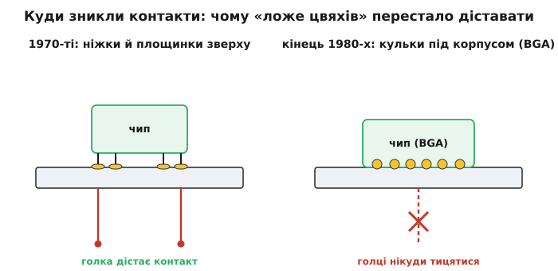
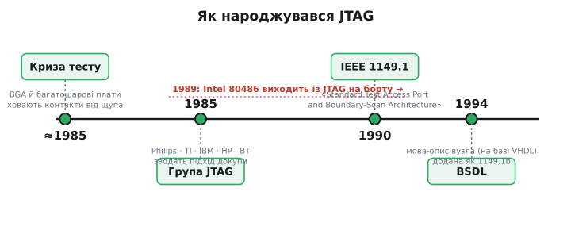

# 📜 Як народжувався JTAG: коли контакти сховалися від щупа

Майже кожен, хто сьогодні бере налагоджувач мікроконтролера чи програматор ПЛІС, торкається JTAG, навіть не думаючи про його ім'я. Чотири дроти, знайомий гребінець роз'єму, «залив прошивку — і працює». Але це буденне слово — насправді абревіатура назви **робочої групи інженерів**, і за ним стоїть цілком конкретна історія: не наукове відкриття, а **інженерна криза** кінця 1980-х, коли ціла галузь раптом виявила, що більше не вміє перевіряти те, що сама ж виробляє. JTAG народився не з бажання винайти щось елегантне, а з відчаю — з простого питання «а як тепер узагалі дізнатися, що плата спаяна правильно?».

Розберімо цю історію по-справжньому. Що саме зламалося наприкінці 1980-х і чому старий, десятиліттями надійний спосіб тестування раптом перестав діяти. Хто зібрався, щоб це полагодити, з яких країн і компаній були ці люди. Чому вони обрали саме таке дивне рішення — вкласти тестер усередину кожної мікросхеми — замість очевидного «зробімо кращі голки». І як маленький службовий порт, задуманий лише для пошуку неспаяної кульки, за кілька років став головним чорним ходом у нутрощі майже кожного цифрового чипа на світі.

## Золота доба щупа: коли до кожного контакту можна було дотягтися

Щоб відчути кризу, треба спершу зрозуміти світ, який їй передував, — і чому в ньому все було добре. Уявіть плату 1970-х чи початку 1980-х. Мікросхеми на ній — у корпусах із ніжками, що стирчать із боків, як лапки в комахи (DIP, dual in-line package), і ці ніжки **проткнуті крізь дірки** в платі та припаяні з іншого боку. Доріжки-провідники лежать переважно **зверху** й знизу плати, на видноті. Кожен електричний вузол схеми — кожна точка, де сходяться кілька виводів, — має десь на платі відкриту мідну **площинку**, до якої фізично можна доторкнутися.

На цьому тримався весь тодішній заводський контроль якості. Спосіб звався **внутрішньосхемним тестуванням** (англ. *in-circuit test*, ICT), а його знаряддям було **ложе цвяхів** (англ. *bed of nails*) — і назва тут буквальна. Це панель, у яку вставлені сотні, а то й тисячі підпружинених контактних голок, розставлених рівно під тими площинками конкретної плати. Плату кладуть зверху, притискають — і кожна голка тицяється у свій вузол. Тепер тестер має прямий електричний доступ **до кожної точки схеми одночасно**: він може подати сигнал в один вузол і перевірити, чи прийшов той у сусідній; може виміряти, чи справді резистор між двома площинками має свій опір; може відшукати коротке замикання чи обрив доріжки. Голки — це буквально тисячі щупів вольтметра, притиснутих до плати воднораз.

Ключове тут — **фізичний доступ**. Уся філософія ложа цвяхів спирається на мовчазне припущення: до будь-якого вузла схеми можна дотягтися голкою знизу. І десятиліттями це припущення трималося, бо контакти справді лежали на поверхні. Голка дотягувалася — тест працював. Проста, надійна, зрозуміла механіка.

## Що зламалося: контакти поїхали під корпус і всередину плати

А тепер — злам. Наприкінці 1980-х електроніка кинулася гнатися за щільністю: більше функцій на менший квадратний сантиметр, більше виводів у кожного чипа. І два технологічні зрушення, які цю щільність дали, водночас **вибили ґрунт з-під ложа цвяхів**.

Перше — **поверхневий монтаж** (англ. *surface-mount technology*, SMT). Мікросхеми перестали протикати ніжками наскрізь; замість цього їх стали припаювати просто до площинок на поверхні плати, а ніжки-виводи зробилися дрібними й частими. Разом із цим доріжки-провідники масово поїхали з поверхні **всередину** — у внутрішні шари багатошарової плати, затиснуті між ізоляційними прошарками, як начинка в листковому пирозі. Вузол, що колись мав відкриту площинку зверху, тепер міг цілком ховатися між третім і четвертим шаром десятишарової плати, недосяжний з жодного боку.

Друге, найдошкульніше, — корпуси типу **BGA** (англ. *ball grid array*, «сітка кульок»). Тут виводів немає взагалі: чип під'єднується до плати сіткою маленьких **кульок припою** на самому дні корпусу. Уявіть двісті таких кульок правильними рядами під квадратним чипом — і всі вони затиснуті **між пластиковим дном мікросхеми й мідними площинками під нею**. До жодної з них не дотягтися нічим: вони не на краю, не збоку, а просто **під** корпусом, схованого від будь-якої голки самим тілом чипа.

*Уся ідея ложа цвяхів трималася на тому, що до кожного вузла можна дотягтися голкою. Поки контакти лежали зверху (ліворуч), це діяло. Коли виводи сховалися під корпус BGA сіткою кульок (праворуч), тицятися стало нікуди — і тестування наштовхнулося на стіну.*

І ось тут галузь опинилася перед справді неприємним фактом. Дослідження тих років показували те, що відчував кожен завод: **переважна частина** дефектів готових плат — це не згорілі мікросхеми, а саме **погана пайка**: неспаяна кулька, ненавмисна перемичка припою між сусідніми виводами, обрив доріжки, тріщина в з'єднанні. Тобто ламалися здебільшого саме **з'єднання** — і саме до них тепер не було доступу. Виходила пастка з двох стінок: помилки монтажу нікуди не поділися (їх навіть побільшало, бо кульок і виводів стало більше), а старий спосіб їх ловити раптово осліп. Плата не працює, і навіть **неможливо сказати, котра з двохсот кульок винна**.

Можна було, звісно, вкладати шалені гроші в дедалі хитріші голкові пристосування, свердлити в платі спеціальні тестові точки, різати площу під контроль. Але це дорожчало вибухово, а надійність самих пристосувань падала: що дрібніші кроки виводів, то химерніше й крихкіше ложе цвяхів, і то менше вузлів воно все одно дістає. Ставало ясно, що вдосконаленням голок цю прірву не перестрибнути. Проблема була не в голках. Проблема була в самому припущенні, що тестувати треба **ззовні**.

## Зміна думки: нехай чип сам себе обмацає зсередини

Ось де стався справжній інтелектуальний поворот — і варто зупинитися, бо саме він робить усю історію цікавою. Замість питати «як зробити голку, що дістане сховану кульку?», хтось поставив питання інакше: «а що, як **не діставати ззовні взагалі**?».

Логіка така. До ніжки чипа зовні не дотягтися — але ж **сама ніжка з'єднана з нутрощами кристала** дротиком усередині корпусу. Отже, до неї чудово можна дотягтися **зсередини самого чипа**. То вкладімо ж у кожну мікросхему крихітну вбудовану спостережну апаратуру: маленьку схему, посаджену просто на «кордоні» між ядром кристала і кожним його виводом. Хай ця схема вміє дві дзеркальні речі — **прочитати** логічний рівень, що зараз стоїть на ніжці, і **виставити** на ніжку потрібний рівень замість сигналу ядра. Тоді фізичний щуп стає взагалі не потрібен: чип сам собі і датчик, і генератор сигналу на кожному виводі. Око читає, що на ніжці є; рука кладе на ніжку те, що ми хочемо.

Це і є **граничне сканування** (англ. *boundary scan*): ми скануємо саме **межу** мікросхеми — кільце її виводів. Комірки на всіх ніжках зшивають послідовно в один довгий зсувний регістр, що кільцем оперізує кристал, і крізь нього по одному проводу можна і засунути потрібні рівні на всі ніжки, і висунути знімок стану всіх ніжок. А щоб керувати цим кільцем ззовні, досить **чотирьох дротів** — незалежно від того, скільки в чипа виводів.

> 🔧 **Навіщо це.** Саме цей поворот думки і ловить неспаяну кульку BGA, до якої не дотягтися. Наказуємо мікросхемі A нав'язати логічну одиницю на конкретний вивід, а сусідній мікросхемі B — захопити її вхід, куди ця доріжка приходить. Якщо доріжка й обидві пайки цілі — B бачить одиницю; якщо бачить нуль — обрив. І все це **без жодного щупа**, самим перетасовуванням бітів по кільцю. Стіну, об яку розбилося ложе цвяхів, обійшли не силою, а зміною напрямку: тестуємо не ззовні, а зсередини.

> Повний технічний розбір того, як влаштована комірка, кільце й порт із чотирьох дротів, як мікросхеми зчіплюються в спільну гірлянду й керуються одним автоматом станів — у статті-власниці [JTAG і граничне сканування](topic:electronics/jtag-boundary-scan). Тут ми ведемо саме історію: хто і як дійшов до цієї ідеї та зробив її світовим стандартом.

Варто чесно сказати, що сама думка «нехай пристрій має вбудовану тестову апаратуру, доступну через окремий послідовний порт» не впала з неба цілком новою. Ідеї вбудованого самоконтролю (англ. *built-in self-test*) і зсувних тестових ланцюгів усередині мікросхем обговорювали й застосовували в проєктуванні чипів і раніше. Заслуга людей, про яких далі йтиметься, — не в тому, що вони перші додумалися заглянути в чип зсередини, а в тому, що вони звели розрізнені ідеї в **єдину, строго описану, обов'язкову для всіх схему**: однаковий порт, однакові команди, однаковий автомат станів — так, щоб чип від будь-якого виробника розумів той самий програматор. Саме ця **стандартизація**, а не сама ідея, і стала переломом.

## Спільна робоча група: хто і звідки зібрався 1985 року

Тепер до людей і дат — і тут будьмо точні, бо історія техніки любить стискатися до зручних міфів про «одного винахідника».

Проблема була **спільною для всієї галузі**, тому й розв'язувати її сіли спільно. **1985 року** сформувалася група інженерів із провідних електронних компаній Європи та Північної Америки, щоб виробити єдиний підхід до тестування плат, які більше не піддавалися голкам. Групу назвали **Joint Test Action Group** — «спільна робоча група з тестування», де слово *joint* («спільна») і є ключове: підкреслювало, що це не проєкт однієї фірми, а **міжкомпанійська змова заради спільного добра**. Абревіатура цієї назви — **JTAG** — згодом і приліпилася до самої технології, хоча спершу означала лише саму групу людей. *(Статус: усталено.)*

До групи входили представники компаній, чиї імена знає кожен, хто цікавиться електронікою: серед них були **Philips** (Нідерланди), **Texas Instruments**, **IBM**, **Hewlett-Packard** та **Intel** (США), а також, за низкою джерел, британські **British Telecom** і **GEC**. Це важлива деталь: підхід від початку виношували не в одній країні й не в одному кутку індустрії, а спільно європейські та американські інженери-тестувальники — люди, які щодня билися з тим, що плати перестають перевірятися. *(Статус: склад учасників усталено в загальних рисах; повний поіменний список фірм у різних джерелах трохи різниться.)*

Кілька постатей варто назвати прямо, бо їхній внесок задокументований. **Колін Мондер** (англ. *Colin Maunder*) з дослідницьких лабораторій British Telecom і **Родам Тулосс** (англ. *Rodham Tulloss*) стали, по суті, головними літописцями й систематизаторами архітектури: саме вони згодом написали книжку «The Test Access Port and Boundary-Scan Architecture», що надовго лишилася канонічним викладом стандарту. Помітну інженерну роль у розробці самих комірок і тестового порту відіграв **Лі Ветсел** (англ. *Lee Whetsel*) з Texas Instruments, чиє ім'я стоїть на низці патентів на схемотехніку граничного сканування. Були й інші — сама природа роботи була колективною, розтягнутою на роки нарад і узгоджень між конкурентами, які мусили домовитися про спільну мову. *(Статус: провідна роль Мондера, Тулосса й Ветсела усталена; це не «винахідники-одинаки», а ключові учасники колективної праці.)*

*Хребет історії за роками. Криза тестування штовхнула галузь зібрати спільну групу (1985); роки узгоджень між конкурентами вилилися в офіційний стандарт (1990); окремою цеглинкою пізніше додали машинний опис вузла — BSDL (1994). Червоним — переломний момент прийняття: коли масовий процесор Intel вийшов уже з JTAG усередині.*

## Від домовленості до закону галузі: IEEE 1149.1-1990

Домовитися групою — це півсправи; галузі потрібен був **офіційний стандарт**, на який можна посилатися в технічних вимогах, за яким виробники чипів зобов'язуються робити свою тестову логіку однаково. Тому напрацювання групи передали під егіду **IEEE** (англ. *Institute of Electrical and Electronics Engineers* — «Інститут інженерів з електротехніки та електроніки»), поважної міжнародної організації, що видає технічні стандарти, і там робоча група довела документ до канонічного вигляду.

Процес голосування за пропонований стандарт **P1149.1** завершився на початку **1990 року**, і того ж року вийшов **IEEE Std 1149.1-1990** під повною назвою **«Standard Test Access Port and Boundary-Scan Architecture»** — «Стандарт на порт тестового доступу й архітектуру граничного сканування». Того ж року він отримав і схвалення як стандарт **ANSI** (американського національного органу стандартизації). Оцей номер — **1149.1** — і є справжнє офіційне ім'я того, що в побуті всі звуть просто «JTAG». *(Статус: усталено.)*

Зверніть увагу на розрив у часі: від формування групи 1985-го до готового стандарту 1990-го минуло близько **п'яти-шести років**. Це не забарність, а природа справи. Треба було, щоб конкуренти — Philips, TI, IBM, HP, Intel — узгодили до дрібниць спільну архітектуру: скільки саме дротів у порту, які стани в автоматі, які команди обов'язкові для всіх, як саме комірки з'єднуються в кільце. Кожна дрібниця мала стати єдиною для цілої галузі, бо весь сенс — щоб один програматор говорив з чипами будь-якого походження. Стандарт — це завжди повільна дипломатія, і шість років на таке — цілком звична ціна.

## Чому JTAG розлетівся по всьому світу: важіль на ім'я Intel

Стандарт сам собою — ще не гарантія, що ним усі почнуть користуватися; історія техніки повна добрих стандартів, які нікому не знадобилися. JTAG вистрелив — і тут вирішальним виявився один потужний важіль.

**1989 року** Intel випустила свій новий флагманський процесор — **80486** (він же i486), анонсований на виставці навесні того року. Це був масовий, страшенно популярний чип, що пішов у безліч персональних комп'ютерів. І Intel зробила річ, яка все змінила: **вбудувала в 80486 підтримку JTAG прямо на кристалі**. Тепер кожен виробник плати, що ставив цей процесор — а ставили його всюди, — **автоматично** отримував на своїй платі вузол із граничним скануванням і мусив навчитися з ним працювати. *(Статус: усталено — 80486 анонсовано 1989 року й він ніс JTAG; сам стандарт IEEE 1149.1 закріпили роком пізніше, 1990-го.)*

Далі спрацював простий важіль ринкової сили. Коли настільки поширений і впливовий чип від настільки великого гравця приходить із JTAG на борту, решті галузі стає легше й вигідніше теж прийняти цей самий підхід: інструменти, знання, навчені інженери, програматори — усе вже з'являється навколо популярного процесора. Ваги Intel вистачило, щоб підштовхнути **всіх** виробників до швидкого прийняття JTAG. Те, що могло лишитися вузьким фаховим стандартом для великих плат, за кілька років стало **загальногалузевою нормою**. *(Статус: причинний зв'язок «80486 пришвидшив прийняття» — усталена в галузевих джерелах оцінка.)*

Тут корисно розрізнити два різні твердження, щоб не злити їх у міф. Одне — «Intel винайшла JTAG»: це **неправда**, JTAG виношувала спільна міжкомпанійська група роками, і Intel була лише однією з фірм за столом. Друге — «Intel своїм 80486 різко пришвидшила світове прийняття JTAG»: це **правда** й важлива. Винахід був колективний; а от **вирішальний поштовх до масовості** справді дав важіль одного дуже великого гравця, який першим поставив технологію в надпопулярний продукт. Розрізняти «хто придумав» і «завдяки кому це стало всюдисущим» — саме та дисципліна, без якої історія техніки перетворюється на збірку геройських легенд.

## Остання цеглинка: BSDL і машинний опис чипа (1994)

Був іще один практичний камінь спотикання, який довелося прибрати вже після виходу стандарту, — і без нього JTAG не став би по-справжньому зручним у щоденній роботі.

Уявіть інженера, що зібрав плату з десятком різних мікросхем від різних виробників і хоче перевірити всі з'єднання граничним скануванням. Кільце комірок є в кожному чипі — але **в кожного воно своє**: різна довжина, різний порядок виводів у ланцюзі, різні коди команд, різні особливості поведінки кожної комірки. Щоб програма-тестувальник могла скласти правильні вектори й розтлумачити відповіді, вона мусить **точно знати внутрішній устрій кільця кожного конкретного чипа**. Виколупувати це вручну з паперових довідників для кожної мікросхеми — виснажлива й дуже помилконебезпечна робота. Стандарт задав, **як** улаштований порт узагалі, але не дав машинного способу описати **конкретний** чип.

Цю прогалину закрили **1994 року**, додавши до стандарту доповнення **IEEE 1149.1b-1994**, що ввело **BSDL** (англ. *Boundary-Scan Description Language* — «мова опису граничного сканування»). Це формальна мова, побудована як підмножина **VHDL** — усталеної мови опису апаратури, — якою виробник чипа один раз **описує** свій вузол граничного сканування: скільки комірок у кільці, у якому вони порядку, які команди підтримує чип, як поводиться кожна ніжка. Виробник видає такий BSDL-файл на кожну мікросхему — і будь-який тестувальний інструмент, прочитавши ці файли, **сам** складає правильні тестові вектори для всієї плати. *(Статус: усталено — BSDL додано доповненням 1149.1b-1994, воно спирається на VHDL.)*

Значення цього кроку легко недооцінити. Саме BSDL перетворив JTAG із теоретично гарної, але марудної в застосуванні архітектури на **робочий заводський інструмент**: описи чипів стали машинними, переносними, придатними для автоматичних засобів. Без цієї останньої цеглинки граничне сканування лишилося б технологією «для тих, хто має багато терпіння»; з нею воно стало буденним натисканням кнопки.

## Несподіваний поворот: тестовий порт стає чорним ходом у чип

І тут історія робить свій найкращий, зовсім не запланований поворот — той, завдяки якому JTAG живе донині вже понад тридцять років і торкається його щодня той-таки інженер із налагоджувачем.

Задумували все це **виключно заради перевірки пайки**: знайти неспаяну кульку, обірвану доріжку, перемичку припою. Але дуже скоро інженери побачили дещо непередбачене. Якщо ми вже поставили всередину кожного чипа стандартний порт із чотирьох дротів, регістр команд і зсувний доступ до нутрощів кристала — то **крізь ці самі двері можна робити куди більше, ніж обмацувати ніжки ззовні**. Виробники почали додавати свої, нестандартні команди понад обов'язкові три — і той самий скромний тестовий порт відкрив дорогу вглиб самого кристала.

Так порт для пошуку неспаяної кульки перетворився на **універсальний службовий вхід** сучасної електроніки. Через ті самі чотири дроти тепер **прошивають** пам'ять і ПЛІС — заливають конфігурацію просто в чип на готовій платі, не виймаючи його. Через них же **налагоджують** програму: зупиняють процесор, читають і пишуть його регістри й пам'ять, ставлять точки зупину, крокують по одній інструкції. Кожен налагоджувач мікроконтролера, кожен програматор ПЛІС говорить із чипом саме цими чотирма дротами. Технологія, народжена суто як відповідь на кризу заводського контролю якості, розрослася далеко за межі свого початкового задуму — і саме тому виявилася такою живучою.

У цьому, до речі, глибокий і повторюваний урок про природу техніки. Часто найкорисніше в інструменті — не те, заради чого його робили. JTAG будували, щоб перевіряти з'єднання, до яких не дотягтися щупом; а лишився він з нами передусім тому, що випадково виявився зручним **вікном усередину чипа** для геть інших потреб. Люди 1985 року розв'язували свою вузьку, конкретну біду з ложем цвяхів — і, самі того не плануючи, збудували службовий вхід, яким досі щодня користується вся галузь.

## Що з цієї історії лишається в голові

Складімо нитку. Наприкінці 1980-х щільна електроніка — поверхневий монтаж, багатошарові плати й особливо корпуси BGA з кульками під днищем — **сховала контакти схеми** від голок ложа цвяхів, старого надійного способу заводського тестування. Дефекти ж лишилися здебільшого ті самі — погана пайка з'єднань, — тільки перевіряти їх стало нічим: до вузлів не дотягтися. Галузь уперлася в стіну.

Вихід знайшли не в кращих голках, а в зміні напрямку думки: якщо ззовні до ніжки не дотягтися — хай чип **сам себе обмацає зсередини**, комірками граничного сканування на кожному виводі, керованими всього чотирма дротами. Щоб цей підхід став єдиним для цілої галузі, **1985 року** зібралася спільна група інженерів Європи та Америки — Joint Test Action Group, чия абревіатура JTAG і прилипла до технології, — за участю Philips, TI, IBM, HP, Intel та інших; ключовими постатями стали Колін Мондер, Родам Тулосс, Лі Ветсел. Після років узгоджень між конкурентами напрацювання закріпили **1990 року** як стандарт **IEEE 1149.1** «Standard Test Access Port and Boundary-Scan Architecture». Масовим його зробив важіль Intel: **80486** вийшов **1989 року** вже з JTAG на борту й потягнув за собою всю галузь. А **1994 року** останньою цеглинкою додали **BSDL** — машинну мову опису вузла на базі VHDL, — і граничне сканування остаточно стало буденним заводським інструментом.

І головний урок — не про дати, а про дві речі. Перша: великі інженерні рішення частіше народжуються **колективно й зі стандартизації**, а не з осяяння одинака; JTAG — це не чийсь винахід, а спільна домовленість конкурентів про єдину мову. Друга: найдовше живе в техніці часто **не той бік інструмента, заради якого його робили**. Порт задумали, щоб знайти неспаяну кульку, — а лишився він з нами як головні двері в нутрощі чипа. Коли наступного разу під'єднаєте налагоджувач чотирма дротами, згадайте: ви користуєтеся службовим входом, який хтось прорубав тридцять із гаком років тому зовсім для іншого — просто щоб урятувати заводський тест від власної щільності.
