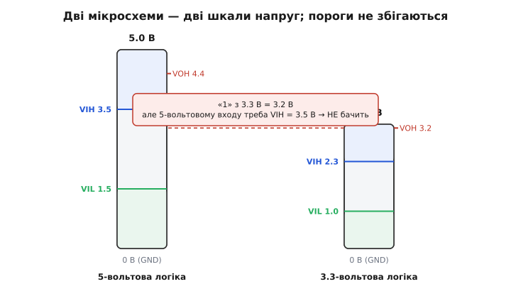
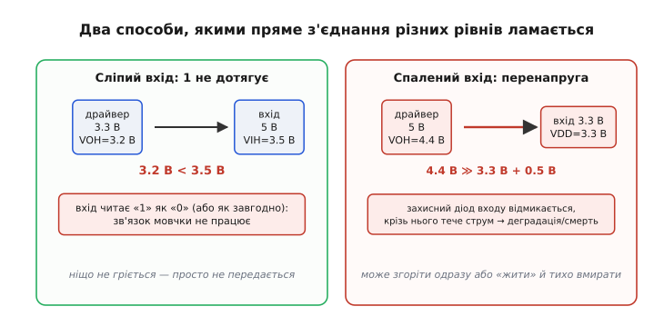
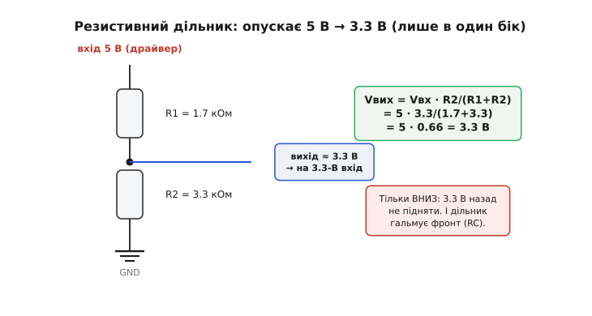
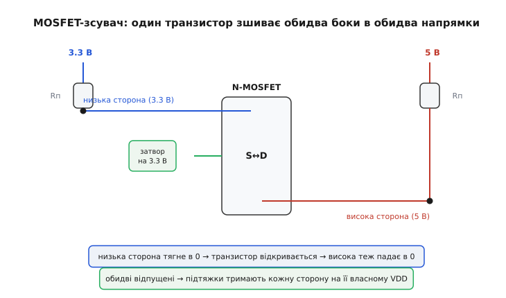
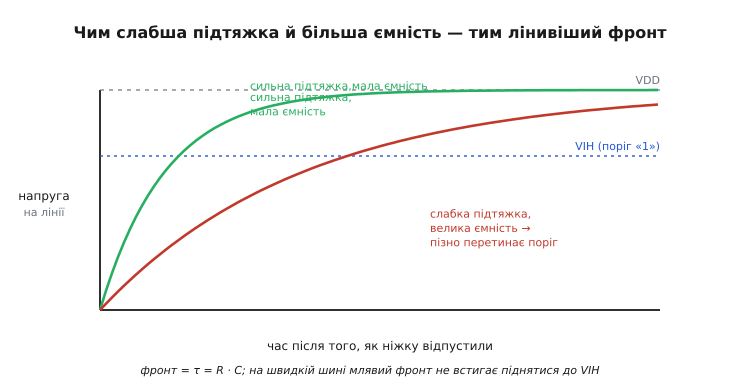

# Зсув логічних рівнів

Дві мікросхеми на одній платі часто живляться **по-різному**: ядро сучасного процесора задовольняється 1.8 В, давач хоче 3.3 В, а стара периферія чи світлодіодна стрічка вперто очікують 5 В. Кожна така мікросхема говорить «своїми вольтами»: для одної «логічна одиниця» — це близько 5 В, для іншої — близько 3.3 В. І ось ви з'єднуєте їхні ніжки дротом — а зв'язок або **мовчить**, наче його й нема, або одна з мікросхем тихо **виходить з ладу**. Причина в обох випадках та сама: рівні двох сторін **не збігаються**. Зсув логічних рівнів (англ. *level shifting* — «зміщення рівнів») — це і є мистецтво **перекласти** одиниці й нулі з вольтів однієї сторони у вольти іншої так, щоб обидві впевнено розуміли одна одну й жодна не згоріла. Розберімо, **чому** ця стіна між напругами виникає, **як** саме ламається пряме з'єднання, і якими прийомами цю стіну долають.

Почати треба з простого, але неочевидного факту: «нуль» і «одиниця» — це **не числа, а напруги**, і напруги ці прив'язані до живлення мікросхеми.

### Чому домени живлення мають різні рівні

Логічна одиниця всередині цифрової мікросхеми — це не абстрактна «1», а **висока напруга, близька до її живлення VDD**; нуль — низька, близька до GND. У чипа з живленням 3.3 В одиниця жене десь 3.2–3.3 В; у чипа на 5 В — десь 4.8–5 В. Звідки ж беруться різні VDD? Це не примха, а **наслідок прогресу й фізики**.

Що дрібніший транзистор усередині кристала, то **тоншим** стає шар ізолятора в його затворі — а тонкий ізолятор не витримує високої напруги, проб'є. Тому кожне нове покоління мікросхем зменшує VDD: 5 В були нормою в епоху великих транзисторів, потім прийшли 3.3 В, далі 1.8 В, а ядра найновіших процесорів живляться вже близько 1 В. Нижча напруга ще й **ощадніша**: енергія на кожне перемикання росте з квадратом напруги, тож зрізати VDD удвічі — це різко скоротити нагрів і споживання. Тому світ електроніки **не зійшовся** на одній напрузі: нові швидкі дрібні чипи тягнуть VDD донизу, а ціла гора давачів, реле, силових драйверів і дисплеїв лишається на старих 3.3 чи 5 В, бо так зручніше їм. У результаті на одній платі майже завжди живуть **кілька доменів живлення** поряд.

Кожен такий домен має **свою шкалу** того, що вважати нулем і одиницею. І найголовніше: ці шкали не просто різні за «верхом» — вони мають **пороги**, і саме на порогах ховається вся біда стику.


*Ліворуч — 5-вольтова логіка, праворуч — 3.3-вольтова. У кожної своя шкала: «1» одного домену не дорівнює «1» іншого. Пунктир показує головну халепу: одиниця 3.3-вольтового чипа (близько 3.2 В) **не дотягує** до того порога, з якого 5-вольтовий вхід упевнено читає одиницю (близько 3.5 В). Дріт натягнуто — а сигнал не «перекладається».*

### Коли вхід «не бачить» одиниці: поріг VIH

Щоб зрозуміти першу поломку, треба знати, як вхід цифрової мікросхеми вирішує, що на ньому — нуль чи одиниця. Він не порівнює напругу з однією межею, а має **два названі пороги** (їх ви бачитимете в кожному даташиті, у розділі *DC Characteristics*):

> Вхід читає не точну напругу, а одну з трьох зон, відмежованих двома порогами — VIL і VIH. Нижче VIL — гарантований нуль; вище VIH — гарантована одиниця; між ними — «нічия земля», де виробник нічого не обіцяє. Детально цю конструкцію розбирає [пороги входу](topic:electronics/logic-thresholds).

- **VIL** (*input low voltage*) — найбільша напруга, яку вхід ще **точно** читає як **0**.
- **VIH** (*input high voltage*) — найменша напруга, яку вхід **точно** читає як **1**. Усе, що нижче VIH, одиницею вже **не гарантоване**.

Для CMOS-входу пороги орієнтовно прив'язані до його **власного** VDD: VIL ≈ 0.3·VDD, VIH ≈ 0.7·VDD. Отут і криється пастка. Візьмімо 5-вольтовий CMOS-вхід: його VIH ≈ 0.7 × 5 = **3.5 В**. Тепер під'єднаймо до нього вихід 3.3-вольтового чипа, що жене одиницю напругою **3.2 В**:

```
драйвер 3.3 В віддає одиницю:   VOH ≈ 3.2 В
приймач 5 В вимагає для «1»:    VIH ≈ 0.7 · 5.0 = 3.5 В

порівняння:   3.2 В  <  3.5 В   →  одиниця НЕ дотягує до порога
```

Одиниця драйвера **не дотягує** до порога приймача. Вхід бачить на ніжці 3.2 В і чесно вважає: це ще **не** гарантована одиниця — отже, або «нуль», або «як пощастить». Зв'язок просто **не працює**, і це найпідступніший різновид збою: **ніщо не гріється, нічого не димить**, на платі все ніби з'єднано правильно — а біти не передаються або «плавають». Шукати такий баг тестером важко, бо напруга 3.2 В виглядає цілком «високою» — поки не згадаєш, що для **цього** входу високою вона ще не вважається.

Зверни увагу, що біда тут **асиметрична за напрямком**: 3.3-вольтова сторона жене сигнал у 5-вольтовий вхід. У зворотний бік (5 В → вхід 3.3 В) одиниця 5-вольтового драйвера — близько 5 В — поріг 3.3-вольтового входу (VIH ≈ 2.3 В) перекриває з величезним запасом, **бачить** її чудово. Та саме тут чигає **друга**, значно гірша поломка.

### Коли вхід горить: перевищення напруги

Поверни сигнал у інший бік — і замість тихої відмови дістанеш **спалену ніжку**. Кожен вхід цифрової мікросхеми захищений **діодами обмеження** (ESD-діодами): один веде від ніжки до VDD, другий — від GND до ніжки. Їхнє завдання — відводити дрібні статичні розряди. Працюють вони так: якщо напруга на ніжці підскочить **вище VDD** приблизно на 0.5 В (падіння на відкритому діоді), верхній діод **відмикається** і починає зливати струм у шину живлення.

Тепер подаймо одиницю 5-вольтового драйвера (близько 4.4–5 В) прямо на вхід чипа, що живиться 3.3 В:

```
драйвер 5 В жене одиницю:        VOH ≈ 4.4…5.0 В
вхід живиться:                   VDD = 3.3 В
поріг відмикання захисного діода: VDD + 0.5 = 3.8 В

4.4 В  >  3.8 В  →  верхній діод відкрито, крізь нього тече струм
```

Захисний діод відкривається й **постійно** пропускає крізь себе струм із 5-вольтової лінії в 3.3-вольтову шину живлення. Цей діод розрахований на короткі **розрядні імпульси**, а не на безперервний струм; він **перегрівається й деградує**. Наслідок буває двоякий і обидва погані: ніжка (а то й увесь чип) може згоріти **одразу**, а може «жити» місяцями й тихо вмирати — спершу збої, потім повна відмова. Додатковий підступ: струм крізь діод **підтягує саму шину 3.3 В угору**, і тоді «їде» живлення вже всього домену — баг розповзається непередбачувано.


*Ліворуч — тиха відмова: одиниця 3.3-вольтового драйвера (3.2 В) не досягає порога VIH 5-вольтового входу (3.5 В), і зв'язок мовчки не працює — ніщо не гріється. Праворуч — гучна поломка: одиниця 5-вольтового драйвера (4.4 В) перевищує живлення 3.3-вольтового входу, відмикає його захисний діод, і крізь нього тече струм — вхід деградує або згоряє. Два боки однієї стіни між напругами.*

> 🔧 **Навіщо це.** Запам'ятайте два діагнози-близнюки. **«Усе з'єднано, а не працює, і нічого не гріється»** — майже напевно одиниця **не дотягує** до VIH приймача (низька сторона жене у високу). **«Чип гріється / дивно поводиться / помер»** — майже напевно на вхід прийшла **перенапруга** (висока сторона жене в низьку). Перший рятує дорогі години відлагодження, другий — самі мікросхеми. Перш ніж стикати два домени, звіртеся: чи VOH драйвера ≥ VIH приймача **і** чи VOH драйвера не перевищує дозволеного для входу приймача. Не сходиться бодай одне — потрібен зсув рівнів.

Отже, маємо дві різні задачі. Сигнал **знизу вгору** (3.3 → 5 В) треба **підсилити** до рівня, який високий вхід упізнає як одиницю. Сигнал **згори вниз** (5 → 3.3 В) треба **приборкати**, щоб не спалити низький вхід. Розгляньмо прийоми — від найпростішого до найуніверсальнішого.

### Зсув униз: резистивний дільник напруги

Найдешевший спосіб опустити рівень — **дільник напруги** з двох резисторів. Сигнал високої сторони заходить у верхній резистор R1; знизу від точки виходу другий резистор R2 веде на землю; сам зсунутий сигнал знімаємо з **точки між ними**. Напруга в цій точці — лише **частка** вхідної, задана відношенням опорів:

```
Vвих = Vвх · R2 / (R1 + R2)

приклад: опустити 5 В → 3.3 В
треба коефіцієнт   3.3 / 5 = 0.66
візьмемо   R1 = 1.7 кОм,  R2 = 3.3 кОм:
Vвих = 5 · 3.3 / (1.7 + 3.3) = 5 · 0.66 = 3.3 В   ✓
```

П'ять вольтів перетворюються на безпечні 3.3 — низький вхід читає чисту одиницю й не страждає від перенапруги. Просто, копійчано, без жодної мікросхеми.


*Дільник із R1 і R2: вихід знімаємо з точки між резисторами, його напруга — частка вхідної за формулою R2/(R1+R2). Тут 5 В перетворюються на 3.3 В. Праворуч — два «але»: підняти сигнал назад угору дільник **не вміє** (тільки опускає), а пара резисторів разом з ємністю лінії **гальмує фронт** сигналу.*

Та платимо за дешевину двома обмеженнями. По-перше, дільник **тільки опускає** — підняти 3.3 В до 5 В він не здатний у принципі (з меншого не зробиш більше пасивними резисторами). Тобто він годиться лише для **однонапрямного** сигналу згори вниз — скажімо, для лінії такту чи даних, що завжди йде від 5-вольтового майстра до 3.3-вольтового підлеглого, і ніколи назад. По-друге, два резистори разом із неминучою **ємністю** доріжки й входу утворюють RC-ланку, що **сповільнює фронти** сигналу — і на швидких лініях це стає вузьким місцем (до цього повернемося наприкінці).

### Зсув в обидва боки: MOSFET-перемикач

Найелегантніше рішення для **двонапрямної** лінії — як-от шина даних, де сигнал біжить то в один бік, то в інший — будується на **одному** маленькому n-канальному [MOSFET-транзисторі](topic:electronics/logic-families). Класична схема: транзистор стоїть **між** двома сторонами; його стік дивиться на високу сторону, витік — на низьку; **затвор** жорстко прив'язаний до напруги **низької** сторони (наприклад, 3.3 В). На кожній стороні — своя **підтяжка** (резистор на свій VDD: низька сторона до 3.3 В, висока до 5 В).

Уся краса в тому, як ця проста схема **сама** перекладає рівні в **обидва** боки — без жодного керування напрямком:

- **Спокій (обидві сторони відпущені).** Низька сторона підтягнута до 3.3 В, висока — до 5 В. Затвор і витік обидва на 3.3 В, різниці між ними нема, транзистор **закритий** — сторони роз'єднані, кожна спокійно сидить на своєму VDD. Обидві читаються як одиниця.
- **Низька сторона тягне в нуль.** Витік падає до 0 В, а затвор лишається на 3.3 В — між затвором і витоком виникає напруга, транзистор **відкривається** і притягує **й високу** сторону до нуля. Нуль перейшов знизу вгору.
- **Висока сторона тягне в нуль.** Стік падає до 0 В; струм через відкритий транзистор (а він прочиняється ще й через вбудований діод тіла) садить **і низьку** сторону вниз. Нуль перейшов згори вниз.


*Двонапрямний зсувач на одному n-MOSFET. Затвор прив'язано до нижчої напруги (3.3 В), кожна сторона має свою підтяжку до власного VDD. Будь-яка сторона, що тягне лінію в нуль, відмикає транзистор — і нуль миттю передається на протилежний бік; коли всі відпустили, транзистор закритий і кожна сторона тримається на своєму VDD. Напрямок ніхто не задає — схема симетрична.*

Чому це працює в **обидва** боки без перемикання напрямку? Бо схема **симетрична за дією**: «активним» станом завжди є **нуль** (хтось тягне лінію вниз), а одиницю на кожній стороні робить **її власна підтяжка** — точнісінько як в [open-drain](topic:electronics/open-drain) лініях. Ніхто не **жене** напругу вгору силою, тож зіткнення напруг неможливе; передається лише «потягни вниз», а «відпусти вгору» кожна сторона відпрацьовує самостійно своїм VDD. Саме на цьому принципі побудовані фабричні двонапрямні зсувачі (клас BSS138) і модулі для шин на кшталт I2C; конкретні мікросхеми та їхні граблі — у [перетворювачі рівнів](topic:electronics/level-shifter).

### Зсув угору: підтяжка до вищої напруги

А як **підняти** рівень знизу вгору — щоб одиниця 3.3-вольтового чипа впевнено перетнула поріг VIH 5-вольтового входу? Тут стає в пригоді те саме спостереження, що рятує open-drain: **одиницю на лінії може задавати не драйвер, а зовнішня підтяжка** — увімкнена до **тієї напруги, яку оберемо ми**.

Якщо вихід низької сторони влаштований як [open-drain](topic:electronics/open-drain) (уміє лише тягнути вниз або відпускати, але **не жене** вгору сам), то досить поставити підтяжку до **вищої** шини — 5 В. Коли низька сторона відпускає лінію, підтяжка піднімає її аж до 5 В → впевнена одиниця для 5-вольтового входу. Коли тягне вниз — лінія падає в нуль для обох. Жодного дільника, жодного транзистора: лінія сама «дотягується» до потрібного верху, бо її верх задає **підтяжка, а не драйвер**.

Тут є жорстка умова, і її легко проґавити: цей трюк працює, **лише** доки низька сторона **не жене лінію вгору силою**. Якщо її вихід звичайний [двотактний (push-pull)](topic:electronics/push-pull-output), він активно тримає одиницю на своїх 3.3 В — і підтяжка до 5 В уже не «допідніме» лінію (драйвер тримає її на 3.3), та ще й вони борються струмом. Тобто **підтяжка вгору годиться лише для open-drain-виходів**; для двотактного потрібен MOSFET-зсувач або фабрична мікросхема. А ще: цей спосіб лишає одиницю «слабкою» (її тримає кволий резистор), тож на швидких лініях він теж упирається в RC — про що далі.

Окремо згадаємо **діод** як грубий прийом зсуву вниз для **захисту** входу. Якщо ввімкнути діод **анодом до низької сторони, катодом — до високої**, разом із підтяжкою низької сторони, то висока сторона зможе **притягувати лінію вниз** крізь діод (передавати нулі), але **не зможе** нав'язати їй своїх 5 В — діод не пропускає струм у зворотний бік. Так вхід захищено від перенапруги ціною падіння на діоді (близько 0.6 В) і несиметрії рівнів. Це радше латка, ніж повноцінний зсувач, але корисно знати як принцип.

### Швидкість проти ємності: чому млявий фронт зраджує

Хоч який метод, у всіх «пасивних» (дільник, підтяжка) ховається спільний ворог — **ємність лінії**. Будь-яка доріжка й будь-який вхід мають паразитну ємність C, а резистор (плече дільника чи підтяжка) має опір R. Разом вони утворюють RC-ланку, і напруга на лінії змінюється **не миттєво**, а наростає плавно зі сталою часу:

```
стала часу фронту:   τ = R · C

час до перетину порога VIH ≈ кілька τ
(точніше: щоб дійти до 0.7·VDD, треба ≈ 1.2·τ)
```

Поки лінію **тягнуть вниз**, нуль установлюється швидко (тягне сильний транзистор, опір малий). А от **угору** лінію піднімає лише слабкий резистор крізь усю ємність — і цей фронт **лінивий**. Якщо період сигналу на швидкій шині менший, ніж потрібно фронту, щоб дійти до VIH, лінія **не встигає** піднятися до одиниці перед наступним перемиканням — і приймач читає сміття. Звідси невблаганний компроміс:

```
менший R (сильніша підтяжка / менше плече):
   фронт швидший (τ менша) → працює на вищій частоті,
   АЛЕ більший струм і більше споживання

більший R (слабша підтяжка):
   ощадніше й тихіше,
   АЛЕ фронт млявіший → на швидкій лінії сигнал не встигає
```


*Як лінія піднімається в одиницю після того, як ніжку відпустили. Сильна підтяжка з малою ємністю (зелена) злітає до VDD швидко й вчасно перетинає поріг VIH. Слабка підтяжка з великою ємністю (червона) повзе мляво й перетинає поріг пізно — на швидкій шині вона просто не встигне піднятися до наступного перемикання. Фронт визначає стала часу τ = R · C.*

Ось чому пасивні прийоми (дільник, підтяжка вгору) добрі для **повільних** ліній — кнопок, реле, неквапливого обміну, — але на швидкому такті чи високошвидкісних даних доводиться брати **активний** зсувач: фабричну мікросхему, що жене обидва фронти **силою** і не залежить від кволого резистора. Вибір методу — це завжди торг: дешевизна й простота пасивних рішень проти швидкості й надійності активних.

> 🔧 **Навіщо це.** Перш ніж ставити дільник чи підтяжку, прикиньте **частоту** лінії. Для кнопки, реле чи неквапливого UART пасивного зсуву досить, і це найдешевше. Для швидкого SPI, тактових ліній чи [світлодіодної стрічки](topic:electronics/level-shifter), де фронти мусять бути різкими, пасивна RC-ланка «розмаже» сигнал — і тоді економія на копійчаних резисторах обертається ловінням «привидів» на осцилографі. Правило просте: **повільне й однонапрямне — пасивно; швидке або двонапрямне — активний зсувач**.

Підіб'ємо нитку. Різні мікросхеми живляться різними напругами, бо фізика тонких транзисторів і гонитва за ощадністю тягнуть VDD донизу, а гора старішої периферії лишається на 3.3 чи 5 В. Кожен домен має свою шкалу нуля й одиниці з порогами VIL/VIH, і пряме з'єднання двох доменів ламається двома способами: одиниця низької сторони **не дотягує** до порога високого входу (тихий збій) або одиниця високої сторони **перевищує** живлення низького входу й палить його захисний діод (поломка). Долають це за напрямком: униз — резистивним дільником, угору — підтяжкою до вищої напруги (лише для open-drain), в обидва боки — одним MOSFET, що передає «нуль» симетрично; а над усіма пасивними методами висить RC-компроміс між швидкістю фронту й силою підтяжки. Коли простих прийомів бракує — за діло беруться спеціальні мікросхеми-[перетворювачі рівнів](topic:electronics/level-shifter), що женуть обидва фронти активно й знімають більшість цих обмежень.
