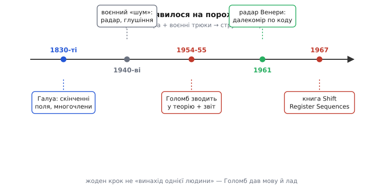

# 📜 Як розсип трюків зі зсувними регістрами став наукою: Соломон Голомб

Була дивна річ, яку інженери помічали, але не вміли пояснити. Береш ланцюжок тригерів, замикаєш його самого на себе через кілька відводів — і він раптом починає видавати нескінченну низку бітів, що виглядає як чистий шум, а насправді ходить по колу довжиною рівно 2ⁿ − 1. Чому саме така довжина? Чому одні набори відводів дають один довгий цикл, а інші розсипаються на купу коротких? Чому в цьому «шумі» одиниць завжди рівно на одну більше, ніж нулів? Це працювало, цим користувалися — але ніхто не міг сказати, **чому** воно так, і головне, **як наперед вибрати відводи**, щоб вийшла найдовша низка, не перебираючи всі варіанти навпомацки.

Людину, яка перетворила цю купу спостережень у струнку теорію, звали **Соломон Вольф Голомб** (англ. *Solomon Wolf Golomb*, 30 травня 1932 — 1 травня 2016), американський математик і інженер, родом із Балтимора. Він не винайшов зсувний регістр і не першим замкнув його на себе — це вже робили до нього. Він зробив інше, важливіше: **дав цьому явищу мову**. Показав, що вся химерна поведінка петлі бітів — це просто арифметика особливих многочленів, і що готовий, столітньої давнини математичний апарат відповідає на всі «чому» одразу. Ця історія — про те, як прикладний трюк отримав теорію, і чому теорію мусив зробити саме математик, а не інженер.

## Що бентежило: живий приклад дива

Щоб відчути загадку так, як її відчували тоді, візьмімо найменший цікавий регістр — чотири тригери — і проженімо його руками. Відводи від крайніх комірок (b3 і b0), новий біт — їхній [XOR](book:electronics/basic-gates). Старт — 0001. Записую стан на кожному такті:

```
0001 → 0010 → 0100 → 1001 → 0011 → 0110 → 1101 → 1010
     → 0101 → 1011 → 0111 → 1111 → 1110 → 1100 → 1000 → 0001
```

Порахуймо: п'ятнадцять різних станів, і аж на шістнадцятому кроці регістр повертається в 0001. Він обійшов **геть усі** ненульові чотирибітні комбінації — рівно 2⁴ − 1 = 15 — по одному разу кожну, і жодну не повторив по дорозі. Тепер зміни один відвід — візьми b3 і b2 замість b3 і b0 — і те саме коло розпадеться на дрібні петлі по кілька станів. Зовні різниця мізерна: два дроти замість двох інших. А поведінка інша докорінно.

Оце і є те, що спантеличувало. Схема гранично проста — кілька тригерів та один вентиль, — а її поведінка тонко залежить від вибору відводів так, що навмання не вгадаєш. Інженер 1940-х міг знайти вдалий набір перебором для малого регістра. Але для регістра на двадцять, тридцять комірок перебирати нема як: варіантів відводів астрономічно багато, а цикли — мільйони й мільярди станів завдовжки. Потрібне було правило, яке скаже наперед: **оці відводи дадуть повний обхід, а оці — ні**. Правило, а не таблиця, здобута потом.

## Хто й звідки: воєнний «шум» і питання начальника

Історія має точну відправну точку, і вона не в тихому кабінеті, а в оборонній промисловості холодної війни. Улітку **1954 року** Голомб, щойно після Джонса Гопкінса й на початку аспірантури в Гарварді з теорії чисел, підробляв у **компанії Ґленна Мартіна** (англ. *Glenn L. Martin Company*) — авіаційно-ракетному підряднику в Балтиморі. Його керівник побував на конференції, де почув про ту саму «дивну поведінку», яку помічали в лінійних зсувних регістрах зі зворотним зв'язком (їх тоді ще називали «відгалуженими лініями затримки зі зворотним зв'язком», *tapped delay lines with feedback*). Керівник приніс задачу молодому Голомбу: розберися, що там коїться.

> 🔧 **Навіщо це.** Контекст не випадковий. Такі регістри тоді цікавили військових із дуже конкретної причини: потрібні були сигнали, **схожі на шум**, — щоб радар було важче заглушити, а зв'язок важче перехопити й розпізнати. Довга псевдовипадкова низка бітів — це саме такий «керований шум»: передавач і приймач знають її наперед і синхронно, а стороння людина бачить лише безлад. Це прикладна потреба воєнного часу; теорія народжувалася, бо від неї був конкретний зиск, а не з абстрактної цікавості.

Тут вирішальним виявилося те, ким Голомб був за фахом. Інженер бачив дроти, тригери й таблиці станів. Голомб, математик-числовик, придивився до тих самих таблиць — і **впізнав знайоме**. Він побачив, що вся ця поведінка «могла бути дуже елегантно вивчена за допомогою чистої математики, яку він знав, — про многочлени над скінченними полями». Те, що для інженера було загадкою залізяки, для нього було знайомою алгеброю, тільки перевдягненою в тригери. У червні **1955 року** він завершив підсумковий звіт із назвою **«Sequences with Randomness Properties»** («Послідовності з властивостями випадковості») — і саме цей звіт став першим документом, де поведінка зсувних регістрів описана системно, через поля многочленів. З нього виросла ціла теорія.

*(Датування й обставини — за спогадами самого Голомба, які переказує Стівен Вольфрам, і за бібліографічними даними звіту: усталений факт, підтверджений кількома незалежними джерелами.)*

## Ключова думка: біти — це коефіцієнти многочлена

Аби відчути, чому математика тут спрацювала так чисто, треба побачити один-єдиний зсув думки, який усе розплутує. Він простий, і в ньому вся суть внеску Голомба.

Дивись на стан регістра не як на набір окремих бітів, а як на **коефіцієнти многочлена**. Чотири біти b3 b2 b1 b0 — це многочлен b3·x³ + b2·x² + b1·x + b0. Тоді один такт зсуву (помножити на x і скинути те, що вилізло за старший розряд) — це не рух дротами, а **множення многочлена на x із остачею** за деяким сталим многочленом. А цей сталий многочлен — це і є ваш набір відводів. Відводам від b3 і b0 відповідає x⁴ + x + 1.

І тут уся загадка розчиняється сама. Питання «чи обійде регістр усі 2ⁿ − 1 станів» перетворюється на давно розв'язане алгебраїчне питання: **чи є цей многочлен примітивним** над полем із двох елементів. Довжина циклу — це порядок кореня многочлена в скінченному полі. Максимальний цикл — рівно тоді, коли корінь є твірним елементом усього поля, тобто його степені пробігають усі ненульові елементи. Не треба нічого перебирати навпомацки: примітивність перевіряють чисто алгебраїчно, і для кожної розрядності примітивні многочлени давно виписані в таблиці. Чому саме примітивність дає повний обхід і як її перевіряють — це окрема гарна математика, вона розібрана у [виведенні умови максимальної довжини](book:electronics/lfsr/math-max-length.md).

Ось у чому була сила погляду Голомба: він не вигадав нову математику під задачу — він **упізнав, що потрібна математика вже написана**, ще у XIX столітті, і лишається тільки правильно на неї подивитися. Інженерна загадка й академічна алгебра виявилися однією й тією ж річчю у двох одежах.

## На чиїх плечах: теорія скінченних полів уже чекала

Тут важливо не піддатися спокусі героїчного міфу «один геній усе придумав». Голомб сам би першим це заперечив, бо чудово знав, чиїм апаратом користується. Уся алгебра, що зробила теорію можливою, — **не його**. Скінченні поля (їх і досі звуть **полями Галуа**, *Galois fields*) увів француз **Еварист Галуа** (фр. *Évariste Galois*) ще у праці 1830-х років — за понад століття до перших зсувних регістрів, задовго до самого поняття «біт». Юний Галуа, який загинув на дуелі у двадцять років, будував ці поля, приєднуючи корені незвідних многочленів до простих полів, — і навіть гадки не мав про електроніку, якої тоді не існувало.

> 🔧 **Навіщо це.** Саме тому дві класичні розкладки LFSR звуть іменами математиків, а не інженерів. Розкладка **Галуа** — де вентилі XOR стоять між комірками — названа на честь того самого Еvariста Галуа, бо це буквально його арифметика поля, розгорнута в залізо. Розкладка **Фібоначчі** — де відводи зводяться в один XOR перед входом — названа за числовою послідовністю, у якій кожен член збирається з попередніх, так само як тут новий біт. Імена на схемі — це визнання: залізо лише втілює давню математику.

Не був Голомб і єдиним, хто в ті роки підступався до самих зсувних послідовностей. Питання «висіло в повітрі» повоєнної інженерії, і до нього незалежно йшли кілька людей. **Ніл Ціерлер** (англ. *Neal Zierler*), теж гарвардський математик, у 1959 році опублікував ґрунтовну працю **«Linear Recurring Sequences»** («Лінійні рекурентні послідовності») у журналі SIAM — незалежний і глибокий алгебраїчний погляд на ту саму матерію. Схемотехніку автономних лінійних послідовнісних мереж розробляв **Бернард Елспас** (англ. *Bernard Elspas*) у 1959 році. А самі «шумоподібні» сигнали для захисту від глушіння інженери намагалися робити ще під час Другої світової — то з накопиченого запису шуму, як у дослідах Мортимера Роґоффа наприкінці 1940-х, то іншими шляхами. Ідея висіла в повітрі; заслуга Голомба не в тому, що він єдиний до неї дійшов, а в тому, що він звів усе докупи **найповніше й найраніше** та надав спільну мову — многочлени над полем. Тому його справедливо звуть головним засновником теорії зсувних послідовностей, але засновником **колективної** справи, а не одноосібним винахідником.


*Поняття m-послідовності — не спалах однієї миті. Столітня алгебра скінченних полів Галуа й воєнні спроби зробити «керований шум» сходяться в роботі Голомба середини 1950-х, де все вперше отримує спільну мову. Далі теорія доводить свою вартість у радарі Венери (1961) і викристалізовується в книзі 1967 року. Голомб дав не так новий цеглину, як лад і назви — тому й «засновник», хоч будували багато рук.*

## Три постулати: як узагалі виміряти «випадковість»

Одна з найелегантніших речей, що зробив Голомб, — не формула, а **питання, правильно поставлене**. Він спитав: коли ми кажемо, що низка бітів «схожа на випадкову», що саме ми маємо на увазі? Око каже «безлад», але око — поганий суддя. Голомб перетворив розпливчасте «схоже на шум» на три чіткі, перевірні умови — їх тепер так і звуть **постулатами випадковості Голомба** (англ. *Golomb's randomness postulates*). Це були перші об'єктивні мірки того, наскільки детермінована низка вдає справжній жереб. І m-послідовності, які він вивчав, задовольняють усі три — у чому й був подив: жорстко детермінований регістр статистично поводиться майже як чесна монета.

**Постулат перший — баланс.** У кожному повному періоді одиниць і нулів має бути майже порівну. Точніше: одиниць рівно на одну більше, ніж нулів. Для m-послідовності це не побажання, а закон: у циклі завдовжки 2ⁿ − 1 буде рівно 2ⁿ⁻¹ одиниць і 2ⁿ⁻¹ − 1 нулів. У нашому чотирибітному прикладі — вісім одиниць проти семи нулів. Чесна монета в середньому дає порівну; тут перекос рівно на один біт, найменший можливий за непарної довжини.

**Постулат другий — розподіл серій.** «Серія» (англ. *run*) — це смуга однакових бітів поспіль: одна одиниця, дві одиниці, три нулі. У справжнього жереба коротких серій багато, довгих мало, і кожне подовження вдвічі рідше. Голомбова умова вимагає того самого: половина всіх серій має довжину 1, чверть — довжину 2, восьма частина — довжину 3, і так далі; а серій одиниць і нулів однакової довжини — порівну. m-послідовність тримає цей розподіл точно, ніби біти й справді кидали монетою.

**Постулат третій — двохрівнева автокореляція.** Оце — найглибший і найкорисніший. Візьми низку, зсунь її саму відносно себе на будь-яку кількість позицій (не кратну періоду) і порахуй, у скількох місцях зсунута копія збігається з оригіналом, а в скількох — розходиться. Для справжнього шуму збіги й розбіжності мають бути майже порівну за будь-якого зсуву — низка «не схожа сама на себе зсунуту». Голомб вимагає, щоб ця міра приймала лише **два значення**: одне (найбільше) за нульового зсуву, коли низка накладена сама на себе точно, і одне-єдине маленьке значення за будь-якого іншого зсуву. У m-послідовності це виконано ідеально:

```
збіги − розбіжності = 2ⁿ − 1   (зсув 0: повний збіг)
збіги − розбіжності = −1       (будь-який інший зсув)
```

> 🔧 **Навіщо це.** Третій постулат — це не краса заради краси, а те, на чому стоїть уся супутникова навігація й розширення спектра. Приймач GPS упізнає «свій» супутник, ковзаючи відомою m-послідовністю по прийнятому сигналу: збіг стрибає різким піком рівно там, де вирівнялися фази, і майже нуль усюди інакше. Саме двохрівнева автокореляція робить цей пік гострим і однозначним — тому кілька передавачів мирно ділять одну частоту, а їхні коди майже не плутаються між собою. Абстрактний постулат 1955 року щодня працює у вас у кишені.

Сила цих трьох умов — у тому, що вони **необхідні, але не достатні** для справжньої випадковості, і Голомб це чесно розумів. Низка може пройти всі три постулати й лишатися цілком передбачуваною — саме такою і є m-послідовність. Постулати відсіюють грубі підробки, а не гарантують непередбачуваність. Ця тонка межа згодом стане ключовою: те, що добре вдає шум статистично, зовсім не обов'язково стійке до розгадування — і LFSR це доводить найяскравіше, бо в криптографії він безнадійний саме через свою лінійність, попри бездоганну статистику.

## Куди пішла теорія: від ракет до Венери й книги

Теорія не лишилася на папері — вона майже одразу пішла в діло, і дорога привела Голомба з оборонного підряду в космос. У липні **1956 року** він перейшов до **Лабораторії реактивного руху** (англ. *Jet Propulsion Laboratory*, JPL) при Каліфорнійському технологічному, у групу дослідження зв'язку. Там його зсувні послідовності знайшли пряме застосування: ними міряли відстань радаром. Ідея та сама, що й у навігації, — по коду впізнати затримку відлуння, а отже, дальність.

Найгучніший приклад — **радарне зондування Венери в 1961 році**. 10 березня 1961-го антени станції Голдстоун у пустелі Мохаве спрямували на Венеру, і за кілька хвилин прийшло чітке відлуння. За пропозицією самого Голомба його поставили керувати спробою визначити відстань до Венери по коду — і саме на m-послідовностях це вдалося. Результат був не дрібницею: він уточнив астрономічну одиницю — базову мірку розмірів усієї Сонячної системи — і тим самим дав змогу точно наводити перші міжпланетні зонди. Абстрактна алгебра многочленів обернулася на реальні кілометри до сусідньої планети.

Роботу вели, звісно, не поодинці. У JPL зібралася сильна група, і з неї виросли спільні праці — зокрема книга **«Digital Communications with Space Applications»** («Цифровий зв'язок із застосуванням у космосі», 1964), яку Голомб написав разом із **Леонардом Баумертом** (англ. *Leonard Baumert*) та іншими колегами; поруч працював і **Ллойд Велч** (англ. *Lloyd Welch*), із яким Голомб робив, наприклад, безкомові коди. Це знову нагадує: справа була колективна, і найкращі результати виходили в гурті.

Вершиною ж, підсумком двох десятиліть, стала книга **«Shift Register Sequences»** («Послідовності зсувних регістрів»), що вийшла в **1967 році**. У ній Голомб зібрав докупи все: зв'язок відводів із примітивними многочленами, умову максимальної довжини, три постулати, статистичні властивості m-послідовностей — баланс, розподіл серій, ідеальну автокореляцію, властивість «зсунь-і-додай». На багато років вона стала настільною працею з теми — тим текстом, до якого відсилали всі, хто далі будував на цьому фундаменті. Книгу перевидавали з розширеннями ще десятиліттями; останнє, третє видання вийшло вже 2017 року, невдовзі після смерті автора.

## Що з цього лишається

Варто відступити на крок і побачити, що саме тут сталося, бо це повчальна історія не лише про біти. Спершу був **прикладний трюк** — інженери замикали регістри й діставали корисний «шум», користуючись тим, чого до пуття не розуміли. Потім прийшла людина з **правильним фахом** і побачила, що це не нова загадка, а **стара математика в масці**: скінченні поля Галуа, написані за століття до появи транзистора. Вона не вигадала апарат — вона **впізнала** його й дала явищу мову: назвала многочлени, сформулювала умову максимальності, придумала, як узагалі **виміряти** випадковість трьома постулатами. І аж тоді розсип рецептів став наукою, з якої можна виводити нове, а не лише переписувати таблиці.

І ще одне, чого не варто забувати. Голомба справедливо звуть головним засновником теорії зсувних послідовностей — але засновником **у гурті й на плечах попередників**. Математику дав Галуа; воєнна потреба в «керованому шумі» штовхала багатьох; незалежно й глибоко копали Ціерлер, Елспас та інші; космічні результати робила ціла команда JPL. Внесок Голомба справжній і величезний — але він у тому, щоб **звести розрізнене в лад і дати спільну мову**, а не в тому, щоб «винайти LFSR» самотужки. Це і є звичайний, чесний спосіб, у який народжуються теорії: не спалах одного генія, а мить, коли хтось нарешті бачить, що всі шматки — про одне й те саме, і називає їх правильними словами.
