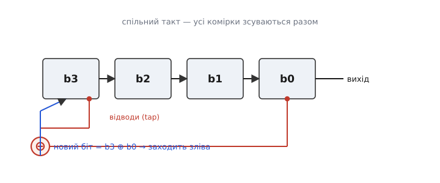
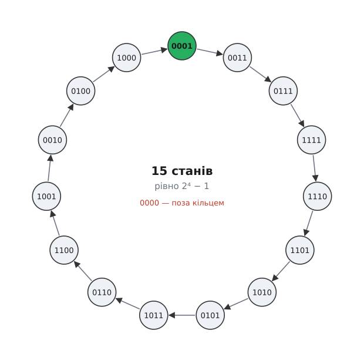
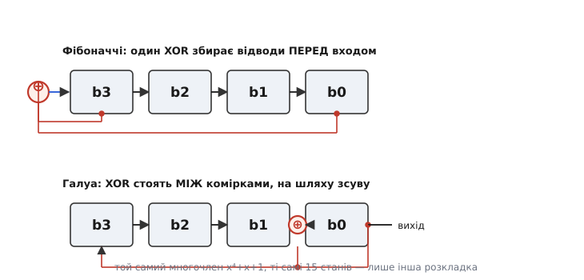

# LFSR — лінійний регістр зі зворотним зв'язком

Уявіть, що вам треба навипускати довгу низку бітів, які виглядають як чистий випадковий шум — то нуль, то одиниця, без жодного помітного ладу, — але при цьому щоб їх можна було відтворити точно, до біта, будь-коли й на будь-якому іншому чипі. Начебто суперечність: випадковість і повторюваність воднораз. І щоб усе це — майже задарма, кількома тригерами й одним-двома вентилями, без процесора, без пам'яті з готовою таблицею.

Саме це вміє **LFSR** — лінійний регістр зі зворотним зв'язком (англ. *linear-feedback shift register*, «зсувний регістр із лінійним зворотним зв'язком»). Ідея до смішного проста: беремо звичайний [зсувний регістр](book:electronics/shift-register) — ланцюжок тригерів, крізь який біти крокують по такту, — і замикаємо його самого на себе. Той біт, що заходить у ланцюг зліва, ми не беремо ззовні, а **обчислюємо з бітів, які вже сидять усередині**. Регістр починає живити сам себе, і його стан пускається блукати химерною, наче випадковою, дорогою — хоча насправді кожен крок жорстко визначений попереднім.

## Зсув, замкнений сам на себе

Щоб побачити, звідки береться уся ця поведінка, згадаймо, що робить голий зсувний регістр. На кожному фронті такту кожна комірка (звичайний [D-тригер](book:electronics/d-flip-flop)) хапає значення сусіда й тримає до наступного фронту — уся низка бітів дружно з'їжджає на один щабель. Зліва звільняється місце, і туди заходить якийсь новий біт; справа біт випадає й пропадає. Поки цей новий біт беруть ззовні (з лінії даних), регістр просто переносить чужі біти — це передавач.

Уся хитрість LFSR в одному питанні: **а що, як новий біт не брати ззовні, а зробити з тих, що вже в регістрі?** Виберемо кілька комірок — назвемо їхні виходи **відводами** (англ. *tap*, «відгалуження»), — складемо їхні значення особливою дією й подамо результат назад на вхід. Регістр замкнувся в петлю. Тепер його наступний стан цілком визначає теперішній: жодного зовнішнього входу немає, лише такт, що поганяє коло за колом.


*Звичайний зсув праворуч — та сама механіка, що й у будь-якому регістрі. Новина одна: два відводи (тут від крайніх комірок b3 і b0) заходять у вузол ⊕, а обчислений там біт повертається на вхід зліва. Регістр живить сам себе — зовнішнього входу даних немає, лишається тільки такт.*

Лишається вирішити головне: **якою саме дією** складати відводи. І тут ховається вся сіль — вибір не довільний, він визначає геть усю поведінку схеми.

## Чому саме XOR: лінійність і оборотність

Складати біти будемо через [**XOR**](book:electronics/basic-gates) — «виключне АБО» (англ. *exclusive OR*): вентиль, що дає 1, лише коли на двох входах — **різні** біти. Ось уся його таблиця: 0⊕0 = 0, 0⊕1 = 1, 1⊕0 = 1, 1⊕1 = 0. Це буквально **додавання за модулем 2** — додаєш біти й береш остачу від ділення на два. Саме звідси й слово «лінійний» у назві: зворотний зв'язок — це лінійна функція (сума) від бітів стану, без жодних «і», «або», без порогів і нелінійних вивертів.

Чому не якась інша дія? Причин дві, і обидві глибокі.

**Перша — рівновага.** XOR єдиний серед простих двовходових вентилів **не має улюбленого значення**. У AND вихід майже завжди 0 (одиниця лише коли обидва входи 1), у OR — майже завжди 1. Такий зворотний зв'язок швидко затягнув би регістр у болото самих нулів або самих одиниць. А XOR однаково охоче видає і 0, і 1: зміни будь-який один вхід — і вихід перевернеться. Тому потік бітів, який породжує XOR-зворотний зв'язок, виходить збалансований, без перекосу в один бік — саме те, що потрібне для «схожого на випадковий» шуму.

**Друга, важливіша — оборотність.** XOR має чудову властивість: він сам собі обернений. Якщо a⊕b = c, то c⊕b = a — «додав» те саме двічі й повернувся на початок. Через це кожен крок LFSR **можна відкрутити назад однозначно**: за поточним станом завжди відновлюється єдиний попередній. А коли всі кроки оборотні, схема ніколи не зіштовхне два різні стани в один — інакше назад вело б не одне минуле, а два, і оборотності не було б. Значить, стани не зливаються, а нанизуються в один суцільний **цикл**: регістр іде станами, поки не повернеться туди, звідки почав, і жоден стан по дорозі не повторюється двічі.

> 🔧 **Навіщо це.** Оборотність — не абстракція, а практична гарантія. Вона означає, що LFSR **ніколи не застрягне** й ніколи не зациклиться на короткому «болоті» з двох-трьох станів: із будь-якого стартового значення (крім одного, про яке зараз) він гарантовано пройде довгий цикл. Тому в реальній схемі не треба ні сторожового таймера, ні перевірки «а раптом заклинило» — сама природа XOR цього не допустить.

Є єдиний стан, що псує ідилію, — **усі нулі**. Якщо весь регістр обнулити, XOR від самих нулів дасть нуль, назад зайде нуль, і схема залипне в нулях назавжди. Тому 0000 — заборонений стан; його просто викидають з гри. Регістр завжди стартують із чогось ненульового (класично — з усіх одиниць), і в петлю всіх нулів він потрапити не може, бо, як ми щойно бачили, стани не зливаються: якби з двох різних станів можна було втрапити в нуль, оборотність зламалася б.

## Магія максимальної довжини: 2ⁿ − 1

Тепер найкрасивіше. Регістр із **n** комірок має рівно 2ⁿ можливих станів (усі комбінації n бітів). Один із них — усі нулі — випав. Лишається **2ⁿ − 1** «живих» станів. І виявляється: якщо **вдало вибрати відводи**, регістр обійде **геть усі ці 2ⁿ − 1 станів по одному** й лише потім повернеться на старт. Довший цикл фізично неможливий — станів більше просто немає. Таку послідовність звуть **максимальною**, або **m-послідовністю** (від *maximal-length sequence*). Її теорію — зв'язок відводів із многочленами, умову максимальної довжини, статистичні властивості — [звів докупи математик Соломон Голомб](book:electronics/lfsr/hist-golomb.md) у роботах від початку 1950-х, і саме він зробив із розсипу інженерних трюків струнку науку.

Порахуймо для чотирьох комірок. 2⁴ − 1 = 15. Правильно підібраний чотирикомірковий LFSR пройде всі п'ятнадцять ненульових станів, перш ніж замкнутися:


*Стартувавши з 0001, регістр іде станами за годинниковою стрілкою й після п'ятнадцятого кроку повертається в 0001 — жоден стан по дорозі не повторився. Це і є m-послідовність: усі 2⁴ − 1 = 15 ненульових станів в одному циклі. Заборонений 0000 висить окремо: у кільце йому ходу немає.*

Диво, що чотири тригери й один XOR породжують цикл із 15 станів, здається завеликим для такої дрібної схеми. Але прибуток лавинний. Десять комірок дають цикл 2¹⁰ − 1 = 1023. Тридцять дві — понад **чотири мільярди** станів (2³² − 1 = 4 294 967 295) з тридцяти двох тригерів і жменьки вентилів. Кожна додана комірка **подвоює** довжину циклу — це та сама двійкова експонента, що робить із коротких регістрів астрономічно довгі, не схожі на себе послідовності.

Але «вдало вибрати відводи» — умова сувора. Візьмеш відводи навмання — і цикл розпадеться на кілька коротких петель замість одного довгого. Наприклад, відводи від b3 і b2 у чотирикомірковому регістрі дадуть не один цикл на 15, а розсип дрібних. Максимальність буває лише за особливих наборів відводів, і які саме набори працюють — випливає з алгебри многочленів над полем із двох елементів. Кожному набору відводів відповідає свій **многочлен зворотного зв'язку**: відводам від b3 і b0 у нашому прикладі відповідає x⁴ + x + 1. Максимальний цикл виходить рівно тоді, коли цей многочлен належить до особливого класу — так званих **примітивних** над двійковим полем. Чому саме примітивність дає повний обхід і як її перевіряють — це окрема, гарна математика; її винесено у [виведення умови максимальної довжини](book:electronics/lfsr/math-max-length.md).

На щастя, для інженера все зведено до таблиць: для кожної розрядності давно пораховані набори відводів, що дають m-послідовність. Для 8 комірок працюють, скажімо, відводи 8, 6, 5, 4; для 16 — 16, 14, 13, 11; для 32 — 32, 22, 2, 1. Їх просто беруть готовими, як беруть готову формулу.

## Один цикл LFSR у C

Порахуймо LFSR у прошивці — щоб побачити, який він насправді крихітний. Стан тримаємо в звичайному цілому, відводи — маскою, крок — кількома побітовими операціями. Ось повний, робочий чотирикомірковий приклад із многочленом x⁴ + x + 1, той самий, що на кільці вище.

**Один такт максимального 4-бітного LFSR (Фібоначчі, зсув ліворуч, C):**

:::tabs
```cpp
#include <stdint.h>

// Відводи многочлена x^4 + x + 1 — це біти 3 і 0.
static uint8_t lfsr4_step(uint8_t state) {   // state — 4 молодші біти
    uint8_t b3 = (state >> 3) & 1u;          // старший відвід
    uint8_t b0 =  state       & 1u;          // молодший відвід
    uint8_t feedback = b3 ^ b0;              // XOR — новий біт
    state = (uint8_t)((state << 1) | feedback) & 0x0Fu;  // зсув ліворуч + вкидання
    return state;
}
```
```python
# Відводи многочлена x^4 + x + 1 — це біти 3 і 0.
def lfsr4_step(state):               # state — 4 молодші біти
    b3 = (state >> 3) & 1            # старший відвід
    b0 =  state       & 1           # молодший відвід
    feedback = b3 ^ b0              # XOR — новий біт
    state = ((state << 1) | feedback) & 0x0F  # зсув ліворуч + вкидання
    return state
```
:::

Розберемо рядок зсуву, бо в ньому вся механіка. `state << 1` штовхає всі біти на щабель ліворуч (це і є зсув регістра), `| feedback` вставляє щойно обчислений біт на звільнене місце праворуч, а `& 0x0Fu` відкидає біт, що виїхав за межі чотирьох розрядів (у залізі він би просто випав з ланцюга). Три операції — і маємо повний такт LFSR.

Проженемо повний цикл і поглянемо на потік старших бітів, який регістр видає назовні:

**Повний обхід і збирання потоку бітів (C):**

:::tabs
```cpp
#include <stdio.h>

int main(void) {
    uint8_t s = 0x1u;            // старт: 0001 (аби не заборонений 0000)
    for (int i = 0; i < 15; i++) {
        int out_bit = (s >> 3) & 1;   // знімаємо старший біт як вихід
        printf("%d ", out_bit);
        s = lfsr4_step(s);
    }
    // Надрукує:  0 0 0 1 1 1 1 0 1 0 1 1 0 0 1
    return 0;
}
```
```python
s = 0x1                          # старт: 0001 (аби не заборонений 0000)
for _ in range(15):
    out_bit = (s >> 3) & 1      # знімаємо старший біт як вихід
    print(out_bit, end=" ")
    s = lfsr4_step(s)
# Надрукує:  0 0 0 1 1 1 1 0 1 0 1 1 0 0 1
```
:::

Потік `000111101011001` за п'ятнадцять тактів — і далі він повторюється точно так само, знову й знову. Порахуймо в ньому одиниці й нулі: вісім одиниць проти семи нулів. Це не випадковість, а **закон m-послідовності**: у кожному повному циклі одиниць рівно на одну більше, ніж нулів (2ⁿ⁻¹ проти 2ⁿ⁻¹ − 1). Потік виглядає безладним, а насправді строго врівноважений — з такою ж точністю в ньому розкладені й пари, і трійки бітів. Саме тому його звуть **псевдовипадковим** (гр. *pseudo-* — несправжній): статистика як у шуму, а походження цілком детерміноване. За це його ще називають PRBS — *pseudo-random binary sequence*, псевдовипадкова двійкова послідовність.

## Дві розкладки: Фібоначчі й Галуа

Той самий LFSR можна скласти двома способами — і початківця це часто збиває.

У розкладці **Фібоначчі** (названій на честь славетної числової послідовності, бо новий член так само збирається з кількох попередніх) усі відводи заходять в **один** XOR, і його вихід — новий біт на вхід ланцюга. Саме її ми досі й малювали. Її мінус: якщо відводів багато, кілька XOR доводиться ставити ланцюжком **перед** входом, і сумарна затримка цього ланцюжка обмежує частоту такту.

У розкладці **Галуа** (на честь французького математика Евариста Галуа, чия алгебра скінченних полів і стоїть за всією теорією m-послідовностей) XOR розкидані **між комірками**, просто на шляху зсуву. Один біт зворотного зв'язку керує всіма ними одразу. Виграш у тому, що між будь-якими двома сусідніми тригерами стоїть щонайбільше **один** XOR — ланцюжка затримок немає, тож така схема тактується швидше. Тому в залізі, де женуть на високій частоті, частіше беруть Галуа.


*Дві однакові за результатом схеми. У Фібоначчі відводи зводяться в один XOR перед входом — просто, але за багатьох відводів XOR-и шикуються в ланцюжок і гальмують такт. У Галуа той самий зворотний зв'язок розкиданий вентилями між комірками, тож між сусідніми тригерами — не більш як один XOR: коротший шлях, вища частота. Многочлен x⁴ + x + 1 і всі 15 станів у них однакові — різниться лише розкладка та, як правило, порядок бітів у потоці.*

Головне не заплутатися: **це не два різні пристрої, а дві збірки одного**. Обидві дають цикл тієї самої довжини за тим самим многочленом; відрізняються внутрішнім порядком станів і зручністю в залізі, а не суттю.

## Де це живе

Крихітність і повторюваність LFSR зробили його робочою конячкою там, де потрібен довгий детермінований «шум».

**Самоперевірка мікросхем.** Найчастіший ужиток — вбудоване самотестування цифрових блоків (англ. *built-in self-test*, BIST). LFSR на вході схеми генерує довжелезну псевдовипадкову низку тестових наборів — дешевше, ніж зберігати їх у пам'яті. Інший, «стискальний» LFSR на виході згортає весь потік відповідей у коротку **сигнатуру** (кілька байтів): якщо чип справний, сигнатура збігається з еталонною до біта; будь-яка несправність майже напевно її зіпсує. Так одним регістром покривають те, на що інакше пішли б гори тестових векторів.

**Скремблери в передаванні даних.** Перед відправкою по лінії потік XOR-ять із псевдовипадковою низкою від LFSR, а на приймачі XOR-ять із такою самою — і дані відновлюються (знову та сама оборотність XOR!). Навіщо: якщо у даних трапиться довгий шмат однакових бітів, у лінії просяде синхронізація й полізе стала складова; скремблер «розмішує» будь-які дані так, що переходів 0↔1 стає вдосталь, а спектр вирівнюється. Це роблять у Ethernet, USB, PCIe, SATA — усюди, де біти женуть швидким послідовним каналом.

**Розширення спектра.** Множення сигналу на швидку m-послідовність «розмазує» його по широкій смузі частот — на цьому стоїть [розширення спектра](book:electronics/spread-spectrum-clocking) в радіозв'язку й супутниковій навігації. Кожен супутник GPS має свою m-послідовність-«підпис»; приймач упізнає його, звіряючи прийняте з відомою послідовністю, і кілька передавачів мирно ділять одну частоту, бо їхні коди майже не корелюють між собою.

**Дешеве джерело шуму й лічильники.** Коли потрібне просте псевдовипадкове число без криптографії — розсіяти моменти опитування, «підкинути монету» в грі, — LFSR дає його майже задарма. І як бонус: LFSR-«лічильник» на 2ⁿ − 1 станів у залізі часто **менший і швидший** за звичайний двійковий [лічильник](book:electronics/counters), бо не має довгого ланцюга переносу — щоправда, рахує він у своєму химерному порядку, а не 0, 1, 2, 3.

## Чого LFSR не вміє

Найважливіше застереження — про межу цієї простоти. Та сама лінійність, що дарує оборотність і рівновагу, є й фатальною слабкістю: **LFSR не годиться для криптографії**. Потік виглядає випадковим для ока, але він **лінійний**, а тому передбачуваний. Хто підгляне лише кілька десятків бітів на виході n-коміркового LFSR (досить трохи більш ніж 2n), той відновить і всі відводи, і весь стан — а отже, порахує **всю** нескінченну низку наперед і назад. Розв'язання зводиться до простої лінійної системи рівнянь, яку комп'ютер клацає миттєво (це роблять алгоритмом Берлекемпа — Мессі). Тому «зашифрувати» дані голим LFSR — все одно що не шифрувати; справжні шифри або нелінійно перемішують кілька LFSR, або будуються на зовсім іншому підмурку.

Отут і сходиться вся суть. LFSR — це не генератор випадковості й не шифр, а **найдешевший спосіб отримати довгу, точно відтворювану, статистично рівну низку бітів** з кількох тригерів. Там, де цінують саме це поєднання — копійчану ціну, повторюваність до біта й гарну статистику, а таємність не потрібна, — йому досі немає рівних.
