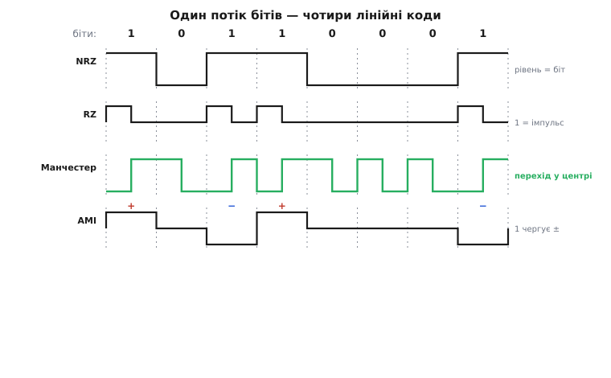
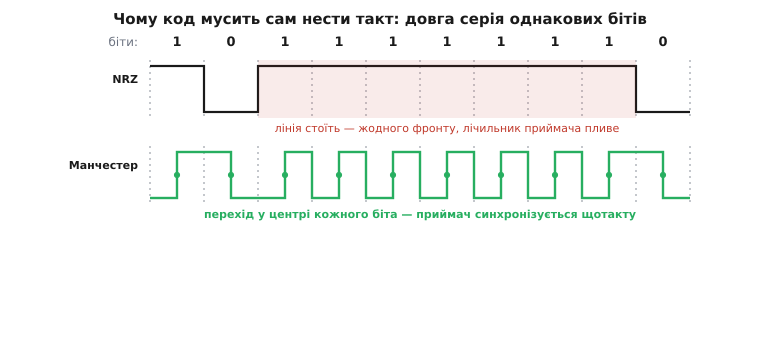
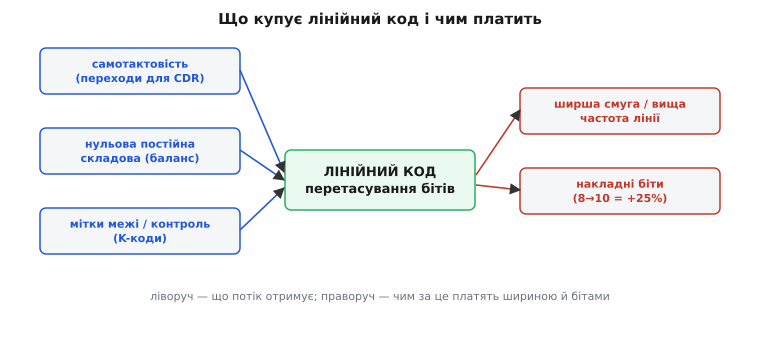

# Лінійне кодування: як навчити один дріт нести і біти, і ритм

Уявіть найпростішу задачу на світі: передати одиниці й нулі одним дротом. Рішення напрошується саме собою — домовитися, що висока напруга означає 1, низька означає 0, і смикати дріт у такт бітам. Приймач читає рівень, ставить 1 або 0 — і готово. Це справді працює, і для повільної лінії з окремим тактовим дротом кращого й не треба.

А тоді ви прибираєте тактовий дріт (бо на швидкій лінії він сам себе не тягне), пускаєте потік трохи швидше — і все розсипається, причому з трьох різних причин одночасно. Виявляється, «поклади напругу за бітом» — не єдиний і часто не найкращий спосіб перекласти біти на сигнал. Спосіб, у який логічні нулі й одиниці перетворюють на конкретну форму напруги (чи струму, чи світла) в лінії, називають **лінійним кодуванням** (англ. *line coding* — «кодування для лінії»). Розберімо, які саме три біди ховаються за наївним «напруга = біт», і як різні коди — від NRZ до манчестерського — по-різному ці біди лікують.

### Три біди наївного «напруга = біт»

Почнімо з болю, бо саме він народжує всі коди. Наївна схема — тримати весь такт високий рівень для 1 і низький для 0 — має власну назву: **NRZ** (англ. *Non-Return-to-Zero* — «без повернення до нуля», бо рівень між сусідніми однаковими бітами нікуди не повертається, а просто стоїть). І з нею не так усе гладко.

**Біда перша: приймач не знає, де межа біта.** Поки біти чергуються — `1010…` — лінія весело перемикається, і за цими перемиканнями видно ритм. Але киньте в неї сто одиниць поспіль. Рівень підскочив угору й **стоїть** усі сто тактів — рівна, німа поличка без жодного перемикання. Приймач мусить сам відлічувати, де кінчається один біт і починається наступний, за власним внутрішнім лічильником. А лічильник — не ідеальний: він трохи біжить швидше або повільніше за передавач. На десяти бітах розбіжність дрібна, на сотні німих бітів вона накопичується — і приймач збивається з рахунку, зчитує 99 одиниць або 101. Жодного біта не спотворив шум — а байти вже поламані, просто тому, що **лінія надто довго мовчала**.

**Біда друга: постійна складова пливе.** Порахуйте середню напругу потоку. Якщо одиниць і нулів приблизно порівну, середина сигналу тримається десь посередині між рівнями. Але щойно пішла довга серія одного знаку, середнє повзе то вгору, то вниз — у сигналі з'являється **постійна складова** (англ. *DC component* — «постійний струм»), яка блукає слідом за даними. Для короткого дроту дрібниця. Але дуже багато реальних ліній зв'язані з приймачем **не напряму, а через конденсатор або трансформатор** — так роблять, щоб розв'язати схеми за постійним струмом і вбити земляні петлі. А конденсатор із трансформатором [постійну складову не пропускають](topic:electronics/ac-coupling) — вони бачать лише зміни. Пропустіть крізь них потік, у якому «одиниць довго більше, ніж нулів», — і рівень на тім боці почне повільно сповзати, аж поки приймач переплутає високе з низьким. Дані самі себе засліплюють.

**Біда третя: немає де поставити мітку.** Навіть якщо приймач ідеально ловить кожен окремий біт, лишається питання: з якого біта починається байт? З лінії суне суцільна стрічка `…01101001…` — де тут межа слова? Помилка на один біт у виборі межі спотворить кожен наступний байт, хоч усі біти прийняті чисто. У наївній NRZ усі комбінації рівнів — це просто дані, серед них немає жодного особливого візерунка, який можна було б пустити маяком «ось звідси рахуй».


*Той самий потік `1 0 1 1 0 0 0 1` чотирма кодами. NRZ: рівень дорівнює біту й стоїть увесь такт. RZ: одиниця — короткий імпульс, що встигає повернутися до нуля. Манчестер: у середині кожного біта завжди є перехід (тут за конвенцією IEEE: 1 — знизу вгору, 0 — згори вниз). AMI: нуль — це нуль, а кожна одиниця — імпульс із полярністю, що чергується +, −, +, −.*

Ці три біди — не окремі капризи, а один вузол: **потік бітів сам собою не годиться для дроту**. У ньому бракує переходів (щоб тримати ритм), бракує рівноваги знаків (щоб не плив рівень) і бракує особливих міток (щоб знайти межу). Лінійне кодування — це і є ремесло перетасувати біти в сигнал так, щоб він **сам ніс усе, чого йому бракує**.

> 🔧 **Навіщо це.** Коли на практиці «лінк не піднімається» або дані сиплються без видимої причини, винний часто саме код. Не тримається синхронізація на довгих однакових ділянках — бракує переходів, треба самотактовий код. Повільно «пливе» рівень на осцилографі — розбалансована постійна складова б'ється об конденсаторну розв'язку. Цілі байти зсунуті, хоч біти чисті, — приймач не знайшов межі. Знати коди означає одразу бачити, яка з трьох бід тебе вкусила.

### Самотактовий код: сховати такт у самі дані

Візьмімося за першу біду — німі ділянки. Корінь її в тому, що в NRZ **тривалий однаковий біт не дає жодного перемикання**. А що, як зробити код, у якому перемикання є **завжди**, у кожному біті, незалежно від того, які дані йдуть? Тоді приймачеві буде за що чіплятися щотакту, і його лічильник ніколи не попливе, бо його раз у раз підправляє свіжий фронт.

Саме так улаштований **манчестерський код** (англ. *Manchester code*; названий за Манчестерським університетом, де народився). Ідея гарна своєю простотою: кожен біт кодують не рівнем, а **напрямком переходу в середині свого такту**. Одиниця — перехід знизу вгору, нуль — згори вниз (це конвенція, ужита в Ethernet; історично перша, томасівська, була дзеркальна — але суть та сама). Дані більше не в тому, високо чи низько стоїть лінія, а в тому, **куди вона стрибає посеред біта**.

Наслідок чарівний: **у кожному такті гарантовано є один перехід** — той, що несе біт. Хоч мільйон одиниць поспіль, хоч мільйон нулів — лінія все одно перемикається щобіта, і приймачеві завжди є за що триматися. Такт більше не треба вести окремим дротом: він **захований у самих даних**, бо межу кожного біта видно по обов'язковому центральному переходу. Такі коди й звуть **самотактовими** (англ. *self-clocking*).


*Сім одиниць поспіль. Угорі NRZ: рівень підскочив і стоїть — жодного фронту на всій німій ділянці, приймачеві нема чим підправити свій лічильник, і він поволі збивається. Унизу манчестерський код: у центрі кожного біта — обов'язковий перехід, тож приймач синхронізується на кожному такті, скільки б однакових бітів не йшло підряд.*

Заразом манчестерський код без окремих зусиль розв'язує й другу біду. Кожен біт у ньому — це половина такту вгорі й половина внизу (перехід ділить такт навпіл), тож **кожен окремий біт уже сам збалансований**: рівно стільки ж «високого», скільки «низького». Середнє сидить точно посередині завжди, незалежно від даних, — постійної складової просто нема чому нагромаджуватися. Один прийом — а вилікувано дві біди відразу.

Не дивно, що манчестерський код народився саме там, де обидві біди були нестерпні. Його придумали 1948–1949 років у Манчестерському університеті для запису на магнітний барабан першого комп'ютера **Manchester Mark 1**: барабанні головки під'єднувалися через трансформатор і постійну складову не пропускали, тож дані **мусили** зберігатися у формі без постійної складової. [Як манчестерський код народився з магнітного барабана](topic:electronics/line-coding/hist-manchester-drum.md) — окрема добра історія; тут головне, що самотактовість і нульова постійна складова — не пізніше оздоблення, а причина, з якої код узагалі з'явився. Пізніше він доробив службу в ранньому Ethernet (10 Мбіт/с), у RFID-мітках і навіть на борту «Вояджерів».

За все це манчестерський код платить одну відчутну ціну — **удвічі ширшу смугу**. Найгустіший його сигнал (наприклад, суцільні одиниці) перемикається двічі за такт: раз посеред біта на дані, раз на межі, готуючись до наступного. Отже, найшвидша зміна в лінії стає вдвічі частішою, ніж у NRZ на тих самих даних, а це вимагає вдвічі ширшої смуги пропускання від дроту, драйвера й приймача. На повільних лініях це дрібниця, і простота коду перемагає; на гігабітних — розкіш, якої не дозволяють, і там ідуть хитрішими шляхами.

### Повернутися до нуля: коди з трьома рівнями

Манчестер — не єдиний спосіб набити потік переходами. Є ціла родина кодів, які роблять інакший хід: **повертають лінію до нуля посеред кожного біта**. Звідси й назва — **RZ** (англ. *Return-to-Zero* — «з поверненням до нуля»), протиставлена до NRZ. Одиниця в найпростішому RZ — це імпульс, що спалахує в першій половині такту й **сам гасне** до нуля в другій; нуль — це просто нуль весь такт.

Виграш у тому, що кожна одиниця тепер обов'язково дає **два фронти** (угору й назад), тобто несе ритм. Але чиста RZ вирішує проблему лише наполовину: **на нулях лінія так само мовчить**, бо нуль — це рівний нуль без жодного переходу. Довга серія нулів у RZ так само засліплює приймач, як серія одиниць у NRZ. Тому чиста RZ у комунікаціях рідкість — але сама ідея «повертатися до опорного рівня» дуже плідна, коли до неї додати ще один трюк.

Цей трюк — узяти **три рівні** замість двох: плюс, нуль і мінус. Найвідоміший такий код — **AMI** (англ. *Alternate Mark Inversion* — «чергування полярності позначки», де «позначка», *mark*, — старий телеграфний синонім одиниці). Правило коротке: нуль передається нулем (лінія в спокої), а кожна одиниця — імпульсом, але **полярність імпульсів чергується**: перша одиниця +, друга −, третя знову +, і так далі, незалежно від того, скільки нулів між ними.

Навіщо ця забавка з чергуванням? Заради **другої біди — постійної складової**. Якщо кожна наступна одиниця протилежна попередній, то плюси й мінуси взаємно гасяться, і середнє сидить рівно на нулі **за будь-яких даних** — стільки б одиниць не йшло. AMI дає ідеальну нульову постійну складову без жодних накладних бітів і без подвоєння смуги — саме тому він десятиліттями возив голос у першому поколінні цифрової телефонії, у системах **T1** (Північна Америка) і **E1** (Європа), де мідні пари й трансформатори постійну складову не пропускали.

Але вада AMI лежить рівно там, де в NRZ: **довга серія нулів усе одно вбиває ритм**. Нулі в ньому — це тиша, і сто нулів поспіль дають сто тактів без жодного імпульсу; приймач пливе. Телефоністи залатали цю дірку насильно: у європейському варіанті **HDB3** (англ. *High-Density Bipolar order 3* — «біполярний код високої щільності 3-го порядку», стандартизований ITU-T у рекомендації G.703 на початку 1970-х) домовилися, що **чотири нулі поспіль ніколи не пропускають тихцем** — замість них у лінію вставляють особливий візерунок із навмисним «неправильним» імпульсом. Приймач упізнає це навмисне порушення чергування, розуміє, що то не дані, а «затичка проти тиші», і викидає її, відновлюючи справжні нулі. Ритм урятовано, баланс збережено — ціною хитрішого кодера.

> 🔧 **Навіщо це.** Три рівні замість двох — це не примха, а точний інструмент: вони дозволяють тримати нульову постійну складову **без** подвоєння смуги, як у манчестерського коду. Тому в дротовій телефонії, де кожен герц смуги на довгій мідній парі на вагу золота, пішли саме шляхом AMI й HDB3, а не манчестерського. Вибір коду — завжди розмін: скільки смуги ти готовий віддати за самотактовість і баланс.

### Мітка межі й розмін смуги: чому 8 бітів їдуть як 10

Лишається третя біда — **де початок слова**. Манчестерський код і AMI дають ритм і баланс, але жоден із них сам не каже, з якого біта починається байт. Для повільних ліній це вирішують окремими стартовими сигналами. Але для швидких послідовних ліній є елегантніший клас кодів, які вбивають усіх трьох зайців одним пострілом і заразом ощадять смугу, — **блокові коди**.

Ідея блокового коду інша, ніж у манчестерського. Манчестер працює **побітно**: кожен окремий біт перекодовує в перехід, і саме тому подвоює смугу. Блоковий код бере **цілу групу бітів** і замінює її трохи більшою групою — так, щоб серед вихідних комбінацій були лише «хороші»: із достатнім числом переходів і збалансовані. Класика — **8b/10b**: кожні 8 бітів даних замінюють на 10 бітів у лінії. Два зайві біти на байт — це лише 25% накладних (проти +100% у манчестерського!), і за них купують усе одразу: код підібрано так, що ніколи не буває більш ніж п'ять однакових бітів поспіль (ритм для приймача), нулі й одиниці тримаються в рівновазі (баланс постійної складової), а частина 10-бітових комбінацій **не використовується під дані** й лишається запасом особливих міток — зокрема головної мітки межі, яку звуть **комою**. Приймач шукає кому в потоці, як маяк, і від неї відлічує байти.

Механіку блокового коду — як саме працює [8b/10b і його баланс постійної складової](topic:electronics/serdes/math-8b10b-disparity.md) — розбирають окремо; тут головна думка в самому розміні. Манчестер платить за самотактовість **сто відсотків смуги**, зате він гранично простий і не потребує ніякої логіки на кодування. Блоковий код платить **лише двадцять п'ять відсотків**, дає ще й мітки межі, зате вимагає таблиці перекодування й розумного кодера. Тому манчестерський код живе там, де цінують простоту (RFID, повільні промислові шини), а 8b/10b — там, де женуть гігабіти й економлять кожен герц: гігабітний Ethernet, SATA, USB 3.0, ранні покоління PCI Express. У найновіших, найшвидших лінках навіть 25% стали задорогими, і там перейшли на коди зі **скремблюванням** (перемішуванням даних із псевдовипадковою послідовністю, як 128b/130b у пізніх PCIe) — але задум лишився той самий, що й у наївного манчестерського коду 1949 року: **перетасувати біти так, щоб потік сам ніс і ритм, і баланс, і межу**.


*Лінійне кодування — завжди угода. Праворуч від кожного коду стоїть ціна: манчестерський дає самотактовість і баланс, але коштує подвоєної смуги; блоковий 8b/10b дає ще й мітки межі за скромні 25% накладних бітів; AMI дає баланс майже задарма, але не рятує від довгих нулів. Немає безкоштовного коду — є розмін під конкретну лінію.*

### Манчестер у коді: закодувати й прочитати без окремого такту

Щоб побачити самотактовість не на осцилографі, а зсередини, зберемо манчестерський кодер і декодер у справжньому C. Це не іграшка: саме так «bit-bang» роблять на повільній лінії — наприклад, коли треба віддати кілька байтів у канал без окремого тактового дроту, а лінію читають частою вибіркою.

**Закодувати один біт: викласти дві половинки такту.** За конвенцією Ethernet одиниця — це «низько, потім високо», нуль — «високо, потім низько». Кожен біт даних перетворюється на **дві** позиції в лінії:

:::tabs
```cpp
// Викласти один біт даних як дві половинки манчестерського символу.
// set_line(level) кладе рівень; half_tick() витримує півтакту.
// Конвенція IEEE 802.3: 1 → низько-високо, 0 → високо-низько.
void manchester_send_bit(uint8_t bit)
{
    if (bit) {                 // одиниця: перехід угору посеред біта
        set_line(0); half_tick();
        set_line(1); half_tick();
    } else {                   // нуль: перехід униз посеред біта
        set_line(1); half_tick();
        set_line(0); half_tick();
    }
}
```
```python
# Викласти один біт даних як дві половинки манчестерського символу.
# set_line(level) кладе рівень; half_tick() витримує півтакту.
# Конвенція IEEE 802.3: 1 → низько-високо, 0 → високо-низько.
def manchester_send_bit(bit):
    if bit:                    # одиниця: перехід угору посеред біта
        set_line(0); half_tick()
        set_line(1); half_tick()
    else:                      # нуль: перехід униз посеред біта
        set_line(1); half_tick()
        set_line(0); half_tick()
```
:::

Тут видно, звідки береться подвоєна смуга: на **один** біт даних припадають **два** такти виставляння рівня. Зате видно й самотактовість: у середині кожного біта — гарантований перехід, той самий, що несе значення. Байт шлемо старшим бітом уперед, просто прокрутивши це вісім разів:

:::tabs
```cpp
// Послати цілий байт манчестерським кодом, старший біт першим.
void manchester_send_byte(uint8_t data)
{
    for (int i = 7; i >= 0; i--)
        manchester_send_bit((data >> i) & 1);
}
```
```python
# Послати цілий байт манчестерським кодом, старший біт першим.
def manchester_send_byte(data):
    for i in range(7, -1, -1):
        manchester_send_bit((data >> i) & 1)
```
:::

**Прочитати біт: подивитися, куди стрибнула лінія в центрі.** Приймач не має окремого такту — він орієнтується на самі переходи. Найпростіша схема: знайшовши початок символу, він чекає до **середини** такту й дивиться на напрямок центрального переходу. Значення несе саме він: перехід угору — прийшла одиниця, униз — нуль.

:::tabs
```cpp
// Прочитати один манчестерський біт: значення дає центральний перехід.
// Приймач уже стоїть на початку символу (синхронізований по фронту).
// read_line() повертає поточний рівень; half_tick() — півтакту.
uint8_t manchester_recv_bit(void)
{
    uint8_t first = read_line();   // рівень у першій половині такту
    half_tick();                    // переходимо через центр біта
    uint8_t second = read_line();   // рівень у другій половині
    half_tick();                    // достоюємо до кінця символу
    return (second > first) ? 1 : 0;   // угору (0→1) = 1, униз = 0
}
```
```python
# Прочитати один манчестерський біт: значення дає центральний перехід.
# Приймач уже стоїть на початку символу (синхронізований по фронту).
# read_line() повертає поточний рівень; half_tick() — півтакту.
def manchester_recv_bit():
    first = read_line()    # рівень у першій половині такту
    half_tick()            # переходимо через центр біта
    second = read_line()   # рівень у другій половині
    half_tick()            # достоюємо до кінця символу
    return 1 if second > first else 0   # угору (0→1) = 1, униз = 0
```
:::

Придивіться до `return (second > first)`. Приймач **не питає, високо чи низько стоїть лінія** — тільки **куди вона стрибнула** посеред біта. Через це манчестерський код байдужий до повільного дрейфу рівня: навіть якщо весь сигнал поволі сповз угору чи вниз, напрямок центрального переходу не змінюється — і біт читається правильно. Ось чому нульова постійна складова й самотактовість у ньому — не два різні дари, а два боки того самого простого правила «дивись на перехід, не на рівень».

Тут же випливає й обмеження цього наївного bit-bang: він мовчки припускає, що приймач **уже знає межу біта** — стоїть рівно на початку символу. У суцільному потоці цю межу ще треба знайти й весь час підтримувати. Справжні швидкі приймачі роблять це апаратно, [відновлюючи такт із самих переходів](topic:electronics/clock-data-recovery): підстроюють власний генератор так, щоб влучати рівно в середину кожного біта. І саме заради того, щоб таких переходів у потоці не бракувало, а середина біта була чиста й широка, весь цей клопіт із лінійним кодуванням і затівається.

### Що з усього цього тримати в голові

Зведімо нитку. Наївне «напруга = біт» (код NRZ) страждає від трьох бід: німі ділянки на довгих однакових бітах збивають приймачеві ритм, незбалансований потік нагромаджує постійну складову, яку вбиває конденсаторна розв'язка, і немає особливої мітки, щоб знайти межу слова. Лінійне кодування — це різні способи перетасувати біти в сигнал так, щоб він сам ніс те, чого йому бракує.

**Манчестерський код** кладе обов'язковий перехід у центр кожного біта: за один прийом він і самотактовий (переходи щобіта), і збалансований (кожен біт наполовину вгорі, наполовину внизу) — ціною подвоєної смуги; тому він живе там, де цінують простоту. **Коди з поверненням до нуля** (RZ) та **триполярні** коди на кшталт **AMI/HDB3** тримають нульову постійну складову чергуванням полярності майже задарма — тому їх обрала дротова телефонія, де смуга дорога. **Блокові коди** (8b/10b і нащадки) замінюють групу бітів трохи більшою «хорошою» групою й купують усі три властивості разом, ще й додають мітки межі, за скромні 25% накладних — тому вони возять гігабіти в USB, SATA та PCI Express.

Здоров'я будь-якої такої лінії читають однією картинкою — [діаграмою ока](topic:electronics/eye-diagram): накладають усі біти потоку один на одного й дивляться на просвіт-«око». Широко розкрите око означає, що в приймача щедрий запас і за напругою, і за часом; зімкнуте — що лінія на межі. За тим самим оком видно й почерк невдалого коду: мляві переходи від нестачі самотактовості, сповзання від розбалансованої постійної складової. Правильний код — це не деталь, а перша умова того, щоб один-єдиний дріт упевнено ніс не лише біти, а й ритм, у якому їх читати.
