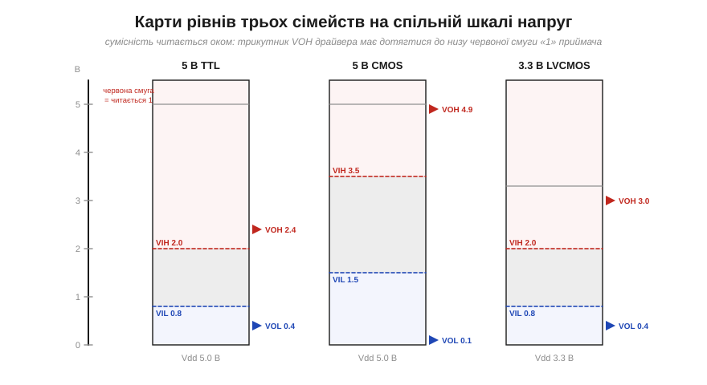
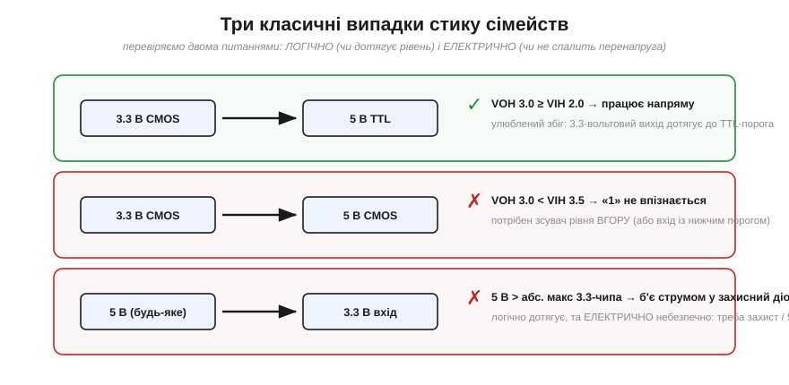

# Логічні сімейства й рівні (TTL/CMOS; 5 В / 3.3 В)

Коли цифрову схему описують через [рівні-діапазони](book:electronics/logic-levels-as-ranges) та [запас завадостійкості](book:electronics/noise-margin), конкретні числа — VIL = 1.0, VIH = 2.3, запас 0.7 В — завжди є лише «прикладом». Бо чесна правда така: **єдиних, універсальних порогів не існує**. Скільки рівно вольтів вважати одиницею, де поставити пороги, до якої шини тиснути вихід — усе це задає **логічне сімейство** (*logic family*): домовленість, якої дотримуються виробники, щоб їхні чипи **розуміли одне одного**. Підключаючи дві мікросхеми, ви насправді стикаєте два таких «договори» — і якщо вони не збігаються, починаються біди. Ця стаття — про найважливіші сімейства, про марш напруг від 5 до 3.3 В і нижче, і про головне практичне питання: **коли різні чипи порозуміються, а коли ні**.

### Що таке логічне сімейство

Сімейство — це повний набір угод: яка напруга живлення, де чотири пороги (VIL/VIH/VOL/VOH), скільки струму може віддати чи прийняти вихід, як швидко перемикається, скільки споживає. Чипи **одного** сімейства гарантовано стикуються між собою — їхні виходи з запасом перекривають входи (бо так задумано). А ось стик **різних** сімейств треба щоразу перевіряти власноруч: ніхто не пообіцяв, що вони збігаються.

Історично сімейств було багато (RTL, DTL, ECL, NMOS…), та для нас сьогодні важать дві великі лінії, що виросли прямо з транзисторних ключів: **TTL** і **CMOS**.

### Дві великі лінії: TTL і CMOS


*Дві родини логіки. **TTL** (*transistor-transistor logic*) збудована на [біполярних транзисторах](book:electronics/bjt-operation): живлення 5 В, пороги несиметричні (VIL 0.8 / VIH 2.0 В), вхід помітно споживає струм, чип гріється навіть у спокої, а «висячий» вхід поводиться приблизно як «1». **CMOS** (*complementary MOS*) збудована на [парах NMOS+PMOS](book:electronics/cmos): вихід тиснеться майже до шин, пороги симетричні (≈ 0.3/0.7 Vdd), статичний струм майже нульовий, вхід має величезний опір — і саме тому його не можна лишати «висіти».*

Різниця корениться у фізиці компонентів. **TTL** походить від [біполярного ключа](book:electronics/bjt-switch): щоб тримати стан, база мусить **споживати струм**, тому TTL-вхід «тягне» зі схеми мікроампери-міліампери, а сам чип безперервно щось розсіює. Пороги в TTL зсунуті вниз і несиметричні (історична спадщина схемотехніки на BJT). **CMOS** виросла з тієї дивовижної [пари транзисторів](book:electronics/cmos), де в усталеному стані **завжди один із двох закритий**, тож наскрізного струму майже немає — звідси легендарна економність. Вихід CMOS у спокої з'єднаний або з живленням, або з землею майже без втрат, тому VOH ≈ Vdd, а VOL ≈ 0. А вхід CMOS — це **затвор-ізолятор** (конденсатор), тож постійного струму він майже не споживає — лише **мізерний струм витоку** (input leakage IIH/IIL та витік ESD-структур, від наноампер до мікроампер за даташитом), — і тому має величезний вхідний опір.

Сьогодні майже вся логіка — **CMOS** (через малу потужність це безальтернативно для всього живленого від батарей, як-от ESP32). Але — і це ключова деталь для практики — **«TTL-рівні» лишилися** як поширений стандарт порогів. Дуже багато сучасних CMOS-чипів навмисно роблять із TTL-сумісними порогами (VIH ≈ 2.0 В), щоб старе й нове досі стикувалося. Тому, читаючи даташит, ви часто бачите CMOS-чип «із TTL-сумісними входами».

> 🔧 **Навіщо це.** Дві поведінки, які зекономлять вам години. Перша: **CMOS-вхід не можна лишати «висіти»** в повітрі. У TTL висячий вхід тяжіє до «1», а ось у CMOS він — як антена: величезний опір ловить будь-яке наведення, і вхід безладно стрибає 0↔1, ще й гріється наскрізним струмом (та сама [заборонена зона](book:electronics/logic-levels-as-ranges) між порогами). Тому **кожен** невикористаний чи нормально-розімкнений CMOS-вхід прив'язують до 0 чи до Vdd резистором ([підтяжкою](book:electronics/floating-pullups)). Друга: TTL-вхід **споживає** струм, тож рахуючи, скільки входів потягне один вихід (*fan-out*), для TTL це питання струму, а для CMOS — майже лише питання швидкості (бо втрати на ємності).

### Драбина напруг: чому логіка «спускається»

Друга вісь, по якій розрізняють сімейства, — **напруга живлення**. Класика працювала на **5 В**. Та з роками логіка вперто «спускалася» драбиною: 3.3 → 2.5 → 1.8 → 1.2 В і нижче.


*Марш напруг униз. Головний виграш кожної сходинки — **менше енергії** на перемикання (вона росте як квадрат напруги, E ∝ C·V²). Швидкодію ж дає не сама низька напруга, а **дрібніші транзистори** новіших техпроцесів, які заодно й живляться нижче; за тієї самої технології нижча Vdd радше трохи **сповільнює** вентиль (слабший струм заряджає ємність). Платою за низьку напругу є **менший абсолютний [запас завадостійкості](book:electronics/noise-margin)** і складніше живлення. 3.3 В (де працює ESP32) — сьогоднішній «золотий компроміс» для периферії та зв'язку.*

Чому вниз? Передусім заради **енергії**: щоб перемкнути вентиль, треба перезарядити його паразитну ємність, а ця енергія пропорційна **квадрату** напруги (E ∝ C·V²), тож половинне живлення — учетверо менше тепла й споживання. (Поширене «нижча напруга = швидше» — спрощення: швидкодію дають не низькі вольти самі по собі, а дрібніші транзистори новіших техпроцесів — вони ж і живляться нижче; за фіксованої технології нижча Vdd навпаки трохи **сповільнює** логіку.) Тому процесорні ядра «голодують» на 1.0–1.2 В заради економії. Але є й зворотний бік: [запас завадостійкості](book:electronics/noise-margin) ≈ (0.25…0.3)·Vdd, тож із падінням живлення **абсолютний** запас тане, і низьковольтні лінії стають тендітнішими до наведень. 3.3 В — поширений нинішній компроміс: уже економно, але запас (≈ 1 В) ще пристойний; саме на 3.3 В працює більшість сучасної периферії, давачів і — що для нас головне — ESP32.

### Карти рівнів на спільній шкалі

Тепер найкорисніше — побачити кілька сімейств **на одній шкалі напруг**, щоб сумісність читалася оком.


*Три сімейства поряд: 5 В TTL, 5 В CMOS і 3.3 В LVCMOS. Червоні смуги — діапазони, де вхід читає «1» (вище VIH); сині трикутники (VOH) і смуги показують, що сімейство **видає**. Правило сумісності читається просто: щоб драйвер A керував приймачем B, трикутник **VOH(A) має дотягтися** до низу червоної смуги «1» B (тобто VOH(A) ≥ VIH(B)). Видно одразу: VOH 5 В CMOS (4.9) дістає скрізь, а ось VOH 3.3 В (3.0) дотягується до TTL-порога (2.0), та **не дотягується** до 5 В CMOS-порога (3.5).*

Ця картинка — головний інструмент розділу. Замість зубрити, що з чим стикується, ви просто дивитеся, чи **синій трикутник** одного сімейства дотягується до **низу червоної смуги** іншого. Якщо так — логічна одиниця пройде; якщо трикутник нижчий — приймач не впізнає «1».

### Сумісність: два окремі питання

Стикуючи два сімейства, треба поставити **два різні** питання, і плутати їх — найчастіша помилка новачка.

**Питання 1 — логічне:** чи **дотягують рівні**? Чи VOH драйвера ≥ VIH приймача (щоб «1» упізналася) і чи VOL драйвера ≤ VIL приймача (щоб «0» упізнався)? Це перевірка по числах із карти рівнів.

**Питання 2 — електричне:** чи **не спалить** вхід завелика напруга? Якщо драйвер 5-вольтовий, а вхід — 3.3-вольтового чипа, то 5 В перевищать абсолютний максимум входу й **відкриють** його верхній **захисний (обмежувальний) діод** до Vdd (та сама ESD-структура): крізь нього в шину живлення поллється струм. Наслідки бувають різні — від «фантомного» живлення чипа крізь цей діод і засувкового пробою (*latch-up*) до повільного чи миттєвого пошкодження входу. Логічно «1» дотягнеться з лишком — а от електрично чип може загинути.


*Три типові стики. (1) **3.3 В CMOS → 5 В TTL**: VOH 3.0 ≥ VIH 2.0 — працює напряму, улюблений збіг. (2) **3.3 В CMOS → 5 В CMOS**: VOH 3.0 < VIH 3.5 — «1» не дотягує, потрібен зсувач рівня вгору. (3) **5 В → 3.3 В вхід**: логічно дотягує з надлишком, але 5 В перевищують межу 3.3-чипа й б'ють струмом у захисний діод — потрібен захист або «5V-tolerant» вхід.*

**Приклад (чи порозуміються?).** Перевіримо два стики за обома порогами драйвера й приймача.

```
A)  3.3 В CMOS  →  5 В TTL :
    VOH(3.0) ≥ VIH(2.0) ?  так   ✓
    VOL(0.4) ≤ VIL(0.8) ?  так   ✓     →  ПРАЦЮЄ напряму
    запас 1: 3.0 − 2.0 = 1.0 В ;  запас 0: 0.8 − 0.4 = 0.4 В

B)  3.3 В CMOS  →  5 В CMOS :
    VOH(3.0) ≥ VIH(3.5) ?  НІ    ✗     →  «1» не впізнається
                                          потрібен зсувач рівня ВГОРУ
```

Випадок A — це знаменита зручність: 3.3-вольтовий вихід керує 5-вольтовим TTL **напряму**, бо TTL-поріг низький (2.0 В) — за умови, що VOH драйвера **під реальним навантаженням** таки лишається вище 2.0 В (для 3.3 В CMOS це зазвичай так, але за великого струму навантаження варто звіряти за даташитом). Випадок B — пастка: той самий 3.3-вольтовий вихід **не** дотягнеться до 5-вольтового CMOS-порога (3.5 В), хоч обидва «цифрові». Висновок не з назв сімейств, а **з чисел**.

### Як подружити різні напруги

Коли стик не сходиться — логічно чи електрично — сигнал треба **зсунути** з однієї напруги в іншу. Є кілька типових способів, від найпростішого до найнадійнішого.


*Меню рішень. **(а) Зсувач рівня** — спеціальний чип (*level shifter*), що має дві сторони з різними напругами; двонапрямний, найнадійніший, для швидких шин. **(б) Резистивний дільник** — два резистори опускають 5 В до 3.3 В; дешево, але лише «вниз» і лише для **повільних** сигналів (ємність лінії з резисторами [сповільнює фронт](book:electronics/edges-rise-time)). **(в) Відкритий стік + підтяжка** — вихід лише «тягне до 0», а «1» дає резистор-підтяжка до **потрібної** шини; так стикують пристрої на спільній лінії (саме на цьому стоїть [шина I2C](book:communications/i2c-bus), а [механіка відкритого стоку](book:electronics/open-drain) — окрема тема). Для **двонапрямного** мосту між двома різними напругами самої підтяжки замало — там беруть **MOSFET-зсувач** із підтяжками з обох боків (класична схема NXP AN10441).*

Вибір залежить від напрямку (вгору чи вниз), швидкості та того, скільки ліній зсувати. Для одного повільного сигналу «вниз» вистачить дільника; для швидкої двонапрямної шини беруть чип-зсувач; а [«відкритий стік + підтяжка»](book:electronics/open-drain) добре працює для шини **на одній напрузі** (як [I2C](book:communications/i2c-bus)) чи для простого зсуву «вниз», коли вхід нижчого боку витримує такий рівень, — але для двонапрямного зсуву **між різними доменами** зазвичай беруть MOSFET-зсувач (підтяжки з обох боків). Головне тут — засвоїти сам принцип: **різні напруги стикують через зсувач, а не «дротом навпростець»**.

> 🔧 **Навіщо це.** Найдорожча помилка початківця — подати 5 В прямо на 3.3-вольтовий пін (наприклад, ESP32), бо «ну це ж цифровий сигнал, логічно все сходиться». Логічно — так, а електрично ви ллєте струм у захисний діод входу, і чип повільно (або швидко) вмирає. Перш ніж з'єднати два цифрові пристрої, завжди питайте обидва: **(1)** чи дотягують рівні (VOH ≥ VIH)? **(2)** чи витримає вхід цю напругу (чи він 5V-tolerant)? Якщо хоч на одне «ні» — між ними потрібен зсувач. Ці два питання — обов'язковий ритуал перед кожним стиком.

---

Коротко: пороги «0» і «1» задає **логічне сімейство** — стандарт рівнів і поведінки. Дві головні лінії: **TTL** (на BJT, 5 В, несиметричні пороги, споживає струм) і **CMOS** (на парах MOSFET, вихід до шин, ≈ 0.3/0.7 Vdd, майже без статичного струму, вхід не можна лишати висіти). Логіка історично **спускається** драбиною напруг (5 → 3.3 → 1.8 В…) заради економії й швидкості, платячи меншим абсолютним запасом. Стикуючи сімейства, перевіряють **два окремі** питання: **логічне** (чи VOH ≥ VIH і VOL ≤ VIL) та **електричне** (чи витримає вхід напругу). 3.3 В CMOS керує 5 В TTL напряму, але не 5 В CMOS; а 5 В на 3.3-вольтовий вхід без захисту — шлях до згорілого чипа. Не сходиться — ставлять **зсувач рівня**. А там, де в гру вступає «фронт сповільнюється» з резисторами, постає окреме питання — самі [фронти сигналу](book:electronics/edges-rise-time): чому перемикання не миттєве й чому його швидкість так важить.

---
