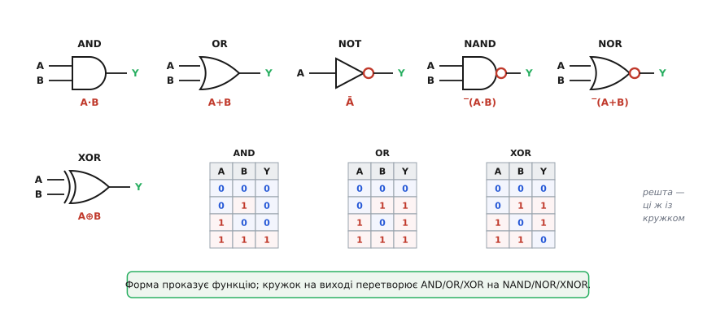
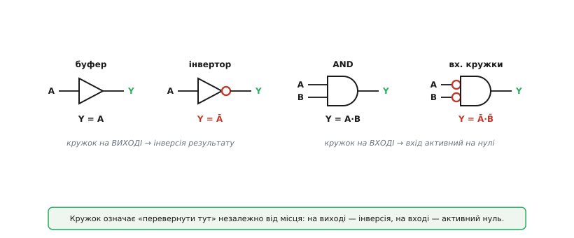
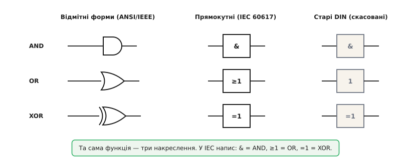
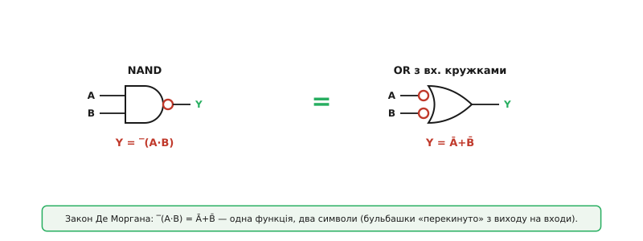
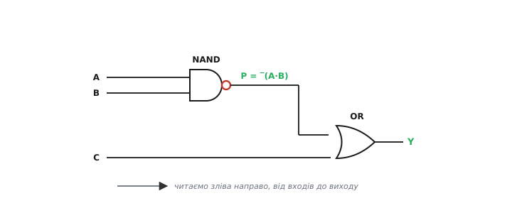

# Символи логічних вентилів

Цифрова схема — це текст, а її абетка — десяток значків. [Вентиль (англ. *gate* — «ворота, заслінка»)](book:electronics/basic-gates) на папері не малюють прямокутником із підписом «AND»; йому дають **форму**, з якої функцію видно з першого погляду. Округлий ніс — це одне, гострий — інше, кружок на ніжці — третє. Інженер не читає підписи під вентилями так само, як ти не читаєш по літерах слово «вода»: форма символа **сама проказує**, що елемент робить. Ця стаття — про саму абетку: який значок що означає, за якими правилами він складений і чому той самий вентиль у європейському даташиті виглядає геть інакше, ніж в американському. Навчившись читати ці значки, ти читатимеш логічну частину будь-якої схеми, не зупиняючись.

### Форма несе сенс

Почнімо з головного, що відрізняє символи вентилів від решти схемних позначень: тут **обрис фігури не довільний**. У резистора чи конденсатора форма — просто домовленість, її треба запам'ятати. У вентиля форму дібрано так, щоб вона **натякала на функцію**, і цей натяк працює.


*Основний набір у відмітних формах (стандарт ANSI/IEEE). **AND** (кон'юнктор) — рівна спинка, округлий ніс. **OR** (диз'юнктор) — увігнута спинка, гострий ніс. **NOT** (інвертор) — трикутник із кружком. **NAND** і **NOR** — ті самі AND і OR, але з кружком на виході. **XOR** — як OR, але з другою дугою на спинці. Входи зліва, вихід справа; під кожним символом — його таблиця істинності.*

Логіка форм така. У **AND** спинка пряма й «глуха» — щоб на виході зійшлася одиниця, мусить зійтися **все** на входах, тут немає жодної поблажки, рівно як у строгій прямій лінії. У **OR** спинка ввігнута, ніби розкрита назустріч сигналам, — вона «вбирає» їх з боків, і досить одного, щоб вихід став 1. **NOT** — гострий трикутник, вістря-стрілка «сигнал пішов далі», а на самому вістрі — кружок, який цей сигнал **перевертає**. Назви двомовні: український кон'юнктор / диз'юнктор / інвертор (від лат. *coniunctio* — сполучення, *disiunctio* — роз'єднання, *invertere* — перевертати) стоять поряд з англійськими AND / OR / NOT, і обидва набори трапляються в літературі.

Важливо одразу відділити **символ** від **операції**. Те, *що* робить AND чи OR як булева дія, — це окрема історія; тут нас цікавить, *як його намальовано* і як цей малюнок розкласти на складники. Один значок — одна функція, але сам значок зібрано з кількох незалежних деталей, і кожну варто читати окремо.

### Кружок — універсальний знак інверсії

Найважливіша окрема деталь — маленький **кружок** (його ще звуть бульбашкою, англ. *bubble*). Він не належить якомусь одному вентилю; це **самостійний модифікатор**, що означає одне й те саме всюди, де його намальовано:

```
кружок на будь-якій ніжці символа  →  «у цій точці сигнал перевернути»
```

Зітри кружок з інвертора — лишиться голий трикутник, який нічого не перевертає: це вже не NOT, а [буфер](book:electronics/basic-gates) (Y = A). Домалюй кружок на вихід AND — дістанеш [NAND](book:electronics/nand-nor). На вихід OR — NOR. Тобто NAND і NOR — це не окремі «нові» фігури, які треба вчити з нуля, а вже знайомі AND/OR **плюс** бульбашка. Половина роботи з читання символів — це помітити, де стоять кружки.


*Кружок перевертає сигнал у тій точці, де намальований. **На виході**: трикутник без кружка — буфер (Y = A), з кружком — інвертор (Y = Ā); AND без кружка дає A·B, з кружком — NAND. **На вході**: кружок на вхідній ніжці означає, що сигнал спершу інвертують, а тоді вже подають у вентиль. AND із двома вхідними кружками реагує на «обидва входи в нулі» — бо інвертує їх перед кон'юнкцією.*

Те, що кружок працює і **на вході**, — менш очевидна, але вкрай корисна річ. Вхідний кружок каже: цей вхід **активний на нулі** (англ. *active-low*) — вентиль «спрацьовує» від низького рівня, а не високого. У реальних мікросхемах сила-силенна сигналів керується саме нулем (скидання `RESET`, вибір кристала `CS`, дозвіл `OE`), і їх позначають або кружком на ніжці, або рискою над назвою (`RESET` з рискою), або обома способами. Побачив кружок на вході — читай «тут активний нуль», і логіка одразу стане на місце.

> 🔧 **Навіщо це.** Проґавити кружок — типова й дорога помилка. Сигнал з рискою над назвою (наприклад `CS̄`) вмикає мікросхему **нулем**: подаси туди одиницю «щоб увімкнути» — і нічого не запрацює, бо насправді ти її вимкнув. Звичка автоматично читати кожен кружок як «активний нуль / тут інверсія» рятує години марного дебагу плати, де «все правильно, а не працює».

### Дуга, дзьоб і решта дрібних знаків

Крім кружка, у символах живе ще кілька дрібних, але значущих позначок. Зведімо їх докупи, щоб жодна не лишилася загадкою.

**Друга дуга на спинці OR** перетворює його на [XOR (виключне «або»)](book:electronics/xor-comparison): додаткова паралельна риска перед увігнутою спинкою — ось і вся різниця між «хоч один» (OR) і «рівно один, не обидва» (XOR). Допиши до XOR ще й кружок на виході — дістанеш **XNOR** (детектор рівності). Тобто чотири споріднені вентилі — OR, NOR, XOR, XNOR — будуються з одного «дзьобатого» обрису двома деталями: дугою на спинці й бульбашкою на носі.

**Розширення входів.** Вентиль не зобов'язаний мати два входи. AND і OR бувають на 3, 4, 8 і більше входів — фігуру просто розтягують угору й приробляють ніжки. Правило не змінюється: 8-вхідний AND дає 1, лише коли всі вісім входів — 1. Кількість входів називають *fan-in* (англ. «вхідне віяння»). Іноді, щоб не малювати вісім ліній, на одній лінії ставлять скісну рисочку з числом — це **шина** (англ. *bus*), пучок проводів, згорнутий в одну лінію заради охайності схеми.

**Трикутник із рискою, а не кружком.** Зрідка замість кружка-інверсії на виході малюють маленький трикутник-«прапорець» вістрям до лінії. Це **не** інверсія, а **показник полярності** (англ. *polarity indicator*) зі стандарту IEC: він теж означає «активний нуль», але через інше формальне трактування рівнів. Для практичного читання трикутник-прапорець і кружок означають те саме — «тут діє низький рівень»; просто знай, що обидва значки існують.

### Три способи намалювати той самий вентиль

А тепер — головне джерело розгубленості новачка. Той самий AND існує в схемах у **трьох** різних накресленнях, бо стандартів історично було кілька. Покажемо всі три поряд, щоб жоден не заскочив зненацька.


*Той самий набір вентилів у трьох накресленнях. **Відмітні форми** (ANSI/IEEE Std 91, родом із військового MIL-STD-806 США) — різні фігури для різних функцій, наочно. **Прямокутники IEC 60617** (він же європейський і чинний міжнародний; в Україні — ДСТУ) — однакова рамка для всіх, а функцію пише напис усередині: «&» = AND, «≥1» = OR, «=1» = XOR, інверсія — кружком або прапорцем на ніжці. **Старі DIN 40700** — німецький набір, який давно скасовано, але він трапляється у старих радянських і європейських схемах.*

Розберімо, **чому** їх три і коли який зустрінеш.

**Відмітні форми (англ. *distinctive shape*)** — це ті самі округлі AND/OR/трикутники, з яких ми почали. Вони походять з американського військового стандарту MIL-STD-806 кінця 1950-х, потім увійшли в цивільний ANSI/IEEE Std 91-1984. Їхня сила — наочність: форма проказує функцію, око читає схему швидко. Тому в навчанні, аматорських проєктах і американських даташитах панують саме вони.

**Прямокутні символи IEC 60617** (давніше IEC 617-12) пішли іншим шляхом: **одна** уніфікована рамка на всі випадки, а функцію визначає **кваліфікаційний напис** усередині. Логіка напису прозора: «&» — це «і» (кон'юнкція), «≥1» — «одиниць на вході **щонайменше одна**» (саме це й робить OR), «=1» — «**рівно одна** одиниця» (це XOR), «1» сам — буфер/інвертор. Переваги — однаковість і здатність описати геть будь-який блок, не лише прості вентилі. Цей стандарт чинний в Європі та як міжнародний, тож європейський даташит і офіційна документація майже напевно покажуть прямокутники.

> 🔧 **Навіщо це.** Це не академічна дрібниця — це щоденна реальність роботи з даташитами. Купуєш мікросхему в європейського виробника — її внутрішню логіку намалюють прямокутниками з «&» і «≥1»; качаєш американський аналог — побачиш звичні округлі форми. Те саме коло, два накреслення. Хто впізнає лише одне, половину світових даташитів читає по складах. Тому впізнавати треба **обидва** головні набори, а старий DIN — хоча б не лякатися, коли натрапиш.

**Старі DIN 40700** — німецький набір позначень, поширений у Європі та СРСР у XX столітті (звідси прямокутники з «&» у старих радянських схемах). Сам стандарт давно скасовано й замінено на IEC, тож у нових документах його немає — але в архівних схемах, довідниках і старій апаратурі він трапляється, і варто впізнавати, що це теж вентилі.

### Як прочитати незнайомий символ

Зведімо все в простий порядок дій. Натрапивши на будь-який логічний значок, читай його **деталь за деталлю**, а не цілим образом:

```
1. Обрис фігури  → яка базова операція
     пряма спинка, круглий ніс ........ AND  (всі?)
     ввігнута спинка, гострий ніс ..... OR   (хоч один?)
     ввігнута + друга дуга ............ XOR  (рівно один?)
     трикутник ........................ NOT/буфер (один вхід)
     прямокутник із написом ........... читай напис: &, ≥1, =1, 1
2. Кружок на ВИХОДІ?  → так: домалюй «НЕ» (AND→NAND, OR→NOR, XOR→XNOR)
3. Кружки на ВХОДАХ?  → так: ці входи активні на нулі (інвертуються до вентиля)
4. Скільки входів?    → 2, 3, 8…; правило вентиля поширюється на всі
```

Цей розбір перетворює навіть зовсім незнайомий значок на зрозумілий: ти не запам'ятовуєш сотні фігур, а складаєш кожну з кількох відомих деталей.

**Worked-приклад: що це за вентиль.** Перед тобою округла фігура з прямою спинкою, двома кружками на **входах** і одним кружком на **виході**. Розберімо за порядком:

```
крок 1: пряма спинка, круглий ніс        → база AND  (Y = A · B)
крок 2: кружок на виході                  → інверсія результату: Y = ‾(A·B)  (це NAND)
крок 3: кружки на обох входах             → входи інвертуються до вентиля: A→Ā, B→B̄
        разом:  Y = ‾(Ā · B̄)
крок 4: за законом Де Моргана  ‾(Ā · B̄) = A + B
```

Виходить, що цей «AND з купою кружків» — насправді звичайний **OR**. Це не фокус, а [закони Де Моргана](book:math/boolean-algebra) у графічному вигляді: бульбашки на входах і виході AND перетворюють його на OR. Інженери користуються цим щодня — навмисне малюють OR як «AND з бульбашками», коли так схема читається природніше (наприклад, коли всі сигнали навколо активні на нулі). Прийом звуть **штовханням бульбашки** (англ. *bubble pushing*): кружки можна «перекидати» крізь вентиль, міняючи заразом його тип з AND на OR і навпаки.


*Дві фігури, що позначають **одну** функцію. Ліворуч — NAND: AND із кружком на виході, Y = ‾(A·B). Праворуч — OR із кружками на обох входах, Y = Ā+B̄. За законом Де Моргана ‾(A·B) = Ā+B̄ — вирази тотожні, тож і вентиль той самий, просто намальований двома способами. Перекинувши бульбашки з виходу на входи (і перемкнувши AND↔OR), дістаєш еквівалентний символ — це й роблять, щоб схема читалася зрозуміліше.*

Уміння бачити, що дві несхожі картинки — то один вентиль, відрізняє того, хто справді читає схеми, від того, хто лише впізнає окремі значки. Символ — це не картинка для запам'ятовування, а **запис**, який можна тотожно переписати, як рівняння.

### Прогнати сигнал крізь з'єднані символи

Уся сила символів — у тому, що **вихід одного заводять на вхід іншого**, і так із кількох значків складають будь-який логічний вираз. Прочитати таку схему — означає **прогнати** конкретні 0 і 1 крізь неї, значок за значком, від входів до виходу.


*Маленька схема з трьох символів. NAND обчислює P = ‾(A·B); його вихід заводять на один вхід OR, другий вхід якого — C; вихід OR і є Y = P + C. Підпис на внутрішньому дроті (P) — корисна звичка: підписуй проміжні вузли, щоб не загубитися. Стрілка показує напрям читання: завжди зліва направо, від входів до виходу.*

Простежмо сигнал для A = 1, B = 1, C = 0:

```
крок 1 (NAND):  P = ‾(A · B) = ‾(1 · 1) = ‾1 = 0
крок 2 (OR):    Y =   P + C   =   0 + 0   = 0
```

А для A = 1, B = 0, C = 0 кружок на виході NAND дає про себе знати:

```
крок 1 (NAND):  P = ‾(A · B) = ‾(1 · 0) = ‾0 = 1     // кружок перевернув 0 на 1
крок 2 (OR):    Y =   P + C   =   1 + 0   = 1
```

Видно, як критично не загубити кружок: без нього на першому кроці вийшло б 0 і весь результат був би протилежний. Саме так — деталь за деталлю, дріт за дротом — читають будь-яку логічну частину схеми, і саме цими значками малюють [комбінаційні блоки](book:electronics/combinational-circuits): суматори, мультиплексори, дешифратори, з яких зрештою складено процесор.

> 🔧 **Навіщо це.** Ці кільканадцять значків — алфавіт **усієї** цифрової техніки: від трирядкової схемки на макетці до даташита мікроконтролера на сотні сторінок. Хто впізнає форму (пряма спинка — AND, кругла — OR, трикутник — NOT), читає кожен кружок як інверсію чи активний нуль і вміє прогнати 0 і 1 крізь з'єднання, той читає логіку схеми так само вільно, як цей текст. А хто плутає накреслення стандартів або не помічає бульбашок — спотикається на кожній другій схемі й ловить помилки, яких при уважному читанні символів просто не буває.
