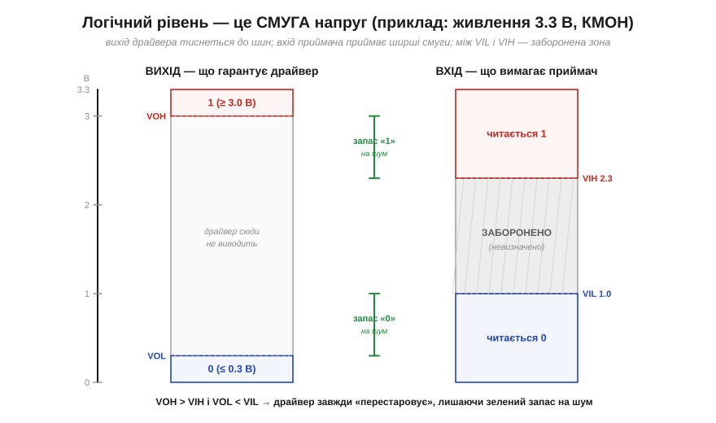
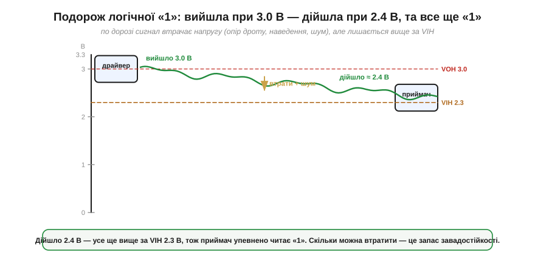
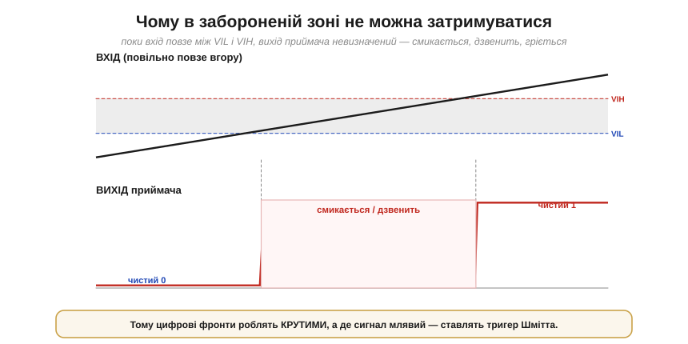

# «0» і «1» — це діапазони напруг, а не точні числа

Сказати про логіку «вище порога» й «нижче порога» легко, але головне питання — **скільки це у вольтах**? Варто зробити «0» і «1» відчутними. І тут на нас чекає невелике, та важливе відкриття: логічна одиниця — це **не** якесь одне магічне число (скажімо, рівно 3.3 В), а **цілий діапазон** напруг; так само й нуль. Цифрова схема, що здається світом точних чисел, насправді стоїть на **широких, щедрих смугах** — і саме ця щедрість дає їй [стійкість до шуму](topic:electronics/why-digital).

### Спершу — відносно чого міряємо: земля

Напруга — це завжди **різниця** [потенціалів](topic:physics/electric-potential), «висота» однієї точки **відносно** іншої. Тож, кажучи «на цьому піні логічна 1 — це 3.3 В», ми мовчки маємо на увазі: 3.3 В **відносно спільної опорної точки**, яку звуть **земля** (*ground*, **GND**). Земля — це той самий «нуль висоти», спільний для всієї схеми нуль відліку напруги.

Звідси випливає правило, без якого **однопровідний (single-ended)** цифровий зв'язок просто не працює: два пристрої, що обмінюються логічними рівнями **відносно спільного нуля**, мусять мати **спільну землю**. Якщо їхні «нулі» зміщені один відносно одного, то й усі пороги «попливуть»: те, що для одного є чистим нулем, для іншого може опинитися в забороненій зоні. Тому до звичайних цифрових інтерфейсів ([UART](topic:communications/async-serial), I2C, SPI) завжди тягнуть **спільний дріт GND**, і це не формальність, а умова, щоб «0» і «1» взагалі мали сенс.

Варто, однак, чесно окреслити межі цього правила, бо воно стосується саме **однопровідних** ліній (а такі більшість простих інтерфейсів). Є й винятки, спеціально зроблені інакше. **Диференційні** інтерфейси ([RS-485](topic:communications/rs-485), CAN) читають **різницю** двох сигнальних дротів, а не рівень відносно землі, тож терплять зсув земель — але лише в межах свого *common-mode range* (скажімо, ±7…±12 В у RS-485), а не безмежно, тож опорний зв'язок між пристроями все одно потрібен. А **гальванічно ізольовані** лінії (оптопари, цифрові ізолятори) навмисно **розривають** спільну землю, передаючи сигнал світлом чи полем. У цій же темі ми працюємо зі звичайним однопровідним зв'язком, де спільна земля **обов'язкова**.

### Рівень — це смуга, обмежена порогами

Тепер сама суть. Щоб [двійкова система була стійкою](topic:electronics/why-digital), і той, хто **видає** сигнал, і той, хто його **читає**, мусять домовитися про напруги. Але домовляються вони **несиметрично**, і в цій несиметрії — уся хитрість.


*Канонічна діаграма рівнів (узагальнений КМОН на 3.3 В). Ліва колонка — що **гарантує драйвер** на виході: «0» не вище VOL, «1» не нижче VOH, тиснучи сигнал майже до шин. Права — що **вимагає приймач** на вході: усе нижче VIL читається як «0», усе вище VIH — як «1», а смуга між ними **заборонена**. Драйвер навмисно «перестаровує» (VOH вище за VIH, VOL нижче за VIL), і завдяки цьому між ними лишається зелений **запас** — який кількісно описує [завадостійкість](topic:electronics/noise-margin).*

Читати цю діаграму треба так. Усю шкалу напруг від 0 до живлення поділено **порогами** (*thresholds*) на смуги. Усе, що нижче нижнього порога, — гарантований «0»; усе, що вище верхнього, — гарантована «1»; посередині — нічийна, заборонена зона. А оскільки вимоги до **виходу** й до **входу** різні, таких порогів аж **чотири**.

### Чотири пороги двома буквами

Назви порогів виглядають як закляття — `VIL`, `VIH`, `VOL`, `VOH` — але насправді читаються по літерах елементарно: **V** — напруга (*voltage*), друга літера — **I**nput (вхід) чи **O**utput (вихід), третя — **L**ow (низький, «0») чи **H**igh (високий, «1»). Складімо їх докупи:

```
VOL  (Output Low)  — max напруга, яку драйвер видає за «0»   (тут ≤ 0.3 В)
VOH  (Output High) — min напруга, яку драйвер видає за «1»   (тут ≥ 3.0 В)
VIL  (Input Low)   — max напруга, яку приймач ще читає як «0» (тут ≤ 1.0 В)
VIH  (Input High)  — min напруга, яку приймач уже читає як «1»(тут ≥ 2.3 В)
```

Зверніть увагу на логіку «гарантій». Виробник драйвера обіцяє: «мій нуль не підніметься вище **VOL**, а одиниця не впаде нижче **VOH**». Виробник приймача обіцяє інше: «усе, що ти подаси нижче **VIL**, я зрозумію як нуль, а все вище **VIH** — як одиницю». Це обіцянки **різних** сторін, і вони складаються в єдиний ланцюг, лише якщо вихід однієї **з запасом** перекриває вимогу входу іншої. Саме тому VOH (3.0) роблять помітно **вищим** за VIH (2.3), а VOL (0.3) — помітно **нижчим** за VIL (1.0): між обіцянкою й вимогою лишається «подушка» (зелені дужки на діаграмі вище).

> 🔧 **Навіщо це.** Ці чотири літери — те, що ви читатимете в кожному даташиті в розділі *DC Characteristics*. І перше, що там перевіряють, поєднуючи дві мікросхеми: чи VOH драйвера ≥ VIH приймача і чи VOL драйвера ≤ VIL приймача. Якщо так — пристрої «розуміють» один одного **з запасом**; якщо ні (а так буває, коли стикають [різні напруги живлення](topic:electronics/logic-families)) — потрібен [**зсувач рівнів**](topic:electronics/level-shifter). Звичка читати ці чотири числа врятує вас від найклятішої категорії багів: коли «начебто все з'єднано правильно», а лінія читається випадково.

### Будь-яка напруга в смузі — той самий рівень

Тепер головний наслідок, заради якого все й затівалося: **точне значення напруги в межах смуги не має значення**. Приймачеві байдуже, чи на вході 3.3, чи 2.8, чи 2.4 В — усе це «вище VIH», отже, для нього однаково **«1»**. Так само 0.0, 0.3 і 0.9 В — однаково **«0»**. Інформація — у тому, **по який бік** порога сигнал, а не в його точній висоті.


*Вісім різних виміряних напруг — і лише три можливі вердикти. Три значення вгорі (3.3, 2.8, 2.4 В) усі вище VIH → усі «1». Три внизу (0.8, 0.3, 0.0 В) усі нижче VIL → усі «0». А два посередині (1.9, 1.4 В) застрягли в забороненій зоні → «невизначено». Точне число не несе інформації — несе лише належність до смуги.*

Це прямо те, що рятує цифру [від шуму](topic:electronics/why-digital): оскільки одиницею вважається ціла широка смуга, шум, що штовхає сигнал у її межах, **нічого не псує**. Лише коли шум настільки великий, що виштовхує сигнал аж за поріг, з'являється помилка.

**Приклад (класифікація напруг).** Лінія має пороги VIL = 1.0 В і VIH = 2.3 В. Мультиметр показав на ній по черзі 2.70 В, 1.80 В і 0.40 В. Як їх прочитає цифровий вхід?

```
2.70 В  >  VIH (2.3)        →  «1»   (упевнено)
1.80 В  між VIL і VIH       →  ?     (заборонена зона — невизначено!)
0.40 В  <  VIL (1.0)        →  «0»   (упевнено)
```

Перше й третє значення — однозначні, хоча жодне з них не дорівнює «ідеальним» 3.3 чи 0 В. А ось 1.80 В — тривожний дзвоник: сигнал завис у нічийній зоні, і покладатися на нього не можна.

### Подорож одиниці дротом

Навіщо взагалі робити вхідні смуги (VIL…VIH) **ширшими**, ніж вихідні, а не однаковими? Бо сигналу між драйвером і приймачем доводиться **подорожувати** — крізь дріт, рознімачі, плату, — і дорогою він трохи **псується**: падає напруга на опорі провідника, домішується наведення від сусідів, гойдається живлення. Одиниця, що вийшла бадьорою, до приймача приходить **ослаблою** — і добре, якщо вхідна смуга достатньо широка, щоб її ще впізнати.


*Логічна «1» виходить з драйвера на рівні VOH ≈ 3.0 В, та дорогою втрачає напругу й набирає шуму, тож до приймача доходить уже ≈ 2.4 В. Це все ще **вище** за VIH (2.3 В), тому приймач упевнено читає «1». Те, наскільки сигнал може просісти, перш ніж зірватися в заборонену зону, і є **[запас завадостійкості](topic:electronics/noise-margin)**.*

Ось чому інженери зробили вхід «поблажливим», а вихід — «строгим». Драйвер тисне сигнал майже до шин (близько до 0 або до живлення), створюючи **якнайбільший** початковий відрив від порогів; приймач же погоджується впізнати рівень навіть тоді, коли той помітно зблід. Різниця між «з якою силою вийшло» і «з якою мінімальною ще впізнається» — це і є та подушка, що поглинає всі дорожні втрати й шум.

### Заборонена зона — нічия земля, де не можна затримуватися

Окремо варто наголосити, чим небезпечна **заборонена зона** (*forbidden / undefined region*) між VIL і VIH. Це не просто «сіра» ділянка, яку приймач «якось там» інтерпретує. Це зона, де його вихід **по-справжньому невизначений**: він може видати 0, може видати 1, може **завмерти посередині**, а може почати **дзвеніти** — швидко перемикатися туди-сюди від найменшого шуму.


*Поки вхідний сигнал повільно повзе крізь заборонену зону (VIL…VIH), вихід приймача поводиться огидно: замість чистого переходу 0→1 він смикається й дзвенить. А ще в цей момент усередині входу **обидва** транзистори [КМОН-пари](topic:electronics/cmos) прочинені водночас, тож крізь них тече наскрізний струм — вхід зайве гріється. Висновок практичний: крізь цю зону треба проскакувати **якнайшвидше**.*

Звідси два важливі наслідки. По-перше, цифрові **фронти** намагаються робити [**крутими**](topic:electronics/edges-rise-time) — щоб сигнал проскакував заборонену зону за наносекунди, не встигаючи там «задзвеніти». По-друге, коли сигнал за своєю природою **повільний** чи зашумлений (наприклад, з механічної кнопки чи давача), на вході ставлять особливу схему — [**тригер Шмітта**](topic:electronics/threshold-schmitt) (*Schmitt trigger*) з двома порогами, яка силоміць перетворює млявий перехід на різкий (її коріння — [компаратор з гістерезисом](topic:electronics/schmitt-trigger)). Головне ж запам'ятати: **затримуватися в забороненій зоні не можна**.

### Чому це СМУГИ, а не точки: розкид заліза

Лишилося пояснити, **чому** виробник узагалі задає рівні діапазонами «не вище / не нижче», а не одним точним числом. Причина — у фізичній реальності: **двох однакових мікросхем не буває**. Вихідна напруга «одиниці» трохи різниться від чіпа до чіпа (розкид виробництва), повзе з **температурою**, просідає під більшим **навантаженням** на виході, залежить від точного **живлення**. Назвати одне число було б брехнею.


*Реальні виходи багатьох чіпів за різних умов «гуляють» — та завжди по правильний бік межі: усі «одиниці» лишаються **вище** гарантованого VOH(min), усі «нулі» — **нижче** VOL(max). Тому даташит обіцяє не точне значення, а **межу**, і саме цю межу беруть у розрахунок: проєктуючи, завжди припускають найгірший дозволений випадок.*

Тому грамотний інженер рахує цифрову лінію **за гарантованими межами**, а не за «typical» значеннями: припускає, що драйвер видасть рівно VOH(min) (не краще), а приймач вимагатиме рівно VIH(min) — саме так VIH і задають у даташиті: як **мінімальну** напругу, яку вхід ще гарантовано читає як «1». Тоді запас рахують у найгіршому збігу: для одиниці **NMH = VOH(min) − VIH(min)**, для нуля **NML = VIL(max) − VOL(max)** — і дивляться, чи він додатний. Якщо так — схема працюватиме на **будь-яких** екземплярах за будь-яких умов, а не лише на тих, що пощастило спаяти.

> 🔧 **Навіщо це.** І ще одна конвенція, без якої легко заплутатися. Звична згода — «1 це високий рівень, 0 низький»; це **додатна логіка** (*positive logic*), і саме її мають на увазі за замовчуванням. Та інколи сигнал навмисно роблять **активним низьким** (*active-low*): «подія сталася» позначають **нулем**, а не одиницею (такі лінії підписують з рискою, скажімо `RESET` з рискою згори, або `/CS`). Рівні напруг ті самі — змінюється лише, який рівень вважати «дією». Побачивши риску над назвою сигналу, читайте: «активний, коли тут 0».

---

Підсумок: логічні «0» і «1» — це **діапазони** напруг (відносно спільної **землі**), а не точні числа. Їх обмежують **чотири пороги**: вихідні **VOL/VOH** (що драйвер гарантує) і вхідні **VIL/VIH** (що приймач вимагає), а між VIL і VIH лежить **заборонена зона**. Будь-яке значення в межах смуги читається однаково — інформація в тому, **по який бік** порога сигнал. Вхідні смуги навмисно **ширші** за вихідні, щоб поглинути дорожні втрати й шум, а самі рівні задають смугами через неминучий **розкид** заліза — і рахують за гарантованими межами. У забороненій зоні **не можна** затримуватися. Та «подушку» між виходом і входом ще лишається **виміряти** — дати цьому запасу число й побачити, скільки шуму витримає лінія, дозволяє [завадостійкість (noise margin)](topic:electronics/noise-margin).

---
