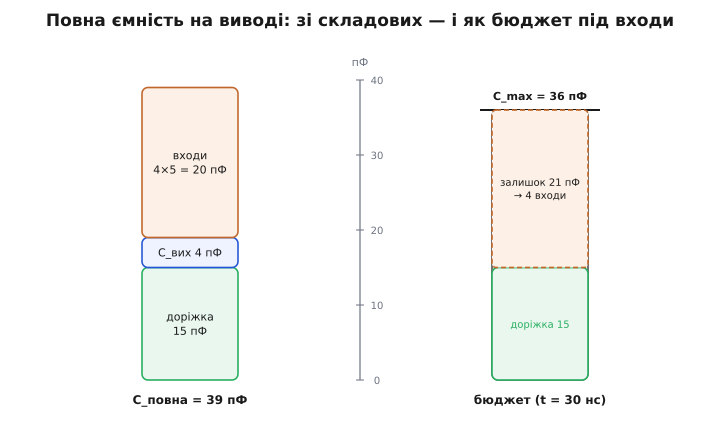

# 🧮 Бюджет фронту й розгалуження: від струму виходу до кількості входів

Одне число з даташита — «вихід тягне 4 мА» — насправді диктує, скільки входів можна повісити на вентиль, які доріжки він устигне розгойдати й на якій частоті вся схема ще працюватиме. Тут ми пройдемо весь ланцюжок від першопринципу — **заряд на ємності росте від струму** — до практичної формули, яку можна тримати в голові, і чесно окреслимо, **де ця проста формула перестає бути правдою**. Мета не запам'ятати `C_max = I·t/ΔV`, а *побачити*, звідки вона береться, чому працює й де ламається — тоді нею можна користуватися без страху.

## Що ми взагалі рахуємо: чотири величини на одному кільці

У CMOS-логіці вхід — це майже чистий **конденсатор**: затвор польового транзистора, ізольований від каналу тонким шаром оксиду. Постійного струму він практично не бере (одиниці наноамперів витоку), тому «навантаження» тут — не опір, що безперервно тягне струм, а **ємність, яку треба перезарядити** при кожному перемиканні. Це докорінно міняє питання «скільки входів витримає вихід»: обмежує не струм спокою (його майже немає), а те, чи встигне вихід **перекинути заряд** із однієї полярності в іншу за час, відведений на фронт.

> 🔧 **Навіщо це.** Саме тому в CMOS немає «статичного» fan-out на кшталт біполярного «один вихід годує N входів струмом бази». Питання завжди динамічне: *за який час* вихід перезарядить *яку сумарну ємність*. Полічити це — і ви знаєте одразу дві речі: чи потягне вихід ланцюжок входів і чи не «розмиється» фронт до неприпустимо пологого.

Чотири величини сплетені на одному кільці, і, знаючи будь-які три, ви дістаєте четверту:

```
I   — струм, яким вихід заряджає/розряджає навантаження   [А]
C   — повна ємність, яку вихід «бачить» на своєму виводі   [Ф]
ΔV  — розмах напруги, на який має змінитися вихід          [В]
t   — час, за який фронт долає цей розмах                  [с]
```

Далі — виведемо зв'язок між ними з єдиного фізичного факту, тоді розкладемо `C` на складові, переведемо `C` у кількість входів і аж потім придивимося, де модель бреше.

## Першопринцип: заряд, накопичений сталим струмом

Ємність за означенням — це коефіцієнт між зарядом на обкладках і напругою між ними:

```
Q = C · V
```

Це не формула «на віру», а сам зміст поняття «ємність»: скільки кулонів заряду треба закинути на обкладки, щоб підняти напругу на них на один вольт. Тепер згадаймо, що **струм — це і є швидкість перенесення заряду** (I = dQ/dt: скільки кулонів проходить за секунду). З'єднаймо два факти. Якщо ми хочемо змінити напругу на ємності на `ΔV`, треба доставити на неї додатковий заряд:

```
ΔQ = C · ΔV
```

А доставляє його струм. Якщо струм тримати **сталим** і рівним `I` протягом часу `t`, він перенесе заряд `I·t` (стільки кулонів за секунду, помножено на секунди). Прирівнюємо доставлений заряд до потрібного:

```
I · t = C · ΔV
```

Ось воно — усе кільце в одному рядку. Ця рівність каже буквально: «заряд, який струм устиг перенести за час `t`, дорівнює заряду, потрібному, щоб змінити напругу на `ΔV`». Розв'язавши її щодо будь-якої величини, дістаємо чотири робочі форми одного закону:

```
t     = C · ΔV / I      ← скільки часу займе фронт при заданій ємності
C_max = I · t / ΔV      ← яку ємність устигнемо перезарядити за час t
I_min = C · ΔV / t      ← який струм потрібен, щоб укластися в час t
ΔV    = I · t / C        ← на скільки зміниться напруга за час t
```

> 🔧 **Навіщо це.** Друга форма, `C_max = I·t/ΔV`, — головна для fan-out: беремо струм виходу з даташита, задаємо прийнятний час фронту й розмах живлення — і одразу знаємо стелю ємності, яку цей вихід «потягне» за відведений час. Усе інше — розкласти цю стелю на входи й доріжки.

Зверніть увагу на **лінійність**: при сталому струмі напруга на ємності росте **прямою лінією** (V(t) = I·t/C — рівняння прямої з нахилом I/C). Це не наближення, узяте зі стелі, а точний наслідок сталості струму: сталий приплив заряду → рівномірний підйом напруги. Уся хитрість — і всі підводні камені — саме в тому, **наскільки струм насправді сталий**. До цього повернемося; спершу розберемося з `C`.

Аналогія, точна рівно доти, доки корисна: ємність — це відро, напруга — рівень води в ньому, струм — потік із крана, заряд — налита вода. Щоб підняти рівень на `ΔV`, треба долити `C·ΔV` води; при сталому потоці `I` це займе `C·ΔV/I` секунд. Аналогія ламається у двох місцях, і обидва важливі: по-перше, реальний «кран» виходу не тримає сталий потік — він сильніший, коли «відро» майже порожнє, і слабший, коли воно наповнюється (транзистор виходить із насичення); по-друге, «труба» від крана до відра (доріжка) має власну інерцію — на швидких фронтах вода в ній поводиться як хвиля, а не як миттєвий потік. Обидва злами — далі.

## З чого складається `C`: розклад повної ємності

`C` у формулі — не одна ємність входу, а **сума всього, що висить на виводі виходу** й що доводиться качати разом. Хто платить за фронт — той платить за **всю** цю суму. Розкладемо її на три чесні складові:

```
C_повна = C_вх·N  +  C_доріжки  +  C_вих
          ───────    ──────────    ──────
          входи      мідь траси    власна ємність виходу
```

**C_вх·N — вхідні ємності приймачів.** Кожен CMOS-вхід — це затвор-конденсатор; у даташитах серії 74HC він поданий як `C_in` і становить **типово 4 пФ** (виміряно при напрузі входу на рівні Vcc або землі). Повісили `N` входів паралельно — їхні ємності **додаються** (паралельні конденсатори підсумовуються), тож внесок росте лінійно з кількістю приймачів: `C_вх · N`. Це і є та частина, яку fan-out «витрачає»: кожен новий вхід відкушує шматок від бюджету ємності.

> Обережно з числом `C_in`: у реальному даташиті це **типове** значення при кімнатній температурі, а не гарантований максимум; на високій частоті через ефект Міллера ефективна вхідна ємність вентиля буває помітно більшою за статичні 4 пФ. Для інженерного запасу беруть трохи з горою — 5 пФ на вхід — саме так робить розрахунок у самій темі. Різниця «4 проти 5» не принципова для розуміння; принципово, що входи **додаються** й з'їдають бюджет.

**C_доріжки — власна ємність мідної траси.** Провідник на платі — не безтілесна лінія, а обкладка конденсатора відносно опорного шару (землі під ним) і сусідніх провідників. Типова доріжка на FR-4 має **порядку 1 пФ на кожні 2–3 см** довжини (залежить від ширини, товщини діелектрика й наявності землі під нею). Коротка траса в кілька сантиметрів дає одиниці пікофарад; довга шина через усю плату — десятки. У розрахунку теми взято `C_доріжки ≈ 15 пФ` — це вже помітна довжина, і, як побачимо, саме вона часто **з'їдає бюджет раніше за входи**.

**C_вих — власна вихідна ємність драйвера.** Сам вихідний каскад має паразитну ємність (переходи транзисторів, вивід корпусу) — одиниці пікофарад. Часто нею нехтують на тлі перших двох, але в акуратному розрахунку вона теж сидить у сумі. Тримаймо її в думці як «фонову» кілька пФ.

Ключовий висновок із розкладу: **бюджет ємності — спільний казан**, і входи в ньому змагаються з доріжкою. Тому питання «скільки входів витримає вихід» **не має відповіді у відриві від довжини траси**. Та сама мікросхема на короткому шлейфі потягне багато входів, а через довгу шину — жодного зайвого, бо всю квоту вибрала мідь. Це часта пастка: інженер дивиться лише на `C_вх·N`, забуває доріжку — і фронт розповзається вдвічі проти очікуваного.


*Повна ємність на виводі виходу — це сума трьох внесків: вхідних ємностей приймачів (ростуть із кількістю входів), ємності мідної доріжки й власної ємності драйвера. Праворуч той самий набір показано як бюджет: спершу доріжка забирає свою частку від «стелі» C_max, і лише **залишок** можна витратити на входи. Довга траса вибирає квоту раніше — на входи не лишається нічого.*

## Від ємності до кількості входів

Тепер зшиємо два кроки — межу з першопринципу й розклад — у формулу fan-out. Стеля ємності, яку вихід устигне перезарядити за час фронту `t`, — це `C_max = I·t/ΔV`. З неї віднімаємо все, що з'їдає не-вхідне навантаження (доріжка й власна ємність виходу), а залишок ділимо на ємність одного входу — стільки цілих входів влізе:

```
                 I · t
        C_max =  ─────
                  ΔV

        C_вх·N  ≤  C_max − C_доріжки − C_вих

                 C_max − C_доріжки − C_вих
        N_max =  ─────────────────────────
                        C_вх
```

Округляти **вниз** (цілих входів не буває дробових), а якщо чисельник вийшов від'ємним — це вирок: за такого струму й такого часу навіть **сама доріжка** не встигає перезарядитися, не те що входи. Ліки лише два: дати сильніший вихід (більший `I`) або дозволити довший фронт (більший `t`). Третій, неявний, шлях — укоротити доріжку (менший `C_доріжки`), тобто розвантажити казан із іншого боку.

**Полічимо приклад до кінця.** Вихід 74HC, гарантований струм під навантаженням `I = 4 мА`; розмах `ΔV = 3.3 В`; ємність входу `C_вх = 5 пФ`; доріжка `C_доріжки = 15 пФ`; власною ємністю виходу тут знехтуємо. Спершу — жорсткий бюджет при бажаному швидкому фронті `t = 10 нс`:

```
C_max = I · t / ΔV = 4·10⁻³ · 10·10⁻⁹ / 3.3 = 12.1 пФ
```

Стеля — 12.1 пФ, а сама доріжка вже 15 пФ. Чисельник `12.1 − 15 = −2.9 пФ` < 0: за 10 нс фронту **навіть один вхід не влазить**, бо мідь трохи перевищує весь бюджет. Це не «мало запасу» — це фізична неможливість укластися в 10 нс цим виходом на цій трасі. Послабмо вимогу до фронту втричі, `t = 30 нс`:

```
C_max  = 4·10⁻³ · 30·10⁻⁹ / 3.3 = 36.4 пФ
залишок = 36.4 − 15 = 21.4 пФ          (під входи)
N_max  = 21.4 / 5 = 4.28 → 4 входи
```

Чотири входи — і ні на один більше, поки тримаємо 30 нс. Числа читаються прямо: **слабкий вихід і жорсткий фронт разом душать fan-out**; попустиш будь-що одне — стає легше. Ось той самий розрахунок як робоча функція прошивки (тип для документації розрахунку в коді, як прийнято в цьому курсі):

```c
// Скільки CMOS-входів потягне вихід за заданого фронту.
// Модель: сталий струм заряджає спільну ємність (входи + доріжка).
//   C_max = I·t/ΔV ;  N = (C_max − C_доріжки) / C_вх   (вниз)

const float I_OUT = 4.0e-3f;    // А, струм виходу під навантаженням (тут HC)
const float V_SW  = 3.3f;       // В, розмах фронту
const float C_IN  = 5.0e-12f;   // Ф, ємність одного входу (із запасом)
const float C_TR  = 15.0e-12f;  // Ф, ємність доріжки

int fanout(float t_rise_s) {
    float c_max  = I_OUT * t_rise_s / V_SW;   // стеля ємності за час t
    float c_left = c_max - C_TR;              // залишок під входи
    if (c_left <= 0.0f) return 0;             // навіть доріжка не влазить
    return (int)(c_left / C_IN);              // цілих входів (округлення вниз)
}
// fanout(10e-9)  → 0   (10 нс: доріжка перевищує бюджет)
// fanout(30e-9)  → 4   (30 нс: 4 входи)
```

Функція буквально повторює три рядки виведення: стеля з першопринципу, віднімання не-вхідного навантаження, ділення на вхід. Ніякої магії — лише закон збереження заряду, застосований до реальних чисел.

## Де лінійна модель ламається — і чому це на нашу користь

Тепер найчесніша частина. Формула `C_max = I·t/ΔV` спирається на дві мовчазні неправди, і зріла інженерія знає обидві. Гарна новина: **обидві помилки — в безпечний бік** (модель дає песимістичну оцінку), тож нею можна користуватися сміливо, розуміючи запас.

**Злам перший: струм не сталий — транзистор виходить із насичення.** Ми взяли `I` за константу, та вихідний транзистор — не ідеальне джерело струму. Поки на ньому велика напруга (початок фронту, ємність майже порожня), він у **насиченні** й справді качає майже сталий, великий струм — тут лінійне наближення чудове. Але коли вихід підходить до кінця розмаху й напруга на транзисторі падає, він **входить у триодну (лінійну) область**, де поводиться радше як опір: струм спадає пропорційно напрузі, що лишилася. Хвіст фронту стає не прямою, а **експонентою** — точнісінько як розряд/заряд через опір у [сталій RC](book:electronics/rc-time-constant): останні відсотки розмаху доганяються дедалі повільніше.

> Що це означає для нас практично. По-перше, гарантований струм із даташита (ті 4 мА) береться **при конкретній напрузі виходу** (VOH/VOL під навантаженням) — тобто це вже «просіла», найгірша точка, а не пікова. На початку фронту, коли ємність порожня, реальний CMOS-вихід качає **помітно більше** за паспортні 4 мА. Тому фронт насправді **крутіший**, ніж дає наша формула зі сталим паспортним струмом. По-друге, «час фронту» в даташитах міряють не до 100 % розмаху, а між **10 % і 90 %** — саме щоб відкинути той повільний експоненційний хвіст біля рейок. Наша лінійна оцінка, взявши повний розмах ΔV і найгірший струм, цілиться в песимістичний бік — і це саме те, чого хочеться від інженерного розрахунку. Точну динаміку заряду затвора з переходом «насичення → триод» розбирає окремо тема про [перехідні процеси в ключах](book:electronics/switching-transients); тут досить знати, що реальність **крутіша за пряму**, а не пологіша.

**Злам другий: доріжка — не миттєва ємність, а лінія із затримкою.** Ми мовчки припустили, що вся ємність доріжки заряджається **одночасно** з виходом — ніби мідь є один зосереджений конденсатор на виводі. Це справедливо, лише поки доріжка **електрично коротка**: сигнал пробігає її туди-назад **набагато швидше**, ніж триває фронт. Тоді ціла траса «підіймається» разом, і модель зосередженої ємності точна. Але коли фронт стає крутим, а траса — довгою, це припущення падає: сигнал уже помітно змінився на ближньому кінці, поки на дальньому ще нічого не «доїхало». Доріжка перетворюється на **лінію передачі** з власним хвильовим опором, і на ній з'являються **відбиття** й дзвін замість чистого підйому по прямій.

Межу задає просте правило (усталене в схемотехніці високих швидкостей): трасу треба рахувати як лінію передачі, а не як ємність, коли **час пробігу сигналом туди-назад (round-trip) перевищує час фронту**. Через оцінку затримки поширення `t_pd` (на FR-4 сигнал іде ≈ 6 нс на метр, тобто ≈ 15 см/нс):

```
2 · (довжина / швидкість)  ≥  t_фронту   →  траса «довга», модель ємності бреше

Приклад (FR-4, t_pd ≈ 6 нс/м):
  фронт 30 нс:  критична довжина ≈ 30нс / (2·6нс/м) = 2.5 м  → короткі траси безпечні
  фронт  1 нс:  критична довжина ≈  1нс / (2·6нс/м) ≈ 8 см   → уже 10 см — це лінія!
```

Звідси видно межу застосовності всієї нашої fan-out-формули: для **повільних** підродин і **розумно коротких** доріжок (сантиметри-десятки сантиметрів) round-trip мізерний проти фронту, лінія поводиться як зосереджена ємність — і `C_max = I·t/ΔV` цілком правдива. Але тільки-но фронти сягають одиниць наносекунд (швидкі AHC, а надто LVC/AC), навіть 10-сантиметрова траса стає лінією передачі: тоді балакати про «ємність доріжки» та fan-out уже мало сенсу — панують хвильовий опір, узгодження й [фронти як окрема тема](book:electronics/edges-rise-time). Парадокс: чим **сильніший** і швидший вихід (чого ми домагалися заради fan-out), тим **раніше** проста ємнісна модель здається — крутий фронт сам робить доріжку «довгою».

Отже, лінійна fan-out-модель — це наближення для **зосередженого, повільного** режиму. Обидва її злами штовхають оцінку в песимістичний бік (реальний фронт крутіший; а коли він занадто крутий — вас рятує вже не запас fan-out, а узгодження лінії), тож як інструмент «на серветці» вона надійна: недооцінює можливості виходу, а не переоцінює.

## Чому сильніший вихід дає крутіший фронт **або** більший fan-out

Тепер видно, чому в самій темі AHC й LVC названі не просто «швидшими», а такими, що за той самий час гойдають більше. Уся суть — у тому самому кільці `I·t = C·ΔV`, прочитаному щодо `I`. Збільште струм виходу в `k` разів (наприклад, від 4 мА у HC до 24 мА у LVC — це `k ≈ 6`) — і рівність можна відновити **двома способами**, на ваш вибір:

**Спосіб A — той самий фронт, більший fan-out.** Тримаємо `t` фіксованим, а стеля ємності росте прямо пропорційно струму:

```
C_max = I · t / ΔV     →    ×k струму = ×k стелі ємності
```

Уся зайва ємність іде на входи (за відрахуванням доріжки). У шість разів більший струм ⇒ у шість разів більший бюджет ємності ⇒ у стільки ж разів більше входів (мінус те, що забирає незмінна доріжка). Слабенький HC ледь тягнув 4 входи за 30 нс — LVC за той самий час і на тій самій трасі потягне їх кілька десятків.

**Спосіб B — той самий fan-out, крутіший фронт.** Тепер фіксуємо ємність (те саме число входів і та сама доріжка), а вивільняємо час:

```
t = C · ΔV / I         →    ×k струму = ÷k часу фронту
```

Той самий заряд перекидається у `k` разів швидше: у шість разів сильніший вихід за незмінного навантаження дає у шість разів коротший фронт. Це прямий шлях до вищої робочої частоти: крутіший фронт ⇒ менша затримка поширення ⇒ такт можна підняти.

**Полічимо обидва боки для LVC (I = 24 мА, решта як раніше).**

```
Спосіб A (t = 30 нс, рахуємо входи):
  C_max  = 24·10⁻³ · 30·10⁻⁹ / 3.3 = 218 пФ
  залишок = 218 − 15 (доріжка) = 203 пФ
  N_max  = 203 / 5 ≈ 40 входів        (проти 4 у HC — рівно ×к за струмом)

Спосіб B (те саме навантаження, що HC тягнув за 30 нс — 4 входи + доріжка = 35 пФ,
          рахуємо час):
  t = C · ΔV / I = 35·10⁻¹² · 3.3 / 24·10⁻³ = 4.8 нс
                                              (HC долав це саме за 30 нс — ×6 крутіше)
```

Одне й те саме підсилення струму — і сорок входів замість чотирьох, **або** фронт 4.8 нс замість 30 нс. Куди пустити виграш — вибирає розробник під задачу: широке віяло тихих входів чи один швидкий вузол. Це і є фізичний зміст «сильного виходу»: не абстрактна чеснота, а **конвертована валюта** — обмінюється або на розгалуження, або на швидкодію, за курсом, що дорівнює відношенню струмів. І та сама причина, з якої в самій темі попереджено: виграш **реальний лише в зосередженому режимі**; щойно крутий LVC-фронт зробить доріжку «довгою», у гру входять відбиття, і бюджет fan-out поступається місцем узгодженню лінії.

---

Усе трималося на одному факті — **заряд на ємності росте від струму**, `I·t = C·ΔV` — і на чесному погляді, наскільки цей факт наближений. Розклали `C` на входи + доріжку + власну ємність виходу; перевели стелю ємності в кількість входів, віднявши те, що з'їдає мідь; побачили, що доріжка часто вибирає бюджет раніше за входи. Тоді визнали дві неправди моделі: струм не сталий (транзистор виходить із насичення — хвіст фронту експоненційний, зате реальний фронт **крутіший** за оцінку) і доріжка не зосереджена (на швидких фронтах — лінія передачі з відбиттями, і саме сильний вихід наближає цей поріг). Обидві помилки — в песимістичний бік, тож формула надійна як інструмент «на серветці». І наостанок побачили, чому сильніший вихід — це валюта: той самий приріст струму обмінюється **або** на більше входів за той самий час, **або** на крутіший фронт за те саме навантаження, за курсом відношення струмів.
