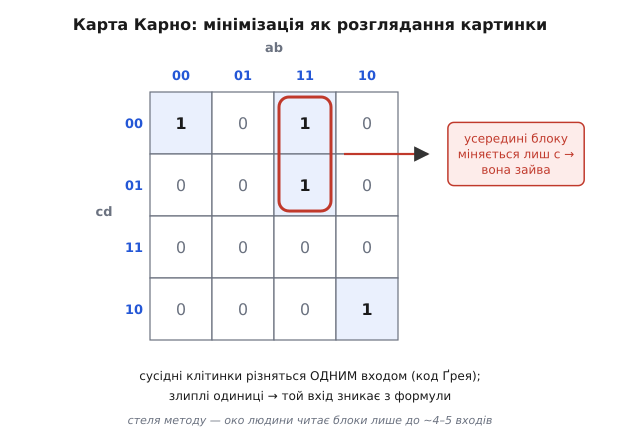

# 📜 Як схеми навчили синтезуватися самі

Сьогодні інженер пише кілька рядків опису — і машина сама будує з них мережу на мільйон вентилів. Ця здатність здається природною, майже банальною: адже компілятори перекладають код у машинні інструкції вже пів століття. Але для заліза такий переклад довго вважали **неможливим у принципі**. Схему, мовляв, треба **малювати** — вдумливо, руками, вентиль за вентилем, бо тільки жива людина розуміє, як скласти докупи транзистори, щоб вийшло щось робоче й швидке. Історія логічного синтезу — це історія того, як цю віру зламали: як «мистецтво малювати схеми» перетворилося на **переклад тексту**, що його виконує програма. І поворотним був не один геніальний прозір, а довгий ланцюг — від олівця на клітчастому папері до першого інструмента, який продавали за гроші й якому інженери нарешті повірили.

Розберімо цей ланцюг ланка за ланкою — бо кожна ланка розв'язувала цілком конкретний біль, і саме ці болі й пояснюють, **чому** синтез виглядає сьогодні саме так.

## Спершу схему справді малювали руками

Щоб відчути, наскільки різким був поворот, треба уявити, як проєктували **до** синтезу. Інженер сидів за кульманом (а згодом за графічним редактором) і **креслив принципову схему** — власноруч ставив кожен вентиль, кожен тригер і власноруч проводив кожен дріт між ними. Цей спосіб має свою назву — **схемне введення** (англ. *schematic entry*, або *schematic capture*): ти буквально «вводиш» проєкт, малюючи його.

Поки схема мала сотні елементів, це працювало — і навіть було приємно: інженер тримав увесь пристрій у голові й бачив кожен дріт. Але тут криється пастка, яка згодом і поховала цей спосіб. Складність схеми росте не лінійно. Подвоїш число вентилів — і число з'єднань, які треба провести й **не переплутати**, зростає ще швидше; кожен новий блок треба узгодити з усіма, до кого він приєднаний. Людина, що креслить десятитисячний дріт, уже давно втратила з очей загальну картину — і помиляється. А промисловість тим часом гнала [подвоєння числа транзисторів на чипі](topic:electronics/moore-law) кожні пару років, невблаганно, як за розкладом.

> 🔧 **Навіщо це.** Схемне введення не зникло — воно **живе досі там, де його сила незамінна**: в аналоговій та радіочастотній розробці, де важить кожен транзистор і кожен паразитний зв'язок, схему й нині малюють руками. Зникло воно лише з **цифрового** проєктування великих блоків — саме тому, що там елементів забагато, щоб їх узагалі осягнути оком. Тобто синтез не «переміг» схемне введення взагалі — він відвоював у нього ту ділянку, де ручна праця фізично не встигала за кількістю.

Виходила ножиця, яка розходилася щороку. З одного боку — фізика дозволяла ставити на кристал усе більше вентилів. З іншого — **людина фізично не встигала їх розставляти**. Хтось мусив цю ножицю звести: або спинити прогрес транзисторів (чого ніхто не хотів), або **зняти з людини саме розставляння**. Перший крок до другого зробили там, де болю було найбільше, — у ручному спрощенні логіки.

## Клітчастий папір: карти Карно

Найтупіша, найнудніша частина ручного проєктування — **мінімізація**: маєш таблицю, яка каже, за яких комбінацій входів вихід має бути одиницею, і мусиш скласти з вентилів **найдешевшу** схему, що дає рівно цю таблицю. Дешевшу — бо кожен зайвий вентиль коштує площі, грошей і затримки. Робити це в лоб, «як написано», означало ліпити купу зайвого заліза.

Перший інструмент, що зробив цю нудьгу терпимою, придумав **Моріс Карно** (Maurice Karnaugh, американський фізик і математик з Bell Labs) — і оприлюднив 1953 року в статті з промовистою назвою «Метод карти для синтезу комбінаційних логічних схем» (*The Map Method for Synthesis of Combinational Logic Circuits*). Уже в самій назві сидить наше слово — **синтез**. **(Усталено:** дата й авторство підтверджені; сам метод Карно чесно подавав як удосконалення діаграми **Едварда Вейча** — Edward Veitch, 1952, — яка своєю чергою відроджувала логічну діаграму **Аллана Маркванда** 1881 року. Це не одноосібний винахід, а остання, найзручніша ланка довшого ланцюга.)

Ідея карти — геніально проста. Розкладаєш усі комбінації входів по клітинках сітки, але **не абияк**, а так, щоб **сусідні клітинки відрізнялися рівно одним входом** (цей порядок кодів зветься [код Ґрея](topic:electronics/gray-code)). Тоді сусідні одиниці, що злилися в блок, означають: **цей вхід тут байдужий** — його можна викинути з формули. Око людини чудово ловить прямокутні блоки — і мінімізація з абстрактної алгебри перетворюється на просте розглядання картинки.


*Мінімізація як розглядання картинки. Клітинки розкладено так, що сусідні відрізняються одним входом. Злиплі одиниці утворюють блок — і той вхід, що всередині блоку змінюється, з формули зникає. Так око людини робить те, що в алгебрі виглядало б купою перетворень.*

Карта Карно врятувала ціле покоління інженерів від рутини. Але в неї є жорстока стеля, вбудована в саму ідею. Вона **зорова** — а людське око добре читає картинку лише до **чотирьох, від сили п'яти-шести входів**. Далі «сусідство» перестає вкладатися на площину, блоки ловити ніяк, і метод осипається. А реальні схеми мали десятки входів. Карта Карно зняла біль на малому — і цим лише яскравіше висвітлила: щойно задача підростає, **потрібна вже не картинка для ока, а процедура для машини**.

## Процедура для машини: Квайн і Мак-Класкі

Наступний крок і був такою процедурою — **механічним рецептом**, який не спирається на око й тому не має стелі в чотири змінні. Його основу заклав філософ-логік **Віллард Ван Орман Квайн** (Willard Van Orman Quine, американський логік, Гарвард) працею «Проблема спрощення функцій істинності» (*The Problem of Simplifying Truth Functions*, 1952). Квайн дав **теорію**: як строго знайти всі так звані **прості імпліканти** — неподільні цеглинки, з яких складається найдешевша формула. А **Едвард Мак-Класкі** (Edward J. McCluskey, американський інженер) 1956 року перетворив цю теорію на **табличну процедуру**, яку можна виконувати наосліп, за кроками, без жодного прозріння — і, головне, **доручити комп'ютеру**. Так народився метод, що й досі зветься їхніми іменами разом — **Квайн–Мак-Класкі**. **(Усталено:** дати й ролі підтверджені; сама ідея простих імплікантів має й давніших попередників — Г'ю Мак-Колл 1878, Арчі Блейк 1937, — але робочу, придатну для машини форму дали саме ці двоє.)**

Різниця між картою й таблицею — це різниця між **баченням** і **обчисленням**, і вона тут засаднича. Карту дивишся; таблицю Квайна–Мак-Класкі **проганяєш** — крок за кроком, як алгоритм. А те, що можна проганяти за кроками, можна **запрограмувати**. Уперше мінімізація логіки з мистецтва ока стала процедурою, яку виконує не інтуїція, а машина.

Здавалося б — ось воно, спасіння: запрограмуй Квайна–Мак-Класкі, і хай комп'ютер мінімізує будь-що. Але тут вигулькнула нова стіна, вже не людська, а обчислювальна.

## Стіна вибуху: чому точний метод захлинається

Метод Квайна–Мак-Класкі **точний** — він гарантовано знаходить найдешевшу з можливих двох'ярусних схем. Але за цю точність доводиться платити, і плата росте страхітливо. Щоб знайти прості імпліканти, метод перебирає комбінації **мінтермів** — а їхнє число з кожним новим входом **подвоюється**. Формально:

```
n входів  →  до 2ⁿ рядків таблиці істинності

 n = 4   →           16
 n = 10  →         1 024
 n = 20  →     1 048 576
 n = 32  →  понад 4 мільярди
```

Це — **експонента**, і вона нещадна. Додав до схеми лише десяток входів — і чесний перебір, який на малій задачі клацав за мить, тепер потребує пам'яті й часу, яких на всій планеті не набереться. Точний метод не помиляється — він просто **не встигає**. А реальні промислові функції мали не чотири й не десять входів, а **десятки**, та ще й із десятками виходів заразом.

Отут і криється поворот думки, що визначив усе наступне. Якщо чесний перебір неможливий фізично, то, може, **не треба** гнатися за абсолютно найкращою схемою? Може, вистачить схеми, яка **дуже близька** до найкращої, зате знаходиться **швидко**? Це відмова від досконалості заради здійсненності — і саме на ній виросла вся практична мінімізація. Метод, що жертвує гарантією ідеалу заради швидкості й розумного результату, звуть **евристичним** (від грец. *heurískō* — «знаходжу»): він не доводить, що знайшов найкраще, — він **вправно знаходить дуже добре**. Із цієї відмови й народилася перша програма, що дала синтезу справжню силу.

> 🔧 **Навіщо це.** Ця розвилка «точно, але не встигає ↔ приблизно, зате швидко» — не музейний факт, а **щоденна реальність синтезу й досі**. Сучасний синтезатор мільйони разів обирає майже-найкраще замість гарантовано-найкращого, бо інакше не закінчив би роботу ніколи. Коли інструмент дає схему трохи гіршу, ніж ти уявляв ідеал, — це не збій, а **та сама свідома угода**, укладена ще тоді: досконалість, якої не діждешся, поступилася доброму результату, який маєш сьогодні.

## Espresso: коли мінімізацію віддали програмі

Ту евристичну програму зробили наприкінці 1970-х — і назвали смачно, **Espresso**. Роботу над логічним синтезом, з якої вона виросла, почали **1979 року** — спільно в дослідному центрі **IBM Watson** і в **Каліфорнійському університеті в Берклі** (UC Berkeley). За першою версією (Espresso-I, зібраною 1982-го в IBM) стояли **Роберт Брейтон** (Robert Brayton), **Ґері Гахтель** (Gary Hachtel), **Річард Ньютон** (A. Richard Newton) і **Альберто Санджованні-Вінчентеллі** (Alberto Sangiovanni-Vincentelli, італієць, професор Берклі) — імена, які запам'ятаймо, бо один із них ось-ось з'явиться знову, і не випадково. Доопрацьовану версію (Espresso-II) команда випустила в Берклі **1984 року**. **(Усталено:** дати, імена й обидва осередки — IBM Watson і Берклі — підтверджені; окрема книга Санджованні-Вінчентеллі та співавторів «Алгоритми мінімізації логіки для синтезу НВІС» вийшла 1984-го.)

У чому був фокус Espresso? Замість перебирати мінтерми поодинці — а їх, як ми щойно бачили, вибухова кількість — програма **маніпулює «кубами»**: цілими блоками сусідніх комбінацій нараз, ніби відразу совгає прямокутники на карті Карно, тільки в багатовимірному просторі, куди око вже не сягає. Розширює блок, поки той накриває одиниці; стягує; зсуває — і так, ітерація за ітерацією, доходить до дуже дешевого покриття, **не розкладаючи функцію на мільйони окремих рядків**. Результат — на **кілька порядків** швидше за чесний перебір; там, де Квайн–Мак-Класкі захлинався на десятці входів, Espresso спокійно бере **десятки входів із десятками виходів заразом**.

Espresso спрацювала так добре, що стала **промисловим стандартом** мінімізації — її вбудували ледь не в кожен пізніший синтезатор, і серце тих алгоритмів працює донині. Але — і це критично для нашої історії — Espresso розв'язувала лише **двох'ярусну** мінімізацію: логіку виду «шар вентилів І, за ним шар вентилів АБО». Це серце, а не весь організм. Справжня схема — **багатоярусна**, з десятками шарів логіки, регістрами, петлями; звести її до двох ярусів здебільшого неможливо або страшенно невигідно. Espresso дала **найкраще у світі серце** — але тіла навколо цього серця ще не було. Хтось мусив збудувати повний організм: інструмент, що бере не голу таблицю істинності, а **опис поведінки** — і сам вирощує з нього всю багатоярусну схему. І тут наша історія робить крок від університетських програм до кімнати, де народжується цілий бізнес.

*(Детальний розбір самих алгоритмів мінімізації — карти, простих імплікантів, кубів Espresso — живе окремо, в [історії мінімізації](topic:electronics/synthesis-optimization/hist-minimization.md); тут нам важливий не сам алгоритм, а те, як ця лінія влилася в перший комерційний синтезатор.)*

## GE, SOCRATES і команда, яка повірила в переклад

Наприкінці 1970-х — на початку 80-х ідея повного синтезу — не «спростити двох'ярусну логіку», а **перекласти опис поведінки в цілу схему** — витала в кількох дослідних осередках. Один із таких осередків був у корпорації **General Electric** (GE), у групі перспективного автоматизованого проєктування (Advanced Computer-Aided Engineering Group). Там молодий інженер на ім'я **Аарт де Гьос** (Aart de Geus, нідерландець: народився 1954 року у Влардінгені в Нідерландах, змалку жив у франкомовній Швейцарії) разом із колегами будував програму синтезу зі старанно підібраною назвою-акронімом — **SOCRATES**.

Назва (на честь Сократа) розшифровується так, що в ній видно всю амбіцію: **Synthesis and Optimization of Combinatorial logic using a Rule-based And Technology-independent Expert System** — «синтез і оптимізація комбінаційної логіки за допомогою експертної системи на правилах, незалежної від технології». Розберімо цю назву — бо кожне її слово стало прапором, під яким пішов увесь дальший синтез.

- **Synthesis and Optimization** — не малювати схему, а **синтезувати** її й одразу **оптимізувати**.
- **Rule-based** — система працює за **правилами** підстановки: «оцю комбінацію вентилів можна замінити на дешевшу отаку». Замість людини-експерта, яка знає сотні таких хитрощів, — програма, у чию базу ці хитрощі закладено (і яку легко доповнити новими).
- **Technology-independent** — і ось найглибша ідея, що пережила все інше. Опис логіки тримають **окремо** від конкретного заліза. Спершу вибудовують абстрактну логіку, а вже **наостанок** кладуть її на клітинки **тієї** фабрики, куди чип піде. Той самий опис — під будь-яку технологію. Саме цей поділ і робить сьогодні можливим синтезувати один RTL хоч у власну мікросхему, хоч у FPGA. **(Усталено:** SOCRATES — задокументована робота GE, яка згодом переросла в комерційний Design Compiler; підстановки за правилами під цільову технологію — її суть.)

Тут історія робить різкий поворот, і не науковий, а суто людський. На початку 1980-х **GE вирішує вийти з напівпровідникового бізнесу**. Для де Гьоса та його групи це означало: інструмент, у який вони вклали роки і в який вірили, лишиться нікому не потрібним усередині корпорації, що йде з ринку. І замість поховати його разом із напрямком, де Гьос робить рідкісний для тодішнього корпоративного інженера крок — **переконує керівництво GE підтримати виділення проєкту в окрему компанію**. GE погоджується вкласти в нього стартові гроші (близько 400 тисяч доларів). Так із внутрішнього дослідного проєкту вмираючого напрямку народжується стартап. **(Усталено:** вихід GE з напівпровідників і стартова інвестиція близько 400 тис. доларів у виділену компанію підтверджені; згодом, при виході на біржу 1992-го, ця частка GE обернулася в багатомільйонну.)

## Synopsys і Design Compiler: коли за переклад почали платити

Компанію заснували **наприкінці 1986 року** (спершу під назвою Optimal Solutions Inc., у Дослідницькому трикутнику в Північній Кароліні), а вже **1987-го** перейменували на **Synopsys** і перебралися до Каліфорнії, у Кремнієву долину. Серед засновників — той самий **Аарт де Гьос** (він стане беззмінним керманичем компанії на десятиліття), а поряд із ним у списку засновників стоїть **Альберто Санджованні-Вінчентеллі** — той самий професор Берклі, чиє ім'я ми просили запам'ятати біля Espresso. Ось де сходяться дві лінії нашої історії: **університетська машинерія мінімізації** (Берклі, Espresso) і **корпоративний синтез поведінки** (GE, SOCRATES) — вони буквально зустрічаються в списку засновників однієї компанії. Це не легенда й не гарний збіг заднім числом — це задокументований зв'язок. **(Усталено:** склад засновників — де Гьос, Девід Ґреґорі, Білл Кріґер, Санджованні-Вінчентеллі, — початкова назва Optimal Solutions, рік заснування 1986 і перейменування на Synopsys 1987 підтверджені.)

Головним продуктом компанії став **Design Compiler** — уже прямий нащадок SOCRATES, і саме його **1987 року** випустили як **перший комерційний синтезатор RTL**. Оце і є та точка, заради якої писана вся вставка. До Design Compiler синтез був академічною цікавинкою — програми з університетів, якими бавилися дослідники. Design Compiler зробив із нього **товар**, який компанії **купували за реальні гроші**, щоб проєктувати справжні чипи на продаж. А платять лише за те, що дає ясну вигоду, — і вигода тут була приголомшлива.


*Дорога до синтезу однією смугою. Кожна віха знімала біль попередньої: карта Карно — рутину ока, але зі стелею в кілька входів; Квайн–Мак-Класкі — стелю ока, але з обчислювальним вибухом; Espresso — вибух, але лише для двох ярусів; Design Compiler — усе разом, від опису поведінки до готової багатоярусної схеми. Спільний вектор — щораз менше ручної праці на щораз більший масштаб.*

## Чому саме синтез став переломом

Тепер зберімо докупи, **чому** поява Design Compiler — не просто ще один інструмент у ряду, а справжній вододіл, після якого цифрове проєктування стало іншим назавжди.

До синтезу інженер **малював схему** — і його стелею було те, скільки вентилів людина здатна свідомо розставити й з'єднати, не заплутавшись. Практично це **тисячі** елементів; далі схема не вміщалася в голову. Синтез прибрав цю стелю геть. Тепер інженер **описує поведінку** — «на кожному такті додай оце, як умова справдилась — вибери ту гілку», — а розставлянням мільйонів вентилів займається машина, якій байдуже, тисяча їх чи мільйон. Зміна тут якісна, а не кількісна: людина перестала бути **рукою**, що креслить кожен дріт, і стала **головою**, що каже, чого хоче.

Порівняймо два світи впритул — і перелом стане очевидним:

```
До синтезу (схемне введення):
   людина малює КОЖЕН вентиль і КОЖЕН дріт
   стеля складності = скільки елементів уміщає голова ≈ тисячі
   змінити задум = перемалювати схему руками
   прив'язка до заліза = вручну під конкретну фабрику

Після синтезу (опис RTL → Design Compiler):
   людина описує ПОВЕДІНКУ; вентилі розставляє машина
   стеля складності = скільки потягне комп'ютер ≈ мільйони й далі
   змінити задум = поправити кілька рядків опису й пересинтезувати
   прив'язка до заліза = зміна цільової бібліотеки на останньому кроці
```

Придивімося до нижнього рядка кожного блоку — там сидить друга, тихіша, але не менша революція. Розділивши **опис** і **залізо** (та сама «technology independence» із назви SOCRATES), синтез **звільнив задум від конкретної фабрики**. Один і той самий опис можна кинути в дешеву FPGA для прототипу, а потім — без переписування — у власну мікросхему для серії; змінюється лише бібліотека клітинок на останньому кроці. Раніше кожна зміна технології означала перемалювати схему заново. Синтез зробив опис **довговічним**, а залізо — **змінним під нього**.

І третє, найтихіше: **швидкість зміни задуму**. Малюючи схему руками, ти боявся її переробляти — забагато праці коту під хвіст. Описуючи поведінку, ти правиш кілька рядків і **пересинтезовуєш за хвилини**. А коли пробувати нове дешево, пробуєш **частіше й сміливіше** — і кінцеві чипи виходять кращими не лише тому, що більші, а тому, що їх **устигли краще обміркувати й перебрати варіанти**.

> 🔧 **Навіщо це.** Уся сучасна робота з FPGA й ASIC стоїть **на цьому переломі** — і корисно бачити, на чому саме ти стоїш. Коли пишеш RTL і тиснеш «синтезувати», ти щоразу користуєшся угодою, укладеною в 1980-х: **ти — намір, машина — виконання**. Тому й дивитися варто не на те, «як розставити вентилі» (це вже не твоя робота), а на те, **чи ясно ти описав намір** і **що синтезатор із нього зрозумів**. Історія тут не музейна: вона просто пояснює, чому твоя щоденна робота виглядає як писання тексту, а не як креслення схем, — і чому це добре.

## Що з цієї історії лишилося в кожному синтезі

Зведімо нитку, бо вона тримається одного стрижня — **послідовного зняття стель**, і кожна знята стеля дожила до сьогодні:

- **Карта Карно (1953)** зняла рутину ока в мінімізації — але вперлась у стелю в кілька входів. Живе: у навчанні та в дрібній ручній логіці, де кілька входів — саме те.
- **Квайн–Мак-Класкі (1956)** зняв стелю ока, давши **процедуру для машини**, — але вперся в обчислювальний вибух. Живе: як ідея простих імплікантів, що лежить в основі всіх мінімізаторів.
- **Espresso (1979 → 1982–84)** зняв вибух, віддавши точність заради **евристичної швидкості**, — але тільки для двох ярусів. Живе: серцем мінімізації всередині кожного промислового синтезатора.
- **Design Compiler (1987)** зняв усе решту: узяв не таблицю, а **опис поведінки**, і виростив із нього повну багатоярусну схему під будь-яку технологію. Живе: прямими нащадками в кожному цифровому проєкті на планеті.

Отже, коли ти сьогодні описуєш логіку кількома рядками й даєш машині зібрати з них мільйон вентилів — за цим стоїть не одне осяяння, а піввіковий ланцюг людей, що по черзі знімали стелю за стелею: клітчастий папір Карно, таблиця Квайна й Мак-Класкі, куби Брейтона й Санджованні-Вінчентеллі в Espresso, правила де Гьоса в SOCRATES і, нарешті, момент, коли за цей переклад почали платити гроші. Малювання схем не «застаріло» саме собою — його **перемогли**, ланка за ланкою, аж доки намір людини й мільйони вентилів у кремнії не розділила одна проста, майже непомітна дія: написати опис і натиснути «синтезувати».
