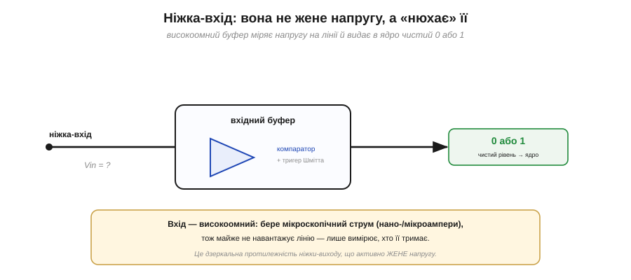
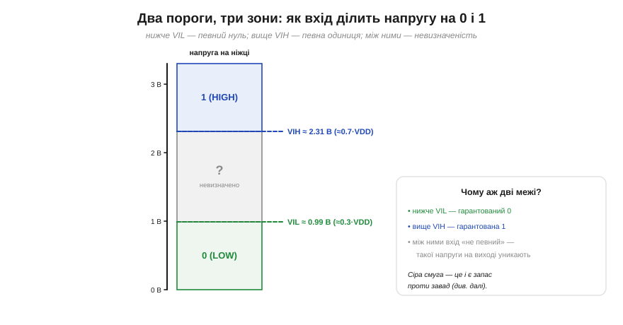
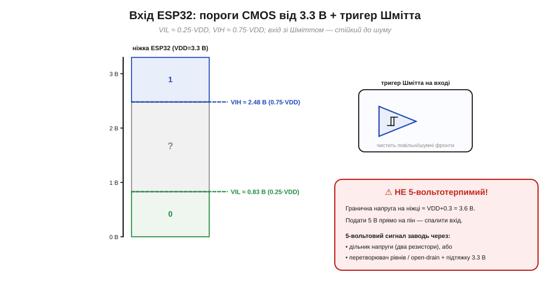

# Логічні пороги входу

Ніжка-вихід **жене** напругу — або сама ([push-pull](topic:electronics/push-pull-output)), або «півсилою» ([open-drain](topic:electronics/open-drain)). Ніжка-**вхід** влаштована протилежно: вона нічого не жене — вона **слухає**. На лінії є якась напруга, що її тримає хтось інший (кнопка, давач, інша мікросхема), і ніжка має **вирішити**, чи це нуль, чи одиниця. Питання просте на вигляд, та хитре по суті: напруга в реальному світі буває яка завгодно — 0.1 В, 1.4 В, 2.9 В, — а ядру потрібен чистий **біт**. Де ж провести межу? Виявляється, однієї межі замало: їх дві, між ними лежить «нічия земля», і саме ця конструкція робить цифрову логіку стійкою до бруду реального світу. Розберімо її по цеглинці.

### Вхід слухає, а не жене

[Вихід активно тримає напругу](topic:electronics/push-pull-output), бо приєднує ніжку транзистором то до VDD, то до GND, віддаючи чи приймаючи струм. Вхід влаштований протилежно. Усередині нього сидить **компаратор** (лат. *comparare* — порівнювати) — крихітна схема, що порівнює напругу на ніжці з внутрішніми опорними рівнями й видає в ядро вже готовий **0 або 1**. Сама ніжка-вхід при цьому **високоомна**: вона майже не бере струму (одиниці нано- чи мікроампер), тобто практично не навантажує лінію, а лише **вимірює** її. Це як вольтметр: добрий вольтметр показує напругу, майже нічого з кола не «висмоктуючи».


*Ніжка-вхід не жене напругу, а «нюхає» її: високоомний буфер (компаратор із тригером Шмітта) міряє рівень на лінії й передає в ядро вже чистий біт. Струм входу мізерний — лінію він майже не навантажує. Це дзеркальна протилежність ніжки-виходу.*

Те, що вхід майже не споживає струму, — велика зручність: до нього можна під'єднати слабке джерело (наприклад, давач, що сам ледь-ледь «штовхає» напругу), і вхід його не «просадить». Але та сама високоомність має зворотний бік: якщо до ніжки **взагалі нічого** не приєднано, вона нічого не міряє — і «висить у повітрі», ловлячи наводки. Цю пастку — [плаваючий вхід та підтяжки](topic:electronics/floating-pullups) — варто тримати в голові окремо; тут же досить знати, що вхід **читає** напругу, а не задає її.

> 🔧 **Навіщо це.** Запам'ятайте різницю в один рух: **вихід жене, вхід слухає**. Коли `digitalRead` повертає дивне — то «1», то «0» без причини, — перша підозра саме сюди: чи справді щось **тримає** напругу на ніжці? Високоомний вхід сам по собі рівня не має; його хтось мусить задати — джерело сигналу або підтяжка. Половина «глюків кнопки» — це не кнопка, а вхід, що лишився без певного рівня.

### Чому однієї межі замало

Найпростіша ідея — поставити **одну** межу посередині, скажімо на VDD/2 (для 3.3 В це 1.65 В): нижче — нуль, вище — одиниця. На папері працює, у житті — ні. Реальний сигнал ніколи не буває ідеально гладким: на нього накладається **шум** — дрібні коливання від сусідніх доріжок, живлення, радіоефіру. Якщо напруга повзе якраз біля єдиної межі, ці коливання штовхатимуть її то трохи вище, то трохи нижче порога — і вхід «брязкотітиме», видаючи 0-1-0-1 багато разів поспіль там, де мав бути один спокійний перехід. Один поріг — це лезо: будь-який подих шуму перекидає рішення туди-сюди.

Тому інженери зробили розумніше: розсунули межу надвоє й лишили поміж ними **нейтральну смугу**, де вхід просто «не певен». Це коштує трохи «чутливості», зате купує **стійкість**: дрібний шум уже не перекидає рішення, бо щоб змінити відповідь, напрузі треба перетнути не волосину, а цілу смугу.

### Два пороги, три зони: VIL і VIH

Звідси два названі пороги (їхні позначення прийшли з даташитів і варто їх упізнавати):

- **VIL** (*input low*) — найбільша напруга, яку вхід ще **гарантовано** читає як **0**. Усе, що нижче VIL, — певний нуль.
- **VIH** (*input high*) — найменша напруга, яку вхід **гарантовано** читає як **1**. Усе, що вище VIH, — певна одиниця.

Між ними — **заборонена (невизначена) зона**: тут виробник нічого не обіцяє, вхід може прочитати і так, і так. Тому справний сигнал у цій смузі **не затримують** — крізь неї лише швидко проскакують, переходячи з 0 у 1 чи навпаки.


*Вхід ділить усю шкалу напруги на три зони. Зелена (нижче VIL) — гарантований 0; синя (вище VIH) — гарантована 1; сіра між ними — «невизначено». Для CMOS пороги орієнтовно VIL ≈ 0.3·VDD і VIH ≈ 0.7·VDD. Сіра смуга — навмисний «буфер» проти завад.*

Зверніть увагу: «1» — це **не** рівно VDD, а будь-що **вище VIH**. Сигнал, що просів до 2.9 В замість 3.3 В, для входу однаково чітка одиниця. І навпаки, «0» — не конче рівний нуль, а будь-що **нижче VIL**. Цифрова логіка тому й надійна, що не вимагає точних вольтів — лише **впевнено далеко** від середини.

### Запас завадостійкості: чому пороги «відступають»

Тепер з'єднаймо дві теми — вихід і вхід — на одному дроті: один чіп жене, інший слухає. Вихід теж не дає ідеальних 0 і VDD; його реальні рівні мають свої імена:

- **VOL** (*output low*) — найбільша напруга, яку вихід видає, коли жене **0** (трохи більша за нуль).
- **VOH** (*output high*) — найменша напруга, яку вихід видає, коли жене **1** (трохи менша за VDD).

Щоб усе працювало, рівні драйвера мають **з запасом** потрапляти в потрібні зони входу: «нуль» драйвера (VOL) — бути нижчим за VIL входу, а «одиниця» (VOH) — вищою за VIH. Різницю й називають **запасом завадостійкості** (*noise margin*):

> **NML = VIL − VOL** (запас для нуля) **·** **NMH = VOH − VIH** (запас для одиниці)

Це буквально «скільки вольтів шуму можна докинути, перш ніж рівень зіб'ється». Завада, менша за цей запас, рівень **не перекине**; більша — може. Ось чому пороги навмисно «відступають» від рівнів драйвера: відступ і є подушкою безпеки.


*Те, що драйвер ВИДАЄ (VOL, VOH), і те, що вхід ВИМАГАЄ (VIL, VIH), навмисно не збігаються. Проміжки NML = VIL − VOL і NMH = VOH − VIH — це запас завадостійкості: подушка, у межах якої шум не зіб'є рівень. У CMOS ці запаси щедрі — близько 0.3·VDD кожен.*

> 🔧 **Навіщо це.** Звідси кілька дуже земних правил. По-перше, чому довгі дроти до кнопок і давачів — погана ідея: що довша лінія, то більше вона **ловить** наводок, і одного дня шум перевищить запас. По-друге, чому «майже одиниця» 2.9 В — це нормальна, надійна одиниця: вона все ще **вище** VIH із добрим запасом. По-третє, коли вхід «плаває» між зонами й читається випадково, ви тепер знаєте слова, якими це описати: сигнал застряг у **невизначеній зоні**, бо його ніхто не тримає певно.

### Гістерезис: тригер Шмітта

Дві межі вже краще за одну, але є ще розумніший хід — зробити так, щоб **самі пороги «пам'ятали»**, у якому стані ми зараз. Це і є **гістерезис** (гр. *hystéresis* — відставання, запізнення), а схему, що його дає, звуть **тригером Шмітта** (*Schmitt trigger*). Ідея: поріг на **ввімкнення** (коли напруга росте) — вищий, ніж поріг на **вимкнення** (коли падає). Позначмо їх **VT+** (верхній, спрацьовує на підйомі) і **VT−** (нижній, спрацьовує на спаді).

Працює так. Поки вхід читається як 0, він **не** перемкнеться в 1, доки напруга не підніметься аж до VT+. А коли вже перемкнувся в 1, він **не** впаде назад у 0, доки напруга не опуститься аж до VT−. Між VT− і VT+ — «мертва зона», де стан **не міняється взагалі**. Тому дрібний шум, що гойдає сигнал на пів-вольта туди-сюди, більше нічого не перекидає: щоб змінити рішення, треба пройти **всю** відстань від одного порога до іншого.


*Ліворуч — передавальна крива з гістерезисом: вгору перемикає на VT+, вниз — на нижчому VT−, між ними петля «пам'яті». Праворуч — навіщо це: повільний шумний фронт, що біля однієї межі «брязкотів» би десятком 0/1, з тригером Шмітта дає **один** чистий перепад.*

Тригер Шмітта — рятівник для **повільних** і **шумних** сигналів: довгого пологого фронту з кнопки, виходу з ємнісного давача, сигналу з-за довгого дроту. Без нього такий млявий фронт, повзучи крізь невизначену зону, штампував би пачку хибних перемикань. Саме тому **входи багатьох мікроконтролерів — зокрема ESP32 — мають тригер Шмітта вбудованим**. Він не лікує всіх хвороб (механічний [брязкіт контакту кнопки](topic:electronics/contact-debounce) він не прибере), але дрібний електричний шум на фронті гасить чудово.

### Дві родини порогів: TTL і CMOS

Звідки беруться конкретні числа порогів? Історично склалися дві великі **родини** логіки, і їхні пороги різні.

- **TTL** (на біполярних транзисторах, класика 5-вольтового світу): пороги **фіксовані й «низькі» —** VIL ≈ 0.8 В, VIH ≈ 2.0 В незалежно від того, що живлення 5 В. Вони несиметричні, тиснуться до низу шкали — спадок біполярної схемотехніки.
- **CMOS** (на польових транзисторах, наш випадок): пороги задано **часткою живлення** — приблизно VIL ≈ 0.3·VDD і VIH ≈ 0.7·VDD. Вони майже симетричні відносно середини й «їдуть» разом із VDD.


*Дві родини на спільній шкалі 5 В. У TTL пороги тиснуться донизу (0.8 / 2.0 В) і несиметричні; у CMOS — біля 0.3 і 0.7 живлення, симетричні. Звідси класична пастка сумісності: TTL-вихід у «1» дає лише ~2.4 В, а 5-вольтовому CMOS-входу треба ≥3.5 В — без підтяжки одиниця може не «дотягтися».*

Це не занудство, а джерело реальних багів: з'єднати дві родини «в лоб» не завжди можна. Класичний приклад — TTL жене сигнал у CMOS: у «1» TTL-вихід ледь дає 2.4 В, а CMOS-вхід на 5 В хоче бачити щонайменше 3.5 В — і одиниця просто не розпізнається. Рятують або підтяжка, або спеціальні «сумісні» входи. Знати, **якої родини** кожен бік, — половина справи в налагодженні міжмікросхемних зв'язків.

### Пороги входу ESP32 (і чому 5 В спалить пін)

ESP32 — чистий **CMOS** на живленні 3.3 В, тож його вхідні пороги такі (з даташита, орієнтовно): **VIL ≈ 0.25·VDD ≈ 0.83 В**, **VIH ≈ 0.75·VDD ≈ 2.48 В**. Між 0.83 і 2.48 В — широка (~1.6 В) невизначена смуга, а входи мають вбудований **тригер Шмітта**. Для нас це означає просте робоче правило: щоб ESP32 певно бачив одиницю, тримай на ніжці **понад ~2.5 В**; щоб нуль — **менш як ~0.8 В**; середини уникай.


*Пороги входу ESP32 від 3.3 В: VIL ≈ 0.83 В, VIH ≈ 2.48 В, із тригером Шмітта. Червоним — критичне застереження: ніжка **не 5-вольтотерпима**. Гранична напруга на піні ≈ VDD+0.3 = 3.6 В; подати 5 В прямо — спалити вхід.*

І ось найважливіше практичне попередження всієї теми: **ніжки ESP32 не «терплять» 5 В**. Абсолютний максимум напруги на піні — приблизно VDD + 0.3 В, тобто близько **3.6 В**. Подаси прямо 5-вольтовий сигнал (скажімо, з Arduino Uno або давача на 5 В) — і з великою ймовірністю **пошкодиш** вхід назавжди. П'ятивольтові сигнали заводять **тільки** через щось, що знижує напругу: дільник із двох резисторів, спеціальний перетворювач рівнів або [open-drain із підтяжкою](topic:electronics/open-drain) до 3.3 В.

> 🔧 **Навіщо це.** Візьми за звичку: **перш ніж з'єднати щось із ніжкою — глянь у даташит на «Absolute Maximum Ratings»** і порівняй із напругою свого джерела. Цей один погляд рятує плати від тихої смерті. «Не 5-вольтотерпимий» — не дрібний нюанс, а різниця між «працює» і «купуй нову плату». Більшість спалених входів ESP32 — це саме недогляд із 5 вольтами там, де очікувалося 3.3.

### Порахуймо: запас завадостійкості

Відчуймо запас завадостійкості числами — на ланцюжку «CMOS-драйвер → вхід ESP32», обидва на 3.3 В.

**Приклад (запас завадостійкості).** Беремо пороги входу ESP32 і типові рівні CMOS-драйвера під легким навантаженням:

```
Вхід ESP32 (VDD = 3.3 В):
   VIL ≈ 0.25·VDD = 0.83 В        VIH ≈ 0.75·VDD = 2.48 В

CMOS-драйвер на 3.3 В (легке навантаження):
   VOL ≈ 0.1 В (майже 0)          VOH ≈ 3.2 В (майже VDD)

Запас завадостійкості:
   NML = VIL − VOL = 0.83 − 0.1  = 0.73 В   (для нуля)
   NMH = VOH − VIH = 3.20 − 2.48 = 0.72 В   (для одиниці)

→ Завада до ~0.7 В рівень не зіб'є. Це CMOS: щедрі,
  майже симетричні запаси з обох боків.

Та обережно: гарантія з даташита — гірша (повне навантаження):
   VOH(min) = 0.8·VDD = 2.64 В → NMH = 2.64 − 2.48 = 0.16 В
   На сильно навантаженій лінії рахуй саме цей, гірший випадок.
```

Висновок подвійний. У типовому випадку CMOS дає розкішний запас — близько 0.7 В з обох боків, тому такі з'єднання звичайно «просто працюють». Але **гарантований** даташитом найгірший випадок (повне навантаження виходу) куди скромніший — і якщо лінія важко навантажена або довга, орієнтуватися треба саме на нього. Це і є інженерна звичка: дивитися не лише на «зазвичай», а й на «найгірше, що обіцяно».

Отже, ніжка-вхід — це високоомний «вимірювач», що порівнює напругу з **двома** порогами: нижче VIL — нуль, вище VIH — одиниця, між ними — невизначеність, якої уникають. Відступ порогів від рівнів драйвера дає **запас завадостійкості**, а тригер Шмітта з парою VT−/VT+ додає «пам'ять», що гасить шум на повільних фронтах. Числа порогів залежать від родини (TTL чи CMOS), а для ESP32 вони складають 0.25 і 0.75 від 3.3 В — із суворим застереженням не подавати на пін 5 В. Окреме велике питання лишається осторонь: а що, як до входу **взагалі нічого** не приєднано — який рівень він прочитає тоді? Це випадок [плаваючого входу й рятівних підтяжок](topic:electronics/floating-pullups).
