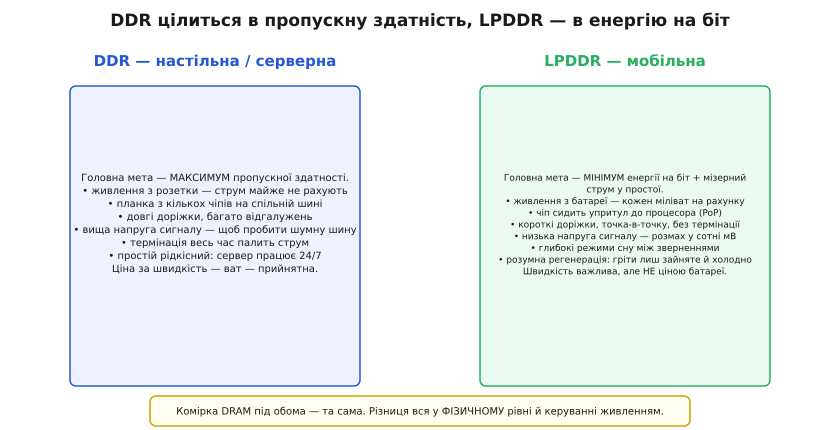
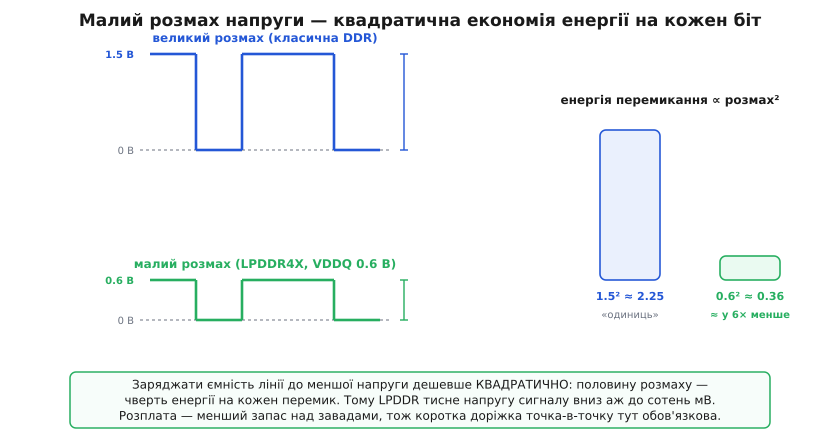
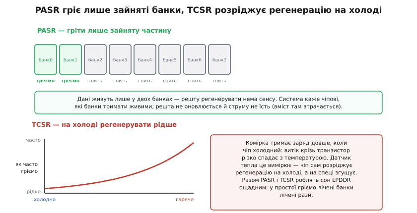

# LPDDR

Телефон у кишені має ту саму оперативну пам'ять, що й настільний комп'ютер, — швидку [синхронну DRAM з подвоєною швидкістю](topic:electronics/sdram-ddr). Але між планкою в системному блоці й крихітним чипом коло процесора смартфона лежить прірва в одному-єдиному вимірі: **енергія**. Настільна пам'ять живиться з розетки, де ват туди-сюди нікого не турбує; телефонна живиться з батареї, де кожен міліват точиться з тієї самої ємності, що має дотягти до вечора. Тому мобільна пам'ять — це не «трохи інша DDR», а DDR, переосмислена навколо одного питання: **як віддавати ті самі гігабайти за секунду, спалюючи в рази менше енергії?** Відповідь на це питання й зветься **LPDDR** (від англ. *low-power double data rate*, малопотужна пам'ять із подвоєною швидкістю даних).

Ключ до всієї теми — усвідомити, що LPDDR **не чіпає саму комірку**. Комірка DRAM — конденсатор із транзистором-ключем — під настільною й мобільною пам'яттю однакова аж до фізики. LPDDR переробляє **все навколо** комірки: як сигнали бігають дротами, під якою напругою, як чип поводиться, коли даних не питають. Уся економія живе на двох фронтах — у **фізичному рівні** (нижча напруга, коротші лінії, менше термінації) і в **керуванні живленням** (глибокий сон, розумна регенерація). Розберімо обидва від першопричини.


*Ліворуч — умови настільної DDR: живлення з розетки, планка з кількох чипів на довгій спільній шині, вища напруга сигналу, постійна термінація; заради швидкості ват не шкода. Праворуч — умови LPDDR: живлення з батареї, чип упритул до процесора, короткі лінії точка-в-точку, низька напруга, глибокий сон. Сама комірка під обома — та сама; уся різниця — у фізичному рівні й керуванні живленням.*

## Чому не можна просто взяти настільну DDR

Спокуслива думка: візьмімо звичайну DDR і поставмо в телефон — навіщо окремий стандарт? Річ у тім, що настільну DDR оптимізували під **пропускну здатність будь-якою ціною**, а ця ціна — саме та енергія, якої в телефоні нема.

Найперше — **напруга сигналу**. Щоб надійно передати біт довгою доріжкою повз кілька відгалужень до кількох чипів планки, потрібен добрий розмах напруги: рівень «одиниці» має явно вибиватися над шумом. Настільна DDR3 хитала лінію на цілий вольт із гаком. Але заряджати ємність доріжки — це витрачати енергію, і витрачати її **квадратично** щодо напруги. Кожен перемик лінії коштує приблизно C·V² — учетверо менше, якщо розмах удвічі нижчий. На мільярдах перемиків за секунду цей квадрат вирішує все.

Друге — **термінація**. На високих частотах різкий фронт, дійшовши до кінця доріжки, [відбивається](topic:electronics/edges-rise-time) назад і псує сусідні біти. Настільна пам'ять глушить ці відбиття резисторами-термінаторами, і ті резистори **весь час точать струм** — навіть коли пам'ять просто тримає лінію в спокої. Для сервера, що молотить 24 на 7, це прийнятно. Для телефона, що більшість часу лежить у кишені, — марнотратство.

Третє — **сама топологія**. Планка настільної пам'яті — це кілька чипів, що відповідають гуртом, на спільній шині з відгалуженнями. Така шина ємна, шумна й вимагає високої напруги та термінації, щоб узагалі працювати. LPDDR іде іншим шляхом: **один чип, коротка лінія точка-в-точку**, часто взагалі напряму над процесором. Коротка лінія — мала ємність, мало відбиттів, тож можна і напругу зронити, і термінацію майже прибрати.

Складіть це разом — і виходить, що настільна DDR у телефоні жерла б батарею не «трохи більше», а в рази, і половину того струму палила б, навіть нічого не роблячи. Тому мобільній пам'яті потрібен був **власний фізичний рівень**, збудований від нуля навколо ощадності.

## Низький розмах: квадратична економія на кожному біті

Головний важіль LPDDR — тиснути напругу сигналу вниз. Куди саме тиснути, добре видно на найпоказовішому кроці — переході від **LPDDR4** до **LPDDR4X**. Обидва — той самий протокол, ті самі швидкості; різниця в одному числі. LPDDR4 живив лінії даних напругою **VDDQ = 1.1 В**. LPDDR4X лишив усе, крім однієї зміни: **зронив VDDQ до 0.6 В**. Більше нічого — та сама пам'ять, той самий інтерфейс, просто менша напруга на виводах даних. І цього одного вистачило, щоб помітно скинути споживання.

Чому такий ефект від «просто меншої напруги»? Бо енергія перемикання лінії — квадратична за напругою.

**Приклад (звідки береться економія LPDDR4X).** Порахуймо, у скільки разів дешевшає один перемик лінії даних, коли розмах падає з 1.1 В до 0.6 В.

```
енергія перемику   ∝ V²          (заряд ємності лінії до напруги V)
LPDDR4  : VDDQ = 1.1 В   →  1.1² = 1.21  «одиниць»
LPDDR4X : VDDQ = 0.6 В   →  0.6² = 0.36  «одиниць»
відношення         = 1.21 / 0.36 ≈ 3.4
```

Висновок прикладу: та сама передача коштує на виводах даних приблизно **втричі з гаком менше енергії** — лише тому, що напругу зронили майже вдвічі, а платить квадрат. Ось чому мобільна пам'ять з покоління в покоління сповзає все нижче: **LPDDR3** хитала лінію напругою близько 1.2 В, LPDDR4 — 1.1 В, LPDDR4X — 0.6 В, **LPDDR5** — уже 0.5 В на виводах даних. Кожен крок униз — квадратичний виграш, і саме тому цифру напруги в мобільній пам'яті вибивають так завзято.


*Угорі — великий розмах класичної DDR (близько 1.5 В): біт певний, але кожен перемик заряджає ємність лінії до високої напруги. Унизу — малий розмах LPDDR4X (VDDQ 0.6 В): та сама послідовність бітів, але лінія хитається набагато менше. Праворуч — чому це важливо: енергія перемику росте як квадрат розмаху, тож перехід від 1.5 до 0.6 В скидає цей внесок приблизно в шість разів. Розплата — менший запас над завадами, тому коротка лінія точка-в-точку тут обов'язкова.*

За малий розмах є розплата, і чесно її назвати. Що менший розмах, то ближче «одиниця» підходить до «нуля» й до шуму — [запас над завадами](topic:electronics/noise-margin) тане. На вольтовому розмаху завада в сотню мілівольт — дрібниця; на розмаху в 600 мВ вона вже може перекинути біт. Тому низька напруга LPDDR **тримається тільки завдяки короткій лінії**: точка-в-точку, без довгих відгалужень, часто прямо над процесором — там завад мало й малого розмаху досить. Приберіть коротку лінію — і низька напруга розсиплеться в помилки. Дешевизна за напругою куплена дисципліною за топологією.

Щоб витиснути ще й з того, що лишилося, LPDDR застосовує **інверсію шини даних** (англ. *data bus inversion*, DBI): передавач дивиться на байт і, якщо в ньому забагато рівнів, що палять струм, інвертує **весь** байт, а окремим дев'ятим проводом каже приймачеві «я інвертував — переверни назад». Так на шині завжди тримається менше «дорогих» рівнів, а отже й менше струму та завад. Дрібний на вигляд трюк, але на мільярдах передач він теж додає до батареї.

> 🔧 **Навіщо це.** Низький розмах пояснює, чому мобільну пам'ять **не можна розвести абияк**. У даташиті LPDDR ви побачите вимогу короткої лінії точка-в-точку й жорсткі обмеження на довжину та відгалуження — це не примха, а плата за низьку напругу: на довгій шумній доріжці сигнал у сотні мілівольт просто загубиться. Звідси й практичне правило компонування плати: чип LPDDR ставлять **упритул** до процесора, доріжки короткі й рівні, а не «десь поряд, дротом дотягнемось». І звідси ж — чому мобільну пам'ять зазвичай **не роблять змінною планкою**: вона мусить сидіти на тих самих кількох міліметрах від процесора, часто прямо в його корпусі.

## Пам'ять на процесорі: package-on-package

Вимога короткої лінії веде до рішення, якого в настільному світі майже нема, — **посадити чип пам'яті просто на процесор**. Це зветься **package-on-package** (англ., «корпус на корпусі», PoP): корпус LPDDR ставлять **згори** на корпус процесора, вивід до виводу, так що обидві мікросхеми займають на платі **один слід**.

Причина не лише в економії місця, хоча в телефоні кожен квадратний міліметр на вагу золота. Головне — **довжина зв'язку**. Коли пам'ять сидить прямо над процесором, доріжки між ними стають найкоротшими можливими: міліметри замість сантиметрів. Коротка лінія — мала ємність, малі відбиття, малий перекіс між сусідніми бітами. Саме це й дає змогу тримати низьку напругу й майже без термінації: фізика зв'язку стає настільки лагідною, що дорогі засоби боротьби з шумом уже не потрібні. PoP — це не просто спосіб зекономити площу, а спосіб зробити лінію такою короткою, щоб уся ощадна філософія LPDDR узагалі спрацювала.

Розплата — теплова й ремонтна. Дві мікросхеми одна на одній гріють одна одну, а замінити пам'ять окремо вже не можна — вона фізично зрощена з процесором. Але для телефона, де пам'ять і так не міняють, це прийнятна ціна за короткий зв'язок і малу площу.

## Сон: головна ощадність — у простої

Тепер найважливіше, і саме тут LPDDR розходиться з настільною DDR найдужче. Порахуймо чесно: телефон **більшість часу нічого не робить** з пам'яттю. Екран погас, застосунки сплять, а оперативна пам'ять мусить лише **не забути** свій вміст. Отже, головна війна за батарею йде не тоді, коли пам'ять шпарить дані, а тоді, коли вона **простоює**. Пам'ять, що в роботі економна, але в простої палить струм, для телефона нікуди не годиться.

DRAM у простої не може просто вимкнутися: [її комірки — конденсатори, що течуть](topic:electronics/dram-cell), і без періодичного оновлення заряд стече, а дані пропадуть. Це оновлення зветься **регенерацією** (англ. *refresh*): чип раз у раз перечитує кожен ряд і записує назад, поновлюючи заряд. Регенерація — обов'язкова, і вона **точить струм навіть у мертвому спокої**. Отже, щоб LPDDR була ощадною в простої, треба вгамувати саме регенерацію та все, що крутиться навколо неї. LPDDR б'є по цьому з трьох боків.

**Перше — глибокі режими сну.** Коли даних не питають, LPDDR не просто «чекає» — вона поетапно **вимикає власні нутрощі**. Найлегший рівень гасить лінії вводу-виводу; глибший — зупиняє внутрішній генератор такту; найглибший, **режим глибокого сну** (англ. *deep sleep mode*, у LPDDR5), **вимикає внутрішні перетворювачі напруги**, що не потрібні для збереження даних, лишаючи ввімкненою тільки саму регенерацію. Що глибший сон — то менше живих вузлів точать струм, і то більше треба часу на пробудження. Чип сам сходить сходинками сну вниз, коли роботи нема, і виринає нагору, коли процесор знову стукає.

**Друге — самопідтримувана регенерація без контролера.** У найглибшому спокої навіть [контролер пам'яті](topic:electronics/memory-controller) може заснути. Щоб дані не пропали, LPDDR уміє **сама себе регенерувати** — режим самооновлення (англ. *self refresh*): чип за власним внутрішнім таймером обходить ряди й поновлює заряд, поки решта системи спить. Контролер не мусить прокидатися лише щоб нагадати пам'яті оновитися; він будить її тільки тоді, коли справді потрібні дані.

**Третє — і найхитріше — розумна регенерація.** Проста DRAM регенерує **весь масив однаково часто**, з фіксованим періодом «на найгірший випадок». LPDDR помічає, що це двічі марнотратно, і робить регенерацію ощадною двома трюками, тісно пов'язаними саме з мобільним ужитком.


*Угорі — PASR (часткова регенерація масиву): дані живуть лише у двох банках із восьми, тож решту регенерувати нема сенсу — система каже чипові тримати живими лише зайняті банки, а решта не оновлюється й струму не їсть (вміст там свідомо втрачається). Унизу — TCSR (регенерація з поправкою на тепло): витік комірки різко зростає з температурою, тож на холоді заряд тримається довше й оновлювати можна рідше, а на спеці — частіше; вбудований датчик тепла міряє температуру, і чип сам підбирає темп.*

Перший трюк — **часткова регенерація масиву** (англ. *partial array self refresh*, PASR). Ідея проста до геніальності: **навіщо гріти порожнє?** Коли телефон спить, у пам'яті часто зайнята лише невелика частина — решта банків порожня або їхній вміст не шкода втратити. PASR дає системі сказати чипові: «регенеруй лише оці банки, решту облиш». Невживані банки перестають оновлюватися, їхній струм регенерації падає до нуля, а вміст там свідомо приноситься в жертву — його там і так не було потрібно. Операційна система, знаючи, які сторінки пам'яті ще живі, вкладає їх у найменшу кількість банків і вмикає PASR на решту.

Другий трюк — **регенерація з поправкою на температуру** (англ. *temperature-compensated self refresh*, TCSR). Тут працює фізика самої комірки: **витік крізь транзистор-ключ різко залежить від температури**. На холоді заряд у комірці тримається довго, на спеці стікає швидко. Проста DRAM цього не знає й регенерує з періодом, розрахованим на найгарячіший випадок, — тобто **надто часто** щоразу, коли чип не розпечений. LPDDR ставить усередину **датчик тепла**: чип міряє власну температуру й **сам** розріджує регенерацію, поки холодно, і згущує, коли гріється. Оскільки телефон у кишені зазвичай не гарячий, більшість часу пам'ять оновлюється рідше за «найгірший» темп — і економить саме тоді, коли важливо. Обидва трюки можна ввімкнути разом, і тоді в глибокому сні телефон гріє **лічені банки лічені рази** — а це і є та мала регенераційна течія, що дає пам'яті пережити ніч на кишеньковій батареї.

> 🔧 **Навіщо це.** Ці режими — причина, чому автономність пристрою так залежить від того, **скільки пам'яті реально зайнято** й **як гаряче** всередині. Багато живих сторінок означає, що PASR не може погасити банки, і регенерація точить більше струму в простої; розпечений корпус означає, що TCSR змушений частішати. Розробникові вбудованої системи це диктує практику: тримати в оперативній пам'яті **якнайменше живих даних** перед сном, дозволяти системі складати їх щільно й вимикати непотрібне — і не забувати, що **гаряча плата коштує батареї** навіть у спокої. І це пояснює, чому телефон у теплій кишені сідає швидше, ніж на прохолодному столі: витік росте, TCSR частішає, регенерація жере більше.

## Швидкість без зайвого палива: клок WCK у LPDDR5

Ощадність не означає повільність — LPDDR мусить іще й **не відставати** від настільної пам'яті за швидкістю, і тут криється розумний хід, який заодно економить енергію. Проблема стара: щоб гнати дані швидше, треба швидший такт, а швидкий такт **сам по собі палить струм** — його розводять по всьому чипу, і кожен його перемик коштує енергії. Тримати такий швидкий такт увімкненим **весь час**, навіть коли команд нема, — марнотратство.

**LPDDR5** розв'язує це, **розділивши такти на два**. Один такт, **CK** (від *clock*), повільний, несе команди й адреси. Другий, **WCK** (від *write clock*, такт даних), швидкий, потрібен лише коли реально течуть дані. WCK біжить у **чотири рази** швидше за CK: на швидкості даних 6400 мегапередач за секунду CK стукає лише на 800 МГц, а вчетверо швидший WCK робить решту. Хитрість у тому, що швидкий WCK **вмикають тільки на час пакета даних** і глушать між пакетами, тоді як повільний CK крутиться собі за копійки. Так пам'ять дістає високу швидкість передачі, не тримаючи дорогий швидкий такт увімкненим постійно, — швидкість тоді, коли треба, і тиша, коли не треба.

Це, до речі, показує весь дух LPDDR в мініатюрі: не «зроби повільніше, щоб економити», а «**вмикай дороге лише тоді, коли воно справді працює**». Той самий принцип, що за режимами сну й розумною регенерацією, тільки застосований до такту.

## Що з усього цього складається

LPDDR — це та сама дешева комірка DRAM, обгорнута в фізичний рівень і керування живленням, збудовані навколо одного числа — енергії. Низький розмах напруги вирізає квадратичний внесок кожного перемику; коротка лінія точка-в-точку й посадка пам'яті просто на процесор роблять цей низький розмах можливим; глибокі режими сну гасять усе зайве, коли роботи нема; самопідтримувана регенерація дає контролерові теж заснути; а PASR і TCSR роблять навіть обов'язкову регенерацію ощадною — гріють лише зайняте й лише настільки часто, наскільки велить температура. Швидкість же LPDDR добирає розумно, вмикаючи швидкий такт лише на час даних.

Жодна з цих рис не міняє того, **що** пам'ять зберігає, — вони міняють лише те, **скільки енергії** це коштує. Саме тому пам'ять телефона, планшета й будь-якого пристрою на батареї — це LPDDR, а не звичайна DDR: обидві тримають ті самі гігабайти, але лише одна вміє тримати їх, не спорожнивши батарею до обіду.
