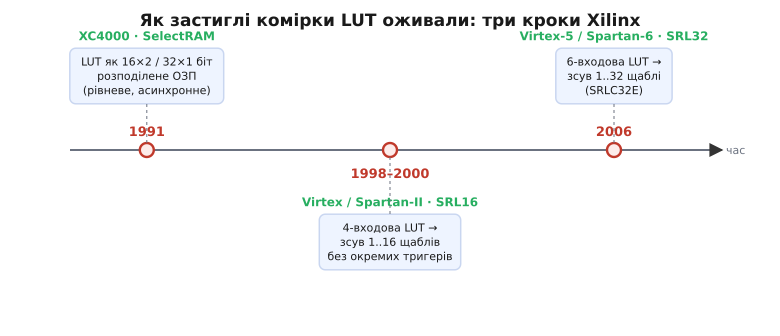

# 📜 Як застиглі комірки навчили дихати: народження SelectRAM і SRL

Є ідеї, що вражають не складністю, а зухвалою простотою — коли хтось раптом бачить у знайомій речі другу річ, яка весь час була там, просто ніхто не придивлявся. Історія розподіленого ОЗП і зсувного регістра на LUT — саме така. У ній немає ні героїчного одинака, ні епохального прориву в фізиці; є жменька інженерів у Каліфорнії, які кілька разів поспіль поставили те саме нахабне питання — «а що, якщо ці комірки не мусять стояти?» — і щоразу діставали з нього несподівано багато.

Щоб відчути, чому це прозріння взагалі мало статися, треба спершу зрозуміти, що́ саме бентежило. Бо на позір тут нема чого відкривати: [таблиця підстановки](topic:electronics/lut) — це маленька пам'ять, у пам'ять пишуть, кінець історії. Але диявол, як завжди, у тому, чому цього **не** робили роками, хоч залізо було під рукою.

## Що бентежило: пам'ять, якій заборонили бути пам'яттю

Згадаймо, з чого зроблена LUT. Усередині — статичні комірки (SRAM), у які бітстрім заливає стовпець відповідей логічної функції, і дерево мультиплексорів, яким входи вибирають потрібний біт. З погляду фізики це **буквально** мікроскопічна пам'ять: подав адресу (входи) — дістав слово (вихід). І пам'ять ця — з тих самих шеститранзисторних комірок SRAM, які ви знайдете в будь-якому кеші процесора; ті самі комірки, що за природою **перезаписувані будь-коли**.

Отут і криється дивина. Комірка SRAM уміє приймати новий біт — це її вроджена здатність, вона для цього й придумана. А в LUT цю здатність **свідомо відрізали**: біти заливають раз, на старті конфігурації, і далі вони стоять непорушно до наступної заливки всього чипа. Пам'ять, якій заборонили бути пам'яттю. Роками цілі поля таких комірок сиділи на кристалах FPGA закам'янілими — мільйони готових клітинок пам'яті, до яких «не можна» писати, хоча технічно можна.

Чому так вийшло? Бо перші FPGA будували з однією-єдиною метою в голові: **замінити розсип логічних мікросхем**. Клітинку задумували як «функцію» — реалізувати AND, OR, суматор, автомат. Пам'ять у цю картину не входила: якщо схемі потрібні дані, для них є окремі мікросхеми ОЗП поруч на платі. Комірки LUT сприймали як **спосіб зберегти таблицю логіки**, а не як пам'ять загального призначення. Це не був недогляд — це був спосіб дивитися. І щоб зламати його, комусь треба було глянути на ту саму залізяку іншими очима.

> 🔧 **Навіщо це знати.** Ця історія — наочний урок, що найцінніші інженерні відкриття часто не додають нового заліза, а **знімають самообмеження** зі старого. Комірки вже стояли; бракувало лише дозволу їм працювати. Коли ви наступного разу впираєтесь у «нам бракує ресурсу», варто спитати себе те саме питання, що поставили в Xilinx: а що з уже наявного я через звичку тримаю застиглим?

## Дійові особи: Каліфорнія, а не імперія

Перш ніж іти далі, зафіксуймо, **чиїх це рук діло** — бо тут якраз той випадок, коли атрибуція проста й перевірна, і не треба нікого ні до кого «дотягувати».

Компанію Xilinx заснували в **лютому 1984 року** в Сан-Хосе (Каліфорнія, Кремнієва долина) троє: **Росс Фрімен** (англ. *Ross Freeman*, 1948–1989), **Берні Вондершмітт** (нім.-амер. *Bernard Vonderschmitt*) і **Джим Барнетт** (англ. *Jim Barnett*). Саме Фрімен — американський інженер-електрик — придумав саму ідею FPGA: чип, повний «відкритих воріт», які інженер перепрограмовує скільки завгодно разів. Він правильно розрахував, що завдяки закону Мура транзистори дешевшатимуть рік у рік, тож марнувати їх на гнучкість стане не гріхом, а вигодою. За винахід FPGA Фрімена посмертно ввели до Національної зали слави винахідників США **2009 року**.

*Статус доказовості: підтверджено кількома незалежними джерелами (Національна зала слави винахідників, енциклопедичні й галузеві публікації) — дата заснування, місто, склад засновників і авторство ідеї FPGA за Фріменом.*

Це важливо сказати прямо, без околяса: розподілене ОЗП і SRL — прозріння інженерів **американської** компанії в Каліфорнії. Тут немає ані потреби, ані ґрунту для імперської чи національної міфології «хто перший у світі придумав» — авторство корпоративне й документоване даташитами та апнотами. Далі важать не прапори, а **дати архітектур**, і кожну з них можна звірити з офіційним папером.

## Перше прозріння: XC4000 і SelectRAM (1991)

Перелам стався з третім поколінням чипів Xilinx — родиною **XC4000**, яку представили **1991 року**. Саме там уперше клітинку перестали бачити лише як «функцію».

Інженери зробили те, що заднім числом здається очевидним: домалювали до частини клітинок **порт запису** — і дозволили генераторам функцій (function generators, тобто LUT) працювати ще й **ОЗП просто в тілі логіки**. Офіційне формулювання того часу коротке й точне: клітинки XC4000 можна конфігурувати як **16×2 або 32×1 біт** однопортової пам'яті. Xilinx назвала цю штуку **SelectRAM** (від *select* — «на вибір»: та сама клітинка на вибір стає то логікою, то пам'яттю).

*Статус: підтверджено даташитами Xilinx серії XC4000 (Digi-Key/Xilinx). XC4000 — 1991, третя родина FPGA Xilinx; конфігурації 16×2 / 32×1 біт SelectRAM.*

Одна тонкість, яку варто знати заради точності: **найперший** XC4000 давав пам'ять **рівневу (level-sensitive)** — тобто асинхронну, без такту запису. Синхронний, тактований запис (edge-triggered) і двопортовий режим дозріли трохи згодом, у підродині **XC4000E**, чиї даташити прямо хваляться «on-chip SelectRAM memory with edge-triggered and dual-port modes». Тобто навіть усередині одного покоління ідея дозрівала кроками: спершу «нехай пишеться взагалі», потім «нехай пишеться дисципліновано, по фронту».

*Статус: підтверджено — рівневий режим у базовому XC4000, edge-triggered і dual-port додано в XC4000E (даташити Xilinx).*

Спинімося й відчуймо вагу цього кроку. До XC4000, щоб покласти в дизайн буфер на кілька слів, доводилося або тягти окрему мікросхему ОЗП на плату, або мостити пам'ять із тригерів — дорого й незграбно. Після XC4000 дрібна пам'ять раптом стала **майже безкоштовною**: комірки вже на кристалі, за них заплачено, коли будували логіку, — лишалося дозволити їм приймати запис. Пам'ять перестала бути окремим великим масивом «десь скраю» і **розсипалася по полю логіки** дрібними шматочками в самих клітинках. Звідси й назва, що прижилася поза Xilinx як загальна: **розподілена пам'ять** (англ. *distributed RAM*) — на противагу зібраній в один масив «блоковій».

## Друге прозріння: а якщо замкнути їх у ланцюг? SRL16 (1998–2000)

Перше питання було «а що, якщо їм дозволити писатися?». Друге виявилося ще хитрішим і ще пліднішим: **а що, якщо ті самі комірки не просто оживити, а зв'язати вихід кожної з входом наступної й дати спільний такт?**

Відповідь — [тактований зсувний регістр](topic:electronics/shift-register-clocked). Тільки збудований **не з окремих тригерів**, а з тих самих SRAM-комірок LUT, перемкнутих у режим зсуву. Це визріло в поколінні **Virtex** і **Spartan-II** на зламі тисячоліть. Оригінальний Virtex Xilinx анонсувала в **листопаді 1997-го**, а перші зразки пішли в **другому кварталі 1998 року**; бюджетну Spartan-II представили близько **2000-го**. Чотиривходова LUT цих чипів уміла обернутися на **зсувний регістр завдовжки від 1 до 16 щаблів** — примітив назвали **SRL16** (англ. *Shift Register LUT, 16 bits*).

*Статус: підтверджено. Virtex — анонс листопад 1997, зразки Q2 1998; Spartan-II — близько 2000 (енциклопедичні й галузеві джерела). SRL16 = 1..16 щаблів у одній 4-входовій LUT (апнот XAPP465).*


*Одна думка — «нехай комірки не стоять» — розгорталася кроками. Спершу LUT дозволили бути живим ОЗП (SelectRAM). Тоді її навчили бути зсувним ланцюгом на 16 щаблів. А коли LUT доросла до шести входів і 64 бітів, той самий зсув розтягнувся до 32 щаблів. Кожна віха — окрема архітектура з власним даташитом.*

Чому цей поворот такий влучний? Погляньмо на ціну. Щоб зробити 16-щаблеву лінію затримки на тригерах, треба **16 тригерів** — шістнадцять клітинок стану, дефіцитний ресурс, якого на чипі завжди бракує. А SRL16 укладає всі 16 щаблів у **одну** LUT, не витративши **жодного** окремого тригера. Різниця в ресурсах не «трохи краще» — вона **разюча**: там, де регістр з'їв би десятки клітинок, SRL обходиться однією.

Але справжня родзинка — навіть не в економії, а в тому, як інженери вжили **входи LUT**. У режимі зсуву ці входи вже не потрібні як логічна адреса читання таблиці. То нащо їм пропадати? Їх пустили на **вибір відводу** (англ. *tap*) — тобто ними задають, **з якої саме комірки ланцюга** брати вихід. Постав адресу 15 — вихід із останньої комірки, повна 16-щаблева затримка. Постав адресу 7 — вихід із восьмої, і той самий фізичний ланцюг поводиться як 8-щаблевий. Виходить **керована на льоту довжина затримки**, від 1 до 16 тактів, самою лише адресою, без жодної зміни схеми. Дурно застиглі колись комірки перетворилися на **програмовану лінію затримки** — кістяк елементів затримки в цифровому обробленні сигналів.

Тут варто чесно позначити, де легенда, а де факт. Побутує гарна оповідка, ніби SRL «випадково відкрив» якийсь інженер, помітивши, що комірки й так з'єднані в ланцюг для заливки конфігурації, — мовляв, шлях зсуву вже фізично був, лишалося вивести його назовні. У цій оповідці є технічне зерно: конфігураційні біти FPGA справді заливаються зсувом, тож ідея «зсувного ланцюга з комірок» була інженерам близька й звична. Але **іменного** авторства «моменту осяяння» офіційні джерела не фіксують — SRL16 подано як архітектурну рису покоління, а не як чиюсь підписану знахідку.

*Статус: конкретна історія «випадкового відкриття» — галузевий переказ без документального підтвердження; технічний факт (конфіг FPGA заливається зсувом) — достовірний. Не приписуймо осяяння конкретній особі без джерела.*

## Третє прозріння: LUT доросла — доросла й затримка (SRL32, 2006)

Третій крок не приніс нової ідеї — він **розтягнув** стару, коли підросло залізо. Довго LUT мала чотири входи й тримала 16 бітів. У поколінні **Virtex-5** (**2006**) і згодом **Spartan-6** Xilinx перейшла на **шеститвходову** LUT, що тримає **64** біти. А більша комірка — довший можливий зсув: та сама конструкція, розтягнута на **32 щаблі**. Примітив назвали **SRLC32E** (літера C — *cascadable*, «зчіплюваний»; кілька таких можна зчепити в ще довший ланцюг), і це «змінної довжини зсувний регістр на 1..32 такти в одній LUT».

*Статус: підтверджено. Virtex-5 — 2006, 6-входова LUT / 64 біти; SRLC32E = 1..32 щаблі, з клоковим дозволом і каскадуванням (даташити й бібліотеки примітивів Xilinx/AMD, XST User Guide для Virtex-6/Spartan-6).*

Помітьте візерунок. Ідея не мінялася **сімнадцять років** — від XC4000 (1991) до Virtex-5 (2006). Мінявся лише розмір комірки, а разом із ним — місткість пам'яті й довжина затримки, які з тієї комірки можна вичавити. 16 бітів SelectRAM у 1991-му → 16 щаблів SRL у Virtex → 32 щаблі SRL і 64 біти ОЗП у Virtex-5. Одне прозріння, яке терпляче росло разом із кремнієм.

## Коли це нарешті записали: апноти XAPP464 і XAPP465

Прикметна деталь про те, як інженерне знання дозріває до канону. Хоча SelectRAM жила з 1991-го, а SRL16 — з кінця 1990-х, **офіційні** методички Xilinx, які докладно вчать «як брати LUT за пам'ять» і «як брати LUT за зсувний регістр», датовані вже серединою 2000-х:

```
XAPP464 «Using Look-Up Tables as Distributed RAM»  — v2.0, 1 березня 2005
XAPP465 «Using Look-Up Tables as Shift Registers»   — v1.1, 20 травня 2005
```

*Статус: підтверджено безпосередньо з титульних сторінок цих апнотів (Xilinx XAPP464 v2.0, 2005-03-01; XAPP465 v1.1, 2005-05-20).*

Саме ці папери й закріпили ту дисципліну доступу, яку сьогодні кожен приймає як належне. XAPP464 прямо каже, що **розподілене ОЗП пише синхронно, а читає асинхронно**, і що живе воно лише в **пам'яткоздатних** клітинках — Xilinx кличе їх **SLICEM** (від *memory*), на відміну від звичайних логічних **SLICEL** (від *logic*). Той самий апнот показує, що «дві примітиви 32×1 однопортового ОЗП влазять в один CLB», а «кожне 16×1-бітне ОЗП зчіплюване» в більше. XAPP465 так само описує, що SRL16 зсуває від 1 до 16, а зчіплюваний варіант SRLC16 дає синхронний вихід і каскад.

Те, що методики вийшли на десяток років пізніше за саму можливість, — не дивина, а типовий життєвий цикл інженерної ідеї. Спершу архітектори кладуть здатність у кремній, бо бачать її користь; потім синтезатори вчаться її **самі впізнавати** в звичайному коді (щоб ланцюжок регістрів `data <= {data[N-2:0], bit}` тихо згортався в SRL, а несиметричний «читаю без такту, пишу під фронтом» доступ — у розподілене ОЗП); і аж тоді, коли практика усталюється, її зводять у канонічний папір «ось як цим користуватися правильно». Даташит фіксує **можливість**, апнот — **звичку**.

## Чому переосмислення застиглих комірок виявилося таким плідним

Лишається головне питання — не «як», а «чому це спрацювало аж так добре». Адже додати порт запису чи замкнути комірки в ланцюг — трюки прості; чому вони дали такий непропорційно великий виграш?

Відповідь у **вже сплаченій ціні**. Транзистори комірок SRAM у LUT уже стоять на кристалі — за них заплачено площею й енергією тоді, коли будували логіку, і вони нікуди не подінуться, хоч би ви їх використали, хоч би ні. Тож будь-яка **нова роль** для цих комірок дістається майже задарма: не треба класти окремий блок, тягти дроти через півкристала, витрачати дефіцитні виділені ресурси. Ви платите лише за тоненьку **обв'язку** — порт запису чи перемикач у режим зсуву, — а самі комірки вже оплачені. Це рідкісний в інженерії випадок, коли додаткова функція коштує **майже нуль**, бо спирається на те, що й так є.

Друга причина глибша й майже філософська. Придивившись, бачимо, що **логіка, пам'ять і затримка — це не три різні речі, а три погляди на одну**. Комірки з деревом мультиплексорів: якщо біти застиглі й читаються адресою-функцією — це **логіка**. Якщо ті самі біти можна писати під час роботи — це **пам'ять**. Якщо їх зв'язати в ланцюг і крокувати по такту — це **затримка**. Одне залізо, три обличчя. Прозріння інженерів Xilinx полягало не в тому, щоб винайти нове, а в тому, щоб **побачити цю триєдність** і не тримати дві грані застиглими, коли працює лише третя.

Саме тому, дивлячись на LUT, варто бачити в ній не «логічний елемент», а **універсальну жменьку комірок**, що на вимогу стає то функцією, то ОЗП, то лінією затримки. Історія SelectRAM і SRL — це, зрештою, історія про те, як кілька людей у Каліфорнії перестали дивитися на пам'ять як на щось, що мусить бути окремим великим масивом, і побачили, що найдешевша пам'ять у FPGA — та, що вже там, усередині логіки, лиш чекає дозволу дихати.
