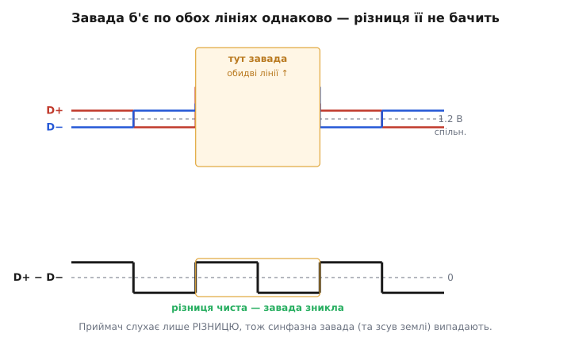
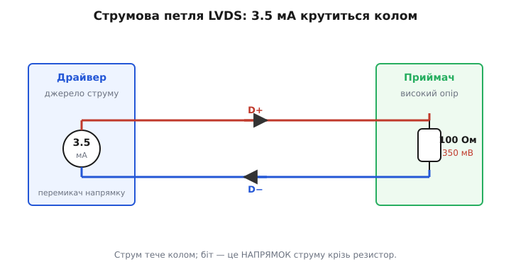
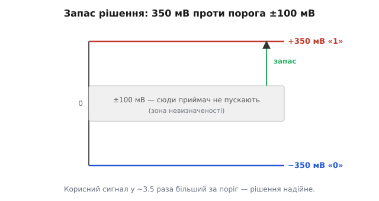

# Диференціальна сигналізація LVDS

Уяви, що треба передати цифровий потік — скажімо, картинку на екран ноутбука — проводом завдовжки в долоню чи в метр, і зробити це швидко: сотні мільйонів, а то й мільярди перемикань за секунду. Найпростіший спосіб, до якого тягнеться рука, — гнати звичайний логічний сигнал: 0 вольт — це «0», 3.3 вольта — це «1», один провід відносно спільної землі. Працює на повільних лініях. Але щойно швидкість зростає, цей спосіб починає стріляти собі в ногу відразу з трьох боків: він шумить в ефір, він ловить чужий шум, і на кожне перемикання витрачає помітну енергію на перезаряджання проводу до трьох вольт. LVDS (англ. *Low-Voltage Differential Signaling* — низьковольтна диференціальна сигналізація) — це відповідь на всі три болячки одним прийомом.

Прийом такий: не один провід із великим розмахом напруги, а **пара** проводів із крихітним розмахом, і біт закодований не рівнем напруги на одному з них, а **різницею** між ними. Розмах — усього близько 350 мілівольтів. Здавалося б, це навпаки крок назад: менший сигнал легше загубити в шумі. А виходить навпаки — і саме розуміння, чому маленький диференціальний сигнал надійніший за великий одиночний, і є суть цієї теми.

## Чому пара, а не один провід

Одиночний провід має ворога, з яким нічого не вдієш: спільну землю. Приймач порівнює напругу на проводі з напругою «своєї» землі. Але земля приймача й земля драйвера — це не одна ідеальна точка, а мідь із опором та індуктивністю, якою течуть струми інших вузлів. Між двома «землями» легко набігає різниця у десяті вольта, а на довшій відстані — і цілий вольт. Для сигналу, що коливається від 0 до 3.3 В, це вже помітна частка. Для сигналу з розмахом 350 мВ це була б катастрофа — якби ми міряли його відносно землі. LVDS відносно землі нічого не міряє.

Замість цього приймач дивиться **тільки на різницю** між двома проводами пари. І тут спрацьовує проста, але потужна ідея. Дві жили пари йдуть поряд, впритул одна до одної, часто ще й скручені. Будь-яка завада ззовні — наведення від сусіднього кабелю, електромагнітний імпульс від двигуна, зсув землі — б'є по обох жилах **майже однаково**: обидві піднімаються чи опускаються на ту саму величину. А різниця двох чисел, до яких додали одне й те саме, не змінюється:

```
було:   D+ = 1.375 В,  D− = 1.025 В   →  різниця = +0.350 В
завада +0.5 В на обидві:
стало:  D+ = 1.875 В,  D− = 1.525 В   →  різниця = +0.350 В
```

Завада додалася до кожного числа — і випала з різниці без сліду. Це і зветься придушенням синфазної завади: те, що спільне для обох жил (англ. *common mode* — спільний режим), приймач просто не бачить, бо його цікавить лише те, чим жили відрізняються.


*Завада однаково піднімає обидві жили пари, тож у різниці вона зникає — приймач слухає тільки різницю.*

Цей принцип — не винахід LVDS, а стара й глибша ідея [диференціальної передачі](topic:electronics/differential-signaling): будь-яку інформацію нести парою протифазних сигналів, щоб приймач брав різницю й відкидав спільне. Варто мати її як окрему картину в голові — LVDS лише одне з її втілень, доведене до низьких напруг і високих швидкостей.

> 🔧 **Навіщо це.** У промисловому обладнанні, авто чи медичному приладі кабель проходить повз силові лінії, реле, перетворювачі — джерела наведень на десятки й сотні мілівольтів. Одиночний сигнал на такій трасі перекручується; диференціальна пара доносить дані цілими. Саме тому камери машинного зору, автомобільні дисплеї та інтерфейси до РК-панелей майже поголовно диференціальні.

Є й другий, дзеркальний виграш — уже не про те, як пара **ловить** шум, а про те, як вона його **не породжує**. Струм в одній жилі тече в один бік, у другій — рівно назустріч. Магнітні поля двох зустрічних струмів у сусідніх жилах гасять одне одного, тож пара майже не випромінює в ефір. Одиночний провід із розмахом у три вольти, навпаки, працює антеною. Тому LVDS не лише стійкий до завад, а й сам «тихий» — важлива якість, коли поруч тісняться десятки таких ліній і чутлива аналогова частина.

## Струм, а не напруга: як драйвер робить біт

Тепер найцікавіше — як саме драйвер задає ці 350 мВ. Тут LVDS відходить від звички «виставити на виході потрібну напругу». Драйвер LVDS — це **джерело сталого струму** приблизно 3.5 мА, і воно не «підтягує» вихід до якогось рівня, а просто **проганяє свій струм колом** через пару проводів.

На дальньому кінці, прямо між двома входами приймача, стоїть резистор — узгоджувальний, зазвичай 100 Ом. Приймач має дуже високий власний опір, тож майже весь струм драйвера тече не в приймач, а крізь цей резистор. А струм крізь опір за законом Ома дає напругу:

```
U = I · R = 3.5 мА · 100 Ом = 350 мВ
```

Ось звідки беруться ті самі 350 мВ — не з дільника напруги, а з того, що відомий струм пропустили крізь відомий опір. Щоб передати «1» чи «0», драйвер лишає струм тим самим за величиною, але **перекидає його напрямок** крізь резистор: тече згори вниз — напруга на резисторі одного знака (нехай це «1»), тече знизу вгору — протилежного (це «0»). Біт — це **напрямок струму крізь термінатор**, а не рівень напруги на дроті.


*Джерело струму 3.5 мА проганяє струм колом крізь пару й резистор 100 Ом; біт — це напрямок струму крізь термінатор, звідки й розмах 350 мВ.*

Такий струмовий підхід дає одразу кілька переваг, і жодна не випадкова.

**Швидкість.** Сталий струм не мусить перезаряджати провід від рейки до рейки — величезні перепади напруги, що гальмують звичайну логіку, тут відсутні. Драйверу треба лише перекинути напрямок уже наявного струму, а це швидко. Тому LVDS легко бере сотні мегабіт, а на добрій трасі — гігабіти за секунду в одній парі.

**Ощадність.** Струм 3.5 мА тече весь час, незалежно від того, як часто перемикається сигнал. У звичайній CMOS-логіці споживання росте зі швидкістю (кожне перемикання — це заряд, помножений на частоту). У LVDS воно майже стале й невелике: 3.5 мА на 1.2 В спільного режиму — це одиниці міліватів на пару навіть на гігабітних швидкостях. Порахуймо приблизну потужність, яку струм лишає на самому термінаторі:

```
P = I² · R = (3.5 мА)² · 100 Ом
P = 12.25·10⁻⁶ А² · 100 Ом ≈ 1.2 мВт
```

Одиниці міліватів — і це не залежить від того, женемо ми 10 мегабіт чи гігабіт.

**Узгодження.** Резистор 100 Ом стоїть не просто «щоб замкнути коло». На високій швидкості провід поводиться як [лінія передачі](topic:physics/transmission-line) з власним хвильовим опором близько 100 Ом, і якщо кінець не [узгодити](topic:electronics/impedance-matching) саме таким резистором, сигнал відіб'ється від кінця й полетить назад відлунням, псуючи наступні біти. Струмовий драйвер природно дружить з узгодженням: він не намагається нав'язати проводу напругу, а віддає струм, який резистор і перетворює на потрібний перепад.

> 🔧 **Навіщо це.** Розмір термінатора визначає весь бюджет сигналу. Поставив 100 Ом там, де траса має 90 — маєш відбиття й «дзвін» на фронтах; забув термінатор узагалі — сигнал відіб'ється від розімкненого кінця майже повністю, і приймач читатиме сміття. У розведенні плати під LVDS узгодження — не дрібниця, а половина справи.

## Що бачить приймач і скільки в нього запасу

На боці приймача картина проста, і саме її простота робить LVDS надійним. Приймач — це, по суті, швидкий компаратор: одна напруга більша за другу — виходить «1», навпаки — «0». Йому байдуже до абсолютних значень; він порівнює D+ із D−.

Але щоб рішення було стійким до шуму, приймачеві задають **поріг**. Стандарт вимагає, щоб приймач гарантовано впізнав біт, коли різниця перевищує ±100 мВ за модулем. Це зумисне з великим запасом: корисний сигнал у нас 350 мВ, а межа рішення — лише 100 мВ. Різниця між ними — це «запас на шум»: скільки завади має пролізти саме в диференціальний сигнал (не в спільний режим, який і так відкидається), щоб приймач помилився.


*Корисний перепад ±350 мВ лежить далеко за смугою невизначеності ±100 мВ, тож у рішення приймача великий запас на завади.*

Порівняймо із суто цифровим світом, де «0» і «1» — це теж [не точки, а діапазони напруг](topic:electronics/logic-levels-as-ranges) з мертвою зоною посередині. Ідея однакова: між надійним «0» і надійним «1» лежить смуга, куди сигнал у сталому стані потрапляти не повинен. У LVDS ця смуга — ±100 мВ навколо нуля різниці, а робочі рівні винесені далеко за неї. Реальні приймачі перемикаються навіть за помітно меншої різниці (типово кілька десятків мілівольтів), тобто ±100 мВ — це гарантія «гірше не буде», а не типова робоча точка.

Ще одна деталь, що робить систему живучою, — **спільний режим 1.2 В**. Драйвер тримає середину між D+ і D− коло 1.2 вольта незалежно від напруги живлення. Приймач при цьому терпить чималий зсув цієї середини: типовий діапазон вхідного спільного режиму — приблизно від 0.05 до 2.35 В. Практично це означає, що між землями драйвера й приймача може бути близько вольта різниці, а зв'язок усе одно працює — бо весь цей зсув є синфазним і випадає з різниці. Ось чому LVDS спокійно з'єднує вузли на різних платах, з різними «землями», де одиночний сигнал давно б збився.

> 🔧 **Навіщо це.** Тонкість, яка ловить недосвідчених: якщо драйвер відключити або кабель від'єднати, різниця на входах приймача стає невизначеною — приймач може «тремтіти» виходом. Тому в реальних схемах додають слабке зміщення (кілька десятків мілівольтів у відомий бік), щоб при від'єднаній лінії вихід сідав у стабільний стан, а не ловив шум. Це називають захистом від «висячого» входу.

## Як це виглядає в коді

LVDS — це фізичний рівень: він переносить біти, але сам не знає, що вони означають. Тому в прошивці мікроконтролера чи в конфігурації FPGA ти не «керуєш вольтами» на LVDS-виводах — ти лише **вибираєш стандарт вводу-виводу** для потрібних ніжок, а весь струмовий драйвер і рівні бере на себе периферія. Ось як це зазвичай виглядає при налаштуванні порту (умовний, але типовий за формою реєстровий доступ):

**Умова: увімкнути пару виводів у режим LVDS-виходу.**
```c
// Периферія вводу-виводу вміє кілька стандартів; вибираємо LVDS
// для конкретної пари ніжок. Значення полів — з даташита МК/ПЛІС.
#define IO_STD_LVCMOS33   0x0u
#define IO_STD_LVDS       0x3u   // струмовий диференціальний вихід ~3.5 мА

void lvds_pair_init(volatile uint32_t *io_cfg, unsigned pin_pair) {
    uint32_t v = io_cfg[pin_pair];
    v &= ~0x7u;                  // стерти старе поле стандарту
    v |=  IO_STD_LVDS;           // задати LVDS для цієї пари
    v |=  (1u << 8);             // увімкнути вихідний буфер
    io_cfg[pin_pair] = v;        // застосувати
}
```

Далі логіка просто виставляє на цей вивід звичайний «0» чи «1» зі свого боку — а буфер сам переганяє це в перекидання струму 3.5 мА в парі. Зчитування з боку приймача таке ж прозоре: ніжка, налаштована як LVDS-вхід, віддає в логіку готовий біт, ніби це звичайний цифровий вхід — вся диференціальна арифметика схована в компараторі приймача.

Важливо тримати в голові межу відповідальності. Струм 3.5 мА, спільний режим 1.2 В, поріг ±100 мВ, узгодження 100 Ом — це все живе в кремнії буфера й на платі (той самий термінатор — фізичний резистор біля приймача, а не рядок коду). Прошивка керує лише **вибором режиму** й самими бітами. Тому найтиповіша помилка новачка — не в коді, а на платі: забутий чи невірний термінатор, або переплутані D+ і D− (пара розведена «навхрест»). Код при цьому виглядає бездоганно, а зв'язок не піднімається.

## Де межі й куди дивитися далі

LVDS чудовий, але не всесильний, і чесно окреслити край так само важливо, як похвалити середину.

Швидкість не безмежна. Історичний орієнтир стандарту — рекомендований стелею потік близько 655 Мбіт/с на скручену пару, з теоретичною межею коло 1.9 Гбіт/с; на якісній трасі сучасні мікросхеми впевнено дають 1–3 Гбіт/с в одній парі. Але з ростом швидкості й довжини провід псує фронти: краї бітів розмиваються, сусідні починають наповзати один на одного. Наскільки «відкрите» вікно для надійного зчитування лишилося, показує [діаграма ока](topic:electronics/eye-diagram) — накладені один на одного тисячі перемикань; коли «око» стуляється, це сигнал, що траса чи швидкість на межі.

Одна пара несе один потік. Щоб передати ширшу шину — скажімо, багато біт кольору на дисплей за такт, — кладуть кілька пар паралельно плюс окрему пару для тактового сигналу; так побудовані інтерфейси до РК-панелей і низка камерних та між платних шин. Це вже не про одну лінію, а про організацію багатьох, з узгодженням довжин доріжок, щоб біти приходили разом.

І пара — не панацея від абсолютно всього. Вона блискуче гасить те, що спільне для обох жил, але завада, яка потрапила в жили **по-різному** (перетворилася зі спільної на диференціальну через несиметрію траси чи роз'єму), уже видно приймачеві як корисний сигнал. Тому симетрія пари — однакова довжина, однакове оточення, акуратний перехід крізь роз'єми — така ж частина інженерії, як і сам вибір LVDS. Різницю між тим, що пара гасить, і тим, чого не гасить, докладно розводить окрема тема про [синфазну й диференціальну завади](topic:electronics/common-mode-noise); варто тримати цю межу чіткою, бо саме на ній народжуються найхитріші баги високошвидкісних ліній.

Підсумок простий і тримається на одній думці. Візьми стабільний струм замість напруги, пусти його парою протифазних жил, а біт закодуй різницею між ними — і ти одним рухом отримав стійкість до наведень, малий власний випромінюваний шум, ощадливе й майже незалежне від швидкості споживання та природне узгодження лінії. Мала напруга тут не слабкість, а наслідок: коли інформацію несе різниця, а спільне відкидається, великий розмах уже не потрібен — досить крихітних 350 мВ, аби впевнено відрізнити «0» від «1».
