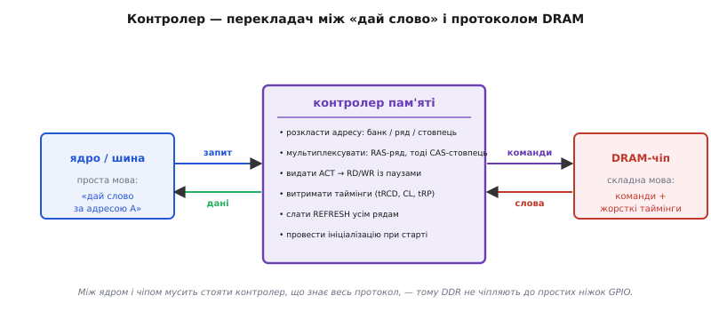
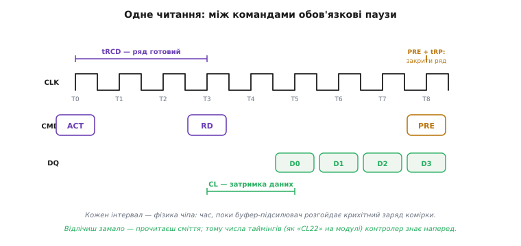
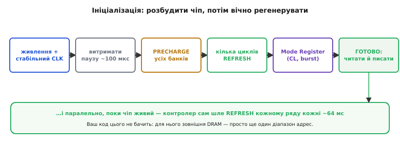

# Контролер пам'яті

DRAM — це дешева [комірка, що тече](book:electronics/dram-cell), обвішана [синхронним інтерфейсом, банками й подвійною швидкістю](book:electronics/sdram-ddr). За всю цю продуктивність доводиться платити однією незручністю: такий чіп **складний у спілкуванні**. Він не розуміє простого «дай байт за адресою»; йому треба слати команди (відкрити ряд, читати стовпець, закрити ряд) з **точними паузами** між ними, постійно його **регенерувати** й навіть правильно **розбудити** при ввімкненні. Усю цю роботу бере на себе окремий пристрій — **контролер пам'яті** (англ. *memory controller* — керувач пам'яттю). Його роль пояснює просте, але часте запитання новачка: чому зовнішню DDR не можна просто припаяти до ніжок GPIO й читати, як звичайну Flash.

### Контролер як перекладач

Найкраще уявити контролер як **перекладача** між двома мовами: простою мовою процесора й складною мовою DRAM.


*Ядро говорить просто: «дай слово за адресою A», «запиши слово за адресою B». Контролер перекладає це на мову DRAM: розкладає адресу на банк / ряд / стовпець, мультиплексує її на адресну шину (спершу ряд, тоді стовпець), видає команди ACT (відкрити ряд) → RD/WR із потрібними паузами, витримує таймінги, періодично шле REFRESH усім рядам і проводить початкову ініціалізацію. Назовні, до ядра, — проста шина; усередину, до чіпа, — складний протокол.*

Поділ обов'язків тут чіткий. **Процесор** хоче бачити [пам'ять як рівний масив комірок](book:programming/memory-as-array): назвав адресу — отримав байт. Він не повинен знати ні про ряди й стовпці, ні про таймінги, ні про регенерацію. **Контролер** ховає всю цю кухню: приймає простий запит, розкладає адресу на трійку «банк, ряд, стовпець», видає чіпу потрібну послідовність команд із витриманими паузами, забирає дані з пакета й повертає їх ядру. Для решти системи зовнішня DRAM завдяки контролеру виглядає просто як **ще один діапазон адрес** на [карті пам'яті](book:programming/memory-map) — у нього можна писати й читати тими самими інструкціями. Уся складність замкнена всередині контролера.

Цей поділ — приклад дуже корисної інженерної звички: **сховати складність за простим інтерфейсом**. Та сама звичка стоїть за [memory-mapped I/O](book:programming/memory-mapped-io), де керування залізом виставляють як звичайний запис у пам'ять; тут вона працює так само. Спирається вона на [розклад адреси на банк/ряд/стовпець](book:electronics/dram-cell): одна лінійна адреса, яку дає процесор, насправді кодує **три** координати — який банк, який ряд, який стовпець. Контролер бере, скажімо, адресу 0x60001000 і «нарізає» її біти на ці три поля, бо саме так влаштований чіп (решітка з рядів і стовпців). Програмісту ця нарізка невидима — він мислить рівним простором адрес, а вся геометрія масиву лишається турботою контролера. Завдяки цьому той самий код працює хоч із внутрішньою SRAM, хоч із зовнішньою DDR: різниця лише в тому, що по дорозі до DDR стоїть перекладач.

### Мультиплексування адреси: спершу ряд, тоді стовпець

Є ще одна хитрість, яку контролер мусить узяти на себе, — і саме від неї пішли назви двох головних сигналів. Щоб заощадити виводи чіпа, DRAM **не має** окремих ліній під повну адресу: одна й та сама вузька адресна шина переносить спершу номер ряду, а наступної миті — номер стовпця. Контролер виставляє половини **по черзі** й каже чіпові, що саме зараз на шині, двома стробами: **RAS** (англ. *Row Address Strobe* — строб адреси ряду) фіксує номер ряду, **CAS** (англ. *Column Address Strobe* — строб адреси стовпця) фіксує номер стовпця. Слово «строб» (грец. *strobos* — кружляння, тут — короткий керівний імпульс) означає сигнал, що каже «лови значення з шини **зараз**».

Звідси й порядок дій: спершу контролер кладе на шину адресу ряду й смикає RAS (це й є команда ACT — відкрити ряд), а трохи згодом кладе адресу стовпця й смикає CAS (це команда RD або WR). Та сама пара RAS/CAS лишила слід у назвах таймінгів: пауза між RAS і CAS — це **tRCD** (*RAS-to-CAS delay*), а затримка появи даних після CAS — **CL** (*CAS latency*). Тож коли далі мова піде про «відкрити ряд», «замовити стовпець» і паузи між ними — за цими словами стоїть саме почергове мультиплексування адреси двома стробами.

### Таймінги: чому між командами потрібні паузи

Серце роботи контролера — **таймінги** (англ. *timing parameters* — часові параметри): жорсткі мінімальні паузи між командами, що їх диктує фізика чіпа. Порушити їх не можна — дані спотворяться.


*Одне читання. Команда ACT відкриває ряд, але читати стовпець можна лише через tRCD — час, поки ряд «доїде» в буфер-підсилювач. Команда RD замовляє дані, але вони з'являються на шині не одразу, а через затримку CAS (CL) — кілька тактів. Наприкінці PRE закриває ряд, і перед відкриттям наступного мусить минути tRP. Кожен інтервал — фізика конкретного чіпа.*

Звідки ці паузи? Їх диктує [механіка самої комірки](book:electronics/dram-cell): відкрити ряд (ACT) означає влити заряд комірок у буфер-підсилювач і дати йому **підсилити** слабкі рівні — на це потрібен час **tRCD**. Замовити стовпець (RD) — теж не миттєво: дані з'являться через **затримку CAS** (CL), поки спрацює вся вибірка. А закрити ряд і записати його назад (PRE, від англ. *precharge* — попередній заряд ліній) перед роботою з іншим рядом — це **tRP** (*Row Precharge time*). Ці числа — фундаментальна властивість чіпа; ви бачите їх у маркуванні планок (горезвісне «CL16» чи «CL22»). Контролер мусить **знати** їх і відлічувати кожну паузу до такту. Відлічив замало — прочитав напівготові дані, отримав сміття; відлічив забагато — втратив швидкість. Тому точне дотримання таймінгів — головна щоденна робота контролера.

Чому ці паузи не можна просто «вимкнути» заради швидкості? Бо за ними стоїть фізика, а не домовленість. Буфер-підсилювач ловить з комірки **крихітний** заряд (адже [комірка — це мікроскопічний конденсатор](book:electronics/dram-cell)) і мусить його розгойдати до повноцінного логічного рівня — на це йде реальний час, і поспішиш — прочитаєш половинчастий, ще не визначений рівень, тобто сміття. Так само precharge мусить вернути лінії в чітко відомий вихідний стан, перш ніж відкривати інший ряд, — інакше новий ряд накладеться на «недоприбраний» слід попереднього. Ось чому таймінги — це **мінімуми**, нижче яких опускатися не можна: вони відображають швидкодію конкретного кремнію. Тому, до речі, «розгін» пам'яті — це насамперед обережне зменшення цих пауз до межі, за якою чіп ще встигає; перейдеш межу — і дані почнуть псуватися. Висновок простий: контролер мусить мати **правильні** числа таймінгів саме того чіпа, що до нього під'єднаний.

> 🔧 **Навіщо це.** Числа таймінгів — не абстракція: при налаштуванні системи контролеру треба **згодувати** саме ті значення, що стоять у даташиті вашого чіпа (tRCD, CL, tRP, період регенерації). Помилитесь у них — і пам'ять або працюватиме нестабільно (рідкісні, невідтворювані збої даних), або взагалі не запуститься. Це типова причина, чому самозбірна плата з зовнішньою DRAM «майже працює»: контролер ініціалізувався, але числа трохи не ті.

### Ініціалізація: розбудити чіп, далі — вічна регенерація

Лишилося два обов'язки, що замикають картину: **запустити** чіп при ввімкненні й **регенерувати** його довіку. SDRAM/DDR не готова до роботи одразу після подачі живлення — її треба провести через фіксовану процедуру.


*До першого корисного звернення контролер веде чіп за суворим розкладом: дочекатися стабільного живлення й такту → витримати паузу → закрити всі банки (PRECHARGE) → дати кілька циклів REFRESH → записати Mode Register (там осідають CL, довжина пакета й інші режими) → і лише тоді чіп готовий. А паралельно, поки він живий, контролер вічно шле REFRESH кожному ряду кожні ~64 мс. Вашого коду це не стосується.*

Чому саме регенерація (англ. *refresh* — оновлення) ніколи не спиняється? Бо заряд у комірці **тече** крізь неідеальний транзистор, і за кілька десятків мілісекунд логічний рівень розмиється до невпізнання. Тому контролер мусить устигнути перечитати-й-переписати **кожен** ряд масиву раніше, ніж той забуде свій вміст; для типової DRAM повний обхід усіх рядів укладають у вікно близько 64 мс. Це фонова робота, що йде сама собою, поки процесор зайнятий своїм, — і саме тому її не можна доручити програмному циклу.

**Приклад (що бачить ваш код).** Простежмо, хто що робить, коли програма читає слово із зовнішньої SDRAM.

```
ваш код:     value = *(uint32_t*)0x60001000;   // просто читання за адресою
   │
контролер:   адреса 0x60001000 → банк 2, ряд 0x081, стовпець 0x010
             ACT  банк 2, ряд 0x081      ; виставити ряд на шину, смикнути RAS
             (пауза tRCD)
             RD   банк 2, стовпець 0x010  ; виставити стовпець, смикнути CAS
             (пауза CL)
             ← чіп віддає пакет слів; беремо потрібне
   │
ваш код:     отримав value — і не здогадується про ACT/RD/CL/REFRESH
```

Висновок прикладу: для програми зовнішня DRAM **невідрізнима** від звичайної пам'яті — те саме читання за адресою. Уся послідовність команд, паузи й фонова регенерація сховані в контролері; програміст їх не пише й зазвичай навіть не бачить (хіба що один раз **налаштовує** контролер таймінгами свого чіпа при старті системи).

### Де живе контролер — і чому це межа для дрібних чипів

Лишилося пояснити, чому ж DDR таки не припаяти просто до ніжок GPIO. Тепер відповідь очевидна. Розклад адреси, почергове мультиплексування ряду й стовпця, послідовність команд із наносекундними паузами, ініціалізація, безперервна регенерація — це **спеціалізована логіка**, яку фізично втілюють у залізі. Її не зімітуєш, смикаючи звичайні виводи з програми: GPIO керують надто повільно й непередбачувано, щоб витримати таймінги, а регенерувати масив у фоні, поки процесор робить інше, програмний цикл просто не встигне. Тому контролер пам'яті роблять **апаратним блоком** — або всередині процесора (його вбудовують у [систему-на-кристалі](book:electronics/sdram-ddr) поруч із ядром), або окремою мікросхемою поряд.

З цього випливає практична межа, яку варто знати наперед. Зовнішню DRAM можна підключити **лише** до тих процесорів і мікроконтролерів, у яких такий контролер **уже є** на кристалі. Потужніші чипи (ті, що тягнуть екрани, відео, повноцінні операційні системи) контролер DRAM мають; дрібні економні мікроконтролери — здебільшого ні, бо такий блок коштує площі й енергії, а їхнім задачам вистачає внутрішньої SRAM. Тому, плануючи пристрій із великою робочою пам'яттю, дивляться не лише на саму планку DRAM, а насамперед на те, чи має обраний процесор **інтерфейс зовнішньої пам'яті**. Немає контролера — немає й зовнішньої DRAM, хоч би скільки чіпів ви приставили.

> 🔧 **Навіщо це.** Контролер пам'яті задає кілька практичних меж розробки. Перше: **DDR не підключиш до GPIO** — між чіпом і ядром обов'язково мусить стояти контролер, що знає протокол; тому зовнішню DRAM можна додати лише до тих мікроконтролерів і процесорів, у яких такий блок є на борту. Друге: **регенерація йде фоном завжди**, з'їдаючи частку пропускної здатності та енергії, — це одна з причин, чому зовнішня DRAM невигідна в пристроях на батарейці, що мусять надовго засинати. Третє, заспокійливе: щойно контролер налаштований, у коді ви працюєте із зовнішньою пам'яттю **звичайними** читаннями й записами за адресою — уся складність лишається під капотом.

---

Отже, **контролер пам'яті** — це перекладач між простою мовою ядра («читай/пиши за адресою») і складним протоколом DRAM. Він розкладає адресу на **банк/ряд/стовпець** і мультиплексує її на вузьку шину двома стробами — RAS (ряд) і CAS (стовпець); видає команди (ACT → RD/WR → PRE) з точними **таймінгами** (tRCD — поки ряд дійде в буфер; CL — затримка появи даних після RD; tRP — на закриття ряду), які диктує фізика чіпа й порушити які не можна; проводить **ініціалізацію** при старті (пауза → precharge → кілька refresh → запис Mode Register із CL і довжиною пакета) і **вічно регенерує** масив фоном. Завдяки йому зовнішня DRAM для коду виглядає як звичайний діапазон адрес — і саме тому **немає контролера на кристалі — немає й зовнішньої DRAM**: ось чому її не чіпляють до простих ніжок і чому дрібні мікроконтролери її не підтримують.
