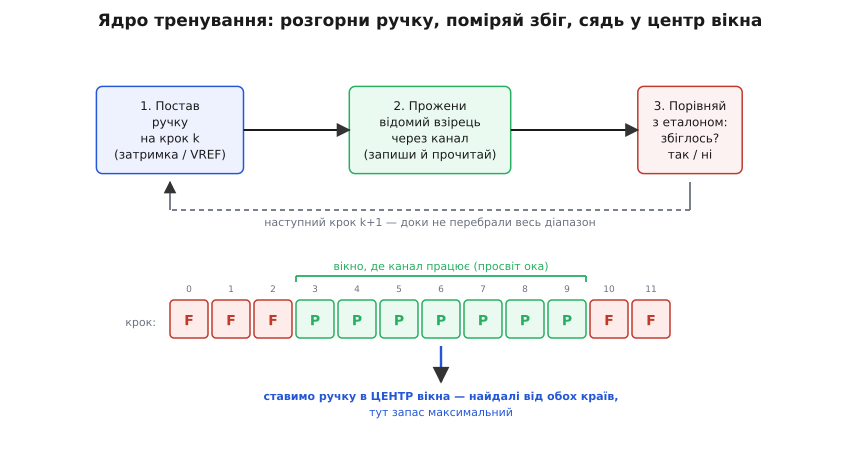
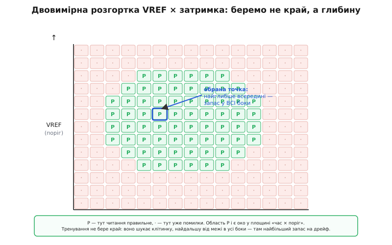

# Калібрування DDR-інтерфейсу: як пам'ять сама знаходить свої числа

Швидка пам'ять DDR ставить перед інженером задачу, яка спершу здається неможливою. Щоб зловити біт, приймач мусить клацнути точно в середину крихітного вікна — а це вікно живе одиниці наносекунд і стоїть на лінії не там, де намальовано в даташиті, а зсунуте затримкою конкретної доріжки, конкретного корпусу, конкретної температури плати саме зараз. Питання просте й жорстоке: **на скільки саме наносекунд зсунути строб на цій лінії?** І відповідь неможливо взяти з паперу.

Причина — фізична. Дві однакові з вигляду плати розведені трохи по-різному: одна доріжка на пів міліметра довша, інша йде повз перехідний отвір, кристал DRAM з іншої партії має інший розкид. Кожна така дрібниця додає свою затримку в частки наносекунди, а на частотах у сотні мегагерц і вище ці частки — уже помітна частка бітового вікна. Порахувати їх наперед не можна: треба **виміряти реальний тракт після ввімкнення**. Саме це вимірювання — з подальшим підстроюванням затримок і порогів під конкретну плату — і зветься **калібруванням** DDR-інтерфейсу, або **тренуванням** (англ. *training*, навчання). Без нього швидка шина просто не заведеться, скільки правильних дротів не розведи.

Найцікавіше тут не залізо, а **спосіб думання**. Тренування — це не аналогова магія й не хитра електроніка сама по собі. Це **алгоритм пошуку**, що працює над числами. Канал — суцільна аналогова невідомість, але ми перетворюємо його на потік дискретних вимірів «спрацювало / не спрацювало», а тоді проганяємо над цими вимірами звичайну логіку перебору, доки не знайдемо найкращі значення. Розберімо, **навіщо** без цього не обійтися, **як** невідомий аналоговий тракт перетворюють на задачу пошуку по цілочисловій осі й **чому** відповідь завжди — центр, а не край.

Це стосується самого фізичного перетворення бітів; сам вузол, що його виконує, — [DDR PHY](topic:electronics/ddr-phy) — має власну статтю. Коротко: PHY сидить між [контролером пам'яті](topic:electronics/memory-controller) і чіпом DRAM, віддає дані з окремим стробом-міткою DQS, зсуває цей строб на чверть періоду, щоб фронт падав у середину біта, і має на кожній лінії керовану лінію затримки. Тренування — це логіка, що цими затримками керує: вона й вирішує, який код затримки виставити.

### Головний трюк: перетворити аналоговий канал на «так/ні»

Почнімо з перешкоди. Лінія DDR — це аналоговий світ: напруга плавно наростає й спадає, фронт має скінченну крутість, сигнал брудниться відбиттями й завадами. Пряма спроба «виміряти затримку осцилографом» усередині чіпа неможлива — там немає осцилографа, там є лише цифрова логіка, що вміє одне: **записати число й прочитати число назад**. Як із цього скромного вміння дістати точну затримку?

Хитрість, на якій стоїть усе тренування, — **зробити канал вимірювальним приладом самого себе**. Запишімо в пам'ять (або в спеціальний регістр усередині чіпа) **наперед відомий взірець** бітів — скажімо, `10101010`. Тепер прочитаймо його назад **при якомусь конкретному значенні затримки строба**. Логіка порівнює прочитане з тим, що записала: збіглося чи ні? Це одна-єдина дискретна відповідь — **так** або **ні**. Аналоговий тракт, який ми не могли зміряти напряму, щойно віддав нам один біт інформації про себе: за цієї затримки канал працює чи вже сипле помилки.

А далі — сама ідея. Змінімо затримку на один крок і повторімо. І ще на крок. І ще, аж до кінця діапазону. Кожен крок дає своє «так/ні». Що ми отримали? **Карту** дискретної осі затримки, розмічену на зони «працює» і «не працює». Ми ніколи не міряли наносекунди — ми лише багато разів питали канал «так чи ні» на сітці значень. Неперервна аналогова невідомість перетворилася на дискретний масив, який можна перебрати простою логікою. Це той самий фокус, яким уся цифрова обробка бере неперервний сигнал, дискретизує його й далі працює вже з числами: тренування дискретизує не сигнал у часі, а **параметр** (затримку, поріг) — і після того канал стає об'єктом звичайного алгоритму.

> 🔧 **Навіщо це.** Ось чому DDR не можна «просто підключити й читати»: у чіпі немає жодного способу дізнатися правильну затримку, крім як **виміряти її дискретною розгорткою**. Розробникові вбудованої системи це диктує обов'язок: контролер (його PHY) мусить після ввімкнення прогнати повний цикл записів-читань відомих взірців і по відповідях знайти всі затримки й пороги. Пропустиш цей цикл — шина не запрацює взагалі, бо строб клацатиме навмання. Тренування не опція, а частина ввімкнення живлення.

### Універсальна форма: розгортка → вікно → центр

Розмітивши вісь на «працює / не працює», що з нею робити? Тут з'являється візерунок, який повторюється в кожному кроці тренування — і варто побачити його **один раз**, бо далі все буде його різновидом.

Уявімо результат розгортки як рядок: для кожного значення затримки — `P` (pass, спрацювало) або `F` (fail, помилка). Виглядає він так:

```
крок:   0  1  2  3  4  5  6  7  8  9  10 11
                   ┌─────── вікно ───────┐
        F  F  F  P  P  P  P  P  P  P  F  F
```

Зони не розкидані випадково. Помилки скупчуються з країв, а посередині лежить суцільна смуга `P` — **вікно**, у якому канал надійно працює. І це не випадковість: та смуга `P` — то є [око](topic:electronics/eye-diagram) сигналу, побачене з іншого боку. Око — це просвіт стабільності, де дані певні; коли строб падає в цей просвіт, читання правильне (`P`), а щойно він з'їжджає на край ока, де дані перемикаються, — читання ламається (`F`). Розгортка затримки просто **обмацує** око зсередини, крок за кроком.


*Тренування як алгоритм. Угорі — петля вимірювання: постав ручку (затримку чи поріг) на крок k, прожени крізь канал відомий взірець, порівняй прочитане з еталоном — вийде одне «так/ні»; повтори для всіх кроків. Унизу — карта відповідей: суцільна смуга P посередині — це просвіт ока, а зони F по краях — де строб уже промахується. Правильна відповідь не край смуги, а її ЦЕНТР: там до обох країв найдальше, тож запас на дрейф найбільший.*

Тепер — ключове рішення, і воно однакове завжди. Куди поставити затримку? **Не** на край вікна: край — це межа, за якою вже помилки, і найменший дрейф (нагрілася плата, просіла напруга) виштовхне робочу точку за неї. Правильна відповідь — **центр** вікна, рівно посередині між лівим і правим краєм `P`. Там до обох країв найдальше, тож запас на будь-який дрейф найбільший. Уся мета тренування зводиться до цієї фрази: **знайти вікно й сісти в його середину**.

Виходить, кожен крок тренування — це той самий алгоритм із трьох дій:
1. **Розгорни** ручку (затримку чи поріг) по всьому діапазону, для кожного значення діставши «так/ні».
2. **Знайди вікно** — суцільну смугу «так».
3. **Постав** ручку в центр вікна.

Різні кроки тренування відрізняються лише тим, **яку** ручку крутять і **як** улаштоване «так/ні». Побачивши цей кістяк, решту вже легко читати як його варіації. Готовий код такого пошуку — з обробкою кількох вікон і країв діапазону — винесено в [окрему вставку про алгоритм центрування](topic:electronics/memory-training/proj-training-search.md).

### Коли ручка одна й відповідь монотонна: вирівнювання запису

Найпростіший різновид трапляється там, де ми шукаємо не широке вікно, а **єдину точку переходу**. Класичний приклад — **вирівнювання запису** (англ. *write leveling*): строб DQS, який PHY посилає під час запису, має прийти до чіпа вирівняним із загальним тактом CK, але розводка плати їх розсуває, і треба знайти, на скільки затримати строб, щоб фронти зійшлися.

Тут блискуче те, що **сам чіп** служить вимірювачем. Контролер командою переводить DRAM у режим вирівнювання запису (у DDR4 це біт 7 регістра режиму MR1). У цьому режимі чіп робить дивну, але дуже корисну річ: щоразу, коли на його вхід приходить фронт строба DQS, він **защіпає поточний рівень такту CK** і **віддає** цей рівень назад на лінію даних DQ. Строб питає — чіп відповідає одним бітом: «у мить твого фронту такт був низький (0) чи вже високий (1)».

![Ліворуч — механізм: PHY суне затримку строба, чіп у режимі MR1[7]=1 защіпає рівень такту CK у мить фронту строба й вертає його на DQ; унизу — як зі зростанням затримки момент защіпання повзе по такту й відповідь стрибає 0→1](/book/electronics/digital/memory-training/img/write-level.svg)
*Вирівнювання запису. PHY маленькими кроками збільшує затримку строба DQS; чіп у момент кожного фронту ловить рівень загального такту CK і повертає його на DQ. Поки строб клацає раніше за фронт CK — відповідь 0 (такт іще низький). Щойно строб наздогнав фронт — відповідь стрибає на 1. Ця точка переходу 0→1 і є шукана затримка: тут строб і такт зійшлися. Одна ручка, монотонна відповідь — тож досить знайти саме місце стрибка, навіть бінарним пошуком навпіл.*

Далі — знову розгортка, тільки простіша. PHY крокує затримкою й дивиться на відповідь. Поки вона **0** — строб клацає раніше за фронт CK, треба ще додати. Щойно стала **1** — фронти зійшлися, край знайдено. Тут немає широкого вікна `PPPP` — відповідь **монотонна**: спершу суцільні `0`, потім суцільні `1`, і між ними один-єдиний стрибок. А коли функція монотонна, шукати перебором усіх кроків марнотратно: точку переходу можна знайти **навпіл**, [бінарним пошуком](topic:algorithms/binary-search) — ділити діапазон, дивитися на середину, відкидати половину. Кілька кроків замість десятків. Це показує, що «алгоритм тренування» — не одна жорстка процедура: форма відповіді (вікно чи монотонний перехід) диктує, який метод пошуку тут дешевший.

### Коли ручок дві: центрування читання, запису й VREF

Складніші кроки шукають повноцінне вікно, а часом — вікно у **двох** вимірах одразу. Розгляньмо три, що працюють на тому самому кістяку.

**Захоплення строба читання** (англ. *DQS gate*). Під час читання строб DQS приходить від чіпа лише під час самого пакета даних, а між пакетами лінія «мовчить» і на ній може бути шум. PHY мусить відкривати «ворота» для вхідного строба точно у вікно, коли строб справжній, — інакше він упіймає шум замість фронтів. Тренування розгортає момент відкриття воріт і шукає діапазон, у якому ворота стабільно ловлять справжню передпреамбулу строба. Знову: розгортка ручки (положення воріт) → вікно → центр.

**Центрування читання й запису.** Це серце калібрування даних, і тут зручно використати **відомий взірець із самого чіпа**. У DDR4 є набір спеціальних регістрів **MPR** (англ. *multi-purpose register*, багатоцільовий регістр) — кілька восьмибітних комірок із наперед відомими взірцями. Увімкнувши режим MPR (біт 2 регістра MR3), контролер спрямовує читання не в масив пам'яті, а в ці регістри: тепер він **точно знає**, який байт мусить прийти, тож може порівнювати без попереднього запису. PHY розгортає затримку читання на кожній лінії DQ, для кожного значення дістає «збіглося / ні» і так знаходить **лівий і правий край ока**, а тоді ставить точку захоплення в центр. Для запису логіка дзеркальна — цикл «запиши → прочитай → зсунь → порівняй»: PHY змінює затримку запису, щоразу перечитує назад і шукає діапазон, де дані повертаються цілими, після чого центрує DQ відносно строба.

**Центрування порога VREF.** Досі ми крутили затримку — рухали момент **у часі**. Але надійність залежить і від другої ручки: **де провести межу** між нулем і одиницею **за напругою**. На малих розмахах DDR фіксований поріг не годиться, тож приймач порівнює лінію з опорною напругою **VREF**; вище VREF — одиниця, нижче — нуль. У DDR4 цей поріг теж калібрують (через регістр MR6): PHY розгортає значення VREF і шукає те, за якого око найширше **по вертикалі**.

А тепер — момент, де одновимірна картина стає двовимірною. Око — це просвіт і в часі (по горизонталі), і в напрузі (по вертикалі). Тому насправді ми маємо не рядок, а **площину**: одна вісь — затримка строба, друга — поріг VREF, а в кожній клітинці — «так/ні». Ця карта пасок і провалів має давню назву — **шму-графік** (англ. *shmoo plot*). Назва — жарт інженерів: у коміксі «Li'l Abner» художника Ела Кеппа жила безформна створіночка на ім'я Shmoo, і робоча зона на такому графіку виходила схожою на її розпливчастий силует. Термін прижився ще від випробувань пам'яті на магнітних осердях у 1960-х і перейшов у напівпровідникову еру. Позначено, що це **усталена** термінологія, з підтвердженим походженням.


*Шму-графік: око у площині «час × поріг». По горизонталі PHY зсуває строб у часі, по вертикалі — рухає поріг VREF. Клітинка P означає, що при цій парі значень читання правильне; крапка — що вже помилки. Разом P-клітинки складаються в острів — те саме око, тільки в двох вимірах. Тренування не бере край острова: воно шукає клітинку, найдальшу від межі в усі боки водночас, — там найбільший спільний запас на дрейф і часу, і напруги.*

І кістяк лишається той самий, тільки «центр вікна» стає **найглибшою точкою острова** — клітинкою, найдальшою від межі одразу в усі боки. Розгорнути обидві ручки, знайти зв'язну область «так», сісти в її серце. Одновимірне вирівнювання запису й двовимірний шмо VREF — крайні випадки однієї ідеї.

### Інший рід калібрування: узгодити опір драйвера з еталоном

Не все тренування — про час. Є калібрування зовсім іншого роду, і воно показує, що «дискретизуй та шукай» працює й там, де параметр — не затримка, а **опір**.

На частотах DDR доріжка плати поводиться як лінія передачі: різкий фронт, дійшовши до кінця, **відбивається** назад і псує наступні біти, якщо кінець лінії не погашено правильним опором. Тому і драйвер, що жене сигнал, і термінатор, що його гасить, мусять мати опір, точно [узгоджений](topic:electronics/impedance-matching) із хвильовим опором доріжки — типово близько кількох десятків ом. Але опір транзисторів усередині чіпа гуляє від тих самих чинників, що й затримка: розкид виготовлення, напруга, температура. Виставити його наперед так само неможливо.

Рішення — **калібрування опору за зовнішнім еталоном**, у DDR воно зветься **ZQ-калібруванням** (за назвою ніжки ZQ). До цієї ніжки під'єднують один-єдиний **точний зовнішній резистор** (звичайно 240 Ω із похибкою 1%) — фізичну міру, яка не пливе ні від температури кристала, ні від його напруги. Усередині чіпа драйвер зроблено не суцільним, а **набором паралельних транзисторних «ніжок»**, які можна вмикати по одній; що більше ввімкнено, то менший сумарний опір. І поряд стоїть **компаратор** — схема, що каже лише «більше чи менше». Чіп подає струм через свій набір ніжок і через еталонний резистор, компаратор порівнює напруги — і логіка підкручує кількість увімкнених ніжок, доки внутрішній опір не зрівняється з еталонним 240 Ω. Знайдений код потім переносять на всі виводи DQ, задаючи ним і силу драйвера, і опір термінації.

Придивіться: це знову **пошук по дискретній осі за бінарними відповідями**. Тільки вісь тепер — кількість увімкнених ніжок (тобто опір квантами), а «так/ні» дає компаратор: «завеликий опір» чи «замалий». Логіка може йти від старшого кванта до молодшого, щоразу питаючи компаратор і лишаючи ніжку ввімкненою чи ні, — це **послідовне наближення**, той самий метод, яким [АЦП](topic:electronics/adc) зважує напругу по бітах. Різниця лише в тому, що еталон тут — не внутрішнє опорне джерело, а зовнішній резистор на ніжці. Узагальнений опис цього калібрувального блоку — типова схема, кроки й граблі — винесено в [окрему вставку про ZQ-калібрування опору](topic:electronics/memory-training/comp-zq-calibration.md).

> 🔧 **Навіщо це.** ZQ-калібрування пояснює, чому в схемі DDR біля кожної планки стоїть той самий одинокий точний резистор на 240 Ω, і чому в даташиті вимагають саме 1% похибки: цей резистор — фізичний **еталон**, за яким чіп вивіряє власний опір, тож його неточність прямо переноситься на якість узгодження всієї шини. Поставите звичайний резистор на 5% — і сила драйвера піде туди ж на 5%, відбиття підростуть, око звузиться. Одна дешева, але точна деталь тримає в допуску десятки швидких ліній.

### Числа пливуть: чому калібрування не одноразове

Здавалося б, знайшли всі затримки, поріг і опір під час старту — і живи спокійно. Але тут ховається остання, найважливіша думка. Усі ці числа знайдено **за поточної температури й напруги**. А плата під навантаженням гріється, живлення просідає й стрибає — і те, що годину тому було ідеальним центром ока, повільно з'їжджає до краю. Ті самі чинники, що завадили порахувати числа наперед, нікуди не діваються **під час роботи**.

Тому калібрування — не одноразовий акт на старті, а **процес, який доводиться поновлювати**. Опір драйвера й термінації підтягують коротким повторним ZQ-калібруванням (командою **ZQCS**, від *ZQ calibration short* — коротке ZQ-калібрування), яке чіп проганяє час від часу вже під час роботи, стежачи за дрейфом напруги й температури; повне ж калібрування на старті (**ZQCL**, довге) забирає помітно більше тактів, бо міряє все ретельно з нуля. Затримки й пороги контролер за потреби так само періодично перевіряє й підправляє, вкраплюючи короткі сеанси перетренування між звичайними зверненнями. Пам'ять не «настроїли раз» — її **весь час тримають у фокусі**, як руку на кермі, що безперервно вирівнює машину проти зносу.

> 🔧 **Навіщо це.** Ось звідки береться характерна риса: комп'ютер після вмикання «думає» якусь мить, перш ніж стартувати, а в BIOS буває пункт про memory training. Перший, холодний старт із новою планкою довший — PHY проганяє **повний** пошук усіх затримок і порогів із нуля. Знайдені числа часто зберігають і за наступного ввімкнення лише швидко перевіряють — тому повторний старт швидший за перший. І якщо пам'ять на межі стабільності, збій часто саме звідси: тренування знайшло **вузьке** око, запас малий, і на спеці робоча точка з'їхала за край. Розробникові вбудованої системи це каже, що на калібрування треба закладати і час старту, і періодичне поновлення — інакше система, яка щойно працювала на столі, посиплеться в нагрітому корпусі влітку.

### Чому це водночас логіка й обробка сигналу

Складімо картину. Калібрування DDR-інтерфейсу живе рівно на стику двох світів, і саме цим воно цікаве.

З одного боку — чистий аналог: лінії затримки, керовані драйвери, компаратори, опорні напруги, зовнішній еталонний резистор. З другого — чиста цифрова логіка: скінченний автомат, що жене відомі взірці, збирає бінарні відповіді, розмічає осі на «працює / не працює» й перебирає їх у пошуку центра. Місток між ними — **дискретизація параметра**: невимірний напряму аналоговий тракт логіка перетворює на сітку значень із відповіддю «так/ні» у кожному вузлі, а тоді вже працює з цією сіткою як зі звичайним масивом чисел. Це та сама суть, що й у будь-якій цифровій обробці сигналу: узяти неперервну фізичну величину, перевести її в дискретні відліки й далі керувати нею алгоритмом. Тут дискретизують не сигнал у часі, а простір налаштувань — затримку, поріг, опір, — але прийом і мислення ті самі.

І кожен крок — розгортка ручки, пошук вікна, посадка в центр, узгодження опору за еталоном, періодичне поновлення проти дрейфу — це відповідь на конкретну фізичну ваду, що виникає, щойно біти летять достатньо швидко. Приберіть калібрування — і бездоганно розведена плата з ідеальним протоколом DDR лишиться мертвою: строб клацатиме навмання, опір не зійдеться з доріжкою, відбиття заб'ють око. Пам'ять працює не тому, що хтось раз порахував правильні числа, а тому, що вона **сама щоразу їх знаходить** — вимірюючи власний тракт дискретною розгорткою й сідаючи туди, де запас найбільший.
