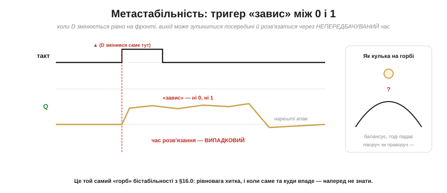
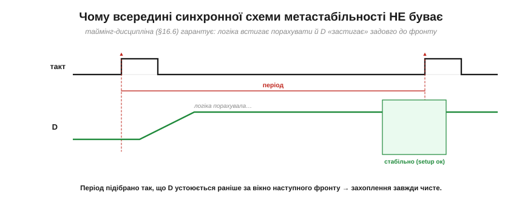
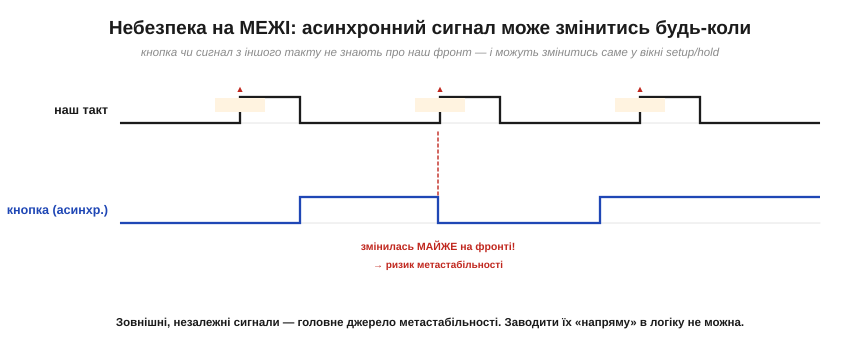
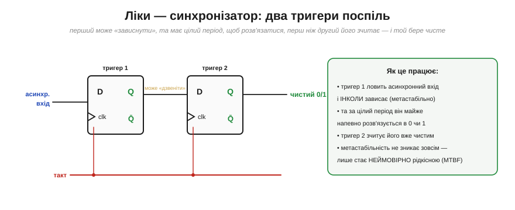

# Метастабільність і таймінг

Легко уявити [тригер](book:electronics/d-flip-flop) ідеальним: прийшов фронт — захопив D, та й по всьому. Та в нього є **умова**, яку мовчки порушувати не можна. Тригер захоплює дані чисто, **лише якщо** вхід D був стабільним у певне коротке вікно навколо фронту. А якщо D зміниться **рівно** в цю мить — тригер може **зависнути** в дивному, «ні 0 ні 1» стані. Це **метастабільність** — найтонша й найпідступніша річ у цифровій техніці. Тут немає нових схем — є глибше розуміння бістабільної петлі, на якій стоїть уся послідовнісна логіка.

### Setup і hold: вікно навколо фронту

Тригер усередині — це петля зі скінченними затримками ([📜 історія розділу](book:electronics/state-memory/hist-flip-flop.md)). Щоб вона надійно «защепнула» нове значення, вхід D має **застигнути** на коротку мить **перед** фронтом і ще трохи **після** нього.

*Рис. Тригерові потрібно, щоб D був стабільним протягом часу **setup** (*t_su*) **перед** фронтом і часу **hold** (*t_h*) **після** нього — це маленьке «заборонене вікно» довкола фронту. Якщо D змінився **завчасно** (зеленим) і у вікні стоїть незмінно — захоплення чисте. А от якщо D зміниться **саме у вікні**, тригер може не встигнути визначитися.*

Це не примха конкретного чипа, а наслідок фізики: внутрішня петля тригера має час відреагувати, і поки вона «вирішує», вхід смикати не можна. У даташиті будь-якого тригера ці t_su і t_h — серед перших параметрів. Порушити їх — означає напроситися на біду.

### Метастабільність: тригер «завис»

А біда така. Якщо D змінюється рівно на фронті, внутрішня бістабільна петля дістає **рівно посередині** поштовх — і може зависнути в **метастабільному** стані: вихід застигає десь між 0 і 1, ні те ні се.

*Рис. Коли D змінився саме на фронті, вихід Q може **зупинитися посередині** — ні 0, ні 1 — і «дзвеніти» там невизначений час, перш ніж нарешті впасти в один зі станів. Найгірше — що **час** цього розв'язання **випадковий**: інколи наносекунди, інколи довше. Це той самий «горб» бістабільної петлі: кулька, поставлена точно на вершину, балансує, а тоді падає ліворуч чи праворуч — і коли саме та куди, наперед не вгадати.*

Осягніть, наскільки це підступно. Тригер не просто видає неправильне значення — він видає **невизначене**, ще й на невідомий час. Наступна логіка, що очікує чистий 0 чи 1, бачить «щось посередині» й може зробити з ним казна-що. І, що найгірше, метастабільність **неможливо повністю усунути** — це фундаментальна властивість будь-якої бістабільної схеми. Її можна лише зробити вкрай **малоймовірною**. Як? Спершу зрозуміймо, де вона взагалі загрожує.

### Усередині синхронної схеми — безпечно, якщо таймінг дотримано

Хороша новина: **всередині** синхронної схеми, де **дотримано таймінг** (setup/hold кожного тригера), метастабільність практично **не виникає**. І це не везіння, а саме те, заради чого існує вся [таймінг-дисципліна спільного такту](book:electronics/clock-signal).

*Рис. [Період такту](book:electronics/clock-signal) підбирають так, щоб комбінаційна логіка **встигла** порахувати наступні значення й D **застиг** задовго до наступного фронту. А якщо D стабільний задовго до фронту — вікно setup/hold автоматично дотримано, і захоплення завжди чисте. Тобто синхронний дизайн **за побудовою** гарантує, що дані не змінюються на фронті.*

Ось чому вся цифрова техніка така одержима **спільним тактом** і **критичним шляхом**: дотримуючи їх, ми гарантуємо, що в кожній точці схеми дані «застигають» вчасно й жоден тригер не ловить зміну на фронті. Метастабільність усередині синхронного домену практично **не виникає** — бо, дотримуючи таймінг, ми навмисно не даємо D мінятися в небезпечну мить. Уся синхронна методологія — це, по суті, спосіб уникнути метастабільності за рахунок дисципліни.

### Небезпека на межі: асинхронні входи

То де ж тоді ховається загроза? На **межі** — там, де в нашу синхронну схему заходить сигнал, що **не знає** про наш такт.

*Рис. Натискання **кнопки**, сигнал з **іншого** пристрою чи з іншого тактового домену — усе це **асинхронні** входи: вони змінюються **коли заманеться**, не звіряючись із нашим фронтом. Рано чи пізно такий сигнал зміниться **майже точно** на фронті — і потрапить у вікно setup/hold, наразивши тригер на метастабільність. Заводити зовнішній сигнал «напряму» в синхронну логіку **не можна**.*

Це фундаментальна точка: щойно цифрова система мусить «поспілкуватися» із зовнішнім світом — кнопкою, давачем, іншим чипом, — вона стикається з сигналами, яким байдуже до її ритму. І саме на цих стиках криється майже вся реальна метастабільність. На щастя, є просте й елегантне ліки.

### Ліки: синхронізатор із двох тригерів

Класичний захист — **синхронізатор**: пропустити асинхронний сигнал крізь **два** тригери поспіль, перш ніж віддавати його логіці.

*Рис. Асинхронний вхід заводять у **перший** тригер. Той інколи зависає метастабільно — але має **цілий період такту**, щоб розв'язатися в чистий 0 чи 1, перш ніж його зчитає **другий** тригер. Тож другий тригер майже завжди бачить уже **визначене** значення й передає його логіці чистим. Метастабільність не зникає зовсім — вона стає **неймовірно рідкісною** (її міряють середнім часом між збоями, MTBF). Для двох тригерів за помірних частот MTBF сягає років чи століть — але це **не константа**: він залежить від частоти, запасу часу (*slack*), технології, температури й напруги, тож за жорсткіших умов (висока частота, малий slack) додають третій тригер чи більше.*

Краса цього рішення в тому, що воно не **бореться** з метастабільністю (її не подолати), а дає їй **час розсмоктатися**. Перший тригер бере на себе удар, цілий такт «приходить до тями», і другий уже не бачить хаосу. Імовірність, що метастабільність протримається довше за період і прослизне далі, мізерна — і її роблять як завгодно малою, додаючи ще тригери. Це стандартний прийом, який ви побачите на кожному вході, що приймає зовнішній сигнал. Одне важливе «але»: два тригери синхронізують **один біт**. Ціле **багатобітне** число через межу тактових доменів так не передаси — окремі біти можуть «приїхати» в різні такти й дати безглузде проміжне значення. Для цього потрібен належний протокол переходу між доменами (*CDC, clock-domain crossing*): **рукостискання**, черга **FIFO** або код **Грея** (де між сусідніми значеннями міняється лише один біт).

> 🔧 **Навіщо це.** Метастабільність — це «привид», який ви рідко бачите, але мусите знати, бо він пояснює цілий клас рідкісних, невідтворюваних багів. Винесіть головне. Перше: тригер потребує, щоб дані були стабільні у вікні **setup/hold** довкола фронту; порушите — ризикуєте «зависанням». Друге: **усередині** синхронної схеми це не загрожує, бо [таймінг-дисципліна спільного такту](book:electronics/clock-signal) сама гарантує стабільність, — ось іще одна причина, чому все проєктують синхронно. Третє, найпрактичніше: **будь-який зовнішній, асинхронний сигнал** — кнопку, сигнал з іншого чипа — треба заводити в логіку **через синхронізатор** (два тригери), а не напряму; інакше колись-таки спіймаєте метастабільність. Читаючи зовнішні сигнали в мікроконтролер, пам'ятайте про це: [дребезг кнопки](book:electronics/contact-debounce) і синхронізація — дві сторони однієї обережності зі світом, що не знає вашого такту.