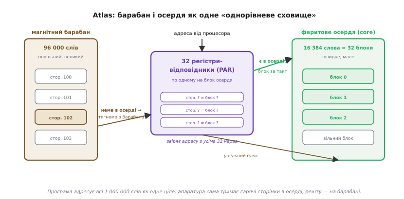

# 📜 Atlas і «однорівневе сховище»

Сьогодні MMU здається чимось природним, майже невидимим: вставили між ядром і пам'яттю апаратний перекладач адрес — і програма живе у своєму рівному просторі, не знаючи, де насправді лежать її байти. Але хтось же мусив уперше здогадатися, що адресу взагалі можна підмінювати на льоту. І, що важче, — мусив уперше зважитися віддати залізу рішення, яке доти завжди ухвалював програміст руками: **яку частину даних тримати у швидкій пам'яті, а яку — у повільній**. Обидва кроки зробила одна машина: британський **Atlas**, збудований у Манчестерському університеті й офіційно введений в дію 7 грудня 1962 року. Це усталений факт, підтверджений і музейними записами, і фаховими джерелами. Варто зрозуміти, що саме там придумали, — бо в тому пристрої вже сидить майже вся логіка сьогоднішнього MMU й TLB, тільки з барабаном замість диска й на лампах замість транзисторів.

## Що бентежило до Atlas: два сорти пам'яті й ручне жонглювання

Щоб відчути винахід, треба відчути біль, який він знімав. На межі 1950-х і 1960-х у великій обчислювальній машині співіснували два геть різні сорти пам'яті, і різниця між ними була кричуща.

Швидка пам'ять — **феритове осердя** (англ. *core store*, від феритових кілець-осердь, крізь які просилювали дроти) — була блискавичною для свого часу, але страшенно дорогою й тому крихітною. На Atlas її було лише **16 384 слова** (тобто 16К; слово Atlas — 48 бітів). Повільна пам'ять — **магнітний барабан** (англ. *drum*, обертовий циліндр із магнітним покриттям) — вміщала багато, аж **96 000 слів**, але кожне звернення до неї означало чекати, поки потрібне місце під'їде під голівку. Різниця в швидкодії між осердям і барабаном — десь два порядки.

Наслідок був жорстокий. Дані задачі майже ніколи не влазили в осердя цілком. Отже, програміст мусив **сам** розкраювати свою програму на шматки, сам вирішувати, який шматок зараз тримати в осерді, а який відкласти на барабан, і сам вписувати в код команди «а тепер перекинь оцей блок з барабана в осердя, а той — назад». Ця марудна ручна робота звалася **накладанням** (англ. *overlay*, бо шматки коду накладалися на ту саму ділянку осердя по черзі). Вона з'їдала колосальну частку зусиль: за оцінками того часу, значна доля роботи над великою програмою йшла не на саму задачу, а на оце жонглювання пам'яттю. Помилився в розкрої — програма або гальмує, або взагалі псує собі дані. І, найгірше, весь цей клопіт треба було переробляти щоразу, коли машину міняли на іншу з іншим розміром осердя.

> 🔧 **Навіщо це.** Тут корінь усього MMU. Проблема Atlas — «швидкої пам'яті мало, повільної багато, і хтось має вирішувати, що де тримати» — нікуди не поділася: сьогодні це осердя проти DRAM, DRAM проти SSD, кеш проти оперативки. Змінилися лише носії. Ідея, що це рішення має брати на себе **машина, а не людина**, народилася саме тут — і вся апаратна підтримка віртуальної пам'яті виросла з бажання прибрати ручне накладання.

## Хто це робив: команда Кілбурна в Манчестері

За Atlas стояла манчестерська школа, що на той час уже мала за плечима світовий пріоритет — «Baby» (Small-Scale Experimental Machine), перший у світі комп'ютер зі збереженою в пам'яті програмою, запущений 1948 року.

Провід над Atlas тримав **Том Кілбурн** (Tom Kilburn, 1921–2001) — британський інженер родом із Дьюзбері у Йоркширі, випускник Кембриджа з математики. Під час війни він потрапив до радарної групи **Фредеріка Вільямса** (Frederic Williams) і разом із ним створив «трубку Вільямса» — першу робочу електронну пам'ять на електронно-променевих трубках, а тоді й саму «Baby». Тобто до Atlas Кілбурн підійшов людиною, яка вже одного разу винайшла новий вид пам'яті; не дивно, що й наступний його великий крок стосувався саме пам'яті.

Апаратну частину «однорівневого сховища» описала й побудувала чотірка з Манчестера: **Том Кілбурн**, **Девід Едвардс** (David B. G. Edwards), **Майкл Ланіган** (Michael J. Lanigan) і **Френк Самнер** (Frank H. Sumner) — саме їхні прізвища стоять під основоположною статтею «One-Level Storage System» 1962 року. Складну програмну частину — операційну систему, яку тут звали **Наглядачем** (англ. *Supervisor*), — тягла інша команда: Кілбурн, **Брюс Пейн** (R. Bruce Payne) і, як рушій усієї цієї праці, **Девід Говарт** (David J. Howarth); з боку промислового партнера долучався **Майк Вілд** (Mike Wyld). Сам Atlas будували спільно університет, фірма **Ferranti** й компанія **Plessey**; гроші — грант Національної корпорації розвитку досліджень (NRDC) на 300 000 фунтів, наданий 1959 року. Машину офіційно ввів у дію сер **Джон Кокрофт** (John Cockcroft), директор британського атомного відомства, — усе це задокументовані факти.

Тут варто чесно розрізнити три речі, які легко злити в одну гучну фразу «Atlas винайшов віртуальну пам'ять». **Ідея** непрямої адреси — що число, яке називає програма, не мусить бути номером фізичної комірки — витала й раніше. **Робочу апаратну реалізацію**, де перехоплення адрес і автоматичне підкачування працюють без участі програміста, уперше зробили саме на Atlas — це його справжня, незаперечна першість. А **пізніше поширення** й саму назву дала вже інша сторона: термін *virtual memory* (віртуальна пам'ять) увів у вжиток IBM за кілька років по тому; манчестерці свій винахід називали інакше — **«однорівневе сховище»** (англ. *one-level store*). Тож коли кажуть «перша віртуальна пам'ять», ідеться саме про реалізацію на Atlas, а не про те, що слово вигадали там.

## Головна ідея: одне сховище замість двох

Назва «однорівневе сховище» — це вже половина винаходу, вкладена в два слова. Доти пам'ять була **дворівневою**: рівень швидкого осердя й рівень повільного барабана, і межу між ними програміст мусив бачити й обслуговувати власноруч. Манчестерці поставили зухвале питання: а що, якщо цю межу **сховати** — зробити так, щоб для програми пам'ять виглядала одним суцільним рівнем, одним великим простором, а вже машина сама, непомітно, тримала гарячі шматки в осерді, а решту — на барабані?

Тобто програміст мав би адресувати **весь** великий простір — усі приблизно мільйон слів — так, ніби це одна однорідна пам'ять, і взагалі не думати, що фізично там і крихітне осердя, і барабан. Куди який шматок покласти й коли його перекинути — клопіт машини, не людини.

Це саме той уявний, зручний простір, у якому й досі живе кожна програма під керуванням MMU: рівний, суцільний, «наче вся пам'ять світу моя». Різниця лише в тому, що на Atlas за лаштунками був барабан, а сьогодні — диск чи SSD; принцип той самий.

*Програма Atlas адресувала весь простір як одне ціле; апаратура сама тримала потрібні сторінки в осерді, решту лишала на барабані, а 32 регістри-відповідники за один крок казали, чи потрібна сторінка вже в осерді.*

Щоб цю ілюзію побудувати, простір порізали на рівні шматки — **сторінки** (англ. *page*). Розмір сторінки на Atlas — **512 слів**. Осердя так само поділили на блоки того самого розміру: 16 384 ÷ 512 = рівно **32 блоки**. Тепер задача перекладу зводилася до простого: для кожної сторінки знати, чи лежить вона зараз у якомусь із 32 блоків осердя, і якщо так — у якому саме. Це рівно та сама «сторінка → кадр», яку робить нинішній MMU; на Atlas «кадр» звався блоком осердя.

## Регістри-відповідники: як залізо за такт казало «сторінка тут»

Ось де починається справжня апаратна кмітливість. Постає питання: коли процесор називає адресу, як **швидко** дізнатися, чи потрібна сторінка вже в осерді, і в якому блоці? Шукати по черзі — повільно; тримати величезну таблицю на кожну можливу сторінку — нема де. Манчестерці знайшли елегантний хід: раз блоків осердя лише 32, то й запитань про них рівно 32 — «що зараз лежить у кожному блоці». Отже, вистачить **32 апаратних регістри**, по одному на кожен блок осердя. У кожному регістрі — номер тієї віртуальної сторінки, яка зараз мешкає у відповідному блоці. Ці 32 регістри й звалися **регістрами адрес сторінок** (англ. *Page Address Registers*, PAR).

Але головний фокус не в тому, що їх 32, а в тому, **як** їх опитували. Коли процесор виставляв адресу, апаратура брала з неї номер сторінки й порівнювала його **з усіма 32 регістрами одночасно, за один крок** — не перебирала їх по одному, а звіряла паралельно. Той регістр, що збігся, піднімав свій сигнал у «1», решта лишалися в «0», і за номером цього регістра машина одразу знала потрібний блок осердя. Пам'ять, до якої звертаються не за адресою, а за **вмістом** («у кого з вас записано номер 102?»), зветься **асоціативною** (англ. *content-addressable* — адресована за вмістом). Оці 32 асоціативні регістри-відповідники Atlas — прямий, документально визнаний **прабатько сьогоднішнього TLB**: сучасний буфер швидкого перекладу робить рівно те саме, тільки записів у ньому більше й вони кешують довільні пари «сторінка → кадр», а не описують кожен блок фізичної пам'яті поспіль.

> 🔧 **Навіщо це.** Це відповідь на питання, чому переклад адрес узагалі можна зробити швидким. Наївно здається, що на кожне звернення треба «сходити в таблицю» — а це саме по собі звернення до пам'яті. Хитрість Atlas: тримати відповідність не в повільній пам'яті, а в жменьці апаратних регістрів, і питати їх **усі нараз**. Саме тому в нинішньому [MMU](book:electronics/mmu) поруч із ядром сидить крихітна асоціативна пам'ять — TLB, — і саме тому влучення в неї коштує один такт, а не похід у DRAM. Механізм не змінився з 1962 року, змінився масштаб.

## Сторінки за викликом: коли сторінки в осерді нема

А що, коли жоден із 32 регістрів не збігся? Це означає рівно одне: потрібної сторінки в осерді немає — вона десь на барабані. Atlas тлумачив це як особливу подію — **«незбіг»** (англ. *non-equivalence*): апаратура не знайшла відповідника, отже сама продовжити не може й мусить кликати на поміч Наглядача. Порівняй із нинішнім MMU: там ця сама подія зветься **збоєм сторінки** (англ. *page fault*), і механізм ідентичний — апаратура зупиняється й передає керування операційній системі.

Далі Наглядач робив те, що сьогодні робить ядро операційної системи при page fault. Він знаходив у осерді вільний (чи звільнюваний) блок, запускав перекидання потрібної сторінки з барабана в цей блок, правив відповідний регістр-відповідник, щоб той тепер указував на свіжу сторінку, — і повертав керування перерваній програмі, ніби нічого не сталося. Програма навіть не здогадувалася про паузу: для неї сторінка просто «була».

Оце автоматичне «сам помітив, що сторінки нема, сам підтягнув її з повільного сховища й поновив роботу» і є **підкачування за викликом** (англ. *demand paging* — підкачування на вимогу): сторінку тягнуть у швидку пам'ять не наперед, а рівно тоді, коли до неї вперше звернулися. Atlas зробив це апаратно й непомітно вперше — і саме звідси тягнеться нитка до сьогоднішньої [віртуальної пам'яті](book:programming/virtual-memory), де сторінки так само дрімають на диску, поки їх не торкнуться.

## «Навчальна програма»: перший алгоритм витіснення

Лишалося найтонше, і саме тут Atlas зробив крок, яким автори пишалися чи не найбільше. Коли треба підтягнути нову сторінку, а всі 32 блоки осердя зайняті, доводиться **якусь стару сторінку виселити** назад на барабан, щоб звільнити місце. Питання: **яку**? Виженеш ту, що от-от знадобиться знову, — і за мить її доведеться тягнути назад, машина загрузне в безкінечному перекачуванні. Це задача **витіснення** (англ. *page replacement*), і вона й досі жива в кожній операційній системі.

Atlas не вгадував навмання. У нього була **навчальна програма** (англ. *learning program*) — так її й назвали автори. Ідея: машина **спостерігає за власною поведінкою**, щоб передбачити майбутнє з минулого. При кожному регістрі-відповіднику був біт-ознака (англ. *use digit*), який ставився щоразу, коли до відповідної сторінки зверталися. Наглядач періодично — приблизно раз на 1024 інструкції — знімав ці ознаки, накопичував картину того, які сторінки використовуються часто, а які давно ніхто не чіпав, і на цій підставі обирав жертву: виселяв ту, що, судячи зі спостережень, потрібна найменше.

Це вже не примітивне правило — це справжня спроба **вивчити зразок доступу програми та вгадати, що їй знадобиться далі**. Сам термін «learning program» і те, що машина будувала передбачення зі своєї ж статистики, роблять цей алгоритм дивовижно сучасним: нинішні політики витіснення в кешах і операційних системах (як-от наближення до «найдавніше не використаної» сторінки) — прямі спадкоємці цієї манчестерської ідеї 1962 року. Розрізнення тут таке саме, як і всюди в цій історії: **ідею** передбачати майбутнє з минулого мали й теоретики, а от **робочий апаратно-програмний механізм**, що збирав статистику доступів і сам ухвалював рішення на живій машині, уперше поїхав саме на Atlas.

> 🔧 **Навіщо це.** Це той самий клопіт, що й у сьогоднішнього ядра: пам'яті менше, ніж хочеться, тож хтось має вирішувати, кого виселити. Atlas показав, що це рішення можна не зашивати намертво, а **вивчати з поведінки самої програми** — і саме тому нинішні алгоритми витіснення дивляться на «давність останнього доступу» й «частоту використання». Корінь ідеї «спостерігай за доступами, щоб угадати, що викинути» — тут.

## Що з цього лишилося: майже все

Якщо скласти шматки докупи, стає видно, що на Atlas у 1962-му вже працювала чи не вся сьогоднішня схема віртуальної пам'яті — просто на барабані й лампах. Сторінки фіксованого розміру. Апаратний переклад «сторінка → блок» через асоціативний стос регістрів — прабатько TLB. Особлива подія при відсутності сторінки — прабатько page fault. Автоматичне підкачування з повільного сховища — demand paging. І навіть розумний вибір, кого виселити, на основі спостережень — прабатько алгоритмів витіснення.

Головне, що зробив Atlas, — переніс тягар керування пам'яттю **з голови програміста в залізо й операційну систему**. Це та сама межа, яку сьогодні тримає [MMU](book:electronics/mmu): програма живе у своєму рівному просторі й не знає, що частина її сторінок насправді на диску, а переклад адрес роблять апаратні регістри поруч із ядром. Змінилися носії — осердя стало DRAM, барабан став SSD, 32 регістри стали ширшим TLB. Не змінилася ідея, і в цьому вся сила винаходу: манчестерська команда вгадала не конкретну реалізацію, а **правильний спосіб думати про пам'ять** — як про один рівень, за яким машина сама доглядає. Тому історія MMU починається не з дати першого мікропроцесора з таблицями сторінок, а з грудня 1962 року, коли в Манчестері вперше ввімкнули машину, що ховала межу між швидкою й повільною пам'яттю сама.
