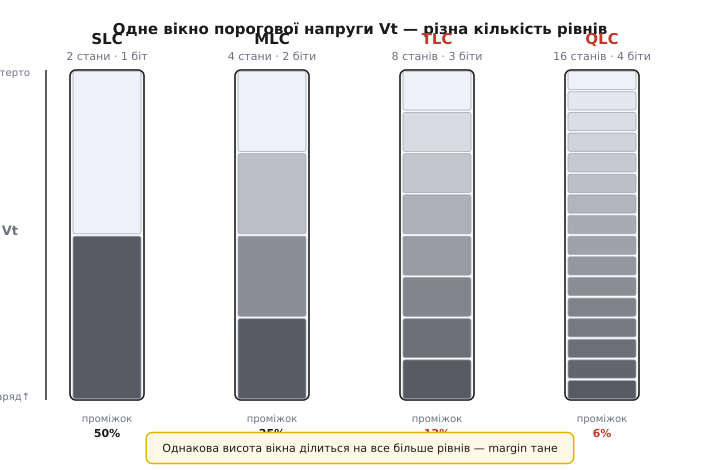
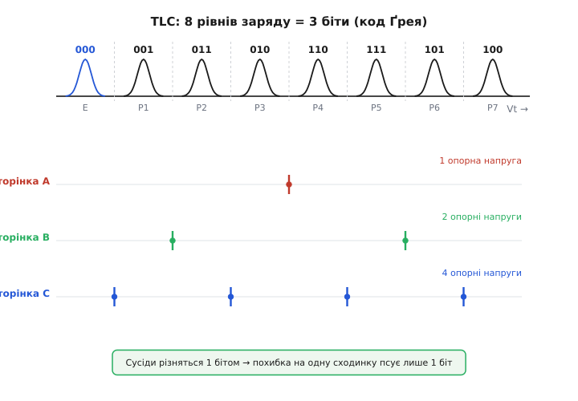
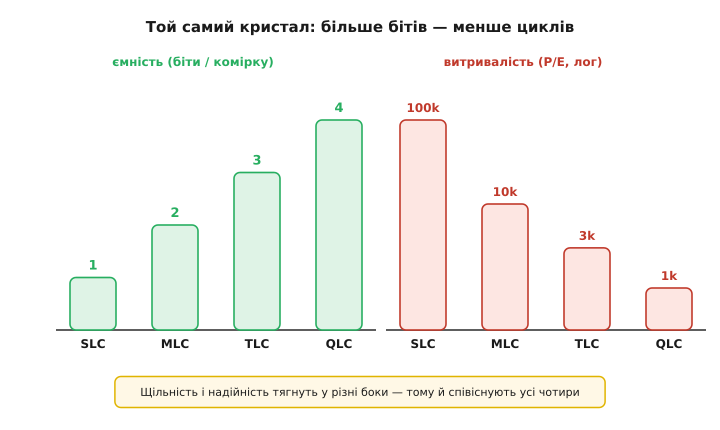

# Рівні комірки NAND (SLC/MLC/TLC/QLC)

Флеш-пам'ять здається чисто цифровою: там нулі й одиниці, файли, папки. Але всередині кожна комірка (англ. *cell* — клітина) — це маленька аналогова банка для електронів, і те, скільки різних «рівнів наповнення» ми навчилися в ній розрізняти, вирішує, скільки бітів вона тримає, як довго живе й наскільки швидко пише. Абревіатури SLC, MLC, TLC, QLC — це саме про кількість рівнів. За ними ховається одна проста, але дуже важлива ідея: **ми беремо неперервну аналогову величину — заряд у комірці — і ділимо її на дискретні сходинки**. Що більше сходинок втиснемо в те саме вікно, то більше бітів на комірку, але то тонший проміжок між сусідами й то легше переплутати один рівень з іншим.

Розберімося від першопричини — від того, що взагалі означає «зберегти біт зарядом».

## Комірка — це керована банка для електронів

В основі комірки NAND лежить особливий транзистор із **плавним затвором** (англ. *floating gate* — «плаваючий», ні до чого не під'єднаний). Це острівець провідника, з усіх боків оточений ізолятором. Заряд, який ми туди заганяємо крізь тонкий шар оксиду, нікуди не тікає — він там «плаває», бо ізоляція не пускає його назад. Саме тому пам'ять і не забуває даних без живлення.

> 🔧 **Навіщо це.** Плавний затвор — це причина, чому карта пам'яті пам'ятає фото, коли фотоапарат вимкнено, і чому SSD не потребує батарейки, щоб зберегти систему. Уся енергонезалежність тримається на тому, що електрони в пастці й не мають куди подітися роками.

Скільки електронів сидить на плавному затворі — стільки він і «важить»: він додає своє поле до керувального затвора й тим зсуває **порогову напругу** транзистора Vt (англ. *threshold* — поріг) — ту напругу, за якої транзистор відкривається. Порожня комірка відкривається за одної напруги, набита електронами — за помітно вищої. Ось і весь фокус: **заряд ми не міряємо прямо, ми міряємо, за якої напруги комірка «спрацьовує»**, і за цим здогадуємося про заряд.

Виходить, фізично комірка зберігає не «нуль» чи «одиницю», а неперервну величину — рівень порогової напруги десь у певному вікні. І тут з'являється головне питання цієї теми: **на скільки розрізнюваних сходинок ми поділимо це вікно?**

## Одна сходинка — один рівень, один рівень — кілька бітів

Якщо ми домовимося розрізняти лише дві сходинки — «мало заряду» й «багато заряду», — комірка тримає рівно один біт. Це **SLC** (англ. *Single-Level Cell* — одна... точніше, історична назва: комірка з одним записаним рівнем, тобто двома станами). Порожньо — читаємо 1, набито — читаємо 0.

А тепер хитрість, яка й зробила флеш дешевою: те саме вікно порогової напруги можна поділити не на дві, а на **чотири** сходинки. Тоді одна комірка розрізняє чотири стани — а чотири стани це рівно 2 біти (00, 01, 11, 10). Це **MLC** (*Multi-Level Cell* — комірка з кількома рівнями; історично «кілька» означало саме два біти). Поділимо на **вісім** сходинок — це 3 біти, **TLC** (*Triple-Level Cell*). На **шістнадцять** — 4 біти, **QLC** (*Quad-Level Cell*).

Закономірність проста й важлива: **кожен доданий біт подвоює число рівнів**. n бітів вимагають 2ⁿ розрізнюваних сходинок у тому самому вікні.

```
SLC   1 біт   →  2 рівні
MLC   2 біти  →  4 рівні
TLC   3 біти  →  8 рівнів
QLC   4 біти  →  16 рівнів
PLC   5 бітів →  32 рівні   (Penta-Level Cell, поки радше дослідне)
```


*Вікно порогової напруги в усіх чотирьох випадках однакове — змінюється лише кількість сходинок, на які його ділять. У SLC між рівнями роздолля, у QLC вони тиснуться впритул.*

Звідси одразу видно платіж. Вікно напруги, у якому взагалі може жити заряд, фізично обмежене — вище нікуди, бо оксид проб'є, нижче теж є край. Це вікно **не росте** від того, що ми хочемо більше бітів. Тож коли рівнів стає вдвічі більше, кожен рівень і проміжок між рівнями стають удвічі вужчими. У SLC сусідні рівні розділяє половина вікна — переплутати їх майже неможливо. У QLC шістнадцять рівнів тиснуться в те саме вікно, і між сусідами лишаються проміжки в якісь сотні мілівольтів. Ось чому щільніша пам'ять завжди тендітніша.

## Читати комірку — це квантувати аналоговий сигнал

Тепер стає видно, що читання комірки — це, по суті, **аналого-цифрове перетворення**. Ми маємо неперервну порогову напругу й хочемо сказати, у яку зі сходинок вона потрапила. Це та сама задача, що й у [квантуванні сигналу в АЦП](topic:electronics/adc-quantization): узяти неперервну величину й приписати їй найближчий дискретний рівень. Різниця лише в тому, що тут «АЦП» вбудований у сам масив пам'яті.

Як контролер визначає рівень? Він прикладає до комірки **опорну напругу** й дивиться, відкрилася комірка чи ні. Одне таке порівняння ділить вікно навпіл: «поріг нижчий за опору» або «вищий». Щоб розрізнити чотири рівні MLC, треба поставити опорні напруги в трьох місцях; для восьми рівнів TLC — у семи; для шістнадцяти QLC — у п'ятнадцяти. Загальне правило: **щоб розділити L рівнів, треба L−1 границь**.

Але тут криється друга хитрість — і вона про те, як ці біти розкласти по «сторінках».

## Код Ґрея: щоб похибка на один рівень псувала лише один біт

Комірка TLC тримає 3 біти, але контролер зазвичай читає їх **не всі разом**, а окремими сторінками — спершу один біт з усіх комірок рядка, потім другий, потім третій. І тут виникає питання: **як саме приписати трибітові коди вісьмом рівням заряду?**

Наївно було б пронумерувати рівні звичайним двійковим лічильником: 000, 001, 010, 011... Але подивімося, що станеться на межі 011→100: за один крок по заряду змінюються **всі три біти**. А заряд у комірці «пливе» з часом і від температури; сусідній рівень — найімовірніша помилка. Якщо через таку помилку злетять три біти одразу, виправляти доведеться важко.

Рятує **код Ґрея** (англ. *Gray code*, на честь Френка Ґрея з Bell Labs, патент 1953 — усталено) — спосіб нумерації, у якому **будь-які два сусідні коди різняться рівно одним бітом**. Тоді типова помилка «зісковзнув на сусідній рівень» псує лише **один** біт, а не три. Це різко полегшує роботу [кодам корекції помилок](topic:electronics/nand-ecc), яким і так доводиться латати десятки збоїв на кожну сторінку.


*Сусідні рівні різняться одним бітом, тож зсув на одну сходинку псує лише один біт. Різні біти «коштують» різного числа порівнянь: одну сторінку читаємо однією опорною напругою, іншу — двома, третю — чотирма.*

У цій розкладці ще й видно, чому різні сторінки однієї комірки читаються з різною швидкістю. Один біт коду Ґрея перемикається по всьому вікну лише раз — його сторінку читають **одним** порівнянням. Інший перемикається двічі — потрібні **два** порівняння. Третій — чотири рази, отже **чотири** порівняння. Тому в TLC одна сторінка «швидка», а інша «повільна»: не через магію, а через те, скільки опорних напруг треба прикласти, щоб її дістати.

## Що ми виграємо і чим платимо

Навіщо взагалі ці страждання з тонкими рівнями? Заради **ціни за біт**. Кристал кремнію коштує грошей майже незалежно від того, скільки бітів ми з нього витиснули. Якщо та сама фізична комірка тримає 4 біти замість 1, ми фактично отримуємо вчетверо більше ємності з тієї самої площі — а отже, вчетверо дешевший гігабайт. Саме перехід SLC→MLC→TLC→QLC зробив терабайтні SSD доступними.

Але за щільність платимо з трьох гаманців одразу.

**Витривалість.** Щоб записати комірку, електрони заганяють крізь тонкий оксид, і щоразу цей оксид потроху зношується. Що точніше треба поцілити в рівень, то менше зношеного оксиду ми можемо собі дозволити, бо зношений оксид «пливе» й розмиває рівні. Тому ресурс у циклах «стерти-записати» (P/E, англ. *program/erase*) падає стрімко: SLC витримує близько 100 000 циклів, MLC — близько 10 000, TLC — близько 3000, QLC — близько 1000 (порядки величини; конкретика залежить від процесу). Впоратися з тим, що різні комірки зношуються нерівномірно, допомагає [вирівнювання зносу](topic:electronics/flash-wear-leveling) — контролер розмазує записи по всьому кристалу.

**Швидкість запису.** Записати SLC просто: заганяй заряд, поки комірка не перескочить єдиний поріг. Записати QLC — це влучити в один із шістнадцяти вузьких рівнів, а це роблять обережними імпульсами з перевіркою після кожного («програмуй-і-звіряй»), бо перелити не можна — стерти окрему комірку не вийде, стирається лише великий блок цілком. Тому чим більше рівнів, тим повільніший запис.


*Щільність і надійність тягнуть у різні боки. Тому всі чотири типи не витісняють один одного, а співіснують: де важлива витривалість — SLC/MLC, де важлива ціна за гігабайт — TLC/QLC.*

**Утримання й дрейф.** Заряд на плавному затворі з роками потроху витікає, а тепло цей витік прискорює. У SLC рівень може «сповзти» майже на чверть вікна — і байдуже, сходинка одна. У QLC таке ж сповзання перестрибне кілька рівнів і зруйнує дані. Тому контролери QLC вміють **підстроювати опорні напруги** на льоту: якщо всі рівні поповзли, зсунемо й границі слідом. Це знову та сама аналогія з АЦП — тільки шкалу перетворення доводиться калібрувати по ходу життя пам'яті.

> 🔧 **Навіщо це.** Ці компроміси — не абстракція, а щоденний вибір інженера. Мікроконтролер, що веде журнал у флеш і переписує ту саму ділянку тисячі разів на день, на дешевій QLC-карті помре за місяці — тут беруть SLC або промислову MLC. А архів фотографій, який пишуть раз і майже не чіпають, чудово живе на QLC за чверть ціни. Знати, скільки рівнів під капотом, — значить не поставити не той носій на не те завдання.

## Гібридний трюк: TLC, що прикидається SLC

Є ще один поширений прийом, який плутає новачків. Багато сучасних SSD усередині — TLC або QLC, але шматок їхньої пам'яті контролер тимчасово використовує в режимі **SLC-кешу**: пише в TLC-комірки лише один біт замість трьох. Навіщо? Бо запис одного біта швидкий і надійний. Свіжі дані спершу летять у цей швидкий однобітовий буфер, а вже потім, коли диск не зайнятий, контролер перекладає їх щільно — по три біти на комірку.

Це можливо саме тому, що рівень у комірці — величина неперервна й аналогова: та сама фізична комірка може працювати і як груба двостанова, і як тонка восьмистанова, залежно від того, скільки рівнів контролер вирішив у ній розрізняти. Той самий залізний масив, дві різні «квантувальні решітки» поверх нього.
