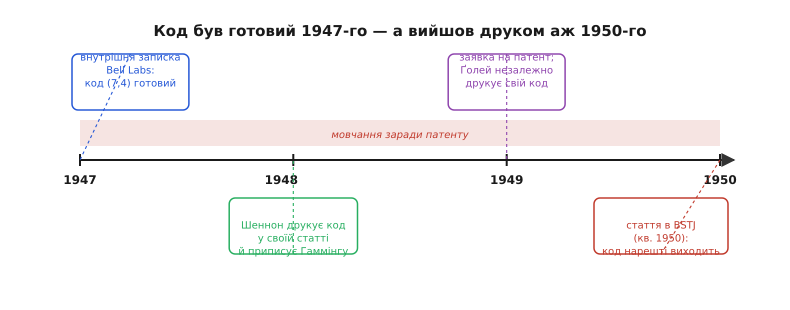

# 📜 Роздратований математик, що навчив машину виправляти саму себе

Уся розкішна математика корекції помилок — синдром, що прямо вказує позицію, підмножини, дібрані так, аби кожен збитий біт лишав унікальний слід, — народилася не з абстрактної краси, а з цілком приземленої злості. Наприкінці 1940-х один інженер у **Bell Labs** двічі поспіль зіпсував собі вихідні через машину, яка вміла зупинитися на помилці, але не вміла її полагодити, — і замість того щоб змиритися, спитав: а чому, власне, ні? З цього питання виріс перший практичний код із виправленням помилок, той самий, чий прямий нащадок і досі стереже кожен ваш файл на флеші. Ця історія варта того, щоб розповісти її як слід — бо вона показує, звідки взагалі беруться такі ідеї.

## Хто це був: Річард Гаммінг

**Річард Веслі Гаммінг** (англ. *Richard Wesley Hamming*; 11 лютого 1915 — 7 січня 1998) — американський математик, народжений у Чикаго. Батько-нідерландець, мати з роду перших переселенців на «Мейфлавері» — тобто ніякого стосунку до чужих імперських наративів тут немає, просто хлопець із середнього Заходу, який дуже добре знав математику й дуже не любив марно згаяного часу. Освіту здобув ґрунтовну: бакалаврат із математики в Чиказькому університеті (1937), магістратура в Небрасці (1939), докторат в Іллінойському університеті (1942).

Далі — те, що згодом і привело його до корекції помилок. У квітні 1945 року Гаммінг приєднався до **Мангеттенського проєкту** в Лос-Аламосі, у групу Ганса Бете, де його роботою було ганяти обчислення на релейних лічильних машинах IBM. Себе він у ті часи описував напівжартома як «прибиральника при комп'ютері» (англ. *computer janitor*) — той, хто стежить, щоб машина крутила чужі розрахунки й не давала збоїв. Саме звідти в нього лишилося дуже конкретне, майже фізичне відчуття того, що таке машина, яка порахувала пів ночі, а тоді тихо збилася на одному біті й видала сміття. Це відчуття він забрав із собою.

> 🔧 **Навіщо це.** Ключ до всієї історії — що Гаммінг був не теоретиком кодування (такої науки ще не існувало), а **практиком-обчислювачем**, якого помилки машини били по руках щодня. Тому й код у нього вийшов не «гарний на папері», а придатний до діла з першого дня: він розв'язував **свою** щоденну проблему. Це та сама логіка, з якої через півстоліття ECC вбудують у контролер кожного SSD, — код народжується там, де залізо реально бреше, а результат потрібен правильний.

## Bell Labs і машина, що псувала вихідні

1946 року Гаммінг перейшов у **Bell Telephone Laboratories** — легендарну дослідну лабораторію телефонної компанії, де тоді ж, за сусідніми столами, кипіла добра половина того, що згодом назвуть інформаційною ерою. Він пробуде там тридцять років. Але зараз важливий один конкретний шматок заліза, з яким він працював, — **релейний комп'ютер Bell Model V**.

Щоб зрозуміти історію, треба уявити цю машину фізично. Це не електроніка в сучасному розумінні — це кілька тонн **електромеханічних реле**, які клацають контактами, вмикаючи й вимикаючи одне одного. Такт машини мірявся не наносекундами, а **секундами**. Програму й дані заряджали з **перфострічки** — паперової стрічки завширшки сім восьмих дюйма, з отворами: пробитий отвір — одиниця, ціла ділянка — нуль. Ось тут і крилася вразливість, знайома кожному, хто працював з механікою: реле іноді не спрацьовувало як слід, зчитувач стрічки міг не так побачити отвір, і в потік обчислень залазив хибний біт.

Найгірше було не саме те, що машина помилялася, а **як** вона поводилася зі своєю помилкою. Bell Model V вміла помітити, що щось не так (найпростіша перевірка парності вже стояла в неї для контролю), — і, помітивши, чесно **зупинялася**. У робочі дні це було стерпно: поруч сидів оператор, який бачив збій, перезаряджав стрічку й пускав розрахунок наново. Але у **вихідні** оператора не було. Гаммінг, за звичкою обчислювача ще з Лос-Аламоса, ставив велику задачу рахуватися на всі вихідні — увечері в п'ятницю запускав і йшов, розраховуючи в понеділок забрати готовий результат.

І ось у чому сіль. Двічі поспіль він приходив у понеділок — а машина стояла. Вона ще в п'ятницю ввечері, невдовзі після старту, наткнулася на помилку, чесно зупинилася й **усі вихідні простояла мертва**. Два повні прогони — коту під хвіст, і жодного результату на руках. Пізніше Гаммінг згадував ту мить прямою мовою:

> *«Damn it, if the machine can detect an error, why can't it locate the position of the error and correct it?»*
> — «Дідько, якщо машина здатна виявити помилку, то чому вона не може визначити, де саме помилка, і виправити її?»

У цьому реченні — вся суть того, що станеться далі, тож розберімо його прискіпливо. Гаммінг помітив логічний **розрив**, повз який усі проходили як повз належне. Машина вже вміла сказати «десь є помилка» — тобто інформація про псування **вже була** в системі, її вловлював біт парності. Але цю інформацію викидали: вона годилася лише на те, щоб зупинитися й покликати людину. Питання Гаммінга було, по суті, таке: якщо ми **вже** платимо за виявлення помилки зайвим бітом, то чому цей самий надлишок не змусити працювати ще й на те, щоб сказати, **котрий** біт винен? Адже якби машина знала позицію, вона б просто перевернула той біт і рахувала далі — без оператора, без утрачених вихідних.

*Статус фактів.* Історія усталена й добре задокументована: сам Гаммінг переказував її в інтерв'ю та лекціях, вона є в його біографіях (MacTutor, IEEE) і в загальновідомих джерелах. Дрібні деталі в переказах трохи різняться — десь кажуть «прийшов у понеділок і не було результату» без наголосу на двох вихідних поспіль, десь наголошують саме на двох утрачених прогонах; наведена пряма цитата фіксується в переказах його інтерв'ю 1977 року. Суть — релейна машина, перфострічка, збій на вихідних, роздратування як поштовх — стала фактом.

## Що вже вміли до нього: парність — і чому її мало

Щоб оцінити прорив Гаммінга, треба чесно визнати, що він **не** винаходив ідею надлишкового біта. **Біт парності** (англ. *parity* — парність, рівність) на той час був давно відомий і стояв у тій самій Bell Model V. Ідея проста до банальності: додай до групи бітів один такий, щоб загальна кількість одиниць вийшла парною. Прочитав назад, порахував одиниці — якщо їх раптом непарно, десь один біт перекинувся. Дешево, зрозуміло, працює.

Але парність уміє рівно одне — **крикнути «щось не так»**. Вона не каже, котрий біт зіпсовано, тож виправити нічого не може; єдина її реакція — зупинити машину й покликати людину. Мало того, один біт парності «сліпне» на парній кількості помилок: перекинулися два біти — сума одиниць знову парна, і код спокійно каже «усе гаразд», хоч дані вже брехливі.

> 🔧 **Навіщо це.** Тут — межа, об яку Гаммінг і вдарився. Один надлишковий біт дає **виявлення** одного збою (англ. *single error detection*, SED) — і ні кроку далі. Різниця між «виявити» і «виправити» тут не кількісна, а якісна: виявлення лише каже, що дані зіпсовані; виправлення повертає їх правильними без сторонньої допомоги. Уся дальша історія ECC — це історія про те, як за розумного добору надлишку перейти цю межу, а тоді розсунути її все далі: спершу «виправити один біт», потім «виправити багато». Той самий поділ SED / SEC / SECDED, який досі стоїть у пам'яті серверів, починається рівно тут.

Отже, на столі перед Гаммінгом лежало ось що. Було очевидно, як **виявити** помилку одним бітом. Було очевидно, що для виправлення треба знати **позицію**. І було геть не очевидно, як цю позицію дістати, не пхаючи в кожне слово стільки перевірних бітів, що корисним даним не лишиться місця. Оце «як, не роздувши надлишок до безглуздя» і було справжньою загадкою.

## Прорив: підмножини, дібрані так, щоб слід сам був адресою

Наступні два роки Гаммінг цю загадку розколов — і розв'язок вийшов такий чистий, що досі здається майже неминучим (він таким не був). Ідея ось у чому. Візьмімо не один перевірний біт, а **кілька**, і — головне — накажемо кожному стежити не за всіма даними підряд, а за своєю, **ретельно дібраною підмножиною** позицій. Добір робимо так, щоб кожна позиція даних потрапляла у **свою унікальну комбінацію** цих підмножин — щоб жодні дві позиції не «накривалися» однаковим набором перевірних бітів.

Тепер стежмо, що буде при читанні. Перерахуймо всі перевірні парності наново. Кожна або сходиться (її підмножини псування не торкнулося), або ні. Набір цих «не сходиться / сходиться» по всіх перевірних бітах Гаммінг назвав **синдромом** (англ. *syndrome*, від гр. *syndromḗ* — збіг ознак; те саме слово, що в медицині, де набір симптомів указує на хворобу). І ось геніальний хід у доборі підмножин: якщо перевірні біти поставити на позиції-**степені двійки** (1, 2, 4, 8, …), а кожен зробити відповідальним за ті позиції, у чиєму двійковому номері горить його розряд, то синдром виходить **буквально двійковим номером зіпсованої позиції**.

Не «підказкою», не «звуженням кола підозр» — прямою **адресою**. Синдром `000` — помилки немає. Синдром `101` — зіпсовано позицію 5, бо 5 у двійковому це `101`. Прочитав синдром, пішов за цим номером, перевернув біт — і дані знову правильні, без жодного зовнішнього знання про те, де стався збій. Розрив, повз який усі проходили, зник: та сама інформація, що раніше лише кричала «десь помилка», тепер сама називала її на ім'я. (Точний механізм — як саме підмножини накривають позиції й чому синдром збігається з номером — розібрано в самій темі [«ECC у NAND-флеші»](topic:electronics/nand-ecc), тут нам важлива не арифметика, а те, **чому** ця конструкція була проривом.)

У цьому й полягав винахід — не в тому, що з'явився надлишок (він був), а в тому, що надлишок дібрано **систематично**, так, аби він сам себе розшифровував. Гаммінг побудував цілу родину таких кодів; найвідоміший — **Гаммінг(7,4)**: чотири біти даних плюс три перевірні, рівно сім, і будь-який один збитий біт із семи знаходиться й лагодиться. Це вже не просто виявлення, а **виправлення однієї помилки** (англ. *single error correction*, SEC).

### Геометричний погляд: чому це взагалі можливо

Гаммінг дав і глибше пояснення, чому виправлення взагалі можливе, — і воно варте того, щоб його вхопити, бо з нього видно **межу** будь-якого коду. Він увів поняття, яке тепер зветься його ім'ям, — **відстань Гаммінга** (англ. *Hamming distance*): це просто кількість позицій, у яких два двійкові слова різняться. `1011` і `1001` різняться в одній позиції — відстань 1; `1011` і `0100` — у всіх чотирьох, відстань 4.

Тепер уявімо всі можливі слова як точки простору, а відстань між ними — як число «перекидань біта», щоб дійти від однієї до іншої. Код — це не всі точки, а лише **обраний** їх набір (дозволені кодові слова); решта комбінацій — «заборонені». Якщо дозволені слова розставити так, щоб будь-які два різнилися щонайменше на **3** перекидання, то навколо кожного утвориться «безпечна куля» радіусом 1: одна помилка зсуває слово всього на крок, воно лишається **ближчим** до свого правильного сусіда, ніж до будь-якого чужого, — і декодер безпомилково «притягує» його назад. Ось чому мінімальна відстань 3 дає виправлення однієї помилки: між будь-якими двома «правильними островами» лишається щонайменше одна порожня клітинка, куди помилка не може завести двозначно.

```
відстань між кодовими словами   що можна
d = 1   збігаються майже скрізь  нічого (сусіди злиплися)
d = 2   різняться у 2 позиціях   виявити 1 помилку (але не виправити)
d = 3   різняться у 3 позиціях   виправити 1  (Гаммінг(7,4))
d = 4   різняться у 4 позиціях   виправити 1 + виявити 2  (SECDED)

правило:  виправляємо t помилок  ⟺  d ≥ 2·t + 1
          + додатковий біт парності підіймає d на 1
```

Це той самий погляд, який згодом дасть змогу будувати куди потужніші коди: хочеш лагодити більше помилок — розсовуй кодові слова далі одне від одного (більша мінімальна відстань), плати за це надлишком. А додавши до Гаммінга ще **один** загальний біт парності поверх усіх, відстань підіймають з 3 до 4 — і код починає не лише виправляти один збій, а ще й **виявляти** (не плутаючи) будь-які два: це **SECDED** (англ. *single error correction, double error detection*), рівно те, що досі стоїть у пам'яті з корекцією на серверах.

## Тихі роки: чому код 1947-го вийшов друком аж 1950-го

Тепер найцікавіший поворот, який багато хто пропускає. Код Гаммінг мав готовим **набагато раніше**, ніж про нього дізнався світ. Уже 1947 року він виклав конструкцію у **внутрішній записці Bell Labs**. Але між готовою ідеєю та її публікацією ліг проміжок майже у три роки — і причина була цілком прозаїчна: **патент**. Bell Labs захотіли запатентувати винахід, а патентні правники не дозволяли друкувати, поки заявку не оформлять. Тож код лежав, по суті, замкнений.

За цей час сталися дві промовисті речі, які показують, що ідея вже «висіла в повітрі» лабораторії.

Перша: за сусіднім столом сидів **Клод Шеннон** (англ. *Claude Shannon*) — той самий, хто 1948 року статтею «Математична теорія зв'язку» (*A Mathematical Theory of Communication*) заснує теорію інформації. Шеннон знав про код колеги — і у своїй знаменитій праці 1948 року **навів** код Гаммінга(7,4) як приклад, чесно **приписавши його Гаммінгу**. Виходить парадокс: код став відомий науковому світу з чужої статті на два роки раніше, ніж його автор устиг надрукувати власну. Сам Гаммінг згодом сказав про цей збіг чудову річ:

> *«At the same time he was doing information theory, I was doing coding theory. It is suspicious that the two of us did it at the same place and at the same time — it was in the atmosphere.»*
> — «Поки він займався теорією інформації, я займався теорією кодування. Підозріло, що ми обидва зробили це в тому самому місці й у той самий час, — воно було в повітрі».

Друга: 1949 року на іншому кінці, теж у Bell Labs, швейцарець **Марсель Ґолей** (фр. *Marcel J. E. Golay*) незалежно надрукував у *Proceedings of the IRE* пів сторінки під назвою «Notes on Digital Coding» — текст, який називають чи не найдивовижнішою піваркушевою публікацією в усій теорії кодування. Ґолей узагальнив ідею на кілька виправлюваних помилок і навів свої тепер знамениті **коди Ґолея**. Показово, що єдиним попереднім джерелом, яке він на той час бачив, був той самий двоабзацний опис коду Гаммінга зі статті Шеннона 1948 року — тобто ідея розліталася й підхоплювалася вже до офіційної публікації першоджерела.


*Проміжок між готовою ідеєю та її публікацією — це не інерція науки, а замок патенту. Червона смуга — роки «мовчання»: код існує, ним уже користуються в чужих статтях, але автор не має права надрукувати. Такий розрив між винаходом і публікацією — типова риса корпоративної науки, і саме через нього питання «хто перший» у кодуванні треба розводити на «хто придумав», «хто надрукував» і «хто запатентував».*

Нарешті замок відкрився. У **квітні 1950 року** в *Bell System Technical Journal* (том 29, номер 2, сторінки 147–160) вийшла стаття Річарда Гаммінга **«Error Detecting and Error Correcting Codes»** — «Коди для виявлення й виправлення помилок». Саме її й вважають народженням теорії кодування як окремої науки.

*Статус фактів.* Датування усталене й перевірене: внутрішня записка Bell Labs — 1947; згадка й приписування коду Гаммінгу в статті Шеннона — 1948; патентна заявка — близько 1949 (звідси й затримка друку); півсторінкова праця Ґолея — 1949 (*Proc. IRE*, т. 37, с. 657); власна стаття Гаммінга — квітень 1950, *BSTJ*, т. 29, № 2, с. 147–160. Атрибуцію тут важливо тримати чисто: **ідею** й **першу конструкцію** дав Гаммінг (1947), **першу публікацію самого коду** зробив Шеннон, приписавши авторство Гаммінгу (1948), **незалежне узагальнення** надрукував Ґолей (1949), а **власну повну працю** Гаммінг видав лише 1950-го. Це класичний приклад того, чому «хто перший» треба розкладати на окремі питання — придумав, надрукував, узагальнив, запатентував, — бо на кожне з них відповідь інша.

## Чому саме цей код став найпоширенішим

Лишається питання, без якого історія неповна: чому з усіх мислимих способів дописати надлишок саме гаммінгів підхід дожив до сьогодні й стоїть усюди — від пам'яті серверів до сирого рівня флеш-контролерів? Відповідь у трьох його властивостях, і всі три випливають із того самого систематичного добору підмножин.

Перша — **дешевизна декодування**. Синдром не треба ні шукати перебором, ні розв'язувати рівняннями: він **сам** випадає з арифметики як двійковий номер позиції. Полагодити слово — це перерахувати кілька парностей (а парність — це просто XOR, найдешевша операція, яку взагалі вміє залізо) і, якщо синдром ненульовий, перевернути один біт за готовою адресою. Такий декодер уміщається в жменю логічних вентилів; його можна вбудувати прямо в тракт пам'яті, щоб він лагодив биті на льоту, не гальмуючи читання. Для заліза це вирішальне.

Друга — **оптимальність за надлишком**. Коди Гаммінга — так звані **досконалі** (англ. *perfect*) коди: для своєї задачі (виправити один біт) вони використовують перевірні біти без анінайменшого марнування, «безпечні кулі» навколо кодових слів заповнюють простір щільно, без порожнеч. Тобто менше надлишку, ніж у Гаммінга, для гарантованого виправлення однієї помилки не вийде фізично. Коли додаткова пам'ять коштує грошей, така ощадність вирішує.

Третя — **розширюваність**. Гаммінгова конструкція виявилася не тупиком, а **фундаментом**. Той самий принцип «синдром указує на винних», піднятий на алгебру скінченних полів, дав змогу локалізувати не один збій, а відразу кілька — так виросли коди **BCH**, без яких флеш перших поколінь не працювала б; а коли й їх стало замало, на зміну прийшов **LDPC** із «читанням у відтінках сірого». Але всі вони — прямі спадкоємці думки, яку Гаммінг уперше сформулював чітко: **надлишок можна дібрати так, щоб він сам вказував місце помилки**.

> 🔧 **Навіщо це.** Коли ви бачите ECC у пам'яті сервера, у контролері SSD, у службовій ділянці сторінки NAND — це не різні винаходи, а одна родина, чиє коріння в тому релейному комп'ютері й зіпсованих вихідних 1947 року. Гаммінг розв'язав не «математичну задачу заради задачі», а конкретну біду обчислювача: машина порахувала й збилася, результат утрачено. Через сімдесят років та сама біда, лише в мільярд разів дрібнішому масштабі, живе в кожній комірці флеш — і лагодить її та сама ідея. Історія тут не прикраса: вона пояснює, **чому** корекція помилок улаштована саме як пошук позиції за слідом, а не якось інакше. Бо саме таким було питання, з якого все почалося: «якщо ти бачиш, що помилка є, — скажи мені, де вона».

І в цьому, мабуть, головний урок цієї історії. Гаммінг сам згодом любив казати, що видатні дослідники вміють обертати поразку на перемогу: замість того щоб просто вилаятися на дурну машину й переробити роботу, він поставив питання, яке ця машина перед ним відкрила, — і замість утраченого прогону отримав цілу нову науку. Наступного разу, коли ваш SSD на мить «задумається» перед тим як віддати файл, — знайте, що всередині він саме зараз лагодить збиті біти способом, який один роздратований математик придумав, бо йому шкода було двох згаяних вихідних.
