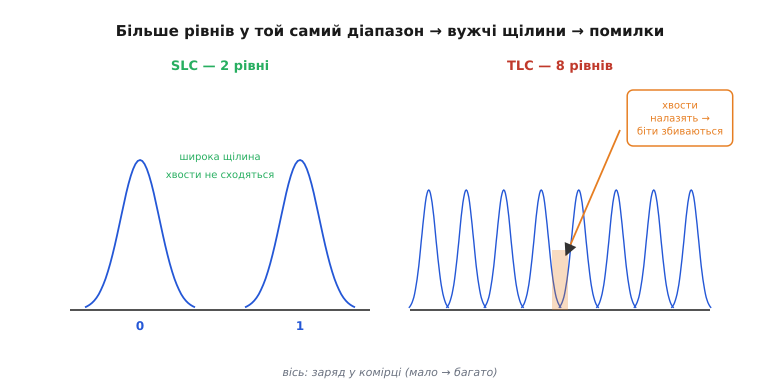
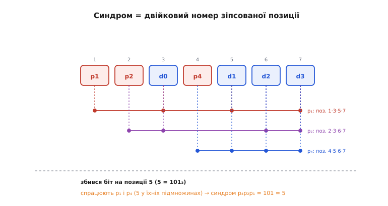
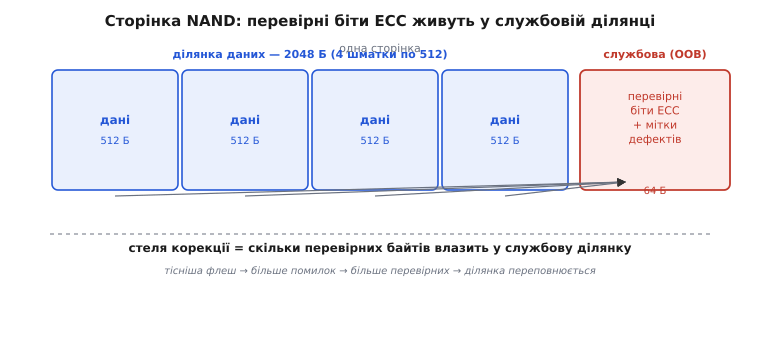

# ECC у NAND-флеші

NAND-флеш віддає биті з похибкою — і так було задумано. Це звучить дико: пам'ять, у якій частина бітів час від часу читається не тою, якою її записали. Але саме на цьому компромісі стоїть уся дешева щільна флеш телефонів, карток і твердотільних дисків. Виробник свідомо жме комірки якомога тісніше й дозволяє їм бути **трохи ненадійними**, а поверх кладе математику, яка ці похибки **виловлює й виправляє на льоту**. Ця математика і зветься **ECC** (*error-correcting code*, код із виправленням помилок). Розберемо, чому без неї сучасна NAND узагалі не працювала б, і як кілька зайвих бітів дозволяють точно знайти й перевернути назад той біт, що збився.

### Чому чесна пам'ять неможлива

Почнімо з питання, яке здається риторичним: чому просто не зробити NAND так, щоб вона не помилялася? Адже оперативна пам'ять чи регістр процесора віддають рівно те, що в них поклали. Відповідь у тому, **як** NAND зберігає біт — і чому за надійність тут довелося б заплатити ціною, яка вбиває саму ідею дешевого масового сховища.

Біт у NAND — це порція заряду, замкнена в мікроскопічній пастці (плавучому заряді) всередині транзистора. «Багато заряду» читається як один логічний рівень, «мало» — як інший. Проблема в тому, що заряд — річ **аналогова й норовлива**. Він потроху **стікає** крізь ізолятор із роками; сусідні комірки, коли їх програмують, ледь-ледь **підштовхують** заряд у цю; кожне стирання трохи **зношує** ізолятор, і після десятків тисяч циклів пастка тримає заряд гірше. Додайте теплові коливання й розкид між мільярдами комірок — і рівень заряду, який мав би чітко означати «1», іноді сповзає в зону, яку схема читання прийме за «0».

Це терпимо, поки рівнів лише два. Але дешевизна флеш прийшла саме з того, що в **одну** комірку почали пхати не один біт, а два, три, тепер і чотири — розрізняючи не два рівні заряду, а чотири, вісім, шістнадцять ([SLC, MLC, TLC, QLC](book:electronics/nand-cell-levels)). Що більше рівнів утиснуто в той самий діапазон заряду, то **вужча** щілина між сусідніми рівнями — і то легше похибці заряду штовхнути комірку через межу. Ось звідки береться неминучість: висока щільність (а отже низька ціна за гігабайт) **прямо** означає високу ймовірність помилки читання. Одне тягне за собою інше.

> 🔧 **Навіщо це.** Коли ви бачите на пласі TLC- чи QLC-флеш і думаєте «дешево, беру» — знайте, що дешевизна куплена саме ненадійністю комірки. Сирий (без корекції) потік бітів із сучасної QLC-NAND має **помітну** частку помилок; без ECC такий носій не пройшов би й першого читання. Тому ECC — не «підстраховка на всяк випадок», а несуча стіна: рівень корекції закладають **під** очікувану частоту помилок конкретного типу флеш, і чим щільніша флеш, тим потужніший ECC мусить стояти поряч.

Тож інженери зробили розважливий вибір. Замість дорогої «чесної» комірки, що ніколи не бреше, — дешева комірка, що бреше **рідко й у передбачуваних межах**, плюс код, який ці рідкі брехні **знаходить і виправляє**. Сумарно виходить надійно **і** дешево. Ключове слово — «у передбачуваних межах»: виробник у даташиті прямо пише, скільки помилок на скільки байтів код мусить тягнути, і доки контролер тримає цю планку, назовні пам'ять виглядає бездоганною.


*Одна вісь — заряд у комірці. Ліворуч SLC: два рівні, широка щілина, розкид кожного (дзвіночок) далеко не дістає сусіда — помилка рідкісна. Праворуч TLC: вісім рівнів у тому самому діапазоні, щілини вузькі, «хвости» розкиду налазять один на одного — заштрихована зона перекриття і є ті біти, що прочитаються неправильно. Щільність купуємо ціною помилок; різницю добирає ECC.*

### Головна ідея: надлишок, що вказує на винного

Як узагалі можна виправити помилку, не знаючи заздалегідь, **де** вона? Адже якби ми знали, який біт збився, то просто перевернули б його — і по всьому. У цьому вся суть, і відповідь напрочуд гарна: до корисних бітів дописують кілька **надлишкових** (їх звуть **перевірними**, *parity*), обчислених за корисними так, що будь-яке псування залишає **слід** — і за цим слідом винного можна **обчислити**.

Найпростіший надлишок — один **біт парності**. Домовмося: до групи бітів додаємо один такий, щоб загальна кількість одиниць була **парною**. Записали `1011` — одиниць три, непарно, тож перевірний біт ставимо `1`, зберігаємо `10111` (чотири одиниці, парно). Читаємо назад, рахуємо одиниці: якщо їх раптом **непарно** — десь один біт перевернувся, дані зіпсовані. Це вже цінно: помилку **помічено**. Але один біт парності лише кричить «щось не так» — він не каже, **котрий** біт винен, тож виправити нічого не може. Щоб виправляти, слідів має бути **більше**, і кожен має відповідати за **свою** підмножину бітів — тоді набір спрацьованих слідів разом **вкаже адресу** зіпсованого біта.

Ось інтуїція, на якій тримається геть уся корекція помилок. Уявіть кожен перевірний біт як контролера, що стежить за певним **підмножиною** бітів даних і рахує їхню парність. Підмножини дібрані хитро — так, що кожен біт даних потрапляє в **свою унікальну комбінацію** контролерів. Коли один біт даних перевертається, спрацьовують **саме ті** контролери, у чиї підмножини він входить, — і ніякі інші. А набір спрацьованих контролерів — це, по суті, **двійковий номер** зіпсованого біта. Прочитали цей номер, пішли за адресою, перевернули біт назад — помилка виправлена. Найелегантніше це зробив ще 1950 року [Річард Гаммінг](book:electronics/nand-ecc/hist-hamming.md), і саме його спосіб добору підмножин лежить в основі найпростішого коду з виправленням.


*Сім позицій коду Гаммінга: чотири біти даних (d) і три перевірні (p). Кожен перевірний біт «накриває» свою підмножину позицій (показано дугами). Коли псується один біт, спрацьовують саме ті перевірні, у чиї підмножини він входить, — трійка спрацювань `p₃p₂p₁` читається як двійковий номер позиції. Не спрацював жоден — помилки нема; спрацювала унікальна комбінація — ось адреса, яку треба перевернути.*

### Синдром: як номер помилки виринає сам

Проговорімо механізм точно, бо він красивий і зрозумілий до кінця. Візьмімо код, де на **4** біти даних припадає **3** перевірні — разом 7 (це класичний Гаммінг(7,4)). Пронумеруймо позиції 1..7. Перевірний біт номер 1 відповідає за всі позиції, у чиєму номері горить молодший розряд (1, 3, 5, 7); номер 2 — за позиції з другим розрядом (2, 3, 6, 7); номер 4 — за позиції з третім (4, 5, 6, 7). Кожен ставиться так, щоб парність його підмножини була нульова.

Тепер читаємо код назад і **перераховуємо** ці три парності. Результат — три біти, які разом звуть **синдромом** (*syndrome*, гр. *syndromḗ* — збіг ознак; те саме слово, що й у медицині — набір симптомів, який вказує на хворобу). І ось у чому чудо: якщо помилки немає, усі три парності сходяться, синдром `000`. Якщо ж перевернувся біт на позиції, скажімо, 5, то спрацюють **саме ті** перевірні, у чиї підмножини входить 5, — а 5 у двійковому це `101`, тобто підмножини номер 1 і номер 4. Синдром вийде `101` = 5. **Синдром буквально дорівнює номеру зіпсованої позиції.** Не треба ніде шукати — номер сам випав з арифметики. Перевернули біт на цій позиції — і дані знову правильні.

**Приклад (виправлення одного біта на очах).** Заповнимо код даними `1011`, зіпсуємо один біт при «читанні» й дамо коду сам знайти й полагодити його. Код — реальний C, як у прошивці контролера.

:::tabs
```c
#include <stdint.h>
#include <stdio.h>

// Гаммінг(7,4): позиції 1..7, перевірні на 1,2,4 (степені двійки),
// дані d0..d3 на позиціях 3,5,6,7. Парність підмножини має бути 0.
static uint8_t encode(uint8_t data4) {
    uint8_t d0=(data4>>0)&1, d1=(data4>>1)&1, d2=(data4>>2)&1, d3=(data4>>3)&1;
    uint8_t bit[8] = {0};              // bit[1..7] — позиції коду
    bit[3]=d0; bit[5]=d1; bit[6]=d2; bit[7]=d3;
    bit[1]= bit[3]^bit[5]^bit[7];      // накриває позиції з розрядом 1
    bit[2]= bit[3]^bit[6]^bit[7];      // ...з розрядом 2
    bit[4]= bit[5]^bit[6]^bit[7];      // ...з розрядом 4
    uint8_t code=0;
    for (int i=1;i<=7;i++) code |= bit[i]<<(i-1);
    return code;                       // 7 бітів у молодших розрядах
}

// Повертає виправлений код; синдром = номер зіпсованої позиції (0 = чисто).
static uint8_t correct(uint8_t code, int *syndrome_out) {
    uint8_t b[8]={0};
    for (int i=1;i<=7;i++) b[i]=(code>>(i-1))&1;
    int s = 0;
    s |= (b[1]^b[3]^b[5]^b[7]) << 0;   // перерахунок парності підмножини 1
    s |= (b[2]^b[3]^b[6]^b[7]) << 1;   // ...підмножини 2
    s |= (b[4]^b[5]^b[6]^b[7]) << 2;   // ...підмножини 4
    if (s) code ^= (1u << (s-1));      // s — це і є номер біта; перевертаємо
    *syndrome_out = s;
    return code;
}

int main(void) {
    uint8_t code = encode(0b1011);           // закодували дані 1011
    uint8_t stored = code ^ (1u << 4);       // «флеш» перекинула біт на позиції 5
    int s; uint8_t fixed = correct(stored, &s);
    printf("синдром = %d -> позиція помилки; збіг із оригіналом: %s\n",
           s, fixed==code ? "так" : "ні");
    return 0;                                 // друкує: синдром = 5 ... так
}
```
```python
# Гаммінг(7,4): позиції 1..7, перевірні на 1,2,4 (степені двійки),
# дані d0..d3 на позиціях 3,5,6,7. Парність підмножини має бути 0.
def encode(data4: int) -> int:
    bit = [0] * 8                       # bit[1..7] — позиції коду
    bit[3], bit[5], bit[6], bit[7] = (  # дані d0..d3
        (data4 >> i) & 1 for i in range(4))
    bit[1] = bit[3] ^ bit[5] ^ bit[7]   # накриває позиції з розрядом 1
    bit[2] = bit[3] ^ bit[6] ^ bit[7]   # ...з розрядом 2
    bit[4] = bit[5] ^ bit[6] ^ bit[7]   # ...з розрядом 4
    code = 0
    for i in range(1, 8):
        code |= bit[i] << (i - 1)
    return code                         # 7 бітів у молодших розрядах


# Повертає (виправлений код, синдром); синдром = номер зіпсованої позиції (0 = чисто).
def correct(code: int) -> tuple[int, int]:
    b = [(code >> (i - 1)) & 1 if i else 0 for i in range(8)]
    s = 0
    s |= (b[1] ^ b[3] ^ b[5] ^ b[7]) << 0   # перерахунок парності підмножини 1
    s |= (b[2] ^ b[3] ^ b[6] ^ b[7]) << 1   # ...підмножини 2
    s |= (b[4] ^ b[5] ^ b[6] ^ b[7]) << 2   # ...підмножини 4
    if s:
        code ^= (1 << (s - 1))              # s — це і є номер біта; перевертаємо
    return code, s


code = encode(0b1011)                       # закодували дані 1011
stored = code ^ (1 << 4)                    # «флеш» перекинула біт на позиції 5
fixed, s = correct(stored)
print(f"синдром = {s} -> позиція помилки; "
      f"збіг із оригіналом: {'так' if fixed == code else 'ні'}")
# друкує: синдром = 5 ... так
```
:::

Висновок прикладу: код **сам** обчислив, що зіпсовано позицію 5, і перевернув її назад — жодного зовнішнього знання про місце помилки не знадобилося, номер випав із синдрому. Саме так, лише на набагато довших словах, працює перевірка кожної сторінки NAND: контролер читає дані **разом** із перевірними бітами, рахує синдром і, якщо той ненульовий, лагодить биті на льоту, ще до того як дані підуть нагору. Читач бачить чисті байти й навіть не здогадується, що комірка збрехала.

### Чому NAND потрібно набагато більше

Гаммінг(7,4) лагодить **один** збитий біт на слово — цього досить для оперативної пам'яті, де помилки поодинокі. Але NAND у межах однієї сторінки віддає не один хибний біт, а **десятки**. Один контролер-«накривач» на кілька бітів тут безсилий: щойно в підмножину влучили **два** збиті біти, їхні перевертання парності **взаємно гасяться** — синдром бреше, і код або мовчить, або лагодить не ту позицію, псуючи ще більше. Щоб тягти багато помилок одразу, слідів (перевірних бітів) має бути помітно більше, а їхнє переплетення — хитріше. Так одноразовий Гаммінг переростає у **BCH** — родину кодів, налаштовуваних на будь-яку задану кількість виправлюваних бітів.

BCH (за іменами Боуза, Рей-Чоудгурі й Окенгема, що описали його наприкінці 1950-х) — це той самий принцип «синдром вказує на винних», але піднятий на алгебру, яка вміє **локалізувати відразу t помилок** у слові. Платиш за це надлишком: щоб гарантовано виправляти `t` збитих бітів, потрібно приблизно `t·log₂(n)` перевірних бітів на слово з `n` бітів. [Внутрішню математику BCH](book:electronics/nand-ecc/math-bch.md) — многочлени над скінченним полем, пошук коренів, локатор помилок — виносимо окремо; для розуміння сховища важливий її **наслідок**: скільки саме зайвого місця з'їдає корекція.

І тут з'являється друга половина сторінки NAND, про яку зазвичай мовчать. Кожна сторінка має, крім основної ділянки під дані, ще й **службову ділянку** (*spare area*, або OOB — *out-of-band*, «поза смугою»). У сторінці на 2048 байтів даних службової буває 64 чи 128 байтів; у сторінці на 4096 — часто 224 і більше. Саме туди контролер кладе перевірні біти ECC (а ще мітки дефектних блоків і дрібні службові дані). Виходить прямий **бюджет**: маєш стільки-то службових байтів — стільки-то помилок і можеш виправляти, не більше. Ось звідки жорсткі вимоги в даташитах на кшталт «код мусить тягти щонайменше 8 помилок на кожні 512 байтів даних».

**Приклад (бюджет службової ділянки).** Порахуймо, чи вліземо кодом BCH у службову ділянку сторінки. Дані ділять на шматки по 512 байтів і кодують кожен окремо.

```
Дано:  сторінка 2048 Б даних + 64 Б службової
       ділимо на 4 шматки по 512 Б; треба тягти 8 помилок на шматок

Кількість перевірних бітів BCH на шматок (правило t·log₂(n)):
   слово ≈ 512·8 = 4096 бітів даних, беремо m = 13 (бо 2¹³ = 8192 > 4096)
   parity ≈ t·m = 8·13 = 104 біти = 13 байтів на шматок

Усього на сторінку:
   4 шматки × 13 Б = 52 байти перевірних
   службова ділянка 64 Б  →  52 ≤ 64  ✓ (вліземо, лишається 12 Б на мітки)

А якби треба було тягти 24 помилки на шматок:
   parity ≈ 24·13 = 312 біт = 39 Б × 4 = 156 Б  →  156 > 64  ✗
   службової НЕ вистачає: або більша ділянка, або інший код
```

Висновок прикладу: службова ділянка — це **тверда стеля** сили корекції. Поки помилок мало, BCH влізає з запасом. Але коли щільніша флеш почала вимагати тягти по кілька десятків помилок на шматок, перевірні біти BCH просто **перестали вміщатися** — і саме це виштовхнуло галузь до економнішого й потужнішого коду.


*Сторінка складається з ділянки даних (тут 2048 байтів, поділені на чотири шматки по 512) і вужчої службової ділянки (64 байти). Дані кодують шматками; перевірні біти кожного шматка лягають у службову ділянку поряд із мітками дефектів. Скільки помилок код здатен виправити — прямо впирається в те, скільки перевірних байтів туди влазить. Тісніша флеш → більше помилок → більше перевірних → службова ділянка переповнюється.*

### LDPC і читання «з відтінками сірого»

Коли BCH перестав уміщатися, на його місце в найщільнішій флеш прийшов **LDPC** (*low-density parity-check*, перевірка парності з розрідженою матрицею). Ідея глибша, ніж просто «ще більше перевірних бітів», і варта того, щоб її вхопити, бо вона змінює **сам спосіб читати** комірку.

BCH працює з **твердими** рішеннями: схема читання питає комірку «ти вище порога чи нижче?» і отримує голий 0 або 1. Уся тонша інформація — **наскільки** комірка близька до порога, майже вона збилася чи впевнено тримається — викидається ще до коду. LDPC цю інформацію **зберігає й використовує**. Замість одного порога комірку читають **кількома** близькими порогами (це і є **повторне читання**, *read-retry*, яке контролер вмикає, коли з першого разу код не зійшовся) і за результатами оцінюють не «0 чи 1», а **ймовірність** кожного значення — «майже напевно 1», «радше 0, але непевно». Декодер LDPC жонглює цими ймовірностями, ганяючи їх між своїми розрідженими перевірками туди-сюди, доки картина не **устоїться** на найправдоподібнішому наборі бітів. Таке «читання з відтінками сірого» (*soft decision*, м'яке рішення) витягує з тієї самої зношеної комірки помітно більше правди, ніж голе «вище/нижче».

Практичний слід цього ви, можливо, вже помічали: старий або сильно заповнений SSD іноді **читає ривками** — то миттєво, то з затримкою. Часто це саме read-retry: контролер не зійшовся з першого читання, перечитує тими самими комірками на інших порогах, згодовує LDPC м'якші дані — і зрештою відновлює сторінку, але вже за кілька спроб замість однієї. Дані ви отримуєте правильні; ціна — час. А коли навіть повторні читання перестають рятувати — це знак, що блок **зносився** остаточно, і контролеру час виводити його з обігу.

> 🔧 **Навіщо це.** Три речі, які варто винести. Перша: **read-retry — це нормальна робота, не поломка**; сплески затримки читання на старій флеш означають, що ECC працює на межі й рятує ваші дані ціною зайвих проходів. Друга: **сила ECC старіє разом із флеш** — молодий носій лагодить помилки жменею перевірних бітів, а до кінця ресурсу той самий код ледве встигає, тож у пристрої, який має жити довго (реєстратор, лічильник, промислова автоматика), закладайте флеш із **запасом** по ресурсу й корекції. Третя: якщо контролер починає **повертати помилки читання** назовні (а не тихо їх лагодити) — ECC вичерпав силу, і дані на цьому блоці вже не гарантовані; це сигнал міняти носій, а не «глюк, що сам минеться».

### Що з усього цього лишається в голові

Зведімо нитку, бо всі частини — про одне. NAND-флеш дешева й щільна саме тому, що її комірки **свідомо зроблено трохи ненадійними**: тісно втиснуті рівні заряду час від часу читаються не так. Щоб назовні пам'ять усе одно виглядала бездоганною, поверх кладуть **ECC** — код, що дописує до даних надлишкові перевірні біти так, аби будь-яке псування лишало обчислюваний слід (**синдром**), за яким зіпсований біт **знаходять і перевертають назад**. Найпростіший такий код (Гаммінг) лагодить один біт; NAND потрібно лагодити десятки, тож у діло йдуть потужніші **BCH** та **LDPC**, а стелю їхньої сили ставить **службова ділянка** сторінки, куди перевірні біти фізично мусять вміститися. Ось чому будь-яке флеш-сховище невіддільне від свого коду корекції: комірка бреше — код виправляє, і саме ця пара дає надійне сховище з ненадійного заліза.

Ця пара — лише один із фокусів [контролера всередині SSD чи eMMC](book:electronics/emmc-ssd): він не лише виправляє биті кодом ECC, а ще й вирівнює знос, обходить дефектні блоки й вдає перед системою рівний диск. ECC — та ланка, що робить решту можливою: без неї носій не віддав би й одного правильного сектора, а з нею комп'ютер бачить звичайну надійну пам'ять і не здогадується, скільки помилок код тихо полагодив на кожному читанні.
