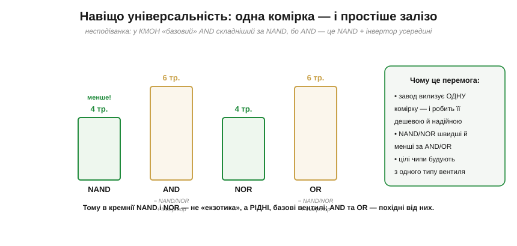

# NAND і NOR: універсальні вентилі

До будь-якого [базового вентиля](topic:electronics/basic-gates) можна дописати на виході **кружок-інверсію**. Допишімо його на вихід AND — отримаємо **NAND** (NOT-AND); допишімо на вихід OR — **NOR** (NOT-OR). Здавалося б, дрібниця: просто інвертований результат. Та ці два «перевернуті» вентилі мають властивість, яка межує з дивом і визначила всю промислову цифрову електроніку: **кожен із них сам по собі універсальний** — маючи лише NAND (або лише NOR), можна побудувати **будь-яку** логічну схему на світі. Розберімо, чому це так і чому це так важливо.

### NAND і NOR: інверсія звичних вентилів

Спершу — самі вентилі. Усе просто: вони роблять те саме, що AND і OR, тільки результат **перевернутий**.


***NAND** — це AND із кружком на виході: Y = ‾(A·B). Його вихід — 0 **лише** тоді, коли обидва входи 1 (у решті випадків — 1), тобто точне «перевертання» таблиці AND. **NOR** — це OR із кружком: Y = ‾(A+B). Його вихід — 1 **лише** коли обидва входи 0. Запам'ятати легко: NAND і NOR — це «AND/OR, але навпаки».*

На вигляд нічого особливого — звичний символ [вентиля](topic:electronics/basic-gates) плюс бульбашка-інверсія на виході. Уся незвичайність — у тому, що з цих простих елементів виходить.

### Закони Де Моргана: міст між AND і OR

Щоб зрозуміти універсальність, нам знадобляться **закони Де Моргана** — одне з тотожних правил [булевої алгебри](topic:math/boolean-algebra). Вони кажуть, як інверсія перетворює «і» на «або» й навпаки:

```
‾(A · B) = Ā + B̄        (НЕ«і» = «або» заперечень)
‾(A + B) = Ā · B̄        (НЕ«або» = «і» заперечень)
```

Це не суха формула, а **практичний фокус**: бульбашку-інверсію можна «перекидати» крізь вентиль, міняючи заразом його тип.


*Те саме двома символами. **NAND** (AND + кружок на виході) **дорівнює** OR із кружками на **входах** — бо ‾(A·B) = Ā+B̄. Так само **NOR** дорівнює AND із інвертованими входами. Тобто, «перекинувши» бульбашки зі входів на вихід (чи навпаки), AND перетворюється на OR і назад. Саме цей місток і дозволяє звести всю логіку до одного типу вентиля.*

Цей прийом — «штовхання бульбашки» (*bubble pushing*) — інженери використовують щодня, щоб перемалювати схему в зручнішому вигляді. А для нас він — ключ до головного фокуса: показати, що одного типу вентиля досить на все.

### NAND сам будує все

Тепер — серцевина. Покажемо, що **самих лише NAND** досить, щоб скласти всі три базові операції — а отже, через [суму добутків](topic:math/boolean-algebra), і будь-яку логіку взагалі.


*Три побудови з самого NAND. **NOT**: з'єднати обидва входи NAND разом — NAND(A,A) = ‾(A·A) = ‾A. **AND**: узяти NAND, а тоді ще один NAND як інвертор — ‾(‾(A·B)) = A·B. **OR**: інвертувати A і B (двома NAND-інверторами), тоді подати на третій NAND — ‾(Ā·B̄) = A+B (це прямий наслідок Де Моргана). Маючи NOT, AND і OR, можна будувати все.*

Логіка проста. NAND дає **інверсію** (NOT) майже задарма — досить з'єднати входи. А коли є NOT, то AND виходить як «NAND, потім інвертувати», а OR — через закон Де Моргана з трьох NAND. Набір {AND, OR, NOT} [функціонально повний](topic:math/boolean-algebra), а всі три щойно зібрано **самими NAND** — отже, і NAND **сам** функціонально повний. Звідси й назва — **універсальний вентиль** (*universal gate*).

**Приклад (OR із самих NAND).** Перевіримо побудову OR = NAND(NAND(A,A), NAND(B,B)) на кількох входах.

```
A=0, B=0:  NAND(0,0)=1 ; NAND(0,0)=1 ; NAND(1,1)=0   →  OR = 0  ✓
A=1, B=0:  NAND(1,1)=0 ; NAND(0,0)=1 ; NAND(0,1)=1   →  OR = 1  ✓
A=1, B=1:  NAND(1,1)=0 ; NAND(1,1)=0 ; NAND(0,0)=1   →  OR = 1  ✓
```

Вихід — 0 лише за обох нулів, у решті випадків 1: це таблиця OR рядок у рядок. Три однакові NAND — і маємо повноцінний OR, хоч жодного «справжнього» OR-вентиля тут не використано.

### Навіщо це: одна комірка — і простіше залізо

Гарний математичний фокус — це добре, але **навіщо** він на практиці? Відповідь — у **виробництві**, і вона переломна. Якщо одного типу вентиля досить на все, то завод може **вилизати єдину комірку** — зробити її якнайдешевшою, найшвидшою, найнадійнішою — і штампувати з неї цілі чипи. Менше різних елементів — простіше проєктувати, виготовляти й перевіряти.


*Несподіванка, що перевертає інтуїцію. У [КМОН](topic:electronics/cmos-gate) вентиль **NAND коштує 4 транзистори**, а «простий» **AND — аж 6**, бо AND усередині — це той самий NAND **плюс інвертор** (ще 2 транзистори). Тобто звичний AND **складніший** за NAND! Те саме з NOR (4) проти OR (6). Виходить, у кремнії NAND і NOR — це **рідні**, базові вентилі, а AND і OR — похідні від них. Тому масову логіку будують саме на NAND/NOR.*

Ось чому те, що в підручнику здається «основним» (AND, OR), у кремнії насправді **дорожче** за «похідні» NAND і NOR. Інвертор у CMOS — це пара транзисторів; AND — це NAND, до якого **доклеїли** інвертор, щоб перевернути вихід назад. Прибравши цей зайвий інвертор, дістаємо простіший, швидший, менший елемент — NAND. Сама ця транзисторна механіка докладно розкрита в темі [КМОН-вентиль](topic:electronics/cmos-gate); тут важливо засвоїти висновок: **NAND/NOR — не екзотика, а фундамент** реальних мікросхем.

### NOR теж універсальний; комп'ютер «Аполлона»

Усе сказане про NAND дзеркально справджується і для **NOR** — він теж універсальний (це наслідок тієї самої двоїстості Де Моргана: NAND-світ і NOR-світ — відображення один одного). А найкращий доказ, що це не теорія, а інженерна реальність, подарувала історія космонавтики.


*NOR самостійно будує NOT, OR і AND — дзеркально до NAND. А праворуч — славетний приклад: **логіку** бортового комп'ютера «Аполлона» (*Apollo Guidance Computer*, 1960-ті), що привів людину на Місяць, зібрали майже цілком з **одного типу вентиля** — 3-вхідного NOR. У версії Block II це ≈ 2800 мікросхем, кожна з **двома** такими NOR (≈ 5600 вентилів); у ранішій Block I — ≈ 4100 мікросхем по одному NOR (точний рахунок різниться за версією й способом лічби — вентилі, функції чи чипи; були в машині й окремі не-NOR чипи, як-от підсилювачі зчитування пам'яті). Та сама ідея: один тип логічного елемента на весь мозок машини — менше типів деталей, менше того, що може відмовити, і простіше все перевірити.*

Інженери NASA свідомо пішли на цю крайність заради **надійності**: коли від схеми залежать життя астронавтів, кожен зайвий тип деталі — це додатковий ризик і додаткова перевірка. Універсальність NOR дозволила звести всю логіку до одного, ретельно випробуваного компонента. Те, що Буль вивів як абстрактну повноту, а Шеннон приклав до реле, тут буквально полетіло на Місяць — на самих лише NOR.

> 🔧 **Навіщо це.** Практичний підсумок, який варто закарбувати. По-перше, побачивши в схемі чи даташиті NAND/NOR, не дивуйтеся, що їх **більше**, ніж «чистих» AND/OR, — вони дешевші й швидші, тож з них будують основну масу логіки. По-друге, «штовхання бульбашки» (Де Морган) — ваш щоденний інструмент: ту саму функцію часто зручніше реалізувати в одному базисі, ніж в іншому, і вміння перемалювати AND-з-інверсіями на NOR (чи навпаки) економить вентилі. По-третє, сам принцип «звести все до одного простого, перевіреного блоку» — універсальний інженерний хід, далеко за межами логіки: від NOR «Аполлона» до уніфікованих модулів у будь-якій надійній системі.

---

Підсумуймо. **NAND** (‾(A·B), AND із кружком) і **NOR** (‾(A+B), OR із кружком) — це інверсії звичних вентилів, та кожен із них **універсальний**: самого NAND (або самого NOR) досить, щоб побудувати NOT, AND, OR — а отже, будь-яку логіку. Ключ до цього — **закони Де Моргана** (‾(A·B)=Ā+B̄ і ‾(A+B)=Ā·B̄), що дозволяють «перекидати бульбашку» й міняти AND↔OR. Практична цінність величезна: у КМОН NAND/NOR **простіші** за AND/OR (AND = NAND + інвертор, 6 транзисторів проти 4), тож саме вони — рідні, базові вентилі кремнію, з яких будують масову логіку (а логіку комп'ютера «Аполлона» — узагалі майже цілком із 3-вхідних NOR). Поряд із цими п'ятьма вентилями стоїть ще один особливий — **XOR**, [«виключне або»](topic:electronics/xor-comparison), без якого незручно порівнювати й додавати числа.

---
