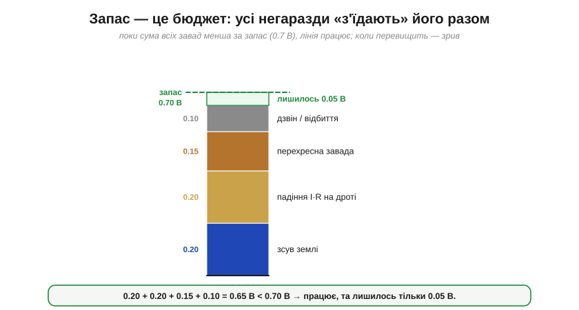
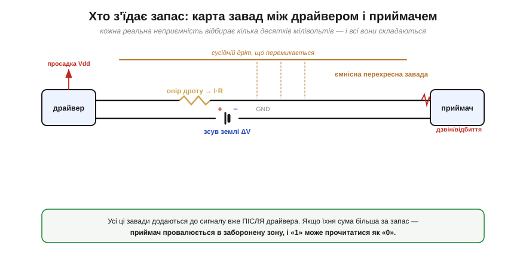
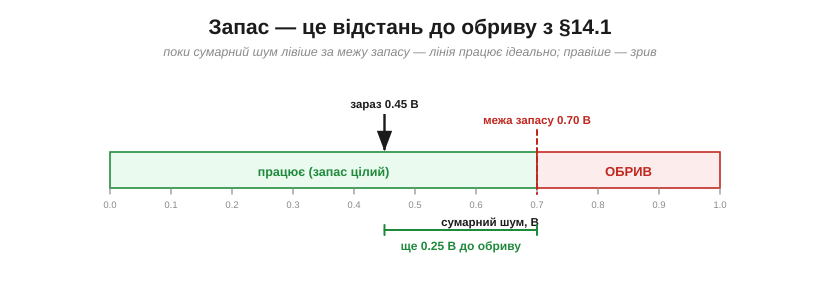

# Запас завадостійкості (noise margin)

Між тим, що драйвер видає, і тим, що приймач вимагає, лишається «подушка» — і саме її варто виміряти числом. Ця подушка має точну назву — **запас завадостійкості** (*noise margin*) — і вона є числовим утіленням [стійкості цифри](book:electronics/why-digital): каже, **скільки рівно вольтів шуму** лінія проковтне, перш ніж «1» прочитається як «0». Питання не в тому, **чому** цифра стійка, а в тому, **наскільки** — у вольтах, які можна порахувати й порівняти.

### Означення: різниця між тим, що дають, і тим, що вимагають

Запас рахується окремо для одиниці й для нуля, бо й пороги для них різні. У гри чотири [рівні-діапазони](book:electronics/logic-levels-as-ranges): драйвер видає «1» не нижче **VOH**, а приймач упізнає «1» уже від **VIH**. Оскільки VOH (3.0 В) **вище** за VIH (2.3 В), між ними лишається зазор — і це **запас для високого рівня**:

```
NMH = VOH − VIH          (noise margin, High)
```

Симетрично для нуля: драйвер видає «0» не вище **VOL**, а приймач читає «0» аж до **VIL**. Оскільки VOL (0.3 В) **нижче** за VIL (1.0 В), знову лишається зазор — **запас для низького рівня**:

```
NML = VIL − VOL          (noise margin, Low)
```


*Рис. На одній шкалі — усі чотири рівні й два запаси. Зелена смуга вгорі (між VOH і VIH) — це NMH: на стільки може просісти «1», перш ніж приймач засумнівається. Зелена смуга внизу (між VIL і VOL) — NML: на стільки може піднятися «0». Посередині — заборонена зона. Праворуч — уся арифметика: для нашого прикладу обидва запаси по 0.7 В.*

Підставмо наші числа (узагальнений КМОН на 3.3 В):

```
NMH = VOH − VIH = 3.0 − 2.3 = 0.7 В
NML = VIL − VOL = 1.0 − 0.3 = 0.7 В
```

Отже, на цій лінії **0.7 вольта** шуму — це та межа, у яку ще можна вкластися. Це і є та [«яма» стійкості цифрового рівня](book:electronics/why-digital), лише тепер виміряна лінійкою.

### Стійкість лінії — це менший із двох запасів

Запасів два, але лінія настільки стійка, наскільки стійкий її **слабший** бік. Якщо одиниця терпить 0.7 В шуму, а нуль — лише 0.3 В, то вся лінія «зламається» першою саме на нулі, щойно шум перевалить за 0.3 В. Тому загальну **завадостійкість** беруть як мінімум двох:

```
запас лінії = min(NMH, NML)
```

У нашому прикладі обидва запаси рівні (0.7 В), тож і стійкість лінії — 0.7 В. У реальних [логічних сімействах](book:electronics/logic-families) вони часто несиметричні, і тоді саме менший із них визначає, скільки шуму можна стерпіти. Це типова інженерна логіка «найслабшої ланки»: ланцюг рветься там, де тонко.

> 🔧 **Навіщо це.** Коли ви читаєте даташит і бачите окремо NMH і NML (або обчислюєте їх із VOH/VIH/VOL/VIL) — завжди дивіться на **менший**. Саме він каже, який найбільший шумовий стрибок лінія переживе без помилки. І саме тому інженери недолюблюють несиметричні сімейства зі слабким одним боком: «середній» запас звучить пристойно, а ламається все по тонкому боку. Запас лінії — це не середнє, а мінімум.

### Запас — це бюджет на всі негаразди

Тепер найважливіше для практики. Запас — це не абстрактне число, а **бюджет**, який доводиться **ділити** між усіма реальними неприємностями, що псують сигнал по дорозі. Кожна з них відкушує свій шматок; працює лінія доти, доки **сума всіх відкушених шматків** менша за запас.


*Рис. Запас 0.7 В як стовпчик бюджету. Знизу його «з'їдають»: зсув землі (0.20 В), падіння напруги на опорі дроту (0.20 В), перехресна завада від сусіда (0.15 В), дзвін і відбиття (0.10 В). Сума — 0.65 В, тож лінія ще працює, але зеленої «подушки» лишилося всього 0.05 В. Ще одна дрібна завада — і зрив.*

Це пояснює, чому цифрова лінія, що «завжди працювала», раптом починає збоїти, коли поряд увімкнули потужний мотор, або коли подовжили дріт, або коли просіло живлення: усі ці чинники **складаються** в один бюджет, і досить останній краплі переповнити його, як надійні 0 і 1 розсипаються. Запас не зникає поступово — він **витрачається**, як гроші з рахунку.

**Приклад (бюджет шуму).** Лінія має запас 0.7 В. Інженер оцінив завади: зсув землі між платами ≈ 0.2 В, падіння на опорі довгого дроту ≈ 0.2 В, перехресна завада від сусідньої шини ≈ 0.15 В, дзвін на вході ≈ 0.1 В. Чи працюватиме?

```
сума завад = 0.20 + 0.20 + 0.15 + 0.10 = 0.65 В
запас      = 0.70 В
0.65 В < 0.70 В   →   працює, але впритул (лишилось 0.05 В)
```

Лінія працює — та запас майже вичерпано. Якби дріт був ще довшим (падіння 0.3 замість 0.2 В), сума стала б 0.75 В > 0.7 В, і лінія почала б помилятися. Ось чому «начебто працює» — небезпечний стан: між «впритул працює» і «зривається» лежить якихось 50 мілівольтів.

### Хто з'їдає запас: вороги сигналу

Варто знати ворогів в обличчя — бо боротьба за надійну цифру здебільшого зводиться до того, щоб **не дати їм з'їсти запас**.


*Рис. Шлях сигналу від драйвера до приймача — і засідки на ньому. **Зсув землі** (різниця потенціалів між «нулями» двох пристроїв) зрушує всі пороги. **Падіння I·R** на опорі дроту просто віднімає напругу від сигналу. **Перехресна завада** — це наведення від сусіднього дроту, що перемикається, крізь паразитну ємність. **Просадка живлення** опускає VOH драйвера. **Дзвін і відбиття** на вході гойдають сигнал біля порога. Усе це додається вже після драйвера — і з'їдає той самий бюджет.*

Найпідступніший із них — **зсув землі** (*ground offset / ground bounce*), і саме він пояснює, навіщо двом пристроям [спільна земля](book:electronics/common-ground). Якщо «нуль» приймача насправді на 0.2 В вищий за «нуль» драйвера (бо по спільному дроту GND тече струм і створює на його опорі падіння), то всі рівні, які приймач міряє **відносно свого** нуля, зсунуті — наче хтось підняв йому планку. Тому товстий, короткий, малоопірний спільний GND — це не педантизм, а пряма економія запасу. Решта ворогів — падіння на опорі сигнального дроту, ємнісне наведення від сусідів, відбиття на довгих лініях, просадки живлення — теж б'ють у той самий бюджет, і кожен мілівольт, відвойований у них, повертається в запас.

### Запас — це відстань до обриву

У [цифри є «прірва»](book:electronics/why-digital): сигнал тримається ідеальним — аж до різкого обриву. Тепер видно, **де саме** той обрив: він рівно на відстані «запасу» від поточного рівня шуму. Запас — це і є **відстань до краю прірви**.


*Рис. Шкала сумарного шуму. Зелена зона (до межі запасу 0.70 В) — лінія працює бездоганно; за нею — обрив. Поточний шум (0.45 В) лишає ще 0.25 В «ходу» до зриву. Проєктувати «на межі» (коли вістря майже впритул до червоного) — означає віддати всю стійкість і молитися, щоб жодна завада не підросла.*

Звідси й мудрість проєктування: добрий запас — це не марнотратство, а **сон спокійним**. Лінія з 0.25 В вільного запасу переживе і трохи довший дріт, і ввімкнений поряд мотор, і слабший екземпляр чипа. Лінія, відлагоджена «щоб ледь працювало», зірветься від першої ж зміни умов — і шукати такий невловимий баг доведеться годинами.

### Запас масштабується з живленням

Наостанок — практичний наслідок, про який часто забувають. У КМОН пороги задані як **частки живлення** — наближено VIL ≈ 0.3·Vdd, VIH ≈ 0.7·Vdd (це зручна **типова модель**; конкретні чипи різняться — наприклад, ESP32 за даташитом задає VIL ≈ 0.25·Vdd, VIH ≈ 0.75·Vdd), а виходи тиснуться майже до шин. Тому й запас виходить порядку **(0.25…0.3)·Vdd з кожного боку** — тобто він **пропорційний напрузі живлення**.


*Рис. Той самий «відсотковий» запас 0.3·Vdd дає зовсім різні **вольти** за різного живлення: ≈ 1.5 В на 5 В, ≈ 1.0 В на 3.3 В, ≈ 0.55 В на 1.8 В. Тому той самий абсолютний шум 0.4 В на 5 В — дрібниця, а на 1.8 В з'їдає майже весь запас. Низьковольтна логіка економніша, але «тендітніша» до тих самих наведень.*

Це одна з прихованих цін гонитви за низьким живленням (а вона є скрізь — заради економії енергії). Опускаючи Vdd з 5 до 1.8 В, ми втричі зменшуємо **абсолютний** запас, тож ті самі завади, що були нешкідливі, раптом стають критичними. Низьковольтні лінії вимагають акуратнішого монтажу — коротших дротів, кращої землі, ретельнішого розведення.

**Приклад (3.3 проти 1.8 В).** Поряд проходить шумна шина, що наводить на сигнал ≈ 0.4 В завади. Чи витримає лінія за різного живлення (запас ≈ 0.3·Vdd)?

```
Vdd = 3.3 В:  запас ≈ 0.3 × 3.3 ≈ 1.0 В   →  0.4 В « 1.0 В   надійно
Vdd = 1.8 В:  запас ≈ 0.3 × 1.8 ≈ 0.55 В  →  0.4 В ≈ 0.55 В  на межі!
```

Та сама схема, та сама завада — і цілком надійна на 3.3 В лінія стає ненадійною на 1.8 В. Не помінялося нічого, крім живлення; помінявся запас.

> 🔧 **Навіщо це.** Звідси — практичний набір звичок. Хочеш зберегти запас: тримай спільну землю товстою й короткою; не веди сигнальні дроти впритул до шумних силових; став [конденсатори-розв'язки](book:electronics/capacitor-uses) біля живлення кожного чипа; на довгих лініях думай про узгодження; а де сигнал млявий — [підправляй фронт](book:electronics/edges-rise-time) чи став [тригер Шмітта](book:electronics/threshold-schmitt). Кожна з цих дій — це повернений у бюджет мілівольт. І завжди лишай **запас на запас**: проєктуй так, щоб у найгіршому збігу завад до обриву ще лишалася відстань.

---

**Запас завадостійкості** — це числова міра стійкості цифрової лінії, різниця між тим, що драйвер гарантує, і тим, що приймач вимагає: NMH = VOH − VIH і NML = VIL − VOL, а стійкість лінії = **min(NMH, NML)** (вирішує слабший бік). Запас — це **бюджет**, який спільно з'їдають зсув землі, падіння I·R, перехресні завади, дзвін і просадки живлення; лінія працює, поки їхня сума менша за запас. Це і є **відстань до «обриву»**, за яким надійні 0 і 1 розсипаються, — тож добрий запас означає спокій. І він **масштабується з Vdd** (≈ 0.3·Vdd у КМОН), тож низьковольтна логіка за ту саму економію енергії платить меншою абсолютною стійкістю — і вимагає акуратнішого монтажу. Конкретні числа порогів і запасів різняться від [сімейства до сімейства](book:electronics/logic-families): саме тому 3.3-вольтова мікросхема не завжди порозуміється з 5-вольтовою.

---
