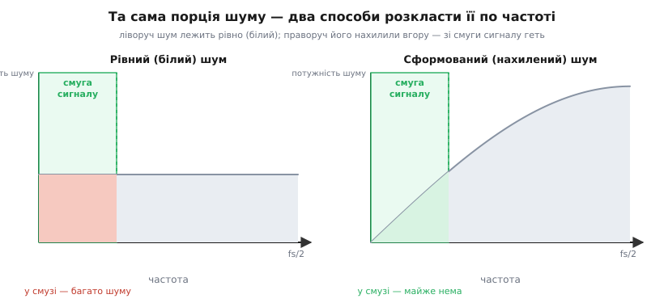
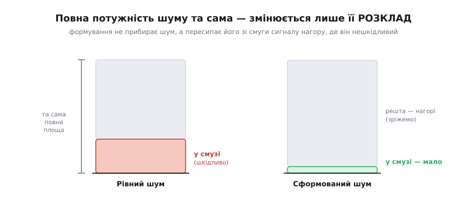
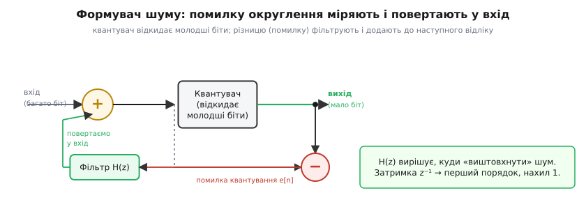

# Формування шуму

Уявімо просту й прикру ситуацію. Маємо звук, записаний акуратно — у кожному відліку 24 чесні біти. А віддати його треба на носій, де місця лише на 16 біт. Вісім молодших бітів доведеться відрубати. Це **переквантування** (*requantization*; від лат. *quantum* — порція): беремо число, що жило на дрібній сітці рівнів, і силоміць садимо його на грубшу. І щоразу при цьому ми трохи брешемо — округлюємо до найближчого з небагатьох доступних щаблів, а різницю викидаємо. Ця викинута різниця, домішана до сигналу, і є [шум квантування](book:electronics/sampling-quantization): тонкий, майже випадковий бруд, не більший за половину кроку нової сітки.

Здавалося б, тут нема ради: рівнів мало, округлення неминуче, бруд буде. Та ось у чому несподіванка. Бруд **є** — від нього не втекти, біти цілі. Але ми вільні розпорядитися тим, **де по частотах** цей бруд осяде. Можна лишити його рівно розмазаним по всьому спектру — так зробить наївне округлення. А можна хитро **відсунути** його з тієї частотної смуги, яка нам дорога, нагору — туди, де він нікому не заважає або де його легко відрізати. Шум не меншає; він **переїжджає**. Оце переселення шуму геть із важливої смуги й зветься **формуванням шуму** (*noise shaping*) — буквально «надати шумові форми» в частотній області.

> 🔧 **Навіщо це.** Це не трюк лише для аудіофілів. Той самий прийом — серце [дельта-сигма АЦП](book:electronics/sigma-delta-adc) і [дельта-сигма ШІМ](book:electronics/sigma-delta-pwm): грубий, одно-бітний квантувач плюс зворотний зв'язок дають на виході 16–24 чесні біти точності. Формування шуму дозволяє **обміняти швидкість на роздільність** — там, де прямого способу дістати потрібні біти немає. У прошивці воно з'являється щоразу, коли треба втиснути широке число у вузький вихід (ЦАП, ШІМ, екран із малою глибиною кольору) і не зіпсувати при цьому корисну смугу.

## Ключова думка: шум зберігається, форма — ні

Перш ніж лізти в механізм, варто міцно вхопити одну річ, бо вона неінтуїтивна. Округлення кидає у сигнал певну **повну потужність** шуму, і цю повну потужність формуванням **не зменшити** — вона задана грубістю сітки рівнів, і край. Що формування справді робить — це **перерозподіляє** ту саму потужність по частотах. Якщо в одній смузі шуму поменшало, то рівно настільки ж його побільшало в іншій.


*Ліворуч — наївне округлення: шум лежить рівно («білий»), і чимала його частина припадає на смугу сигналу (зелене), де він шкодить. Праворуч — сформований шум: криву нахилили вгору, до нуля коло низьких частот; у смузі сигналу шуму майже не лишилося, зате нагорі його стало більше. Повна площа під обома кривими однакова — шум не зник, він переїхав.*

Чому це взагалі допомагає? Бо **корисна смуга майже завжди вузька**, а решта спектра нам байдужа. Звук, який чує вухо, — це нижні кілька кілогерців із гаком; усе, що вище, можна викинути фільтром, не зачепивши музики. Повільний сигнал давача займає частки герца; кілогерци над ним — порожнеча. Тож якщо весь бруд зігнати **нагору**, за межі корисної смуги, а потім зрізати тамтешній діапазон, у сигналі лишиться **дуже мало** шуму — куди менше, ніж кинуло б рівне округлення. Виходить майже даровий виграш у роздільності: не додавши жодного біта на виході, ми зробили корисну смугу чистішою.

Аналогія — прибирання в кімнаті. Підмести сміття ви не можете (його стільки, скільки є), але можете **замести його під килим** у кутку, де ніхто не ходить. Гостям видно чисту підлогу. Аналогія точна рівно доти, доки «кут» справді нікому не потрібен: якщо ваша корисна смуга раптом сягне того кута (вузька смуга стане широкою), замітати буде нікуди — шум полізе назад під ноги. Тому формування шуму завжди йде в парі з умовою «корисна смуга — лише частина спектра».


*Той самий шум двома стовпчиками. Ліворуч (рівне округлення) частина шуму в смузі сигналу пропорційна ширині смуги. Праворуч (формування) майже весь шум виштовхнуто нагору, за смугу, де його зріже фільтр; у самій смузі — мала дещиця. Повна висота стовпчиків однакова: переселяємо, не прибираємо.*

## Механізм: повертай свою помилку назад

Як саме нахилити спектр шуму? Прийом напрочуд простий, і вся його сила — в одній ідеї: **пам'ятати власну помилку й виправляти її наступного разу**.

Розгляньмо наївне округлення. Воно округлює кожен відлік **сам по собі**, ні на що не озираючись. Округлили 1.4 до 1 — викинули 0.4 і забули. Округлили 1.6 до 2 — додали 0.4 і забули. Помилки сусідніх відліків ніяк не пов'язані між собою; вони незалежні, а отже — рівномірно розкидані по всіх частотах. Це й є білий шум.

Формувач робить інакше. Він **запам'ятовує**, на скільки збрехав цього разу, і **віднімає** цю брехню з наступного відліку перед його округленням. Округлив 1.4 до 1 — переплатив, лишилася помилка −0.4; наступного відліку він заздалегідь додасть ці 0.4, щоб скомпенсувати. Помилка більше не вільна гуляти як завгодно: модулятор **навмисне** жене її то вгору, то вниз, такт за тактом, тримаючи в середньому коло нуля. А «то вгору, то вниз, щотакту» — це **швидке** хитання, тобто **висока** частота. Ось і весь фокус: повертаючи свою помилку назад, формувач перетворює повільний, рівно розмазаний шум на швидкий, що тулиться до верхів спектра.


*Блок-схема формувача. Квантувач відкидає молодші біти. Окремий суматор міряє різницю «до округлення мінус після» — це помилка квантування e[n]. Її пропускають крізь фільтр і повертають у головний суматор, додаючи до наступного відліку. Фільтр H(z) і вирішує, у який бік спектра «виштовхнути» шум: проста затримка на такт дає формувач першого порядку.*

Подивімося на цей самий механізм у часі — і стане видно, **звідки** береться висока частота. Корисний сигнал змінюється поволі, тож і помилка округлення в сусідніх відліках майже однакова. Формувач віддає на вихід **різницю** «цьогоразова помилка мінус минулоразова», e[n] − e[n−1]. Різниця двох близьких чисел мала, якщо вони міняються плавно, і скаче, якщо швидко. Тобто формувач — це **дискретна похідна** помилки, а похідна гасить повільне й підкреслює швидке. Повільні (низькочастотні) складові шуму майже зникають, швидкі (високочастотні) — лишаються й навіть підростають. Саме тому крива на спектрі нахиляється вгору: внизу її притиснув до нуля той самий доданок «мінус минула помилка».

![Перший порядок у часі: e[n] − e[n−1] хитається швидко й тримається коло нуля](/book/electronics/digital/noise-shaping/img/time.svg)
*Сіра пунктирна крива — сира помилка округлення: повільна й мала. Червона — те, що формувач реально віддає у вихід: різниця сусідніх помилок e[n] − e[n−1]. Вона стрибає від відліку до відліку й тримається коло нуля. Швидке хитання = висока частота: цю енергію легко зрізати фільтром поза смугою сигналу.*

Чому це краще за просто «додати трохи випадковості»? Бо є інший, давніший прийом боротьби зі шкідливим округленням — [дрож](book:electronics/adc-resolution/math-dithering.md) (*dither*): підмішати в сигнал перед округленням крихітний випадковий шум, щоб розбити регулярну, чутну на слух «сходинковість». Але дрож шум **додає** і розкидає його **рівно** по всіх частотах — він робить бруд приємнішим, та не прибирає його зі смуги. Формування — інша філософія: воно не маскує шум випадковістю, а **виганяє** його зі смуги геть. На практиці їх часто поєднують — спершу дрож для лінійності, тоді формування, щоб додану випадковість теж відсунути нагору, — але це різні інструменти з різною метою.

## Скільки виграємо й чим платимо

Виграш не безкоштовний, і важливо бачити обидві сторони угоди.

**Перша сторона — порядок формувача.** Описаний вище формувач із однією затримкою — **першого порядку**: він нахиляє спектр шуму помірно. Поставимо в зворотний зв'язок складніший фільтр (фактично продиференціюємо помилку двічі) — дістанемо **другий порядок**, що тисне шум коло низьких частот ще сильніше, а вгору задирає крутіше. Кількісно для оверсемпленої системи перший порядок прибирає зі смуги близько 9 дБ (півтора біта роздільності) на кожне подвоєння [передискретизації](book:electronics/oversampling-decimation), другий — близько 15 дБ (два з половиною біти), і так далі. Звідки беруться саме ці цифри й чому в загальному випадку нахил дорівнює порядку — окрема, але неминуча алгебра: одне віднімання минулої помилки в z-площині перетворюється на множник (1−z⁻¹), і весь спектр шуму випливає з нього. Цей вивід — від першого множника до децибелів на октаву — розгорнуто у вставці [Як зворотний зв'язок родить (1−z⁻¹) і нахил шуму](book:electronics/noise-shaping/math-ntf-shaping.md).

**Друга сторона — ціна.** Шум, виштовхнутий нагору, **доведеться там прибрати** — інакше вся переселена енергія повернеться й нашумить навіть гірше, ніж без формування. Прибирають його двома способами, що зазвичай ідуть разом: **передискретизація** (брати відліки набагато частіше, ніж того вимагає корисна смуга, — тоді «вільного» місця нагорі, куди зсувати шум, стає багато) і подальша **децимація** (відфільтрувати верх і проріджити потік назад до потрібної частоти). Без цієї пари формування саме по собі марне: модулятор лише зсуває бруд, а зрізає його фільтр. Тому порядок формувача й смугу фільтра ніколи не настроюють поодинці — лише разом.

> 🔧 **Навіщо це.** Звідси прямий інженерний висновок: формування шуму — це **обмін надлишкової швидкості на роздільність**. Якщо ваш квантувач (АЦП, ЦАП, ШІМ) може працювати набагато швидше, ніж того потребує сигнал, ви можете спалити цю зайву швидкість на чистоту: грубо квантувати, але часто, формувати шум угору й зрізати його. Саме так копійчаний 1-бітний модулятор у [дельта-сигма АЦП](book:electronics/sigma-delta-adc) дає 24 біти. І саме тому, обираючи такий АЦП, ви бачите в даташиті не «біти» поодинці, а трійку «біти ↔ частота вибірки ↔ смуга»: підняти роздільність можна, лише віддавши швидкість.

## Як це виглядає в коді

Формувач першого порядку для переквантування — це буквально кілька рядків. Нехай маємо потік 16-бітних відліків, а віддати треба 8-бітний (типова ситуація: глибокий буфер → вузький ЦАП чи екран). Наївно було б просто взяти старший байт. Формувач натомість тягне за собою помилку.

**Переквантування 16 біт → 8 біт із формуванням першого порядку.** Ключ — змінна `err`, що пам'ятає недокинуту минулого разу решту.

:::tabs
```cpp
#include <cstdint>

// Формувач шуму 1-го порядку: 16-бітний вхід -> 8-бітний вихід.
// err тримає помилку округлення між викликами (звідси static).
uint8_t shape_16_to_8(uint16_t sample) {
    static int32_t err = 0;          // накопичена помилка попереднього відліку

    int32_t v = (int32_t)sample + err;   // додаємо борг минулого разу

    // округлюємо до найближчого 8-бітного рівня (крок = 256)
    int32_t q = (v + 128) & ~0xFF;       // ділимо й множимо на 256 із заокругленням
    if (q > 0xFF00) q = 0xFF00;          // не вилазимо за діапазон
    if (q < 0)      q = 0;

    err = v - q;                         // нова помилка = скільки НЕ влізло

    return (uint8_t)(q >> 8);            // старший байт — і є 8-бітний код
}
```
```python
# Формувач шуму 1-го порядку: 16-бітний вхід -> 8-бітний вихід.
# err тримає помилку округлення між викликами (звідси атрибут функції).
def shape_16_to_8(sample):
    v = sample + shape_16_to_8.err     # додаємо борг минулого разу

    # округлюємо до найближчого 8-бітного рівня (крок = 256)
    q = (v + 128) & ~0xFF              # ділимо й множимо на 256 із заокругленням
    if q > 0xFF00:
        q = 0xFF00                    # не вилазимо за діапазон
    if q < 0:
        q = 0

    shape_16_to_8.err = v - q         # нова помилка = скільки НЕ влізло

    return q >> 8                     # старший байт — і є 8-бітний код

shape_16_to_8.err = 0                 # накопичена помилка попереднього відліку
```
:::

Простежмо, що тут діється, на двох тактах. Хай приходять два однакові відліки `0x0180` (= 384), а старший байт обох — `0x01` (= 256 у вихідному масштабі), тобто наївне округлення обидва рази недоклало по 128.

```
такт 1:  v = 384 + 0   = 384
         q = (384+128) & ~0xFF = 512 & 0xFF00 = 512  → байт 0x02
         err = 384 − 512 = −128            (цього разу переклали на 128)

такт 2:  v = 384 + (−128) = 256
         q = (256+128) & ~0xFF = 384 & 0xFF00 = 256  → байт 0x01
         err = 256 − 256 = 0
```

Дивіться, що сталося. Наївне округлення видало б `0x01, 0x01` — постійну, рівну помилку −128 на обох тактах (це низькочастотний, шкідливий шум). Формувач видав `0x02, 0x01` — він **смикнувся** вгору-вниз, і в середньому два його відліки дають рівно 384, без зсуву. Помилка з повільної постійної перетворилася на швидку знакозмінну — переїхала вгору по частоті, геть зі смуги сигналу. Ось і все формування: один рядок `err = v - q` плюс `+ err` на вході.

> 🔧 **Навіщо це.** Цей самий шаблон — основа програмного формувача будь-де: вивід звуку через ШІМ, керування яскравістю світлодіода з малою розрядністю таймера, дизеринг кольору на дешевому дисплеї. Скрізь, де широке число треба віддати у вузький вихід **потоком у часі**, формувач першого порядку коштує одну змінну стану й кілька тактів процесора, а виграє відчутну чистоту в корисній смузі. Для серйознішого результату (звук, точне вимірювання) той самий принцип нарощують до вищих порядків — повний робочий код із другим порядком і захистом від нестійкості зібрано у вставці [Формувач у прошивці: переквантування потоком](book:electronics/noise-shaping/proj-error-feedback.md).

## Звідки це взялося

Думка «грубий квантувач у петлі зворотного зв'язку дає тонку точність» не нова — їй уже близько сімдесяти років. Принцип уперше описав інженер Bell Labs **Чапін Катлер** (*C. Chapin Cutler*) у патенті, поданому 1954 року (виданий 1960-го, US 2,927,962): саме там з'явилася ідея поставити квантувач у петлю, що стежить за власною похибкою. А завершену архітектуру з інтегратором у прямому тракті — і саму назву «дельта-сигма» — дали **Хіросі Іносе**, **Ясухіко Ясуда** й **Дж. Муракамі** з Токійського університету в статті 1962 року про телеметрію. Це доконаний приклад **колективного, поетапного винаходу**: ідея, патент, зворотний зв'язок, інтегратор і назва — внески різних людей у різних країнах протягом років. Як саме складалася ця історія й чому архітектура носить дві грецькі літери, докладно розказано у вставці [Дельта-сигма: як грубий компаратор навчили бачити на 24 біти](book:electronics/adc-types/hist-delta-sigma.md).

Окремо варто згадати, де формування живе сьогодні в чистому, програмному вигляді — поза перетворювачами. Коли студійний запис із 20–24 бітами треба видати на компакт-диск (16 біт), просте відрубування молодших бітів додало б чутний на тихих місцях шум. Тому в 1990-х з'явилися алгоритми **психоакустичного** формування — вони нахиляють спектр шуму квантування так, щоб він ховався в тих частотах, де вухо найменш чутливе. Sony назвала свій варіант Super Bit Mapping, Apogee — UV22: обидва піднімають шум туди, де його не чути (близько 22 кГц), і притискають коло 4 кГц, де слух найгостріший. Принцип той самий, що в копійчаному модуляторі АЦП, — лише форму спектра підібрано не під фільтр, а під вухо.

Отже, за всім розмаїттям — від 24-бітного давача ваги до майстрингу компакт-диска — стоїть одна проста думка. Шум квантування неминучий, бо рівнів скінченна кількість; його повну потужність не зменшити. Але можна **пам'ятати власну помилку й повертати її назад**, перетворюючи шум на його дискретну похідну, — і тоді він переселяється геть із дорогої нам смуги нагору, під ніж фільтра. Не додавши жодного біта на виході, ми робимо корисну смугу чистішою — ціною надлишкової швидкості, яку віддаємо за роздільність.
