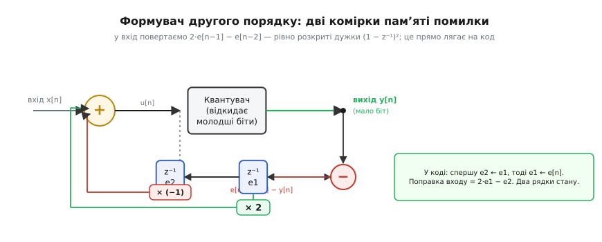
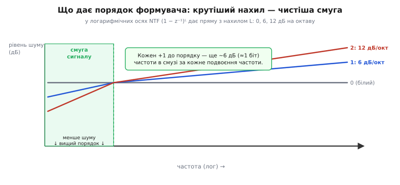

# ⚙️ Формувач у прошивці: переквантування потоком

## Задача, яку насправді доводиться розв'язувати

Уявімо звичайну прошивку невеликого мікроконтролера, яка має **озвучити щось через одну ніжку**. Динамік підключено до виводу таймера, що працює як [широтно-імпульсний модулятор](topic:electronics/pwm-dac-filter) — ЦАП для бідних: середня напруга на ніжці задається шпаруватістю. Таймер тактується, скажімо, 16 МГц, а нам треба видавати звук частотою вибірки 32 кГц. Це означає, що на кожен звуковий відлік припадає 16 000 000 / 32 000 = 500 тактів таймера. Отже, шпаруватість ми можемо задати числом від 0 до 500 — трохи менше за 9 бітів роздільності. А приходить нам звук у 16-бітних (а часом 24-бітних) відліках із файлу чи буфера.

Маємо класичне **переквантування** (*requantization*): широке вхідне число треба втиснути у вузький вихід. Наївно взяти старші біти — і тихі місця запису потонуть у грубому, деренчливому шумі, бо різниця між сусідніми доступними рівнями шпаруватості завелика. А слух до цього шуму на тихому нещадний.

Той самий клас задачі виринає всюди в прошивці, не лише зі звуком:
- керування **яскравістю світлодіода** таймером із малою розрядністю (8-бітний лічильник дає лише 256 щаблів — на око видно сходинки при плавному згасанні);
- виведення **напівтонів на дешевий дисплей** із 4–6 бітами на канал кольору (градієнт розпадається на смуги — *banding*);
- підготовка потоку для зовнішнього **1-бітного або малорозрядного ЦАП**, який фізично не має потрібної роздільності.

Скрізь одне: у нас на руках більше бітів, ніж влазить у вихід, і викидати молодші **абияк** не можна. Але є важлива обставина, яка все рятує, — **вихід ми віддаємо потоком у часі, багато відліків підряд, і корисний сигнал у ньому займає лише вузьку нижню смугу**. Саме на цьому й будується весь прийом: якщо ми не можемо зробити кожен окремий відлік точним, ми можемо зробити точним **середнє по багатьох відліках** — і зіпхати неминучу похибку в ті частоти, куди корисному сигналу байдуже.

Чому такий зсув похибки взагалі можливий і чому повна її потужність при цьому не меншає, а лише переселяється по спектру, докладно розібрано в самій темі. Тут же — інженерна, кодова сторона: як це написати так, щоб воно **працювало в реальному переривальнику, рахувалося цілими числами й не зривалося**. Далі скрізь спираємося на головну статтю [Формування шуму](topic:electronics/noise-shaping) — сам механізм зворотного зв'язку тут не переказуємо, беремо готовим і перетворюємо на прошивку.

> 🔧 **Навіщо це.** Формувач шуму — це рядок-другий коду й одна змінна стану, що перетворюють копійчаний вихід (одну ніжку ШІМ, дешевий ЦАП, 6-бітний колір) на щось із чутно чи візуально вищою роздільністю. Ви не додаєте жодного біта заліза — ви **платите зайвою швидкістю вибірки за чистоту в корисній смузі**. Це один із найдешевших відомих способів купити якість, і він майже завжди доречний там, де широке число віддають у вузький вихід.

## Ідея в одному абзаці — і як вона стає кодом

Механізм формування зводиться до однієї дії: **запам'ятати, на скільки збрехало округлення цього відліку, і додати цей борг до наступного відліку перед його округленням**. Похибка більше не викидається й не забувається — вона переноситься вперед і гаситься. Через це округлення сусідніх відліків стають зв'язаними: якщо цього разу переклали, наступного недоклали, — і похибка починає **хитатися туди-сюди щотакту** замість того, щоб рівно лежати постійним зсувом. А швидке хитання щотакту — це висока частота. Ось так повільна, шкідлива похибка перетворюється на швидку, яку легко вигнати зі смуги сигналу нагору.

У коді це буквально виглядає як три дії на кожен відлік:

```
1.  u = вхід + борг            (додаємо накопичену похибку)
2.  y = квантувати(u)          (відкидаємо молодші біти — з правильним округленням)
3.  борг = u − y               (нова похибка = скільки НЕ влізло)
```

Уся хитрість — у тому, **скільки минулих боргів** і **з якими вагами** ми повертаємо. Повернемо тільки останній борг з вагою 1 — дістанемо **формувач першого порядку** (нахил спектра шуму помірний). Повернемо комбінацію двох останніх боргів з вагами 2 і −1 — **другий порядок** (нахил удвічі крутіший, смуга ще чистіша). Звідки саме такі ваги — побачимо нижче; це не магія, а розкриті дужки виразу (1 − z⁻¹)² з математики теми.

## Крок нуль: чесне округлення й насичення (перший порядок, готовий до бою)

Стаття-власник показала найкоротший можливий формувач — 16 біт у 8 з бітовими масками. Він добрий, щоб побачити суть, але в реальній прошивці його не досить: там треба **правильно округляти** (а не відрубувати), **тримати діапазон** (щоб борг не виштовхнув значення за межі виходу) і працювати з **цілими числами фіксованим форматом**, бо на дрібному мікроконтролері немає плаваючої коми, а якщо є — вона задорога для переривальника.

Візьмімо конкретику: 16-бітний беззнаковий вхід (0…65535), 9-бітний вихід шпаруватості ШІМ (0…500, як у задачі вище). Крок квантування — не степінь двійки, а 500 рівнів на весь діапазон, тож бітові маски не годяться; рахуватимемо чесним діленням.

**Формувач 1-го порядку: 16-бітний вхід → шпаруватість 0…500, з округленням і насиченням.** Ключ — знакова змінна `err`, що переносить недокинуту решту між викликами.

:::tabs
```cpp
#include <cstdint>

constexpr int32_t PWM_TOP =   500;     // період таймера: рівні шпаруватості 0..500
constexpr int32_t IN_MAX  = 65535;     // повний розмах 16-бітного входу

// Формувач шуму 1-го порядку. Викликати на КОЖЕН звуковий відлік.
// err зберігає похибку між викликами (звідси static), у масштабі ВХОДУ.
uint16_t shape1(uint16_t sample) {
    static int32_t err = 0;              // борг попереднього відліку

    int32_t u = (int32_t)sample + err;   // додаємо борг у масштабі входу

    // квантуємо u (0..IN_MAX) у рівень 0..PWM_TOP з округленням до найближчого:
    //   level = round(u * PWM_TOP / IN_MAX)
    int32_t level = (u * PWM_TOP + IN_MAX / 2) / IN_MAX;

    // насичення: борг не має права виштовхнути нас за межі виходу
    if (level < 0)       level = 0;
    if (level > PWM_TOP) level = PWM_TOP;

    // назад у масштаб входу — що ми РЕАЛЬНО віддали цим рівнем
    int32_t y = (level * IN_MAX + PWM_TOP / 2) / PWM_TOP;

    err = u - y;                         // нова похибка = скільки не влізло

    return (uint16_t)level;              // це й вантажимо в регістр порівняння таймера
}
```
```python
PWM_TOP =   500   # період таймера: рівні шпаруватості 0..500
IN_MAX  = 65535   # повний розмах 16-бітного входу

# Формувач шуму 1-го порядку. Викликати на КОЖЕН звуковий відлік.
# Похибку зберігаємо в атрибуті функції (звідси .err), у масштабі ВХОДУ.
def shape1(sample):
    u = sample + shape1.err              # додаємо борг у масштабі входу

    # квантуємо u (0..IN_MAX) у рівень 0..PWM_TOP з округленням до найближчого:
    #   level = round(u * PWM_TOP / IN_MAX)
    level = (u * PWM_TOP + IN_MAX // 2) // IN_MAX

    # насичення: борг не має права виштовхнути нас за межі виходу
    level = max(0, min(level, PWM_TOP))

    # назад у масштаб входу — що ми РЕАЛЬНО віддали цим рівнем
    y = (level * IN_MAX + PWM_TOP // 2) // PWM_TOP

    shape1.err = u - y                   # нова похибка = скільки не влізло

    return level                         # це й вантажимо в регістр порівняння таймера

shape1.err = 0                           # борг попереднього відліку
```
:::

Тут три речі, яких не було в іграшковій версії, і кожна не випадкова.

**Округлення, а не відрубування.** `+ IN_MAX/2` перед діленням — це округлення до найближчого рівня замість завжди-вниз. Без нього квантувач має **систематичний зсув** (завжди недокладає пів кроку), і формувач мусив би все життя виправляти цей постійний борг замість справжнього шуму. Дрібниця, а псує все: зсув — це стала на нульовій частоті, тобто рівно та низькочастотна складова, яку ми найбільше хочемо прибрати.

**Зворотне перетворення `y`.** Похибку треба міряти в тому самому масштабі, що й вхід. Ми віддали не число `level` (0…500), а напругу, яку воно означає в масштабі входу, — тому `y` перераховуємо назад. Якби ми написали `err = u - level`, масштаби б не збіглися й борг ріс би без міри. Це найпоширеніша прихована помилка в саморобних формувачах: **похибку рахують не в тих одиницях**.

**Насичення до `err = u - y` калічить чистоту — і це неминуче.** Поки значення в межах діапазону, формувач ідеальний: усе, що недоклали, повертається. Та щойно ми вперлися в стелю (`level = PWM_TOP`) чи підлогу, `y` більше не дорівнює `u`, і в борг записується величезна невиправна різниця. На гучних піках, що впираються в межу, формування частково ламається — і це принципова межа методу, а не хиба коду. Порятунок один: **лишати запас (headroom)**, не заганяючи вхід упритул до країв. Про це нижче окремо, бо це головна практична пастка.

## Другий порядок: два борги, ваги 2 і −1

Перший порядок нахиляє спектр шуму помірно. Для звуку чи точного вимірювання хочеться крутіше — щоб у нижній смузі шуму лишалося ще менше. Це дає **другий порядок**: замість одного минулого боргу повертаємо комбінацію **двох** останніх.

Звідки ваги? Формувач першого порядку віддає у вихід різницю e[n] − e[n−1] — це множник (1 − z⁻¹) у z-площині. Другий порядок — це та сама дія, застосована **двічі**: (1 − z⁻¹)². Розкриймо дужки:

```
(1 − z⁻¹)² = 1 − 2·z⁻¹ + z⁻²
```

Читаємо коефіцієнти: до поточної похибки додається **мінус подвоєна** попередня (−2·z⁻¹) і **плюс** позапопередня (+z⁻²). У зворотному зв'язку, де ми **віднімаємо** внесок похибки з входу, це обертається на поправку входу «**плюс 2·e[n−1] мінус e[n−2]**». Ось і вся арифметика: дві комірки пам'яті замість однієї, ваги 2 і −1. Повне виведення цих коефіцієнтів і чому нахил спектра дорівнює порядку — у вставці [Як зворотний зв'язок родить (1−z⁻¹) і нахил шуму](topic:electronics/noise-shaping/math-ntf-shaping.md); тут беремо результат і кладемо його в код.


*Формувач другого порядку в залізо-подібному вигляді. Праворуч — квантувач. Різницю «до округлення мінус після» ловить суматор помилки; далі вона проходить дві затримки на такт (комірки e1 і e2). У головний суматор входу повертаються два тапи: подвоєна попередня похибка (× 2, зелений) і віднята позапопередня (× (−1), червоний). Ці два тапи — і є розкриті дужки (1 − z⁻¹)²; у коді вони стають рядком `2*e1 − e2`.*

У коді порядок оновлення станів важливий: спершу зсунути старе (`e2 ← e1`), тоді записати нове (`e1 ← поточна похибка`). Переплутаєш черговість — і формувач рахуватиме різницю не з тими затримками.

**Формувач 2-го порядку, ще цілочисловий і насичуваний.** Дві змінні стану `e1`, `e2` замість однієї; поправка входу — `2*e1 − e2`.

:::tabs
```cpp
#include <cstdint>

constexpr int32_t PWM_TOP =   500;
constexpr int32_t IN_MAX  = 65535;

// Формувач шуму 2-го порядку. NTF = (1 - z^-1)^2.
uint16_t shape2(uint16_t sample) {
    static int32_t e1 = 0, e2 = 0;       // дві останні похибки (масштаб входу)

    // поправка входу: 2*e1 - e2  (розкриті дужки (1 - z^-1)^2)
    int32_t u = (int32_t)sample + 2 * e1 - e2;

    int32_t level = (u * PWM_TOP + IN_MAX / 2) / IN_MAX;
    if (level < 0)       level = 0;
    if (level > PWM_TOP) level = PWM_TOP;

    int32_t y = (level * IN_MAX + PWM_TOP / 2) / PWM_TOP;
    int32_t e = u - y;                   // нова похибка

    e2 = e1;                             // ЗСУВ станів: спершу старе
    e1 = e;                              // тоді нове

    return (uint16_t)level;
}
```
```python
PWM_TOP =   500
IN_MAX  = 65535

# Формувач шуму 2-го порядку. NTF = (1 - z^-1)^2.
def shape2(sample):
    # поправка входу: 2*e1 - e2  (розкриті дужки (1 - z^-1)^2)
    u = sample + 2 * shape2.e1 - shape2.e2

    level = (u * PWM_TOP + IN_MAX // 2) // IN_MAX
    level = max(0, min(level, PWM_TOP))

    y = (level * IN_MAX + PWM_TOP // 2) // PWM_TOP
    e = u - y                            # нова похибка

    shape2.e2 = shape2.e1                # ЗСУВ станів: спершу старе
    shape2.e1 = e                        # тоді нове

    return level

shape2.e1 = shape2.e2 = 0                # дві останні похибки (масштаб входу)
```
:::

Різниця з першим порядком — рівно три символи в арифметиці (`2*e1 - e2` замість `err`) плюс зсув двох станів. А виграш відчутний: у смузі сигналу шуму стає помітно менше. Наскільки саме — залежить від того, наскільки часто ми беремо відліки понад потрібне (від [передискретизації](topic:electronics/oversampling-decimation)), і масштабується з порядком.


*Що купує кожен порядок. У логарифмічних осях NTF (1 − z⁻¹)ᴸ — пряма з нахилом L. Порядок 0 (наївне округлення) — рівна лінія: шум усюди однаковий. Порядок 1 нахиляє її на 6 дБ на октаву, порядок 2 — на 12. Що крутіше крива падає ліворуч, у смузі сигналу, то менше там шуму. Праворуч, за смугою, шуму натомість більше — але його зріже фільтр.*

Числа за цим нахилом варто назвати точно, бо в літературі їх подають двояко й це збиває з пантелику. **Нахил самого спектра шуму** (те, що на малюнку) — це 6·L децибелів на октаву: 6 дБ для першого порядку, 12 для другого. А **приріст роздільності системи за кожне подвоєння частоти вибірки** включає ще й 3 дБ від самого проріджування смуги, тому виходить (6·L + 3) дБ на октаву: перший порядок ≈ 9 дБ (близько півтора біта), другий ≈ 15 дБ (близько двох з половиною бітів). Обидві цифри правильні — вони просто рахують різні речі: нахил кривої проти повного виграшу системи. Тримайте це розрізнення в голові, читаючи чужі даташити.

## Головна пастка: стійкість, насичення й запас

Тепер найважливіше, чого немає в іграшковому прикладі й через що саморобні формувачі найчастіше «деренчать» чи «свистять».

### Чому не можна просто нарощувати порядок

Спокуса очевидна: якщо другий порядок кращий за перший, то четвертий буде ще кращий? Із таким формувачем зі зворотним зв'язком (*error feedback*) — **ні, і саме тут криється небезпека**. Починаючи з третього порядку, одноконтурний формувач цього типу стає **умовно стійким**: за певних входів (найчастіше — сигнал близько до країв діапазону, або довгий сталий рівень) петля зворотного зв'язку розганяє власну похибку замість того, щоб її гасити. Стани `e1`, `e2`, `e3`… починають рости від такту до такту, поправка входу роздувається, значення впирається в межу, насичення записує в борг ще більшу різницю — і петля йде в **самозбудження** (*limit cycle*): на виході з'являється гучний паразитний тон або тріск, який не має нічого спільного з корисним сигналом.

Це не гіпотетика й не хиба реалізації — це властивість самої архітектури. Практичний висновок такий: **простим формувачем зі зворотним зв'язком безпечно користуватися до другого порядку включно; перший і другий за розумного запасу стійкі завжди**. Якщо потрібен вищий порядок (студійний звук, високоточне вимірювання), його не роблять одним контуром. Його **збирають каскадом** зі стійких ланок першого-другого порядку — така схема зветься **MASH** (*Multi-stAge noise SHaping*, багатоступеневе формування шуму): кожна ланка окремо стійка, а їхні виходи складають цифровим фільтром так, що похибки нижчих ланок скорочуються, і разом вони дають нахил високого порядку **без ризику самозбудження**. MASH — безумовно стійкий за побудовою саме тому, що в ньому немає одного глибокого контуру, який можна розгойдати. Це та сама ідея, що працює в [дельта-сигма АЦП](topic:electronics/sigma-delta-adc) високого порядку. У прошивці для звуку й індикації другого порядку зазвичай досить, тож MASH згадуємо як напрям, а не як щоденний інструмент.

### Насичення калічить формування — тому потрібен запас

Повернімося до `err = u - y` при впертому в межу виході. Поки все в діапазоні, формувач ідеальний. Але кожне насичення — це **розрив зворотного зв'язку**: борг, який ми не змогли віддати, накопичується, і на виході чути хрип. Що вищий порядок, то злісніше: у другого порядку внесок `2*e1 - e2` при розгойданих станах сам може загнати навіть помірний вхід за межу.

Ліки — **запас (headroom)**: не подавати на формувач сигнал упритул до країв. На практиці вхід тримають десь на 1–3 дБ нижче від повного розмаху, лишаючи зверху й знизу трохи місця, куди формувачу є куди штовхати похибку, не впираючись у стінку. Для звуку це майже задарма (пара децибелів гучності), а деренчання на піках зникає. Практичне правило: **дай формувачеві дихати** — трохи звузь вхідний діапазон, і насичення перестане його калічити.

Про всяк випадок варто ще **обмежувати самі стани** — насичувати `e1`, `e2` розумною величиною (наприклад, кількома повними розмахами входу). Це не «правильна» математика формувача, а страхувальна сітка: якщо через якийсь патологічний вхід стани таки полізли вгору, обмеження не дасть їм піти в нескінченність і зірвати петлю в гучний тон. Ловиш непояснимий свист чи тріск на певних сигналах — **перше, що перевіряй, — чи не розгойдалися й не переповнилися стани**.

### Холості тони — і навіщо тут дрож

Є ще одна тонка неприємність, окрема від стійкості. При **сталому або дуже повільному вході** (тиша в записі, незмінна яскравість) формувач може впасти в короткий періодичний цикл округлень — і цей цикл дає **холостий тон** (*idle tone*): слабкий, але чутний свист на певній частоті, якого в сигналі нема. Механізм той самий, що родить самозбудження, лише мирний: похибка не розганяється, а зациклюється.

Лікують це **дрожем** (*dither*) — крихітним випадковим числом, яке підмішують перед квантуванням, щоб розбити регулярність циклу. Дрож і формування — **різні інструменти**, і це варто чітко розуміти. Дрож **додає** трохи шуму й розкидає його рівно, роблячи похибку випадковою (та прибираючи тони); формування **пересуває** шум зі смуги геть. На практиці їх **поєднують**: спершу дрож — щоб квантувач став лінійним і без тонів, тоді формування — щоб і цю додану випадковість теж відсунути нагору, за смугу. Докладніше про сам дрож і чому досить шуму амплітудою в один крок квантування — у вставці [Дрож: як випадковість лінеаризує квантувач](topic:electronics/adc-resolution/math-dithering.md). У коді додати дрож — це один рядок: перш ніж квантувати `u`, додати до нього невеликий випадковий доданок розміром порядку кроку квантування.

## Повний робочий формувач для переривальника

Зберімо все докупи в один шматок, придатний для реального аудіо-переривальника: другий порядок, чисто цілочисловий, з насиченням, обмеженням станів і необов'язковим дрожем. Такий код спокійно живе в обробнику переривання таймера й коштує кілька десятків тактів.

**Готовий 2-й порядок для ISR: 16 біт → шпаруватість, з насиченням, обмеженням станів і дрожем.**

:::tabs
```cpp
#include <cstdint>
#include <algorithm>

constexpr int32_t PWM_TOP     =   500;          // рівні шпаруватості 0..500 (~9 біт)
constexpr int32_t IN_MAX      = 65535;          // повний розмах 16-бітного входу
constexpr int32_t STATE_CLAMP = 4 * IN_MAX;     // страхувальна межа для станів похибки

// Простий і швидкий генератор псевдовипадкового для дрожу (xorshift).
static inline int32_t dither_step() {
    static uint32_t s = 0x1234567u;      // будь-яке ненульове зерно
    s ^= s << 13; s ^= s >> 17; s ^= s << 5;
    // трикутний дрож амплітудою ~один крок квантування (IN_MAX/PWM_TOP):
    int32_t step = IN_MAX / PWM_TOP;                 // розмір одного вихідного рівня у масштабі входу
    int32_t a = (int32_t)(s & 0xFFFF) - 32768;       // рівномірний -32768..32767
    int32_t b = (int32_t)((s >> 16) & 0xFFFF) - 32768;
    return ((a + b) * step) / 65536;                 // сума двох рівномірних = трикутний, масштабований під крок
}

// Головна функція: один звуковий відлік -> код шпаруватості 0..PWM_TOP.
// Викликати з обробника переривання таймера на частоті вибірки.
uint16_t shape2_isr(uint16_t sample) {
    static int32_t e1 = 0, e2 = 0;

    // 1) поправка входу зворотним зв'язком: 2*e1 - e2  =  (1 - z^-1)^2
    int32_t u = (int32_t)sample + 2 * e1 - e2;

    // 2) дрож перед квантуванням — розбиває холості тони й лінеаризує квантувач
    int32_t ud = u + dither_step();

    // 3) квантування з округленням до найближчого рівня
    int32_t level = (ud * PWM_TOP + IN_MAX / 2) / IN_MAX;
    level = std::clamp(level, 0, PWM_TOP);          // насичення виходу

    // 4) похибку міряємо БЕЗ дрожу (дрож — не помилка, його повертати не треба):
    //    те, що реально віддали цим рівнем, назад у масштаб входу
    int32_t y = (level * IN_MAX + PWM_TOP / 2) / PWM_TOP;
    int32_t e = u - y;

    // 5) зсув і страхувальне обмеження станів (проти розгойдування)
    e2 = std::clamp(e1, -STATE_CLAMP, STATE_CLAMP);
    e1 = std::clamp(e,  -STATE_CLAMP, STATE_CLAMP);

    return (uint16_t)level;
}
```
```python
PWM_TOP     =   500          # рівні шпаруватості 0..500 (~9 біт)
IN_MAX      = 65535          # повний розмах 16-бітного входу
STATE_CLAMP = 4 * IN_MAX     # страхувальна межа для станів похибки

def clamp(v, lo, hi):
    return lo if v < lo else (hi if v > hi else v)

# Простий і швидкий генератор псевдовипадкового для дрожу (xorshift).
def dither_step():
    s = dither_step.s                    # будь-яке ненульове зерно
    s ^= (s << 13) & 0xFFFFFFFF
    s ^= s >> 17
    s ^= (s << 5) & 0xFFFFFFFF
    dither_step.s = s
    # трикутний дрож амплітудою ~один крок квантування (IN_MAX/PWM_TOP):
    step = IN_MAX // PWM_TOP              # розмір одного вихідного рівня у масштабі входу
    a = (s & 0xFFFF) - 32768             # рівномірний -32768..32767
    b = ((s >> 16) & 0xFFFF) - 32768
    return ((a + b) * step) // 65536     # сума двох рівномірних = трикутний, масштабований під крок

dither_step.s = 0x1234567

# Головна функція: один звуковий відлік -> код шпаруватості 0..PWM_TOP.
# Викликати з обробника переривання таймера на частоті вибірки.
def shape2_isr(sample):
    # 1) поправка входу зворотним зв'язком: 2*e1 - e2  =  (1 - z^-1)^2
    u = sample + 2 * shape2_isr.e1 - shape2_isr.e2

    # 2) дрож перед квантуванням — розбиває холості тони й лінеаризує квантувач
    ud = u + dither_step()

    # 3) квантування з округленням до найближчого рівня
    level = (ud * PWM_TOP + IN_MAX // 2) // IN_MAX
    level = clamp(level, 0, PWM_TOP)     # насичення виходу

    # 4) похибку міряємо БЕЗ дрожу (дрож — не помилка, його повертати не треба):
    #    те, що реально віддали цим рівнем, назад у масштаб входу
    y = (level * IN_MAX + PWM_TOP // 2) // PWM_TOP
    e = u - y

    # 5) зсув і страхувальне обмеження станів (проти розгойдування)
    shape2_isr.e2 = clamp(shape2_isr.e1, -STATE_CLAMP, STATE_CLAMP)
    shape2_isr.e1 = clamp(e,             -STATE_CLAMP, STATE_CLAMP)

    return level

shape2_isr.e1 = shape2_isr.e2 = 0
```
:::

Кілька рішень тут неочевидні й варті пояснення.

**Похибку міряємо від `u`, а не від `ud`.** Дрож ми додали навмисне — це не помилка квантування, а корисна домішка. Якби ми записали в борг `ud - y`, формувач старанно «виправляв» би власний дрож наступного разу, знищуючи саме той ефект, заради якого дрож додавали. Тому квантуємо `ud`, а похибку рахуємо як `u - y`. Це тонке місце, на якому спотикаються навіть уважні.

**Трикутний дрож, не прямокутний.** Сума двох рівномірних випадкових дає **трикутний** розподіл, і саме він (амплітудою в два кроки квантування «від піка до піка», тобто ±один крок) робить залишковий шум незалежним від сигналу — прибирає не лише тони, а й ефект «шум дихає разом із гучністю» (*noise modulation*). Прямокутний дрож у один крок тони прибирає, та цей другий, тонший дефект лишає. Для звуку трикутний — стандарт.

**`int32_t` не переповнюється?** Перевірмо найгірший випадок. `u = sample + 2*e1 - e2`; при `sample ≤ 65535` і станах, обмежених `±4·IN_MAX ≈ ±262140`, маємо `|u| ≲ 65535 + 3·262140 ≈ 852 тис.` Далі `u * PWM_TOP ≈ 852000 · 500 ≈ 4.3·10⁸` — це ще в межах `int32_t` (границя ≈ 2.15·10⁹). Запас є, але **тонкий**: якби вихід був не 500, а, скажімо, 4095 (12-бітний ШІМ), добуток `u*TOP` виріс би в вісім разів і **вискочив би за int32**. Тоді проміжок треба рахувати в `int64_t` або міняти порядок операцій (ділити раніше). **Завжди прикидай найгірший добуток руками** — мовчазне переповнення тут дає не збій, а тихо-спотворений звук, який годинами шукаєш.

Простежмо роботу на кількох тактах, щоб побачити перенос похибки живцем. Хай дрож поки вимкнено (щоб числа були чисті), а на вхід приходить сталий рівень `sample = 300` (у масштабі входу). Один вихідний рівень коштує IN_MAX/PWM_TOP = 65535/500 ≈ 131 у масштабі входу; 300 лежить між рівнями 2 (=262) і 3 (=393), ближче до 2.

```
такт 1:  u = 300 + 2·0 − 0 = 300
         level = (300·500 + 32767)/65535 = 182767/65535 = 2   → шпаруватість 2
         y = (2·65535 + 250)/500 = 131320/500 = 262
         e = 300 − 262 = 38
         зсув: e2 = 0,  e1 = 38

такт 2:  u = 300 + 2·38 − 0 = 376
         level = (376·500 + 32767)/65535 = 220767/65535 = 3   → шпаруватість 3
         y = (3·65535 + 250)/500 = 196855/500 = 393
         e = 376 − 393 = −17
         зсув: e2 = 38, e1 = −17

такт 3:  u = 300 + 2·(−17) − 38 = 228
         level = (228·500 + 32767)/65535 = 146767/65535 = 2   → шпаруватість 2
         y = 262
         e = 228 − 262 = −34
         зсув: e2 = −17, e1 = −34
```

Дивіться, що коїться. Наївне округлення сталого входу 300 видавало б рівень 2 щоразу — постійний недолік у 38 одиниць, тобто низькочастотну, чутну похибку. Формувач видав послідовність рівнів **2, 3, 2, …** — він **смикається** між сусідніми рівнями так, що їхнє середнє прямує до справжніх 300. Похибка з постійної перетворилася на знакозмінну, що хитається коло нуля, — переїхала вгору по частоті, геть зі смуги. І весь цей ефект тримається на двох рядках стану плюс поправці `2*e1 - e2`.

## Фіксований формат: коли степенів двійки таки досить

Приклади вище чесно ділять на 500, бо період ШІМ не круглий. Але **дуже часто** вихід — це степінь двійки (відкидаємо N молодших бітів: 16→8, 24→16, 10→8 для дисплея). Тоді ділення й множення стають зсувами, і формувач стискається до кількох найшвидших операцій — саме та форма, що годиться для найгарячіших переривальників.

**Формувач 2-го порядку на зсувах: відкинути N молодших бітів (тут 16 → 8).** Жодного ділення — самі зсуви й маски.

:::tabs
```cpp
#include <cstdint>

constexpr int DROP    = 8;                        // скільки молодших бітів відкидаємо (16 -> 8)
constexpr int OUT_MAX = (1 << (16 - DROP)) - 1;   // 255 для 8-бітного виходу

uint8_t shape2_shift(uint16_t sample) {
    static int32_t e1 = 0, e2 = 0;

    int32_t u = (int32_t)sample + 2 * e1 - e2;

    // округлення до найближчого рівня = додати півкроку (1<<(DROP-1)) і відкинути DROP біт
    int32_t level = (u + (1 << (DROP - 1))) >> DROP;
    if (level < 0)        level = 0;
    if (level > OUT_MAX)  level = OUT_MAX;

    int32_t y = level << DROP;        // назад у масштаб входу — просто зсув
    int32_t e = u - y;

    e2 = e1;
    e1 = e;

    return (uint8_t)level;
}
```
```python
DROP    = 8                        # скільки молодших бітів відкидаємо (16 -> 8)
OUT_MAX = (1 << (16 - DROP)) - 1   # 255 для 8-бітного виходу

def shape2_shift(sample):
    u = sample + 2 * shape2_shift.e1 - shape2_shift.e2

    # округлення до найближчого рівня = додати півкроку (1<<(DROP-1)) і відкинути DROP біт
    level = (u + (1 << (DROP - 1))) >> DROP
    level = max(0, min(level, OUT_MAX))

    y = level << DROP                 # назад у масштаб входу — просто зсув
    e = u - y

    shape2_shift.e2 = shape2_shift.e1
    shape2_shift.e1 = e

    return level

shape2_shift.e1 = shape2_shift.e2 = 0
```
:::

Тут `y = level << DROP` — точний зворотний зсув, тож похибка `u - y` рахується без жодного заокруглювального сміття, а `>> DROP` із додаванням півкроку — це те саме округлення до найближчого, що вище робилося діленням. Ця форма коштує буквально кілька тактів і не чіпає ані ділення, ані таблиць — її й ставлять у виведення звуку через ШІМ, дизеринг кольору чи керування яскравістю, коли вихідна розрядність кратна двійці.

> 🔧 **Навіщо це.** Різниця між «поділити на 500» і «зсунути на 8» — це різниця між кількома десятками тактів і кількома тактами. У переривальнику, що спрацьовує 32–96 тисяч разів на секунду, це відчутно. Тому, проєктуючи вихід, варто **свідомо обрати розрядність кратною двійці**, якщо є вибір: тоді формувач стає майже безкоштовним. Якщо ж період диктує залізо (як ті 500 тактів на відлік), лишається чесне ділення — воно теж дешеве на будь-якому сучасному ядрі з апаратним множенням-діленням, просто не безплатне.

## Пастки на купу — короткий перелік

Зберемо в одному місці все, на чому саморобний формувач найчастіше спотикається, — щоб було куди зазирнути, коли щось «деренчить» чи «свистить».

- **Похибку рахуй у масштабі входу.** `err = u - y`, де `y` — реально відданий рівень, перерахований назад у вхідний масштаб. Найпоширеніша тиха помилка — порахувати похибку в одиницях виходу; тоді борг росте без міри.
- **Округлюй, не відрубуй.** Без додавання півкроку перед квантуванням квантувач має сталий зсув — низькочастотну похибку, яку формувач приречений вічно виправляти замість справжнього шуму.
- **Насичення калічить формування — лишай запас.** На впертих у межу піках зворотний зв'язок рветься, і чути хрип. Тримай вхід на 1–3 дБ нижче від країв, дай формувачеві куди штовхати похибку.
- **Не піднімай порядок вище двох одним контуром.** Із третього порядку простий формувач зі зворотним зв'язком умовно стійкий і може зірватися в гучний паразитний тон. Треба вище — бери каскад (MASH) зі стійких ланок.
- **Обмежуй стани про всяк випадок.** Насичуй `e1`, `e2` кількома розмахами входу — страхувальна сітка проти розгойдування на патологічних сигналах.
- **Слідкуй за переповненням проміжку.** `u * TOP` при широкому вході й великому TOP легко вискакує за `int32_t`. Прикинь найгірший добуток руками; де тісно — рахуй у `int64_t`.
- **Дрож — окремо від формування, і похибку міряй без дрожу.** Додавай дрож перед квантуванням проти холостих тонів, але в борг клади `u - y`, а не `ud - y`, — інакше формувач знищить власний дрож.
- **Черговість зсуву станів.** Спершу `e2 = e1`, тоді `e1 = e`. Переплутаєш — рахуватимеш різницю не з тими затримками, і нахил спектра буде не той.

За всім цим стоїть одна проста думка, з якої почали: похибку не викидаємо, а **переносимо вперед і повертаємо**, перетворюючи повільний шкідливий шум на швидкий, що тулиться до верхів спектра. Другий порядок — це та сама дія двічі, ваги 2 і −1; стійкість тримається запасом і помірним порядком; чистоту доводить до пуття дрож. Кілька рядків коду й дві змінні стану — а на виході одна ніжка ШІМ звучить так, наче в ній набагато більше бітів, ніж є насправді.
