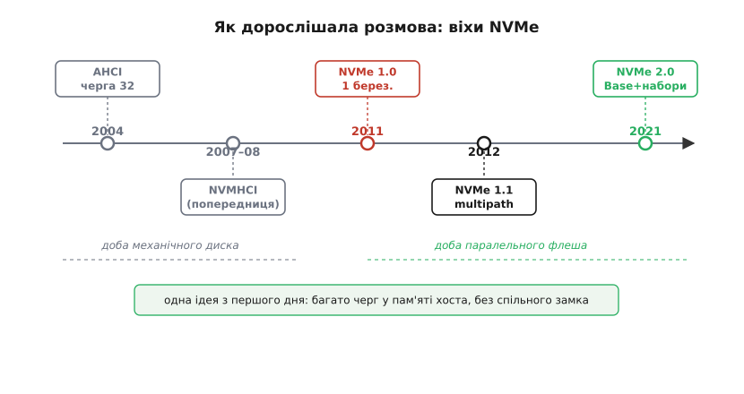

# 📜 Як народжувалася розмова, гідна швидкої пам'яті

Найцікавіше в історії NVMe те, що новий протокол зробили **ті самі люди**, які перед тим збудували стару розмову — і збудували її свідомо для повільного заліза. Це не випадок, коли молоді бунтарі повалили закам'янілий стандарт. Це випадок, коли інженери, що роками писали протокол для дисків, які **крутяться**, першими побачили, що їхнє власне творіння душить нове залізо, — і сіли переписувати з нуля. Щоб відчути вагу цього рішення, треба спершу зрозуміти, що саме їх мучило.

## Чому чудовий протокол раптом став гальмом

Наприкінці 2000-х у комп'ютерах панувала **AHCI** (*Advanced Host Controller Interface*) — спосіб, яким система розмовляла з дисками по шині SATA. Intel випустив AHCI 1.0 ще **2004 року** (а версію 0.95 — у травні 2003-го, щоб виробники встигли зробити перші контролери SATA). Це був добрий стандарт для свого часу. Він приніс **власну чергу команд** (*Native Command Queuing*, NCQ): диск міг тримати **до 32** команд нараз і виконувати їх не в тому порядку, в якому подали, а в тому, який зручніший головці. Для механічного диска це справжня знахідка. Головка совається фізично; якщо їй дати наперед десяток запитів, вона обслужить їх одним розумним рухом замість десяти совань туди-сюди. Тридцять дві команди — з великим запасом більше, ніж диск устигне виконати, поки головка їздить.

І тут криється пастка, яку не видно, поки залізо не змінилося. Число **32** ніхто не витягнув з математики паралельності. Його продиктувала **фізика головки**: більше команд напоготові механічному диску просто ні до чого, бо він і 32-ох не встигне зжерти швидше. AHCI був точно скроєний під те залізо, яке існувало, — і в цьому була його чеснота, а не вада.

Проблема прийшла, коли під той самий протокол підклали **зовсім інше залізо**. SSD — це кілька кристалів [NAND-флеша, що їх контролер ховає за простими секторами](topic:electronics/emmc-ssd). У нього немає головки. Усередині — десятки незалежних каналів, кожен готовий читати й писати **водночас** з рештою. Такий пристрій міг би тримати в польоті **сотні тисяч** дрібних операцій за секунду. Але коли його підключали через AHCI, він упирався в ту саму стелю, вибудувану під головку: **одна** черга, **32** команди, і щоб покласти команду, ядро процесора мусило взяти спільний **замок** (*lock*). На повільному диску той замок нічого не коштував — черга й так порожня більшість часу. На швидкому SSD, куди сиплеться злива запитів, боротьба ядер за єдиний замок і єдину коротку чергу з'їдала більше часу, ніж сама робота пам'яті.

> 🔧 **Навіщо це.** Ось чому історія тут не прикраса, а пояснення. Коли інженери бачили, що новісінький SSD «не розганяється», перша думка була — винна пам'ять чи контролер. А винна була **розмова**: протокол, зроблений під головку, тримав паралельний флеш за одну коротку чергу під замком. Зрозуміти це означало зрозуміти, що лагодити треба не залізо, а **домовленість** між залізом і системою. Саме це усвідомлення й запустило NVMe.

Вийшла гірка іронія. AHCI не був поганим — він був **надто добрим** для свого заліза. Кожне його рішення мало сенс для диска, що крутиться. Але жодне з них не мало сенсу для флеша, що всередині паралельний. Стандарт не застарів морально — просто залізо під ним підмінили, і всі колишні чесноти обернулися путами.

## Хто це побачив першим

Тут варто назвати ім'я, бо навколо нього крутиться вся ця історія, і назвати точно. Стару розмову — і SATA, і AHCI — значною мірою писала **Амбер Гаффман** (*Amber Huffman*), інженерка Intel. Вона прийшла в Intel 1998 року й від самого початку займалася інтерфейсами вводу-виводу та пам'яті. Її ранні роботи — це прототипи й частини стандарту **SATA**; за них вона отримала Intel Achievement Award. Тобто людина, яка згодом очолить розробку NVMe, перед тим **власними руками** будувала той самий світ послідовної шини й черги на 32, який NVMe прийшов замінити.

Це рідкісний і повчальний випадок. Найкраще побачити ваду інструмента може той, хто його зробив і роками ним користувався. Гаффман не була сторонньою, яка вказала пальцем на чужу помилку, — вона переросла власне рішення. Коли флеш почав приходити на місце дисків, саме інженери зі світу SATA/AHCI, з Гаффман у центрі, першими відчули, де саме тисне комір, — бо вони цей комір самі й пошили.

> 🔧 **Навіщо це.** Для того, хто пише прошивку чи стандарти, тут захований важливий урок про природу інженерії. Жодне технічне рішення не «правильне» назавжди — воно правильне **для певного заліза й певної задачі**. Черга на 32 була ідеальна для головки й безглузда для флеша, і це не суперечність: змінилося залізо. Уміння вчасно сказати «моє старе рішення тепер шкодить» цінніше за вміння захищати його з гордості. NVMe народився саме з такої чесності — люди переписали те, що самі колись побудували.

Варто відразу відділити **ім'я від міфу**. Легко переказати цю історію як «геніальна одиначка винайшла NVMe». Це неправда, і сама Гаффман так не каже. Вона **сформувала й очолила робочу групу** — а протокол писали **десятки компаній** разом. Її роль — не «винайшла сама», а «зібрала правильних людей за один стіл і провела складну домовленість до готового стандарту». Це інша, теж рідкісна, але зовсім не одиночна заслуга. Далі ми побачимо, наскільки колективною була ця робота.

## Фальстарт з правильною назвою: NVMHCI

Перш ніж з'явився NVMe, була його **попередниця з майже тією самою назвою** — і сплутати їх легко, тож проговорімо різницю чітко. На Intel Developer Forum **2007 року** Intel показала **NVMHCI** (*Non-Volatile Memory Host Controller Interface*) — інтерфейс господаря до енергонезалежної пам'яті. Того ж року зібрали робочу групу NVMHCI під проводом Intel. Задум був парний: з боку самих кристалів флеша стандартизувати їхній інтерфейс мала окрема група — **ONFI** (*Open NAND Flash Interface*), а з боку системи до контролера мав говорити NVMHCI. Специфікацію **NVMHCI 1.0** завершили у **квітні 2008-го** й виклали на сайті Intel.

Але NVMHCI ще не був тим NVMe, який ми знаємо. Він народився занадто рано й дивився не туди. Його задумували радше як спосіб чіпляти флеш-пам'ять поближче до системи — не як повноцінний протокол для швидких SSD на окремій швидкій шині. Головного стрибка — **багато глибоких черг у пам'яті хоста, кожному ядру своя, по швидкій шині PCIe** — у ньому ще не було. NVMHCI був радше пробою пера: назва й намір уже вказували правильний бік («енергонезалежна пам'ять заслуговує свого інтерфейсу»), але саме рішення ще тягло на собі звички старого світу.

Це типова риса живої історії техніки, і її варто позначити чесно: перша спроба рідко влучає. NVMHCI — не «перший NVMe», а **фальстарт із правильною назвою**. Він показав, що проблему бачать, дав словник і робочу групу — але справжня, переламна конструкція мала прийти пізніше, коли стане ясно, що флешу треба **власна швидка дорога** (PCIe), а не куток на старій шині.

## Друга спроба: технічна робота над справжнім NVMe

Справжня технічна робота над NVMe почалася в **другій половині 2009 року** — і цього разу з правильним припущенням у самому фундаменті. Пам'ять треба посадити на швидку послідовну шину **PCIe**, дати кожному ядру процесора **власну** пару черг прямо в оперативній пам'яті хоста, а черги зробити **дуже** глибокими й дуже численними. Не 32 команди в одному віконці під замком, а **до 65 535** черг, кожна **до 65 536** команд. Число вже диктувала не фізика головки, а сама природа паралельного заліза: черг рівно стільки, скільки треба потоків, без спільного замка.

Групу очолила **Амбер Гаффман** (*Amber Huffman*) з Intel як голова робочої групи. І це вже не була вузька команда однієї компанії. Над специфікацією працювали **понад 90 компаній** — виробники контролерів, флеша, серверів, операційних систем. Причина такої юрби проста й важлива: **протокол має сенс лише тоді, коли його підтримують усі боки**. Можна написати найкращий інтерфейс на світі, та якщо його не вкладуть у свої драйвери Microsoft і творці ядра Linux, у свої контролери — Samsung і Micron, у свої сервери — Dell і Cisco, він лишиться папером. Тому NVMe від початку робили **навмисне колективним**: за столом мали сидіти ті, хто потім це втілюватиме.

Плід цієї роботи вийшов **1 березня 2011 року** — специфікація **NVM Express 1.0**. Ось точна дата народження розмови, скроєної під швидку пам'ять. Не 2007-й (то NVMHCI, попередниця), не 2009-й (то початок роботи) — саме **1 березня 2011-го** з'явився готовий стандарт 1.0.


*Як дорослішала розмова. AHCI (2004) — вершина доби механічного диска: одна черга на 32 під головку. NVMHCI (2007–08) — рання попередниця з правильною назвою, але ще без стрибка. NVMe 1.0 (1 березня 2011) — переламна конструкція: багато глибоких черг у пам'яті хоста по PCIe. Далі розмова тільки дорослішала: 1.1 (2012) і 2.0 (2021). Наскрізна нитка від першого дня — багато черг без спільного замка.*

Щоб побачити, що це справді був колективний проєкт, а не витвір однієї фірми, досить глянути на дальші кроки. У **червні 2011-го** зібрали **промоутерську групу** з семи компаній, а в **березні 2014-го** оформили окрему юридичну особу — **NVM Express, Inc.** До її ради директорів увійшли тринадцятеро: Cisco, Dell, EMC, HGST, Intel, Micron, Microsoft, NetApp, Oracle, PMC, Samsung, SanDisk і Seagate. За цим переліком видно все коло, від якого залежить доля стандарту: хто робить контролери, хто флеш, хто сервери, хто операційні системи. Тому обережно з формулюванням: **не «Intel винайшла NVMe»**, а «NVMe народився в робочій групі під проводом інженерки Intel, за участю десятків компаній». Intel дала голову групи й чималу частину інженерії — але стандарт від початку був спільним, інакше він би просто не злетів.

## Скільки коштувало перевести розмову на нові рейки

Тут корисно на мить відчути, **звідки** береться виграш NVMe в числах — саме це й гнало інженерів переписувати протокол. Уся суперечка «стара розмова проти нової» зводилася до однієї величини: скільки роботи процесор витрачає, щоб **подати** одну команду накопичувачу.

**Приклад (чому замок дорожчий за роботу).** Порахуймо на простій, свідомо приблизній моделі. Нехай швидкий SSD здатний проковтнути **500 000** дрібних операцій за секунду. Скільки часу лишається процесору на **одну** команду?

```
бюджет на команду = 1 секунда / 500 000 операцій
                  = 2 000 нс (наносекунд) на одну команду
```

Дві тисячі наносекунд — це весь час, за який треба встигнути подати команду й прийняти відповідь. А тепер прикинемо, скільки з'їдає **боротьба за спільний замок** старої розмови. Коли кілька ядер б'ються за один замок, кожне узяття-віддача під суперечкою коштує сотні наносекунд (кеш-рядок із замком доводиться ганяти між ядрами):

```
узяти й віддати спільний замок під суперечкою ≈ 300…500 нс
частка бюджету, з'їдена лише замком        ≈ 300 / 2000 ≈ 15 %
```

П'ятнадцять відсотків усього часу — **тільки на замок**, ще до будь-якої корисної роботи. І це на чотирьох ядрах; на двадцяти боротьба стає ще лютішою, бо той самий рядок пам'яті рветься між усіма. У NVMe цього рядка **немає**: кожне ядро пише у **свою** чергу й дзвонить у **свій** дзвінок, ні з ким не змагаючись.

```
NVMe: ядро пише у власну чергу      → 0 нс на суперечку
      узяття спільного замка         → його просто нема
```

Висновок прикладу: виграш NVMe — не магія й не «швидша пам'ять». Це прибраний **податок на суперечку**, який стара розмова брала з кожної команди. Коли операцій сотні тисяч на секунду, навіть 300 наносекунд на кожну складаються в помітну частку — і саме ці відсотки, помножені на зливу запитів, робили новий протокол не забаганкою, а необхідністю.

> 🔧 **Навіщо це.** Ця арифметика пояснює, чому NVMe робили попри те, що AHCI «начебто працював». На повільному диску ті самі 300 наносекунд губилися в мілісекундах механіки — їх ніхто не помічав. На швидкому флеші вони раптом стали **видимою третиною бюджету**. Історія стандарту — це історія того, як залізо пришвидшилося настільки, що дрібний, доти невидимий податок виліз на поверхню й почав диктувати. Переписати розмову довелося не тому, що стара була помилкова, а тому, що залізо переросло її припущення.

## Як розмова дорослішала: 1.1 і велике перекроювання 2.0

Перша версія 1.0 (2011) заклала кістяк — черги, дзвінок, перепин, формат команди. Але жоден живий стандарт не стоїть на місці, і NVMe **дорослішав** разом із залізом, яке ним керувалося. Простежити цей ріст варто, бо він показує, як домовленість поволі стає гнучкішою під тиском реальних потреб.

**NVMe 1.1** вийшов **11 жовтня 2012 року** й додав дві речі, яких вимагали великі сервери. Перша — **множинні шляхи** (*multi-path I/O*) із **поділом простору імен**: один накопичувач можна побачити **кількома дорогами** водночас, і кілька господарів можуть ділити ту саму пам'ять. У серверах, де важлива безвідмовність, це рятує: обірветься один шлях — дані течуть іншим. Друга — **збирально-розсипні** списки довільної довжини (*scatter-gather*): дані для однієї команди можна брати не з одного суцільного шматка пам'яті, а зі **скількох завгодно розкиданих** — рівно так, як їх насправді розкладає операційна система. Обидва додатки — не примха: їх привело справжнє життя серверів, де пам'ять фрагментована, а надійність не обговорюється.

Найбільше ж перекроювання прийшло аж через дев'ять років — **NVMe 2.0**, оголошене **3 червня 2021 року** (опубліковане в червні 2021-го). Тут змінилася не так якась одна риса, як **сама будова** стандарту. Доти все жило в одному дедалі товщому документі. У 2.0 його **розібрали** (*refactoring*) на частини: окремо **базова специфікація** (*Base*) — спільний кістяк черг і команд, який є завжди, — і окремі **набори команд** (*command sets*), кожен для свого світу задач.

Наборів вийшло кілька, і кожен відповідає окремій потребі:

- **NVM Command Set** — класична блокова пам'ять, той самий звичний диск із пронумерованими секторами, що був від початку.
- **Zoned Namespaces (ZNS)** — пам'ять, розбита на **зони**, які пишуть послідовно. Це лягає на природу самого флеша й дає скинути частину прибирання сміття з контролера на систему, зменшуючи зайві перезаписи.
- **Key-Value (KV)** — звертання до даних не за адресою блока, а за **ключем**, як у словнику. Програма каже «дай мені значення для цього ключа» — і контролер віддає, без проміжної таблиці «ключ → блок».

Навіщо було так морочитися з розбиттям? Заради **швидшого поступу**. Поки все лежало в одному документі, будь-яка нова ідея тягла за собою перегляд усього. Розбивши стандарт на базу плюс змінні набори, робоча група дістала змогу **розвивати кожен набір окремо**, не чіпаючи решти й не ламаючи вже зробленого. З'явиться завтра нова порода пам'яті — їй напишуть **свій** набір команд, а спільний кістяк лишиться той самий. Це та сама інженерна мудрість, що й у самому протоколі: **чітка межа між тим, що стале, і тим, що змінюється**.

> 🔧 **Навіщо це.** Для того, хто пише драйвер чи прошивку, розбиття 2.0 — практичне полегшення, а не бюрократія. Ти спираєшся на **сталу** базу (черги, дзвінок, перепин — вони незмінні), а специфіку береш із потрібного набору команд. Хочеш працювати з зонами — читаєш набір ZNS, а не гортаєш увесь стандарт. Це той самий поділ праці, заради якого NVMe взагалі створювали: спільна основа окремо, змінна частина окремо, — тільки піднятий на рівень самого документа.

## Що з цієї історії варто винести

За вісім із гаком років від 1.0 до 2.0 розмова пройшла шлях від «дайте флешу нарешті дихати» до зрілої, розбірної на частини системи. Але **головна думка не змінилася від першого дня** — від того самого 1 березня 2011-го: дати швидкій пам'яті розмову без єдиного віконця й спільного замка, з багатьма чергами прямо в пам'яті хоста. Усе решта — 1.1, 2.0, набори команд — надбудова над цією однією ідеєю.

І три речі варто тримати в голові як **чесний підсумок**, без міфів. Перше: NVMe не впав з неба й не був витвором генія-одиначки — його **навмисне** зробила робоча група з понад 90 компаній, коли стало ясно, що старий протокол душить нове залізо. Друге: його зробили **ті самі люди**, що будували стару розмову, — і в цьому не поразка, а зразок інженерної чесності: вчасно переписати власне рішення, коли залізо його переросло. Третє, і найтонше: **AHCI не був помилкою**. Він був точним рішенням для диска, що крутиться. Уся драма — не в тому, що хтось помилився, а в тому, що **залізо пришвидшилося настільки, що переросло свою розмову**, — і тоді знадобилася нова, скроєна вже під швидкість.
