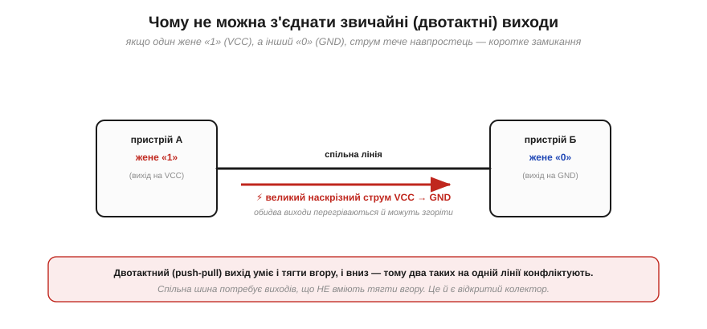
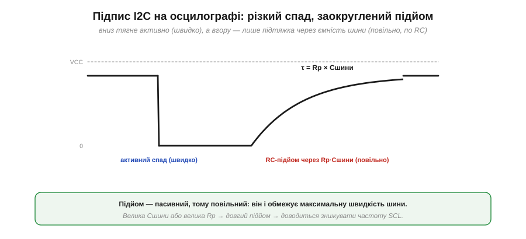
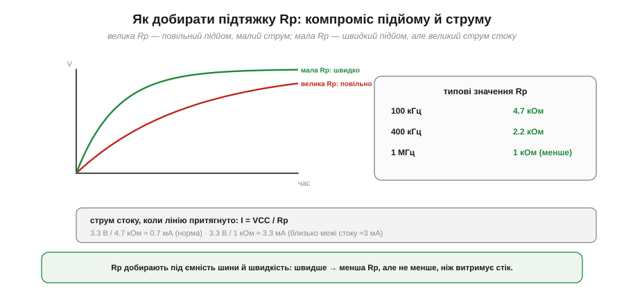

# Відкритий колектор і підтяжки

Спільна шина — гарна ідея, але вона ховає електричну пастку. Якщо до однієї лінії під'єднати десяток пристроїв, що буде, коли двоє одночасно захочуть виставити різні рівні: один — «1», інший — «0»? У звичайних виходів це означає катастрофу. Розв'язок, який знайшла Philips, — настільки простий і красивий, що ліг в основу не лише I2C, а й багатьох інших спільних ліній. Розберімо його — бо без нього шина просто не працювала б, а заразом він пояснить характерний вигляд I2C-сигналів і навіть вибір резисторів на платі.

### Чому не можна зводити звичайні виходи

Звичайний цифровий вихід улаштований так: «1» — це коли він з'єднує лінію з живленням (VCC), «0» — із землею (GND). Такий вихід зветься [двотактним](topic:electronics/push-pull-output) (*push-pull*): він активно тягне лінію і вгору, і вниз. А тепер з'єднаймо два таких виходи однією лінією — і хай один жене «1», а інший «0».


*Один вихід тягне лінію до VCC, інший — до GND. Між ними утворюється пряме коло від живлення до землі, і крізь обидва тече великий наскрізний струм — коротке замикання. Виходи перегріваються й можуть згоріти. Тому два двотактні виходи на одній лінії несумісні.*

Це **конфлікт шини** (*bus contention*): живлення через перший вихід з'єднується із землею через другий, утворюючи майже коротке замикання, і крізь обидва тече величезний струм. У кращому разі лінія опиняється в невизначеному стані «десь між», у гіршому — виходи вигоряють. Висновок очевидний: щоб багато пристроїв ділили лінію, їхні виходи **не мають права** активно тягти її вгору. Вони повинні вміти лише щось одне.

### Відкритий колектор: тільки вниз або відпустити

Саме це й робить **відкритий колектор** (*open-collector*, для польових транзисторів — *open-drain*, відкритий стік). Такий вихід уміє рівно дві речі: **притягнути** лінію до нуля або **відпустити** її — лишити «висіти в повітрі» (стан високого імпедансу, *high-Z*). Штовхати вгору він не вміє взагалі.


*Усередині — [N-канальний MOSFET](topic:electronics/nmos-pmos): затвор увімкнено — транзистор з'єднує лінію із землею, тягнучи її до «0»; затвор вимкнено — стік «висить у повітрі» (високий імпеданс), і лінія вільна. Активного шляху вгору немає в принципі.*

Фізично це просто один **N-канальний MOSFET**: його стік під'єднаний до лінії, витік — до землі, а затвором керує логіка пристрою. Подати на затвор сигнал — транзистор відкривається й садить лінію на нуль; зняти — транзистор закривається, і лінія від нього **від'єднана** (саме так працює [режим open-drain на ніжках мікроконтролера](topic:electronics/open-drain)). Тепер два, десять, сто таких виходів можна сміливо з'єднувати: конфлікту не буде, бо ніхто не тягне вгору — а отже, нема чому замикатися. Але якщо ніхто не тягне вгору, **хто** ж робить лінію високою?

### Підтяжка й монтажне «І»

Відповідь — **підтяжний резистор** (*pull-up*, Rp): один резистор від лінії до живлення. Він **слабко** тягне лінію вгору, до «1». Коли всі відкриті стоки відпущені, ніхто лінію не тримає, і підтяжка спокійно піднімає її до VCC. А щойно бодай один пристрій притягує лінію вниз — він легко перемагає кволу підтяжку, і лінія стає «0».


*Підтяжка Rp тримає лінію у «1», поки всі відкриті стоки відпущені. Щойно один пристрій (Б) притягує лінію вниз, вона стає «0» — і це не конфлікт, бо ніхто не тягне проти. Виходить логічне «І»: лінія висока, лише коли ВСІ відпустили.*

Це дає елегантну логіку, відому як **монтажне «І»** (*wired-AND*): рівень лінії дорівнює «І» всіх виходів. Лінія висока (**1**) тільки тоді, коли **всі** пристрої її відпустили; досить **одному** притягнути вниз — і вся лінія стає **0**. «Нуль» на цій шині завжди «сильніший» за «одиницю»: тягнути вниз перемагає, відпускати нікому не заважає. Конфлікту немає **в принципі** — і саме це робить спільну шину можливою.


*Той самий закон масштабується на скільки завгодно пристроїв: якщо хоч один притягує лінію — вона «0»; високою («1») вона стає, лише коли всі до одного відпустили. Додавання пристроїв нічого не ламає.*

### Почерк на осцилографі: швидкий спад, повільний підйом

У відкритого колектора є наслідок, який одразу впізнаєш на осцилографі. Униз лінію тягне **активно** — транзистор робить це швидко й різко. А вгору її тягне лише **пасивна** підтяжка, і робить це **повільно**: адже резистор має зарядити всю **ємність шини** (доріжки, входи пристроїв), а це класичне [RC-заряджання](topic:electronics/rc-time-constant).


*Спад — активний і різкий (транзистор садить лінію на нуль). Підйом — пасивний і заокруглений: підтяжка Rp заряджає ємність шини Cшини за сталою часу τ = Rp·Cшини. Ця асиметрія — фірмовий вигляд I2C-сигналу, і саме повільний підйом обмежує максимальну швидкість.*

Ось чому в I2C є стеля швидкості: підйом лінії триває певний час, і поки вона не дотягнеться до «1», біт читати не можна. Велика ємність шини (довгі доріжки, багато пристроїв) або велика Rp роблять підйом надто повільним — і доводиться знижувати частоту SCL. Саме тому специфікація обмежує ємність шини (близько 400 пФ) і вимагає узгоджувати Rp зі швидкістю.

**Приклад (наскільки повільний підйом).** Візьмімо типову підтяжку Rp = 4.7 кОм і ємність шини Cшини = 100 пФ:

```
τ = Rp × Cшини = 4700 Ом × 100·10⁻¹² Ф = 470 нс

на 100 кГц біт = 10 мкс → підйом 470 нс ≈ 5% біта (легко встигає)
на 400 кГц біт = 2.5 мкс → той самий підйом ≈ 19% біта (вже тіснувато)
```

На стандартних 100 кГц повільний підйом непомітний; а от на 400 кГц він з'їдає чималу частку біта, і часто доводиться брати **меншу** Rp, щоб прискорити заряд.

### Як добирати підтяжку

Звідси й мистецтво вибору Rp — це **компроміс**. Велика Rp означає повільний підйом (довге τ), зате малий струм, коли лінію притягнуто. Мала Rp дає швидкий підйом, але великий струм, який мусить «проковтнути» транзистор, тягнучи лінію вниз.


*Велика Rp — підйом повільний; мала Rp — швидкий, але струм стоку росте. Типові значення: 4.7 кОм для 100 кГц, 2.2 кОм для 400 кГц, ще менше для 1 МГц. Струм притягання I = VCC/Rp не має перевищувати те, що витримує вихід (для I2C — близько 3 мА).*

**Приклад (струм притягання).** Порахуймо, скільки тече крізь притягнутий до нуля вихід за різних Rp та VCC = 3.3 В:

```
I = VCC / Rp

Rp = 4.7 кОм → I = 3.3 / 4700 ≈ 0.70 мА   (комфортно)
Rp = 1.0 кОм → I = 3.3 / 1000 ≈ 3.3 мА    (близько межі стоку ≈3 мА)
```

Тобто Rp не можна робити надто малою: вихід має витримати струм притягання. Стандартний компроміс — близько **4.7 кОм** для 100 кГц і **2.2 кОм** для 400 кГц, а точне значення підбирають під реальну ємність шини.

> 🔧 **Навіщо це.** Підтяжки на SDA і SCL — **обов'язкові**: без них лінії ніколи не піднімуться до «1», і шина просто не запрацює. Класична помилка новачка — забути їх або поставити по дві (на платі давача й на платі контролера водночас), отримавши надто малий сумарний опір. Якщо I2C «мовчить» або сигнали виглядають кволими й заокругленими на осцилографі — перша підозра саме на підтяжки: є вони, якого номіналу, і чи не задвоєні.

### Навіщо все це: трюки I2C

Може здатися, що відкритий колектор — це лише спосіб уникнути коротких замикань. Та насправді він — **серце** кількох ключових механізмів I2C. Усі вони працюють за одним принципом: «притягнути вниз перемагає».


*Завдяки тому, що «0» завжди сильніший за «1», ведений може підтвердити прийом, притягнувши SDA вниз ([ACK](topic:communications/start-stop-ack)); ведений може притримати такт, тримаючи SCL внизу ([розтягування такту](topic:communications/clock-stretch-arbitration)); кілька ведучих можуть поділити лінію без зіткнення ([арбітраж](topic:communications/clock-stretch-arbitration)). Усе це — наслідки одного простого рішення.*

Підтвердження (ACK), розтягування такту, арбітраж кількох ведучих — кожен із цих трюків зводиться до того, що пристрій притягує лінію вниз, і це завжди «чується» поверх відпущеної лінії. Одне-єдине рішення — виходи лише «вниз» зі спільною підтяжкою — дає всю гнучкість, на якій тримається протокол. Тому відкритий колектор варто розуміти не як технічну дрібницю, а як фундамент, що дозволяє багатьом пристроям мирно ділити дві лінії.

Так влаштована фізика спільної шини: дві лінії, відкритий колектор, підтяжки, монтажне «І». Але фізика лише переносить нулі й одиниці — сама по собі вона ще не каже, **кому** з десятка пристроїв на лінії призначено повідомлення. Те, як ведучий звертається саме до потрібного веденого й чому кожен чіп має свій номер, — окреме питання [адресації](topic:communications/i2c-addressing).

---
