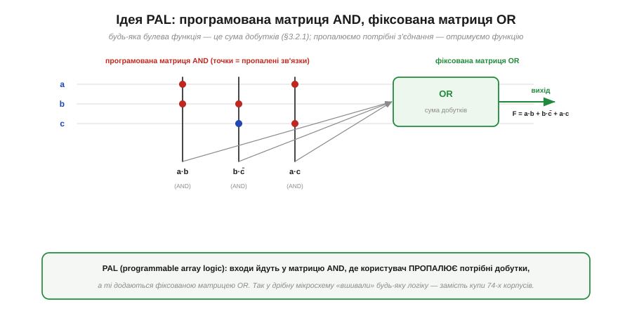
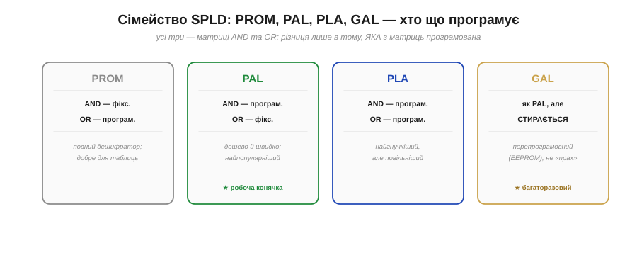
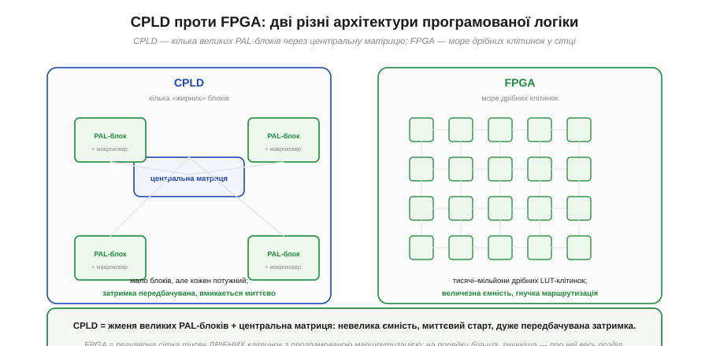
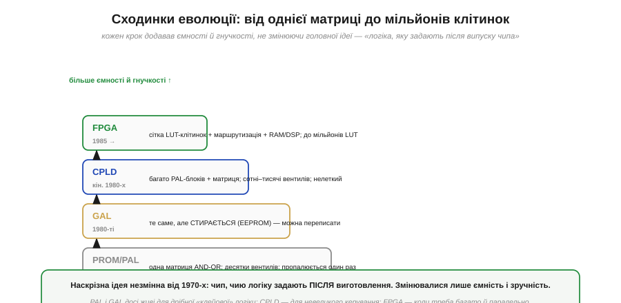

# Від PAL до FPGA: еволюція програмованих чипів

Ідея «чипа, чию логіку задають після випуску» не звалилася з неба готовою FPGA — вона визрівала десятиліттями, від зовсім простих мікросхем до велетенських матриць. Простежити цей шлях варто не заради дат, а заради **розуміння**: кожна сходинка розв'язувала конкретну ваду попередньої, і ця послідовність пояснює, чому сучасна FPGA влаштована саме так. До того ж проміжні ланки — PAL, GAL, CPLD — **не музейні експонати**: вони й сьогодні працюють там, де FPGA була б надмірною. В основі всього лежить одна ідея, що зробила логіку програмованою.

### Найперша ідея: програмована матриця AND-OR

Є ключовий факт із [булевої алгебри](book:math/boolean-algebra): **будь-яку** логічну функцію можна записати як **суму добутків** — кілька доданків, з'єднаних OR, де кожен доданок є AND кількох входів (можливо, інвертованих). Якщо ми вміємо будувати довільні добутки, а потім їх додавати, ми вміємо будувати **будь-яку** функцію. Саме на цьому стоїть найперший програмований чип — **PAL** (*programmable array logic*).

*Рис. Входи (a, b, c та їхні інверсії) йдуть у **програмовану матрицю AND**: користувач **пропалює** потрібні з'єднання (червоні точки), задаючи, які входи входять у кожен добуток (a·b, b·c̄, a·c). Далі **фіксована матриця OR** додає ці добутки в результат F = a·b + b·c̄ + a·c. Так одна мікросхема замінювала жменю окремих корпусів-вентилів серії 74.*

Геній цієї конструкції — у слові **пропалити**. На заводі чип виходить із усіма можливими з'єднаннями в матриці AND; розробник за допомогою програматора **руйнує зайві** (колись — буквально пропалюючи плавкі перемички), лишаючи тільки потрібні. Так із однієї універсальної заготовки народжується конкретна схема. Це вже величезний крок уперед від паяння десятків [окремих вентилів](book:electronics/basic-gates): замість плати, всипаної корпусами 74-ї серії, — одна мікросхема, у яку «вшито» потрібну логіку. Але PAL — лише найпростіший представник цілого сімейства, і його родичі відрізняються тим, **яку саме** з двох матриць дозволено програмувати.

### Сімейство простих програмованих логік (SPLD)

Варто на мить упорядкувати близьку рідню PAL, бо ці чотири абревіатури плутають найчастіше. Усі вони — **прості програмовані логіки** (SPLD, *simple programmable logic device*), усі побудовані з двох матриць AND і OR, і вся різниця між ними — у тому, котра матриця фіксована, а котра програмована.

*Рис. **PROM**: матриця AND фіксована (повний дешифратор), OR — програмована; добра для таблиць. **PAL**: AND програмована, OR фіксована — дешево й швидко, тому найпопулярніша. **PLA** (*programmable logic array*): обидві матриці програмовані — найгнучкіша, але повільніша. **GAL** (*generic array logic*): як PAL, але на стирній пам'яті (EEPROM) — її можна **перепрограмувати**, а не пропалити раз.*

З цієї таблиці видно дві лінії розвитку. Перша — **гнучкість проти швидкості**: PLA дозволяє програмувати обидві матриці, тож уміщує більше, але зайвий рівень перемикачів її сповільнює; PAL поступається гнучкістю, зате швидша й дешевша — і саме тому стала робочою конячкою. Друга лінія — **багаторазовість**: GAL замінила плавкі перемички на стирну пам'ять EEPROM, і чип із «пропали раз і назавжди» перетворився на «перепиши скільки хочеш». Ця друга ідея — конфігурація, яку можна змінювати, — і є зернятко, з якого виросте вся FPGA. Та щоб рости вшир, програмованій логіці бракувало ще однієї речі — **пам'яті стану**.

### Додаємо стан: макрокомірка з тригером

Сама лиш матриця AND-OR, хоч пропалена, хоч стирна, дає тільки [комбінаційну логіку](book:electronics/combinational-circuits): вихід залежить винятково від поточних входів, минулого вона не пам'ятає. Але справжні цифрові пристрої повні **стану** — лічильники, регістри, [скінченні автомати](book:electronics/finite-state-machines). Тож напрошується ще один крок: поставити біля кожного виходу [тригер](book:electronics/d-flip-flop).

*Рис. Макрокомірка = матриця AND-OR (комбінаційна функція) + **тригер** + мультиплексор, що обирає, віддати назовні **реєстровий** (через тригер) чи **комбінаційний** вихід. Зворотний зв'язок повертає вихід тригера назад у матрицю — і це вже дозволяє будувати скінченні автомати: наступний стан рахується з поточного.*

Ось де сходяться дві лінії цифрової схемотехніки: комбінаційне обчислення функції і пам'ять стану, разом в одній комірці. Ця **макрокомірка** (*macrocell*) — уже мініатюрна самодостатня цифрова схема: вона і обчислює функцію, і запам'ятовує результат, і може подати його назад на вхід, замикаючи петлю зворотного зв'язку. А петля зворотного зв'язку — це рівно те, що потрібно для [автомата](book:electronics/finite-state-machines): «новий стан = функція(старий стан, входи)». Лишалося зробити один крок — **зібрати багато** таких комірок на одному кристалі й навчити їх з'єднуватися між собою. І тут програмована логіка розділилась на дві різні архітектури.

Варто розвіяти можливе враження, що PAL і GAL — лише історія. Навпаки: ідея «крихітного програмованого чипа на жменю функцій» жива й сьогодні, просто змінила нішу. Колись такі мікросхеми ставили, щоб **замінити купу [окремих вентилів](book:electronics/basic-gates)** серії 74 однією деталлю; нині ту саму роль грає **клейова логіка** (*glue logic*) — дрібні програмовані чипи, що «склеюють» між собою більші мікросхеми: підганяють [рівні логічних сімейств](book:electronics/logic-families), формують такти скидання, перемикають сигнали. Сучасні представники цього класу вміщують жменю LUT і тригерів у корпус завбільшки з рисове зерно й коштують копійки — і вони незамінні там, де тягнути велику FPGA було б безглуздо. Тобто навіть найнижчий щабель програмованої логіки нікуди не зник — він просто знайшов своє місце між великими чипами.

> 🔌 **Загляньте у вставку:** [Клейова логіка сьогодні: GreenPAK-клас — програмована дрібнота між чіпами](comp-greenpak.md) — що вміщує такий мікроскопічний чип і де його ставлять на платі.

### Дві дороги: CPLD і FPGA

Коли постало питання «як скласти багато програмованих комірок в один великий чип», знайшлося дві принципово різні відповіді. Перша дала **CPLD**, друга — **FPGA**, і саме друга виявилась здатною вирости до мільйонів елементів.

*Рис. **CPLD** (*complex PLD*): кілька «жирних» PAL-блоків із макрокомірками, зв'язаних однією центральною матрицею. Блоків небагато, та кожен потужний; затримка передбачувана, чип стартує миттєво. **FPGA**: море **дрібних** клітинок у регулярній сітці з гнучкою програмованою маршрутизацією. Клітинок тисячі чи мільйони — ємність на порядки більша.*

Різниця між ними — це різниця між «кількома великими» і «безліччю дрібних». **CPLD** взяв кілька повноцінних PAL-блоків і поєднав їх однією передбачуваною центральною матрицею. Через це CPLD невеликий, але дуже **прогнозований**: будь-який сигнал проходить однаковий короткий шлях, тож затримка стала й мала, а конфігурація зазвичай зберігається прямо в чипі, тож він готовий до роботи відразу по ввімкненні. **FPGA** пішла протилежним шляхом: замість кількох великих блоків — **тисячі крихітних** клітинок, розкиданих сіткою, і складна мережа програмованих проводів між ними. Це коштувало передбачуваності (шлях сигналу тепер залежить від того, як його проклали) і миттєвого старту ([конфігурацію зазвичай доводиться завантажувати ззовні](book:electronics/fpga-flow)), зате відчинило двері до колосальної ємності. Саме ця, «дрібнозерниста», архітектура й дала FPGA її масштаб.

### Уся драбина разом

Зведені в один ряд, сходинки оголюють наскрізну логіку розвитку — і заразом показують, що нижні щаблі нікуди не зникли.

*Рис. Від PAL/PROM (одна матриця, десятки вентилів, пропалюється раз) через GAL (те саме, але стирне) і CPLD (багато PAL-блоків + матриця, нелеткий) до FPGA (сітка LUT-клітинок із маршрутизацією, блоками RAM і DSP, до мільйонів LUT). Кожен щабель додавав ємності й гнучкості, не міняючи головної ідеї — «логіка, яку задають після випуску чипа».*

Найважливіше з цієї драбини — не верхній щабель, а **незмінність ідеї** на всіх щаблях: чип, чию схему визначають **після** виготовлення. Мінялися лише ємність (від десятків вентилів до мільйонів) і зручність (від одноразового пропалювання до миттєвого перезавантаження). І нижні щаблі живі донині, кожен у своїй ніші: PAL і GAL — для дрібної «клейової» логіки між мікросхемами; CPLD — для невеликого керування, де цінні миттєвий старт і стала затримка; FPGA — коли логіки треба багато й паралельно. Вибір між ними — це не «старе проти нового», а відповідність масштабу задачі.

> 🔧 **Навіщо це.** Практична користь — **не хапатися за FPGA там, де вистачить меншого**. Якщо завдання — лише «склеїти» кілька сигналів, замінити жменю вентилів чи зробити простий дешифратор, CPLD або навіть GAL буде дешевшим, простішим і запуститься миттєво без зовнішньої флеші. FPGA окупає свою складність лише тоді, коли потрібна **велика паралельна логіка** — багато каналів, обробка потоку, складні конвеєри. Знати весь спектр означає брати рівно стільки програмованості, скільки треба, і не платити за надлишок ні грошима, ні складністю плати.

---

Отже, програмована логіка визрівала сходинками. **PAL** реалізує [суму добутків](book:math/boolean-algebra) у пропалюваній матриці AND з фіксованою OR; родичі (**PROM**, **PLA**, **GAL**) різняться тим, котру матрицю програмують, а GAL ще й **перепрограмовна** (EEPROM) — зерно майбутньої FPGA. **Макрокомірка** додала до матриці [тригер](book:electronics/d-flip-flop) і зворотний зв'язок, давши стан і [автомати](book:electronics/finite-state-machines). На питанні «як зібрати багато комірок» шляхи розійшлися: **CPLD** — кілька великих PAL-блоків через центральну матрицю (малий, передбачуваний, миттєвий старт), **FPGA** — море **дрібних** клітинок із гнучкою маршрутизацією (величезна ємність). Наскрізна ідея незмінна — «логіка, яку задають після випуску»; усі щаблі живі, кожен під свій масштаб.

---
