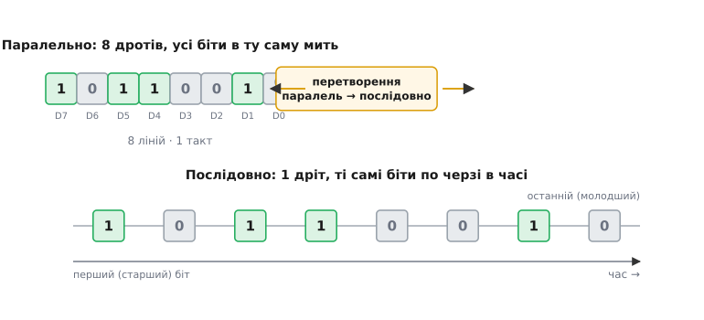
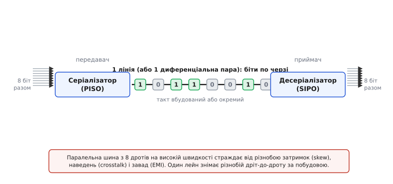
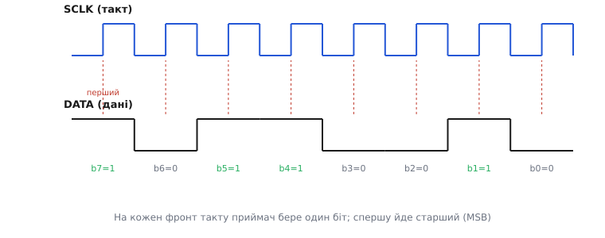

# Перетворення паралельного сигналу на послідовний

Байт усередині мікроконтролера живе весь одразу. Вісім його бітів лежать у восьми комірках, кожен на своєму дротику, і читаються всі в ту саму мить — це **паралельна** форма (лат. *parallelus* — той, що йде поряд). Зручно й швидко, але за неї платять дротами: вісім бітів — вісім ліній, тридцять два біти — тридцять дві лінії. А тепер уявіть, що цей байт треба винести з корпусу назовні: на сусідній чип, на плату за метр, у кабель. Тягнути туди по дроту на кожен біт — марнотратство, а часто й фізична неможливість: ніжок у корпусу лічені, місця на платі мало, а роз'єм на сорок контактів нікому не потрібен.

Вихід у тому, щоб **розміняти простір на час**. Замість того щоб вести вісім бітів поряд у просторі, пошлемо їх по черзі одним дротом — біт за бітом, кожен у свій проміжок часу. Один провідник за вісім тактів пронесе цілий байт; на іншому кінці залишиться скласти біти назад у ціле. Оце й є **перетворення паралельного на послідовний** (лат. *series* — низка, ряд): узяти дані, що лежать усі разом, і випустити їх послідовністю в часі.


*Той самий байт 0xB2 у двох формах. Угорі — паралельна: вісім ліній D7…D0, усі біти присутні в ту саму мить. Унизу — послідовна: один дріт, ті самі вісім бітів розкладені в часі, першим іде старший біт. Перетворення посередині не змінює даних — воно змінює лише те, чи біти рознесені у просторі, чи в часі.*

Це не хитрий трюк заради економії, а один з наріжних прийомів усієї цифрової техніки. Кожен раз, коли байт залишає чип по [шині SPI](book:communications/spi-bus), кожен символ, що летить проводом [UART](book:communications/uart-frame), кожен піксель у кабелі до монітора — усе це паралельні дані, перетворені на послідовний потік. Зрозуміти саме це перетворення означає зрозуміти, як внутрішній світ мікросхеми, де все паралельне, стикується із зовнішнім світом дротів, де тісно.

## Простір проти часу: чому взагалі серіалізувати

Спокуса зробити все паралельним природна: паралель швидша, бо всі біти йдуть разом. Якщо шина восьмирозрядна й такт 100 МГц, то за секунду крізь неї проходить 800 мільйонів бітів — при тому, що кожна окрема лінія перемикається лише 100 мільйонів разів. Здавалося б, ось і рецепт: хочеш більше — додай ліній. Але саме тут ховається пастка, через яку сучасні швидкі канали пішли протилежним шляхом.

Проблема в тому, що вісім дротів — це вісім **різних** дротів. Вони мають трохи різну довжину, лягають по платі трохи різними шляхами, мають трохи різну ємність. Тому сигнал на них приходить **не одночасно**: один біт випереджає, інший спізнюється. Це розбігання називають різнобоєм (англ. *skew* — перекіс). Поки такт повільний, різнобій у частки наносекунди губиться в довгому періоді. Але коли період скорочується до одиниць наносекунд, різнобій починає з'їдати весь запас: приймач уже не певен, чи всі вісім бітів, які він читає, належать до одного слова, чи хтось із них — уже від наступного. Крім того, вісім ліній, що дружно перемикаються поруч, наводять завади одна на одну (англ. *crosstalk* — перехресна балачка) і випромінюють у простір тим сильніше, чим їх більше й чим вони швидші.

Ось де серіалізація перевертає рахунок. Якщо лишити **одну** лінію (чи одну диференціальну пару — два дроти, що несуть сигнал протифазно), то різнобою «дріт проти дроту» **не існує за побудовою**: розбігатися нема чому, бо провідник один. Немає й перехресних завад між сусідами того самого слова. Тому одну лінію можна розігнати набагато вище, ніж кожну лінію широкої шини, — і сумарно вона переганяє паралельну шину, ще й на менших дротах, з меншим випроміненням і меншою потужністю. Саме тому USB, PCI Express, HDMI, Ethernet — усі послідовні, хоч колись їхні попередники (паралельний порт, шина PCI, паралельний ATA) були широкими.

> 🔧 **Навіщо це.** Правило для проєктування плати: широка паралельна шина на високій частоті — це купа дротів, які треба вести **однакової довжини** (вирівнювати затримки), тримати подалі один від одного й екранувати. Один послідовний лейн знімає всі ці головні болі одразу. Тому щоразу, коли постає питання «як винести багато даних із чипа», відповідь майже завжди — серіалізувати: менше ніжок, менше дротів, менше клопоту з цілісністю сигналу.

Паралель не зникла — вона лишилася там, де дроти короткі й дешеві: усередині чипа, між чипом і сусідньою пам'яттю. Але як тільки дані виходять «на дистанцію», перетворення на послідовний потік стає майже неминучим.

## Механізм: висунути біти по одному

Як фізично взяти вісім бітів, що лежать разом, і випустити їх низкою? Потрібен пристрій із двома здатностями: **захопити** всі біти одним рухом і **висувати** їх по одному за такт. Саме це робить [зсувний регістр](book:electronics/shift-register) у режимі PISO. Коротко: це ланцюжок комірок пам'яті ([D-тригерів](book:electronics/d-flip-flop)), з'єднаних так, що на кожен фронт спільного такту вся низка бітів зсувається на одну позицію; вихід крайньої комірки — це і є послідовний потік.

Робота йде у два кроки. Спершу — **паралельне завантаження**: одним сигналом «захопи» всі вісім вхідних ліній заводять у вісім комірок одночасно. Тепер байт лежить усередині регістра. Далі — **зсув**: на кожен такт уся низка з'їжджає на щабель у бік виходу, і з крайньої комірки випадає один біт. Вісім тактів — вісім бітів на виході, байт вийшов повністю. Потім можна знову завантажити наступний і повторити.

Зверніть увагу на важливу річ: завантаження й зсув — це **два різні режими** тієї самої схеми, і перемикання між ними задає окремий керувальний вхід. Поки він каже «завантаж», регістр на фронті хапає паралельні дані; поки каже «зсув», регістр на фронті посуває вміст. Плутати їх не можна: якщо зсувати, коли треба було завантажувати, на виході піде сміття зі старого вмісту.

На приймальному боці працює дзеркальний пристрій — той самий зсувний регістр, але в режимі SIPO (*serial-in, parallel-out*). Він приймає біти по одному дроту, зсуваючи їх усередину, і після восьми тактів у восьми комірках лежить повний байт, готовий до паралельного зчитування. Разом ці двоє — серіалізатор на передавачі й десеріалізатор на приймачі — утворюють повний тракт «паралель → лінія → паралель».


*Повний обіг даних. Ліворуч серіалізатор (PISO) захоплює вісім бітів разом і висуває їх у єдину лінію по одному. Праворуч десеріалізатор (SIPO) приймає потік і відновлює вісім паралельних бітів. Між ними — один провідник (чи одна диференціальна пара), який і робить усю економію; такт при цьому або йде окремою лінією, або вбудований у сам сигнал.*

Пара «серіалізатор + десеріалізатор» настільки поширена, що дістала власну назву — [SerDes](book:electronics/serdes) (від *ser*ializer/*des*erializer). У швидких каналах на кшталт PCI Express чи гігабітного Ethernet це складний вузол, що серіалізує на одному кінці й відновлює на іншому мільярди бітів за секунду; принцип, однак, той самий, що в дешевого зсувного регістра, — розкласти паралель у часі й скласти назад.

## Тайминг: коли саме дійсний біт

Випустити біти по одному — це лише половина справи. Приймач мусить знати, **у яку мить** дивитися на лінію, щоб узяти саме той біт, а не застати перехід між двома. Уся послідовна передача тримається на цій узгодженості в часі, і є два способи її забезпечити.

Перший — **синхронний**: поряд із лінією даних іде окрема лінія **такту**. Передавач виставляє біт на дані й тим самим тактом каже приймачеві «бери зараз». Приймач читає біт строго на фронті такту й не має гадати про час сам: годинник йому дали. Так працює SPI — три дроти (дані, такт, і вибір веденого), де кожен фронт такту переносить один біт. Це просто й надійно, бо передавач і приймач буквально крокують під один барабан.


*Синхронна передача байта 0xB2. Лінія даних тримає рівень цілий такт, а лінія такту позначає фронтами, коли цей рівень читати. Приймач бере по одному біту на фронт (пунктир), і за вісім фронтів набирає весь байт. Дані міняються між фронтами, читаються — на фронті: так виключено читання під час переходу.*

Другий спосіб — **асинхронний**: окремого такту немає, лінія тільки одна. Тоді передавач і приймач мусять заздалегідь домовитися про **швидкість** — скільки бітів за секунду (звідси одиниця «біт за секунду» і споріднена «бод»). Приймач тримає власний годинник тієї самої частоти й ловить початок посилки за спеціальним стартовим переходом, після чого відлічує біти за часом. Так працює UART: перед байтом іде стартовий біт, який будить приймач, далі — біти даних за рівними проміжками, а наприкінці стоповий біт. Годинники двох боків не зв'язані дротом, тому вони мусять бути досить точні, щоб не розійтися за час однієї посилки; звідси відома вимога, що частоти передавача й приймача UART не повинні розходитися більш ніж на кілька відсотків.

> 🔧 **Навіщо це.** Вибір між синхронним і асинхронним — це компроміс «дріт проти домовленості». Синхронний коштує зайву лінію такту, зате приймач нічого не мусить знати наперед і працює на будь-якій швидкості, яку задає передавач. Асинхронний економить дріт, але вимагає, щоб обидва боки заздалегідь знали швидкість і мали досить стабільні годинники. У прошивці це проявляється буквально: для SPI ви задаєте дільник такту, а швидкість «сама» випливає; для UART ви **зобов'язані** виставити однакову швидкість (baud) на обох кінцях, інакше приймете нісенітницю.

## Порядок бітів: старший чи молодший першим

Є ще одне рішення, яке легко проґавити й потім довго ловити: **у якому порядку** висувати біти. Байт має вісім бітів, і серіалізувати їх можна двома способами — почати зі старшого (MSB, *most significant bit*) або з молодшого (LSB, *least significant bit*). Обидва порядки самі по собі коректні; біда починається, коли передавач висуває старшим уперед, а приймач збирає так, ніби першим прийшов молодший. Тоді байт відновиться **дзеркально перевернутим по бітах**: замість 0xB2 (1011 0010) вийде 0x4D (0100 1101).

Це не рідкісний казус, а стала розбіжність між протоколами. SPI за замовчуванням шле старшим бітом уперед. UART, навпаки, шле молодшим першим. Тому єдиний надійний підхід — знати конвенцію свого каналу й дотримуватися її по обидва боки. У зсувному регістрі порядок задається тим, з якого кінця ланцюга знімають вихід і в який бік зсувають; у програмній серіалізації — тим, який біт байта ви перевіряєте першим.

Ось як виглядає програмна серіалізація байта старшим бітом уперед на двох звичайних ніжках (така «ручна» реалізація SPI-подібного виводу зветься *bit-banging* — коли протокол крутять не апаратним блоком, а прямим смиканням виводів):

**Умова: висунути байт `data` старшим бітом уперед на ніжку DATA, тактуючи ніжкою CLK.**
:::tabs
```cpp
void shift_out_msb(uint8_t data) {
    for (int i = 7; i >= 0; i--) {   // від біта 7 (старший) до біта 0
        // виставляємо на лінію поточний біт: 1 чи 0
        gpio_write(PIN_DATA, (data >> i) & 1);
        // фронт такту 0→1 — саме тут приймач читає біт
        gpio_write(PIN_CLK, 1);
        gpio_write(PIN_CLK, 0);      // повертаємо такт у 0, готуючи наступний фронт
    }
}
```
```python
def shift_out_msb(data):
    for i in range(7, -1, -1):           # від біта 7 (старший) до біта 0
        # виставляємо на лінію поточний біт: 1 чи 0
        gpio_write(PIN_DATA, (data >> i) & 1)
        # фронт такту 0→1 — саме тут приймач читає біт
        gpio_write(PIN_CLK, 1)
        gpio_write(PIN_CLK, 0)           # повертаємо такт у 0, готуючи наступний фронт
```
:::
Цикл іде від `i = 7` до `i = 0`, тобто спершу виставляє старший біт, а вже потім усе молодші. Вираз `(data >> i) & 1` зсуває байт праворуч на `i` позицій і бере наймолодший біт результату — це й є `i`-й біт вихідного байта. Перемикання такту 0→1 позначає приймачеві мить, коли лінія даних дійсна. Хочете молодшим бітом уперед — просто розверніть цикл на `for (int i = 0; i < 8; i++)`, і той самий байт піде у зворотному порядку.

Дзеркальна операція на приймачі — зібрати вісім прочитаних бітів назад у байт:

**Умова: прийняти байт, читаючи ніжку DATA на кожному фронті такту, старший біт першим.**
:::tabs
```cpp
uint8_t shift_in_msb(void) {
    uint8_t v = 0;
    for (int i = 0; i < 8; i++) {
        v <<= 1;                     // звільняємо місце під новий біт праворуч
        gpio_write(PIN_CLK, 1);      // фронт: передавач саме зараз тримає біт дійсним
        v |= gpio_read(PIN_DATA) & 1; // вкладаємо прочитаний біт у наймолодшу позицію
        gpio_write(PIN_CLK, 0);
    }
    return v;                        // перший прочитаний біт опинився в старшій позиції
}
```
```python
def shift_in_msb():
    v = 0
    for _ in range(8):
        v = (v << 1) & 0xFF              # звільняємо місце під новий біт праворуч
        gpio_write(PIN_CLK, 1)           # фронт: передавач саме зараз тримає біт дійсним
        v |= gpio_read(PIN_DATA) & 1     # вкладаємо прочитаний біт у наймолодшу позицію
        gpio_write(PIN_CLK, 0)
    return v                             # перший прочитаний біт опинився в старшій позиції
```
:::
Тут ключ у порядку двох дій: спершу `v <<= 1` посуває вже накопичене ліворуч, а тоді свіжий біт лягає праворуч. Перший прочитаний біт зазнає семи зсувів і опиняється в старшій позиції — рівно там, звідки його висунули. Приймач і передавач мають зчитувати й виставляти на **узгоджених** краях такту (один виставляє, поки такт низький, інший читає на підйомі) — інакше можна застати лінію в мить переходу й прочитати хибу.

## Скільки це коштує в часі

Проста арифметика серіалізації важлива на практиці, бо саме вона каже, встигне канал чи ні. Правило одне: **один біт за один такт**. Тож щоб послідовно передати N бітів, треба N тактів, а час на це — просто N поділити на частоту такту.

**Умова: скільки часу займе вивід 256-байтового кадру по SPI на такті 8 МГц (старший біт першим, без пауз)?**
```
бітів у кадрі   = 256 байтів × 8 = 2048 бітів
такт            = 8 МГц  → період = 1 / 8·10⁶ = 125 нс
час             = 2048 × 125 нс = 256 000 нс = 256 мкс
```
Виходить чверть мілісекунди на кадр — і це без урахування пауз між байтами й накладних витрат на керування. Якщо тих самих даних треба, скажімо, шістдесят кадрів на секунду для дисплея, то на передачу піде 60 × 256 мкс ≈ 15.4 мс із кожних 16.7 мс кадрового вікна — впритул, і будь-яка додаткова пауза зірве плавність. Оцінка «біти × період» — це перше, що варто порахувати, обираючи швидкість такту під задачу: чи вкладаєтеся ви у відведений час, чи треба або пришвидшити такт, або звузити дані.

Тут і видно фундаментальний компроміс серіалізації. Паралель платить дротами, але виграє час: усі біти разом. Послідовний канал платить часом, але виграє дроти: один провідник замість багатьох. Розганяючи такт, послідовний канал відвойовує втрачений час — і сучасні лейни розігнані так, що навіть один дріт переганяє колишні широкі шини. Але сам розмін лишається: серіалізувати — значить погодитися віддавати біти по черзі, а не всі одразу.

## Де це живе

Перетворення паралельного на послідовний — не окрема екзотична схема, а прийом, що ховається всередині безлічі знайомих речей. Варто впізнавати його в лице.

Найпростіше втілення — окрема мікросхема-регістр, як-от [74HC165](book:electronics/74hc165) (збирає вісім входів в один послідовний дріт) чи її дзеркало [74HC595](book:electronics/74hc595) (з одного дроту роздає вісім виходів). Ними розширюють бідні на ніжки мікроконтролери: три керувальні лінії — і скільзавгодно кнопок на вході чи світлодіодів на виході, з'єднаних у ланцюг. Це серіалізація в чистому, наочному вигляді.

Далі — комунікаційні блоки. Апаратний вузол SPI усередині мікроконтролера — це, по суті, серіалізатор із генератором такту: ви кладете байт у регістр даних, а залізо саме висуває його по одному біту на ніжку. Вузол UART — те саме, але асинхронно: він сам додає стартовий і стоповий біти й відлічує час за заданою швидкістю. У всіх цих блоках серце — той самий зсувний регістр, обгорнутий логікою керування.

І нарешті — швидкісні канали, де серіалізацію доводять до краю. У [SerDes](book:electronics/serdes) паралельне слово з внутрішньої шини перетворюють на надшвидкий послідовний потік, який летить однією диференціальною парою на гігабітних швидкостях, а на тому кінці відновлюється в паралель. Такт там зазвичай **не** веде окремий дріт — його вбудовують у сам потік і відновлюють на приймачі за переходами сигналу, щоб не тягнути ще одну лінію на гігагерцах. Але навіть у цій вершині техніки в основі та сама думка, з якої почалася ця стаття: не обов'язково вести біти поряд у просторі, коли можна пустити їх по черзі в часі.

Історія цього прийому, до речі, старша за будь-яку мікросхему: [телеграф і телетайп навчилися слати літери по одному дроту](book:electronics/parallel-to-serial/hist-serial-telegraph.md) задовго до цифрової електроніки, і саме звідти в сучасні протоколи прийшли і стартовий біт, і сама одиниця «бод».
