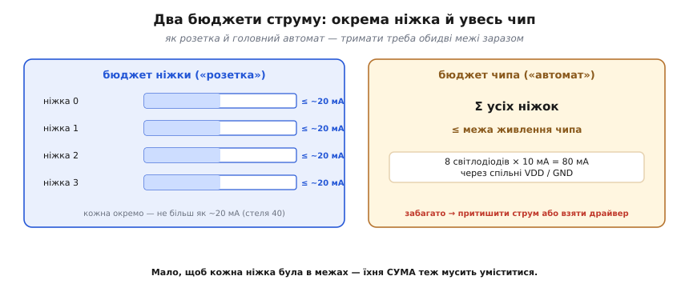
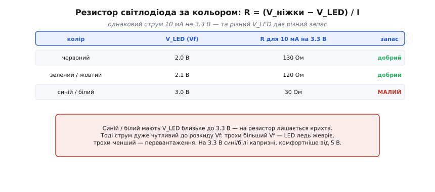

# 🧮 Бюджет ніжки й порту: сумарний струм, резистор світлодіода, запас

Питання «скільки струму взяти з ніжки» здається дрібним — поки не виявиться, що відповідей **дві** й вони незалежні. Одна межа стереже окрему ніжку, друга — весь чип разом. Витримати одну й завалити другу — типова пастка: усі світлодіоди начебто в нормі, а кристал гріється або напруга живлення просідає. Тут ми порахуємо обидва бюджети як одне ціле: звідки беруться ці межі, як рахувати резистор світлодіода (і чому колір тут вирішує), та навіщо свідомо лишати запас замість того, щоб тиснути ніжку до стелі.

## Дві межі, а не одна

Струм ніжки обмежують **два** бюджети заразом.

**Перший** — на кожну окрему ніжку. Усередині сидить транзистор скінченного розміру; протягнеш крізь нього забагато — він гріється, напруга на ньому просідає, надійність падає. Звідси число: I_ніжки ≤ межа (у ESP32 орієнтир ~20 мА, абсолютна стеля ~40).

**Другий** — на весь чип. Струми всіх ніжок течуть **не нарізно**: вони сходяться у спільні виводи живлення (VDD) і землі (GND) кристала, а ті проводять лише стільки, скільки витримує їхній металізований шлях усередині корпусу. Тому є й окрема межа: **сума** струмів усіх ніжок ≤ те, що тримає живлення кристала.

Тримати треба **обидва**. Можна не перевищити жодної ніжки — і все одно вийти за сумарну межу, увімкнувши багато всього разом.


*Два бюджети заразом, як розетка й головний автомат у домі: кожна ніжка окремо ≤ ~20 мА (стеля 40), і сума всіх ніжок ≤ межа живлення чипа. Вісім світлодіодів по 10 мА — це вже 80 мА через спільні VDD/GND, привід перевірити саме суму.*

## Інтуїція: розетка й автомат

Точна аналогія — електрика в домі. Кожна **розетка** має свою межу: не ввімкнеш у неї надпотужний прилад, бо згорить її проводка. І водночас **головний автомат** на щитку обмежує **сумарне** споживання всього дому, хай навіть кожна розетка окремо в нормі. Можна не перевантажити жодної розетки — і все одно вибити автомат, бо разом увімкнено забагато.

З ніжками те саме: «розетка» — поніжкова межа (~20 мА), «автомат» — сумарна межа живлення чипа. Де аналогія ламається: розетки в домі живляться кожна своїм проводом від щитка, а ніжки чипа ділять **одні й ті самі** вузенькі виводи живлення кристала — тож сумарна стеля для них відносно ще нижча, ніж підказує побутова інтуїція. Саме тому суму варто рахувати свідомо, а не сподіватися, що «по 20 мА на ніжку завжди безпечно».

> 🔧 **Навіщо це.** Перш ніж розвішувати багато навантажень, складіть їхні струми й гляньте на суму. Вісім світлодіодів по 10 мА — це 80 мА, що течуть крізь спільні VDD/GND; десяток яскравих — уже привід відкрити даташит і знайти сумарну межу. Це секундна перевірка, що рятує від загадкового «чип гріється» чи «світло тьмяніє, коли ввімкнено все разом».

## Резистор світлодіода: закон Ома мінус падіння на LED

Резистор послідовно зі світлодіодом **задає** струм. Світлодіод сам струму майже не обмежує: щойно напруга на ньому перевищує поріг, його опір стрімко падає. Тому весь «надлишок» напруги — різницю між напругою ніжки й падінням на самому LED — має взяти на себе резистор. Звідси формула просто із закону Ома:

```
R = (V_ніжки − V_LED) / I
```

де V_LED — пряме падіння на світлодіоді (його позначають Vf, англ. *forward voltage* — «пряма напруга»). Тонкість, якої не видно з самої формули: **V_LED залежить від кольору**. Червоний світиться за ~2.0 В, зелений — ~2.1 В, а синій і білий — аж ~3.0 В і вище. Підставмо для бажаних 10 мА на 3.3 В:

```
червоний (Vf 2.0): R = (3.3 − 2.0) / 0.01 = 130 Ом    запас добрий
зелений  (Vf 2.1): R = (3.3 − 2.1) / 0.01 = 120 Ом    запас добрий
синій    (Vf 3.0): R = (3.3 − 3.0) / 0.01 =  30 Ом    запас МАЛИЙ
```


*Однаковий струм 10 мА на 3.3 В, але різний V_LED дає різний резистор і різний запас. Червоний і зелений (Vf ~2 В) лишають на резистор понад вольт — струм стійкий. Синій і білий (Vf ~3 В) лишають крихту, тож струм дуже чутливий до розкиду Vf.*

Чому з тих 30 Ом для синього й починаються проблеми? Бо на резистор лишається лише ~0.3 В, і саме цей малий «запас» тримає струм у руках. Світлодіоди одного типу мають **розкид** Vf — від штуки до штуки напруга гуляє на десяті частки вольта. Коли на резисторі цілий вольт із гаком (червоний), така зміна майже непомітна. А коли там лише 0.3 В (синій), та сама десята вольта — це вже третина «бюджету»: трохи більший Vf — і LED ледь жевріє, трохи менший — струм підскакує вдвічі й перевантажує і LED, і ніжку. Тому на 3.3 В сині й білі капризні: їм фізично комфортніше від 5 В, де на резистор лишається пристойний вольт із гаком. Це і є розгадка класичної загадки «чому мій синій світлодіод ледь світить на трьох вольтах».

## Запас: чому ~20 мА, а не стеля 40

Лишається питання: якщо стеля ніжки ~40 мА, чому робочий орієнтир — удвічі менше? Бо стеля — це **абсолютний максимум**, межа виживання, а не зона комфорту. Біля неї транзистор ніжки помітно гріється, напруга на ньому просідає (рівень HIGH падає, аж поки приймач перестане впізнавати одиницю), а з нагрівом тане й довговічність кристала. Узяти струм **удвічі менший** за стелю — найдешевший спосіб купити запас одразу на три біди: на нагрів, на розкид параметрів від штуки до штуки й на старіння за роки роботи.

Цей прийом — закласти запас, відступивши від паспортної межі, — мовою інженерів зветься **derating** (англ. *derating* — «зниження норми»). Він наскрізний у силовій електроніці: і конденсатор беруть на більшу напругу, ніж робоча, і резистор — на більшу потужність. Те саме з резистором світлодіода: узяти його **трохи більшим** за розрахунковий — світло ледь тьмяніше, зате струм гарантовано нижчий за межу навіть із усім розкидом. Округляти опір варто **вгору**, а струм у бюджеті закладати ближче до 10 мА, ніж до 40.

## Зведімо в один бюджет

Тепер порахуймо обидві межі разом — на типовому наборі від світлодіода до реле. Це той самий розрахунок, що його варто проганяти **до** того, як щось підмикати.

**Приклад (бюджет струму: поніжковий і сумарний).**

```
Дано: VDD = 3.3 В, орієнтир ніжки 20 мА (стеля 40),
      сумарна межа чипа — з даташита (тут для прикладу 200 мА).

1) Один світлодіод (червоний, Vf = 2.0 В), R = 220 Ом:
   I = (3.3 − 2.0) / 220 = 1.3 / 220 ≈ 5.9 мА
   5.9 мА < 20 мА            → ніжці безпечно. OK.

2) Вісім таких світлодіодів на восьми ніжках:
   кожна ніжка:  ~5.9 мА     (поніжкова межа — OK)
   сума:         8 × 5.9 ≈ 47 мА  через спільні VDD/GND
   47 мА < 200 мА            → сумарна межа теж OK.

3) Той самий чип, але 30 яскравих LED по 15 мА:
   кожна ніжка:  15 мА < 20  (поніжкова — ще OK!)
   сума:         30 × 15 = 450 мА
   450 мА > 200 мА           → СУМАРНА межа пробита,
                               хоч кожна ніжка окремо в нормі.

4) Реле 12 В, котушка тягне 60 мА:
   60 мА >> 20 мА            → напряму на ніжку НЕ можна
   рішення: транзистор-ключ (ніжка керує затвором,
            струм бере окреме живлення) + флайбек-діод.
```

Висновок видно по кроках. Один світлодіод ніжці по силі. Вісім — теж проходять, але вже саме крок 2 показує, навіщо складати **суму**, а не лише дивитися на кожну ніжку. Крок 3 — головна пастка цілого розрахунку: кожна ніжка в нормі, а чип уже за межею, бо «автомат» рахує всіх разом. А реле — однозначно повз ніжку, через [транзистор як ключ](topic:electronics/bjt-switch). Звичка проганяти цей бюджет до монтажу економить спалені ніжки й годинами не відтворювані «загадки».

## Де це працює

Двобюджетне правило підказує **межу можливостей ніжки**: один-два світлодіоди вона тягне сама; десяток — рахуйте суму; реле чи моторчик (десятки-сотні мА) — одразу через окремий ключ, бо проти них і перша межа, і друга. Конкретні числа в кожного сімейства свої: у ESP32 поніжковий орієнтир ~20 мА (стеля 40), а сумарні межі різняться помітно — десятки мА в одних плат, помітно більше в інших, тож точне число завжди беруть із даташита самого чипа, а не з пам'яті. А таблиця за кольором рятує від найчастішої загадки початківця — «чому синій світлодіод тьмяний на 3.3 вольтах». Практичний підсумок короткий: тримайте кожну ніжку ближче до 10 мА, ніж до 40; перш ніж вішати багато LED — додайте їхні струми й звірте суму з межею чипа; а резистор беріть із запасом, округляючи вгору.
