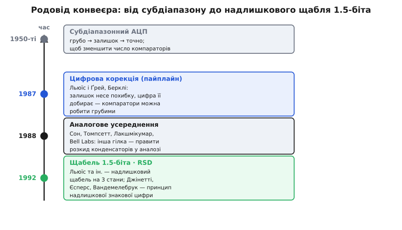

# 📜 Як народився конвеєрний АЦП

Гарні ідеї в схемотехніці рідко з'являються з нічого — частіше хтось довго чинить опір незручності, доти доки її не розкладе на легші шматки. Історія конвеєрного АЦП саме така. Це не спалах одного винаходу, а ланцюжок кроків, кожен з яких прибирав одну перешкоду: спершу навчилися **ділити** вимірювання на грубе й точне, тоді зрозуміли, як **розпаралелити** ці шматки в часі, а насамкінець знайшли спосіб зробити грубу частину **дешевою й неточною** — і все одно отримати чесні розряди. Простежмо цей ланцюжок від самого початку: що бентежило інженерів, хто зрушив кожен камінь і де в підручниках сидять неточності атрибуції.

## Незручність, з якої все почалося: паралельний АЦП не масштабується

Щоб зрозуміти, навіщо взагалі знадобився конвеєр, треба відчути біль найшвидшого перетворювача — **паралельного** (англ. *flash* — спалах, бо код спалахує за один такт). Він порівнює вхідну напругу відразу з усіма рівнями шкали, кожен рівень стереже свій компаратор, і код виходить миттєво. За швидкість платять числом компараторів: щоб розрізнити N розрядів, треба 2ᴺ−1 порогів. Вісім розрядів — це 255 компараторів, ще терпимо. Десять — уже 1023. Дванадцять — понад чотири тисячі. Кожен компаратор жере струм, місце на кристалі й вантажить вхід своєю ємністю; армія з тисяч компараторів на вході — це вже не мікросхема, а грубка.

```
компараторів у flash = 2ᴺ − 1
 8 розрядів →   255
10 розрядів →  1023
12 розрядів →  4095      ← не лізе ні за ціною, ні за споживанням
```

Ось та стіна, у яку впиралися вже в 1950-х, коли перші швидкісні АЦП будували на **лампах** (вакуумних тріодах) і **тунельних діодах** — приладах гарячих, дорогих і ненадійних поштучно. Кожен зайвий компаратор коштував відчутно. Постало питання, яке й породило всю подальшу історію: **чи можна отримати багато розрядів, не тримаючи багато компараторів одночасно?**

## Перший камінь: субдіапазонний поділ (1950-ті)

Відповідь, до якої дійшли, — напрочуд людська. Коли ви оцінюєте на око зріст людини, ви не порівнюєте її водночас із кожним сантиметром рулетки. Ви кажете «десь метр вісімдесят» — грубо визначаєте **діапазон**, — а тоді, якщо треба точніше, придивляєтеся **всередині** цього діапазону. Дві дії замість однієї: спершу груба, тоді точна, і жодна не потребує величезної роздільності одразу.

Саме це й зробили в **субдіапазонному** (англ. *subranging* — поділ на піддіапазони) перетворювачі. Спершу грубий АЦП визначає старші розряди — у яку велику частину шкали впав сигнал. Тоді цю грубу оцінку **повертають у напругу** через ЦАП і **віднімають** від входу. Різниця — це вже не весь сигнал, а лише те, що груба оцінка не вловила: маленький **залишок** (англ. *residue* — те, що лишилось). Його підсилюють назад на повну шкалу й пускають у другий, теж грубий АЦП, який видає молодші розряди. Замість однієї стіни з тисяч компараторів — дві скромні драбинки по кілька десятків. Двоступеневий поділ **множить** роздільність, а компараторів вимагає лише **суму**, а не добуток.

Це рішення старе. Патент США за номером 2 869 079 (заявлений 19 грудня 1956 року, виданий 13 січня 1959-го) уже описує і паралельне, і субдіапазонне перетворення на лампах та транзисторах. Тобто сама думка «грубо → відніми → точно» лежала на столі за понад тридцять років до того, як з неї виріс сучасний конвеєр. Ідея була — бракувало двох речей, без яких вона лишалася крихкою.


*Конвеєр — не один винахід, а ланцюг. Субдіапазон 1950-х дав ідею поділу на грубе й точне. Цифрова корекція Льюїса й Ґрея (1987) зняла тягар точних компараторів. Гілка Сона (1988) правила розкид у аналозі. Надлишковий щабель «1.5 біта» разом із принципом RSD (1992) зробив конвеєр дешевим і масовим. Дати й імена — за працями в IEEE JSSC (див. текст).*

## Чого бракувало субдіапазону: дві приховані вади

Субдіапазонний перетворювач працює, але має два вразливі місця, і саме їхнє подолання й дало сучасний конвеєр.

**Перша вада — точність грубого ступеня.** Здавалося б, грубий АЦП можна робити абияк, він же лише старші розряди дає. Але це оманливо. Якщо груба оцінка помилилася хоч на один рівень своєї шкали — компаратор спрацював трохи не там через **зсув** (англ. *offset* — зміщення робочої точки від розкиду транзисторів), — то ЦАП відніме **хибну** напругу, залишок вискочить за межі, які здатен опрацювати другий ступінь, і весь код зіпсується безнадійно. Тобто грубий ступінь мусив бути точним до повної роздільності всього перетворювача. А точні компаратори — це знову дороге залізо, від якого тікали. Замкнене коло.

**Друга вада — час простоює.** У класичному двоступеневому перетворювачі, поки другий ступінь домірює залишок першого відліку, перший ступінь **чекає**. Обидві драбинки компараторів простоюють половину роботи. Швидкість недоотримана.

Розв'язання цих двох вад — це, по суті, і є два відкриття, що перетворили субдіапазон на конвеєр. Друге (розпаралелити в часі) простіше; перше (виправити грубу похибку цифрою) — глибше й красивіше.

## Другий камінь: розпаралелити в часі — власне «конвеєр»

Думка тут та сама, що на заводському складальному конвеєрі, і вона проста до очевидності, щойно її побачиш. Навіщо другому ступеню чекати, поки перший звільниться? Хай **не чекає**. Щойно перший ступінь відібрав свій відлік і віддав залишок далі, він одразу **хапає наступний відлік** — а другий ступінь тим часом обробляє залишок попереднього. Додайте між ступенями засувку, що тримає залишок один такт (регістр для аналогової напруги — вузол вибірки й зберігання), і ступені почнуть працювати **одночасно, кожен над своїм відліком**.

Це і є конвеєр (англ. *pipeline* — трубопровід, потоково-послідовна лінія): відлік повзе крізь ступені один за одним, але в кожну мить **усі ступені зайняті**, кожен своїм. З кінця лінії коди виходять щотакту, хоч кожен окремий відлік провів у перетворювачі стільки тактів, скільки в ньому ступенів. Саме звідси народжується головна пара характеристик конвеєра — величезна пропускність за помітної затримки; докладно її розбирає сама стаття про [конвеєрний АЦП](book:electronics/pipeline-adc).

Розпаралелення дало швидкість. Але воно нічого не зробило з **першою** вадою — грубий ступінь усе одно мусив бути точним, інакше залишок вилітав за межі. Без розв'язання цієї вади конвеєр лишався б дорогою лабораторною забавкою. Ключ знайшли аж наприкінці 1980-х.

## Головний камінь: цифрова корекція — Стівен Льюїс і Пол Ґрей (1987)

Ось де історія робить свій найважливіший поворот. У Каліфорнійському університеті в Берклі аспірант **Стівен Льюїс** (англ. Stephen H. Lewis) під керівництвом професора **Пола Ґрея** (англ. Paul R. Gray) працював над перетворювачами для відеошвидкостей — тодішня гаряча потреба, бо цифрове відео вимагало десятків мегавідліків за секунду за пристойної точності. Дисертація Льюїса 1987 року так і зветься: «Відеошвидкісне аналого-цифрове перетворення на конвеєрних архітектурах». А того ж року вони з Ґреєм опублікували працю, що стала наріжним каменем усього напряму.

> S. H. Lewis, P. R. Gray. *A Pipelined 5-Msample/s 9-bit Analog-to-Digital Converter.* — IEEE Journal of Solid-State Circuits, том SC-22, № 6, грудень 1987, с. 954–961.

Дев'ять розрядів, п'ять мегавідліків за секунду, техпроцес CMOS 3 мкм, споживання 180 мВт. Числа скромні за нинішніми мірками, але важило не число — важила **ідея**, яка зняла ту саму першу ваду субдіапазону.

Думка Льюїса й Ґрея така. Не треба вимагати від грубого ступеня, щоб він **не помилявся**. Треба збудувати ступінь так, щоб його помилка **не губилася**, а **перетікала в залишок** — і тоді її домірить наступний ступінь, а проста цифрова логіка згодом її **відніме**. Прийом полягав у тому, щоб зменшити коефіцієнт підсилення залишку вдвічі проти «природного»: ступінь лишає в шкалі вільний **коридор**, у який залишок може вилізти за зсунутого порога — і все одно не переповнити наступний ступінь. Той недомір, що груба оцінка «не дорахувала» через зсув компаратора, не зникає: він живе в залишку, наступний ступінь його вловлює, а на самому кінці **цифрове додавання з перекриттям розрядів** скасовує похибку.

Це переставило всю економіку задачі з ніг на голову. Раніше точність усього перетворювача впиралася в точність компараторів — тепер компаратори можна робити **грубими й дешевими**, бо їхні помилки виправляє не точніше залізо, а **арифметика**. Дороге стало непотрібним. Саме це зробило конвеєр на 12–14 розрядів практичним і масовим, а не музейним. За цю працю Льюїс і Ґрей отримали нагороду за редакційну досконалість, а сама стаття потрапила до «музею» піввікового ювілею ISSCC — визнання того, що вона змінила напрям. Механіку виправлення на конкретних числах — чому коридор рятує залишок і як зсувне додавання повертає код — розбирає вставка [як надлишковість і цифрове додавання скасовують зсув компаратора](book:electronics/pipeline-adc/math-redundancy.md).

> 🔧 **Навіщо це.** Урок Льюїса й Ґрея виходить далеко за межі АЦП і вартий того, щоб закарбуватися: **виміряй грубо, але з запасом — а точність добери цифрою згодом**. Той самий хід — «дозволь аналогу похибку, лови її в надлишок, виправ у цифрі» — сьогодні лежить в основі калібрування підсилювачів, корекції датчиків, самоналаштування радіотрактів. Хто зрозумів його на прикладі конвеєра, той упізнає його всюди.

## Паралельна гілка: аналогове усереднення — Бенг-Суп Сон і Bell Labs (1988)

Історія була б неповна й несправедлива, якби ми вдавали, ніби цифрова корекція одразу лишилася єдиним шляхом. Наступного року з іншого боку — з лабораторій Bell (AT&T Bell Laboratories) — вийшло рішення тієї самої проблеми точності, але **протилежним методом**.

> B.-S. Song, M. F. Tompsett, K. R. Lakshmikumar. *A 12-bit 1-Msample/s Capacitor Error-Averaging Pipelined A/D Converter.* — IEEE Journal of Solid-State Circuits, том 23, № 6, грудень 1988, с. 1324–1333.

**Бенг-Суп Сон** (кор. 송병섭, англ. Bang-Sup Song), **Майкл Томпсетт** (англ. Michael F. Tompsett — один із піонерів приладів із зарядовим зв'язком, CCD) і **Кадаба Лакшмікумар** (англ. Kadaba R. Lakshmikumar) підійшли до похибки не з боку цифри, а з боку **аналога**. Головним ворогом точного конвеєра є не лише зсув компараторів, а й **розкид конденсаторів**, на яких стоїть множильний вузол ступеня: якщо ємності не рівні, коефіцієнт підсилення залишку «пливе», і розряди брешуть. Сон із колегами придумали **усереднювати** цю похибку в аналозі — перетасовувати конденсатори між тактами так, щоб їхня нерівність узаємно скасувалася, без жодної цифрової логіки й без підстроювання.

Дві гілки — цифрова (Льюїс–Ґрей) і аналогова (Сон) — довго йшли поруч, і сучасні високоточні конвеєри часто беруть **потроху від обох**: грубу похибку компараторів прощає цифрове виправлення, а тонкий розкид конденсаторів приборкують аналоговим або цифровим калібруванням. Але для **масового** конвеєра середньої точності переміг простіший і дешевший шлях — цифрове виправлення з надлишковістю, бо воно не вимагає ні делікатного аналогового трюку, ні заводського підстроювання.

## Останній камінь: щабель «1.5 біта» і надлишкова знакова цифра (1992)

Лишалося причепурити ідею цифрової корекції до найзручнішої форми. Коридор надлишковості можна відміряти по-різному; питання було — **як саме** будувати ступінь, щоб коридор виходив природно, а логіка складання лишалася простою. Відповідь, що стала канонічною, — ступінь на **1.5 біта**.

Назва бентежить: як біт може бути «півтора»? Розгадка проста. Звичайний однобітний ступінь має **один** поріг і дає **два** стани («вище» / «нижче»). Ступінь «1.5 біта» має **два** пороги й дає **три** стани — а три стани це між одним бітом (два стани) і двома бітами (чотири стани), звідси й «півтора». Третій, середній стан — це і є той вільний коридор: коли вхід близько до порога, ступінь не мусить вгадувати правильно, він може «завагатися» в середню зону, і залишок від цього **гарантовано лишається в межах** наступного ступеня. Похибку доміряють далі. Ось чому цю форму й полюбили: коридор виходить сам собою, а компаратори можна ставити найгрубіші.

Цю архітектуру як робочий, добре описаний прийом закріпила праця Льюїса з колективом:

> S. H. Lewis, H. S. Fetterman, G. F. Gross Jr., R. Ramachandran, T. R. Viswanathan. *A 10-b 20-Msample/s Analog-to-Digital Converter.* — IEEE Journal of Solid-State Circuits, березень 1992, с. 351–358.

Десять розрядів, двадцять мегавідліків за секунду, вісім однакових ступенів «1.5 біта» — саме ця праця зробила «полуторабітний» ступінь тим стандартним будівельним блоком, з якого й досі складають конвеєри.

А **чому** три стани в надлишковому ступені виправляють похибку — цьому дав струнке пояснення інший колектив, у Католицькому університеті Лувена (Бельгія):

> B. Ginetti, P. G. A. Jespers, A. Vandemeulebroecke. *A CMOS 13-b Cyclic RSD A/D Converter.* — IEEE Journal of Solid-State Circuits, том 27, № 7, липень 1992, с. 957–965.

**Бернар Джінетті** (фр. Bernard Ginetti), **Поль Єсперс** (фр. Paul G. A. Jespers) і **Андре Вандемелебрук** (фр. André Vandemeulebroecke) розклали механізм трьох станів мовою **надлишкової знакової цифри** (англ. *redundant signed digit*, RSD): верхній діапазон позначають цифрою +1, середній 0, нижній −1. У такій системі числа мають **більше** цифр, ніж мінімально треба, — і ця надлишковість дає простір, у якому зсув компаратора й похибка порога **не змінюють підсумкового числа**. Джінетті з колегами показали це в **циклічному** (англ. *cyclic*, або *algorithmic* — той самий один ступінь ганяє сигнал по колу замість ланцюга різних ступенів), але **принцип RSD** універсальний, і саме він лежить під надлишковим щаблем «1.5 біта» в конвеєрі. Робочий код самого складання перекривних розрядів у фінальний код — у вставці [конвеєр на С: збирання коду з перекривних щаблів](book:electronics/pipeline-adc/proj-stage-assembly.md).

## Обережно з атрибуцією: хто що насправді зробив

Історія техніки любить згортатися в зручні гасла на кшталт «Х винайшов конвеєрний АЦП». Такі гасла майже завжди неточні, і тут — теж. Розкладімо чесно, за доказами, хто який камінь поклав; це і корисніше, і справедливіше.

- **Субдіапазонний поділ** («грубо → відніми залишок → точно») — **не винахід 1980-х**. Ідея лежала в патентах ще з 1950-х (патент США 2 869 079, заявка 1956), коли АЦП будували на лампах і тунельних діодах. Це **усталений факт**: сама архітектура поділу стара, у неї немає одного автора.

- **Цифрове виправлення похибок у конвеєрі** — головний якісний стрибок — це **Стівен Льюїс і Пол Ґрей, Берклі, 1987**. Саме тут грубу похибку вперше почали не боятися, а **ловити в залишок і скасовувати арифметикою**. Це **усталено** й документовано працею в IEEE JSSC; її вплив визнаний галуззю.

- **Аналогове усереднення** розкиду конденсаторів — **паралельна, незалежна гілка**: Сон, Томпсетт, Лакшмікумар, Bell Labs, 1988. Не «конкурент-переможець» і не «попередник», а **інший підхід до тієї самої вади точності**. Плутати ці дві гілки — часта помилка популярних викладів.

- **Ступінь «1.5 біта»** як стандартний блок закріпила праця **Льюїса з колективом 1992 року**, а **принцип надлишкової знакової цифри (RSD)**, що пояснює, **чому** три стани виправляють похибку, стрункого вигляду набув у **Джінетті, Єсперса й Вандемелебрука (Лувен, 1992)** — щоправда, у **циклічному** перетворювачі, а не в конвеєрі. Тому обережно: приписувати одному лише Джінетті «винахід полуторабітного щабля в конвеєрі» було б **надто сильно** — точніше сказати, що він **формалізував принцип RSD**, який під цим щаблем працює. Це **уточнення**, а не спростування: внесок реальний і важливий, просто рівень претензії треба тримати чесним.

Спокуса назвати одне ім'я «батьком конвеєрного АЦП» веде в оману саме тому, що конвеєр — **колективна** конструкція з чотирьох незалежних кроків, розтягнутих на понад тридцять років: поділ (1950-ті), розпаралелення в часі, цифрова корекція (1987), зручна надлишкова форма (1992). Кожен крок прибрав свою перешкоду, і лише всі разом дали пристрій, який сьогодні тихо працює в кожному цифровому осцилографі, базовій станції та програмному радіо.

## Що варто винести

Конвеєрний АЦП народився не як осяяння, а як **послідовне подолання незручностей**. Спершу — стіна паралельного перетворювача, де число компараторів росте як 2ᴺ і робить багаторозрядний швидкий АЦП неможливим. Тоді — субдіапазонна ідея 1950-х: **поділити** вимірювання на грубе й точне, аби компараторів вистачило по кілька десятків замість тисяч. Далі — розпаралелення в часі, що перетворило двоступеневий поділ на **потокову лінію**, де всі ступені зайняті одночасно. І, нарешті, — вирішальний крок Стівена Льюїса й Пола Ґрея 1987 року: **цифрове виправлення з надлишковістю**, яке дозволило грубим, дешевим компараторам помилятися, бо їхню похибку ловить залишок і скасовує арифметика. Паралельно Бенг-Суп Сон із Bell Labs розв'язав споріднену ваду розкиду конденсаторів у аналозі, а зручну форму — надлишковий щабель «1.5 біта» — закріпив Льюїс 1992-го, спираючись на принцип надлишкової знакової цифри, що його стрункого вигляду надали Джінетті, Єсперс і Вандемелебрук. Тримайте в голові головне: конвеєр — це **колективна** ідея з чотирьох окремих каменів, а її серце — не хитре точне залізо, а проста думка «виміряй грубо з запасом, точність добери цифрою потім».
