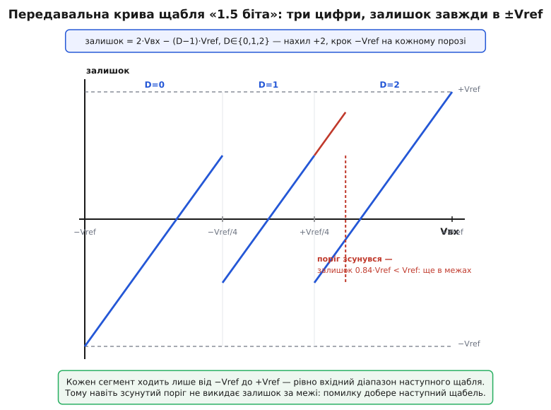
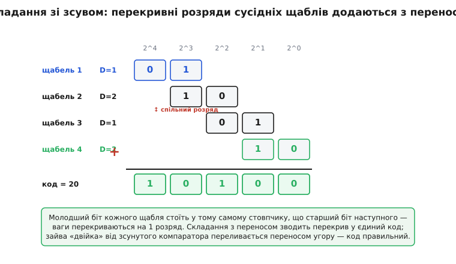

# 🧮 Надлишковість і зсувне додавання: як груба арифметика скасовує зсув компаратора

У статті про конвеєрний АЦП був сміливий обіцяний трюк: щаблі можна будувати на **грубих**, неточних компараторах — а точність усе одно вийде на 12–14 розрядів, бо помилку виправить не дороге залізо, а **арифметика**. Звучить майже як фокус: як складання кількох недоладних чисел може дати число точніше, ніж кожне з доданків? Тут ми цей фокус розберемо до гвинтика. Побачимо, **чому** щабель «1.5 біта» має саме три стани, а не два й не чотири; **як** діапазони сусідніх щаблів навмисне перекриваються; і **як** просте додавання зі зсувом бере перекривні шматки й повертає єдиний правильний код, дорогою тихо ковтаючи похибку кожного компаратора.

Головна думка, яку варто винести ще до формул: **надлишковість — це не марнування, а страховка**. Ми свідомо витрачаємо частину роздільної здатності кожного щабля не на нову інформацію, а на **запас, у якому може безкарно жити помилка**. А потім арифметика цей запас «згортає» назад, і в остаточному коді від нього не лишається сліду — крім того, що код виявляється правильним навіть тоді, коли окремий компаратор збрехав. Розберімо це з першопричини.

## Спочатку — чесний щабель без запасу, і чому він крихкий

Щоб оцінити рятунок, треба гостро відчути біду. Візьмімо найпростіший щабель, що зрізає **рівно один біт**. Він має один компаратор і один поріг — посередині шкали, на нулі (домовмося, що вхід ходить симетрично, від −Vref до +Vref, а нуль — центр). Логіка проста:

```
якщо Vвх ≥ 0 :  біт = 1,  залишок = 2·Vвх − Vref
якщо Vвх < 0 :  біт = 0,  залишок = 2·Vвх + Vref
```

Придивімося, що робить це віднімання. Компаратор вирішив, у яку половину шкали впав вхід; ЦАП відновив цю половину як рівень (+Vref/2 чи −Vref/2 у перерахунку); щабель відняв його й **подвоїв** різницю, щоб залишок знову заповнив увесь діапазон −Vref…+Vref для наступного щабля. Помножили на два — бо один зрізаний біт зменшив невизначеність удвічі, і щоб залишок знову став «на весь розмах», його треба розтягнути рівно вдвічі.

Тепер уявімо, що поріг компаратора **не точно на нулі**, а зсунутий на маленьку напругу зсуву V_offset — реальний компаратор завжди такий, бо транзистори в його плечах трохи різні. Хай вхід — крихітне додатне число, менше за V_offset. Істина: Vвх > 0, треба біт = 1. Але зсунутий компаратор бачить його **нижче** свого зміщеного порога й каже біт = 0. Тоді щабель відніме **не той** рівень і обчислить залишок = 2·Vвх + Vref. А оскільки Vвх — маленьке додатне, цей залишок вилетить **над +Vref**:

```
Vвх = +0.1·Vref  (мало, але додатне)
хибний біт = 0  →  залишок = 2·(0.1·Vref) + Vref = 1.2·Vref   > +Vref !
```

Залишок перевищив +Vref — тобто вийшов **за межі**, які наступний щабель фізично здатен прийняти (його вхід теж −Vref…+Vref). Наступний щабель упреться в стелю, віддасть максимальний код і **не зможе домірити** цей вихлюп: інформацію про недомір безповоротно втрачено. Один-єдиний зсунутий поріг у першому щаблі зіпсував весь результат. Ось чому «наївний» конвеєр вимагав би, щоб кожен компаратор був точний до повної роздільності приладу, — а це знову те дороге точне залізо, від якого вся архітектура тікала.

> 🔧 **Навіщо це.** Зсув компаратора — не рідкісний дефект, а **норма**: у КМОН-компараторі це десятки мілівольтів через розкид порогів транзисторів. На 12 розрядах один молодший розряд (LSB) при Vref = 1 В — це заледве 0.24 мВ. Вимагати від компаратора точності в частку LSB — означає будувати його величезним і повільним, убиваючи головну перевагу конвеєра. Уся техніка нижче існує рівно для того, щоб дозволити компараторам бути малими, швидкими й **брехливими на десятки мілівольтів** — і все одно отримати чесні 12 біт.

## Рятунок: лишити коридор, куди помилка може вилізти безкарно

Погляньмо ще раз, **чому** залишок вилетів за межу. Бо в чесному однобітному щаблі кожна з двох гілок залишку **впритул** торкається межі: коли вхід підходить до порога, залишок підходить до самісінького +Vref (або −Vref). Запасу нема — найменший зсув штовхає його за край.

Звідси й ідея, красива своєю простотою: **не зрізати біт „під зав'язку"**. Хай залишок кожної гілки не сягає межі, а лишає **вільний коридор** зверху й знизу. Тоді, якщо компаратор трохи схибить і залишок трохи «переллється» через розрахункову точку, він **усе одно лишиться в межах** — забреде у вільний коридор, а не за край. Наступний щабель прийме такий залишок спокійно й домірить те, що перший «недорахував». Похибка не зникла — вона **перетекла в залишок** і чекає, щоб її добрали далі.


*Три сегменти залишку (за цифрами D=0,1,2) з нахилом +2; на кожному порозі залишок стрибає на −Vref. Кожен сегмент ходить лише від −Vref до +Vref — рівно вхідний діапазон наступного щабля. Червоним показано зсунутий поріг: сегмент D=1 продовжується трохи далі, але залишок 0.84·Vref усе одно менший за Vref — не вилітає за межу, і наступний щабель його домірює.*

Щоб коридор з'явився, потрібно **більше однієї точки рішення**. Одного порога досить лише на «вище/нижче» — дві гілки без запасу. Додаймо **другий поріг**: тепер шкала ділиться не на дві частини, а на **три**, і між ними є місце для коридору. Оце «три частини замість двох» і є вся суть щабля «1.5 біта».

## Чому саме три стани — і чому це «1.5 біта»

Порахуймо роздільність по-чесному. Один компаратор дає 2 стани — це **1 біт** (бо log₂2 = 1). Три компаратори по драбині, як у [flash-АЦП](topic:electronics/adc-types), дали б 4 стани — **2 біти** (log₂4 = 2). А наш щабель має **два** пороги, тобто **три** стани. Скільки це біт?

```
роздільність = log₂(число станів)
1 поріг  → 2 стани → log₂2 = 1.0 біта
2 пороги → 3 стани → log₂3 ≈ 1.585 біта
3 пороги → 4 стани → log₂4 = 2.0 біта
```

Три стани — це ≈1.585 біта. У жаргоні перетворювачів це округлили до звучного **«1.5 біта»**: **один повноцінний біт корисної інформації плюс піврозряду надлишку**. Назва трохи лукава — насправді трохи більше за півтора, — але вона точно передає суть: **щабель віддає в остаточний код лише 1 біт, а зайвий (третій) стан витрачено не на нову інформацію, а на страховку**. Цей третій стан і є коридор, у якому переживає похибку зсунутий поріг.

Розставмо два пороги симетрично. Природний і майже завжди вживаний вибір — на **−Vref/4 і +Vref/4** (чому саме чверть — з'ясуємо за хвилину, це не довільно). Вони ділять вхід на три ділянки, кожній припишемо цифру D:

```
Vвх < −Vref/4          →  D = 0
−Vref/4 ≤ Vвх < +Vref/4 →  D = 1
Vвх ≥ +Vref/4          →  D = 2
```

А залишок будуємо однією формулою на всі три ділянки — центруємо навколо тієї чверті шкали, куди попав вхід, і подвоюємо:

```
залишок = 2·Vвх − (D − 1)·Vref
```

Підставмо межі кожної ділянки й подивімося, **куди сягає залишок** — це головна перевірка всієї конструкції:

```
D=0:  Vвх ∈ [−Vref, −Vref/4)   →  залишок = 2·Vвх + Vref  ∈ [−Vref, +Vref/2)
D=1:  Vвх ∈ [−Vref/4, +Vref/4) →  залишок = 2·Vвх        ∈ [−Vref/2, +Vref/2)
D=2:  Vвх ∈ [+Vref/4, +Vref)   →  залишок = 2·Vвх − Vref  ∈ [−Vref/2, +Vref)
```

Ось воно — серце всієї схеми. **Жодна гілка не виходить за −Vref…+Vref**, тобто залишок завжди влазить у вхід наступного щабля. Але — і це ключове — **майже жодна не сягає межі впритул**: гілка D=1 гуляє лише в межах ±Vref/2, лишаючи по чверті шкали вільної зверху й знизу. Це і є той коридор. Гілки D=0 і D=2 торкаються дальньої межі одним кінцем (на самому краю шкали входу), але з боку **порогів** — там, де загрожує зсув компаратора, — теж мають запас пів-Vref. Саме тому зсунутий поріг більше нікого не вбиває.

## Скільки зсуву прощає коридор — рахунок на числах

Коридор не безмежний; порахуймо точно, **який найбільший зсув компаратора** він прощає. Візьмімо правий поріг, номінально на +Vref/4, і хай він зсунувся праворуч на V_offset. Тоді вхід трохи більший за +Vref/4 (насправді вже область D=2) компаратор помилково залишить у D=1. Найгірший випадок — вхід підповз до самого зсунутого порога:

```
Vвх → (Vref/4 + V_offset)   але щабель вважає D = 1
хибний залишок = 2·Vвх − 0 = 2·(Vref/4 + V_offset) = Vref/2 + 2·V_offset
```

Щоб цей залишок не вискочив за +Vref, потрібно:

```
Vref/2 + 2·V_offset ≤ Vref
        2·V_offset  ≤ Vref/2
          V_offset  ≤ Vref/4
```

**Коридор прощає зсув компаратора аж до чверті опорної напруги.** При Vref = 1 В це цілих **±250 мВ** допустимого зсуву — тоді як без запасу небезпечним був уже частковий LSB, тобто частки мілівольта. Різниця — три порядки. Отепер зрозуміло, чому пороги ставлять саме на ±Vref/4: це рівно та відстань, що дає найбільший симетричний коридор — пів-Vref завширшки — і водночас лишає залишок у межах. Ближче до центру — коридор вужчий; далі до країв — гілки D=0/D=2 вилізли б за межу. Чверть — золота середина, і вона випливає з арифметики, а не з примхи.

> 🔧 **Навіщо це.** Ця цифра — ±Vref/4 — прямо визначає, **наскільки дешевими** можуть бути компаратори щабля. Проєктувальник дивиться на свій КМОН-компаратор, оцінює його найгірший зсув (скажімо, ±40 мВ при Vref = 1 В) і бачить: 40 мВ ≪ 250 мВ — запас велетенський. Отже, компаратор можна робити крихітним і швидким, не морочачись його точністю зовсім. Уся мегагерцова спритність конвеєра тримається на цьому запасі. Прибери надлишковість — і кожен компаратор довелося б калібрувати до часток мілівольта.

## Але третій стан — це «зайвий» біт. Куди його дівати?

Ми виграли стійкість, та за неї треба заплатити. Кожен щабель тепер видає **три** можливі цифри (D ∈ {0,1,2}), а це не влазить в один двійковий біт — трьом станам треба **два** біти (00, 01, 10). Виходить, N щаблів дають 2N бітів сирого коду, хоч корисної інформації в них лише близько N+1 біта. Є надлишок, і його треба **згорнути** назад у компактний правильний код. Оце згортання й робить **зсувне додавання** (англ. *shift-and-add*) — і саме воно тихо скасовує всі накопичені похибки порогів.

Щоб побачити, як біти складаються, згадаймо, **що фізично означає цифра щабля**. Кожен щабель зрізає свою цифру з того, що до нього дійшло, а дійшов до нього **залишок попереднього, підсилений удвічі**. Підсилення на 2 — це зсув на один двійковий розряд. Тому цифра кожного наступного щабля важить **удвічі менше** за цифру попереднього: перший щабель видає найстарші розряди коду, останній — наймолодші. Формально, для ланцюга з N щаблів повний код збирається так:

```
код = D₁·2^(N−1) + D₂·2^(N−2) + … + D_N·2⁰ = Σ Dᵢ·2^(N−i)
```

Кожна цифра Dᵢ ∈ {0,1,2} — двобітна, а важить вона 2^(N−i). Ось де народжується **перекриття**: цифра щабля i займає розряди 2^(N−i) і 2^(N−i+1) — а старший із них, 2^(N−i+1), це **той самий розряд**, у якому лежить молодший біт цифри щабля i−1. Сусідні щаблі **діляться одним двійковим розрядом**. Це не помилка планування, а точна причина, чому корекція працює: у спільному розряді може статися перенос, і саме перенос переносить «зайву двійку» помилкового щабля вгору, туди, де її поглине сусід.


*Кожен щабель дає двобітну цифру D∈{0,1,2}; молодший біт щабля стоїть у тому самому стовпчику, що старший біт наступного — ваги перекриваються на 1 розряд. Складання стовпчиків із переносом згортає перекрив у єдиний код (тут 10100 = 20). «Зайва двійка» від зсунутого компаратора переливається переносом угору й гаситься — код виходить правильний.*

## Як саме додавання ковтає похибку — простежмо перенос

Тепер — найтонше й найкрасивіше. Покажемо на числах, що зсунутий поріг **не змінює остаточного коду взагалі**, бо перенос усе виправляє.

Візьмімо конкретний вхід, який попадає рівно на межу між ділянками D=1 і D=2 першого щабля — саме там, де зсунутий поріг найлегше збреше. Хай істинна відповідь — «вхід трошки вище +Vref/4», тобто D₁ мало б бути **2**. Простежмо два сценарії — чесний компаратор і зсунутий — і переконаймося, що код однаковий.

**Сценарій А — чесний компаратор.** Перший щабель бачить вхід правильно: D₁ = 2. Віднімає рівень для D=2, залишок = 2·Vвх − Vref. Оскільки вхід ледь вищий за Vref/4, залишок ледь вищий за −Vref/2 — маленьке число трохи над нижнім краєм коридору. Наступні щаблі домірюють цей залишок; хай вони дадуть, скажімо, D₂D₃… такі, що доклали до коду ще 1. Разом код = 2·(вага першого) + 1.

**Сценарій Б — зсунутий поріг.** Правий поріг зсунувся вгору, і той самий вхід компаратор помилково відносить до D=1. Тепер D₁ = 1 (на одиницю **менше** за правду). Щабель віднімає рівень для D=1, залишок = 2·Vвх − 0 = 2·Vвх, тобто ледь вищий за +Vref/2 — велике число, що вилізло **у верхній коридор**, але (як ми довели вище) лишилося під +Vref. Наступні щаблі бачать **більший** залишок, ніж у сценарії А — рівно на Vref більший, — і домірюють його. А оскільки перший щабель недорахував свою цифру на 1 (у своїй вазі 2^(N−1)), недомір, що перетік у залишок, коштує наступним щаблям рівно **+1 у тій самій старшій вазі**. Перенос із їхнього додавання підіймається в спільний розряд — і **відновлює ту одиницю, яку перший щабель забув**.

Складімо обидва сценарії стовпчиком (беручи прості числа для наочності, вага першого щабля = 8):

```
Сценарій А (чесно):   D₁=2 → 2·8 = 16 ;  решта доклала 1  →  код = 17
Сценарій Б (зсув):    D₁=1 → 1·8 =  8 ;  решта доклала 9  →  код = 17
                                          (8 «недоліку» перелилися переносом)
```

**Код той самий — 17 — попри те, що компаратор першого щабля збрехав.** Ось де фокус розкривається: помилка компаратора не зникла магічно; вона **точно скомпенсувалася** тим, що недорахований шматок перетік у залишок, наступні щаблі його домірили, а зсувне додавання з переносом склало все назад у правильну суму. Надлишковий третій стан дав залишкові куди «переллятися», перекриття розрядів дало переносу куди «піднятися», а додавання звело кінці. Груба арифметика скасувала зсув грубого компаратора — рівно як і обіцяла стаття.

Єдина умова, за якої це працює: залишок **мусив лишитися в межах ±Vref**, інакше наступний щабель не зміг би його домірити й перенос не сформувався б правильно. А він лишається в межах саме тому, що зсув не перевищив ±Vref/4 — коридору, який ми навмисне лишили. Усі три частини — три стани, перекриття, додавання — працюють лише разом; вийми будь-яку, і виправлення розсиплеться.

## Робочий приклад: повний конвеєр із зсунутим порогом

Зберімо все докупи на невеликому конкретному АЦП і покажемо в коді, що навіть із навмисне зіпсованим компаратором на виході — правильне число.

**Чотирищаблевий 1.5-бітний конвеєр, один компаратор зсунуто на +0.15·Vref.** Подамо вхід Vвх = 0.30·Vref (у частках Vref, тож шкала −1…+1). Порахуймо цифри щаблів і зберемо код зсувним додаванням — спершу з чесними порогами, потім із зсунутим першим.

:::tabs
```cpp
// 1.5-бітний щабель: два пороги ±Vref/4 (тут Vref=1, шкала −1..+1).
// Повертає цифру D∈{0,1,2}; через out_res віддає залишок для наступного щабля.
int stage_15bit(float vin, float thr_hi, float thr_lo, float *out_res) {
    int d;
    if      (vin >=  thr_hi) d = 2;      // вище верхнього порога
    else if (vin >=  thr_lo) d = 1;      // між порогами — коридор
    else                     d = 0;      // нижче нижнього порога
    *out_res = 2.0f * vin - (float)(d - 1);   // залишок = 2·Vвх − (D−1)·Vref, Vref=1
    return d;
}

// Зібрати код N щаблів зсувним додаванням: код = Σ Dᵢ·2^(N−1−i)
int assemble(const int *D, int n) {
    int code = 0;
    for (int i = 0; i < n; i++) code += D[i] << (n - 1 - i);  // зсув = вага щабля
    return code;
}

void demo(void) {
    const int N = 4;
    float vin = 0.30f;                 // вхід у частках Vref
    int   D[4];
    float r;

    // — чесні пороги: ±0.25 на всіх щаблях —
    r = vin;
    for (int i = 0; i < N; i++) D[i] = stage_15bit(r, +0.25f, -0.25f, &r);
    int code_ok = assemble(D, N);      // еталонний код

    // — той самий вхід, але верхній поріг ПЕРШОГО щабля зсунуто на +0.15 —
    r = vin;
    D[0] = stage_15bit(r, +0.25f + 0.15f, -0.25f, &r);   // поріг 0.40 замість 0.25
    for (int i = 1; i < N; i++) D[i] = stage_15bit(r, +0.25f, -0.25f, &r);
    int code_bad = assemble(D, N);     // код зі зсунутим компаратором

    // code_ok == code_bad — зсувне додавання скасувало похибку порога
}
```
```python
# 1.5-бітний щабель: два пороги ±Vref/4 (тут Vref=1, шкала −1..+1).
# Повертає (цифру D∈{0,1,2}, залишок для наступного щабля).
def stage_15bit(vin, thr_hi, thr_lo):
    if   vin >= thr_hi: d = 2      # вище верхнього порога
    elif vin >= thr_lo: d = 1      # між порогами — коридор
    else:               d = 0      # нижче нижнього порога
    res = 2.0 * vin - (d - 1)      # залишок = 2·Vвх − (D−1)·Vref, Vref=1
    return d, res


# Зібрати код N щаблів зсувним додаванням: код = Σ Dᵢ·2^(N−1−i)
def assemble(D):
    n = len(D)
    return sum(d << (n - 1 - i) for i, d in enumerate(D))  # зсув = вага щабля


def demo():
    N = 4
    vin = 0.30                     # вхід у частках Vref

    # — чесні пороги: ±0.25 на всіх щаблях —
    D = []
    r = vin
    for _ in range(N):
        d, r = stage_15bit(r, +0.25, -0.25)
        D.append(d)
    code_ok = assemble(D)          # еталонний код

    # — той самий вхід, але верхній поріг ПЕРШОГО щабля зсунуто на +0.15 —
    D = []
    r = vin
    d, r = stage_15bit(r, +0.25 + 0.15, -0.25)   # поріг 0.40 замість 0.25
    D.append(d)
    for _ in range(N - 1):
        d, r = stage_15bit(r, +0.25, -0.25)
        D.append(d)
    code_bad = assemble(D)         # код зі зсунутим компаратором

    # code_ok == code_bad — зсувне додавання скасувало похибку порога
```
:::

Простежмо числа руками, щоб побачити перенос на власні очі.

**Чесний хід.** Vвх = 0.30 ≥ 0.25 → D₁ = 2; залишок = 2·0.30 − 1 = −0.40. Далі −0.40 < −0.25 → D₂ = 0; залишок = 2·(−0.40) + 1 = +0.20. Далі −0.25 ≤ 0.20 < 0.25 → D₃ = 1; залишок = 2·0.20 = +0.40. Далі 0.40 ≥ 0.25 → D₄ = 2. Цифри D = [2, 0, 1, 2].

```
код_ок = 2·2³ + 0·2² + 1·2¹ + 2·2⁰ = 16 + 0 + 2 + 2 = 20
```

**Зсунутий хід.** Верхній поріг першого щабля тепер 0.40. Vвх = 0.30 < 0.40 → компаратор бреше: D₁ = 1 (а не 2); залишок = 2·0.30 − 0 = +0.60 — вилізло у верхній коридор, але 0.60 < 1, у межах. Далі 0.60 ≥ 0.25 → D₂ = 2; залишок = 2·0.60 − 1 = +0.20. Далі D₃ = 1 (як і раніше); залишок = +0.40 → D₄ = 2. Цифри D = [1, 2, 1, 2].

```
код_зсув = 1·2³ + 2·2² + 1·2¹ + 2·2⁰ = 8 + 8 + 2 + 2 = 20
```

**Обидва — 20.** Перший щабель у зсунутому ході недорахував свою цифру на одиницю (1 замість 2, тобто на 2³ = 8 менше). Але цей недомір перетік у більший залишок, і другий щабель, побачивши +0.60 замість −0.40, видав D₂ = 2 замість 0 — рівно на 2·2² = 8 більше. Вісім, що їх «загубив» перший щабель, повернулися переносом через сусідній розряд. Код збігся до останнього біта, хоч компаратор помилявся на цілих 0.15·Vref. Це і є цифрове виправлення похибок у дії — жодного точного заліза, сама лише арифметика зсуву й переносу.

## Що це дає й де межа

Складімо ланцюжок думки в одне. Груба точка рішення (компаратор) неминуче має зсув; без запасу цей зсув штовхає залишок за межу й губить код. Ми лишаємо **третій стан** — коридор шириною пів-Vref, — і залишок за будь-якого зсуву до **±Vref/4** лишається в межах, лише «переливаючись» у коридор. Цей вихлюп означає, що щабель **недорахував** свою цифру, але недорахований шматок **не зник** — він поїхав у залишок, наступні щаблі його домірили, а **зсувне додавання з переносом** повернуло все у правильну суму, бо сусідні цифри **навмисне перекриваються** одним двійковим розрядом, куди й підіймається виправний перенос. Три стани, перекриття, додавання — одна нерозривна машина.

Важлива чесна межа: надлишковість лікує **зсув порогів суб-АЦП** — і лише його. Вона **не** виправляє похибки, що псують сам залишок після рішення: неточне підсилення (не рівно ×2), витік заряду в MDAC, зсув операційного підсилювача, невідповідність конденсаторів. Ці помилки спотворюють залишок, який передають далі, — а виправлення переносом припускає, що залишок **правильний**, просто цифра занижена. Тому в реальних конвеєрах цифрову корекцію доповнюють калібруванням підсилення й узгодженням елементів; надлишковість знімає найдешевше — вимогу до компараторів, — але не звільняє від точності аналогового тракту. Знати, що саме вона рятує, а що ні, — і є різниця між тим, хто застосовує трюк наосліп, і тим, хто розуміє його межі.

Робочий код самого збирача — як зберігати цифри щаблів, вирівнювати їх затримкою конвеєра й додавати зі зсувом у потоковому режимі — розгорнуто у вставці [конвеєр на С: збирання коду з перекривних щаблів](topic:electronics/pipeline-adc/proj-stage-assembly.md). А те, **чому** саме надлишковий щабель зробив архітектуру практичною історично — від субдіапазонних перетворювачів до цифрової корекції кінця 1980-х, — у вставці [як народився конвеєрний АЦП](topic:electronics/pipeline-adc/hist-pipeline-origin.md).

Найцінніше ж тут — сама ідея, ширша за АЦП: **виміряй грубо, але з навмисним запасом; дозволь помилці накопичитися в цьому запасі; а тоді згорни запас арифметикою, і точність з'явиться там, де жодна окрема ланка її не мала**. Це той самий дух, що й у надлишкових кодах зв'язку чи у страхувальних розрядах пам'яті: витратити трохи місця на страховку — дешевше, ніж робити кожну ланку бездоганною.
