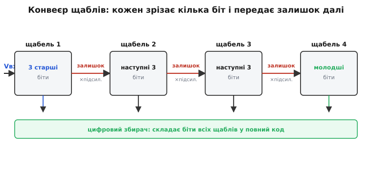
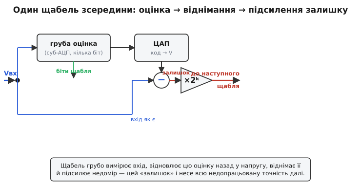
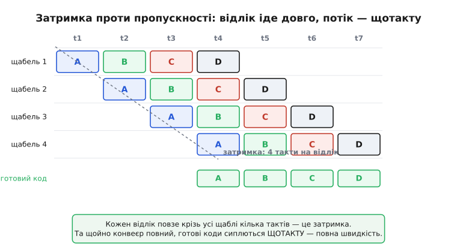
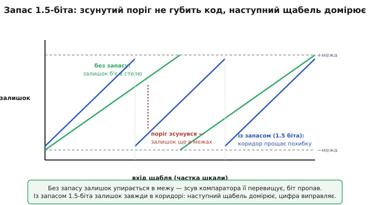

# Конвеєрний АЦП: як вимірювати швидко й точно водночас, передаючи недомір далі

Поставте перед перетворювачем нездійсненну, на перший погляд, вимогу: дай мені дванадцять чесних розрядів — і дай їх десятки мільйонів разів на секунду. Найшвидший із усіх АЦП, паралельний (flash), порівнює вхід з усіма рівнями шкали одразу й видає код за один такт — але щоб розрізнити 2¹² рівнів, йому потрібно майже стільки ж компараторів, понад чотири тисячі. Така армія компараторів не лізе на кристал ні за ціною, ні за споживанням, ні за площею. А точний, але неквапний перетворювач, що зважує вхід по одному біту за крок, дванадцять розрядів видасть — але за дванадцять кроків, і про десятки мегавідліків годі мріяти. Між «швидко й грубо» та «точно й повільно» зяє провалля. **Конвеєрний АЦП** (англ. *pipeline* — конвеєр, потоково-послідовна лінія) перекидає через нього місток одним напрочуд людським прийомом: не намагатися виміряти все одразу, а виміряти грубо, **запам'ятати, чого не домірив**, і передати цей недомір далі — наступному, хто домірить.

Це той самий принцип, на якому стоїть цех із конвеєром. Жоден робітник не збирає авто цілком; кожен робить свою дрібну операцію й штовхає недороблене далі. Один пост повільний, але постів багато, вони працюють **одночасно** — і з кінця стрічки авто сходять одне за одним, хоч кожне окреме провело в цеху години. Конвеєрний АЦП розкладає одне важке перетворення на ланцюжок легких кроків, які працюють паралельно над різними відліками, — і з кінця ланцюга коди сиплються повним потоком.

> 🔧 **Навіщо це.** Саме конвеєрні АЦП стоять там, де треба і швидкість, і пристойна точність: цифрові осцилографи й аналізатори спектра, відеотракти, базові станції зв'язку, програмне радіо (SDR), медичне УЗД. Це робочий діапазон 10–16 розрядів на десятках і сотнях мегавідліків за секунду — нішу, де flash уже надто грубий і ненажерливий, а зважувальний [SAR](book:electronics/adc-types) уже надто повільний. Розуміючи, як конвеєр поділяє роботу, інженер наперед бачить його два визначальні характери: величезну пропускність — і затримку від входу до коду.

### Головний прийом: виміряти грубо й передати залишок

Уявімо один щабель цього конвеєра. Йому дають аналогову напругу, а від нього хочуть лише **кілька старших розрядів** — скажімо, три. Зробити це легко й швидко: грубий внутрішній перетворювач на три біти має лиш сім компараторів і впорається за один такт. Та зупинятися на цьому не можна — три біти ще не весь результат, у напрузі лишилася точність, якої ці три біти не вловили. Уся хитрість у тому, **що робити з цим недоміром**.

Щабель чинить так. Спершу він бере свою грубу трибітну оцінку й **відновлює її назад у напругу** — тим самим внутрішнім [ЦАП](book:electronics/dac), що перетворює код у рівень. Виходить східчасте наближення вхідного сигналу: те, що щабель «зрозумів». Тоді він **віднімає це наближення від справжнього входу**. Різниця — це рівно те, чого груба оцінка не дістала: маленький недомір, який зветься **залишком** (англ. *residue* — те, що лишилось). А далі — ключовий рух: щабель **підсилює залишок**, розтягуючи його назад на повну шкалу, і передає наступному щаблю.

```
залишок = Vвх − ЦАП(грубий_код)
на_вихід = залишок × 2ᵏ        (k — скільки біт зрізав цей щабель)
```


*Кожен щабель грубо вимірює вхід, віддає кілька старших біт у спільний збирач і передає підсилений залишок наступному. Перший зрізає старші розряди, останній — молодші; цифровий збирач складає внески всіх щаблів у повний код. Робота поділена між постами, як на заводському конвеєрі.*

Чому залишок треба саме **підсилювати**? Бо без цього кожен наступний щабель мав би мірити дедалі дрібніші недоміри дедалі точнішим залізом — і весь зиск зник би. А коли залишок розтягнуто на повну шкалу, **наступний щабель улаштований точнісінько так само, як перший**: бачить сигнал «на весь діапазон» і так само грубо зрізає з нього свої кілька біт. Однакові щаблі, кожен видає кілька старших розрядів того, що до нього дійшло, кожен підсилює свій залишок і штовхає далі. Множник 2ᵏ невипадковий: зрізавши k біт, щабель зменшив невизначеність у 2ᵏ разів, тож щоб залишок знову заповнив усю шкалу, його треба підняти рівно в 2ᵏ. Підсилення повертає масштаб — і ланцюг можна нарощувати з тотожних ланок.

### Один щабель зсередини

Зберімо щабель докупи й подивімося, з чого він фізично складається. Усередині живуть чотири речі: грубий **суб-АЦП** (кілька компараторів, що дають кілька біт), **ЦАП** (повертає цей код у напругу), **вузол віднімання** й **підсилювач залишку**. На кристалі останні три зазвичай зливають в один спритний вузол на перемикальних конденсаторах — його звуть **множильним ЦАП** (англ. *multiplying DAC*, MDAC): той самий блок і відновлює оцінку, і віднімає її, і підсилює різницю, перерозподіляючи заряд між конденсаторами за двома тактами ключів. Але логіка від цього не міняється — це все ті самі чотири дії.


*Усередині щабля: суб-АЦП грубо оцінює вхід (його біти йдуть у збирач), ЦАП відновлює цю оцінку назад у напругу, суматор віднімає її від справжнього входу, а підсилювач розтягує недомір — залишок — на повну шкалу для наступного щабля. На кристалі віднімання й підсилення часто роблять одним вузлом-MDAC.*

Тут стає видно, **навіщо входу не дають змінюватися** під час усього цього. Щоб віднімання було чесним, у суматор мусять прийти дві напруги, зняті з **того самого** миттєвого значення сигналу: і груба оцінка, і сам вхід. Якби вхід дрейфував, поки суб-АЦП думає, а ЦАП відновлює, — віднялися б два різні моменти, і залишок став би сміттям. Тому перед конвеєром (а часто й усередині кожного MDAC) стоїть [вузол вибірки й зберігання](book:electronics/sampling-quantization), що заморожує напругу на час обробки. Без цієї нерухомої цілі весь ланцюжок «оціни — відніми — підсили» втратив би сенс.

### Визначальна риса: затримка проти пропускності

А тепер — найважливіше й найменш очевидне в конвеєрі. Простежмо за **одним** відліком. Він заходить у перший щабель, той зрізає старші біти й віддає залишок другому; на наступному такті другий щабель обробляє цей залишок, а перший уже **бере новий відлік**. На третьому такті недомір першого відліку доходить до третього щабля, тоді як перші два щаблі вже зайняті пізнішими відліками. Виходить, що в кожну мить **усі щаблі працюють — але кожен над своїм, іншим відліком**. Точнісінько як на конвеєрі: поки перший пост приварює двері до п'ятого кузова, останній фарбує перший.


*Кожен відлік (A, B, C, D) повзе по діагоналі вниз — крок за кроком крізь усі щаблі, по одному такту на щабель. Це затримка: від входу до готового коду минає стільки тактів, скільки щаблів. Зате внизу видно головний зиск: щойно конвеєр наповнився, готові коди виходять щотакту — по одному на такт, повним потоком.*

Звідси два числа, які треба тримати в голові нарізно, бо їх постійно плутають. **Затримка** (англ. *latency*) — скільки тактів минає від моменту, коли відлік зайшов, до моменту, коли його повний код вийшов; вона дорівнює числу щаблів (плюс трохи). Дванадцятирозрядний конвеєр із шести щаблів видасть код **сьомого** відліку лише тоді, коли перший відлік уже давно пройшов. **Пропускність** (англ. *throughput*) — скільки готових кодів виходить за секунду; і вона дорівнює **тактовій частоті**, бо щойно конвеєр повний, кожен такт виштовхує один готовий результат. Конвеєр платить затримкою — і купує за неї повну швидкість.

> 🔧 **Навіщо це.** Затримка нешкідлива там, де ви просто пишете суцільний потік відліків (захоплення осцилограми, спектр, відео): кілька тактів зсуву нікого не турбують, важлива швидкість потоку. Але вона стає пасткою у **зворотному зв'язку** — у контурі регулювання, де керівний сигнал залежить від щойно зміряного: зайві такти затримки додають фазовий зсув і можуть розхитати петлю. Тож, обираючи конвеєрний АЦП під керування рухом чи живленням, інженер дивиться не лише на мегавідліки, а й на затримку в тактах — інакше швидкий перетворювач підступно дестабілізує систему.

### Слабке місце — і несподівано елегантний рятунок

У цій красивій схемі сидить вада, що могла б її занапастити. Грубий суб-АЦП на кожному щаблі вирішує «вхід вище порога чи нижче?» компаратором, а реальний компаратор має **зсув** (англ. *offset*) — він спрацьовує трохи не там, де треба, через розкид транзисторів. Якщо щабель через такий зсув віднесе вхід не до того щабля шкали, він **відніме хибну оцінку**, залишок вилетить за межі, які здатен опрацювати наступний щабель, — і код буде безнадійно зіпсований. Здавалося б, щоб конвеєр працював на 12 розрядів, кожен компаратор у ньому мусить бути точним до 12 розрядів. Це знову повертає нас до дорогого точного заліза, від якого ми тікали.

Рятунок виявився чи не найкрасивішою ідеєю в усій схемотехніці перетворювачів — **цифрове виправлення похибок** через **надлишковість**. Думка така: нехай кожен щабель видобуває біт не «під зав'язку», а з **запасом** — лишає вільний коридор, у який залишок може вилізти й нікого цим не вб'є. Класичне втілення — щабель на **1.5 біта**: він має не один поріг, а кілька, видає на виході один із трьох станів замість двох, і його залишок навіть за зсунутого порога **гарантовано лишається в межах**, які прийме наступний щабель. Той недомір, що його перший щабель «не дорахував» через похибку компаратора, не зникає — він **перетікає в залишок**, наступний щабель його **домірює**, а проста цифрова логіка згодом **складає перекривні біти зі зсувом і додаванням**, скасовуючи похибку. Точність компараторів падає до сміховинної: вони можуть бути грубими, бо їхні помилки виправляє не точніше залізо, а **арифметика**.


*Зелена крива — щабель без запасу: залишок упирається в самісіньку межу, тож найменший зсув порога її перевищує й біт пропадає. Синя — щабель із запасом 1.5-біта: залишок ходить у вільному коридорі, тож навіть зсунутий поріг (червоний пунктир) лишає його в межах; наступний щабель домірює недомір, а цифрове додавання скасовує похибку.*

Ось чому конвеєрні АЦП реально працюють на 12–14 розрядів із дешевих грубих компараторів. Без надлишковості й цифрового виправлення архітектура лишилася б крихкою лабораторною цікавинкою. Розкладку біт зі зсувом і саму арифметику виправлення варто пройти на конкретних числах — [як надлишковість і цифрове додавання скасовують зсув компаратора](book:electronics/pipeline-adc/math-redundancy.md): чому щабель «1.5 біта» дає саме три стани, як перекриваються діапазони сусідніх щаблів і як зсувне додавання повертає правильний код. Сама ж ідея «виміряй грубо з запасом — а точність добери цифрою згодом» виходить далеко за межі АЦП і варта того, щоб закарбуватися.

### Скільки це в числах

Абстракція стає відчутною, щойно підставити цифри. Порахуймо два головні числа конвеєра — затримку й пропускність — і переконаймося, що вони справді живуть нарізно.

**Затримка й потік шестищаблевого конвеєра.** Маємо 12-розрядний конвеєрний АЦП із шести однакових щаблів, тактований на 50 МГц (такт = 20 нс). Скільки готових відліків за секунду він віддає й через скільки часу після входу з'являється код конкретного відліку?

```c
// Один такт обробки на щабель → затримка = число щаблів
int   stages   = 6;
float clk_hz   = 50.0e6f;              // 50 МГц
float t_clk    = 1.0f / clk_hz;        // 20 нс на такт

float throughput = clk_hz;             // 50 Мвідліків/с — щотакту один код
float latency_s  = stages * t_clk;     // 6 × 20 нс = 120 нс від входу до коду
```

П'ятдесят мегавідліків за секунду — і це **попри** те, що кожен окремий відлік провів у перетворювачі цілих 120 наносекунд. Швидкість потоку задає такт, а не довжина шляху крізь щаблі: у цьому весь сенс конвеєра. Збільшимо число щаблів удвічі — затримка подвоїться, а пропускність не зрушиться ні на відлік.

Тепер — **навіщо** в цих щаблях надлишковість, мовою заощадженого заліза:

**Чому 1.5-біта замість 2-біт економить компаратори.** Грубий суб-АЦП у щаблі будують на компараторах із драбиною порогів — як у flash. Скільки компараторів треба «чесному» дворозрядному щаблю й скільки — щаблю «1.5 біта», що дає той самий внесок, але з коридором надлишковості?

```c
// Грубий суб-АЦП: для розрізнення L рівнів треба L−1 компараторів
int comparators_for_levels(int levels) { return levels - 1; }

int honest_2bit  = comparators_for_levels(4);   // 4 рівні → 3 компаратори
int stage_1p5bit = comparators_for_levels(3);   // 3 стани → лише 2 компаратори
// 1.5-біта дає на щабель 1 «чистий» біт + 1 надлишковий для виправлення,
// коштує менше компараторів — і прощає їхній зсув, бо помилку добирає цифра
```

Менше компараторів, та ще й грубих, — і за це не платять точністю, бо її повертає арифметика. Саме цей розмін «трохи надлишковості замість дорогої точності» зробив конвеєр практичним. Робочий код самого складання щаблів зі зсувом — у вставці [конвеєр на С: збирання коду з перекривних щаблів](book:electronics/pipeline-adc/proj-stage-assembly.md): як зберігати біти кожного щабля, вирівнювати їх затримкою й додавати з перекриттям у фінальний код.

### Де конвеєр доречний, а де ні

Кожна архітектура перетворювача сідає у свій кут компромісу між швидкістю, роздільністю й ціною, і конвеєр займає **смугу високих швидкостей за пристойної точності** — від десятків мегавідліків до гігавідліків при 10–16 розрядах. Це його природне поле: швидкий зв'язок, відео, осцилографи, програмне радіо. Там, де треба ще швидше, але біт мало (6–8), беруть flash; там, де треба багато тихих біт (16–24), але повільно, — зважувальний [SAR](book:electronics/adc-types) чи передискретизаційний дельта-сигма. Конвеєр — золота середина для високої пропускності; повну палітру архітектур і їхні ніші розкриває стаття [типи АЦП](book:electronics/adc-types).

У звичайному мікроконтролері конвеєрного АЦП ви майже напевно не зустрінете — там стоїть скромний SAR, бо мегавідліки на десятки мегагерц мікросхемі загального призначення ні до чого, а кристальна площа й споживання конвеєра неоправдані. Конвеєр з'являється у спеціалізованих швидкісних мікросхемах-перетворювачах, куди мікроконтролер хіба заглядає по шину даних. Та знати його будову корисно й тут: коли в приладі трапляється «дивна» стала затримка між аналоговим входом і готовими відліками, причина часто саме конвеєрна — кілька тактів, поки відлік проповзе крізь щаблі.

Конвеєрна архітектура народилася не на голому місці: вона виросла з ідеї **двоступеневого** (субдіапазонного, англ. *subranging*) перетворення — спершу грубо визнач, у яку частину шкали потрапив сигнал, тоді точно домір усередині неї, — а ключем, що зробив її надійною, стало саме цифрове виправлення з надлишковістю. [Як народився конвеєрний АЦП](book:electronics/pipeline-adc/hist-pipeline-origin.md): від субдіапазонних перетворювачів до роботи Стівена Льюїса та Пола Ґрея кінця 1980-х, що дала пристроєві сучасний вигляд із цифровою корекцією, і внеску Б. Джінетті в надлишковий щабель «1.5 біта».

### Що варто винести

Конвеєрний АЦП розв'язує нібито суперечливу вимогу — «швидко **й** точно» — тим, що не міряє все одразу, а розкладає одне важке перетворення на ланцюжок однакових щаблів, кожен з яких **грубо зрізає кілька старших біт, відновлює цю оцінку, віднімає її від входу й підсилює недомір — залишок — для наступного щабля**. Щаблі працюють одночасно над різними відліками, як пости заводського конвеєра, тож з кінця стрічки коди виходять **щотакту** — пропускність дорівнює тактовій частоті. Ціна — **затримка**: кожен відлік проходить усі щаблі за стільки тактів, скільки їх у ланцюзі, і цю затримку не можна забувати у зворотному зв'язку. Слабину архітектури — зсув грубих компараторів, що псує залишок, — лікує не дороге точне залізо, а **надлишковість і цифрове виправлення**: щабель «1.5 біта» лишає коридор, у якому залишок переживає похибку порога, наступний щабель його домірює, а арифметика зі зсувним додаванням скасовує помилку. Звідси й місце конвеєра: 10–16 розрядів на десятках мегавідліків і вище — зв'язок, відео, осцилографи, програмне радіо. Хто бачить його як конвеєр — грубо тут, домір далі, цифрою виправ потім — той одразу читає обидва його характери: повний потік на виході й сталу затримку всередині.
