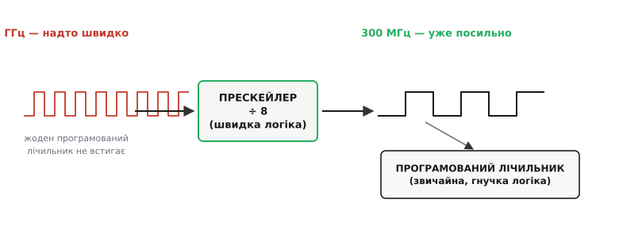
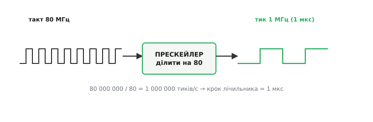
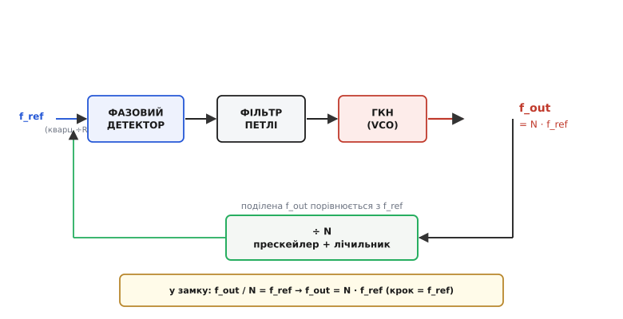

# Прескейлер і синтез частоти

Уся цифрова машина працює від [такту](topic:electronics/clock-signal) — рівномірної прямокутної хвилі, за якою вона крокує. Але постає буденне питання: звідки взяти **потрібну** частоту? Кварц у корпусі мікроконтролера видає, скажімо, 8 чи 40 МГц — одну-єдину, назавжди зашиту в кристал. А процесорному ядру треба 240 МГц, таймеру — рівно 1 МГц, радіомодулю — 2.44 ГГц. Одного кварцу на всіх не напасешся, та й не буває кварцу на будь-яку задану частоту. Тому частоти **роблять** із однієї опорної — ділять її й множать. Ключова цеглинка обох дій — **прескейлер** (англ. *prescaler*, від *pre-* — «перед» і *scale* — «масштабувати»: дільник, що стоїть **перед** рештою схеми й заздалегідь зменшує частоту в задане число разів).

Розберемо це від першопричини: чому взагалі потрібен окремий «передній» дільник, як із його допомогою повільний точний тик робиться зі швидкого такту, і як та сама ідея, вкладена у зворотну петлю, дозволяє **синтезувати** будь-яку частоту з одного кварцу.

### Прескейлер — це просто дільник частоти

За суттю прескейлер — не що інше, як [лічильник](topic:electronics/counters), увімкнений на **ділення частоти**. Механізм простий: один тригер, що перемикається щотакту, ділить частоту навпіл; ланцюг із N таких тригерів ділить на 2ᴺ; а якщо додати детектор, що скидає лічильник на потрібному числі, дістанемо ділення на будь-яке ціле. Прескейлер «÷8» — це лічильник, що видає один імпульс на кожні вісім вхідних; «÷1000» — один на тисячу. Нічого більшого в самому понятті немає.

Питання інше: якщо це просто лічильник, **навіщо йому окрема назва**? Бо в назві захована роль — він стоїть **першим**, перед іншою логікою, і бере на себе найшвидший, найважчий шматок роботи.

### Навіщо ділити «наперед»: швидкий фронт-дільник

Уявімо, що треба порахувати радіочастотний сигнал 2.4 ГГц — один період усього ~0.42 наносекунди. Гнучкий, **програмований** лічильник, якому можна задати довільний коефіцієнт ділення, — це чимала логіка: розряди, компаратор межі, керування. Уся ця логіка має встигнути відпрацювати за час одного вхідного періоду, а на гігагерцах вона просто **не встигає** — [критичний шлях](topic:electronics/clock-signal) її вентилів довший за 0.42 нс. Зробити ж швидким увесь програмований лічильник — дорого й ненажерливо до струму.

Вихід елегантний: поставити **першим** маленький **фіксований** дільник з дуже простою і тому дуже швидкою логікою (часто лише кілька тригерів на найшвидшій доступній технології), який поділить, скажімо, на 8. Він і є прескейлер. Після нього частота вже посильна — 2.4 ГГц / 8 = 300 МГц, — і далі її розбирає звичайний гнучкий лічильник, який на 300 МГц устигає легко.


*Гнучкий програмований лічильник на гігагерцах не встигає — його логіка задовга. Тому першим ставлять **прескейлер**: простий фіксований дільник на дуже швидкій логіці. Поділивши частоту (тут ÷8, 2.4 ГГц → 300 МГц), він віддає посильний сигнал звичайному лічильнику. Швидку роботу робить маленький простий блок, гнучку — великий, але повільніший. Це поділ праці: кожен блок на своїй швидкості.*

Ось чому прескейлер — окреме поняття, а не «ще один лічильник»: він утілює саме цей поділ праці. Найшвидшу ділянку віддають простому блоку, який тільки те й уміє, що швидко ділити на фіксоване число; усю гнучкість лишають повільнішій частині, куди сигнал приходить уже сповільненим.

> 🔧 **Навіщо це.** Коли в даташиті радіочипа чи швидкого таймера бачите «prescaler ÷2/÷4/÷8» на самому вході — це рівно та функція: збити частоту до тієї, з якою впорається наступна, гнучкіша логіка. Без цього переднього дільника числа просто не влізли б у бюджет часу вентилів.

### Прескейлер таймера: повільний тик зі швидкого такту

Найчастіше ви зустрінете прескейлер не в радіо, а в **таймері** мікроконтролера — і тут його роль дзеркальна. Ядро тактується швидко (80 МГц), а лічильник таймера мусить рахувати зручними кроками — скажімо, рівно по мікросекунді. Гнати 16-розрядний лічильник таймера на всіх 80 МГц незручно: він переповниться за ~0.8 мс, та й крок (12.5 нс) невигідний для відліку реального часу. Тому між тактом ядра й таймером ставлять прескейлер, який ділить такт до зручної частоти рахунку.


*Такт ядра 80 МГц занадто дрібний для відліку часу. Прескейлер «÷80» видає один тик на кожні 80 тактів — 80 000 000 / 80 = 1 000 000 тиків за секунду, тобто крок лічильника рівно 1 мкс. Тепер таймер рахує мікросекунди напряму: щоб відміряти 500 мкс, лічимо до 500. Прескейлер перетворює незручну швидку частоту на зручну повільну.*

Тут прескейлер працює як **знижувальний редуктор** для часу: одну «швидку» частоту ядра він перетворює на «повільну» частоту рахунку, зручну для людських інтервалів. Аналогія з редуктором точна — і показова в тому, де ламається: механічний редуктор віддає крутний момент, а цей віддає лише сповільнений ритм, самої «сили» в сигналі не додаючи. Задаєш коефіцієнт прескейлера — обираєш ціну одного кроку лічильника, а отже й діапазон інтервалів, які таймер здатний відміряти.

**Умова.** Такт ядра 80 МГц. Треба, щоб таймер рахував рівно по мікросекунді, і треба згенерувати переривання кожні 500 мкс. Які значення прескейлера й межі лічильника задати?

```c
// такт ядра, Гц
const uint32_t f_clk = 80000000u;   // 80 МГц

// хочемо крок лічильника = 1 мкс  →  частота тиків = 1 000 000 Гц
const uint32_t f_tick = 1000000u;   // 1 МГц

uint32_t prescaler = f_clk / f_tick;   // = 80  → ділимо такт на 80
uint32_t reload    = 500u;             // 500 тиків по 1 мкс = 500 мкс

// у периферії таймера прескейлер часто задають як (дільник − 1):
TIMx_PSC = prescaler - 1u;   // 79  → апаратний дільник поділить на 80
TIMx_ARR = reload    - 1u;   // 499 → лічильник 0…499, переповнення на 500-му тику
```

Вийшло: прескейлер 80 дає тик 1 МГц (крок 1 мкс), а лічильник, що переповнюється на 500-му кроці, дає переривання рівно кожні 500 мкс. Дві типові дрібниці, що чіпляють початківців, видно просто з коду. Перша: у багатьох мікроконтролерах регістр прескейлера й регістр межі зберігають число **на одиницю менше** за коефіцієнт (`PSC = дільник − 1`, `ARR = період − 1`), бо лічба всередині йде від нуля — тому «ділити на 80» пишуть як `79`. Друга: прескейлер задає **зернистість** часу — з тиком 1 мкс годі відміряти інтервал, коротший за мікросекунду; щоб дрібніше, беруть менший прескейлер (дорожчий швидший рахунок, менший діапазон), щоб грубіше й надовше — більший.

### Синтез частоти: одна петля робить будь-яку частоту

Досі ми лише **ділили**. Але щоб дістати з кварцу 40 МГц робочі 240 МГц ядра чи 2.44 ГГц радіо, частоту треба **помножити** — а прямого «множника частоти» в цифровій логіці немає. І тут — головна ідея всієї теми: помножити частоту вдається **саме дільником**, якщо вкласти його у **зворотну петлю**. Ця петля зветься [фазовим автопідстроюванням частоти](topic:electronics/prescaler/hist-pll-synthesis.md) (ФАПЧ; англ. *PLL — phase-locked loop*, «петля, замкнена за фазою»), а вся конструкція — **синтезатор частоти**.

Побудуємо міркування на очах. Візьмімо керований напругою генератор — **ГКН** (генератор, керований напругою; англ. *VCO — voltage-controlled oscillator*): подаєш більшу напругу — він осцилює швидше, меншу — повільніше. Сам собою він неточний і «пливе». Приборкаємо його зворотним зв'язком. Його вихід f_out пропустимо крізь дільник **÷N** і порівняємо поділений сигнал з опорним f_ref (взятим від точного кварцу). Порівнює їх **фазовий детектор**: якщо поділена частота нижча за опорну — він піднімає напругу, і ГКН пришвидшується; якщо вища — знижує, і ГКН гальмує. Плавно веде цю напругу **фільтр петлі**.


*Фазовий детектор порівнює опорну f_ref (від кварцу) з поділеною f_out/N і керує напругою ГКН крізь фільтр петлі. Петля сама шукає рівновагу: вона «замикається», коли поділений вихід **дорівнює** опорному, тобто f_out / N = f_ref. Звідси f_out = N · f_ref. Змінюючи ціле N у дільнику зворотного зв'язку, дістаємо будь-яке кратне опорної — з тією ж точністю, що й кварц. Дільник у петлі перетворився на **множник** частоти.*

Петля неминуче приходить у рівновагу — **замок** (англ. *lock*): стан, коли поділений вихід точно збігається з опорним і напруга ГКН перестає повзти. У замку виконано f_out / N = f_ref, а отже:

```
f_out = N · f_ref
```

Ось воно: дільник **÷N** у зворотному зв'язку зробив із частоти **множник ×N**. Логіка вміє лише ділити — а петля обертає це на множення, бо в рівновазі мусить справдитися рівність. Тепер, **змінюючи ціле N**, синтезуємо будь-яку частоту, кратну опорній, і кожна з них успадковує точність кварцу. Кварц 40 МГц і N = 6 дають 240 МГц ядра; він же породжує сотні радіоканалів — обираєш канал, задаючи N.

> 🔧 **Навіщо це.** Саме так усередині мікроконтролера з «кварцу 40 МГц» виходить «ядро 240 МГц», а в радіочипі з одного опорного генератора — сітка робочих каналів. Коли в налаштуваннях тактування ви задаєте «множник PLL», ви задаєте те саме N із зворотного зв'язку. Один точний кварц плюс перелаштовне N — і з нього народжується будь-яка потрібна частота.

### Двомодульний прескейлер: як не втратити точність кроку

Лишилася одна прикрість, і саме через неї прескейлер у синтезі стає хитрим. Крок сітки частот дорівнює f_ref: щоб канали стояли часто (дрібний крок), опорну f_ref роблять низькою, а тоді N — величезним. І цей великий-N дільник у зворотному зв'язку працює на **повній** частоті ГКН — тих самих гігагерцях. Знову затик: гнучкий програмований лічильник на такому N на гігагерцах не встигає, а простий швидкий прескейлер уміє ділити лише на **фіксоване** число, тож потрібної тонкості кроку по N не дасть.

Розв'язок — **двомодульний прескейлер** (англ. *dual-modulus prescaler*: «модуль» тут — коефіцієнт ділення): швидкий фронт-дільник, який за командою ділить то на N, то на N+1. Керує ним схема **проковтування імпульсів** (англ. *pulse swallow* — «ковтання імпульсів»). Ідея така: невеликий лічильник-«ковтач» ганяє прескейлер у режимі ÷(N+1) перші S циклів, а решту тримає в ÷N. Так на кожні P повних циклів прескейлера набігає рівно S «зайвих» імпульсів — і повний коефіцієнт ділення дрібнішає по **одиниці**, керований числом S, хоча сам фронт-дільник лишається простим і швидким.


*Лічильник-«ковтач» тримає прескейлер у режимі ÷(N+1) перші S циклів, тоді перемикає на ÷N на решту (P−S). Складаємо вхідні імпульси: (N+1)·S + N·(P−S) = N·P + S. Число S (від 0 до P−1) зсуває загальний поділ рівно на одиницю за крок — тобто гігагерцову частоту вдається ділити з **одиничною** роздільністю, лишивши швидким лише простий двомодульний блок. Повне [виведення й приклад](book:electronics/prescaler/math-pulse-swallow.md).*

Складімо, скільки вхідних імпульсів припадає на один вихідний за повний цикл:

```
поділ = (N+1)·S + N·(P − S) = N·P + S
```

Гарний результат: змінюючи S від 0 до P−1, зсуваємо загальний коефіцієнт рівно **по одиниці**, хоча найшвидший блок так і лишився простим фіксованим ÷N/÷(N+1). Швидкість — на простому двомодульному прескейлері, тонкість кроку — на повільніших лічильниках P і S, що працюють уже після нього. Той самий поділ праці, що й на початку, лише доведений до тонкої настройки частоти. Тому в даташитах ФАПЧ-синтезаторів прескейлер часто позначено дробом — «64/65» чи «8/9»: це не одне число, а два модулі, між якими він перемикається.

### Ділення й множення — з одного будівельного блоку

Варто затримати думку на тому, що прескейлер — і дільник, і (у петлі) частина множника — це один і той самий будівельний блок, лічильник, побачений під різними кутами. Поставлений **перед** швидкою логікою, він знижує непосильну частоту до посильної. Поставлений на такті **таймера**, він робить зі швидкого такту зручний повільний тик. Вкладений у **зворотну петлю** ФАПЧ, він обертається на множник і дозволяє синтезувати будь-яку частоту з одного кварцу. А доведений до **двомодульного** виконання, він поєднує гігагерцову швидкість із одиничною тонкістю кроку. Скрізь працює та сама лічба тактів — змінюється лише те, куди її ввімкнено.

> 🔧 **Навіщо це.** Винесіть головне. **Прескейлер** — це дільник частоти, поставлений першим, щоб забрати найшвидшу роботу простим блоком; у таймері мікроконтролера саме він задає ціну одного кроку лічильника (а отже, зернистість і діапазон часу), і його майже завжди пишуть як «дільник − 1». **Синтез частоти** робить будь-яку частоту з одного кварцу: дільник ÷N у зворотній петлі ФАПЧ дає f_out = N·f_ref, тож «множник PLL» у налаштуваннях тактування — це те саме N. А там, де треба і швидкість, і тонкий крок водночас, стоїть **двомодульний** прескейлер (позначка «N/N+1»), що ділить на N·P + S. За кожним «кварц 40 МГц → ядро 240 МГц» і за кожним вибором радіоканалу стоїть саме ця машинерія.

---

Коротко про головне: **прескейлер** — це [лічильник](topic:electronics/counters) у ролі дільника частоти, поставлений **першим**, щоб найшвидшу ділянку взяв простий швидкий блок, а гнучкість лишилася повільнішій логіці за ним. У **таймері** мікроконтролера він робить зі швидкого [такту](topic:electronics/clock-signal) зручний повільний тик, задаючи ціну кроку лічильника (типово задається як «дільник − 1»). Вкладений у зворотну петлю **ФАПЧ**, дільник ÷N обертається на множник: у замку f_out = N·f_ref, тож перелаштовним цілим N із одного точного кварцу **синтезують** будь-яку частоту — ядра чи радіоканалу. А **двомодульний** прескейлер (ділить то на N, то на N+1, дає N·P + S) поєднує гігагерцову швидкість із одиничною тонкістю кроку. Один будівельний блок, лічба тактів, — під різними кутами дає і ділення, і множення частоти.
