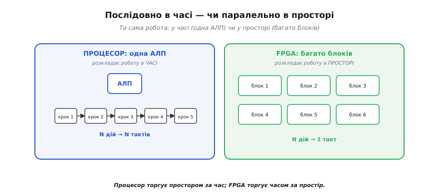
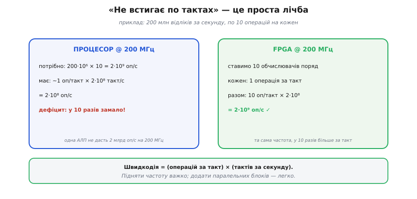
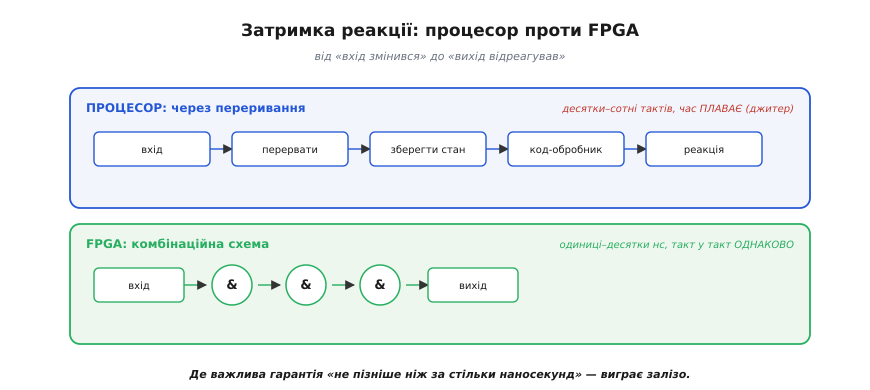
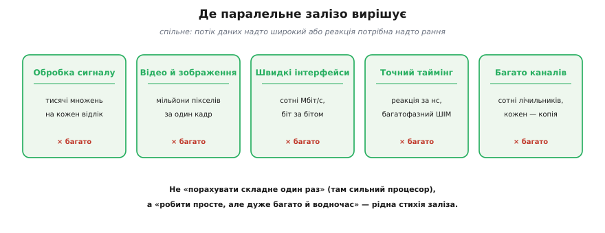
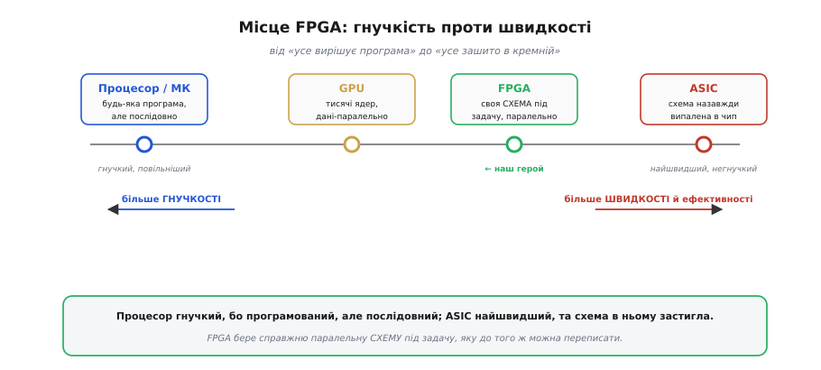

# Навіщо програмована логіка: паралельність у залізі

Перш ніж розбирати, **як** улаштована FPGA (англ. *Field-Programmable Gate Array* — «вентильна матриця, програмована в полі», тобто вже в руках інженера, а не на заводі), треба чесно відповісти на питання **навіщо**. Адже [процесор](topic:programming/what-is-processor) — машина, що вміє виконати **будь-який** алгоритм. Якщо вона універсальна, навіщо взагалі щось іще? Відповідь схована в одному слові: процесор робить усе **по черзі**. Поки роботи небагато або вона некваплива, цього досить. Та є цілий клас задач, де послідовність — це стіна, об яку розбивається будь-яка тактова частота. Саме там народжується потреба в іншому підході, і ця стаття — про те, у чому полягає ця стіна й чому паралельне залізо її обходить.

### Корінь проблеми: один за одним у часі

Варто придивитися, що насправді відбувається в процесорі. У [кожен такт він робить **одну** елементарну дію](topic:programming/fetch-decode-execute): дістати команду, додати два числа, записати результат. [Конвеєр](topic:programming/pipeline) дозволяє перекрити сусідні стадії, кілька ядер додають кілька паралельних потоків — але порядок величини незмінний: **одна арифметична операція на ядро за такт**. Якщо задача вимагає мільярда операцій за секунду, а ядро дає двісті мільйонів, ніяка майстерність програміста цього не подолає — бракує тактів.


*Процесор розкладає роботу в **часі**: одна АЛП виконує крок за кроком, N дій — за N тактів. FPGA розкладає ту саму роботу в **просторі**: N окремих апаратних блоків, кожен зі своєю логікою, отримують входи одночасно й дають усі N результатів за **один** такт. Перше — швидке перемикання однієї залізяки; друге — багато залізяк нараз.*

Ось і вся суть протиставлення, і її варто закарбувати, бо з неї випливає все подальше. **Процесор торгує простором за час**: маленьке ядро, зате багато тактів. **FPGA торгує часом за простір**: один такт, зате багато заліза. Коли роботи мало, виграє процесор — навіщо будувати сто суматорів, якщо один упорається за сто тактів. Та коли роботи **багато й вона однотипна**, картина перевертається: сто суматорів видадуть усе за такт, а одне ядро захлинеться. Питання лише в тому, де проходить межа — і відповідь, на щастя, не туманна, а арифметична.

### «Не встигає по тактах» — це проста лічба

Розмова «процесор не встигає» звучить розпливчасто, поки її не перевести в числа. А переводиться вона легко, бо швидкодія будь-якої цифрової машини — це добуток двох множників: **скільки операцій вона робить за такт** і **скільки тактів має за секунду**.


*Та сама задача — 200 млн відліків за секунду по 10 операцій кожен (2 млрд оп/с). Процесор на 200 МГц дає ~1 операцію за такт = 2·10⁸ оп/с — у десять разів замало. FPGA на тій самій частоті ставить 10 обчислювачів поряд: 10 операцій за такт × 2·10⁸ тактів = 2·10⁹ оп/с. Частота однакова — різниця лише в кількості заліза, що працює водночас.*

Зверніть увагу, що FPGA на рисунку виграла **не частотою** — вона навіть не вища. Виграла шириною: десять обчислювачів замість одного. І це ключ до всього: підняти частоту дуже важко (заважає фізика — [затримки поширення й метастабільність](topic:electronics/metastability-timing) ставлять [стелю таймінгу](topic:electronics/fpga-timing)), а **додати паралельних блоків** — легко, поки на кристалі є місце. Тому коли процесор упирається в стелю, відповідь FPGA — не «крутитися швидше», а «робити більше за один оберт». Швидкодія росте не від поспіху, а від ширини.

> 🔧 **Навіщо це.** Перша практична користь — уміти **прикинути наперед**, чи впорається процесор. Помножте потрібну кількість операцій на секунду й порівняйте з добутком «частота × операцій за такт» вашого ядра. Якщо бюджету бракує в рази — ніяка оптимізація коду не врятує, потрібне інше залізо. Це рятує від тижнів марних спроб «дотиснути» прошивку там, де задача фізично не лягає на одне ядро.

Щоб ця лічба перестала бути абстракцією, доведімо її до коду. Узяти найпростіший фільтр — ковзне середнє по вісьмох останніх відліках: на кожен новий відлік треба вісім додавань і один зсув. Ось чесний цикл прошивки на C, який крутиться на ядрі 200 МГц:

**Умова: 8-точковий фільтр на потоці 200 Мвідліків/с, ядро 200 МГц (5 нс на такт).**
```c
// один відлік: 8 додавань + 1 зсув ≈ 9 тактів навіть в ідеалі
int32_t fir8(const int16_t *x) {     // x — вікно з 8 останніх відліків
    int32_t acc = 0;
    for (int k = 0; k < 8; ++k)      // 8 проходів: множення тут немає,
        acc += x[k];                 //   лише накопичення суми
    return acc >> 3;                 // ділення на 8 = зсув на 3 розряди
}
```
```
бюджет часу на 1 відлік = 1 / (200·10⁶)      = 5.0 нс
ядро 200 МГц дає за ці 5 нс                   = 1 такт
а fir8 потребує щонайменше                    ≈ 9 тактів
9 тактів × 5 нс                               = 45 нс на відлік
маємо ж лише                                  = 5 нс
дефіцит                                       ≈ у 9 разів
```
Висновок прямий: ядро не встигає **в дев'ять разів**, і це найкращий випадок — без накладних на цикл, переривання й доступ до пам'яті. Жодна оптимізація коду не дає множника ×9. У FPGA ж ці вісім додавань роблять **вісім суматорів водночас** (дерево додавань — за один–два такти на весь відлік), тож той самий потік проходить без жодного пропуску. Та сама арифметика з рисунка, тільки тепер видно її прямо в рядках коду.

### Друга перевага: мала й передбачувана затримка

Пропускна здатність — не єдине, чим бере паралельне залізо. Є друга річ, часто навіть важливіша в керуванні: **затримка реакції** (*latency*) — скільки часу мине від «вхідний сигнал змінився» до «вихід відреагував». І тут процесор програє не лише в швидкості, а й у **сталості** цієї затримки.


*Щоб зреагувати на зовнішній сигнал, процесор має перервати поточну роботу, зберегти стан і виконати код-обробник — десятки чи сотні тактів, і час «плаває» залежно від того, чим ядро було зайняте (джитер). FPGA проводить сигнал крізь кілька вентилів напряму: одиниці–десятки наносекунд, і **такт у такт однаково**.*

Різниця тут не кількісна, а якісна. Процесор реагує на подію через [механізм переривань](topic:programming/interrupts): треба кинути те, що робив, запам'ятати, де спинився, стрибнути в обробник — і лише потім зреагувати. Це не тільки повільно, а й **непостійно**: якщо ядро саме було зайняте чимось критичним, відповідь спізниться. У FPGA ж вихід — це просто результат [комбінаційної схеми](topic:electronics/combinational-circuits) від входу; він з'являється рівно за час прольоту крізь вентилі, завжди той самий. Там, де важлива не середня швидкість, а **гарантія** «не пізніше ніж за стільки-то наносекунд», паралельне залізо поза конкуренцією.

### Де ця перевага вирішує

Абстрактні «пропускна здатність» і «затримка» стають відчутними, щойно глянути на типові задачі, заради яких беруться за FPGA. У всіх них спільне: потік даних надто широкий або реакція потрібна надто рання для одного ядра.


*П'ять класичних царин: цифрова обробка сигналу (тисячі множень на відлік), відео й зображення (мільйони пікселів за кадр), швидкі інтерфейси (розбір потоку на сотні Мбіт/с біт за бітом), точний таймінг керування (реакція за наносекунди, багатофазний ШІМ) і «багато однакових каналів» (сотні лічильників, кожен — своя апаратна копія). Скрізь робота надто широка для послідовного ядра.*

Помітьте, що це **не** задачі «порахувати щось складне один раз» — там якраз сильний процесор. Це задачі «**робити просте, але дуже багато й водночас**». Обробити кожен із мільйонів пікселів однаково; крутити сотню незалежних ШІМ-каналів; ловити кожен біт швидкого потоку, не пропустивши жодного. Для людини-програміста це нудна одноманітність; для FPGA — рідна стихія, бо однакові дрібні дії ідеально лягають на однакові дрібні блоки заліза, розставлені поряд. Саме ця однорідна масовість і відбита у [внутрішній будові чипа](topic:electronics/inside-fpga) — полі з тисяч однакових логічних комірок.

### Місце FPGA серед усіх обчислювачів

Щоб закріпити інтуїцію, корисно розставити всі способи рахувати на одній осі — від найгнучкішого до найшвидшого. FPGA займе на ній дуже промовисте місце: посередині, де гнучкість іще є, а швидкість уже майже як у спеціального чипа.


*Зліва направо — від гнучкості до швидкості: процесор/МК (будь-яка програма, але послідовно), GPU (тисячі ядер для даних-паралельних задач), FPGA (своя **схема** під задачу, паралельно, і її можна переписати), ASIC (схема назавжди випалена в кремній — найшвидше й найощадніше, але незмінно). FPGA бере паралельність ASIC, зберігаючи здатність переписати себе.*

Ось чим FPGA унікальна: вона стоїть між двома світами й бере від кожного потроху. Від процесора — **програмованість**: схему можна змінити, перезаливши конфігурацію, навіть коли пристрій уже в полі (звідси й *field-programmable* у назві). Від спеціалізованого чипа ASIC (англ. *Application-Specific Integrated Circuit* — «інтегральна схема під конкретний застосунок») — **справжню паралельну схему**: не імітацію обчислення інструкціями, а фізичні вентилі під конкретну задачу. Платою є те, що FPGA повільніша й ненажерливіша за ASIC рівної логіки (бо несе всю «машинерію переналаштування») і складніша в розробці за процесор. Але саме ця золота середина — гнучка, як софт, паралельна, як залізо — і зробила її незамінною в цілій низці задач.

### Як порожній чип стає схемою

Лишається питання, від якого досі ухилялися: **звідки** в чипі береться потрібна схема, якщо дротів у ньому фізично ніхто не перепаює. Відповідь і пояснює, чому залізо виходить водночас і паралельним, і м'яким. Усередині FPGA — поле тисяч однакових крихітних комірок, і серце кожної — **таблиця підстановки** (англ. *Look-Up Table*, LUT). Попри грізну назву, це просто малесенька пам'ять: чотиривходова LUT — це 16 комірок, у яких наперед записано **готову відповідь** на кожну з 2⁴ комбінацій входів. Будь-яку логічну функцію чотирьох змінних вона видає не обчисленням, а **зчитуванням** заздалегідь покладеного біта. Поряд із LUT у комірці сидить [тригер](topic:electronics/d-flip-flop), щоб **запам'ятати** результат між тактами, — і цієї пари «LUT + тригер» уже досить, щоб скласти будь-яку цифрову схему, бо вся цифрова логіка зводиться до комбінаційних функцій плюс пам'яті стану.

А тепер головне: **що саме лежить** у кожній LUT і куди ведуть перемикачі між комірками, задає **конфігурація** — довгий рядок бітів, який чип при ввімкненні вливає в себе й розкладає по своїх внутрішніх клітинках пам'яті. Цей рядок і називають **бітстрімом** (англ. *bitstream* — «потік бітів»). Завантажив один бітстрім — поле комірок зібралося у фільтр; завантажив інший — у відеоконтролер. Паяльник не потрібен, бо «дроти» тут — це стан перемикачів, а не мідь. Самі бітстріми ніхто не пише руками: інженер описує бажану схему **мовою опису апаратури** (англ. *Hardware Description Language*, HDL — найпоширеніші Verilog і VHDL), а програма-синтезатор перекладає цей опис у бітстрім, як компілятор перекладає код у машинні команди — тільки на виході не послідовна програма, а **паралельна схема**.

Той самий принцип «схему завантажують» носить і дрібніша рідня FPGA — **CPLD** (англ. *Complex Programmable Logic Device* — «складний програмований логічний пристрій»). Різниця практична: CPLD тримає конфігурацію у власній незникній пам'яті (флеш), тож готовий до роботи **зразу** після ввімкнення, тоді як SRAM-комірки FPGA щоразу треба наповнювати бітстрімом наново із зовнішньої флеші. За це CPLD платить куди меншою місткістю: його ставлять там, де треба «склеїти» кілька ліній логіки між чипами, а не розгортати ціле поле обчислювачів. Той самий компроміс «місткість проти миттєвої готовності» постає як практичний вибір — [FPGA чи мікроконтролер](root:embedded/fpga-vs-mcu) і де доречний кожен.

> 🔧 **Навіщо це.** Розуміння «бітстрім → LUT + тригери» прямо міняє те, як ви читаєте даташит і дебажите плату. Коли FPGA після ввімкнення «мертва» — шукайте не баг у логіці, а зрив **завантаження** конфігурації (порожня чи неправильна флеш, переплутаний порядок живлень). А вибираючи чип, ви відразу прикидаєте: вистачить кількох LUT — береться дешевий CPLD з миттєвим стартом; треба поле обчислювачів — FPGA з окремою флеш-конфігурацією. Ця модель економить години, бо одразу веде до правильного місця пошуку.

Ця незамінність зовсім не абстрактна: ви майже напевно вже тримали в руках пристрої з FPGA всередині, навіть не здогадуючись. Цифрові осцилографи й логічні аналізатори, що ловлять сигнал на сотнях мегагерц; програмовані радіо (SDR), які перемелюють широку смугу ефіру; точні відеоконтролери; навіть точні відтворення старих ігрових консолей — усе це тримається на паралельному залізі, бо в усіх цих задачах потік даних надто швидкий для звичайного ядра.

> 🔌 **Загляньте у вставку:** [Де ви вже зустрічали FPGA: осцилографи, логічні аналізатори, SDR, ретро-консолі](topic:electronics/programmable-logic/comp-fpga-in-the-wild.md) — конкретні приклади того, як паралельне залізо працює всередині знайомих приладів.

> 🔧 **Навіщо це.** Головна користь цього розрізнення — навчитися **ставити правильне питання на старті проєкту**. Не «якою мовою це писати», а «чи послідовна ця задача взагалі». Якщо обчислення природно вкладається в потік «крок за кроком» і встигає за тактами — беріть процесор, він простіший і дешевший. Якщо ж задача вимагає робити багато однакового **водночас** або реагувати за наносекунди зі сталою затримкою — це сигнал, що пора дивитися в бік паралельного заліза. Уміння розпізнати цей сигнал економить і час, і гроші: зекономлені тижні марних спроб втиснути паралельну задачу в послідовне ядро — найкраща винагорода за цю інтуїцію.
