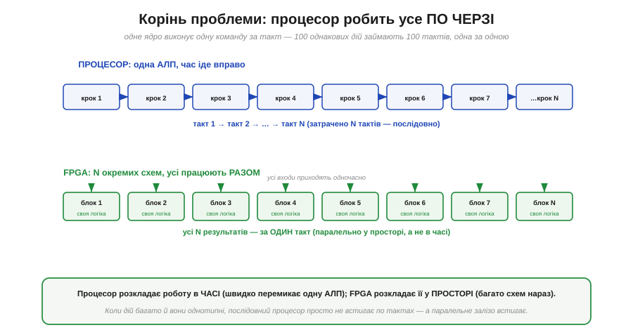
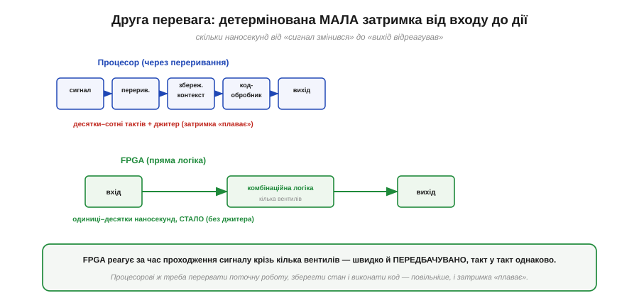

# Навіщо програмована логіка: паралельність у залізі

Перш ніж розбирати, **як** улаштована FPGA, треба чесно відповісти на питання **навіщо**. Адже [процесор](book:programming/what-is-processor) — машина, що вміє виконати **будь-який** алгоритм. Якщо вона універсальна, навіщо взагалі щось іще? Відповідь схована в одному слові: процесор робить усе **по черзі**. Поки роботи небагато або вона некваплива, цього досить. Та є цілий клас задач, де послідовність — це стіна, об яку розбивається будь-яка тактова частота. Саме там народжується потреба в іншому підході, і ця стаття — про те, у чому полягає ця стіна й чому паралельне залізо її обходить.

### Корінь проблеми: один за одним у часі

Варто придивитися, що насправді відбувається в процесорі. У [кожен такт він робить **одну** елементарну дію](book:programming/fetch-decode-execute): дістати команду, додати два числа, записати результат. [Конвеєр](book:programming/pipeline) дозволяє перекрити сусідні стадії, кілька ядер додають кілька паралельних потоків — але порядок величини незмінний: **одна арифметична операція на ядро за такт**. Якщо задача вимагає мільярда операцій за секунду, а ядро дає двісті мільйонів, ніяка майстерність програміста цього не подолає — бракує тактів.

*Рис. Процесор розкладає роботу в **часі**: одна АЛП виконує крок за кроком, N дій — за N тактів. FPGA розкладає ту саму роботу в **просторі**: N окремих апаратних блоків, кожен зі своєю логікою, отримують входи одночасно й дають усі N результатів за **один** такт. Перше — швидке перемикання однієї залізяки; друге — багато залізяк нараз.*

Ось і вся суть протиставлення, і її варто закарбувати, бо з неї випливає весь розділ. **Процесор торгує простором за час**: маленьке ядро, зате багато тактів. **FPGA торгує часом за простір**: один такт, зате багато заліза. Коли роботи мало, виграє процесор — навіщо будувати сто суматорів, якщо один упорається за сто тактів. Та коли роботи **багато й вона однотипна**, картина перевертається: сто суматорів видадуть усе за такт, а одне ядро захлинеться. Питання лише в тому, де проходить межа — і відповідь, на щастя, не туманна, а арифметична.

### «Не встигає по тактах» — це проста лічба

Розмова «процесор не встигає» звучить розпливчасто, поки її не перевести в числа. А переводиться вона легко, бо швидкодія будь-якої цифрової машини — це добуток двох множників: **скільки операцій вона робить за такт** і **скільки тактів має за секунду**.

*Рис. Та сама задача — 200 млн відліків за секунду по 10 операцій кожен (2 млрд оп/с). Процесор на 200 МГц дає ~1 операцію за такт = 2·10⁸ оп/с — у десять разів замало. FPGA на тій самій частоті ставить 10 обчислювачів поряд: 10 операцій за такт × 2·10⁸ тактів = 2·10⁹ оп/с. Частота однакова — різниця лише в кількості заліза, що працює водночас.*

Зверніть увагу, що FPGA на рисунку виграла **не частотою** — вона навіть не вища. Виграла шириною: десять обчислювачів замість одного. І це ключ до всього: підняти частоту дуже важко (заважає фізика — [затримки поширення й метастабільність](book:electronics/metastability-timing) ставлять [стелю таймінгу](book:electronics/fpga-timing)), а **додати паралельних блоків** — легко, поки на кристалі є місце. Тому коли процесор упирається в стелю, відповідь FPGA — не «крутитися швидше», а «робити більше за один оберт». Швидкодія росте не від поспіху, а від ширини.

> 🔧 **Навіщо це.** Перша практична користь — уміти **прикинути наперед**, чи впорається процесор. Помножте потрібну кількість операцій на секунду й порівняйте з добутком «частота × операцій за такт» вашого ядра. Якщо бюджету бракує в рази — ніяка оптимізація коду не врятує, потрібне інше залізо. Це рятує від тижнів марних спроб «дотиснути» прошивку там, де задача фізично не лягає на одне ядро.

### Друга перевага: мала й передбачувана затримка

Пропускна здатність — не єдине, чим бере паралельне залізо. Є друга річ, часто навіть важливіша в керуванні: **затримка реакції** (*latency*) — скільки часу мине від «вхідний сигнал змінився» до «вихід відреагував». І тут процесор програє не лише в швидкості, а й у **сталості** цієї затримки.

*Рис. Щоб зреагувати на зовнішній сигнал, процесор має перервати поточну роботу, зберегти стан і виконати код-обробник — десятки чи сотні тактів, і час «плаває» залежно від того, чим ядро було зайняте (джитер). FPGA проводить сигнал крізь кілька вентилів напряму: одиниці–десятки наносекунд, і **такт у такт однаково**.*

Різниця тут не кількісна, а якісна. Процесор реагує на подію через [механізм переривань](book:programming/interrupts): треба кинути те, що робив, запам'ятати, де спинився, стрибнути в обробник — і лише потім зреагувати. Це не тільки повільно, а й **непостійно**: якщо ядро саме було зайняте чимось критичним, відповідь спізниться. У FPGA ж вихід — це просто результат [комбінаційної схеми](book:electronics/combinational-circuits) від входу; він з'являється рівно за час прольоту крізь вентилі, завжди той самий. Там, де важлива не середня швидкість, а **гарантія** «не пізніше ніж за стільки-то наносекунд», паралельне залізо поза конкуренцією.

### Де ця перевага вирішує

Абстрактні «пропускна здатність» і «затримка» стають відчутними, щойно глянути на типові задачі, заради яких беруться за FPGA. У всіх них спільне: потік даних надто широкий або реакція потрібна надто рання для одного ядра.

*Рис. П'ять класичних царин: цифрова обробка сигналу (тисячі множень на відлік), відео й зображення (мільйони пікселів за кадр), швидкі інтерфейси (розбір потоку на сотні Мбіт/с біт за бітом), точний таймінг керування (реакція за наносекунди, багатофазний ШІМ) і «багато однакових каналів» (сотні лічильників, кожен — своя апаратна копія). Скрізь робота надто широка для послідовного ядра.*

Помітьте, що це **не** задачі «порахувати щось складне один раз» — там якраз сильний процесор. Це задачі «**робити просте, але дуже багато й водночас**». Обробити кожен із мільйонів пікселів однаково; крутити сотню незалежних ШІМ-каналів; ловити кожен біт швидкого потоку, не пропустивши жодного. Для людини-програміста це нудна одноманітність; для FPGA — рідна стихія, бо однакові дрібні дії ідеально лягають на однакові дрібні блоки заліза, розставлені поряд. Саме ця однорідна масовість і відбита у [внутрішній будові чипа](book:electronics/inside-fpga) — полі з тисяч однакових логічних комірок.

### Місце FPGA серед усіх обчислювачів

Щоб закріпити інтуїцію, корисно розставити всі способи рахувати на одній осі — від найгнучкішого до найшвидшого. FPGA займе на ній дуже промовисте місце: посередині, де гнучкість іще є, а швидкість уже майже як у спеціального чипа.

*Рис. Зліва направо — від гнучкості до швидкості: процесор/МК (будь-яка програма, але послідовно), GPU (тисячі ядер для даних-паралельних задач), FPGA (своя **схема** під задачу, паралельно, і її можна переписати), ASIC (схема назавжди випалена в кремній — найшвидше й найощадніше, але незмінно). FPGA бере паралельність ASIC, зберігаючи здатність переписати себе.*

Ось чим FPGA унікальна: вона стоїть між двома світами й бере від кожного потроху. Від процесора — **програмованість**: схему можна змінити, перезаливши конфігурацію, навіть коли пристрій уже в полі (звідси й *field-programmable* у назві). Від спеціалізованого чипа ASIC (*application-specific integrated circuit*) — **справжню паралельну схему**: не імітацію обчислення інструкціями, а фізичні вентилі під конкретну задачу. Платою є те, що FPGA повільніша й ненажерливіша за ASIC рівної логіки (бо несе всю «машинерію переналаштування») і складніша в розробці за процесор. Але саме ця золота середина — гнучка, як софт, паралельна, як залізо — і зробила її незамінною в цілій низці задач.

Ця незамінність зовсім не абстрактна: ви майже напевно вже тримали в руках пристрої з FPGA всередині, навіть не здогадуючись. Цифрові осцилографи й логічні аналізатори, що ловлять сигнал на сотнях мегагерц; програмовані радіо (SDR), які перемелюють широку смугу ефіру; точні відеоконтролери; навіть точні відтворення старих ігрових консолей — усе це тримається на паралельному залізі, бо в усіх цих задачах потік даних надто швидкий для звичайного ядра.

> 🔌 **Загляньте у вставку:** [Де ви вже зустрічали FPGA: осцилографи, логічні аналізатори, SDR, ретро-консолі](comp-fpga-in-the-wild.md) — конкретні приклади того, як паралельне залізо працює всередині знайомих приладів.

> 🔧 **Навіщо це.** Головна користь цього розрізнення — навчитися **ставити правильне питання на старті проєкту**. Не «якою мовою це писати», а «чи послідовна ця задача взагалі». Якщо обчислення природно вкладається в потік «крок за кроком» і встигає за тактами — беріть процесор, він простіший і дешевший. Якщо ж задача вимагає робити багато однакового **водночас** або реагувати за наносекунди зі сталою затримкою — це сигнал, що пора дивитися в бік паралельного заліза. Уміння розпізнати цей сигнал економить і час, і гроші: зекономлені тижні марних спроб втиснути паралельну задачу в послідовне ядро — найкраща винагорода за цю інтуїцію.
