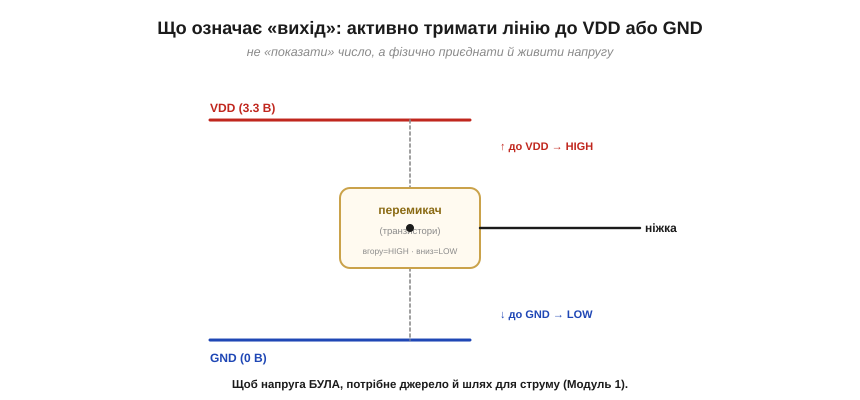
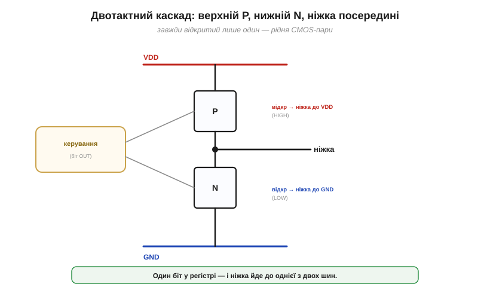
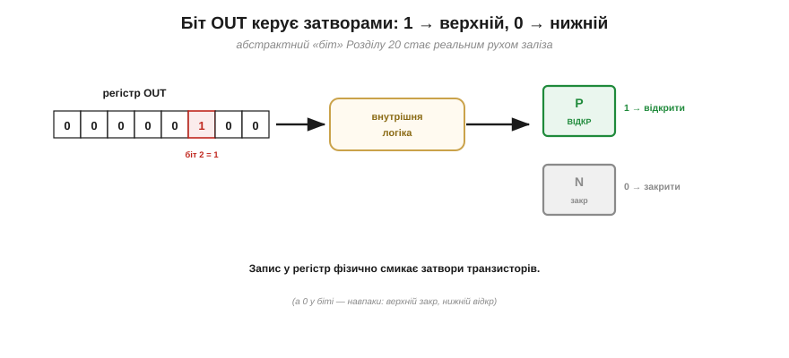
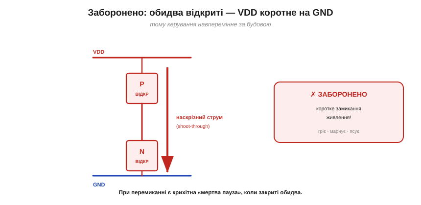
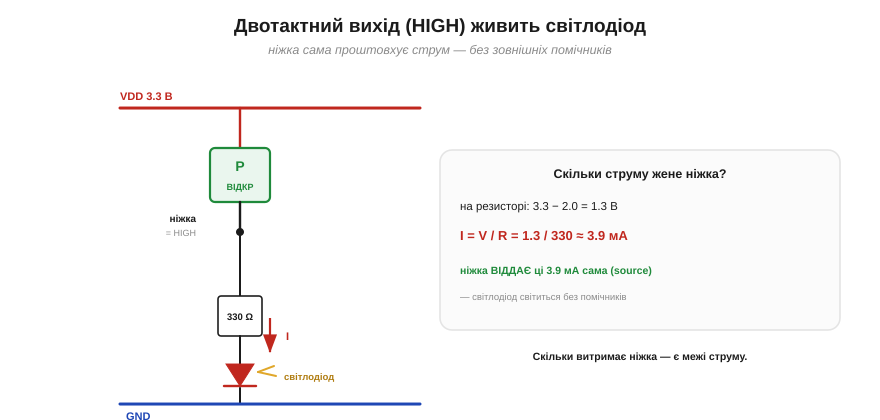

# Ніжка на рівні заліза: вихід push-pull (два транзистори)

Почнімо з найпростішого, що вміє ніжка, — бути **виходом**: видавати високий чи низький рівень. Здавалося б, що там складного — «з'єднав із плюсом або з мінусом». Та саме в тому, **як** це з'єднання робиться, і ховається вся суть: маленька пара транзисторів, яку звуть **двотактним** (*push-pull*) каскадом. Розберімо її — і ви назавжди зрозумієте, чому ніжка може напряму засвітити світлодіод, що означає «сильний нуль і сильна одиниця» і чому не можна виставити високий та низький рівень водночас.

### Що означає «вихід» на рівні заліза

Передусім: вихід не просто **повідомляє** число — він мусить **тримати** на лінії реальну напругу, активно її **живлячи**. Поставити «високий рівень» — це фізично **з'єднати** ніжку з шиною живлення (*VDD*, у нас зазвичай 3.3 В), щоб на ній була ця напруга; «низький» — з'єднати з землею (*GND*, 0 В). А оскільки до ніжки може бути щось під'єднане (світлодіод, вхід іншої мікросхеми), вона мусить ще й **давати або приймати струм**, аби втримати рівень. Адже [«1» — це діапазон напруг біля VDD, а «0» — біля нуля](book:electronics/logic-levels-as-ranges); а щоб напруга **була**, потрібне джерело й [шлях для струму](book:physics/electric-current). Отже, вихід — це маленький **перемикач**, що приєднує ніжку то до VDD, то до GND.


*Ніжка-вихід не «показує» число, а **фізично приєднує** лінію або до **VDD** (тоді на ній високий рівень), або до **GND** (низький), активно живлячи напругу й проводячи струм. Це маленький перемикач на два положення — і питання лише в тому, **чим** його зробити.*

Це й відрізняє вихід від входу: вхід лише **слухає** напругу, яку хтось інший тримає, майже не споживаючи струму; вихід же **сам** її задає й тримає, готовий гнати чи приймати струм. Тому, коли ніжку роблять виходом, її не «питають» — їй **наказують**, а вона силою заліза втілює наказ у реальну напругу на дроті.

### Push-pull: два транзистори

Цим перемикачем служить пара **транзисторів** — [польових (MOSFET)](book:electronics/field-control). Їх ставлять **один над одним** між VDD і GND, а ніжку виводять із **середини**, між ними:

- **верхній** транзистор (P-канальний) працює **підтяжкою вгору**: коли він відкритий, ніжка приєднана до **VDD** → високий рівень;
- **нижній** транзистор (N-канальний) працює **підтяжкою вниз**: коли відкритий він, ніжка приєднана до **GND** → низький рівень.

У будь-яку мить відкритий **рівно один** із них — вони працюють **навперемінно** (звідси й «двотактний»). Це пряма рідня [**CMOS-пари**](book:electronics/cmos): та сама ідея «верхній P + нижній N», лише тепер вона жене не логічний вентиль, а зовнішню ніжку.

Чому саме MOSFET? Бо це майже ідеальний **електронний ключ**: у відкритому стані [його опір **дуже малий**](book:electronics/rds-on) (частки ома), тож він приєднує ніжку до шини майже без втрат і падіння напруги — звідси й «сильний» рівень. А керується він **полем** на затворі, тобто майже не споживає струму на саме керування. Два таких ключі, поставлені «стовпчиком» — один до VDD, другий до GND, — і дають довершений двопозиційний перемикач для ніжки: дешево, швидко, надійно. Власне, на цій парі стоїть уся цифрова техніка.

Звідки ж назва? «**Push-pull**» — «штовхай-тягни»: верхній транзистор, відкрившись, **штовхає** (push) струм із VDD назовні в ніжку, а нижній — **тягне** (pull) лінію вниз, до землі, приймаючи струм. По-нашому це «**двотактний**»: два транзистори, що працюють у два «такти» навперемінно, мов два поршні. Образ простий і точний — пара м'язів, що тягне ніжку то вгору, то вниз, і ніколи разом.


*Серце виходу — **двотактний каскад**. Між VDD і GND — два транзистори; ніжка виходить із середини. **Верхній (P)** відкривається, щоб приєднати ніжку до VDD (HIGH); **нижній (N)** — щоб приєднати до GND (LOW). Завжди відкритий лише один. Це той самий CMOS-дует, поставлений керувати ніжкою.*

### Хто керує: біт OUT обирає транзистор

А хто ж вирішує, котрий транзистор відкрити? Той самий [**біт у регістрі OUT**](book:programming/memory-mapped-io). Коли ви робите `digitalWrite(2, HIGH)` (а під ним — `OUT |= (1<<2)`), цей біт через внутрішню логіку **відкриває верхній** транзистор і **закриває нижній**; запишете 0 — навпаки. Ось де код стуляється з залізом: абстрактний «біт у регістрі» фізично **смикає затвор** реального транзистора, і ніжка йде вгору чи вниз.


*Місток від коду до заліза. Біт у регістрі **OUT** (той, що ви пишете `digitalWrite` чи маскою) через внутрішню логіку керує **затворами** обох транзисторів — і то завжди **навперемінно**: 1 → відкрити верхній (HIGH), 0 → відкрити нижній (LOW). Запис у регістр **фізично** перемикає, до якої шини приєднано ніжку.*

> 🔧 **Навіщо це.** Ось чому варто розуміти [регістри введення-виведення](book:programming/memory-mapped-io): `digitalWrite` — не «команда лампочці», а буквально **поворот затвора** транзистора всередині ніжки. Це знання рятує, коли ніжка поводиться дивно: ви розумієте, що між вашим бітом і дротом стоїть реальна електроніка зі своїми правилами — силою, межами, забороненими станами, — а не безтілесний «логічний рівень».

### HIGH і LOW: сильний нуль і сильна одиниця

Тепер — головна чеснота двотактного каскаду. Розгляньмо обидва стани.

**Високий рівень (HIGH):** відкрито верхній (P) транзистор, нижній закрито. Ніжка міцно приєднана до VDD — і не лише має напругу 3.3 В, а й може **віддавати струм назовні** (англійською — *source*, «джерело»): проштовхувати струм у те, що підключено до ніжки, наприклад світити світлодіодом на землю.

**Низький рівень (LOW):** відкрито нижній (N) транзистор, верхній закрито. Ніжка міцно сидить на GND — і може **приймати струм** ззовні (*sink*, «стік»): пропускати крізь себе струм у землю.

Закарбуймо ці два англійські слова, бо вони — у кожному даташиті. **Source** (буквально «джерело») — коли ніжка у HIGH **віддає** струм, тобто є його джерелом для навантаження. **Sink** («стік») — коли ніжка у LOW **приймає** струм, є його стоком у землю. Те, що двотактний вихід уміє **і те, й те**, причому сильно, — і є його перевага: він однаково певно тягне лінію вгору й вниз, тож швидко перемикає й легко розгойдує вхід наступної мікросхеми, не «провисаючи» в жодному стані.


*Два стани — і обидва **сильні**. **HIGH:** верхній транзистор приєднав ніжку до VDD; вона тримає 3.3 В і **віддає** струм (source) у навантаження. **LOW:** нижній приєднав ніжку до GND; вона тримає 0 В і **приймає** струм (sink). Завдяки тому, що в кожному стані ніжку жорстко тримає відкритий транзистор, обидва рівні «сильні» — низький опір і туди, і сюди.*

Ось у чому сила «push-pull»: він жене лінію **в обидва боки** — і вгору («push», штовхає), і вниз («pull», тягне), — причому **сильно**, з малим опором. Тому такий вихід швидкий і здатний живити реальне навантаження сам, без зовнішніх помічників. Це **типовий** вихід ніжки за замовчуванням. (Бувають і інші, «слабші» стилі виходу — [лише з нижнім транзистором](book:electronics/open-drain), або [з підтяжкою-резистором](book:electronics/floating-pullups); тут же нам важлива саме сила двотактного.)

Щоб оцінити цю силу, уявімо вихід лише з **одним** транзистором — скажімо, тільки нижнім. Він уміє певно тягнути ніжку **вниз** (LOW), а от угору (HIGH) — ні: відкритого шляху до VDD нема, і лінія сама «спливе» хіба що через слабкий резистор-підтяжку. Виходить рівень **несиметричний**: сильний нуль, квола одиниця. Інколи це саме те, що треба ([вихід із відкритим стоком](book:electronics/open-drain) на цьому й побудований), та як **універсальний** вихід двотактна пара тим і гарна, що **обидва** боки в неї однаково міцні.

### Заборонений стан: обидва ввімкнені (shoot-through)

Чому ж так наголошуємо, що відкритий **лише один** транзистор? Бо протилежне — катастрофа. Якби **обидва** відкрилися водночас, вони з'єднали б **VDD напряму з GND** крізь себе — коротке замикання живлення! Крізь пару ринув би величезний наскрізний струм (*shoot-through*), що марнує енергію, гріє чіп, а в гіршому разі й псує транзистори.

Саме тому керування зроблено **навперемінним** за побудовою: внутрішня логіка фізично не дає обом бути відкритими разом (а при перемиканні лишає крихітну «мертву паузу», коли закриті **обидва**, щоб вони не перетнулися). Тому й немає сенсу в питанні «а як виставити високий і низький водночас» — це не «обидва рівні», а коротке замикання, якого схема свідомо уникає.

Ця «мертва пауза» має й цікавий наслідок. В усталеному стані (постійно HIGH чи постійно LOW) двотактна пара майже не споживає — один транзистор закритий, наскрізного шляху нема. Але в **момент перемикання** обидва на коротку мить частково відкриті, і крізь них прослизає крихітний імпульс струму. Тому що **частіше** ніжка перемикається, то більше вона споживає — це і є динамічне споживання CMOS, той самий зв'язок [«потужність зростає з частотою»](book:programming/clock-power). На звичайних швидкостях — дрібниця, а на дуже швидких сигналах — уже відчутна стаття.


*Чому завжди лише один. Якби відкрилися **обидва** транзистори, вони з'єднали б VDD із GND навпрост — **коротке замикання** живлення, крізь яке б'є руйнівний наскрізний струм (shoot-through). Тому керування навперемінне за будовою, а при перемиканні є крихітна «мертва пауза», коли закриті обидва. «Виставити HIGH і LOW разом» — не стан, а заборонене КЗ.*

> 🔧 **Навіщо це.** Двотактний вихід — причина, чому ніжка може **сама** засвітити світлодіод чи розгойдати вхід іншої мікросхеми: вона і дає струм (HIGH), і приймає (LOW), сильно тримаючи рівень. Запам'ятайте зв'язок: ваш запис у регістр OUT обирає, **котрий із двох транзисторів** відкрити, а отже — до якої шини приєднати ніжку. А ще пам'ятайте про межу: «сильно» не означає «безмежно» — скільки струму ніжка витримає, перш ніж згоріти, задають [межі струму ніжки](book:electronics/pin-drive-limits).

### Порахуймо: ніжка живить світлодіод

Покажімо «силу» двотактного виходу на конкретній дії — найулюбленішій у новачка: засвітити світлодіод. З'єднаймо ніжку через резистор зі світлодіодом на землю. У стані **HIGH** ніжка приєднана до VDD і **жене струм** крізь резистор і світлодіод у землю.


*Двотактний вихід живить світлодіод. У стані HIGH верхній транзистор приєднав ніжку до 3.3 В, і вона **віддає** струм: VDD → ніжка → резистор → світлодіод → GND. Резистор задає величину струму; саме здатність ніжки сама проштовхнути цей струм і робить двотактний вихід таким зручним.*

**Приклад (струм світлодіода).** Ніжка у стані HIGH дає **3.3 В**. Світлодіод за робочого струму «з'їдає» на собі близько **2.0 В** (його пряме падіння), решта лягає на резистор **R = 330 Ом**. Скільки струму проштовхне ніжка?

```
напруга на резисторі = напруга ніжки − падіння на світлодіоді
                     = 3.3 В − 2.0 В = 1.3 В

струм (закон Ома, I = V/R):
   I = 1.3 В / 330 Ом ≈ 0.0039 А ≈ 3.9 мА
```

Ці ~3.9 мА ніжка **віддає сама** (source), просто бувши у стані HIGH, — і світлодіод світиться. Жодного зовнішнього підсилювача чи джерела не треба: двотактний транзистор усередині ніжки достатньо «сильний», щоб і втримати 3.3 В, і прогнати крізь себе ці міліампери. (Якби світлодіод був увімкнений навпаки — від VDD до ніжки, — то засвітився б він уже у стані **LOW**, коли ніжка **приймає** струм у землю. Такий «увімкнений нулем» спосіб — активний низький рівень, *active-low* — дуже поширений: багато готових модулів очікують саме його, тож звичка «0 = увімкнено» вам ще не раз знадобиться.) До речі, резистор тут не примха. Світлодіод сам по собі майже **не обмежує** струму — його вольт-амперна характеристика круто злітає вгору від певної напруги, — тож без резистора ніжка гнала б крізь нього стільки струму, скільки змогла б, аж до згоряння самого діода чи ніжки. Резистор — простий і надійний **обмежувач**, що задає безпечний струм; «просто ввімкнути світлодіод у ніжку» без нього — певний шлях щось спалити. А ось чи можна так само сміливо вішати на ніжку потужніше навантаження — і де та межа, за якою вона згорить, — визначають [допустимі межі струму ніжки](book:electronics/pin-drive-limits).

Отже, ніжка-вихід — це двотактний каскад із двох транзисторів: верхній приєднує її до VDD (сильний HIGH, віддає струм), нижній — до GND (сильний LOW, приймає струм), а керує ними біт у регістрі OUT, відкриваючи завжди лише один, аби не сталося наскрізного КЗ. Це **типовий**, сильний вихід. Запам'ятайте опорну картинку: **дві ферми-транзистори між VDD і GND, ніжка з їхньої середини, і ваш біт, що відкриває завжди лише одну з двох**. На цьому образі стоїть уся робота з ніжкою як виходом — решта лише домальовує до нього деталі.

Та існує й навмисне «однобокий» різновид виходу — [лише з нижнім транзистором](book:electronics/open-drain), — і він, попри уявну неповноцінність, незамінний у цілому класі задач.

---
