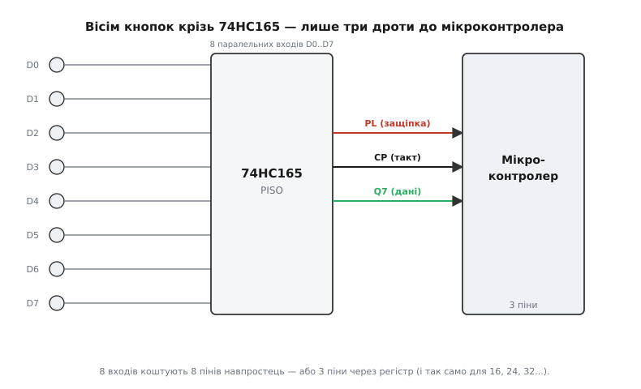
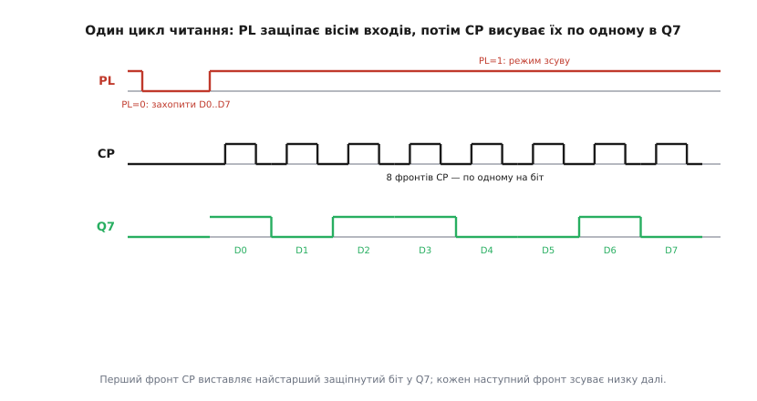

# 🔌 74HC165: вісім входів трьома дротами

Уявіть пульт із шістнадцятьма кнопками, кінцевики на верстаті, ряд перемикачів-«діпів» на платі. Кожна така лінія — це один біт, який хоче зайти в [мікроконтролер](topic:programming/microcontroller). Найпряміший шлях — на кожен сигнал свій вивід (*pin*). Та виводів у дрібного контролера буває двадцять, і вісім кнопок з'їдять майже половину; шістнадцять — узагалі не влізуть. Потрібен спосіб **зчитати багато входів кількома лініями**. Саме це й робить **74HC165** — мікросхема, що бере вісім паралельних входів і віддає їх контролеру по одному дроту, послідовно.

Усередині 74HC165 — той самий [зсувний регістр](topic:electronics/register) типу **PISO** (*parallel-in, serial-out*: паралельний вхід, послідовний вихід), про який ідеться в основній темі. Тут ми не повторюємо принцип, а дивимося на конкретну деталь: які в неї ніжки, як скласти цикл читання, чому вона економить виводи й як зчеплювати кілька штук поспіль. Це **узагальнений** клас: під індексом «74HC165» його випускають Nexperia, Texas Instruments, Toshiba й інші, і поводяться вони однаково — тож усе нижче годиться для будь-якого виробника.

> 🔧 **Навіщо це.** Щойно на пристрої більше кнопок чи перемикачів, ніж вільних виводів, постає вибір: тягнути дріт на кожен вхід — чи поставити один регістр-«збирач» і читати все трьома лініями. 74HC165 — стандартна, копійчана відповідь на цей вибір; вона ж лежить в основі матричних клавіатур, зчитування DIP-перемикачів, опитування кінцевиків і будь-якого «багато входів — мало ніжок».

## Що економимо: вісім входів, три лінії


*Вісім окремих входів D0..D7 заходять у 74HC165 паралельно, а до контролера йдуть лише три керовані ним лінії: **PL** (защіпнути входи), **CP** (такт зсуву) і **Q7** (послідовний вихід даних). Вісім сигналів коштували б восьми виводів навпростець — а так їх три, і ця трійка не росте, скільки б входів ми не складали в ланцюг.*

Ось у чому суть економії. Прямий підхід — це залежність «один вхід — один вивід»: вісім кнопок вимагають восьми виводів, шістнадцять — шістнадцяти. З регістром залежність інша:

```
прямо:        пінів = входів            (8 → 8,  16 → 16)
через 165:    пінів = 3                 (8 → 3,  16 → 3,  32 → 3)
```

Трьох ліній досить **незалежно від кількості входів**, бо додаткові 74HC165 ми вмикаємо не паралельно до контролера, а **в хвіст** одне одному (про це — нижче). Контролер платить фіксовану ціну в три виводи й за неї отримує скільки завгодно входів — лише читання стає трохи довшим у часі. Це класичний розмін: **виводи на такти**. Виводів у дрібного чипа мало й вони дорогі; тактів — скільки завгодно, і коштують вони лише часу.

## Розпіновка: шість сигналів, що варто знати

74HC165 живе в корпусі на 16 ніжок. Більшість із них — це просто вісім входів і живлення; уся «логіка спілкування» тримається на чотирьох керівних сигналах. Розберімо їх за призначенням, а не за номерами (номери ніжок звіряйте з документом конкретного виробника — *datasheet*).

```
PL   (1)   — Parallel Load, защіпка. Активна НИЗЬКИМ рівнем (PL=0).
CP   (2)   — Clock Pulse, такт. Зсув по ФРОНТУ (перехід 0→1).
CE   (3)   — Clock Enable, дозвіл такту. Активний НИЗЬКИМ (CE=0 — такт працює).
DS   (4)   — Serial Data, послідовний вхід для каскаду.
D0..D7 (5..12) — вісім паралельних входів (саме те, що читаємо).
GND  (13)  — земля.
Q7   (14)  — послідовний вихід (істинний).
Q7n  (15)  — те саме, інвертоване (стане в пригоді зрідка).
VCC  (16)  — живлення, 2.0..6.0 В.
```

Три з цих сигналів — наш інтерфейс до контролера: **PL**, **CP**, **Q7**. Четвертий, **CE**, на простому ввімкненні просто притягують до землі (CE=0, такт завжди дозволений) і забувають про нього — він потрібен лише тоді, коли тактову лінію ділять кілька пристроїв і регістр треба тимчасово «оглушити». А **DS** оживає, коли регістрів стає більше одного.

Дві деталі рятують години відлагодження. Перша: і **PL**, і **CP** реагують не на рівень, а на *подію* — PL защіпає, поки тримається низьким, а CP зсуває рівно на переході 0→1. Друга: входи **D0..D7**, як у будь-якій КМОН-логіці ([CMOS](topic:electronics/cmos-gate)), **не можна лишати висячими**. Незадіяний чи відпущений вхід ловить наведення й читається то як 0, то як 1. Тому кожна кнопка йде з **підтяжкою** — резистором на живлення (*pull-up*) або на землю (*pull-down*), щоб у спокої на вході був чіткий рівень.

## Цикл читання: защіпнути, тоді висунути

Одне читання восьми входів — це завжди дві фази: спершу **сфотографувати** входи в регістр, тоді **вичитати** знімок по біту.


*Спершу короткий імпульс **PL=0** асинхронно захоплює стан усіх восьми входів D0..D7 у тригери регістра — це «знімок» моменту. Далі PL вертається у 1 (режим зсуву), і вісім фронтів **CP** виштовхують захоплені біти в **Q7** один за одним: на кожен такт — наступний біт. Вісім фронтів — вісім бітів, і байт зібрано.*

Чому саме защіпка, а не читання «наживо»? Бо входи можуть **змінюватися під час** зсуву — хтось відпустив кнопку на півдорозі. Імпульс PL робить миттєвий злам у часі: усі вісім бітів фіксуються **одночасно**, і далі ми спокійно вичитуємо узгоджений знімок, не боячись, що він «попливе». Це та сама ідея захоплення спільним фронтом, що й у звичайному [регістрі](topic:electronics/register), лише застосована до зовнішніх сигналів.

Тонкість, через яку часто з'являється «зайвий» біт: після завантаження на виході **Q7 вже стоїть один із защіпнутих бітів** — крайній у ланцюзі. Тобто перший біт читають **до** першого фронту CP, а кожен фронт лише **зсуває** низку далі. На практиці це означає простий порядок: «прочитати Q7 → дати фронт → прочитати Q7 → ...», і так вісім разів. Якщо ж спершу дати фронт, а потім читати — втратиться найперший біт. Тримайтеся послідовності «читай, тоді зсувай», і порядок бітів зійдеться.

## Зчитування в коді: біт за бітом

Найпрозоріший спосіб — поворушити лінії руками (*bit-bang*): самі смикаємо PL і CP, самі читаємо Q7. Потрібне тут є на будь-якому контролері: два виводи в режимі виходу, один — у режимі входу, і мікросекундна затримка. Функції-обгортки нижче (`pinWrite`, `pinRead`, `delayUs`) названі узагальнено — підставте ті, що звуться так у вашому середовищі: у Arduino це `digitalWrite`/`digitalRead`/`delayMicroseconds`, в ESP-IDF — `gpio_set_level`/`gpio_get_level`/`esp_rom_delay_us`, у STM32 HAL — `HAL_GPIO_WritePin`/`HAL_GPIO_ReadPin` і `__HAL_TIM`-затримка чи проста лічильна пауза.

**Умова: один 74HC165, читаємо байт із восьми входів.**

:::tabs
```cpp
// Виводи контролера, з'єднані з регістром:
#define PIN_PL  5    // → PL  (защіпка, активна 0)
#define PIN_CP  6    // → CP  (такт зсуву)
#define PIN_Q7  7    // ← Q7  (послідовні дані)

uint8_t hc165_read(void) {
    // 1. Защіпнути входи: короткий імпульс PL=0.
    pinWrite(PIN_PL, 0);
    delayUs(1);              // витримати t_w(PL) ≈ кілька десятків нс — із запасом
    pinWrite(PIN_PL, 1);    // назад у режим зсуву

    // 2. Вичитати 8 бітів. Q7 уже тримає перший біт ДО першого фронту.
    uint8_t value = 0;
    for (int i = 0; i < 8; i++) {
        value <<= 1;                       // звільнити місце під наступний біт
        value |= (pinRead(PIN_Q7) & 1);   // прочитати поточний біт у молодший розряд
        // дати фронт CP (0→1), щоб зсунути наступний біт у Q7:
        pinWrite(PIN_CP, 0);
        pinWrite(PIN_CP, 1);
    }
    return value;
}
```
```micropython
from machine import Pin
from time import sleep_us

# Виводи контролера, з'єднані з регістром:
pl = Pin(5, Pin.OUT)   # → PL  (защіпка, активна 0)
cp = Pin(6, Pin.OUT)   # → CP  (такт зсуву)
q7 = Pin(7, Pin.IN)    # ← Q7  (послідовні дані)

def hc165_read():
    # 1. Защіпнути входи: короткий імпульс PL=0.
    pl.value(0)
    sleep_us(1)            # витримати t_w(PL) ≈ кілька десятків нс — із запасом
    pl.value(1)            # назад у режим зсуву

    # 2. Вичитати 8 бітів. Q7 уже тримає перший біт ДО першого фронту.
    value = 0
    for _ in range(8):
        value <<= 1                    # звільнити місце під наступний біт
        value |= q7.value() & 1        # прочитати поточний біт у молодший розряд
        # дати фронт CP (0→1), щоб зсунути наступний біт у Q7:
        cp.value(0)
        cp.value(1)
    return value
```
:::

Розберімо ключові рядки. `value <<= 1` — це зсув уліво ([позиційний запис](topic:math/positional-systems): кожен біт переходить у старший розряд), яким ми збираємо вісім окремих бітів в одне число, найстарший — першим. `pinRead(...) & 1` бере рівно молодший біт прочитаного (захист від того, що `pinRead` поверне не строго 0/1). Порядок «читати → давати фронт» — той самий, що на діаграмі: перший біт уже на Q7, тож читаємо його, і лише потім зсуваємо наступний.

Один виклик `hc165_read()` коштує вісім ітерацій. Скільки це за часом? Якщо одна операція з виводом займає ~1 мкс, увесь цикл — близько:

```
t ≈ t_load + 8 · t_такт
  ≈ 2 мкс + 8 · 2 мкс
  ≈ 18 мкс
```

Тобто опитати вісім кнопок — менше ніж за двадцять мікросекунд; навіть якщо робити це тисячу разів на секунду, регістр з'їдає менше двох відсотків часу процесора. Для кнопок і перемикачів швидкості вистачає з величезним запасом.

## Те саме через SPI: регістр як «вхідний» вузол шини

Подивіться ще раз на трійку сигналів: **CP** — це такт, **Q7** — дані, що їх контролер приймає. Це дослівно режим [**SPI**](topic:communications/spi-bus), де такт зветься SCK, а вхідна лінія — MISO. Тож 74HC165 можна читати **апаратним SPI**, не смикаючи такт уручну: PL лишається звичайним виводом (роль «вибору пристрою»), а вісім бітів контролер вичитує однією апаратною посилкою.

**Умова: читаємо той самий байт через апаратний SPI.**

:::tabs
```cpp
// CP → SCK,  Q7 → MISO (апаратні виводи SPI).
// PL лишається звичайним GPIO (защіпка).
#define PIN_PL  5

uint8_t hc165_read_spi(void) {
    // 1. Защіпнути входи імпульсом PL=0 (так само, як у bit-bang).
    pinWrite(PIN_PL, 0);
    delayUs(1);
    pinWrite(PIN_PL, 1);

    // 2. Один обмін по SPI: висуваємо «сміття», приймаємо 8 бітів з Q7.
    //    Режим SPI: CPOL=0, CPHA=0 (вибірка по фронту 0→1, як любить 165).
    return spi_transfer(0x00);   // повертає прийнятий байт
}
```
```micropython
from machine import Pin, SPI
from time import sleep_us

# CP → SCK,  Q7 → MISO (апаратні виводи SPI).
# PL лишається звичайним GPIO (защіпка).
pl = Pin(5, Pin.OUT)
# Режим SPI: polarity=0, phase=0 (вибірка по фронту 0→1, як любить 165).
spi = SPI(0, baudrate=1_000_000, polarity=0, phase=0)

def hc165_read_spi():
    # 1. Защіпнути входи імпульсом PL=0 (так само, як у bit-bang).
    pl.value(0)
    sleep_us(1)
    pl.value(1)

    # 2. Один обмін по SPI: висуваємо «сміття», приймаємо 8 бітів з Q7.
    return spi.read(1, 0x00)[0]   # повертає прийнятий байт
```
:::

Тут уся робота зсуву лягає на апаратний блок SPI: він сам видає вісім тактів і сам збирає вісім бітів у байт. Обмін одним байтом є в кожному середовищі, лише зветься по-різному: у Arduino це `SPI.transfer()`, в ESP-IDF — `spi_device_polling_transmit()`, у STM32 HAL — `HAL_SPI_TransmitReceive()`. Код коротшає до двох дій — защіпнути й «прокрутити» байт. Єдине, за чим стежать, — **режим SPI**: 74HC165 вибирає дані по фронту 0→1, що відповідає поширеному режиму 0 (*CPOL=0, CPHA=0*). На швидкій шині (одиниці МГц) вісім бітів читаються за одиниці мікросекунд — навіть швидше за ручний варіант.

> 🔧 **Навіщо це.** SPI-варіант — не просто «красивіше». Апаратний блок зсуває біти, поки процесор зайнятий іншим, а на швидких шинах це різниця між «опитати сотню входів між справами» й «загрузнути в смиканні ніжок». Коли входів багато або їх треба читати часто — читайте регістр шиною, а не вручну.

## Каскад: скільки завгодно входів тими ж трьома лініями

Найкорисніша риса 74HC165 — його можна **зчеплювати в ланцюг**. Для цього й існує вхід **DS**: вихід Q7 одного регістра заводять у DS наступного. Тоді під час зсуву біти першого регістра, дійшовши до його Q7, **переливаються** у другий — і контролер, продовжуючи давати такти, вичитує спершу вісім бітів одного чипа, потім вісім наступного.

```
[165 #1] Q7 ──► DS [165 #2] Q7 ──► DS [165 #3] Q7 ──► до контролера
   ▲ PL, ▲ CP — спільні на всі регістри одразу
```

Лінії **PL** і **CP** при цьому **спільні** — один дріт PL і один дріт CP ідуть на всі регістри паралельно. Тобто скільки б регістрів ми не з'єднали, до контролера все одно йдуть **ті самі три лінії**: один спільний PL, один спільний CP і Q7 останнього в ланцюзі. Три регістри — це 24 входи трьома дротами; чотири — 32. У коді змінюється лише кількість прочитаних байтів:

```c
// Прочитати N зчеплених регістрів у масив (першим прийде дальній у ланцюзі).
void hc165_read_chain(uint8_t *out, int n) {
    pinWrite(PIN_PL, 0); delayUs(1); pinWrite(PIN_PL, 1);  // одна защіпка на всіх
    for (int i = 0; i < n; i++)
        out[i] = spi_transfer(0x00);    // по байту на кожен регістр
}
```

Зверніть увагу: защіпка **одна на весь ланцюг**. Імпульс PL фіксує входи **всіх** регістрів одночасно — тобто знімок виходить узгоджений у часі по всіх 24 чи 32 входах разом, а не «по черзі». Це важливо, коли входи пов'язані (наприклад, стан машини, де кілька кінцевиків треба читати як один момент): вони й справді читаються як один момент.

## Типові граблі класу

Кілька пасток повторюються незалежно від виробника, і майже всі ловляться ще на папері.

**Висячі входи.** Найчастіша помилка. Незадіяні D0..D7 і відпущені кнопки без підтяжки читаються випадково. Правило просте: на кожному вході — резистор на живлення або на землю, незадіяні входи — теж притягнути (зазвичай до GND).

**Збитий порядок бітів.** Якщо дати фронт CP **перед** першим читанням Q7, найперший біт зникне, і весь байт «з'їде». Лікування — порядок «читай, тоді зсувай», як у коді вище. Який вхід відповідає найстаршому біту — звіряйте з документом: у різних виробників D0 буває то найближчим до Q7, то найдальшим.

**Не той режим SPI.** Через невідповідність CPOL/CPHA контролер вибирає дані не на тому фронті — байт виходить зсунутим або переплутаним. 74HC165 хоче вибірку по фронту 0→1 (режим 0).

**Довгий ланцюг і завал фронтів.** На багатьох зчеплених регістрах та довгих дротах фронт CP «розпливається» (паразитна ємність), і на високій частоті біти змазуються. Якщо ланцюг довгий — стримайте частоту такту або зробіть лінію CP акуратнішою.

**Рівні живлення.** 74HC165 живиться 2..6 В, але його **входи** очікують рівнів, узгоджених із його ж VCC. Якщо контролер на 3.3 В, а регістр на 5 В, рівні логіки можуть не зійтися — тоді між ними ставлять [перетворювач рівнів](topic:electronics/level-shifter) або беруть варіант 74HCT (з порогами під TTL) чи живлять регістр від тих самих 3.3 В.

Підсумок простий: 74HC165 — це апаратне втілення фрази «вісім входів трьома дротами». Защіпнули входи імпульсом PL, висунули вісім бітів тактами CP у Q7 — руками чи апаратним SPI, — а коли входів не вистачає, зчепили кілька штук через DS, лишивши контролеру ті самі три лінії. За цією дешевою мікросхемою стоїть звичайний [зсувний регістр](topic:electronics/register); 74HC165 лише вивів його ніжки назовні так, щоб ним було зручно читати реальний світ.
