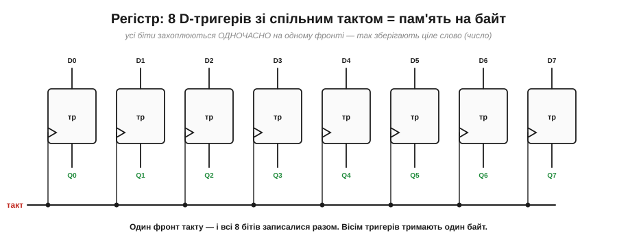
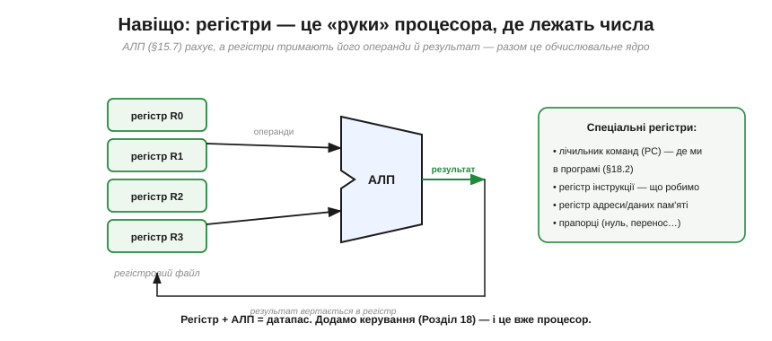

# Регістр: багато тригерів разом

Один D-тригер тримає **один** біт. Та числа складаються з багатьох бітів (байт — це вісім, слово процесора — 16, 32 чи 64). Щоб зберігати **ціле число**, тригери ставлять **поряд** і тактують **спільним** сигналом. Так народжується **регістр** (*register*) — базова комірка, у якій процесор тримає операнди, результати, адреси. Цей підрозділ — про регістр у двох його іпостасях: **паралельний** (зберегти слово) і **зсувний** (пересувати біти), і про те, чому без них немає ні зв'язку, ні процесора.

### Паралельний регістр: ціле слово за раз

Найпростіший регістр — це просто N тригерів пліч-о-пліч, кожен зі своїм входом і виходом, але з **одним на всіх** тактом.

*Рис. Вісім D-тригерів зі **спільним тактом** утворюють 8-бітний регістр. Кожен тримає свій біт (D0…D7 на вході, Q0…Q7 на виході), та оскільки такт спільний, **усі вісім** захоплюють свої біти **одночасно**, на одному фронті. Один клац такту — і весь байт записано разом, як одне ціле.*

Це і є «місце, де лежить число». Спільний такт тут принциповий: завдяки йому всі біти оновлюються **синхронно**, і регістр поводиться як єдина комірка для слова, а не вісім незалежних. Скільки тригерів — стільки бітів: 8 для байта, 32 для 32-бітного слова.

### Дозвіл запису: тримати, поки не «завантажити»

Простий регістр захоплює вхід на **кожному** фронті. Та на практиці частіше треба, щоб він **тримав** число багато тактів і брав нове лише **за командою**. Для цього додають вхід **дозволу запису** (*load enable*).

*Рис. Перед кожним тригером ставлять [**мультиплексор**](book:electronics/combinational-circuits), що обирає, який сигнал подати на вхід D: за **load=1** — нові дані (запис), за **load=0** — **власний вихід Q** тригера (через зворотний зв'язок). У другому випадку тригер щотакту «перезаписує себе ж тим самим» — тобто значення **не змінюється**. Так регістр зберігає число скільки завгодно довго й бере нове лише тоді, коли подали load.*

Цей прийом — «годувати тригер його ж виходом, щоб тримати» — дуже типовий, запам'ятайте його. Тепер регістр став повноцінним: він **зберігає**, доки не накажеш, і **завантажує** за командою. Саме такі регістри стоять у процесорі.

### Зсувний регістр: дані їдуть уздовж

Є й інший спосіб з'єднати тригери — не паралельно, а **ланцюжком**: вихід кожного на вхід наступного. Тоді на кожному фронті вся низка бітів **зсувається** на один щабель. Це **зсувний регістр** (*shift register*).

*Рис. Чотири тригери ланцюжком зі спільним тактом: за кожен фронт уся низка зсувається праворуч на один щабель. Залежно від того, як **вмикати** дані та звідки **знімати**, виходять три типи: **SIPO** (вхід послідовний по одному дроту, вихід — усі Q одразу), **PISO** (завантажили все паралельно, виводимо по одному дроту), **SISO** (і вхід, і вихід послідовні — проста лінія затримки).*

Зсувний регістр уміє кілька корисних фокусів. Зсув уліво — це, до речі, **множення на 2** (а вправо — ділення на 2) у двійковій системі, бо кожен біт переходить у старший розряд [позиційного запису](book:math/positional-systems). Та головне його застосування — зовсім інше, і воно скрізь.

### Серійно ↔ паралельно: серце зв'язку

Найважливіша робота зсувного регістра — **перекладати** між «бітами по черзі» і «всіма бітами разом». А це — основа всього послідовного зв'язку.

*Рис. По **одному** дроту біти йдуть **по черзі** в часі (послідовно). Зсувний регістр типу **SIPO** приймає їх по одному на кожному такті — і коли назбирається повний байт, видає всі 8 бітів **одразу** (паралельно). У зворотний бік **PISO** бере байт і «висуває» його в лінію по одному біту. Це буквально серце [**UART**](book:communications/async-serial) і [**SPI**](book:communications/spi-bus): на кожному кінці лінії стоїть зсувний регістр, що складає байт із бітів і розкладає назад.*

Осягніть, наскільки це фундаментально: щоб передати число **одним** дротом (а не вісьмома), його розкладають у потік бітів, шлють по черзі, а на тому кінці **збирають** назад у байт. Уся економія дротів у послідовних інтерфейсах — від UART до USB — стоїть на зсувному регістрі: усередині кожного протоколу зв'язку — цей скромний ланцюжок тригерів.

### Регістри в процесорі

І нарешті — навіщо регістри процесору. [АЛП **рахує**](book:electronics/gates-to-functions), але йому потрібні **операнди** (звідки взяти числа) і місце для **результату**. Це й роблять регістри.

*Рис. Регістри тримають числа, АЛП їх обробляє: два операнди йдуть із регістрів у АЛП, результат вертається в регістр. Купку робочих регістрів звуть **регістровим файлом**. Окремо є **спеціальні** регістри: [**лічильник команд**](book:programming/processor-parts) (PC — де ми в програмі), **регістр інструкції** (що саме виконуємо), регістри адреси й даних пам'яті, **прапорці** (нуль, перенос). Регістр + АЛП = **тракт даних** (*datapath*); лишається додати керування — і це вже [процесор](book:programming/what-is-processor).*

Ось де сходяться дві лінії цифрової електроніки: [комбінаційна арифметика](book:electronics/gates-to-functions) і пам'ять на тригерах. АЛП без регістрів — як калькулятор без екрана й кнопок пам'яті: рахувати вміє, а тримати числа ні. Регістри дають йому «руки», у яких лежать операнди й результати. Саме тому [процесор](book:programming/what-is-processor) — це не лише АЛП, а АЛП **плюс регістри плюс керування**.

> 🔧 **Навіщо це.** Регістр — це слово «пам'ять» у найшвидшому, найближчому до обчислень сенсі. Винесіть три речі. Перша: **паралельний** регістр зберігає ціле число (всі біти захоплюються разом по спільному такту), а **дозвіл запису** дозволяє тримати його, доки не накажеш оновити. Друга: **зсувний** регістр перекладає між «послідовно» і «паралельно» — і саме він усередині кожного [UART](book:communications/async-serial)/[SPI](book:communications/spi-bus)/USB, тож, працюючи із зв'язком, ви матимете справу з ним постійно. Третя: **регістри процесора** — це найшвидша пам'ять у системі, де лежать числа, з якими АЛП працює **прямо зараз**; коли йдеться про регістри [мікроконтролера](book:programming/microcontroller) ESP32 чи оптимізований код, ідеться саме про ці комірки. Регістр — місток від «логіки» до «машини».

---

Отже, **регістр** — це група D-тригерів зі **спільним тактом**, що зберігає ціле **слово** (байт = 8 бітів): усі біти захоплюються **одночасно** на одному фронті. **Дозвіл запису** (через MUX, що за load=0 повертає Q на вхід) дозволяє регістру **тримати** значення, доки не накажуть завантажити нове. **Зсувний регістр** з'єднує тригери **ланцюжком**, тож біти зсуваються на щабель за такт; його головна робота — перетворення **серійне↔паралельне**, основа [UART](book:communications/async-serial) і [SPI](book:communications/spi-bus), а заразом множення/ділення на 2. У процесорі регістри тримають **операнди, результат, лічильник команд, інструкцію**; регістр + АЛП = **тракт даних**. Усі тригери регістра клацають по **спільному** такту — і це працює лише тому, що такт єдиний для всіх; що таке сам [**тактовий сигнал**](book:electronics/clock-signal) і чому вся машина «крокує» в його ритмі — окрема тема.

---
