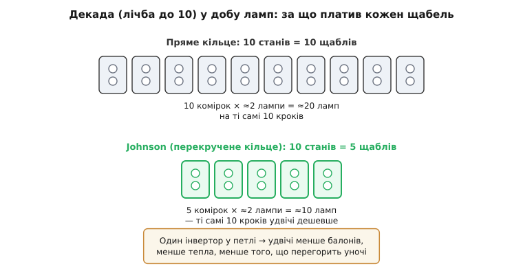

# 📜 Роберт Джонсон і його лічильник

Ім'я лічильника рідко належить людині. «Двійковий», «десятковий», «кільцевий» — це описи, а не прізвища. Тим цікавіше, що одна дуже проста схема носить чиєсь прізвище: **Johnson-лічильник**. За назвою стоїть жива людина — американський інженер **Роберт Ройс Джонсон** (Robert Royce Johnson, 1928–2016), — і, що рідкість, ми досить точно знаємо, **де, коли і навіщо** він цей лічильник придумав. Історія варта того, щоб її розказати цілком: вона не про хитру логіку (логіка там дитяча — один інвертор у петлі), а про те, **чому** саме той інвертор у ті роки коштував золота, і як один інженер, шукаючи, де зрізати кут, лишив по собі і схему в кожному підручнику цифрової техніки, і — зовсім з іншої опери — ті дивні цифри внизу банківського чека.

## Людина за прізвищем на схемі

Спершу про самого Джонсона, бо в підручниках від нього лишилося тільки прізвище, а людина була неабияка.

Народився він 1928 року в США. Здобув ступінь бакалавра з електротехніки в **Університеті Вісконсину** (University of Wisconsin), магістра — з сервомеханізмів у **Єлі** (Yale). Сервомеханізми — це системи автоматичного стеження, де вихід весь час звіряється зі входом і сам себе підтягує до потрібного (кермо, що само тримає курс; антена, що сама наводиться). Ця школа — про **зворотний зв'язок**, про петлю «вихід впливає на вхід», — і саме через таку оптику Джонсон, схоже, звик дивитися на будь-яку схему. Пам'ятаймо це слово — **петля зворотного зв'язку**: воно ще двічі стане ключем до всієї цієї історії.

Далі — Каліфорнійський технологічний (Caltech), де 1956 року він захистив докторську. За переказами Caltech, це був **їхній перший докторат із цифрових обчислень** узагалі — Джонсон опинився серед тих, хто цю галузь щойно народжував. А поки писав дисертацію, уже працював в авіаційній компанії **Hughes Aircraft**, де робив **цифрові системи наведення** для літаків і ракет. Ось тут, на стику «щойно народженої цифрової техніки» й «наведення ракет, де все має спрацювати надійно й дешево», і з'явився лічильник, що носить його ім'я.

> 🔧 **Навіщо це знати.** Не «геній вигадав абстрактну красу», а інженер під конкретним тиском знайшов найощадливіший хід. Джонсон-лічильник — типовий приклад того, як **обмеження доби** (дорога, гаряча, ненадійна елементна база) висікають рішення, яке потім живе десятиліттями вже й тоді, коли те обмеження давно зникло. Зрозуміти, **чому** схема така, — значить зрозуміти, від чого людина тікала.

## Лампова доба: чому кожен щабель був на вагу золота

Щоб відчути мотивацію Джонсона, треба на мить забути про сучасні мікросхеми й перенестися в початок 1950-х. Транзистор уже винайшли (1947, Bell Labs), але в масовому цифровому залізі його ще майже не було: транзистори тих років були **страшенно дорогі, рідкісні й примхливі**. Складні лічильні схеми будували на **вакуумних лампах** (англ. *vacuum tube*, «вакуумна лампа» — скляний балон, де струм несуть електрони, викинуті розжареним катодом). Один тригер — комірка пам'яті на один біт — складався тоді, грубо кажучи, **з двох ламп**, увімкнених навхрест так, що одна тримає іншу (бістабільна пара, «тригер-фліп-флоп»).

І ось тут криється вся суть. Лампа — це не сучасний транзистор. Лампа:

- **гріється** — усередині розжарена нитка, як у лампочці; десятки ламп у стійці — це десятки маленьких грубок;
- **жере струм** — кожна нитка розжарення тягне свій струм постійно, просто щоб світитися;
- **займає місце** — балон завбільшки з палець чи більший;
- і головне — **перегорає**. У лампи є ресурс, як у лампочки. Що більше ламп у машині, то частіше **вночі щось гасне**, і машина стає.

Надійність великих лампових машин у ті роки часто впиралася саме в **кількість балонів**: статистично, що їх більше, то коротший середній час до наступної відмови. Тож для інженера-цифровика тих років кожна зайва лампа була не абстрактним «ще одним елементом», а цілком відчутним рахунком — за електрику, за тепло, за місце в стійці й за **ночі, коли машина стоїть, бо десь перегоріла нитка**.

Тепер поставимо задачу, яку Джонсон розв'язував мало не щодня: **лічити до десяти** — зробити **декаду** (лат. *decas* — десяток), бо люди рахують десятками, і будь-який лічильник подій, годинник, дільник частоти впирається в лічбу по 10. Скільки це коштувало наявними способами?

Найпростіший «чистий» лічильник тієї доби — **кільцевий** (див. основну статтю): зсувний регістр, замкнений у кільце, по якому крокує одна одиниця. Він гарний тим, що активний вихід читаєш **прямо з тригера**, без жодної логіки-дешифратора. Але за цю чистоту він платить люто: **скільки станів — стільки й тригерів**. Декада кільцевим лічильником — це **десять** тригерів. Десять тригерів по дві лампи — **близько двадцяти ламп** тільки на те, щоб дорахувати до десяти. Двадцять балонів, що гріються й чекають, котрий перегорить першим.

Ось перед цим рахунком Джонсон і зупинився.

## Один перекручений дріт — і вдвічі менше ламп

Хід, який він знайшов, до сміху простий — і в цьому вся його краса. У кільцевому лічильнику вихід останнього тригера заводять на вхід першого **як є**. Джонсон завів його **перевернутим** — через інверсію (там, де останній тримає 1, у перший піде 0). Один інвертор у петлі зворотного зв'язку — оце і вся зміна.

Наслідок цієї дрібнички розібрано в основній статті детально; тут важливий сам **підсумок**: перекручене кільце робить **два оберти** замість одного (перший оберт наповнює його одиницями, другий — спорожнює), і тому дає **2N станів** на N тригерах — **удвічі більше**, ніж пряме кільце. А отже — і вдвічі менше заліза на ту саму задачу.

Порахуймо ту саму декаду вже по-джонсонівськи:

```
Пряме кільце, декада (10 станів):  10 тригерів × 2 лампи ≈ 20 ламп
Johnson,     декада (10 станів):    5 тригерів × 2 лампи ≈ 10 ламп
                                    ─────────────────────────────
                          виграш:   удвічі менше балонів на ту саму лічбу
```

П'ять щаблів замість десяти. **Десять ламп замість двадцяти.** У добу, коли надійність міряли кількістю балонів, це не «економія на сірниках» — це вдвічі менше того, що гріється, жере струм і перегоряє. За **один-єдиний інвертор** — половина лампового господарства декади геть.


*Чому «перекрут» був не забавкою, а грошима. Декада — лічба до десяти — прямим кільцем коштує десять щаблів, тобто близько двадцяти ламп. Той самий рахунок Johnson-лічильником — п'ять щаблів, близько десяти ламп: удвічі менше балонів, що гріються й перегоряють. Уся зміна в схемі — один інвертор у петлі зворотного зв'язку.*

Ось чому варто одразу спростувати найпоширеніший здогад про цей лічильник. Хто вперше чує «економний лічильник», думає: певно, Джонсон **економив транзистори**. І помиляється — **транзисторів він не використовував**: у ті роки вони були заскладні й задорогі для такого. Він економив **лампи**. Це не причіпка до слів: якби йшлося про дешеві транзистори, весь виграш «удвічі менше елементів» був би приємним дріб'язком. А коли кожен елемент — гаряча скляна лампа, що коштує грошей, місця й безсонних ночей ремонтника, той самий «удвічі менше» стає **вирішальним** аргументом. Мотивація Джонсона родом саме з лампової доби — і без неї схема виглядає розумною забавкою, а з нею — очевидною необхідністю.

## Не одна схема, а ціле сімейство

Варто розвіяти й друге спрощення — ніби Джонсон одного ранку сів і винайшов «Johnson-лічильник». Насправді він, шукаючи ощадливості, перебрав **цілу низку** лічильників на зсувних регістрах, силкуючись для **різної кількості станів** знайти **найпростіший зворотний зв'язок**. «Перекручене кільце» — найвідоміший, найчистіший плід цих пошуків, але не єдиний: у його патенті поряд стоять схеми на різні основи лічби — на 15, на 31, на 63 стани, — усі побудовані на одній ідеї «зсувати й розумно замикати».

Це важлива риса **справжньої** інженерної історії, на відміну від легенди про «еврику». Ніхто не витягає готову схему з порожнечі. Джонсон систематично **вимірював компроміс**: скільки станів дає той чи той спосіб замкнути зсув, скільки додаткової логіки він за це коштує. «Перекручене кільце» лишилося в підручниках не тому, що воно перше спало на думку, а тому, що в ньому цей компроміс найкращий: **максимум зиску (подвоєння станів) за мінімум ціни (один інвертор)**. Решта родини — цінні, але або дають менший виграш, або вимагають хитрішого зворотного зв'язку.

## Звідки стільки імен

Мало яка схема має стільки прізвиськ, і кожне — з іншого боку тієї самої простої дії. Розберімо їх, бо кожне ім'я насправді **щось пояснює** про механіку.

- **Johnson-лічильник** — просто на честь автора. Найпоширеніша назва в англомовних джерелах і в назвах мікросхем.
- **Перекручене кільце** (англ. *twisted ring counter*, «перекручене кільце»). Пряме кільце замикається дротом «як є»; тут дріт зворотного зв'язку **перекручено** — пущено через інверсію. Ім'я показує пальцем на **єдину відмінність** від звичайного кільця: перекручений (інвертований) зворотний зв'язок.
- **Кільце з перекрученим хвостом** (англ. *switch-tail ring counter*, «кільце з перемкнутим хвостом»). Той самий образ з іншого боку: «хвіст» кільця — вихід останнього тригера — не приєднано прямо, а **перемкнено** на інверсний вихід (у тригера є два виходи, Q і Q̄; беруть Q̄ замість Q). Замикання йде через «перемкнутий хвіст».
- **Крокуюче кільце** (англ. *walking ring counter*, «крокуюче кільце»). Це вже про те, як виглядає **послідовність**: фронт заповнення «крокує» кільцем — на кожному такті додається чи знімається рівно один біт, ніби межа між зоною одиниць і зоною нулів **іде** вздовж регістра.
- **Лічильник Мебіуса** (нім. *Möbius*, за прізвищем математика Авґуста Мебіуса, August Ferdinand Möbius). Найпоетичніша назва — і найточніша аналогія. Стрічка Мебіуса — це смужка, склеєна в кільце **з одним перекрутом**; через той перекрут вона стає **однобічною**: якщо йти вздовж, обійдеш «обидва боки» за один прохід і повернешся на старт лише зробивши **два** оберти. Точно те саме робить біт у цьому лічильнику: через перекручений (інвертований) зв'язок він, обійшовши кільце раз, повертається **перевернутим** («на інший бік») і мусить зробити другий оберт, щоб вернутися до себе. Звідси й подвоєння станів — це буквально математика стрічки Мебіуса, перекладена на дроти.

Отже, п'ять назв — це п'ять способів побачити ту саму одну зміну: **інвертований зворотний зв'язок**. Одні імена вказують на **дріт** (перекручене, switch-tail), інші — на **рух** (walking), ще одне — на **геометрію** цього руху (Мебіус), і одне — на **людину** (Johnson). Коли наступного разу зустрінете котресь із них, знатимете: за всіма ховається один інвертор у петлі.

## Патент: коли саме — 1953 чи 1954?

Історична дата тут потребує акуратності, бо різні джерела кажуть трохи різне, і варто чесно показати, **звідки** береться розбіжність.

Схему Джонсона зафіксовано патентом США **№ 3 030 581**, «Electronic counter» («Електронний лічильник»), винахідник — **Robert R. Johnson**, правовласник — **Hughes Aircraft Co**. У самому патенті стоять три різні дати, і в цьому й уся плутанина:

```
Дата пріоритету (першої заявки):   11 серпня 1953
Дата подання цієї заявки:           1 липня 1958   (це продовження, continuation)
Дата видачі патенту:               17 квітня 1962
```

Звідси й ножиці в джерелах. Хто пише «**подано 1953**» — має на увазі **пріоритет**, найранішу заявку Джонсона (11 серпня 1953). Хто пише «**описано в патенті 1954 року**» — спирається на ранню публікацію/проміжну заявку тих років. А хто дивиться лише на верхівку сучасної патентної картки, бачить пізню дату подання (1958) і видачу аж 1962-го. Насправді суперечності немає: **ідею зафіксовано 1953-го** (пріоритет), а формальний шлях патенту тягнувся ще майже дев'ять років — річ для тодішнього патентного діловодства звичайна.

Статус доказовості тут високий: і винахідник, і **правовласник Hughes Aircraft** прямо стоять у патентному записі — це найкраще підтвердження, що лічильник справді народився в Hughes Aircraft на початку 1950-х, а не деінде. (Трапляється, що вторинні перекази чіпляють до цієї історії інші фірми; первинний документ — патент — називає саме Hughes.)

> 🔧 **Навіщо ця акуратність.** Історія техніки повна «дат-привидів»: те саме відкриття гуляє джерелами то з роком ідеї, то з роком публікації, то з роком патенту — і з них ліплять фальшиві «хто був перший». Правильна звичка — розрізняти **ідею / заявку-пріоритет / публікацію / видачу** й називати, яка саме дата мається на увазі. Для Джонсона все сходиться: думка — 1953, папір — 1962.

## Другий винахід: цифри на дні чека

Найдивовижніше в цій історії те, що лічильник — навіть **не** найвідоміша річ, яку Джонсон лишив світові. Бо друге його творіння ви, найпевніше, тримали в руках.

1956 року він перейшов у дослідні лабораторії **General Electric** (у штаті Нью-Йорк) і потрапив у команду, що робила **ERMA** — «Electronic Recording Machine — Accounting», одну з перших електронних систем автоматичної обробки банківських **чеків** і рахунків. Задача була вимучена життям: на початку 1950-х банки США **тонули в паперових чеках** — їхня кількість ішла на **мільярди на рік**, і сортувати та проводити їх вручну ставало фізично неможливо. Машині треба було навчитися **читати** число з паперу — та ще й так, щоб не збивалася від плям, підписів і згинів.

І тут Джонсон вигадав ту саму хитрість, яку ви бачили тисячу разів, не придивляючись: **магнетні форми цифр** — характерні «квадратні» цифри, надруковані **магнетною фарбою** внизу чека (номер рахунку, код банку). Машина не «дивиться» на них оком, як на звичайний друк, — вона проводить над ними магнетну головку, і кожна цифра, завдяки своїй особливій формі й фарбі з залізним пилом, дає **власний неповторний сигнал**. Плями й підписи такого сигналу не дають — тож читання виходить напрочуд надійним. Ця технологія відома як **MICR** (Magnetic Ink Character Recognition — «розпізнавання знаків, друкованих магнетною фарбою»), а ті самі цифри й досі стоять на дні кожного паперового чека.

Тут важливо не збитися на легенду «один геній винайшов усе», бо винахід був **колективний**, і чесніше розкласти внески:

- Саму **ідею** магнетного читання чеків і систему ERMA виношували з початку 1950-х у **Stanford Research Institute** (SRI) на замовлення банку **Bank of America** — це вони першими показали, що чеки взагалі можна читати машиною.
- **Стандартний шрифт** цих цифр (відомий як **E-13B**) узаконила галузева спілка — **Американська асоціація банкірів** (American Bankers Association) наприкінці 1950-х, і саме він став нормою.
- А **General Electric** із командою, до якої належав Джонсон, довела все це до **робочих серійних машин**; внесок самого Джонсона джерела називають доволі точно — він винайшов **магнетні форми (обриси) цифр**, тобто ту саму «залізну» графіку знаків, яку головка впевнено зчитує.

Тобто правильне формулювання не «Джонсон винайшов MICR», а: **Джонсон винайшов магнетні форми цифр**, що лягли в основу машинного читання чеків, — конкретний, добре задокументований шматок великої колективної роботи. Різниця не педантична: вона віддає належне і SRI з їхньою ідеєю, і асоціації банкірів зі стандартом, і Джонсону — з тим, що справді зробив саме він.

## Що лишилося

Далі життя вело Джонсона високо: він став віцепрезидентом з інженерії у **Burroughs** (одному з великих комп'ютерних виробників тієї доби), а під кінець кар'єри пішов у науку — очолював кафедру інформатики **Університету Юти** (University of Utah) наприкінці 1980-х, ставши згодом почесним професором. Помер він 2016 року, у 87 років, від ускладнень **хвороби Паркінсона**.

Але задумаймося, що з усього цього дожило до наших днів. Величезні лампові машини Hughes Aircraft давно на брухт. Система ERMA — музейний експонат. А **дві дрібнички** того самого інженера живуть і досі, у мільярдах примірників:

- **магнетні цифри** на дні кожного паперового чека — коли-небудь ви їх та бачили;
- і **Johnson-лічильник** — у кожному підручнику цифрової техніки, у стандартних мікросхемах-декадах, у кожному другому світлодіодному «біжучому вогнику» й багатофазному генераторі.

І ось найкрасивіше в усьому цьому. Джонсон-лічильник народився, **щоб зекономити лампи** — розв'язати гостру, дуже конкретну проблему **тодішнього** заліза: удвічі менше гарячих балонів, що перегоряють уночі. Лампи зникли за кілька років. А схема лишилася — бо виявилося, що її головна цінність не в лампах зовсім. Той самий «перекрут», що колись урізав кількість балонів, дарує **код Грея** (на кожному кроці міняється рівно один біт) — а це вже подарунок на всі часи: чисте, безглітчеве декодування, байдуже, на чому реалізоване, на лампах чи на нанометрових транзисторах. Людина тікала від однієї, дуже приземленої біди свого часу — і мимоволі наткнулася на властивість, корисну **поза** тим часом. Так буває з найкращими інженерними рішеннями: їх народжує тиск моменту, а живуть вони тому, що глибша правда, яку вони ненароком схопили, від того моменту не залежить.
