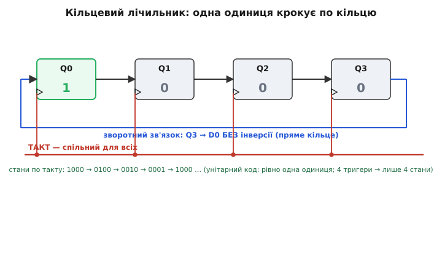
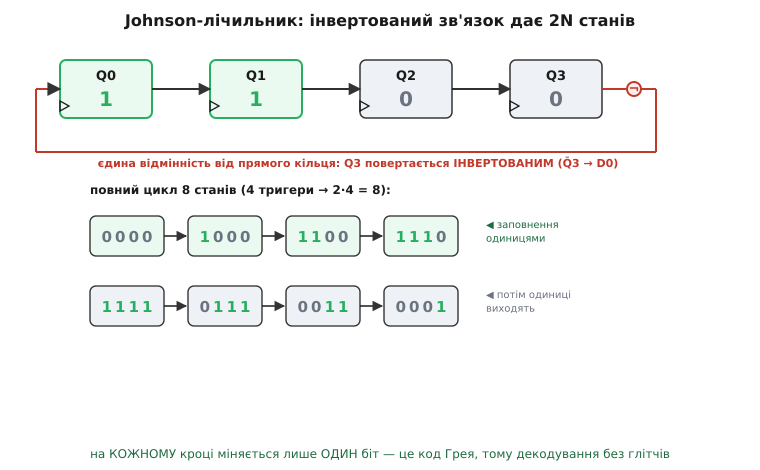
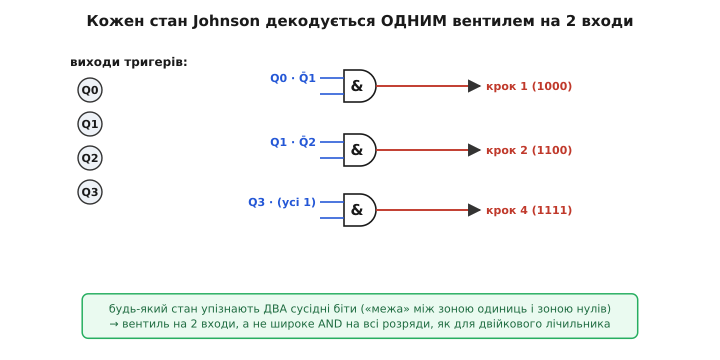
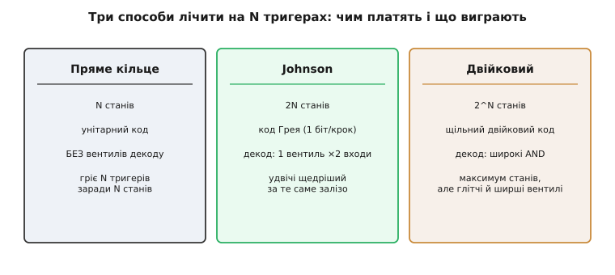

# Кільцевий і Johnson-лічильник

Є задачі, де від лічильника треба не число, а **черга**: щоб виходи вмикалися по одному, строго по колу — цей такт світиться перший, наступний — другий, тоді третій, а після останнього знову перший. Так керують кроковим двигуном (обмотки треба збуджувати по черзі), так обходять по колу канали мультиплексора, так роблять біжучий вогник на світлодіодах чи ділять один сигнал на кілька фаз. Звичайний [двійковий лічильник](topic:electronics/counters) тут незручний: він видає **число** (0, 1, 2, 3…), а щоб із числа дістати «зараз активний вихід №2», доводиться чіпляти дешифратор — окрему логіку, що перекладає двійковий код у «одну активну лінію». І та логіка на переходах лічильника **глітчить** — на мить вмикає не той вихід.

Виявляється, чергу можна зробити майже задарма, без жодного дешифратора, якщо поглянути на [зсувний регістр](topic:electronics/shift-register) під іншим кутом. Регістр уміє посувати біти вздовж ланцюжка тригерів по такту. А що, як його вихід **замкнути назад на вхід** — у кільце? Тоді біти вже нікуди не «випадають» скраю: вони ходять по колу без кінця. Саме на цій одній ідеї — **замкнути зсув у кільце** — стоять два дуже корисні лічильники: **кільцевий** і його хитріший родич **Johnson-лічильник**. Обидва дають готову чергу активних виходів; різняться лише **одним дротом** у зворотному зв'язку — і за це відрізняються вдвічі за кількістю станів. Розберімо, звідки це береться.

## Замкнути зсув у кільце

Згадаймо коротко, що робить зсувний регістр. Це ланцюжок [D-тригерів](topic:electronics/d-flip-flop) зі **спільним** тактом: вихід кожного заведено на вхід наступного, і на кожному фронті вся низка бітів дружно посувається на один щабель. Біт, що стояв скраю, «випадає» — далі його ніхто не ловить, і він губиться.

Ось цю втрату ми й приберемо. Візьмемо вихід **останнього** тригера й заведемо його на вхід **першого**. Тепер ланцюжок замкнувся сам на себе: біт, що доїхав до кінця, не губиться, а повертається на початок і їде знову. Виходить **кільцевий лічильник** (англ. *ring counter*, «лічильник-кільце»): та сама зсувна карусель, тільки замкнена в коло. Нічого не додали, крім одного дроту зворотного зв'язку, — а поведінка змінилася докорінно. Регістр був лінією, крізь яку біти протікали й зникали; кільце — це замкнена доріжка, якою вони їздять вічно.

Що ж по цій доріжці їздить? Найкорисніший режим — коли в кільці **рівно одна одиниця**, а решта тригерів тримають нулі. Тоді на кожному фронті ця одиниця перестрибує на сусідній тригер, і виходить рівно те, чого ми хотіли: активний вихід «крокує» по колу.


*Зсувний регістр, замкнений у кільце: вихід Q3 заведено назад на вхід D0 **без інверсії**. У кільці живе одна одиниця (зараз у Q0), решта — нулі. На кожному фронті одиниця посувається на сусіда: 1000 → 0100 → 0010 → 0001 → знову 1000. Кожен вихід по черзі стає активним рівно на один такт — це і є «черга» без жодного дешифратора.*

Простежмо по тактах для чотирьох тригерів. Хай спершу Q0=1, решта 0 — стан `1000`. Фронт — одиниця з'їхала праворуч: `0100`. Ще фронт: `0010`. Ще: `0001`. Тепер одиниця в останньому тригері; наступний фронт заведе її через зворотний зв'язок назад у перший — `1000`, і все починається спочатку. Чотири тригери дали цикл із **чотирьох** станів:

```text
1000 → 0100 → 0010 → 0001 → 1000 → …
  ↑ активний Q0                активний Q3, далі знову Q0
```

Головна принада тут — **вигляд самого коду**. У кожен момент активна рівно одна лінія; номер активного виходу — це просто позиція одиниці. Такий код, де одиниць рівно одна, звуть **унітарним** (англ. *one-hot*, «одна гаряча»: рівно один провід «гарячий»). Він неоціненний тим, що **не треба нічого декодувати**: хочете сигнал «зараз крок №2» — беріть прямо вихід Q2, він уже і є цим сигналом. Дешифратор, без якого двійковий лічильник не дає окремих лінійних виходів, тут просто не потрібен — черга виходить сама собою.

> 🔧 **Навіщо це.** Кільцевий лічильник — найпростіший спосіб зробити **послідовний розподільник тактів** (англ. *sequencer*): пристрій, що по черзі активує кілька ліній. Керування фазами крокового двигуна, циклічний опит кількох давачів, роздача одного такту на N окремих «дозволів», багатофазний генератор — усе це кільцевий лічильник робить без дешифратора, а отже **без глітчів декодування**. Виходи в нього перемикаються чисто, бо кожен — це прямий вихід тригера, а не результат логіки над кількома бітами.

## Ціна чистоти: половина станів марнується

За цю простоту кільцевий лічильник платить дорого — і варто чесно побачити чим. Чотири тригери можуть загалом перебувати у 2⁴ = **16** різних станах (кожен біт — 0 або 1, звідси 16 комбінацій). Двійковий лічильник цим користується сповна: він проходить усі 16 чисел від 0 до 15. А наш кільцевий лічильник із «однією одиницею» використовує лише **чотири** з цих шістнадцяти станів — по одному на кожну позицію одиниці. Решта дванадцять комбінацій (`0000`, `1010`, `1111`, `0110` і так далі) у робочому циклі **не з'являються ніколи**.

Це прикра марнотратність. Ми поставили чотири тригери — фізичне залізо, що вміє тримати 16 станів, — а витиснули з нього лічильник лише на 4 кроки. Щоб зробити кільцевий лічильник на 10 кроків (класична задача — десяткова лічба, «декада»), треба аж **десять** тригерів. Кожен новий крок черги коштує ще одного тригера. Для двійкового лічильника десять тригерів дали б цілу тисячу станів; для кільцевого — рівно десять. Ефективність — гірше нема куди.

Постає природне питання: чи можна лишити приємну властивість кільця (проста, чиста черга без важкого декодування), але **не марнувати стільки заліза**? Хоч трохи наблизити кількість станів до того, на що тригери насправді здатні? Відповідь — так, і вона напрочуд ощадлива: досить **перевернути один дріт** у зворотному зв'язку.

## Один інвертор — і станів удвічі більше

Ось хід, від якого все й починає працювати ефективно. У кільцевому лічильнику вихід останнього тригера ми заводили на вхід першого **як є**. А тепер заведімо його **інвертованим** — тобто на вхід першого тригера подамо не Q останнього, а його заперечення Q̄ (там, де останній має 1, у перший піде 0, і навпаки). Один інвертор у зворотному зв'язку — оце і вся зміна в схемі.

Наслідок цієї дрібної правки — разючий. Такий лічильник називають **Johnson-лічильником** — на честь американського інженера **Роберта Ройса Джонсона** (Robert Royce Johnson), який [придумав цю схему в Hughes Aircraft на початку 1950-х](topic:electronics/ring-counter/hist-johnson.md), шукаючи, як найпростішим зворотним зв'язком вичавити з тригерів більше станів. Через інверсію в петлі його ще звуть **перекрученим кільцевим** (англ. *twisted ring*, «перекручене кільце») чи **лічильником Мебіуса** — за аналогією зі стрічкою Мебіуса, де один перекрут склеює двобічну стрічку в однобічну.

Простежмо, що тепер відбувається, знову з чотирма тригерами. Почнемо з усіх нулів — `0000`. Останній тригер Q3 тримає 0; інвертор перетворює цей 0 на 1 і подає на вхід першого. Отже, наступного фронту в перший тригер зайде **1**, а решта бітів просто посунуться. Крок за кроком кільце **наповнюється одиницями зліва**:

```text
0000 → 1000 → 1100 → 1110 → 1111   (заповнення: одиниці заходять зліва)
```

Дійшли до `1111` — усі одиниці. Тепер Q3 тримає 1; інвертор робить із неї 0 і подає на вхід першого. Наступного фронту зліва зайде вже **0** — і кільце починає **спорожнятися**, так само по одному біту:

```text
1111 → 0111 → 0011 → 0001 → 0000   (спорожнення: заходять нулі, одиниці витісняються)
```

І от ми знову в `0000` — цикл замкнувся. Порахуймо, скільки вийшло різних станів: чотири на заповненні (`1000`, `1100`, `1110`, `1111`) плюс чотири на спорожненні (`0111`, `0011`, `0001`, `0000`) — разом **вісім**. На тих самих чотирьох тригерах кільцевий давав лише 4 стани, а Johnson дає **8**. Рівно вдвічі більше.


*Єдина відмінність від прямого кільця — інвертор у зворотному зв'язку: вихід останнього тригера повертається на вхід першого **перевернутим**. Через це кільце спершу наповнюється одиницями (`0000`→`1000`→`1100`→`1110`→`1111`), а тоді спорожнюється (`1111`→`0111`→`0011`→`0001`→`0000`) — разом вісім станів замість чотирьох. Придивіться: на кожному кроці міняється **рівно один** біт.*

Звідки взялося саме подвоєння, видно з механіки. У прямому кільці одиниця, обійшовши всі тригери, поверталася **така сама** — і цикл замикався за один оберт (N кроків). У Johnson-лічильнику вона повертається **перевернутою**: після першого оберту одиниці стають нулями, і кільце мусить зробити **другий** оберт, щоб перевернути їх назад і повернутися до старту. Два оберти по N кроків — звідси й **2N** станів. Той самий перекрут, що й у стрічки Мебіуса: обійшовши стрічку раз, опиняєшся на «іншому боці», і лише другий обхід повертає на місце.

Запишемо це правило, бо воно — головний практичний висновок:

```text
кільцевий (пряме кільце):   N станів на N тригерах
Johnson (перекручене):     2N станів на N тригерах
```

Хочете десяткову лічбу (10 кроків)? Кільцевому треба 10 тригерів, а Johnson-лічильнику — лише **5**. Удвічі менше заліза за ту саму довжину черги. Марнотратність кільця Johnson ополовинює одним інвертором.

> 🔧 **Навіщо це.** Саме через це подвоєння Johnson-лічильник — стандартний спосіб зробити коротку чергу (декаду, шість фаз, вісім кроків) дешево. Класична мікросхема [CD4017](topic:electronics/ring-counter/api-4017.md) — це п'ятитригерний Johnson-лічильник (5 тригерів → 10 станів), у якому декодер уже вбудований і виводить десять окремих «крокових» виходів. Її ставлять у безлічі простих схем — від біжучих вогнів і світлофорів до подільників частоти й генераторів послідовностей, — бо один дешевий корпус дає готову чергу на десять кроків без жодної зовнішньої логіки.

## Чому Johnson декодується так само чисто

У кільцевого лічильника була безцінна риса — унітарний код, який **не треба декодувати**: активний вихід читаєш прямо з тригера. Johnson-лічильник таку прямоту втрачає: його стани (`1100`, `0011`…) уже не унітарні, у них по кілька одиниць одразу, тож «прямого» виходу «зараз крок №3» серед тригерів немає. Здавалося б, за подвоєння станів ми заплатили поверненням до потреби в дешифраторі — з усіма його глітчами. Насправді — ні, і це найкрасивіша частина всієї історії.

Придивімося ще раз до цієї послідовності станів. Помітили? **На кожному кроці міняється рівно один біт.** Під час заповнення щоразу додається одна одиниця зліва (`1000`→`1100`: змінився лише другий біт), під час спорожнення щоразу зникає одна одиниця (`0111`→`0011`: знову лише один біт). Ніколи не буває, щоб на одному фронті перевернулися два біти водночас. А код, де сусідні значення різняться рівно одним бітом, має особливу назву й особливу цінність — це [код Грея](topic:electronics/gray-code). Johnson-лічильник **природно** видає свою послідовність кодом Грея, задарма, без жодних зусиль.

Чому це так важливо для декодування? Бо саме одночасне перемикання кількох бітів і породжує глітчі. Коли двійковий лічильник іде, скажімо, з 3 (`011`) у 4 (`100`), перевертаються **всі три** біти — і оскільки в реальному залізі вони перемикаються не абсолютно синхронно (у котрогось затримка на частку наносекунди більша), дешифратор на цю коротку мить бачить проміжний хибний код і смикає не той вихід. А в Johnson-лічильнику **два біти ніколи не міняються разом** — тож ловити нема чого. Його виходи можна декодувати навіть **асинхронно** (без прив'язки до такту), і хибного проміжного вмикання не станеться. Це прямий подарунок від коду Грея.

Мало того, і сам дешифратор виходить крихітний. Кожен стан Johnson-лічильника — це «межа» між зоною одиниць і зоною нулів (`1110`: три одиниці, тоді нуль). Тому будь-який стан однозначно впізнають **лише два сусідні біти** — той, що на межі стоїть одиницею, і сусідній нуль. Наприклад, стан `1100` — єдиний, де Q1=1, а Q2=0; значить, вентиль «Q1 І НЕ Q2» (усього два входи) спрацьовує рівно на цьому стані й на жодному іншому. Так само й решта станів — кожен розпізнається одним вентилем **на два входи**.


*Кожен стан Johnson-лічильника впізнають лише **два** сусідні біти — «межа» між зоною одиниць і зоною нулів. Тому повний дешифратор — це набір вентилів AND усього **на два входи** кожен (`Q0·Q̄1` → крок 1, `Q1·Q̄2` → крок 2, …), а не широкі багатовходові вентилі, як для двійкового лічильника. І оскільки код грейовий, ці виходи чисті — без глітчів навіть при асинхронному читанні.*

Порівняймо з двійковим лічильником, щоб відчути виграш. Щоб декодувати чотиробітне двійкове число в конкретний вихід, треба вентиль **на всі чотири** біти (упізнати `0101` — це «Q̄3 І Q2 І Q̄1 І Q0»). Що ширший лічильник, то ширші й повільніші ці вентилі. У Johnson-лічильника незалежно від довжини кожен стан ловиться вентилем на **два** входи — маленьким і швидким. Тобто Johnson не просто дає вдвічі більше станів за кільцевий — він ще й зберігає його головну зручність: **дешеве, чисте, безглітчеве декодування**. Оце поєднання (удвічі щедріше за кільце, а декодується так само легко) і зробило Johnson-лічильник таким популярним.

## Заборонені стани й самолікування

Лишається одна чесна незручність, про яку варто знати, бо на практиці об неї спотикаються. Johnson-лічильник на N тригерах ходить по циклу з 2N «правильних» станів — але тригери фізично здатні на всі 2ᴺ комбінацій. Для чотирьох тригерів робочих станів 8, а всього комбінацій 16; отже, вісім комбінацій — **заборонені**, поза циклом. У нормальній роботі схема в них не заходить. Але при вмиканні живлення тригери прокидаються у **випадковому** стані, і цей стан цілком може виявитися одним із заборонених (скажімо, `0101` чи `1010`).

Що тоді? Лічильник почне посувати цей хибний візерунок по кільцю за тим самим правилом інверсії — і піде не по правильному циклу, а по **окремому** паразитному колечку із заборонених станів, з якого сам ніколи не вибереться. Наприклад, `0101` за правилом Johnson перейде в `1010`, тоді знову в `0101` — і застрягне в цій парі назавжди, так і не потрапивши в робочу вісімку. Черга буде безнадійно зіпсована.

Ліки прості й стандартні — **самолікувальна логіка** (англ. *self-correcting*). До схеми додають дрібку логіки, що ловить характерну прикмету заборонених станів і на найближчому фронті «зіштовхує» лічильник назад у правильний цикл. Ідея в тому, що всі законні стани Johnson мають чітку форму — суцільна зона одиниць, тоді суцільна зона нулів (`1110`, `0011`), а заборонені цю форму порушують (в `0101` одиниці й нулі чергуються). Достатньо невеликого вентиля, що виявляє порушення форми на кількох сусідніх бітах і підправляє вхідний біт, — і за кілька тактів лічильник гарантовано опиняється в робочому циклі, звідки вже не випаде. Готові мікросхеми на кшталт 4017 таку логіку **містять усередині**, тож зовні про заборонені стани можна не думати — корпус самовиправляється сам. А коли Johnson-лічильник будують із дискретних тригерів або описують у [мові опису апаратури](topic:electronics/hdl), самолікування додають руками: у HDL це зазвичай гілка `default`, що при будь-якому непередбаченому стані скидає лічильник у відомий.

> 🔧 **Навіщо це.** Заборонені стани — не теоретична причіпка, а реальна пастка ввімкнення. Зберете Johnson-лічильник «в лоб», без самолікування, — і десь у сотому вмиканні він прокинеться в паразитному колечку, черга не піде, а ви годину шукатимете «плаваючий» баг, якого в симуляції не було (бо там усе стартувало з нуля). Тому правило залізне: будуєте кільцеву чи Johnson-схему на дискретній логіці чи в HDL — **завжди** передбачте вихід із заборонених станів (у HDL — гілка `default`, у залізі — коректувальний вентиль або надійний скид при старті). У готових лічильниках-мікросхемах це вже зроблено за вас.

## Один крок у прошивці

Обидва лічильники прозоро лягають у код — і це найкращий спосіб остаточно вхопити їхню механіку. У прошивці «тригери» — це біти змінної, «фронт такту» — один виклик функції, що обчислює наступний стан. Порівняймо обидва кільця пліч-о-пліч, щоб різниця в один інвертор стала дослівною.

**Умова: один такт кільцевого й Johnson-лічильника на 4 біти — обчислити наступний стан із поточного.**

```c
#include <stdint.h>

// --- Кільцевий (пряме кільце): одна одиниця крокує по колу ---
// Зсуваємо праворуч; біт, що випадає (Q0), заводимо назад у старший (Q3).
uint8_t ring_step(uint8_t q) {
    uint8_t carry = q & 0x1;              // біт Q0, який зараз "випаде"
    return (uint8_t)((q >> 1) | (carry << 3)) & 0x0F;   // повертаємо його в Q3 БЕЗ інверсії
}

// --- Johnson (перекручене кільце): той самий зсув, але біт вертається інвертованим ---
uint8_t johnson_step(uint8_t q) {
    uint8_t fb = (q & 0x1) ^ 0x1;         // Q0, але ПЕРЕВЕРНУТИЙ (ось і весь інвертор)
    return (uint8_t)((q >> 1) | (fb << 3)) & 0x0F;      // перевернутий біт іде в Q3
}
```

Різниця між функціями — рівно один рядок: `carry` кільцевого повертається як є, а `fb` Johnson-лічильника перед поверненням перевертається операцією `^ 0x1` (виключне АБО з одиницею — це і є інверсія біта). Оце `^ 0x1` — цілий інвертор у зворотному зв'язку, той самий один дріт зі схеми. Маска `& 0x0F` тримає нас у чотирьох бітах, як фізичне кільце тримається чотирьох тригерів. Запустивши `johnson_step` вісім разів від нуля, отримаєте рівно ту вісімку станів із діаграми; `ring_step` від `0b0001` дасть чотиристанну карусель.

А тепер практична дрібниця, яка робить ці лічильники такими бажаними у вбудованих системах. Часто нам не потрібне саме число стану — потрібен **активний вихід**: запалити наступний світлодіод, збудити наступну обмотку, дозволити наступний канал. Для кільцевого це тривіально — активний вихід і є поточний стан:

:::tabs
```cpp
// Кільцевий: біжучий вогник на 4 світлодіодах, підключених до молодших бітів порту.
// Стан САМ є маскою виходів — жодного декодування.
static uint8_t ring = 0x1;                // старт: активний лише вихід 0
void ring_tick(void) {
    PORTB = (PORTB & 0xF0) | ring;        // виставляємо унітарний код прямо на ніжки
    ring = ring_step(ring);               // готуємо наступний крок
}
```
```python
# Кільцевий: біжучий вогник на 4 світлодіодах (MicroPython).
# Стан САМ є маскою виходів — жодного декодування.
from machine import Pin

leds = [Pin(p, Pin.OUT) for p in (14, 27, 26, 25)]  # ніжки під виходи 0..3
ring = 0x1                                # старт: активний лише вихід 0

def ring_tick():
    global ring
    for i, led in enumerate(leds):
        led.value((ring >> i) & 0x1)      # виставляємо унітарний код прямо на ніжки
    carry = ring & 0x1                    # біт, що "випадає"
    ring = ((ring >> 1) | (carry << 3)) & 0xF   # той самий крок кільця, назад у Q3
```
:::

Жодного дешифратора: `ring` — це вже готовий унітарний код, який можна лити прямо на виходи. Саме через це кільцевий лічильник настільки природний для «черги»: стан і є розкладка активних ліній. Johnson-лічильник за ту саму ціну заліза дає вдвічі довшу чергу — треба лише додати той крихітний двовходовий дешифратор, щоб дістати з його станів окремі «крокові» лінії; зате виходи вийдуть без глітчів, бо код грейовий.

## Коли який брати

Зведімо все до практичного вибору між трьома способами лічити на однакових тригерах.

**Кільцевий лічильник** беруть, коли черга коротка, а найдорожче — **простота й чистота виходів**. Його унітарний код не треба декодувати зовсім: кожен вихід — прямий вихід тригера, тож перемикання ідеально чисті, без натяку на глітч. Платня — марнотратність: N тригерів на N кроків. Тому кільцевий доречний, поки кроків небагато (три-чотири фази двигуна, кілька каналів), і зайвий тригер-другий не шкода за абсолютно чистий, готовий до вжитку набір лінійних виходів.

**Johnson-лічильник** — золота середина, і саме тому він на практиці найпоширеніший із двох. За той самий інвертор він дає **вдвічі більше** станів (2N на N тригерах), а завдяки грейовому коду декодується майже так само дешево — вентилями на два входи — і теж без глітчів. Його беруть на середні черги (декада, вісім кроків, шість фаз), коли потрібні і ощадливість, і чисті виходи. Стандартні корпуси-декади (5 тригерів → 10 виходів) — це саме Johnson із вбудованим дешифратором і самолікуванням.

**Двійковий лічильник** лишається королем, коли потрібне саме **велике число різних станів**: 2ᴺ на N тригерах, максимум можливого. Але за щільність коду він платить тим, від чого кільцеві вільні: щоб дістати окремі лінійні виходи, треба дешифратор із широкими вентилями, а на переходах, де перевертається багато бітів одразу, цей дешифратор глітчить. Тому там, де важлива не кількість, а **чиста черга активних ліній**, кільцеві лічильники його б'ють — простотою й відсутністю глітчів.


*Три способи лічити на однакових N тригерах. Пряме кільце: мало станів (N), зате унітарний код і взагалі жодного декодування. Johnson: удвічі більше станів (2N) за один інвертор, код Грея — тож дешевий двовходовий безглітчевий дешифратор. Двійковий: максимум станів (2ᴺ), але щільний код вимагає широких вентилів декоду, які на переходах глітчать. Вибір — за тим, що дорожче: кількість станів чи чистота черги.*

Найглибша думка тут проста. Кільцевий і Johnson-лічильник — це не «ще один тип лічильника», а **зсувний регістр, замкнений сам на себе**. Уся їхня поведінка виводиться з однієї картинки: біти їздять по кільцю. Пряме замикання (одна одиниця в колі) дає коротку, але кришталево чисту чергу без декодування; перекручене одним інвертором замикання (Johnson) подвоює довжину черги й дарує грейовий код, який декодується дешево й без глітчів. Один дріт — і карусель зсуву стає точним інструментом черги, там де двійковому лічильнику з його дешифратором незручно й брудно.

---

**Коротко про головне.** **Кільцевий лічильник** — це [зсувний регістр](topic:electronics/shift-register), у якого вихід останнього тригера замкнено назад на вхід першого. У кільці ганяють біти; у найкориснішому режимі там рівно одна одиниця, що крокує по колу (`1000`→`0100`→`0010`→`0001`→…). Її код **унітарний** (one-hot), тож активний вихід читають прямо з тригера — **жодного дешифратора й жодних глітчів**. Ціна — марнотратність: N тригерів дають лише N станів. **Johnson-лічильник** (перекручене кільце, лічильник Мебіуса; названий на честь інженера Роберта Ройса Джонсона) відрізняється **одним інвертором** у зворотному зв'язку — вихід останнього тригера повертається на вхід першого **перевернутим**. Через це кільце спершу наповнюється одиницями, тоді спорожнюється, роблячи **два** оберти замість одного, — і дає **2N** станів на N тригерах, удвічі більше за кільцевий. Його послідовність — природно [код Грея](topic:electronics/gray-code) (на кожному кроці міняється рівно один біт), тому вона декодується чисто, без глітчів, і **вентилями всього на два входи** (кожен стан — це «межа» між зоною одиниць і нулів). Обидва лічильники мають **заборонені стани** поза циклом, куди можна впасти при вмиканні, тож у дискретній реалізації потрібна **самолікувальна** логіка (у готових мікросхемах вона вбудована). Практичний вибір: кільцевий — коротка черга з ідеально чистими виходами; Johnson — удвічі довша черга за ту саму ціну заліза, теж чиста (звідси стандартні декади-корпуси на 5 тригерів → 10 виходів); двійковий — коли потрібне максимальне число станів, а не чиста черга.
