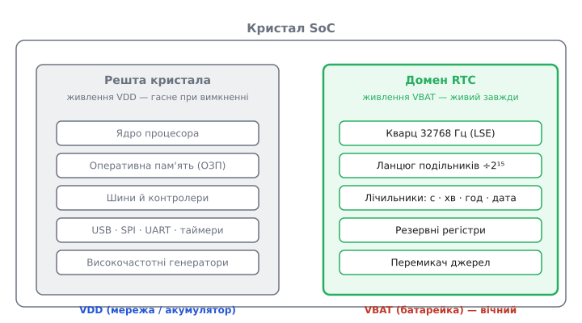
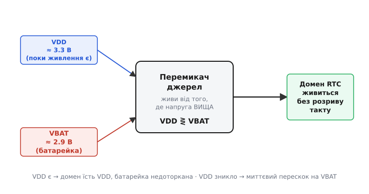
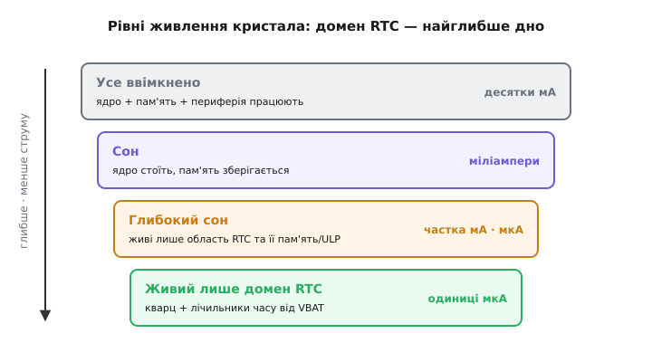

# Домен живлення RTC в SoC

Витягніть батарейку з материнської плати комп'ютера, залиште машину без розетки на місяць — і при першому ж запуску годинник усередині BIOS покаже правильний час. Живлення не було, кулери не крутилися, процесор був холодний як камінь. А маленький куточок кристала всі ці тижні тихо цокав. Це і є **домен живлення RTC** (англ. *Real-Time Clock* — годинник реального часу): острівець логіки в мікросхемі, який має власне, окреме джерело струму й тому переживає повне вимкнення всього іншого.

Ідея проста на словах, але щоб зрозуміти її по-справжньому, треба відповісти на кілька «чому». Чому цей острівець узагалі відділяють — хіба не простіше живити весь кристал разом? Що саме туди пускають, а що ні, і за яким принципом проходить кордон? Як струм автоматично перемикається з розетки на батарейку в мить, коли розетка зникає, — і назад? І чому весь цей клопіт коштує розробнику зусиль, які він охоче на себе бере.

### Навіщо взагалі окремий острівець

Почнімо з того, що станеться, якщо острівця немає. Уся цифрова система — процесор, пам'ять, периферія — сидить на одному живленні. Пропала напруга (вийняли батарею, натиснули вимикач, сів акумулятор) — усе знеструмилося разом. Тригери, у яких лічильник годинника тримав секунди й хвилини, втратили заряд, і їхній стан **зник безслідно**: тригер без живлення не пам'ятає нічого. Наступного разу пристрій прокинеться з чистого нуля — годинник доведеться виставляти вручну.

Для настільного комп'ютера це просто незручність. Але подумайте про реєстратор подій на віддаленій метеостанції, про лічильник електроенергії, про медичний холтер, що місяцями пише кардіограму. Кожен запис там мусить нести **позначку часу** (англ. *timestamp*): коли саме сталася подія. Якщо після кожного перебою живлення годинник обнуляється, усі позначки стають брехнею — дані є, а коли вони зняті, невідомо. Тож завдання чітке: **хай усе решта вимикається скільки завгодно, а відлік часу не переривається ніколи**.

Розв'язати це можна двома шляхами, і другий набагато кращий за перший. Перший — тримати ввімкненою всю систему, аби годинник не згас. Але процесор навіть у сплячці їсть міліампери, а часом і десятки міліампер; будь-яка батарейка сяде за дні. Другий шлях — відрізати від спільного живлення **лише той крихітний шматок**, який конче потрібен для відліку часу, дати йому окреме джерело й вимкнути все інше геть. Тоді споживає струм не вся мікросхема, а мікроскопічний острівець — одиниці мікроампер. І та сама батарейка тягне його **роками**.

> 🔧 **Навіщо це.** Різниця між «тримати весь чип у сплячці» та «живити лише домен RTC» — це різниця між кількома днями й кількома роками автономності. Проектуючи пристрій з батарейним резервом, ви першою чергою дивитеся в даташит: який струм тече в домен RTC, коли решта вимкнена (шукайте рядок штибу «VBAT supply current» або «RTC domain current»). Саме це число, а не ємність основного акумулятора, визначає, скільки протримається годинник у знеструмленому пристрої. Помилитеся тут — і замовник поверне партію приладів, що «забувають час».

### Що пускати в домен, а що ні

Раз острівець має живитися від крихітної батарейки роками, кожен зайвий вентиль у ньому — це струм, який дарма точить заряд. Тому в домен RTC пускають **тільки те, без чого відлік часу неможливий**, і безжально лишають за бортом усе інше. Проведімо цей кордон свідомо, бо саме він — суть теми.

Що конче потрібно всередині? По-перше, **джерело такту** — маленький кварцовий резонатор на 32768 Гц (низькочастотний зовнішній генератор, англ. *LSE — Low-Speed External*). Число 32768 не випадкове: це рівно 2¹⁵, тож простий 15-розрядний двійковий лічильник, поділивши цю частоту навпіл п'ятнадцять разів, дає точно **один імпульс на секунду**. Кварц малесенький, гойдається на низькій частоті й тому й сам споживає мізер — сотні наноампер. По-друге, **лічильники часу** — та логіка, що з секундних імпульсів набирає секунди, хвилини, години, дату, рахує високосні роки. По-третє, **кілька комірок пам'яті**, які теж мусять пережити вимкнення: у них тримають лічене значення часу, а заразом дають розробнику місце зберегти дрібку власних даних через знеструмлення (у STM32 це називають **резервними регістрами**, англ. *backup registers*). І, нарешті, **схема перемикання джерел** — той автомат, що вирішує, звідки зараз брати струм: з основного живлення чи з батарейки.

А що лишається **зовні**, на спільному живленні, яке гасне при вимкненні? Практично все цікаве: ядро процесора, оперативна пам'ять, шини, більшість периферії, високочастотні генератори. Усе це прокинеться з нуля при наступному вмиканні — і нехай, бо час воно не веде.


*Домен RTC (зелений острівець) містить лише необхідне для відліку часу: кварц 32768 Гц, ланцюг подільників, лічильники дати-часу й кілька резервних регістрів. Він живиться окремою лінією (VBAT), тому переживає зникнення основного живлення VDD, що гасить усе решта — ядро, ОЗП, периферію (сіре). Межа проведена за одним критерієм: усередині те, без чого зупиниться час, зовні — все інше.*

Цей поділ — окремий випадок ширшої практики в сучасних мікросхемах: кристал ділять на **домени живлення** (англ. *power domain* — область з окремо керованим живленням), кожен з яких можна вмикати й вимикати незалежно, щоб не годувати струмом те, що зараз не працює. Домен RTC — найменший і найстійкіший з них: він лишається живим тоді, коли всі інші вже мертві.

> 🔧 **Навіщо це.** Коли беретеся розводити плату з таким мікроконтролером, домен RTC диктує вам топологію. Вивід живлення батарейки (VBAT) веде **своєю** доріжкою до батарейного тримача, повз усі інші кола, і біля самого виводу ставлять конденсатор-фільтр. Кварц 32768 Гц кладуть **упритул** до відповідних виводів мікросхеми, короткими симетричними доріжками, подалі від швидкої логіки, — інакше наведення зіб'ють ніжний резонанс, і годинник почне спішити або відставати. Ці два вузли — батарея й кварц — на платі трактують як святая святих домену RTC.

### Як струм перемикається з розетки на батарейку

Тепер найтонше. У домена RTC є **два** можливі джерела: основне живлення системи (назвімо його VDD — воно є, коли пристрій увімкнений у мережу чи має заряджений акумулятор) і резервна батарейка (VBAT — крихітна, але вічна). Природне бажання — щоб, поки є VDD, домен їв саме його (батарейку бережемо!), а щойно VDD зникло — миттєво, без єдиного пропущеного такту, перескочив на VBAT. І назад так само плавно, коли живлення повернеться.

Робить це **автоматичний перемикач живлення** всередині кристала. По суті це схема, що весь час стежить за рівнем VDD і порівнює його з VBAT. Логіка проста, як правда: бери струм звідти, де напруга **вища**. Коли пристрій живий, VDD (скажімо, 3.3 В) помітно вища за просілу батарейку (десь 2.9 В), тож домен годується від VDD, а батарейка стоїть недоторкана. Коли VDD падає — зникло живлення, — його напруга провалюється нижче VBAT, і перемикач **сам** переводить домен на батарейку. Найважливіше тут — **без розриву**: перемикання відбувається за наносекунди, заряд на внутрішніх конденсаторах домену не встигає розсіятися, і лічильник часу навіть не помічає підміни. Такт іде, секунди йдуть.


*Перемикач стежить за основним живленням VDD і резервною батарейкою VBAT. Поки VDD вище (пристрій живий), домен їсть VDD, а батарейка недоторкана. Щойно VDD провалюється нижче VBAT (живлення зникло), струм безрозривно перескакує на батарейку — лічильник часу не втрачає жодного такту. Повернеться VDD — перемикач так само тихо переведе живлення назад.*

Звідси випливає гарна практична річ. Поки пристрій **увімкнений**, батарейка резерву **зовсім не витрачається** — весь струм домену йде від VDD. Батарейка починає розряджатися лише в ті проміжки, коли основного живлення нема. Тому реальний строк її служби залежить не стільки від самого струму домену, скільки від того, **як часто й надовго пристрій лишається знеструмленим**. Настільний комп'ютер вимикають щовечора — батарейка BIOS тягне п'ять-десять років. Прилад, який стоїть без живлення місяцями, з'їсть той самий елемент помітно швидше.

Порахуймо, наскільки довго живе годинник на одній монетній батарейці — це показує, чому весь підхід узагалі має сенс.

**Скільки років цокає домен RTC від батарейки CR2032.** Монетний літієвий елемент CR2032 має ємність близько 220 мА·год за напруги 3 В. Нехай домен RTC у знеструмленому пристрої тягне типові 1 мкА (це 0.001 мА). Тоді, якщо пристрій **увесь час** без основного живлення (найгірший випадок):

```
запас        = 220 мА·год
струм        = 0.001 мА
час          = 220 / 0.001 = 220000 год
у роках      = 220000 / (24 · 365) ≈ 25 років
```

Двадцять п'ять років — це, звісно, ідеал: батарейка сама поволі саморозряджається, тож на практиці кажуть про строк ближче до її природної полиці, років 8–10. Але навіть цей приземлений результат вражає: **одна копійчана монетка тримає час десятиліття**. А тепер порівняйте: якби замість домену ми лишали в сплячці ціле ядро зі струмом хоч 1 мА — тобто в тисячу разів більшим, — та сама батарейка сіла б менш ніж за місяць. Ось уся економіка окремого домену в одному числі.

> 🔧 **Навіщо це.** Ця арифметика — ваш робочий інструмент на етапі вибору елемента живлення. Візьміть з даташита струм домену RTC, прикиньте, яку частку життя пристрій проведе без основного живлення, і поділіть ємність батарейки на середній струм. Якщо виходить менше бажаного строку служби — або шукайте мікросхему з меншим струмом домену, або ставте ємніший елемент, або переглядайте, чи справді пристрій має так часто лишатися знеструмленим. Це рахують **до** розведення плати, а не після скарг з поля.

### Резервні регістри: пам'ять, що переживає темряву

Раз домен усе одно живий, гріх не скористатися цим для дрібки **енергонезалежної пам'яті задарма**. Тому поряд з лічильниками часу в домені RTC тримають кілька невеликих регістрів — тих самих **резервних регістрів**. Це звичайні комірки, але живляться вони від того ж острівця, а отже **зберігають записане через повне вимкнення** основної системи, аж поки жива батарейка.

Навіщо вони на практиці? Класичний приклад — прапорець «я вже налаштований». Пристрій при першому в житті ввімкненні мусить виставити годинник, зчитати калібрування, підняти конфігурацію. Робити це щоразу після кожного перезапуску марно й повільно. Тож у резервний регістр кладуть особливе число-мітку (англ. *magic value* — «чарівне значення»); при старті прошивка читає цей регістр, і якщо мітка на місці — значить, домен пережив вимкнення, час іде, налаштування чинні, можна одразу до роботи. Якщо ж мітки нема (домен уперше отримав живлення або батарейка сідала) — прошивка розуміє, що треба ініціалізуватися з нуля.

Ось як це виглядає у прошивці — короткий, але цілком реальний фрагмент під STM32:

```c
#define RTC_MAGIC   0xA5A5C0DEu   // наша мітка «домен живий, час чинний»

void rtc_domain_init(void) {
    // Домен RTC після скидання ядра захищений від запису —
    // спершу відмикаємо доступ до резервних регістрів.
    HAL_PWR_EnableBkUpAccess();

    uint32_t mark = HAL_RTCEx_BKUPRead(&hrtc, RTC_BKP_DR0);

    if (mark != RTC_MAGIC) {
        // Мітки нема: домен щойно отримав живлення вперше
        // (свіжа плата чи розряджена батарейка). Ставимо годинник,
        // виставляємо початкову дату-час і кладемо мітку.
        rtc_set_default_time();
        HAL_RTCEx_BKUPWrite(&hrtc, RTC_BKP_DR0, RTC_MAGIC);
    }
    // Інакше: мітка на місці — час ішов без перерви, нічого не чіпаємо,
    // просто працюємо далі з тим, що вже цокає в домені.
}
```

Зверніть увагу на перший рядок тіла функції. Домен RTC після скидання ядра **закритий на запис** — це навмисний захист: коротка перешкода чи випадковий збій у процесорі не повинні ненароком зіпсувати годинник чи стерти резервні регістри. Щоб щось у домені змінити, прошивка мусить свідомо зняти цей замок (тут — виклик, що вмикає доступ до резервної області). Дрібниця, а рятує від підступних багів: без неї запис у резервний регістр просто мовчки не відбувається, і початківці годинами шукають, чому дані «не зберігаються».

> 🔧 **Навіщо це.** Резервні регістри — безкоштовний сейф на кілька слів, що переживає вимкнення. У них зручно тримати: причину останнього перезапуску, лічильник спрацювань, стан кінцевого автомата, з якого треба продовжити після сну, згаданий прапорець ініціалізації. Але пам'ятайте про **захист від запису**: забули зняти замок доступу — і жоден ваш запис у домен не пройде, хоч код виглядає правильним. Це чи не найчастіша граблина новачків на STM32.

Окремий тонкий бік домену RTC — **захист від несанкціонованого доступу** (англ. *tamper* — втручання, злам). Оскільки в резервних регістрах іноді тримають дещо цінне (ключі, лічильники), домен уміє слідкувати за спеціальними виводами й, помітивши спробу фізичного втручання, **миттєво стерти** резервну область — щоб зловмисник не вичитав секрет, розкривши корпус. Це вже стик з апаратною безпекою; тут досить знати, що така можливість — теж частина домену живлення RTC, бо працює вона рівно тоді, коли живий сам острівець.

### Один домен чи ціла ієрархія

Досі ми говорили про домен RTC як про один крихітний острівець на тлі решти чипа, що гасне цілком. У найпростіших мікроконтролерах так і є: два стани — «усе ввімкнено» або «живий лише домен RTC». Але серйозніші системи-на-кристалі (англ. *SoC — System on a Chip*, «система на кристалі») будують **сходинки** доменів, і домен RTC — лише найглибша, найстійкіша з них.

Показовий приклад — популярний ESP32. У ньому виділено окрему **область RTC**, що живе в найглибшому сні, коли ядра, основна пам'ять і вся швидка периферія вимкнені. І ця область не порожня: крім самого годинника й таймера пробудження, туди винесли **шматок пам'яті, що зберігається уві сні** (RTC-пам'ять — її вміст переживає глибокий сон), і навіть **крихітний співпроцесор** наднизької потужності (англ. *ULP — Ultra-Low-Power*). Останній може, поки велике ядро спить, тихо опитувати давач, стежити за кнопкою чи рівнем сигналу — і будити основну систему лише тоді, коли справді сталося щось варте уваги. Струм у режимі, де живий лише годинник з таймером, — одиниці мікроампер; варто підняти співпроцесор, і споживання росте до частки міліампера. Тобто навіть **всередині** області RTC є свої градації: годинник — зовсім дешевий, активний співпроцесор — уже дорожчий.

Так проступає загальний принцип. Живлення сучасного кристала — це не вимикач «усе або нічого», а **набір рівнів**, від «працює геть усе» через проміжні режими сну аж до «живий лише годинник на батарейці». Що глибший рівень, то менше струму й то менше всередині лишається живим. Домен RTC — **дно** цієї драбини: найменше споживання, найбільша стійкість, єдине, що не гасне ніколи.


*Живлення кристала — сходинки, не вимикач. Згори «усе ввімкнено» їсть десятки міліампер; глибший сон гасить дедалі більше блоків і зрізає струм; на самому дні лишається живим тільки домен RTC — кварц і лічильники часу від батарейки, одиниці мікроампер. Кожен щабель — компроміс між тим, що має лишатися живим, і тим, скільки це коштує струму.*

### Звідки це пішло

Ідея відрізати годинник в окремо живлений куточок не з'явилася разом із сучасними мікроконтролерами — вона старша й народилася від тієї самої болячки: комп'ютер, вимкнений на ніч, забував, котра година. Перший масовий крок зробила мікросхема Motorola MC146818, що 1984 року стала годинником-календарем у IBM PC AT — першому персональному комп'ютері родини IBM, здатному тримати час у вимкненому стані. Про те, як окрема батарейка й жменя CMOS-пам'яті вперше подарували ПК тяглий час, і як згодом усе це переїхало прямо в кристал мікроконтролера, — коротко в [історії батарейного годинника](book:electronics/rtc-domain-power/hist-battery-rtc.md).

> 🔧 **Навіщо це.** Знати цю лінію корисно, коли працюєш зі старим залізом чи читаєш чужий код: звідти ростуть звички, що дожили донині. Формат зберігання часу в двійково-десяткових цифрах, окрема «CMOS-пам'ять» для налаштувань BIOS, сам термін «RTC-мікросхема» — усе це спадок тих перших рішень. Розуміючи корінь, легше не наступати на давно відомі граблі й не «винаходити» те, що індустрія відшліфувала десятиліття тому.

### Як це складається докупи

Отже, домен живлення RTC — це відповідь на просте життєве питання: як зробити, щоб пристрій **не забував час**, скільки б разів його не вимикали. Відповідь — не тримати ввімкненою всю систему (це з'їло б будь-яку батарейку за дні), а відрізати від спільного живлення найменший можливий острівець — кварц, лічильники часу, дрібку пам'яті, перемикач джерел — і дати йому власне, вічне джерело струму. Автоматичний перемикач безрозривно перекидає цей острівець між основним живленням і резервною батарейкою, тож такт годинника не переривається ніколи, а батарейка витрачається лише в темні проміжки без основного живлення — і тому тягне роками. Резервні регістри в тому ж домені задарма дають енергонезалежну пам'ять на кілька слів, захищену від випадкового запису. А в складніших кристалах домен RTC виявляється лише дном цілої драбини рівнів живлення — найглибшим, найстійкішим, тим, що світиться, коли все інше вже темне.

Тому, розробляючи будь-що з батарейним резервом часу, дивіться передусім на три числа з даташита: струм домену в знеструмленому стані, ємність резервного елемента й частку життя без основного живлення. Їхнє поєднання й вирішує, чи покаже ваш прилад правильний час після місяця на полиці — чи попросить виставити годинник заново.
