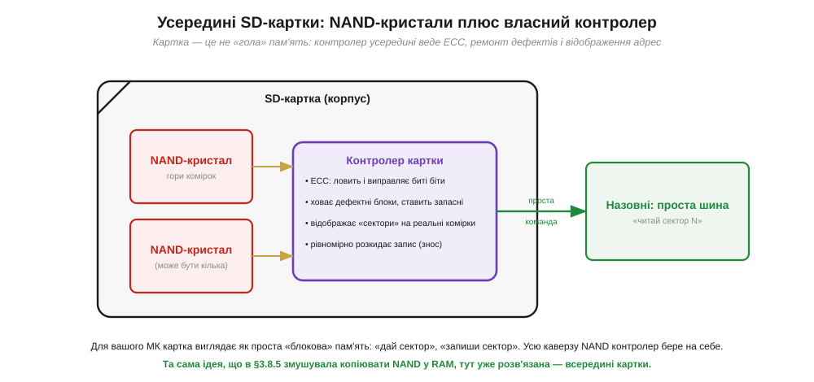
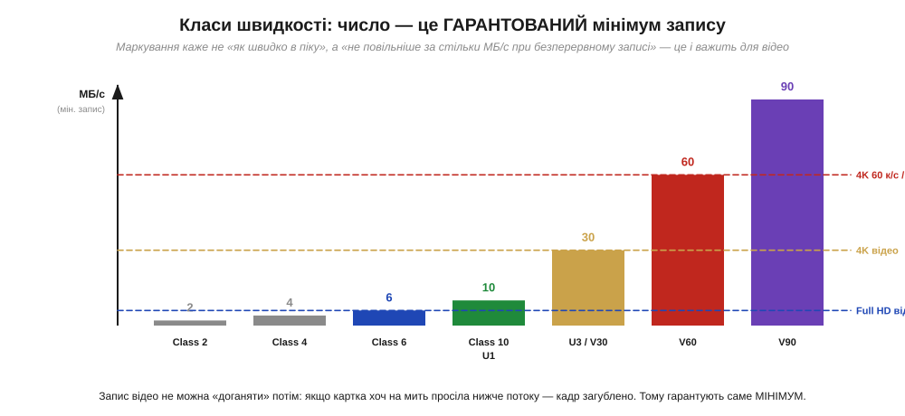

# SD-картка зсередини: NAND + контролер

«Голою» [NAND](book:electronics/nor-vs-nand) користуватися незручно: вона має дефектні комірки, вимагає ECC, доступу сторінками й обліку зношення. Найпоширеніший спосіб сховати всю цю складність — узяти NAND і поставити поруч **власний контролер**, замкнувши їх в один корпус зі стандартними контактами. Так і влаштована **SD-картка** (*Secure Digital*) — найзнайоміша зовнішня пам'ять, яку розробник вставляє в пристрій буквально руками. Зрозуміти її будову корисно подвійно: по-перше, це наочний приклад принципу «NAND + контролер»; по-друге, з карткою справді працюють у проєктах — пишуть на неї логи, читають конфігурацію, зберігають медіа.

### Що сховано в корпусі

Перше, що варто усвідомити: SD-картка — це **не** просто шматок флеш-пам'яті на ніжках. Усередині неї живе невеликий комп'ютер.


*Рис. У корпусі картки — один або кілька **NAND-кристалів** (гори комірок) і власний **контролер**. Контролер веде **ECC** (ловить і виправляє биті біти), **ховає дефектні** блоки й підставляє запасні, **відображає** «сектори», які бачить зовні, на реальні фізичні сторінки, і **рівномірно розкидає** запис, щоб комірки зношувалися рівно. Назовні картка віддає просту команду «читай/пиши сектор N» — усю каверзу NAND контролер бере на себе.*

Це і є ключова ідея. Усередині — дешева, ємна, але норовлива NAND з усіма її дефектами й посторінковим доступом. А контролер картки перетворює її на щось зручне: для зовнішнього світу картка виглядає як **проста блокова пам'ять** — масив пронумерованих **секторів** (зазвичай по 512 байтів), куди можна писати й звідки читати простими командами, не думаючи ні про сторінки, ні про ECC, ні про дефекти. З «голою» NAND ту саму пам'ять доводилося б копіювати в RAM і самотужки виправляти помилки, — тут усе це вже **зроблено** всередині картки. Ви платите за зручність трохи вищою ціною й тим, що довіряєте контролеру; натомість отримуєте мегабайти-гігабайти нелеткого сховища, з яким працювати не складніше, ніж із файлом.

І це не просто зручність — це **роздільність обов'язків**. Той самий прийом працює в [контролері DRAM](book:electronics/memory-controller): складний пристрій ховають за простим інтерфейсом, і користувач має справу лише з простим боком. Тут картка бере на себе всю «брудну» роботу з NAND — а ви на своєму мікроконтролері просто звертаєтеся до секторів. Більше того, над цими секторами зазвичай кладуть ще один зручний шар — **файлову систему** (наприклад, FAT), яку розуміє й комп'ютер. Тоді логи й конфігурація на картці стають звичайними **файлами**: пристрій їх пише, а ви потім виймаєте картку, вставляєте в комп'ютер і читаєте, як зі звичайної флешки. Так дві прості абстракції — сектори від контролера й файли від файлової системи — перетворюють норовливу NAND на щось буденно-зручне.

### Два способи говорити: SPI і нативний SD

З карткою можна спілкуватися **двома** різними протоколами, і вибір між ними — типове рішення розробника. Один простий і повільний, другий швидкий, але вимогливіший.


*Рис. **SPI-режим**: картка спілкується кількома лініями (такт, дані туди, дані назад, вибір), по **одній** лінії даних у кожен бік. Простий протокол, який має **кожен** мікроконтролер, — але повільніший (одиниці МБ/с). **Нативний SD-режим**: **чотири** лінії даних паралельно плюс командна, потрібен апаратний SD-контролер у МК — зате помітно швидше (десятки-сотні МБ/с). Той самий чіп розуміє обидва способи.*

Вибір тут — класичний компроміс «простота проти швидкості». **SPI-режим** використовує загальну послідовну [шину SPI](book:communications/spi-bus) — просту й всюдисущу чотирипровідну шину: один провід тактує, один несе дані до картки, один — від картки, один обирає картку. Так уміє **будь-який** мікроконтролер, навіть найдрібніший, тож SPI — стандартний спосіб підчепити картку до простого пристрою для логів чи конфігурації. Платня — швидкість лише в одиниці мегабайтів за секунду. **Нативний SD-режим** використовує **чотири** лінії даних одночасно й вимагає, щоб у мікроконтролері був спеціальний апаратний SD-host-контролер. Зате й швидкість на порядок вища — десятки й сотні мегабайтів за секунду, що потрібно для відео чи камер. Та сама картка слухняно працює в обох режимах; вибирає розробник — за тим, що важливіше в конкретному пристрої.

### Класи швидкості: число — це гарантований мінімум

Останнє, що варто розуміти про картки, — **класи швидкості** на маркуванні. І головне тут — що саме число **означає**.


*Рис. Клас швидкості (Class 2/4/6/10, потім U1/U3, потім V30/V60/V90) — це **гарантований мінімум** швидкості **запису** в МБ/с, а не піковий показник. Наприклад, V30 обіцяє «не повільніше за 30 МБ/с при безперервному записі». Горизонтальні лінії показують, що потребують застосування: Full HD відео ≈ 6 МБ/с, 4K ≈ 30 МБ/с, 4K 60 к/с і 8K — 60-90 МБ/с.*

Чому виробники гарантують саме **мінімум**, а не пік? Бо для головного застосування карток — **запису відео** — важлива не максимальна, а **найгірша** швидкість. Запис відеопотоку не можна «наздогнати» потім: якщо картка хоч на мить **просіла** нижче потоку даних, кадр загублено назавжди. Тому стандарт обіцяє: «при безперервному записі швидкість **не впаде** нижче стільки-то МБ/с» — і камера, знаючи цю цифру, певна, що встигне записати кожен кадр. Для розробника висновок практичний: обираючи картку під задачу з безперервним записом, дивіться саме на **клас** (гарантований мінімум), а не на рекламне «до стількох МБ/с», бо рекламна цифра — це пік читання, який до безперервного запису стосунку не має.

**Приклад (чи витримає картка запис відео).** Камера пише потік 4K-відео близько 100 мегабітів за секунду. Картка якого класу потрібна?

```
бітрейт відео     = 100 Мбіт/с
переведемо в байти= 100 ÷ 8        = 12.5 МБ/с  (треба гарантовано писати стільки)

Class 10 / U1     гарантує  ≥ 10 МБ/с   → НЕ вистачає (12.5 > 10): можливі пропуски
U3 / V30          гарантує  ≥ 30 МБ/с   → вистачає із запасом
```

Висновок прикладу: переводимо бітрейт у мегабайти за секунду (ділимо на 8) і добираємо клас із **запасом** над цим числом. Class 10 тут уже на межі й ризикує гублити кадри, а V30 дає надійний запас. Зверніть увагу: дивимося саме на гарантований мінімум класу, а не на пікову рекламну швидкість, — бо при записі важлива «підлога», а не «стеля».

> 🔧 **Навіщо це.** SD-картка — найдоступніший спосіб дати пристрою об'ємне нелетке сховище, і знати її будову корисно щодня. Перше: всередині — **NAND плюс контролер**, тож картка сама веде ECC, ховає дефекти й розкидає знос; вам не треба робити це руками — досить читати/писати сектори (а поверх них зазвичай кладуть файлову систему). Друге, дуже практичне: **SPI чи нативний SD** — це ваш вибір за критерієм «простота проти швидкості». Для логера на дрібному МК беріть SPI (його має кожен чіп, швидкості вистачає); для відео чи камери потрібен нативний 4-лінійний режим з апаратним SD-контролером. Третє: **клас швидкості — це гарантований мінімум запису**; під безперервний запис (відео, потокові дані) обирайте картку за класом (V30, V60…), а не за піковою рекламною цифрою. Четверте: картка зношується від запису (NAND має обмежений ресурс) — для частих дрібних оновлень вона погана, для цього є [інша пам'ять](book:electronics/eeprom-fram).

SD-картка — лише один представник великої родини «розумної» NAND. Та сама ідея «контролер ховає NAND і вдає просту пам'ять» масштабується вгору — до впаяних [eMMC і великих SSD](book:electronics/emmc-ssd), де прошарок, що вдає диск, дістав окрему назву й окрему важливість.
