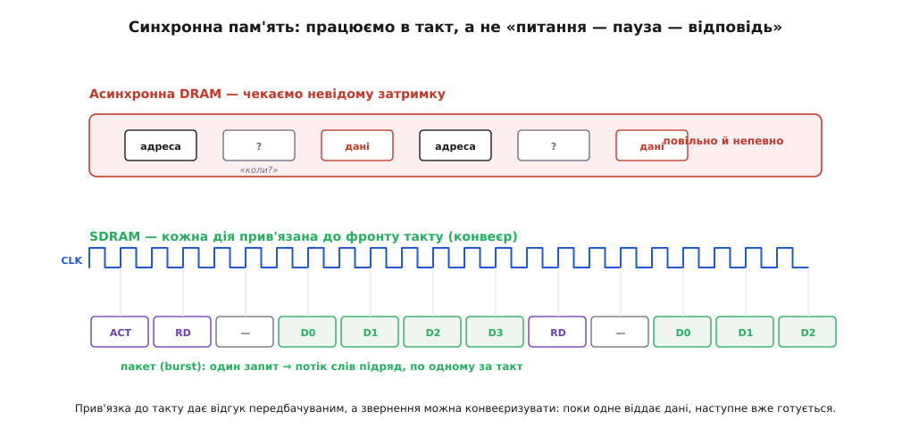
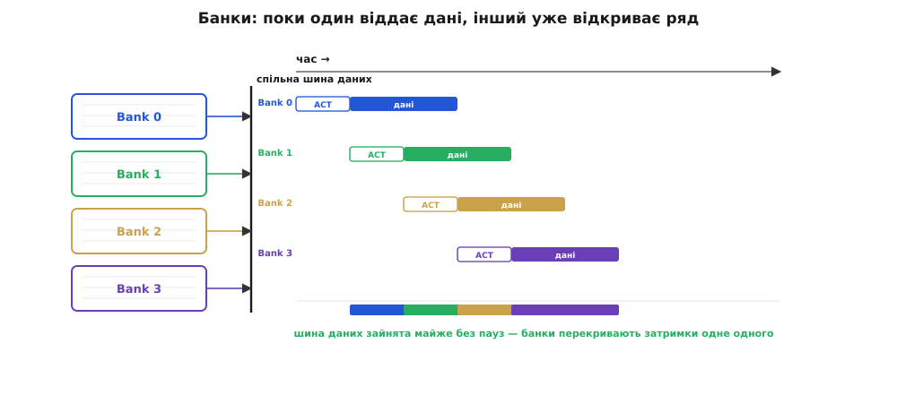
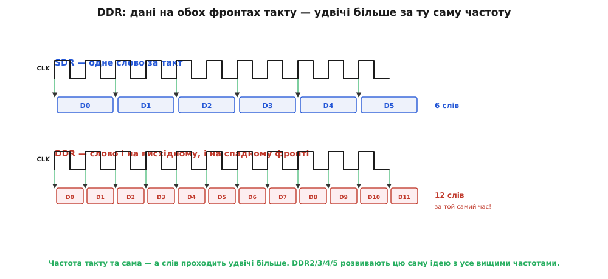

# SDRAM і DDR

[Комірка DRAM](book:electronics/dram-cell) дешева й ємна, але повільна й норовлива через регенерацію та дворівневу адресацію. Рання DRAM мала ще одну ваду — вона відповідала **асинхронно**: процесор подавав адресу й мусив **чекати**, поки чіп «коли-небудь» віддасть дані, не знаючи точно, коли. Для швидкої системи це погано: чекати наосліп — марнувати такти. Тому DRAM еволюціонувала. Спершу її прив'язали до **такту** — вийшла **SDRAM** (від англ. *synchronous DRAM*, синхронна DRAM); потім навчили віддавати дані вдвічі частіше — вийшла **DDR** (від англ. *double data rate*, подвоєна швидкість даних). Три ідеї роблять із повільної комірки швидку пам'ять: синхронний інтерфейс, банки й подвійна швидкість на фронтах. Усі вони не про саму комірку (вона лишилася тією ж), а про **спосіб спілкування** з нею.

### Синхронний інтерфейс: працюємо в такт

Перша й засаднича зміна — прив'язка до [тактового сигналу](book:electronics/clock-signal). Замість «питання — невизначена пауза — відповідь» усі дії відбуваються **на фронтах такту**, за розкладом.


*Зверху — асинхронна DRAM: подали адресу й чекаємо невідому затримку, поки прийдуть дані; повільно й непередбачувано. Знизу — SDRAM: кожна команда й кожне слово даних прив'язані до фронту такту, тож відгук передбачуваний, а звернення можна конвеєризувати — поки одне віддає дані, наступне вже готується. Один запит породжує пакет: потік слів підряд, по одному за такт.*

Користь від синхронності двояка. По-перше, **передбачуваність**: процесор точно знає, що дані з'являться, скажімо, через рівно стільки тактів після команди, — тож не чекає наосліп, а планує роботу. По-друге, і це важливіше, синхронність вмикає **конвеєр** (та сама ідея, що в [конвеєрі процесора](book:programming/pipeline)): команди можна подавати потоком, не чекаючи завершення попередньої. Поки чіп віддає дані за однією адресою, контролер уже шле наступну команду. А ще SDRAM віддає не одне слово на запит, а цілий **пакет** (англ. *burst*, сплеск) — потік слів підряд, по одному за такт. Тут спрацьовує властивість самої комірки: активувати ряд дорого (RAS), зате коли ряд уже в буфері-підсилювачі, сусідні стовпці беруться майже даремно. Пакетний режим саме це й використовує: один раз відкрили ряд — і висипали з нього потік сусідніх слів. Тому послідовне читання з DRAM **набагато** швидше за випадкове.

Тут зручно усвідомити, чому слово «синхронна» в назві SDRAM таке важливе. Асинхронна пам'ять — це діалог: «дай адресу — почекай — отримай». Кожен такий обмін має «мертвий» проміжок очікування, і поки чекаєш, нічого корисного не відбувається. Синхронна пам'ять перетворює діалог на **конвеєрну стрічку**: на кожному фронті такту на стрічку кладуть нову команду чи знімають готове слово, і стрічка не зупиняється. Той самий перехід від «крок — пауза — крок» до безперервного потоку працює і в [конвеєрі процесора](book:programming/pipeline) — і він тут дає той самий виграш. До того ж прив'язка до спільного такту знімає купу клопоту з узгодженням сигналів між контролером і чіпом: обидва живуть за одним [ритмом](book:electronics/clock-signal), тож не треба гадати, коли саме читати лінії даних.

### Банки: ховаємо затримку за паралелізмом

Навіть із пакетами лишається вузьке місце: відкриття ряду (RAS) забирає час, протягом якого шина даних простоює. Рішення — поділити масив на кілька незалежних **банків** (англ. *bank*, сховище), що працюють **з перекриттям**.


*Масив поділено на банки (типово 4 або 8), у кожного — свій буфер-підсилювач. Поки Bank 0 віддає дані на спільну шину, Bank 1 уже відкриває свій ряд, Bank 2 готує наступний, і так далі. Затримки відкриття перекриваються, тож спільна шина даних зайнята майже без пауз. Чергуючи звернення між банками, контролер ховає «дорогу» фазу RAS за «корисною» фазою віддачі даних сусіда.*

Ідея та сама, що скрізь у швидкому залізі: **перекрити** повільну підготовку однієї одиниці корисною роботою іншої. Один банк не може водночас і відкривати ряд, і віддавати дані — між цими фазами є пауза. Але якщо банків кілька, контролер чергує звернення: поки перший банк зайнятий віддачею даних, другий у цей самий час відкриває свій ряд. Коли перший закінчить, другий уже готовий — і шина даних не простоює ні такту. Це не прискорює окрему комірку, зате **піднімає пропускну здатність** усього чіпа: даних за секунду проходить помітно більше. Банки — стандартна риса будь-якої SDRAM, і саме завдяки їм велика пам'ять віддає дані суцільним потоком, а не ривками.

### Подвійна швидкість: дані на обох фронтах такту

Третя ідея дала пам'яті літери, які ви бачите щодня, — **DDR**. Звичайна **SDR**-пам'ять (від англ. *single data rate*, одинарна швидкість даних) передає одне слово за **такт** — на висхідному фронті. DDR передає слово й на висхідному, **і** на спадному фронті — тобто **двічі** за період.


*Угорі — SDR: одне слово на період такту (на висхідному фронті). Унизу — DDR: слово і на висхідному, і на спадному фронті, тобто два слова за період. Тактова частота та сама, а даних проходить удвічі більше. Покоління DDR2, DDR3, DDR4, DDR5 розвивають цю саму ідею з усе вищими частотами й ширшими пакетами.*

Хитрість елегантна: щоб подвоїти пропускну здатність, не обов'язково подвоювати **частоту** такту (а це важко — [швидкі фронти шумлять](book:electronics/edges-rise-time)). Досить навчитися ловити дані на **обох** фронтах того самого такту. Так DDR за ту саму тактову частоту віддає вдвічі більше слів. А сам масив комірок усередині лишається повільним, тож щоб устигати за швидкою шиною, чіп за одне внутрішнє звернення дістає одразу кілька сусідніх слів і віддає їх назовні впритул — це й зветься **попередня вибірка** (англ. *prefetch*, наперед-діставання). Кожне наступне покоління — DDR2, DDR3, DDR4, DDR5 — піднімає робочі частоти й бере глибший prefetch, тож пакети ширшають, а пропускна здатність зростає з року в рік; базовий принцип «двічі за період» лишається. Ось чому планку оперативної пам'яті комп'ютера підписують саме як DDR-щось: це і є та сама дешева комірка Деннарда, обвішана синхронним інтерфейсом, банками й подвійною швидкістю заради потоку даних. Кілька чіпів планки, що відповідають на звернення разом як одне ціле, утворюють **ранг** (англ. *rank*, шеренга); як із таких чіпів складають готову планку й читають її наклейку — у [вставці про маркування модуля](book:electronics/sdram-ddr/comp-ddr-labels.md).

**Приклад (звідки береться пропускна здатність).** Порахуймо, скільки даних за секунду віддає пам'ять, і розкладемо маркування «DDR-щось» на множники.

```
тактова частота шини   = 800 МГц
передач за такт        = 2          (обидва фронти — DDR)
ефективна швидкість    = 800 × 2    = 1600 мільйонів передач/с  → «DDR-1600»
ширина шини            = 8 байтів   (64-бітна шина модуля)
пропускна здатність    = 1600 млн × 8 Б ≈ 12.8 ГБ/с
```

Висновок прикладу: число в назві (1600) — це **передачі за секунду** (такт × 2), а не частота такту (800 МГц); а реальний потік байтів виходить, коли помножити передачі на **ширину** шини. Звідси видно три важелі пропускної здатності — частота такту, подвоєння на фронтах і ширина шини, — і чому навіть «не дуже швидка» за частотою пам'ять віддає десяток гігабайтів за секунду. Та сама цифра потрібна, наприклад, щоб щомиті перемальовувати великий екран із [зовнішнього кадрового буфера](root:embedded/when-memory-runs-out). Чому це число — лише **стеля**, а не та швидкість, яку дістанеш насправді, докладно з усіма множниками й втратами розбирає [математична вставка про пропускну здатність](book:electronics/sdram-ddr/math-bandwidth.md).

> 🔧 **Навіщо це.** Ці три ідеї пояснюють практичні речі, з якими стикається розробник. **Синхронність і пакети**: послідовний доступ до DRAM у рази швидший за «стрибання» по випадкових адресах — тому код, що обходить дані **підряд**, працює помітно швидше (та сама причина, що й [дружність до кешу](book:programming/cache)); це не каприз, а наслідок дорогого RAS і дешевого пакета. **Банки**: вони дають змогу великій пам'яті віддавати суцільний потік — корисно знати, чому реальна пропускна здатність залежить від характеру доступу, а не лише від частоти. **DDR**: коли бачите маркування на кшталт «DDR4-3200», розумієте, що 3200 — це подвоєна частота передачі, а не такту. І найголовніше: уся ця складність — синхронність, банки, фронти, пакети — означає, що DRAM **не підключиш напряму** до простих ніжок мікроконтролера. Між ними мусить стояти спеціальний пристрій, який знає весь цей протокол, — [контролер пам'яті](book:electronics/memory-controller): він розкладе адресу на ряд і стовпець, видасть команди з точними паузами й не забуде про регенерацію.
