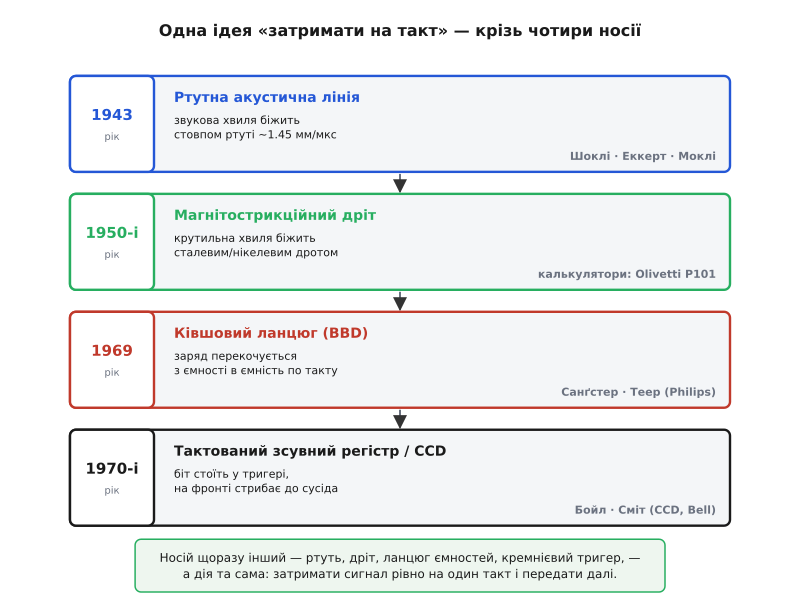

# 📜 Лінія затримки крізь покоління

Є одна дія, така проста, що її й дією назвати ніяково: **затримати сигнал на трохи й віддати незмінним**. Не порахувати, не підсилити, не перетворити — просто **потримати в дорозі** й випустити з запізненням. Здавалося б, що тут винаходити. А проте саме на цій дрібниці людство спіткнулося на добрих півстоліття, вигадало під неї щонайменше чотири зовсім різні машини — зі ртуті, зі сталевого дроту, з ланцюжка крихітних відерець і, нарешті, з кремнієвих тригерів, — і кожне покоління наново дивувалося, як багато можна зробити, якщо вмієш **пам'ятати минуле сигналу**.

Ця розповідь — про те, чому «затримати на такт» виявилося настільки коштовним умінням, що під нього будували апарати завбільшки з шафу; хто це робив; де вони сперечалися; і чому тактований зсувний регістр, з якого ми почали, — не перший, а вже **четвертий** носій однієї впертої ідеї. Цікаво тут не «хто перший», а те, як одна й та сама думка щоразу перевдягалася в новий матеріал, коли старий упирався в свою фізичну стелю.

*Один родовід у чотирьох поколіннях. Ртутна акустична лінія (1943) тримала біт як звукову хвилю в дорозі; магнітострикційний дріт (1950-і) — як крутильну хвилю в металі; ківшовий ланцюг (1969) перекочував заряд з ємності в ємність; тактований зсувний регістр і CCD (1970-і) поставили біт у тригер, що на фронті стрибає до сусіда. Носій щоразу інший — дія та сама.*

## Що саме бентежило: пам'ять, яку ніде взяти

Щоб відчути гостроту задачі, треба на мить забути, що пам'ять — це щось дешеве й очевидне. У 1940-х її просто **не було** чим робити. Уявіть інженера, який будує першу цифрову лічильну машину. Йому треба десь тримати кількасот чисел, поки машина працює. Магнітних осердь ще не винайшли. Транзистора ще немає (він з'явиться аж 1947-го). Кремнієвих мікросхем не буде ще двадцять років. Що лишається? Лампа-тригер тримає **один** біт — але лампа гаряча, велика, ненадійна й ненажерлива до струму. Тисяча бітів на лампах — це стіна вогнів, яка гріється, як піч, і перегоряє щогодини.

І тут хтось помітив дивну лазівку. А що, як не **тримати** біт на місці, а пустити його **бігати по колу**? Сигнал, запущений у довгу дорогу, десь у цій дорозі **є** — він існує, поки летить. Якщо дорога досить довга, а сигнал біжить не миттєво, то в трубі одночасно вміщається ціла **черга** імпульсів, вервечка нулів і одиниць, що женуться один за одним. Долетів імпульс до кінця — його ловлять, підсилюють і **запускають з початку знову**. Виходить пам'ять без жодної нерухомої комірки: біти зберігаються не тим, що десь застигли, а тим, що **весь час у русі**, як вода, яку тримають, ганяючи по замкненому жолобу.

> 🔧 **Навіщо це.** Ухопіть цей злам інтуїції, бо вся дальша історія росте з нього. Ми звикли, що пам'ять — це щось нерухоме: комірка стоїть, у ній лежить значення. Лінія затримки перевертає цю картину: **пам'ять як безперервний рух**. Біт не «лежить» — він **летить по колу**, і саме тому існує. Це та сама ідея, що згодом оживе в тактованому зсувному регістрі, тільки там замість труби зі звуком — ланцюжок тригерів, а замість польоту хвилі — покрокове перестрибування по фронту такту. Динамічна пам'ять сучасних комп'ютерів, до речі, теж «забуває» вміст за мілісекунди й тримає його лише постійним **освіженням** — далекий нащадок тієї самої думки, що зберігати можна рухом, а не спокоєм.

Уся притягальність цієї ідеї — в економії. Один довгий фізичний канал заміняв **сотні** окремих комірок. Але й ціна була сувора, і саме вона визначила всю подальшу гонитву за носієм: сигнал у русі доступний **не будь-коли**, а лише тоді, коли він добіг до виходу. Щоб дістати потрібне число, треба **дочекатися**, поки воно проб'ється по колу до зчитувача — а це значить, що така пам'ять повільна й **послідовна** за самою природою. Це не вада реалізації — це наслідок ідеї «зберігати рухом». І вся історія лінії затримки — це, по суті, історія пошуку **найкращого середовища**, у якому сигнал біг би повільно, чесно й довго.

## Перший носій: звук, застряглий у ртуті

Найперша робоча відповідь прийшла не з обчислень, а з **радіолокації** — і це не випадковість, а прямий причинний зв'язок. У роки Другої світової радар мучила проста біда: нерухомі предмети — пагорби, будівлі, хмари — світилися на екрані так само яскраво, як літак, і топили корисну ціль у нерухомому «безладі» (англ. *clutter* — сміття, захаращення). Але ж нерухоме тим і відрізняється від рухомого, що від імпульсу до імпульсу **не змінюється**. Якби взяти відлуння **попереднього** зондувального імпульсу, затримати рівно на період повторення й **відняти** від свіжого — усе нерухоме взаємно знищилося б, а лишилося б тільки те, що зрушило. Оце й є славнозвісна **селекція рухомих цілей** (англ. *moving target indication*, MTI). Але щоб відняти минулий імпульс від теперішнього, минулий треба **десь потримати** ті кілька тисячних секунди. Знову — затримати сигнал і віддати незмінним. Радар уперся в ту саму стіну, що й обчислювачі, тільки на кілька років раніше.

Ідею затримати радарне відлуння звуковою хвилею висловив ще 1942 року **Вільям Шоклі** (William Shockley, 1910–1989) у Bell Telephone Laboratories — той самий, хто за п'ять років співтворить транзистор. *(Доказовий статус: авторство первинної ідеї акустичної лінії затримки для радара усталено приписують Шоклі; це фіксують і історичні огляди, і сама патентна лінія Bell.)* Думка проста й глибока: **звук у речовині повзе повільно** — у мільйони разів повільніше за електричний сигнал у дроті. Якщо перетворити електричний імпульс на **механічну хвилю**, пустити її крізь стовп речовини й на іншому кінці перетворити назад на струм, то поки хвиля дочалапає, мине відчутний, керований проміжок часу. Труба з речовиною стає **лінією затримки** — фізичним втіленням запізнення.

Від ідеї до працездатного приладу — окремий крок, і його зробив американський інженер **Джон Преспер Еккерт** (John Presper Eckert, 1919–1995) у Школі електротехніки Мура (Moore School) Пенсильванського університету, приблизно 1943 року. Еккерт зупинився на **ртуті** — і вибір цей не примха, а точний фізичний розрахунок. Кварцовий п'єзоелектричний перетворювач (кристал, що від напруги стискається, а від стиску дає напругу) добре віддає звук у середовище лише тоді, коли їхні **акустичні опори** близькі; у ртуті цей опір якраз добре пасує до кварцу, тож у неї вдавалося загнати звук без величезних утрат. До того ж звук у ртуті біжить близько **1450 метрів за секунду** — повільно як для електрики, зручно як для затримки. Труба завдовжки з метр давала запізнення десь у пів мілісекунди — саме той масштаб, що потрібен був радару й, як з'ясується, обчислювачам.

Механіка вражає простотою й хитрістю водночас. На одному кінці ртутного стовпа — кварцовий кристал; на нього подають короткий електричний імпульс, кристал сіпається й **штовхає у ртуть звукову хвильку**. Вона біжить крізь стовп, доходить до кристала на **дальньому** кінці, той під ударом хвилі **виробляє електричний імпульс**. Його підсилюють, вичищають форму — і **знову подають на вхідний кристал**. Імпульс пішов на друге коло. Поки він у ртуті — біт існує; коли добіг — його **переродили** й запустили спочатку. Тонкощів була безліч: кінці ртутного стовпа доводилося зрізати **під кутом** або гасити спеціальним поглиначем, щоб хвиля не **відбивалася** назад і не плутала чергу власними примарами; ртуть тримали за температури близько **40 °C**, бо швидкість звуку в ній повзе з теплом, а разом із нею з'їжджав би весь час затримки. Але воно **працювало** — і це головне.

> 🔧 **Навіщо це.** Розгляньте цей контур пильно — і впізнаєте свіжо-щойно розказаний тактований зсувний регістр, лише «розтягнутий» у фізику. Кварц на вході «записує» біт (як лінія даних), звук у ртуті — це біт **у польоті між комірками**, кварц на виході «зчитує» його, а зворотний дріт на вхід — це та сама **петля**, що робить із затримки пам'ять. Різниця одна, зате принципова: у ртуті біт **пливе безперервно** й доступний лише в мить прибуття, а в зсувному регістрі він **стрибає дискретно**, рівно на щабель за фронт такту. Тактований регістр — це, по суті, ртутна лінія, у якій **безперервний політ замінили на покрокове перестрибування**, а тому біт можна ловити чітко «по команді», а не «коли добіжить». Уся дисципліна синхронної цифрової техніки — це приборкана, поставлена на такт лінія затримки.

## Ртуть іде в обчислювач: EDVAC, EDSAC, UNIVAC

Той самий Еккерт разом із **Джоном Моклі** (John Mauchly, 1907–1980) будував у Школі Мура перший великий електронний обчислювач ENIAC, і біль браку пам'яті вони знали до дрібниць. Тож коли постала машина наступного покоління — EDVAC, — рішення напросилося саме: пам'яттю зробити **батарею ртутних ліній затримки**, кожна з яких ганяє по колу свою чергу бітів. Так проста радарна хитрість перекочувала в саме серце обчислювальної машини. Еккерт і Моклі подали **31 жовтня 1947 року** заявку на патент системи пам'яті на ртутній лінії затримки; патент США **2 629 827** видали 1953 року, і він охоплював не лише ртуть, а й інші втілення тієї самої ідеї — ланцюжки котушок і конденсаторів, магнітострикційні лінії. *(Доказовий статус: дата заявки, номер і рік видачі патенту усталені; авторство — Еккерт і Моклі.)*

Першою **великою машиною, що реально запрацювала** на ртутній пам'яті, стала не американська EDVAC, а англійська **EDSAC** — і саму її назву варто прочитати повільно: *Electronic Delay Storage Automatic Calculator*, «електронний автоматичний обчислювач із **пам'яттю на затримці**». Затримка потрапила прямо в ім'я машини. Збудував її **Морис Вілкс** (Maurice Wilkes, 1913–2010), британський математик і інженер Кембриджського університету; **6 травня 1949 року** EDSAC ожив і прогнав першу програму — таблицю квадратів. Пам'ять його — **32 ртутні лінії затримки**, у кожній кружляла своя вервечка бітів; разом вони тримали пів тисячі 35-розрядних слів. За тими мірками — багатство, за нинішніми — менше, ніж займає один рядок цього тексту.

Далі ртутні лінії пішли в комерцію: перший серійний американський обчислювач **UNIVAC I** (1951) теж пам'ятав на ртуті, розкладаючи слова по колонках із транспортабельних ліній. Це був **зеніт** акустичної пам'яті — і водночас початок її кінця, бо вже підростав суперник, вільний від головних її вад.

> 🔧 **Навіщо це.** Затямте цей момент як приклад того, як **військова хитрість стає обчислювальною технологією** — сюжет, що повторюватиметься в електроніці знову й знову. Прилад, придуманий, щоб чистити радарний екран від нерухомого сміття, за кілька років став **основною пам'яттю** перших комп'ютерів, бо задача виявилася однією й тією самою: **потримати сигнал і віддати незмінним**. Побачивши це раз, ви навчитеся впізнавати ту саму дію під різними масками — і розумітимете, чому «лінія затримки» досі живе десятком облич у зовсім різних куточках техніки. Ртутні лінії, до речі, тримали значення, лише **поки крутиться живлення**: вимкнув машину — черга бітів розсіялася. Це найдавніший предок того, що ми звемо **енергозалежною** пам'яттю: RAM у вашому комп'ютері забуває все при вимиканні з тієї самої глибокої причини — вона теж «зберігає рухом».

## Чому ртуть мусила поступитися

Ртутна лінія була геніальним рішенням для своєї миті, але вади її були важкі — буквально й переносно. Ртуть **отруйна** й **важка**: колона потребувала герметичного корпусу, а вся батарея важила чимало. Її доводилося **термостатувати** коло 40 °C, інакше «плив» час затримки. Але найглибша вада була не побутова, а логічна, і саме вона вирішила долю: пам'ять на затримці **послідовна**. Щоб дістати конкретне слово, машина мусила **чекати**, поки воно проб'ється по колу до зчитувача, — а це в середньому пів оберту черги. Проти цього фундаментального гальма не було ради: така природа «зберігання рухом».

І тут з'явився суперник, який бив ртуть саме в її найслабше місце. **Магнітне осердя** (англ. *magnetic core memory*) — крихітне феритове кільце, яке намагнічують в один чи інший бік, і воно так і лишається намагніченим, доки не перемагнітиш. Кожен біт **стоїть на місці** й доступний **умить**, за будь-якою адресою, без черги й очікування; вміст не зникає при вимиканні живлення. Наприкінці 1950-х осердя подешевшало, і велика ртутна пам'ять швидко відійшла: неможливо змагатися з тим, хто дає будь-який біт одразу, там, де ти сам змушений ганяти чергу по колу. Здавалося б, тут історії лінії затримки й кінець.

Але вона не скінчилася — вона **переселилася в дешевизну**.

## Другий носій: крутильна хвиля в сталевому дроті

Осердя перемогло у **великих** машинах, де важила швидкість. Та був цілий світ, де швидкість пасла задніх, а над усе цінувалася **дешевизна**: настільні лічильні машини, електронні **калькулятори**. Тут кільканадцять чисел на екран не треба діставати за наносекунди — людина однаково натискає клавіші повільно. І ось для цієї ніші лінія затримки пережила друге народження, скинувши дорогу отруйну ртуть заради **звичайного металевого дроту**.

Хитрість — у явищі під назвою **магнітострикція** (лат. *magnetum* — магніт + *strictio* — стягування): деякі метали, надто **нікель**, від магнітного поля ледь-ледь **змінюють свій розмір**. Начепіть на кінець тонкого сталевого дроту котушку, дайте струмовий імпульс — нікелева ділянка смикнеться й **закрутить** кінець дроту, пустивши по ньому **крутильну хвилю** (хвилю не стиску, а скруту). Вона побіжить дротом зі швидкістю звуку в металі, а на дальньому кінці інша котушка вловить, як дріт крутнувся, і **виробить електричний імпульс**. Той самий контур, що й у ртуті: перетворив струм на механічну хвилю → пустив у дорогу → на виході перетворив назад → підсилив → **запустив по колу**. Тільки середовищем тепер став дешевий гнучкий дріт, який можна **згорнути в котушку** й сховати в об'єм із долоню.

Крутильна хвиля тут узята не випадково, а з тонкого розрахунку: **скрут** дроту куди менше чіпляється за дрібні дефекти й вигини, ніж хвиля поздовжнього стиску, тож дріт можна безбоязно скрутити спіраллю — і хвиля чесно оббіжить усі витки, не розсипавшись на відбиттях. У таку скручену котушку вкладали **сотні, а то й тисячі бітів** черги; час доступу виходив десь пів мілісекунди — повільно, зате **копійчано**.

На цьому й піднялися легендарні настільні машини 1960-х. Італійська **Olivetti Programma 101** (1965) — часто звана однією з перших **настільних** обчислювальних машин, — пам'ятала саме на магнітострикційній дротяній лінії. На тому ж принципі стояли ранні електронні калькулятори на кшталт **Friden EC-130**. Ідея «зберігати рухом» знайшла собі теплий закут і прожила там ще ціле десятиліття — рівно доти, доки не подешевшала кремнієва пам'ять.

> 🔧 **Навіщо це.** Ось урок, вартий понад саму історію: **технологія рідко вмирає — вона перетікає туди, де її слабкість не важить**. Ртутну лінію вигнали з великих машин не тому, що вона стала гірша, а тому, що поряд з'явилося щось краще **саме для тієї задачі** — швидкого довільного доступу. Та в іншій задачі — дешевій і неспішній — ті самі принципи ще довго били всіх суперників. Коли наступного разу почуєте, що якась технологія «застаріла», спитайте: застаріла **для чого**? Часто вона просто переїхала в нішу, де її вади нікого не турбують, а переваги ще потрібні. Магнітострикційна лінія — це та сама ртутна ідея, пересаджена з дорогого ґрунту в дешевий, і саме дешевизна дала їй другий вік.

## Третій носій: ланцюжок відерець із зарядом

А тепер поворот, який виводить лінію затримки з царини **пам'яті** назад у царину **сигналу** — і робить її дискретною, покроковою, майже такою, як цифровий зсувний регістр, але для **аналогових** величин. Мова про **ківшовий ланцюг** (англ. *bucket-brigade device*, BBD) — і сама назва вже все пояснює. Уявіть пожежну команду старих часів, що гасить пожежу без помпи: люди стають у ряд і **передають відра з водою з рук у руки**. Кожен тримає одне відро, а на команду всі разом перехиляють свій ківш у долоні сусіда. Вода долає весь ряд, крокуючи по відру за такт.

Замініть відра на **крихітні конденсатори**, воду — на **електричний заряд** (порцію якого можна взяти пропорційною до миттєвого значення аналогового сигналу), а команду «перелий!» — на **тактовий сигнал**, і матимете BBD. Заряд, залитий у перший конденсатор, на кожен такт **перекочується** в наступний, потім у наступний — крокує ланцюжком ємностей, керований ключами-транзисторами, що по черзі відмикаються тактом. Це **аналогова лінія затримки з дискретним часом**: сигнал не оцифрований у нулі й одиниці, він лишається плавною величиною — рівнем заряду, — але **зсувається щаблями**, рівно по такту, точнісінько як біти в тактованому зсувному регістрі. По суті це той самий зсувний регістр, тільки в кожній комірці не «нуль чи одиниця», а **ціла порція заряду**, аналогова величина.

Придумали ківшовий ланцюг **Ф. Санґстер** (F. L. J. Sangster) і **К. Теер** (K. Teer) у дослідних лабораторіях **Philips** у Нідерландах, **1969 року**; засадничу заявку на патент (США **3 546 490**) Санґстер подав ще 17 жовтня 1967-го, а видали його 8 грудня 1970-го. *(Доказовий статус: автори, установа й патентні дати усталені за самим патентом і технічними довідниками Philips.)* І тут історія робить свій найнесподіваніший виверт. BBD знайшов собі домівку не в комп'ютерах і не в приладах — а в **музиці**. Річ у тім, що затримати **звук** на кілька десятків мілісекунд і змішати з незатриманим — це і є основа цілого сімейства ефектів: **луна** (echo), **хорус** (chorus — «хор», ефект, ніби грає кілька інструментів трохи не в лад), **флентжер** (flanger), **вібрато**. Мікросхеми-ківшові ланцюги — знамениті **MN3007** і **MN3208** від Panasonic, **Reticon SAD-1024** — стали серцем гітарних педалей і синтезаторів 1970–80-х. Скручений сталевий дріт калькулятора й гаряча ртуть радара обернулися **теплим аналоговим відлунням** у гітарному підсилювачі — той самий принцип «затримати й віддати», лише тепер заради краси звуку.

## Четвертий носій: заряд у кремнії — CCD і зсувний регістр

І ось остання пересадка, що замикає коло історії просто на порозі того, з чого ми починали. Того ж плідного **1969 року**, коли Санґстер із Теером доводили ківшовий ланцюг, у Bell Labs двоє інших дослідників за одну коротку — за переказами, менш ніж годинну — нараду накидали ідею, страшенно на нього схожу, але тоншу. **Віллард Бойл** (Willard Boyle, 1924–2011), фізик **канадець**, і **Джордж Сміт** (George E. Smith, нар. 1930), фізик **американець**, придумали **прилад із зарядовим зв'язком** (англ. *charge-coupled device*, CCD): ланцюжок близько поставлених крихітних електродів на кремнії, під якими **пакет заряду** можна пересувати з-під одного електрода під сусідній, керуючи їх напругою по такту. Це знову **та сама лінія затримки** — заряд крокує по ланцюгу за тактом, — тільки виконана вже суто в кремнії, без окремих транзисторів-ключів, і тому напрочуд компактна й тиха.

Бойл і Сміт задумували CCD теж як пам'ять-регістр зсуву — черговий носій нашої впертої ідеї. Але справжня його слава прийшла з іншого боку. Якщо змусити кожен елемент ланцюга **накопичувати заряд від світла**, що на нього впало, а потім усе накопичене **виштовхати ланцюгом до виходу**, крок за кроком, — вийде **світлочутлива матриця**, яка перетворює зображення на послідовність електричних відліків. Так лінія затримки стала **оком цифрової камери**: десятиліттями CCD-матриці знімали все — від сімейних фото до знімків далеких галактик у телескопах. За цей винахід Бойл і Сміт розділили половину **Нобелівської премії з фізики 2009 року**. *(Доказовий статус: автори, рік винаходу й Нобелівська премія 2009 усталені; національності — канадець і американець — за офіційними життєписами.)* Зверніть увагу на чесність тут: премію дали не за «пам'ять на зсуві», а за **зображувальну** іпостась приладу — бо саме вона змінила світ; та в основі її лежить рівно той самий крок заряду по ланцюгу, що й у ківшовому ланцюзі поряд.

І паралельно з цими зарядовими іграми дозрівав **прямий, чисто цифровий** нащадок ідеї — той самий [тактований зсувний регістр](book:electronics/shift-register), з якого починалася наша тема. Тут відмовилися від будь-яких хвиль і плавних порцій заряду й звели все до найтвердішого: біт **стоїть у тригері** як стійкий рівень напруги — нуль або одиниця, — а на фронті такту **стрибає до сусіда**. Ніякого польоту, ніякого перетікання, ніякої черги, що біжить по колу, — чиста, дискретна, повторювана дія «на фронті зсунься на щабель». Це найнадійніша з усіх лінія затримки: без ртуті, без дроту, без термостата, без відбиттів — просто ланцюг однакових комірок у кремнії, кожна з яких **пам'ятає минуле сигналу рівно на один такт**. Коло замкнулося: радарна хитрість зі ртуттю, пройшовши крізь дріт, відерця й зарядові пакети, скам'яніла в найпростішу цифрову цеглинку.

> 🔧 **Навіщо це.** Ось найдальша думка всієї цієї подорожі, і вона того варта. Придивіться, **що спільного** в усіх чотирьох носіях, попри разючу відмінність матеріалів. Ртутна лінія, дротяна лінія, ківшовий ланцюг, зсувний регістр — усі роблять одне: **тримають упорядковану чергу минулих значень сигналу**, зсуваючи її на крок за одиницю часу. А це означає, що в них у будь-яку мить лежить **історія сигналу** — теперішнє, вчорашнє, позавчорашнє значення, вишикувані по порядку. Маючи цю історію під рукою, з нею можна **рахувати** — усереднювати, згладжувати, виділяти частоти. Саме тому та сама лінія затримки, крізь яку течуть **відліки сигналу**, — це фізичне серце цифрового оброблення: на ній стоять фільтри, що чистять звук і зображення. Тактований зсувний регістр не випадково опинився і в послідовному зв'язку, і в цифровому фільтрі — це один і той самий стародавній прилад «пам'яті минулого», лише в найчистішій формі. Розкладене на такт запізнення виявилося однією з **найплідніших** ідей усієї електроніки.

## Що лишається після всієї цієї дороги

Озирнімося на пройдене. Почалося все з дрібнички, негідної навіть звання винаходу: **затримати сигнал і віддати незмінним**. Але ця дрібничка виявилася ключем до речі, якої в 1940-х не було чим робити зовсім, — до **пам'яті**. Шоклі побачив, що звук повзе повільно й тому може «потримати» імпульс у дорозі (1942); Еккерт із Моклі втілили це в **ртутну лінію** й зробили пам'яттю перших обчислювачів, а Вілкс запустив на ній EDSAC (1949). Коли магнітне осердя побило ртуть швидкістю, ідея не вмерла, а **переселилася в дешевий дріт** (1950-і), де крутильна хвиля тримала біти калькуляторів. Санґстер і Теер зробили ланцюг **дискретним і аналоговим** (1969), і він несподівано пішов творити гітарну луну. Бойл і Сміт того ж року перенесли крок заряду в **кремній** (CCD, Нобель-2009), і лінія затримки стала оком камери. А в найтвердішому, чисто цифровому вигляді вона застигла **тактованим зсувним регістром** — ланцюгом тригерів, що зсуває чергу бітів рівно по фронту такту.

Носій щоразу був інший: ртуть, сталь, ланцюг ємностей, кремнієвий тригер. Хтось шукав пам'ять, хтось — чистий радарний екран, хтось — тепле відлуння, хтось — зображення зірок. Але **дія** під усім цим — незмінна, як математична теорема: **затримати на такт і передати далі**. І, мабуть, головний урок історії лінії затримки саме в цьому. Найглибші ідеї в техніці — не громіздкі й не хитромудрі; вони **прості до непристойності** й тому вміють утілюватися хоч у чому — у стовпі ртуті, у скрученому дроті, у ланцюжку відерець, у мовчазному кремнії. Змінюється матеріал, змінюється епоха, змінюється навіть мета — а сама думка, раз народившись, живе далі й далі, просто перевдягаючись у те, що під рукою в кожного нового покоління.
