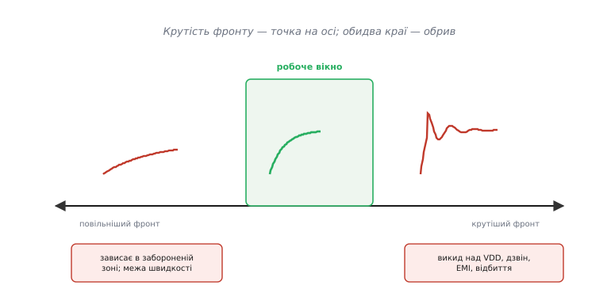
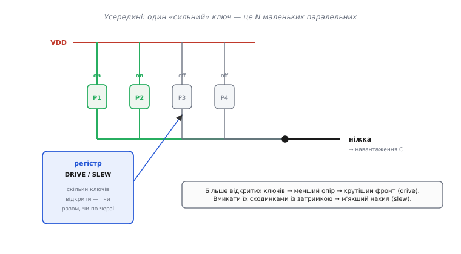
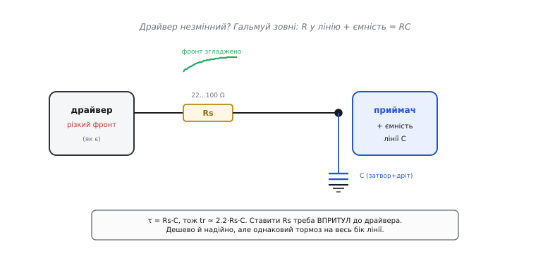
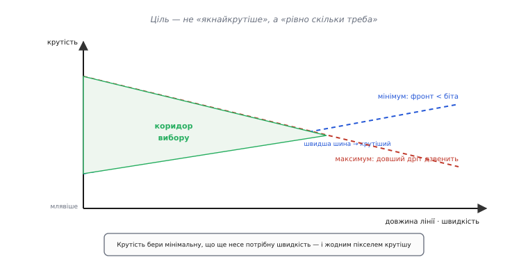

# Керування крутістю фронту: не «якнайшвидше», а «рівно скільки треба»

Новачок, побачивши, що цифровий вихід перемикається не миттєво, робить природний висновок: треба зробити фронт **якнайкрутішим** — сильніший драйвер, коротші дроти, і хай стрибає різко. Логіка ж любить чіткі краї. Але професійні мікросхеми йдуть у протилежний бік: у їхніх регістрах є біти, що фронт навмисно **сповільнюють**, а поруч із драйверами стоять резистори, єдина робота яких — **пригальмувати** перемикання. Навіщо навмисно псувати те, за що інші борються? Бо крутість фронту (*slew rate* — «швидкість перебігу», від *to slew* — «різко повертати») — це не «що більше, то краще», а **параметр із двома стінками**: замало — погано, забагато — теж погано. І грамотна схема не жене фронт у стелю, а ставить його **рівно туди, де треба**. Розберімо, чому вікно вузьке, якими важелями крутість підкручують — усередині чипа й зовні — і як обрати правильну точку.

### Дві стінки: чому вікно, а не «чим крутіше, тим краще»

Почнімо з того, **чому** взагалі є верхня межа. Що поганого в різкому фронті? Адже [сам собою крутий край корисний](book:electronics/edges-rise-time): він швидко проскакує заборонену зону між рівнями й піднімає стелю швидкості лінії. Це нижня стінка — **надто повільний** фронт довго висить у невизначеності й обмежує швидкість передачі. Тут інтуїція новачка правильна.

Пастка — у верхній стінці. Крутість фронту — це, за означенням, велика **швидкість зміни напруги в часі**, яку записують як ΔV/Δt, або, мовою похідних, **dV/dt** («де-ве по де-те» — наскільки стрімко напруга біжить щомиті). І тут вступає фізика: будь-який реальний дріт має паразитну **ємність** і паразитну [**індуктивність**](book:electronics/inductance). Через ємність тече струм, пропорційний саме до dV/dt (I = C·dV/dt), а на індуктивності напруга скаче пропорційно до **швидкості зміни струму** dI/dt. Тобто чим **різкіший** фронт — тим **більший** кидок струму він проганяє крізь паразитну ємність, і тим сильніший стрибок напруги наводить на паразитній індуктивності. Ці два ефекти й породжують усі біди різкого краю: сигнал починає **дзвеніти** (коливатися з викидами вище живлення й нижче нуля), різкий перепад **випромінює** електромагнітну заваду в сусідні кола, а на довгій лінії круте перемикання дає **відбиття**.


*Крутість — не «чим більше, тим краще», а точка на осі з обривом з обох боків. Ліворуч (занадто повільно) фронт зависає в забороненій зоні й ставить стелю швидкості. Праворуч (занадто круто) — викид над VDD, затухаючий дзвін, електромагнітна завада, відбиття. Ціль керування — потрапити в **робоче вікно** посередині: досить круто, щоб нести потрібну швидкість, і не крутіше.*

Ось чому вікно. Керувати крутістю — означає свідомо обрати точку між цими двома стінками, а не тікати від однієї прямо в другу. І часто правильна точка — **помітно повільніша** за максимум, який здатен видати драйвер. Причина проста: більшість цифрових сигналів насправді не такі вже швидкі. Якщо тактова лінія цокає на 1 МГц, їй **не потрібні** фронти по одній наносекунді — вони лише нагенерують заваду задарма. Фронт треба рівно такий, щоб проскочити заборонену зону й устигнути за бітом, — а весь «зайвий» запас крутості йде не в користь, а в дзвін і випромінювання.

> 🔧 **Навіщо це.** Класична картина: плата працює, але «фонить» — псує радіоприймач поруч, не проходить сертифікацію на електромагнітну сумісність, а осцилограф показує дзвін на кожному фронті шини. Перша думка недосвідченого — «слабкий сигнал, треба підсилити». Правильна — навпаки: фронти надто круті для цієї плати, їх треба **пригальмувати**. Керування крутістю — це основний і найдешевший важіль проти [проблем електромагнітної сумісності](book:electronics/emc-filtering), який часто рятує вже готовий виріб без перепаювання.

### Важіль перший: сегментований драйвер усередині чипа

Найчистіший спосіб керувати крутістю — просто **послабити сам драйвер**. Згадаймо, звідки береться фронт: вихідний транзистор має скінченний опір і заряджає ємність вузла — виходить [RC-ланка](book:electronics/rc-time-constant), і час наростання tr ≈ 2.2·Rout·C. Якщо збільшити **опір** драйвера Rout, стала часу зросте, і фронт стане млявішим. Тобто крутість керується опором вихідного ключа.

Але як зробити опір транзистора **регульованим**? Хитрість елегантна: «один сильний ключ» усередині мікросхеми — це насправді **кілька маленьких транзисторів, увімкнених паралельно** (сегментований вихідний каскад). Паралельні опори складаються як обернені: два однакові ключі дають удвічі менший опір, ніж один. Тож достатньо мати логіку, що вирішує, **скільки** з цих сегментів відкрити — і опір драйвера стає керованим числом. Відкрив усі — опір найменший, фронт найкрутіший; відкрив один — опір великий, фронт млявий.


*Керована крутість усередині чипа. «Сильний» вихідний ключ — це насправді N маленьких транзисторів пліч-о-пліч. Регістр вирішує, скільки їх відкрити: більше відкритих → менший сумарний опір → крутіший фронт (це керування **силою**, drive strength). А якщо відкривати їх не разом, а сходинками із крихітною затримкою — нахил фронту згладжується напряму (це керування **крутістю**, slew rate). Один вузол, два різні важелі.*

Тут ховається тонка, але важлива відмінність між двома настройками, які в мікросхемах часто стоять поруч і які легко сплутати. **Сила виходу** (*drive strength*) — це скільки струму ніжка здатна віддати; нею керують, вмикаючи більше або менше паралельних сегментів **водночас**. Побічно це впливає й на крутість (сильніший драйвер швидше заряджає ємність), але головна його мета — **потужність**, здатність прогнати струм у навантаження. А **крутість** (*slew rate*) у розвинених контролерах — окремий важіль: сегменти вмикають не всі разом, а **сходинками**, з мікроскопічними затримками між ними, тож напруга наростає не одним ривком, а плавніше. Через це в багатьох мікроконтролерах крутість можна знизити, **не жертвуючи** максимальним струмом виходу — це два незалежні гвинти на одному вузлі.

На практиці це просто біти в регістрі налаштування ніжки. Скажімо, у контролерах TI серії Tiva крутість вмикається окремим регістром `GPIOSLR` (Slew Rate Control), причому лише в режимі найсильнішого, 8-міліамперного драйвера. Виглядає це так:

```c
// Приклад: увімкнути обмеження крутості на ніжці PA5 (умовний доступ до регістрів)
GPIO_PORTA_DR8R_R |= (1 << 5);   // 8-мА драйвер (сильний вихід)
GPIO_PORTA_SLR_R  |= (1 << 5);   // обмежити крутість фронту на цій ніжці
```

Один запис у регістр — і фронти цієї ніжки стають м'якшими, менше дзвенять і менше фонять, а решта ніжок лишаються швидкими. Саме тому в даташитах поруч із «drive strength» так часто стоїть окреме поле «slew rate» або «speed» (у контролерах STM32 воно так і зветься — *output speed*, і теж підбирає внутрішній драйвер під потрібну крутість). Це найкультурніший спосіб керування: нічого не паяти, крутість задається програмно, індивідуально на кожну ніжку.

> 🔧 **Навіщо це.** Правило-орієнтир для налаштування ніжки: **не вмикай найшвидший/найсильніший режим «про всяк випадок»**. Виставляй крутість (output speed) **під реальну частоту сигналу**: повільна керувальна лінія — найм'якший фронт, швидка шина пам'яті чи SPI — крутіший. Максимальну крутість на повільній лінії ти не «підстрахуєшся» — ти лише додаси дзвону, наскрізного струму й [випромінювання завади](book:electronics/emc-filtering) там, де їх могло не бути. Це одна з найчастіших помилок у чужому коді ініціалізації GPIO.

### Важіль другий: зовнішнє гальмо — послідовний резистор

А що робити, коли драйвер **не має** такого регулювання — простий логічний вентиль, готовий модуль, мікросхема без налаштувань? Тоді крутість гальмують **ззовні**, і найпоширеніший прийом — крихітний **резистор послідовно в лінію**, впритул до виходу драйвера. Він працює за тією самою RC-логікою, тільки резистор тепер зовнішній і видимий: цей опір разом із ємністю приймача й доріжки утворює RC-ланку, яка **згладжує** фронт.


*Коли драйвер незмінний, крутість гальмують зовні. Резистор Rs (типово 22…100 Ом) у розрив лінії разом із ємністю приймача й доріжки C утворює RC-ланку: τ = Rs·C, тож tr ≈ 2.2·Rs·C. Фронт на вузлі приймача стає плавнішим. Ставити Rs треба **впритул до драйвера**, щоб він гасив дзвін біля джерела. Дешево й надійно, але це однаковий «тормоз» на весь бік лінії.*

Цей резистор робить дві речі одразу, і обидві корисні. По-перше, він **сповільнює фронт**: додає опір у зарядне коло ємності, тож tr = 2.2·Rs·C зростає — рівно те керування крутістю, якого ми хотіли. По-друге, він **гасить дзвін**: паразитні індуктивність і ємність доріжки утворюють коливальний контур, а послідовний резистор вносить у нього втрати й перетворює затухаюче «дзеленчання» на чистий перепад. Тому такий резистор часто називають гасильним, або послідовним узгодженням (*series termination*) — тонкощі його підбору й де саме він гасить відбиття варті окремої розмови.

> 🔌 Той самий резистор 22–33 Ом упритул до драйвера підбирають так, щоб його опір разом із вихідним опором драйвера дорівнював хвильовому опору лінії — тоді відбита хвиля гаситься на джерелі. [Дзвін на фронті: послідовний резистор](book:electronics/edges-rise-time/comp-series-termination.md).

Головне про розміщення: резистор ставлять **біля драйвера**, а не біля приймача. Причина в тому, що дзвін народжується на виході драйвера, коли той різко перемикає індуктивну доріжку; резистор мусить стояти там, де він гасить хвилю **при народженні**, у джерелі. Поставиш його на дальньому кінці — і половина лінії між драйвером і резистором лишиться «дзвінкою».

**Приклад (сповільнення фронту резистором).** Логічний вихід із малим власним опором керує лінією з сумарною ємністю C = 30 пФ, і фронти дзвенять. Ставимо послідовний резистор Rs = 47 Ом. Яким стане час наростання?

```
τ  = Rs · C = 47 Ом × 30 пФ = 47 × 30×10⁻¹² = 1.41 нс
tr ≈ 2.2 · τ = 2.2 × 1.41 нс ≈ 3.1 нс
```

Було майже миттєво (десяті частки наносекунди) — стало ~3 наносекунди. Для лінії, що працює на кілька мегагерц, три наносекунди — абсолютно непомітна затримка, зате дзвін зникає, а завада падає в рази. За копійчаний резистор — велике полегшення в поведінці. Але зверніть увагу на плату за простоту: цей резистор гальмує фронт **однаково завжди**, без розбору; якщо на тій самій лінії часом потрібні швидкі фронти, а часом повільні, нерухомий резистор не підлаштується — на відміну від програмованого драйвера.

### Важіль третій: спеціальні мікросхеми з керованим нахилом

Є цілий клас пристроїв, де керування крутістю — не додатковий біт, а **головна риса**: інтерфейсні передавачі для довгих ліній у шумному середовищі. Найяскравіший приклад — приймачопередавачі шини **CAN** (*Controller Area Network* — «мережа контролерів», автомобільна й промислова шина). У машині сигнал біжить дротом на метри крізь суцільний електромагнітний бруд від запалювання й моторів, тому фронти там **навмисно** роблять пологими, щоб шина сама не стала антеною.

Тонкість у тому, що потрібна крутість залежить від швидкості шини й довжини дроту, тож її роблять **регульованою зовнішнім резистором**. У таких мікросхемах є вивід керування нахилом (історично його звуть Rs, від *slope* — «нахил»): резистор від цього виводу до землі задає крутість. Логіка проста й лінійна: **більший резистор → пологіший фронт → нижча крутість**. У типового CAN-передавача це виглядає так — резистор ~10 кОм дає крутість близько 15 В/мкс, а ~100 кОм — уже близько 2 В/мкс, увосьмеро пологіше. А якщо цей вивід просто **з'єднати із землею** (нульовий резистор), передавач переходить у найшвидший режим — транзистори перемикають так різко, як можуть, без жодного обмеження нахилу; це режим для коротких швидких ліній.

**Приклад (вибір крутості під швидкість шини).** Треба сповільнити фронти CAN-передавача до ~2 В/мкс, щоб зменшити випромінювання на повільній шині 125 кбіт/с у довгій проводці. Що поставити на вивід Rs?

```c
// За даташитом передавача: R ≈ 100 кОм → крутість ≈ 2 В/мкс.
// Резистор від виводу RS (SLOPE) до землі:
//   RS ── 100k ── GND      // пологі фронти, мала завада, повільна шина
//
// Порівняння режимів того самого виводу:
//   RS ── 0 Ом ── GND      // найшвидші фронти (коротка швидка лінія)
//   RS ── 100k ── GND      // ~2 В/мкс, тиха далека лінія
```

Один резистор на землю — і той самий передавач стає або «спринтером» для короткої швидкої лінії, або «тихоходом» для довгої зашумленої. Це той самий компроміс вікна, тільки винесений назовні, під конкретну шину: крутість беруть **мінімальну, що ще несе потрібну швидкість даних**, бо кожен зайвий вольт-на-мікросекунду крутості — це зайва завада на метрах дроту. Такі передавачі, до речі, — типовий приклад цілого класу інтерфейсних драйверів із керованим нахилом.

> 🔌 Приймачопередавачі диференційних шин (CAN, RS-485) мають спільну будову — вихід на два дроти, керування нахилом, захист від замикань і спільного режиму; типова розпіновка й граблі класу. [Інтерфейсні передавачі з керованим нахилом](book:electronics/slew-rate-control/api-line-transceiver.md).

### Скільки саме крутості треба: бюджет фронту

Отже, важелів три — сегментований драйвер у чипі, послідовний резистор, спеціальний передавач із виводом нахилу. Але спільне питання одне: **на яку крутість цілитися**? Відповідь ніколи не «на максимум». Її задають **дві межі**, і правильна крутість живе між ними.

**Знизу** тисне швидкість даних. Фронт мусить бути помітно **коротшим за один біт**, інакше сусідні біти зіллються й приймач їх не розрізнить. Груба вимога — час наростання не більший за третину бітового інтервалу. Що швидша шина — то коротший біт, то крутіший потрібен фронт. Це нижня стінка: **повільніше не можна**.

**Згори** тисне довжина лінії та завада. Що довший дріт, то помітніші на ньому паразитні індуктивність і ємність, то сильніше різкий фронт дзвенить, відбивається й випромінює. На довгій лінії доводиться фронт **пригальмовувати**, навіть якщо драйвер здатен на більше. Це верхня стінка: **швидше не варто**.


*Крутість беруть із коридору між двома межами. Нижня межа (потреба швидкості даних) вимагає: фронт коротший за біт — і зростає зі швидкістю шини. Верхня межа (довжина лінії, завада) вимагає: не крутіше, ніж витримає дріт без дзвону й відбиттів — і падає з довжиною. Робоча крутість — між ними; бери **мінімальну, що ще несе потрібну швидкість**, і жодним пікселем крутішу.*

Ось чому «зроби якнайкрутіше» — погана стратегія, і чому інженери додають у мікросхеми біти сповільнення. Правило, яке варто закарбувати: **крутість — це найповільніший фронт, який ще встигає за даними**. Не найшвидший, який можеш видати, а найповільніший, який ще працює. Усе, що крутіше за цю межу, іде не в користь, а в дзвін, нагрів (від наскрізного струму на кожному загостреному перемиканні) і випромінювання. Виняток — швидкі шини впритул до чипа (пам'ять, високошвидкісний SPI), де біт короткий, дріт короткий, і потрібна крутість справді велика; там межі сходяться високо, і фронти навмисно тримають гострими.

> 🔧 **Навіщо це.** Коли налаштовуєш нову лінію, спитай себе не «як швидко воно може», а «як **повільно** воно ще встигне». Порахуй бітовий інтервал, візьми втричі менший час наростання як ціль — і підбирай важіль (output speed у регістрі / послідовний резистор / резистор нахилу) під **цю** крутість. Так ти одразу потрапляєш у вікно й не витрачаєш вечір на боротьбу з дзвоном і завадою, яких сам же й наробив, женучи фронт у стелю.

---

Підсумуймо нитку. Крутість фронту (dV/dt) — не «що більше, то краще», а параметр із **двома стінками**: замало — фронт зависає в [забороненій зоні](book:electronics/edges-rise-time) й обмежує швидкість; забагато — різкий перепад жене кидок струму крізь паразитні [ємність та індуктивність](book:electronics/inductance), від чого сигнал дзвенить, відбивається й [випромінює заваду](book:electronics/emc-filtering). Тож фронт **керують**, ставлячи в робоче вікно між стінками. Важелів три: **сегментований драйвер** усередині чипа (біти output speed / slew rate — вмикай сегменти сходинками, окремо від сили виходу); **послідовний резистор** Rs упритул до драйвера (τ = Rs·C згладжує фронт і гасить дзвін); **спеціальний передавач** із виводом нахилу (резистор на землю задає крутість — більший опір, пологіший фронт). А цілитися завжди в **мінімальну крутість, що ще несе потрібну швидкість даних**: її знизу задає бітовий інтервал, згори — довжина лінії, і зайвий запас іде тільки в біду.

---
