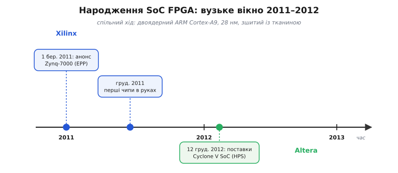

# 📜 Як за один рік зшили два світи

Довго ці два світи жили нарізно, і між ними стояла стіна, яку всі вважали природною. З одного боку — процесор: кремнієвий кристал, у якому все виточено наперед, ядро жене інструкції одну за одною, і швидкість його — плата за те, що він готовий і незмінний. З іншого — [FPGA](book:electronics/inside-fpga): поле однакових клітинок, яке [бітстрімом](book:electronics/programmable-logic) щоразу стає новою схемою, безмежно гнучке, зате повільніше й ненажерливе до площі. Хто хотів обидва — ставив на плату два окремі чипи й зводив між ними доріжки. Це працювало, але за кожен байт, що біг між кристалами, платили затримкою й проводами; на широкому потоці саме цей місток ставав стіною.

Була й спокуслива обхідна стежка — викласти процесор [прямо в тканині](book:electronics/soft-core), зібравши його з тих самих LUT і тригерів, що й решту логіки. Стежка справжня, нею ходять і досі, але вона крута: таке [м'яке ядро](book:electronics/soft-core) з'їдає тисячі клітинок і йде втричі-вдвічі повільніше за справжній процесор у кремнії. Викладати з тканини повноцінну систему з операційкою, мережею й екраном — марнотратство: пів чипа піде на процесор, і той усе одно повзтиме.

Напрошувалося третє: не два чипи й не процесор із тканини, а **справжній** процесор і **справжня** тканина на **одному** кристалі, поряд, зшиті просто в кремнії. Ідея на папері стара — та щоб її втілити, треба було вміти виточити на одному шматку кремнію і швидке процесорне ядро, і море програмованих клітинок, і широку шину між ними, ще й уклавшись у розумну ціну та живлення. Технологія дозріла лише на межі 2010-х. І сталося те, що в техніці стається на диво часто: двоє незалежних гравців дійшли до порогу майже водночас — і переступили його з різницею всього в кілька місяців.

Ця вставка — про той короткий, але вирішальний проміжок: хто, коли і **чому саме тоді** зшив два світи в один кристал, і чому це поєднання, а не кожна половина окремо, відкрило цілий клас задач, доти нікому не посильних.

## Дійові особи: дві компанії й одна архітектура

Перш ніж про дати — про тих, хто це зробив, бо тут легко переплутати ролі. На сцені троє, і кожен зіграв своє.

**Xilinx** (вимовляється «Зáйлінкс») — американська компанія з Каліфорнії, той самий гравець, що в 1985-му випустив [першу комерційну FPGA](book:electronics/inside-fpga) і фактично створив цілу галузь програмованої логіки. Для неї зшити процесор із тканиною було природним наступним кроком: тканина в неї вже була найкраща у світі, бракувало лише твердого ядра поряд.

**Altera** (вимовляється «Áлтера») — теж американська, теж каліфорнійська, головний і давній суперник Xilinx на ринку FPGA. Дві ці компанії десятиліттями йшли ніздря в ніздрю, і чого досягав один — за ним неминуче тягнувся другий. Тому нікого не здивувало, що ідею SoC FPGA вони втілили майже одночасно, кожен по-своєму.

А ось третій учасник — не виробник чипів, і його роль варто зрозуміти чітко, бо тут часто плутають. Процесорне ядро в обидва гібриди поставила **ARM** — британська компанія з Кембриджа, і поставила його **не як готовий чип**, а як **креслення**. У цьому вся суть бізнесу ARM: вона сама кремнію не пече, а розробляє процесорні ядра й **ліцензує** їх — продає право виточити ядро у власному кристалі за разову плату плюс відрахування з кожного проданого чипа. Xilinx і Altera обидві купили в ARM ліцензію на те саме ядро — **Cortex-A9** — і вбудували його у свій кремній поряд із тканиною. Тому серце обох гібридів однакове й британське за походженням, хоча самі кристали — американські.

> 🔧 **Навіщо це.** Ця розкладка ролей рятує від типової плутанини. Коли ви читаєте, що «в Zynq стоїть ARM Cortex-A9», це **не** означає, що чип зробила ARM — його зробив Xilinx, а ARM лише дала креслення ядра. Так само влаштована половина всієї сучасної електроніки: ядро проєктує ARM, а виточують його у своєму кремнії десятки різних компаній. Зрозумівши це раз, ви перестанете шукати неіснуючих «процесорів ARM» на полиці — ви шукатимете **чип конкретного виробника з ядром за ліцензією ARM усередині**.

Чому саме Cortex-A9, а не якесь інше ядро? Тут збіг був не випадковий. Cortex-A9 ARM представила ще 2007 року (архітектура ARMv7-A), і на межі 2010-х це було зріле, добре обкатане **прикладне** ядро — тобто здатне тягнути повноцінну операційну систему на кшталт Linux, з керуванням пам'яттю й кількома ядрами нараз. Саме таке ядро й потрібне для гібрида: не крихітний мікроконтролерний контролер, а справжній процесор, який потягне ОС поряд із тканиною. Обидві компанії взяли **двоядерний** варіант (ARM Cortex-A9 MPCore) — два ядра на одному кристалі, — і взяли його незалежно одна від одної, бо на той момент це був очевидний найкращий вибір для задачі.

## Xilinx б'є першим: Zynq-7000, 1 березня 2011

Першою на світ вийшла Xilinx. **1 березня 2011 року** вона оголосила родину **Zynq-7000** — і це усталена, добре задокументована дата анонсу (прес-реліз того дня зберігся дослівно). Саме тут уперше пролунало вголос те, що доти було лише ідеєю: двоядерний ARM Cortex-A9 і програмована тканина на одному 28-нанометровому кристалі, зшиті швидкою шиною.

Варто зупинитися на кількох речах із того оголошення, бо кожна згодом стане звичною деталлю в документації, і корисно знати, звідки вона взялася.

**Двоядерний Cortex-A9.** У прес-релізі дослівно: «кожен пристрій Zynq-7000 побудований на процесорній системі з двоядерним ARM Cortex-A9 MPCore». Тобто від самого початку це був не допоміжний контролер при тканині, а серйозний прикладний процесор — рівно те тверде ядро, заради якого й затівався гібрид.

**28 нанометрів.** Тканину Xilinx поклала на свій тодішній передовий 28-нм техпроцес. Це важило не лише для швидкості: тонший техпроцес — це щільніші клітинки й нижче живлення, тобто саме те, що вперше дозволило вмістити на одному кристалі і повноцінний процесор, і достатньо тканини, щоб гібрид мав сенс. Дозрівання техпроцесу — одна з причин, чому це сталося саме тоді, а не п'ятьма роками раніше.

**Шина AMBA4/AXI4.** Ось деталь, яку легко проґавити, а вона — серце всього. У релізі: «високопропускний зв'язок AMBA4 Advanced eXtensible Interface (AXI4) між процесорною системою та програмованою логікою забезпечує багатогігабітні передавання даних за дуже низької потужності». Впізнаєте? Це та сама [шина AXI](book:electronics/soc-fpga), якою в готовому гібриді процесор командує тканиною й читає з неї результати. І прикметно, що правила цієї шини — AMBA — розробила теж **ARM**: вони не з'явилися заради Zynq, це усталений набір правил зв'язку блоків усередині чипа, який ARM створила заздалегідь. Xilinx просто взяла готову, всім відому шину — і саме тому дві половини гібрида заговорили однією мовою легко й одразу.

А от над однією назвою варто зупинитися окремо — і чесно розрізнити, де тут факт, а де маркетинг. Xilinx назвала Zynq-7000 «**Extensible Processing Platform**» (EPP — «розширювана обчислювальна платформа») і додала гучне «industry's first» — «перша в галузі». Ось тут потрібна тверезість.

Сам **термін «Extensible Processing Platform» — це маркетинговий ярлик**, вигаданий відділом Xilinx, а не усталена технічна категорія. Пізніше сама ж Xilinx від нього тихо відмовилася й перейшла на нейтральніше «All Programmable SoC», а сьогодні такі чипи всі звуть просто **SoC FPGA**. Тобто гучна назва — це рекламна обгортка конкретного продукту, а не назва класу пристроїв; сприймати її треба саме так.

А що з «перша в галузі»? Тут статус тонший. Що Zynq-7000 **оголосили першою** — це факт: 1 березня 2011 Xilinx вийшла на сцену раніше за Altera. Але «оголосити» й «дати клієнту в руки» — різні події, і їх варто не плутати. Реальні кремнієві пристрої Zynq поїхали до перших замовників лише **8 грудня 2011 року** — теж задокументована дата. Тобто між гучним анонсом і першим чипом у руках інженера минуло дев'ять місяців — звична для цієї галузі відстань між «ми це зробимо» й «ось воно».

> 🔧 **Навіщо це.** Розрізняти три речі — усталений факт, маркетинговий ярлик і дату «в руках» — це не педантизм, а робоча звичка. Дата анонсу (1 бер. 2011) і дата перших поставок (груд. 2011) — тверді, перевірювані факти, на них можна спиратися. «Extensible Processing Platform» — рекламна назва, яку сьогодні ніхто не вживає, тож не шукайте її в сучасних довідниках. А «industry's first» правдиве лише в дуже вузькому сенсі «першими оголосили» — і навіть це варто тримати з поправкою на те, що суперник дихав у спину й відставав на місяці, а не на роки.

## Altera відповідає: Cyclone V SoC, грудень 2012

Відповідь суперника не забарилася — і саме її стислість найкраще показує, наскільки близько ці двоє йшли. **12 грудня 2012 року** Altera оголосила **перші поставки** своїх SoC-пристроїв — родини **Cyclone V SoC**. Зверніть увагу на слово: тут задокументована дата — це вже **поставки клієнтам**, а не просто анонс. Прес-реліз того дня дослівно каже про «28-нм SoC-пристрої, що поєднують процесорну систему з двоядерним ARM Cortex-A9 і FPGA-логіку на одному пристрої».

Порівняйте по-чесному, подія до події. Xilinx **оголосила** в березні 2011 і **почала постачати** в грудні 2011. Altera **почала постачати** в грудні 2012 — рівно на рік пізніше за перші поставки Xilinx. Тобто рік відставання за фактом поставок — але, як бачите, той самий рік, ті самі 28 нм, те саме двоядерне Cortex-A9. Не «навздогін через покоління», а ніздря в ніздрю, з відривом у місяці. Саме ця майже-одночасність — головний історичний факт: два незалежні гравці незалежно дійшли до одного порогу в одне й те саме коротке вікно, бо дозріли ті самі передумови.

Altera зшила свій гібрид трохи інакше — і різниця в іменах, а не в суті. Тверду процесорну частину вона назвала **Hard Processor System (HPS)** — «тверда процесорна система». Це просто її ім'я для тієї самої половини, що в Xilinx зветься [процесорною системою (PS)](book:electronics/soc-fpga): двоядерне Cortex-A9, кеш, [контролер пам'яті](book:electronics/memory-controller) і готова периферія, усе випечене в кремнії. За довідниковими даними родини, ядра HPS у Cyclone V ходять **до 925 МГц** — і тут теж варто позначити статус: ця цифра — стельова частота з технічної специфікації родини, а не гарантована швидкість кожного примірника; конкретний чип у конкретній системі може працювати повільніше залежно від виконання й умов.

Одну рису HPS у релізі підкреслили окремо, і вона того варта. Altera наголосила на **захисті даних наскрізь**: 32-бітна корекція помилок (ECC) у контролері зовнішньої пам'яті й ECC у купі внутрішніх блоків — кеші L2, службовій пам'яті, контролерах Ethernet і USB, інтерфейсах флеші. Це промовистий вибір акценту: він каже, що гібрид від початку націлювали не на іграшку, а на техніку, де збій одного біта неприпустимий, — на промислові й відповідальні застосунки. І тут же — та сама ключова здатність, що робить гібрид гібридом: **узгодженість даних** між твердою половиною та тканиною, спільний погляд обох у ту саму [пам'ять](book:electronics/soc-fpga) без ручного перекладання байтів.

*Вузьке вікно, у якому народився цілий клас чипів. Xilinx (над віссю): анонс Zynq-7000 — 1 березня 2011, перші пристрої в руках — грудень 2011. Altera (під віссю): перші поставки Cyclone V SoC — 12 грудня 2012. Дати анонсів і поставок — усталені факти; спільне для обох — двоядерний ARM Cortex-A9, 28 нм і шов між твердим ядром і тканиною.*

## Чому саме поєднання відкрило нове — а не кожна половина окремо

Тепер — головне «чому», заради якого й затівалася вся ця історія. Легко подумати, що SoC FPGA — це просто зручне пакування: замість двох чипів на платі один, менше місця, дешевше. Зручність справжня, але вона тут — наслідок, а не суть. Суть у тому, що поєднання відкрило задачі, які **жодна половина не тягла поодинці**, і жодна пара окремих чипів не тягла теж.

Розберімо на живому прикладі, бо саме на прикладі видно стіну, яку зламали. Уявіть камеру, що обробляє відео в реальному часі. Потік пікселів шалений — десятки мільйонів на секунду, і кожен треба однаково профільтрувати, перетворити, стиснути. Це чиста стихія тканини: сотні однакових операцій нараз, [паралельне залізо](book:electronics/programmable-logic) у чистому вигляді. Але та сама камера має вести мережу, тримати налаштування, малювати меню, писати файли, говорити з користувачем — розгалужена, «розумна», послідовна робота, у якій тканина громіздка й безпорадна, зате процесор із операційною системою — як удома.

Тепер спитайте: а чи не можна це зробити двома окремими чипами — FPGA для пікселів, процесор для решти? Можна. І тут вилазить стіна. Тканина перемолола кадр — і мусить віддати результат процесорові. Між двома окремими кристалами кожен байт біжить проводами по платі: це затримка, це обмежена ширина містка, це живлення на перегін даних. На вузькому струмочку — терпимо. На потоці відео в реальному часі — саме цей місток стає пляшковою шийкою, об яку розбивається вся швидкість тканини. Ви зробили тканину як слід, а користі з неї стільки, скільки пролізе через вузький прохід до процесора.

Ось цю стіну й прибрали, коли зшили обидві половини в один кристал. Шов між ними — [шина AXI прямо в кремнії](book:electronics/soc-fpga), широка й швидка, без проводів на платі. Ба більше: обидві половини дивляться в **одну спільну пам'ять**, узгоджено з кешем процесора — тканина читає масив звідти ж, звідки його бачить процесор, без ручного перекладання байт за байтом. Місток, що був стіною, зник. Уперше стало можливим тримати **обидва** світи навантаженими по-справжньому й водночас: тканина ловить кожен піксель на своїй скаженій частоті, процесор веде операційну систему й ухвалює рішення, а між ними — не вузький прохід, а широка спільна пам'ять.

Ось чому це був **новий клас** задач, а не просто зручніше пакування старих. Раніше інженер, якому треба було й серйозна паралельна обробка, і серйозний процесор із ОС, стояв перед поганим вибором: або тканина з кульгавим [м'яким ядром](book:electronics/soft-core), або два чипи зі стіною між ними. SoC FPGA прибрала цей вибір — і задачі, що доти або не робилися зовсім, або робилися дорого й погано (камери з розумною обробкою, вимірювальні прилади з широкою смугою й гарним інтерфейсом, [програмоване радіо](book:electronics/programmable-logic)), стали буденними. Не тому, що з'явилося щось одне нове, а тому, що двоє давніх, кожне саме по собі відоме, вперше поставили **впритул**, без стіни між ними.

> 🔧 **Навіщо це.** Головний урок цієї історії — практичний і напрочуд простий. SoC FPGA варто брати не тоді, коли «хочеться і процесор, і трохи логіки» (для дрібної логіки досить [м'якого ядра](book:electronics/soft-core), а для дрібного керування — [мікроконтролера](root:embedded/fpga-vs-mcu)), а рівно тоді, коли навантажені **обидві** половини всерйоз — і серйозна паралельна тканина, і серйозний процесор із операційною системою. Саме цей випадок — «обидва світи всерйоз, і між ними не має бути стіни» — і є та задача, заради якої 2011–2012 роками зшивали кремній. Якщо ваша задача така — гібрид окупить складність; якщо навантажена лише одна половина — стіни, яку прибирали, у вас просто немає, і платити за її прибирання нема за що.

## Що було далі й чому дати варто пам'ятати такими, які вони є

Дві родини, народжені в те вузьке вікно, живуть і досі — під новими прізвищами. Обидві компанії-засновниці згодом поглинули більші гравці, і це варто знати, щоб не плутатися в назвах сучасних довідників. **Altera 2015 року купила Intel** — і Cyclone V SoC на роки став «інтелівським», хоча згодом Altera знову відділилася. **Xilinx 14 лютого 2022 року купила AMD** — і Zynq відтоді формально належить AMD. Тому в одному документі ви побачите «Xilinx Zynq», в іншому «AMD Zynq», а це той самий чип; так само з «Altera Cyclone V» та «Intel Cyclone V». Змінилися вивіски, не кремній.

Наостанок — чому в усій цій розповіді я так наполягав на різниці між «оголосили» й «почали постачати», між усталеним фактом і маркетинговим ярликом. Бо історія техніки повниться гучними «перший у світі», за якими стоїть або лише прес-реліз без жодного чипа, або рекламна назва, видана за наукову категорію. Тут же факти чисті й перевірювані, і саме такими їх варто тримати: Xilinx **оголосила** Zynq-7000 **1 березня 2011** і **почала постачати** в **грудні 2011**; Altera **почала постачати** Cyclone V SoC **12 грудня 2012**; обидві взяли двоядерне ARM Cortex-A9 на 28 нм. «Extensible Processing Platform» — маркетинговий ярлик Xilinx, а не назва класу; «industry's first» правдиве лише у вузькому «першими оголосили». А головний факт — не в тому, хто на місяць випередив кого, а в тому, що **двоє незалежних гравців незалежно переступили один поріг в одне коротке вікно**, бо дозріли ті самі передумови, — і з того постав цілий клас чипів, у яких два давні світи вперше стоять упритул, без стіни між ними.
